********************************************
GoFAST :  Bonita
********************************************

Cette documentation donne accès aux ressources permettant de modéliser des workflows dans Bonita Studio implémentables dans la plateforme GoFAST.

Principes généraux
############################################

Formulaire d'instanciation
********************************

Un processus commence par un formulaire d'instanciation, qui doit retourner un certain nombre de valeurs attendues et définies dans un contrat. Si le contrat est vide :

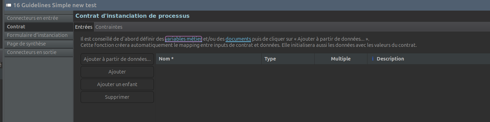

alors le formulaire l'instanciation ne doit retourner aucune valeur, sous peine d'erreur.

Déroulons un exemple (très) simple de création de formulaire d'instanciation, étape par étape. Le formulaire comprend une entrée pour remplir qui serait le rapporteur et une entrée pour remplir le document de travail. Ainsi, pour la première entrée, on aurait quelque chose comme ça :

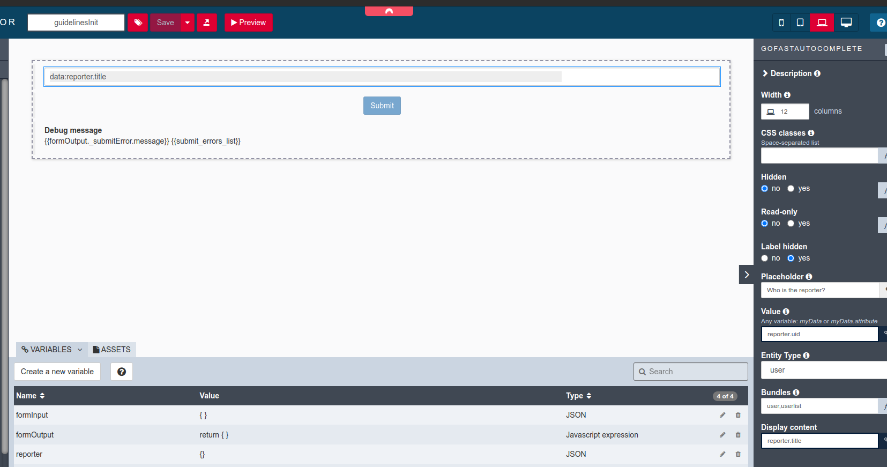

Nous mettons "user,userlist" dans Bundles pour qu'il prenne également les listes d'utilisateurs.

Notons également que j'ai ajouté une variable "reporter" afin de faire correspondre la valeur du widget à cette variable.

Pour le document on réalise quelque chose de similaire :

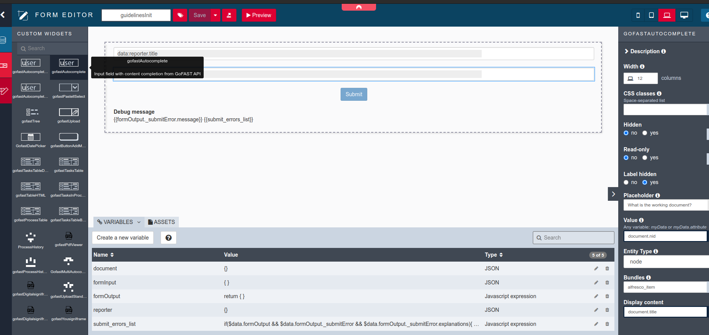

Vous pouvez adapter le formulaire à vos besoins, par exemple en mettant en place une URL de redirection après l'envoi du formulaire :

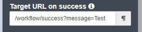

ou encore en mettant en place une logique de validation.

Modifiez la variable formOutput pour que le formulaire retourne réellement quelque chose :

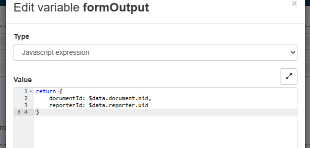

formInput doit également indiquer la structure de sortie :

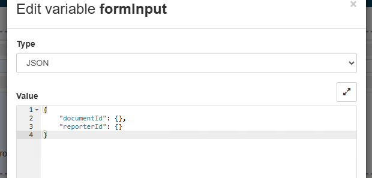

Ajoutez au contrat :

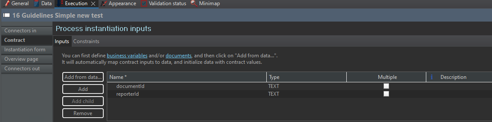

Enfin, faites persister les valeurs dans une variable de processus :

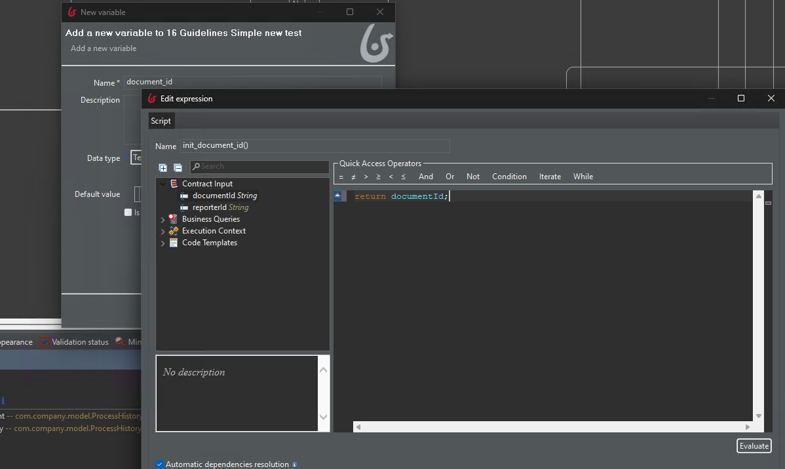

Assignation de tâche
********************************

L'acteur devrait par défaut être associé à tous les utilisateurs de la plateforme (c'est le groupe "Utilisateurs" dans GoFAST). Ensuite, nous ajoutons un filtre d'acteur pour que l'assigné de la tâche soit filtré pour être un utilisateur parmi tous ceux qui sont mappés à l'acteur.

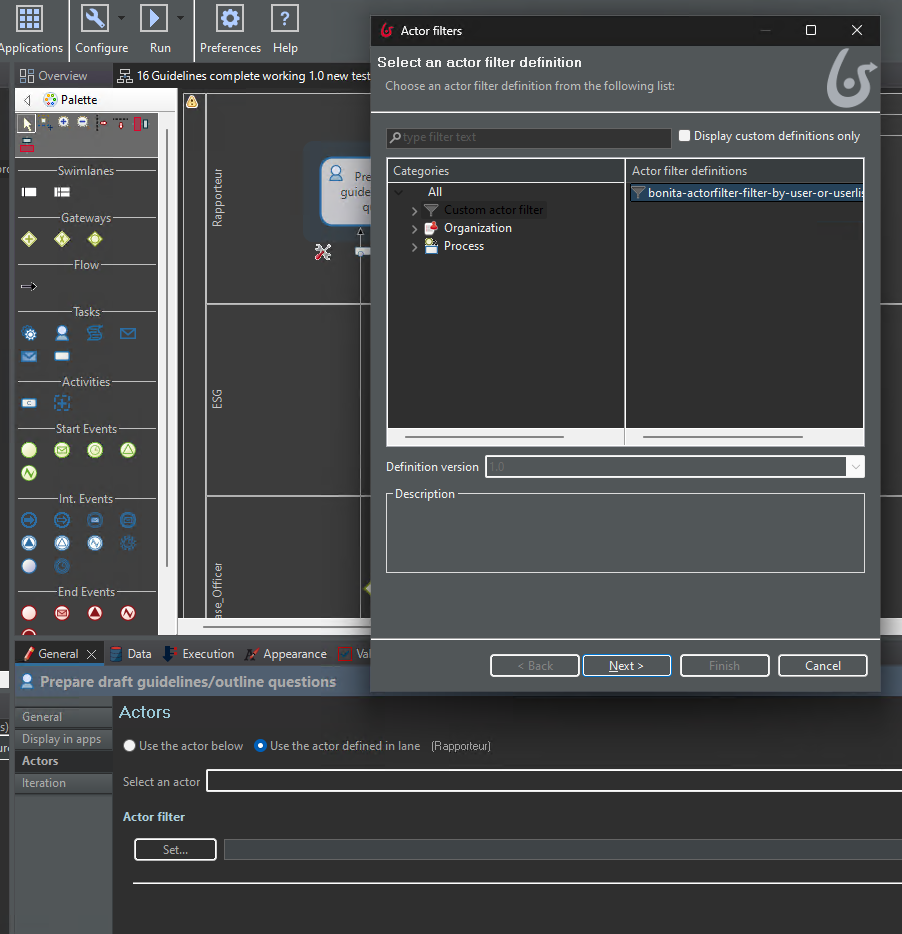

On lui indique la variable contenant le nom de l'assigné quand il demande le nom d'utilisateur :

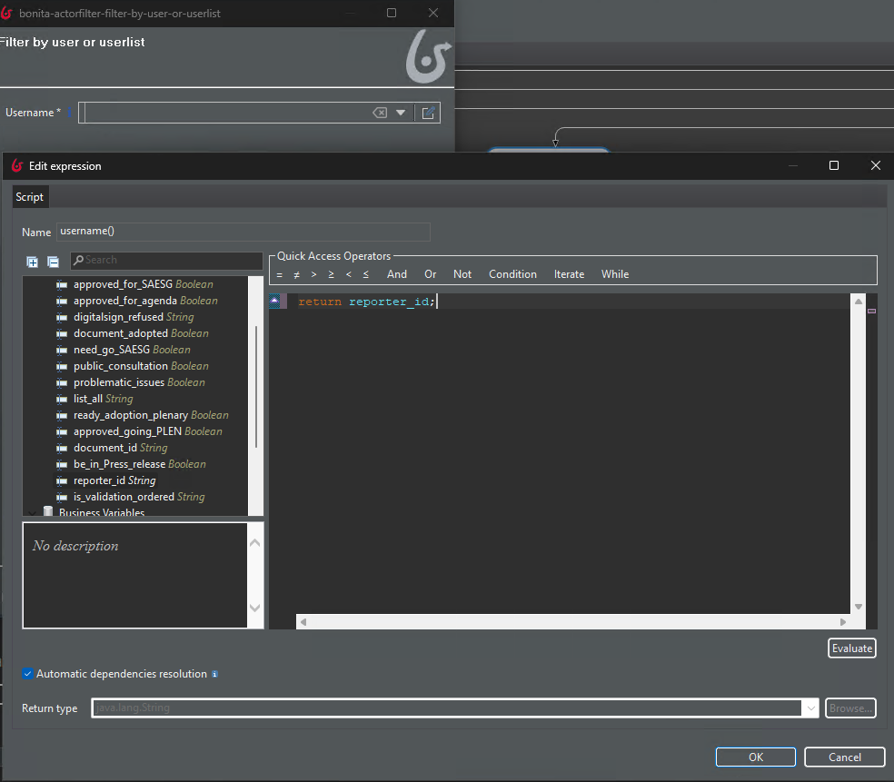

Et finalement on demande à Bonita d'utiliser le filtre d'acteur ("Use the actor below") :

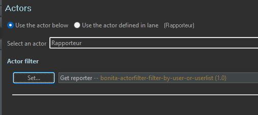

Il est également possible de réassigner de force une tâche via notre extension d'API Rest updateActorsOfUserTask

Sous-processus
*********************************

Le sous-processus est utile lorsque nous avons la même logique (par exemple tâche humaine, puis mise à jour de l'historique, puis mailing) à déclencher avec des valeurs initiales différentes.

Regardons cet exemple :

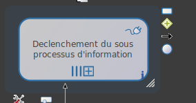

dans le sous-onglet "Itération" :

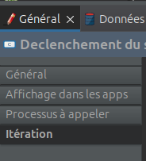

nous lui demandons d'exécuter tous les sous-processus en parallèle (mais nous aurions pu demander une séquence). Et pour chaque élément de la variable pool "rich_list_info", 1 sous-processus sera créé :

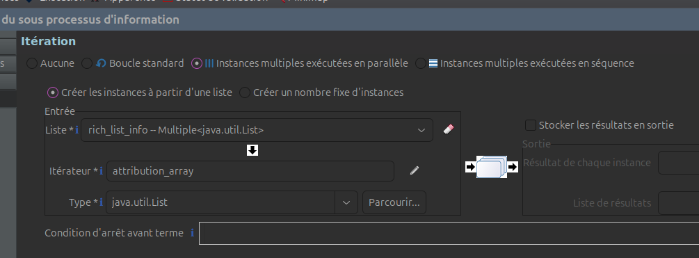

les données à envoyer au sous-processus sont définies dans l'onglet exécution :

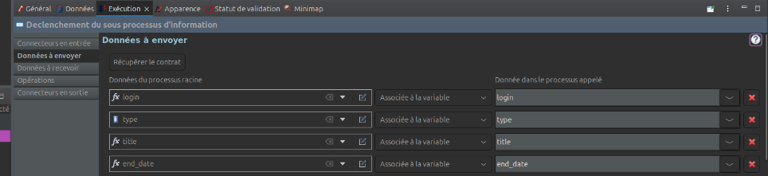

de sorte que toutes les variables correspondantes du sous-processus soient définies :

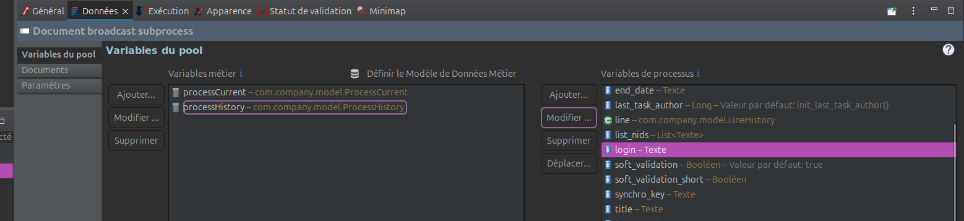

Dans le sous-processus, un filtre d'acteur est utilisé pour définir l'assigné d'après le login injecté :

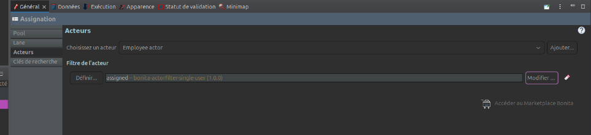

Connecteurs
############################################

Modifier métadonnée d'un document
*********************************
Coming soon

Envoyer email de notification
*********************************
Coming soon

Widgets
############################################

Widget : autocomplete
**********************

Types possibles : node, user.

Bundles possiblies : alfresco_item (node), user et userlist (user). Les bundles doivent être séparés par des virgules.

Widget: preview PDF
**********************

Souvent utilisé conjointement avec le widget standard des onglets :

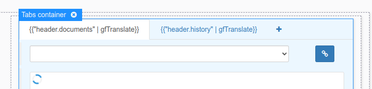

le widget chargé de la preview PDF s'appelle gofastPdfViewer :

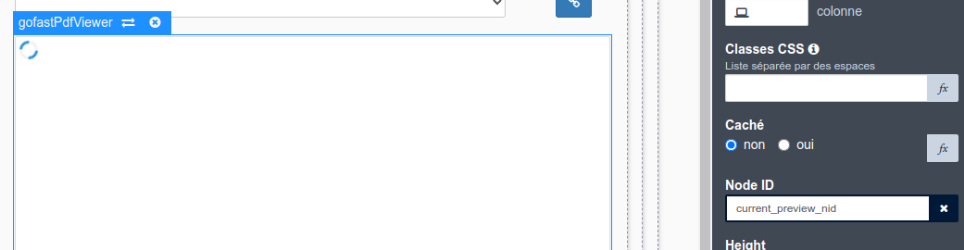

et il suffit de lui renseigner le node ID (l'ID du document sur GoFAST) pour qu'il fasse son travail.

Le node ID peut par exemple être récupéré à partir des variables du processus, en définissant dans le formulaire une variable de type "External API", qui appelerait l'API Bonita dédiée à la récupération des variables de processus.

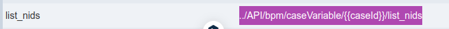

ensuite la valeur peut-être traitée dans une variable de type "Javascript Expression" : 

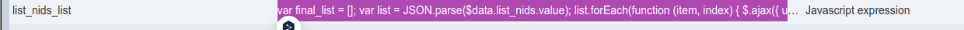

dans laquelle la variable utilisée par le widget est affectée :

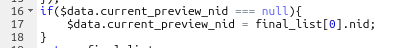

Extensions d'API REST
############################################
Coming soon
