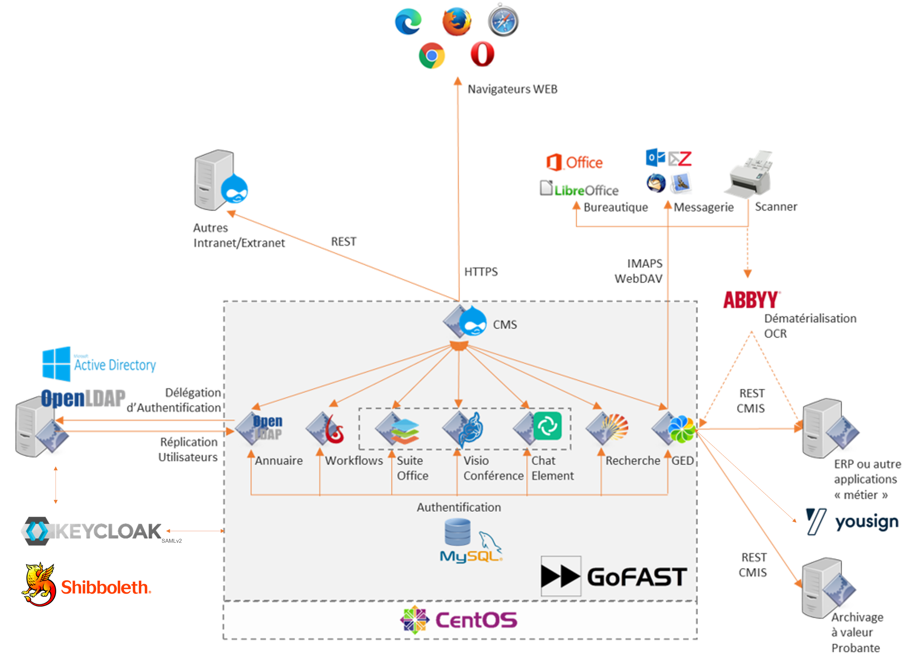
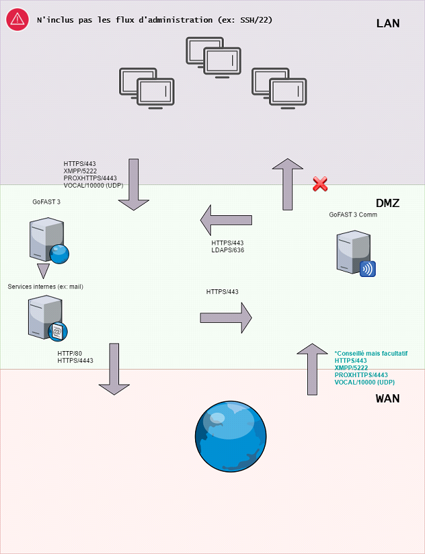
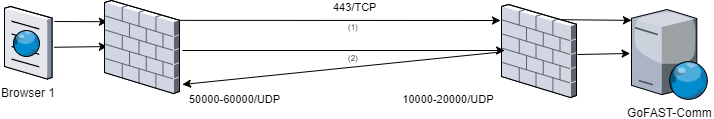
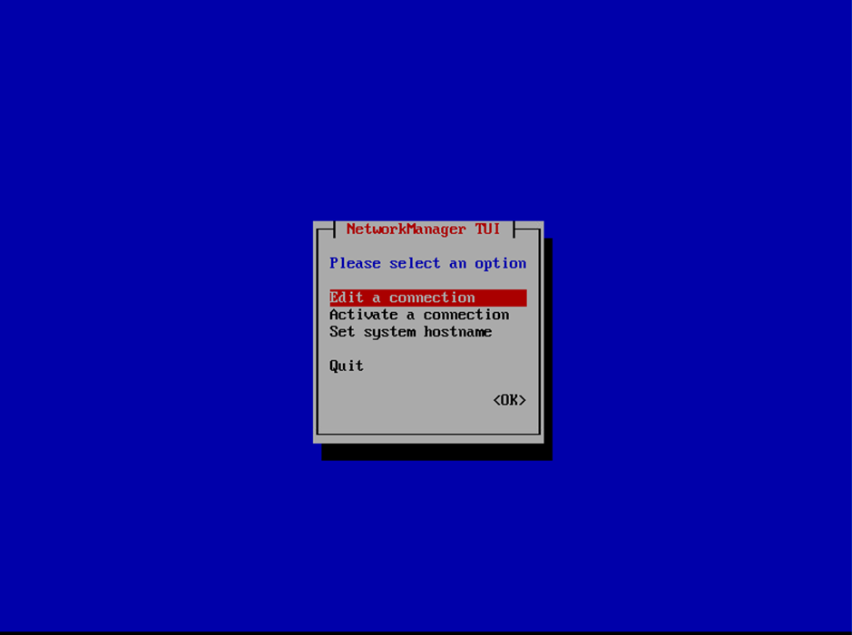

********************************************
GoFAST :  Pré-requis et installation Serveur
********************************************

Poste Client
==================================

Pré-requis 
------------

Voir http://gofast-docs.readthedocs.io/fr/latest/docs-gofast-users/doc-gofast-guide-utilisateurs.html#pre-requis-necessaires-pour-lutilisation-de-gofast

Composants et configurations optionnels 
------------------------

- Montage "Lecteur Réseau" (voir http://gofast-docs.readthedocs.io/fr/latest/docs-gofast-users/doc-gofast-guide-utilisateurs.html#ajouter-un-ou-plusiers-documents-par-le-lecteur-reseau)
- ITHitDocumentOpener (pour l'édition en ligne de contenus non-Office/LibreOffice)
- Synchronisation hors-ligne CMISSync (voir http://gofast-docs.readthedocs.io/fr/latest/docs-gofast-users/doc-gofast-utilisation-avancee.html#installation-cmissync)

Pré-requis et installation Serveur
==================================

Architecture
------------

+--------------------------------------+--------------------------------------+
|GoFAST3                                                                      |
+======================================+======================================+
|OS                                    | CentOS 7 64bits                      |
+--------------------------------------+--------------------------------------+
|CMS                                   | Drupal 7                             |
+--------------------------------------+--------------------------------------+
|Serveur Web & Reverse Proxy           | Apache 2.4 (php-fpm)                 |
+--------------------------------------+--------------------------------------+
|Base de données                       | MySQL 5.7                            |
+--------------------------------------+--------------------------------------+
|Annuaire                              | OpenLDAP 2.4                         |
+--------------------------------------+--------------------------------------+
|GED                                   | Alfresco 5.2 Community               |
+--------------------------------------+--------------------------------------+
|Recherche                             | Apache Solr 5                        |
+--------------------------------------+--------------------------------------+
|Serveur API                           | Apache Tomcat 7                      |
+--------------------------------------+--------------------------------------+
|Workflow (GoFAST 3.6+)                | Bonitasoft Community 7               |
+--------------------------------------+--------------------------------------+
|Workflow (<GoFAST 3.6+)               | Bonitasoft Community 6               |
+--------------------------------------+--------------------------------------+

   
+--------------------------------------+--------------------------------------+
|GoFAST  Comm-Serveur                                                         |
+======================================+======================================+
|Edition collaborative                 | OnlyOffice 5                         |
+--------------------------------------+--------------------------------------+
|Messagerie instantannée               |eJabberd 16                           |
+--------------------------------------+--------------------------------------+
|Webconference                         | Jitsi Meet 1.0                       |
+--------------------------------------+--------------------------------------+
|Reverse Proxy                         | nginx 1.12                           |
+--------------------------------------+--------------------------------------+

Pré-requis « serveur »
----------------------

La plate-forme GoFAST est une application d'entreprise qui nécessite une
architecture haute performance afin de délivrer une bonne montée en
charge et des temps de réponse.

.. CAUTION:: 
   GoFAST est notamment très sensible à la performance des entrées/sorties (I/O) et au bon dimensionnement de mémoire vive (RAM)
   
.. CAUTION::
   Conséquence de la sensibilité au I/O, une attention particulière doit être portée au stockage distant. Celui-ci doit privilégier le  type SAN. Eviter tout stockage distant WAN et de type NFS.

.. NOTE::
   GoFAST v3 nécessite par défaut 2 VM.

Pré-requis Machine Virtuelle
----------------------------

La plate-forme GoFAST est prévue pour fonctionner sur les Hyperviseurs
64 bits suivant :

-  VMWare ESX4+  

-  Hyper-V

-  KVM

-  HVM (Amazon Web Services)

et sans retour d'expérience en exploitation, XEN 6+

La VM GoFAST doit posséder un datastore dédié (LUN).

.. CAUTION:: 
   Sous VMWARE, choisir "RedHat Enterprise" et "paravirtualized SCSI adapter" à partir de CentOS 7.4 / GoFAST v3.1.1

*VM 2 (GF-COMM) n'est compris uniquement dans l'offre Enterprise

+-------------------+-------------------+--------------------+
|                   | VM 1 (GF)         | VM 2 (GF-COMM)*    |
+===================+===================+====================+
|Coeurs             | 4+                | 2+                 |
+-------------------+-------------------+--------------------+
|RAM                | 10GB+             | 6GB                |
+-------------------+-------------------+--------------------+
|Stockage           | 200GB+            | 50GB               |
+-------------------+-------------------+--------------------+
|IOPS(FIO)          | 250+              |                    |
+-------------------+-------------------+--------------------+
|Réseau             | 100Mpbs           | 100Mpbs            |
+-------------------+-------------------+--------------------+

.. NOTE::
   Une webconference avec 6 utilisateurs (dont 5 avec de la
   video) consomme 12Mbps (sortant), 3Mbps (entrant), 50% de CPU

Évaluation des besoins de stockage
~~~~~~~~~~~~~~~~~~~~~~~~~~~~~~~~~~

-  15 GB d'espace disque pour l'application et le système (partition
   ``/``)

-  Espace de stockage de données (partition ``/var``)

*Utilisation normale*

-  2 à 3 GB d'espace disque par utilisateurs 'débutants' pour leurs
   contenus personnels

-  4 à 6 GB par Groupes et Organisations prévus

*Utilisation intensive*

-  5 à 10 GB d'espace disque par utilisateurs 'débutants' pour leurs
   contenus personnels

-  10 à 20 GB par Groupes et Organisations prévus

Simulation d'espace disque pour 100 utilisateurs (x5GB), 10
organisations(x10GB), 15 groupes (x10GB) soit un total de 765 GB

Partitionnement optionnel
~~~~~~~~~~~~~~~~~~~~~~~~~

Les données sont stockées dans ``/var``

Il est très recommandé mais non obligatoire de créer une partition pour
``/var``.

.. CAUTION:: 
   Si la partition ``/var`` est sur un stockage distant (NAS/NFS ...) ceci ne doit 
   entrainer une forte dégradations des performances (IOPS) par rapport à un stockage local. Tout stockage WAN doit être évité 

.. CAUTION:: 
   Il est recommandé mais non obligatoire de créer une partition pour
   ``/var/backup`` pour la sauvegarde des données applicatives et ce point de
   montage devant être déporté
   
.. CAUTION::  
   La partition ``swap`` doit être au moins égale à 50% de la mémoire physique de la machine

Réseaux et Sécurité
-------------------

Certificat
~~~~~~~~~~

La **plate-forme GoFAST ne fonctionne qu'avec un certificat « serveur »
délivré par une autorité de certification.** Le certificat doit être au
format ``.pem``, ou\ ``.crt`` et ``.key``

.. CAUTION::
   Le certificat doit être de type « wildcard »

.. NOTE::
   Si GoFAST n’est accessible qu'en Intranet, le certificat peut
   être généré par les « Certificate Services » d' Active Directory.

Architecture Réseau
~~~~~~~~~~~~~~~~~~~

La plate-forme GoFAST peut s'installer :

-  préférablement sur une DMZ pour que la plate-forme soit accessible de
   l'extérieur (extranet, utilisation en mobilité, ...)

-  soit sur le réseau (LAN) de l'entreprise

-  soit sur un autre réseau accessible par Internet (attention dans ce
   cas aux performances, débit, routage, ...)
   
.. CAUTION::
   Si l'organisation utilise un Proxy pour l'accès à Internet des configurations particulières doivent être effectuées    

Liste des ports
~~~~~~~~~~~~~~~

Voici la liste des ports qui doivent pouvoir être accessibles en entrée
et en sortie.

+----------------------------------------------------------------+----------+----------+----------------------+---------------+
|                                                                | VM1      | VM2      | Ports entrants       | Ports sortants|
+================================================================+==========+==========+======================+===============+
| Installation de la plate-forme, mise à jour, flux RSS externes,| x        |          |                      | 80            |
| import de page Web, supervision                                |          |          |                      |               |
+----------------------------------------------------------------+----------+----------+----------------------+---------------+
| Accès à la plate-forme en HTTPS et WebDav                      | x        |          | 443                  |               |
+----------------------------------------------------------------+----------+----------+----------------------+---------------+
| Accès à la plate-forme en IMAPS                                | x        |          | 993                  |               |
+----------------------------------------------------------------+----------+----------+----------------------+---------------+
| Optionnel: import d'emails extrérieures                        | x        |          | 25                   |               |
+----------------------------------------------------------------+----------+----------+----------------------+---------------+
| Accès à l'annuaire LDAP GoFAST par le S.I de l'entreprise      | x        |          | 636                  |               |
| et par VM2                                                     |          |          |                      |               |
+----------------------------------------------------------------+----------+----------+----------------------+---------------+
| Envoi des mails de notification                                | x        |          |                      | 25 | 465      |
+----------------------------------------------------------------+----------+----------+----------------------+---------------+
| Collecte de la supervision                                     | x        | x        |                      | 443           |
+----------------------------------------------------------------+----------+----------+----------------------+---------------+
| Télé-administration (SSH)                                      | x        | x        | 22                   |               |
+----------------------------------------------------------------+----------+----------+----------------------+---------------+
| Supervision Zabbix                                             | x        | x        |                      | 10051         |
+----------------------------------------------------------------+----------+----------+----------------------+---------------+
| Optionnel: import de l'AD vers la GoFAST et/ou                 | x        | x        |                      | 636           |
| authentification par l'AD                                      |          |          |                      |               |
+----------------------------------------------------------------+----------+----------+----------------------+---------------+
| OnlyOffice (Co-édition)                                        |          | x        | 443                  |               |
+----------------------------------------------------------------+----------+----------+----------------------+---------------+
| Messagerie instantanée / Webconference                         |          | x        | 443                  |               |
|                                                                |          +----------+----------------------+               |
|                                                                |          | x        | 5222/TCP             |               |
|                                                                |          +----------+----------------------+               |
|                                                                |          | x        | 3478/TCP***          |               |
|                                                                |          +----------+----------------------+               |
|                                                                |          | \(x\)    | 80/TCP*              |               |
|                                                                |          +----------+----------------------+               |
|                                                                |          | x        | 10000-20000/UDP**    |               |
+----------------------------------------------------------------+----------+----------+----------------------+---------------+

|  \* si les ports udp ne peuvent être ouverts 
|  \*\* au minimum le port 10000 (un changement de configuration peut permettre éventuellement la plage 49152-65535/UDP comme Skype)
|  \*\*\* pour la video/desktopsharing dans le chat 

.. CAUTION:: 
   Si le participant n'est pas sur le LAN, *son accès Internet doit laisser passer le trafic sur le port 10000/udp*. Ceci peut poser des problèmes sur certains réseaux InternetPro par exemple des sites distants connectés au siège où se trouve le serveur GoFAST. A noter qu'il est rare que ce problème se retrouve sur les réseaux 4G.

   
Ressources WebRTC (Enterprise only)
----------------------------

.. class::
   Enterprise only

Le fonctionnement Webrtc est décrit ici : https://developer.mozilla.org/fr/docs/Web/Guide/API/WebRTC/WebRTC_architecture

Un diagnostic réseau est possible ici : https://www.netscan.co/  (cliquer sur "Scan my Network", le diagnostic est stocké sous forme d'une URL https://www.netscan.co/r/ayiIL )

.. NOTE::
 Contrairement au videochat, jitsi-meet ne nécessite pas de serveur STUN. 

Installation
============

Installation par import de VM
-----------------------------

CEO-Vision peut fournir une image de la VM sous forme OVA (format
universel), VHD (VHD), VMDK (VMWare).

Dans le cas du format OVA, une machine virtuelle avec des prérequis
standards est fournie.

Dans le cas d'image VHD ou VMDK, la machine virtuelle doit être créée au
préalable suivant les prérequis et l'image disque rattachée à cette
machine virtuelle.

.. CAUTION::
   Pour VMWare, vérifier que le "PVSCSI adapter" est bien utilisé

Pour information, l'image VMDK de VirtualBox a été au préalable
convertie pour VMWare à l'aide des commandes suivantes: ::

    # vmware-vdiskmanager ‑r GoFAST-VirtualBox.VMDK -t 0 GoFAST-ESX.VMDK
    # vmware-vdiskmanager -d GoFAST-ESX.VMDK
    # vmware-vdiskmanager -k GoFAST-ESX.VMDK

Reste ensuite une configuration de la VM définissant quelques
caractéristiques réseaux (nom de domaine, …)

Dans certains cas la machine virtuelle peut avoir un espace disque
alloué supérieur au partitionnement de la VM. Dans ce cas les opérations
suivantes sont à effectuer: ::

        # fdisk -l /dev/sda
        Disk /dev/sda: 68.7 GB, 68719476736 bytes
        255 heads, 63 sectors/track, 10443 cylinders
        Units = cylinders of 16065 * 512 = 8225280 bytes
        Device Boot Start End Blocks Id System
        /dev/sda1 * 1 13 104391 83 Linux
        /dev/sda2 14 8354 66999082+ 8e Linux LVM

        # fdisk /dev/sda
        n 					{new partition}
        p 					{primary partition}
        3 					{new partition number}
        t 					{change partition id}
        8e 					{Linux LVM partition}
        w

        reboot

        # fdisk -l /dev/sda
        Disk /dev/sda: 85.8 GB, 85899345920 bytes
        255 heads, 63 sectors/track, 10443 cylinders
        Units = cylinders of 16065 * 512 = 8225280 bytes
        Device Boot Start End Blocks Id System
        /dev/sda1 * 1 13 104391 83 Linux
        /dev/sda2 14 8354 66999082+ 8e Linux LVM
        /dev/sda3 8355 10443 16779892+ 8e Linux LVM

        # pvcreate /dev/sda3
        # vgdisplay
        # vgextend VolGroup00 /dev/sda3 {change VolGroup00 by vgdisplay result
        # lvextend /dev/VolGroup00/LogVol00 /dev/sda3 {change accordingly by vgdisplay result
        
        # resize2fs /dev/VolGroup00/LogVol00 {for ext4 and change VolGroup00 accordingly by vgdisplay result}
        **OR**
        # xfs-growthfs /dev/VolGroup00/LogVol00 {for xfs and change VolGroup00 accordingly by vgdisplay result}

.. CAUTION::
   la dernière opération peut prendre entre 30min et 1h30 pour une augmentation de 1To

Installation par script (Enterprise only)
-----------------------

.. class::
   Enterprise only

A noter que ce type d’installation engendre un coût supplémentaire
(facturation en régie).

Dans ce cas, une VM avec Centos 7 x64 Minimal est mise à disposition de CEO-Vision
qui fait ensuite une installation par script.

Post-installation de la VM (Enterprise only) 
==========================

.. class::
   Enterprise only
   
   
Configuration du réseau (par l’Exploitant)
--------------------------------------------
- Se connecter en SSH à la VM et lancer ``nmtui``
- Choisir ``Edit a connection`` puis l'interface, normalement ``ems33``

- Cliquer sur ``Show`` au niveau de ``IP v4 Configuration``
- Renseigner les informations (Manual, Addresses, Gateway, DNS serveurs)
.. figure:: media/nmtui-edit-connection.png
   :alt:
.. NOTE::
   Si votre GoFAST est accessible d'Internet, l'adresse est une IP publique
.. NOTE::
   Dans un environnement virtualisé, la passerelle (gateway) est l'adresse IP du host avec la fin remplacée par .254
   
- Sélectionner ``OK``
- Choisir ``Set system hostname`` normalement le même nom que celui ensuite entré dans les DNS
- Sortir de l'application
- ``reboot``
- A la reconnection, vérifier qu'internet est accessible ``ping 8.8.8.8``

Configuration / Paramétrage (par l’Exploitant)
--------------------------------------------

.. NOTE::
   Ces étapes sont très importantes et doivent etre faite le plus
   tot possible par l’exploitant/infogerant

-  Déposer sur le serveur le certificat SSL « wildcard » (clef publique
   et privée correspondant à ``*.mydomain.tld``, ex.
   ``gofast.ceo-vision.com``)

-  Entrer l'adresse IP et le nom de domaine de la GoFAST dans le DNS de
   l'entreprise

-  Créer des entrées DNS :

   -  Vers IP VM1

      -  ``gofast.mydomain.tld`` (ex. : ``gofast.ceo-vision.com``)

      -  ``gofast-mobile.mydomain.tld`` (ex. :
         ``gofast-mobile.ceo-vision.com``)

   -  Vers IP VM2

      -  ``gofast-comm.mydomain.tld`` (ex. :
         ``gofast-comm.ceo-vision.com``)

-  Vérifier que la plate-forme GoFAST a bien accès à Internet

-  Vérifier que toutes les interconnexions entre le VM fonctionnent sur
   les ports listés au paragraphe « Liste des ports »

-  Fournir des informations d'accès en télé-administration (SSH,
   passerelle SMTP …) à CEO-Vision

Configuration / Paramétrage par CEO-Vision
------------------------------------------

-  Vérification des pré-requis

-  Benchmark

-  OPTIONNEL : Configuration avec le proxy

-  OPTIONNEL : Couplage à l'annuaire OpenLDAP ou ActiveDirectory
   (optionnel)

-  OPTIONNEL : Configuration de la délégation d'authentification

-  Configuration smtp

-  Installation de la charte graphique

-  Activation des sondes de supervision

-  Installation des sondes APM (édition XXL)

Installation des sondes APM (en option sauf abonnement XXL)
-----------------------

Installation de l'agent PHP (monitoring applicatif)
~~~~~~~~~~~~~~~~~~~~~~~~~~~~~~~~~~~~~~~~~~~~~~~~~~~
::

        # rpm -Uvh http://yum.newrelic.com/pub/newrelic/el5/x86_64/newrelic-repo-5-3.noarch.rpm
        # yum install newrelic-php5
        # newrelic-install
        # yum update newrelic-php5
        # vi /etc/php.d/newrelic.ini 
        
              newrelic.appname = "CUSTOMER-GoFAST v3 (PHP)"
              newrelic.daemon.port = "@newrelic-daemon"

        # killall newrelic-daemon
        # service php-fpm restart

Dans les logs  ``tail -f /var/log/newrelic/php_agent.log``  
::
    2017-10-08 11:08:32.184 +0200 (30630 30630) info: New Relic 7.5.0.199 ("vaughan" - "00258123e757") [daemon='@newrelic-daemon'           php='5.6.31' zts=no sapi='fpm-fcgi'  pid=30630 ppid=1 uid=0 euid=0 gid=0 egid=0 backtrace=yes startup=agent os='Linux' rel='3.10.0-     693.2.2.el7.x86_64' mach='x86_64' ver='#1 SMP Tue Sep 12 22' node='BSGOFASTPROD02.botanic.com']
    2017-10-08 11:08:32.185 +0200 (30630 30630) info: spawned daemon child pid=30631

Installation de l'agent JAVA (monitoring applicatif tomcat - alfresco - solr)
~~~~~~~~~~~~~~~~~~~~~~~~~~~~~~~~~~~~~~~~~~~~~~~~~~~~~~~~~~~~~~~~~~~~~~~~~~~~~

Procédure de mise en place :
https://docs.newrelic.com/docs/agents/java-agent/installation/java-agent-manual-installation#h2-platform

Vérifications post-installation CEO-Vision
------------------------------------------

Configuration initiale du réseau
~~~~~~~~~~~~~~~~~~~~~~~~~~~~~~~~

Par défaut le fichier ``/etc/sysconfig/network-scripts/ifcfg-eth0``
contient les lignes suivantes: ::

        DEVICE="eth0"
        HWADDR= ADRESSE MAC
        NM_CONTROLLED="yes"
        ONBOOT="no"

Vérifier que les lignes suivantes sont présentes et correctement
remplies ::

        DEVICE="eth0"
        HWADDR= ADRESSE MAC
        NM_CONTROLLED="no"
        ONBOOT="yes"
        BOOTPROTO="static"
        IPADDR= adresse IP choisie
        NETMASK=255.255.255.0

::

    # cat /etc/sysconfig/network

::

    NETWORKING=yes
    HOSTNAME=gofast.MASOCIETE.COM|NET|FR

::

   # cat/etc/resolv.conf

::

    nameserver 8.8.8.8
    nameserver 8.8.4.4

Redémarrer le réseau. ::

    # /etc/init.d/network restart

Vérification des ports ouverts
~~~~~~~~~~~~~~~~~~~~~~~~~~~~~~

D'une machine autre que le serveur GoFAST, effectuer un scan des ports: ::

    # nmap 80.245.17.76

    Starting Nmap 4.11( http://www.insecure.org/nmap/ ) at 2012-08-06 21:03 CEST
    Interesting ports on 80.245.17.76:
    Not shown: 1674 filtered ports
    PORT 		STATE 	SERVICE
    22/tcp 		open 	ssh
    443/tcp 	open 	https
    993/tcp 	open 	imaps

Vérification du fonctionnement avec proxy
~~~~~~~~~~~~~~~~~~~~~~~~~~~~~~~~~~~~~~~~~

Si l'entreprise dispose d'un proxy pour les connexions vers internet, le
paramétrage suivant doit être réalisé ::

    $ sudo vi ~/.bashrc
    export http_proxy="http://proxy.com:8000"
    export no_proxy="127.0.0.1, localhost"

Vérification basique des performances
~~~~~~~~~~~~~~~~~~~~~~~~~~~~~~~~~~~~~

Installation de l'outil: ::

    GoFAST v1.x et 2.x
    $ sudo yum install http://dl.fedoraproject.org/pub/epel/6/x86_64/epel-release-6-8.noarch.rpm

    GoFAST v3.x et +
    $ sudo yum install http://dl.fedoraproject.org/pub/epel/7/x86_64/e/epel-release-7-5.noarch.rpm

    $ sudo yum install sysbench

Commandes pour obtenir l'environnement logiciel et matériel lors du bechmark: ::

# sudo dmidecode | egrep -i 'product name' 
# lscpu
# more /etc/centos-release
# df -T
# sudo lshw -class disk -class storage
# lsblk

CPU
^^^

Mesurer les performances de votre CPU en exécutant ce qui suit: ::

    Pour sysbench 1.0+:
    sysbench cpu --time=0 --events=10000 --threads=4 run

Exemple de résultat (en secondes, le plus petit le mieux): ::

    execution time (avg/stddev): 21.4200/0.00

File IO Benchmark
^^^^^^^^^^^^^^^^^

Pour mesurer les performances des E/S (entrées/sorties) il est
nécessaire de créer un fichier beaucoup plus grand que la mémoire vive
(RAM) disponible car sinon le système utilise la mémoire comme cache ce
qui fausse les résultats - 150GB est une bonne valeur pas toujours
utilisable (manque d'espace disque): ::

    sysbench --test=fileio --file-total-size=50G prepare

Ensuite, exécuter le benchmark: ::

    Pour sysbench 1.0+:
    sysbench fileio --file-total-size=50G --file-test-mode=rndrw --time=300 --max-requests=0 --threads=4 run

Exemple de résultat: ::

    Read 595.16Mb Written 396.77Mb Total transferred 991.92Mb (3.3056Mb/sec)211.56 Requests/sec executed

Puis vous pouvez effacer le fichier de test: ::

    sysbench --test=fileio --file-total-size=50G cleanup

File IO Benchmark (FIO)
^^^^^^^^^^^^^^^^^^^^^^^
::

    yum install fio

    fio -filename=/var/TESTIO -iodepth=64 -ioengine=libaio -direct=1 -rw=randrw -bs=4k -size=5G -numjobs=4 -runtime=30 -group_reporting -name=test-randwrite --rwmixread=30
    
    Nb: ajouter --unified_rw_reporting=1 si l'on veut un résultat aggloméré pour Read et Write
    
MySQL Benchmark
^^^^^^^^^^^^^^^

Pour mesurer la performance de la base de données MySQL, nous devons
d'abord créer une table **test** dans la base de données **test** (crée
manuellement) avec 1,000,000 lignes de données: ::

    sudo mysql -u root -p -e "CREATE DATABASE test;"

    Pour sysbench 1.0+:
    sysbench --test="/usr/share/sysbench/tests/include/oltp_legacy/oltp.lua" --db-driver=mysql --oltp-table-size=1000000 --mysql-db=test --mysql-user=root --mysql-password=mypassword prepare
    
Ensuite, exécuter le benchmark: ::

    sysbench --test="/usr/share/sysbench/tests/include/oltp_legacy/oltp.lua" --db-driver=mysql --oltp-table-size=1000000 --mysql-db=test --mysql-user=root --mysql-password=YOURDBPWD --time=90 --oltp-read-only=off --max-requests=0 --threads=4 run

Exemple de résultat: ::

    transactions: 			28235 (871.01 per sec.)

Indicateurs MySQL en fonctionnement normal
~~~~~~~~~~~~~~~~~~~~~~~~~~~~~~~~~~~~~~~~~~
::

    gofast.ceo-vision.com ~# mysqltuner -u root

    >> MySQLTuner 1.1.1 - Major Hayden <major@mhtx.net>
    >> Bug reports, feature requests, and downloads at http://mysqltuner.com/
    >> Run with '--help' for additional options and output filtering
    Please enter your MySQL administrative login: root
    Please enter your MySQL administrative password:

    -------- General Statistics --------------------------------------------------
    [--] Skipped version check for MySQLTuner script
    [OK] Currently running supported MySQL version 5.5.28-log
    [OK] Operating on 64-bit architecture

    -------- Storage Engine Statistics -------------------------------------------
    [--] Status: -Archive -BDB -Federated +InnoDB -ISAM -NDBCluster
    [--] Data in InnoDB tables: 84M (Tables: 298)
    [--] Data in PERFORMANCE_SCHEMA tables: 0B (Tables: 17)
    [!!] Total fragmented tables: 301

    -------- Security Recommendations -------------------------------------------

    [OK] All database users have passwords assigned

    -------- Performance Metrics -------------------------------------------------
    [--] Up for: 9m 6s (83K q [153.229 qps], 143 conn, TX: 69M, RX: 21M)
    [--] Reads / Writes: 81% / 19%
    [--] Total buffers: 544.0M global + 15.5M per thread (150 max threads)
    [OK] Maximum possible memory usage: 2.8G (49% of installed RAM)
    [OK] Slow queries: 0% (12/83K)
    [OK] Highest usage of available connections: 6% (9/150)
    [OK] Key buffer size / total MyISAM indexes: 128.0M/1.5M
    [OK] Key buffer hit rate: 100.0% (56K cached / 0 reads)
    [OK] Query cache efficiency: 74.0% (25K cached / 34K selects)
    [OK] Query cache prunes per day: 0
    [OK] Sorts requiring temporary tables: 0% (0 temp sorts / 2K sorts)
    [!!] Joins performed without indexes: 8
    [!!] Temporary tables created on disk: 39% (217 on disk / 550 total)
    [OK] Thread cache hit rate: 93% (9 created / 143 connections)
    [OK] Table cache hit rate: 98% (455 open / 462 opened)
    [OK] Open file limit used: 6% (263/4K)
    [OK] Table locks acquired immediately: 100% (27K immediate / 27K locks)
    [OK] InnoDB data size / buffer pool: 84.8M/150.0M

    -------- Recommendations -----------------------------------------------------

    General recommendations:
    	Run OPTIMIZE TABLE to defragment tables for better performance
    	MySQL started within last 24 hours - recommendations may be inaccurate
    	Adjust your join queries to always utilize indexes
    	When making adjustments, make tmp_table_size/max_heap_table_size equal
    	Reduce your SELECT DISTINCT queries without LIMIT clauses

    Variables to adjust:
    	join_buffer_size (> 10.0M, or always use indexes with joins)
    	tmp_table_size (> 200M)
    	max_heap_table_size (> 200M)

ANNEXE I : Problèmes courants
=============================

Pas d'envoi des mails techniques
--------------------------------

Configurer le relais SMTP dans sendmail (``/etc/postfix/main.cf``) ::

    relayhost = smtp.myorganisation.xxx # nom du relais

Connexion impossible à la GoFAST par la messagerie (IMAPS)
----------------------------------------------------------

Le test suivant doit fonctionner (fin de message « **\* OK IMAP4rev1
Server GreenMail ready** ») d'un serveur interne ou externe si la GoFAST
est sur une DMZ ::

    # openssl s_client -connect gofast.mydomain.tld:993

Dans le cas contraire vérifier que :

-  le port 993 est correctement ouvert (voir § sur la vérification des
   ports ouverts)

-  que le process « **stunnel**  »fonctionne

