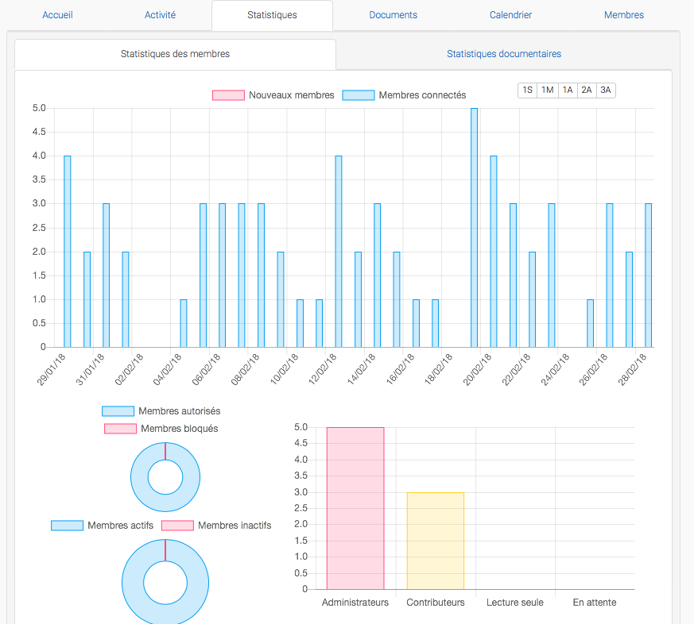
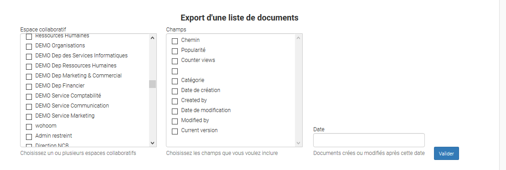

********************************************
GoFAST :  Version 3.2.0 
********************************************

Nouvelles fonctionnalités
############################################

.. csv-table:: 
   :header: "Ref.", "Description", "Catégorie"
   :widths: 10, 40, 10
   
   "[2703]", "Nouvel onglet dans les espaces : Système de statistiques", "Reporting"
   "[3718]", "Export de listes des documents sur GoFAST", "Reporting"
   "[3835]", "Export/Import de listes utilisateurs avec gestion des permissions", "Reporting"

Nouvel onglet dans les espaces : "Statistiques"
**********************
Un nouvel onglet "Statistiques" est maintenant intégré dans la page d'accueil des espaces. Cette nouvelle fonctionnalité permet de visualiser l'activité des membres actifs et inactifs. 

   :alt:

Export de liste des documents
**********************
Lorsque vous êtes Administrateur de la plate-forme, de nouveaux menus apparaissent tel que "Statistiques". Ce menu vous permet alors de visualiser toutes les statistiques documentaires liées à un Espace et ainsi pouvoir choisir et selectionner le Groupe et le Répertoire dont vous souhaitez extraire une liste de documents.   
Voir Copie d'Ecran ci-dessous 

   :alt:  
  
  
Import/Export de listes utilisateurs avec gestion des permissions
**********************  
Jusqu'à aujourd'hui, la gestion des listes utilisateurs et la gestion des droits d'accès se faisaient partiellement de manière manuelle. Il est maintenant possible de pouvoir travailler une liste d'utilisateurs et la gestion des membres par espace directement depuis un fichier Excel. Il est possible d'ainsi d'importer comme exporter ce document, que GoFAST va traiter en automatique. Cette gestion des utilisateurs et droits d'accès est faite uniquement par Espace.

.. figure:: media/Export_listes_utilisateurs_droits.png
   :alt:

Améliorations
############################################

.. csv-table::  
   :header: "Ref.", "Description", "Catégorie"
   :widths: 10, 40, 10
   
   "[3574]", "Amélioration de l'apparition des fenêtres (pop-up) sur les contenus du tableau de bord : afficher les emplacements", "Notifications"
   "[3603]", "Possibilité d'ajouter un lieu et les membres d'un espace comme participant dans la visio-conférence", "Visio-conférence"
   "[3754]", "Mise à jour JSXC 3.3.X : Les composants pour une meilleure performance de la fonctionnalité Chat", "Chat"
   "[3780]", "E-mail notifiant la création utlisateur : Adapter la délégation d'authenfication + amélioration du thême", "Notifications"
   "[3827]", "Amélioration du temps de chargement de la page d'un document", "Performance"
   "[3929]", "Amélioration des retours d'erreurs et de réussites lors des opérations unitaires ou en masse", "Retour d'informations"
   

Correction des bugs
############################################

HOTFIX
**********************
.. csv-table::  
   :header: "Ref.", "Description", "Catégorie"
   :widths: 10, 40, 10
   
   "[3810]", "Impossible de créer une publication si un trop grand nombres d'utilisateurs (erreur - JavaScript)", "Visio-conférence"
   "[3907]", "Pas de notification e-mail suite à la création d'une visio-conférence", "Visio-conférence"
   "[3908]", "Evènements créés de visio-conférences ne sont pas repris dans le calendrier", "Visio-conférence"
   "[3919]", "Mauvais positionnement de l'explorateur de fichiers suite au clique sur un emplacement", "Explorateur Web"
   "[3923]", "Pas de pré-visualisation après la création d'un fichier sous format de fichier Modèles", "Pré-visualisation"
   "[3952]", "Problème de pagination dans les commentaires sous un document", "Commentaire"
   "[3953]", "Impossible de publier un fichier sous format PDF : page relancée plutôt qu'informer sous pop-up", "Publication"
   "[3954]", "Problème d'auto-correction du type MIME (notamment pptx et version tecnique)", "Type MIME / Extension"
   "[3955]", "Lenteur du fil d'ariane", "Performance"
   "[3957]", "Quand on clique sur un menu d'un document, on est parfois redirigé vers l'URL au lieu d'avoir une modale", "Affichage"
   "[3959]", "La liste des workflows n'apparait pas", "Workflow"

Bugs majeurs
**********************
.. csv-table::  
   :header: "Ref.", "Description", "Catégorie"
   :widths: 10, 40, 10
   
   "[3069]", "Lors d'une recherche, aucun résultat ne s'affiche", "Recherche"
   "[3074]", "Document non trouvé, après un clic pour mener au répertoire concerné", "Explorateur Web"
   "[3211]", "Lors de la création d'un sous-espace, pas de pré-validation de l'espace parent", "Création d'espace"
   "[3570]", "Affichage des dates : ne s'affiche pas de partout sous format JJ/MM/AAAA", "Affichage"
   "[3808]", "Le formulaire de publication ne se charge pas, si un trop grand nombre d'espaces séléctionnés", "Formulaire" 
   "[3849]", "Lorsqu'on lie deux documents ensemble, aucune visibilité des documents pointant vers celui-ci", "Contenus liés"
   "[3854]", "Le renommage d'espace n'est pas pris en compte si l'espace contient trop de documents partagés", "Renommer"
   "[3877]", "Renommer un document fait perdre le type MIME du document", "Type MIME / Extension"
   "[3878]", "Temps d'attente trop long avant de pouvoir charger le menu contextuel, ou les métadonnées", "Performance"
   "[3930]", "Métadonnées se mettent automatiquement sur des documents ce qui mène à un comportement étrange", "Technique"
   "[3934]", "Le changement de nom/prénom n'est pas pris en compte dans les paramètres d'affichage des noms", "Utilisateur"
   "[3883]", "La régle de prévention des modifications/suppressions des dossiers d'espaces : mal créé en production", "Règles de prévention"

Bugs mineurs
**********************
.. csv-table::  
   :header: "Ref.", "Description", "Catégorie"
   :widths: 10, 40, 10
   
   "[3265]", "Lors de la mise à jour d'un document, problème d'affichage des annotations", "Commentaire"
   "[3439]", "Problème d'ajout d'un tag lors de la gestion en masse de la Taxonomie", "Tag"
   "[3532]", "Problème d'affichage du champs poste dans la carte de visite de l'annuaire", "Annuaire"
   "[3811]", "Problème de partage d'écran sous Google Chrome - (installation Plug-in)", "Visio-conférence"
   "[3855]", "Impossible d'avoir 2 visio-conférences sous le même nom", "Visio-conférence"
   "[3861]", "Filtres persistants dans l'annuaire utilisateur", "Annuaire"
   "[3869]", "Problème de navigation dans le forum", "Forum"
   "[3873]", "Problème des liens URL générés dans les workflow", "Workflow"
   "[3894]", "Le clic -Renommer Dossier- fait disparaître le texte (nom du dossier)", "Renommer"
   "[3904]", "Problème de la pré-visualisation du format Office", "Pré-visualisation"
   "[3921]", "Problème de suppression d'un message privé. Réapparait quand on raffraichit la page", "Chat"
   "[3925]", "Pas le bon avatar affiché lorsqu'une action est faite par un autre utilisateur", "Utilisateur"
   "[3932]", "L'explorateur de fichiers ne s'intancie pas dans certains cas", "Explorateurs Web"
   "[3937]", "Problème de synchronisation d'un nom d'espace avec son dossier dans l'explorateur de fichiers", "Explorateur Web"
   "[3946]", "Déplacer un sous-espace est partiellement fonctionnel : Temps de synchronisation long", "Performance"
   "[3949]", "Eviter les collisions lorsque plusieurs modifications sont faite simultanément", "Modification document"
 
