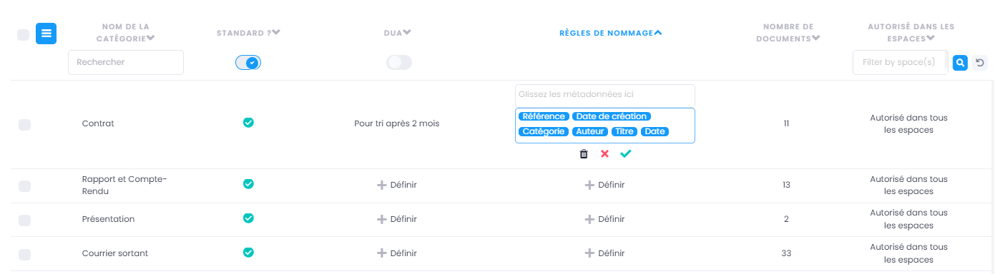
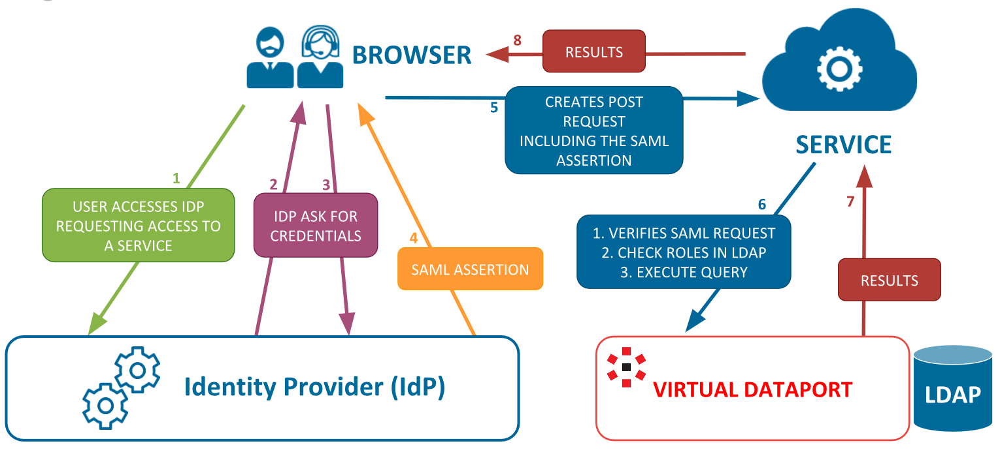

===========================
GoFAST : Administration 
===========================

Introduction
============

Cette partie de la documentation est destinée aux utilisateurs disposant d’au moins un des profils suivants : 
 - Super-administrateur
 - Support-utilisateurs

GoFAST permet de distinguer la notion de "Profils" qui donnent diverses permissions sur la plateforme, de la notion de "Rôles" dans les Espaces Collaboratifs. Attention donc à distinguer ces 2 notions différentes :
 - les **Profils** donnent diverses permissions d’administration sur la plateforme. Ces profils sont décorrélés des rôles qu’un utilisateur peut avoir au sein des Espaces Collaboratifs. Merci de vous référer à la rubrique "Profils disponibles" de cette documentation.
 - les **Rôles dans les Espaces Collaboratifs** : Administrateur, Contributeur, Lecture Seule. Un utilisateur peut avoir un de ces 3 rôles dans chaque Espace où il est membre. Il peut très bien avoir le rôle d’administrateur dans un espace, tout comme être en lecture seule ou contributeur dans d’autres Espaces. Pour les rôles liés aux Espaces Collaboratifs et leur administration, merci de vous référer à la rubrique "Gestion des Espaces Collaboratifs".

Profils disponibles
===============
Pour connaitre les profils qui vous sont attribués ou les rôles que vous avez dans les Espaces où vous êtes membres, vous pouvez aller sur votre page de profil-utilisateur, via votre photo en haut à droite, dans la barre des accès rapides. 

Les 3 profils principaux 
--------------------------------- 
 - **Standard** : aucune permission d’administration de la plateforme (c’est le profil le plus répondu parmi les utilisateurs). 
 - **Support-utilisateurs** : permet d’avoir une vue globale de l’arborescence des Espaces même s’il n’est pas membres de ces espaces (sans avoir accès aux contenus de ces espaces) et des comptes utilisateurs existants. Ce profil permet d’accompagner les autres utilisateurs dans la gestion des espaces (ex. pré-ajouter des membres), d’aider dans la prise en main et à la promotion des bonnes pratiques. 
 - **Super-administrateur** : il s’agit d’un profil technique qui permet de réaliser les diverses configurations de la plateforme (ex. coupler avec son annuaire interne, avec son serveur de messagerie…). Ce profil ne permet pas de voir l’arborescence des Espaces, ni des comptes existants (sauf pour les Espaces où cet utilisateur super-administrateur est membre).

.. NOTE::  Aucun "Profil" ne donne accès par défaut aux Espaces Collaboratifs, ni leurs contenus. Ces derniers sont gérés indépendamment, via la notion de membre et de rôle dans un espace. Il s’agit ici de garantir la confidentialité en évitant qu’un utilisateur technique ou de support n’ait accès à toutes données gérées sur la plateforme, sans qu’un responsable métier ne l’ait expressément ajouté comme membre d’un espace.

.. NOTE::  Un utilisateur ayant le profil "standard" ne peut pas être "Support-utilisateurs", ni "Super-administrateur". Il est possible de cumuler le profil "Support-utilisateurs" et "Super-administrateur" (pratique dans les petites structures/entreprises).

Autres profils disponibles
-----------------------------------
- **Externe** : destiné à identifier les utilisateurs externes à l’entité (entreprise/organisation), tels que les partenaires, prestataires, clients, fournisseurs, etc. Les externes n’ont pas accès aux espaces "Publics" qui sont réservés uniquement aux salariés/agents internes. 

.. NOTE::  Le profil externe ne peut pas être Support-Utilisateurs ou Super-Administrateur.

Pour les accès d'un utilisateur externe, merci de vous référez à la rubrique "GoFAST Administration / Support-utilisateurs / Configuration Accès utilisateurs externes".

- **Broadcaster** : permet de partager des documents dans des espaces collaboratifs sans en être membre, ou les espaces personnels des autres utilisateurs. Attention : ce profil ne permet pas de voir les contenus (ni dossiers, ni fichiers) dans ces espaces, mais uniquement d’en déposer.

.. NOTE::  Ce profil peut être cumulé avec les autres profils. 

 - **Restrictions des commentaires et annotations** : un utilisateur ayant ce profil ne peut faire que des commentaires et annotations privées. Il sera alors le seul à pouvoir les consulter et ne pourra pas les partager avec les autres utilisateurs (il s’agit des commentaires et annotations faits sur des documents/contenus).

.. NOTE::  Ce profil peut être cumulé avec le profil standard.

Tableau des permissions par profil
==================================

+------------------------------------------------------+----------------------+---------------------+
| Pages                                                | SUPER ADMINISTRATEUR | SUPPORT UTILISATEUR |
+======================================================+======================+=====================+
| Configuration de GoFAST / Général                    | OK                   | X                   |
+------------------------------------------------------+----------------------+---------------------+
| Configuration de GoFAST / SMTP                       | OK                   | X                   |
+------------------------------------------------------+----------------------+---------------------+
| Configuration de GoFAST / RSS                        | OK                   | X                   |
+------------------------------------------------------+----------------------+---------------------+
| Configuration de GoFAST / LDAP-AD                    | OK                   | X                   |
+------------------------------------------------------+----------------------+---------------------+
| Configuration de GoFAST / Utilisateurs               | OK                   | OK                  |
+------------------------------------------------------+----------------------+---------------------+
| Configuration de GoFAST / Documents                  | OK                   | X                   |
+------------------------------------------------------+----------------------+---------------------+
| Configuration de GoFAST / Espaces                    | OK                   | OK                  |
+------------------------------------------------------+----------------------+---------------------+
| Configuration de GoFAST / Etiquette                  | X                    | OK                  |
+------------------------------------------------------+----------------------+---------------------+
| Configuration de GoFAST / SSO                        | OK                   | X                   |
+------------------------------------------------------+----------------------+---------------------+
| Configuration de GoFAST / Visibilité                 | X                    | OK                  |
+------------------------------------------------------+----------------------+---------------------+
| Configuration de GoFAST / Recherche                  | OK                   | X                   |
+------------------------------------------------------+----------------------+---------------------+
| Configuration de GoFAST / Entités                    | X                    | OK                  |
+------------------------------------------------------+----------------------+---------------------+
| Configuration de GoFAST / Catégorie (DUA)            | X                    | OK                  |
+------------------------------------------------------+----------------------+---------------------+
| Configuration de GoFAST / Signature (module Yousign) | OK                   | X                   |
+------------------------------------------------------+----------------------+---------------------+
| Configuration de GoFAST / Pastell (module)           | OK                   | X                   |
+------------------------------------------------------+----------------------+---------------------+
| Configuration de GoFAST / Digital sign (module)      | OK                   | X                   |
+------------------------------------------------------+----------------------+---------------------+
| Configuration de GoFAST / Lien personalisé           | X                    | OK                  |
+------------------------------------------------------+----------------------+---------------------+
| Configuration de GoFAST /GoFAST BlueMind             | OK                   | X                   |
+------------------------------------------------------+----------------------+---------------------+

.. NOTE::  Pour les rôles liés aux Espaces Collaboratifs et leur administration, merci de vous référer à la rubrique "Gestion des Espaces Collaboratifs".

Profil « Support-utilisateurs »
========================
Le profil de "support-utilisateurs" a vocation d’accompagner les utilisateurs, en particulier ceux ayant le rôle administrateur d’espaces, dans la gestion des membres et veiller à la cohérence de l’arborescence des espaces. 

.. NOTE::  En aucun cas le profil de "support-utilisateurs" se substitue aux administrateurs des espaces collaboratifs, qui doivent être des responsables métiers (ex. chefs de services/directions, des responsables d’équipe/projets, etc.). Toutefois, il peut lui-même être un administrateur dans des Espaces dont il est membre.

Configuration Validation création utilisateurs
-------------------------------

Il est possible d’activer une option dans « Configuration » puis « Utilisateurs ». Cette option permet lorsqu’un administrateur métier/d’espace crée un nouvel utilisateur, de le soumettre à validation par un profil support-utilisateur avant d’être crée. 

Une fois que l’administrateur métier/d’espace a crée le nouvel utilisateur, le profil support-utilisateur reçoit une notification et peut valider ou refuser l’activation d’un profil utilisateur depuis la page de profil ou depuis l’annuaire (cette action peut se faire en masse).

Un utilisateur en attente de validation apparaît « En attente » dans l’annuaire.

Configuration Accès utilisateurs externes
-------------------------------

Dans « Configuration GoFAST » puis « Espace », vous trouverez la possibilité de limiter l’ajout d’utilisateurs externes dans certains espaces.

**Désactiver l'ajout des utilisateurs externes dans les groupes**
- Lorsque cette option est activée, un utilisateur externe ne peut pas être ajouté au type d’espace « Groupes ».
- Lorsque cette option est désactivée, un message d’avertissement s’affiche lorsque vous allez ajouté un utilisateur externe au type d’espace « Groupes ».

**Désactiver l'ajout des utilisateurs externes dans les organisations**
- Lorsque cette option est activée, un utilisateur externe ne peut pas être ajouté au type d’espace « Organisations ».
- Lorsque cette option est désactivée, un message d’avertissement s’affiche lorsque vous allez ajouté un utilisateur externe au type d’espace « Organisations ».

Visibilité sur les Espaces
--------------------------------
Le support-utilisateur a la visibilité de tous les Espaces Collaboratifs existants via l’annuaire des espaces et le moteur de recherche :
 - Dans le cas où il n’est pas membre, il ne pourra pas accéder aux contenus des Espace (ni fichiers, ni dossiers). 
 - Dans le cas où il est membre d’un espace, il peut y accéder et ces permissions dépondent alors du "rôle" qu’il a dans cet Espace.

.. NOTE::  Pour plus d’informations, merci de vous référer à la rubrique : « tableau des permissions par profil ».

Visibilité sur les Utilisateurs 
-------------------------------------
Le support-utilisateur a la visibilité de tous les utilisateurs existants via l’annuaire des listes et des utilisateurs, ainsi que le moteur de recherche :
 - Le support-utilisateur peut voir les comptes utilisateurs unitaires et dans une certaine mesure les gérer. 
 - Le support-utilisateur peut voir toutes les Listes d’utilisateurs, mais n’a pas la possibilité de les gérer s’il n’est ni créateur, ni administrateur désigné de ces listes. 

.. NOTE::  Pour plus d’informations, merci de vous référer à la rubrique : « tableau des permissions par profil ».

Autres visibilités / permissions
---------------------------------------------
Les autres éléments que le profil "support-utilisateur" permet de voir et gérer, sont : 
 - Configuration de la visibilité des espaces et entre les utilisateurs
 - Configuration des catégories de documents
 - Configuration des DUA par catégorie de document
 - Configuration du Lien Personnalisé
 - La base de "Contacts" non-utilisateurs (via le menu "Annuaires / Contacts")
 - Audit
 - Statistiques

Configuration : cloisonnement des Utilisateurs et des Espaces
--------------------------------------------------------------------------------
Cette configuration permet de définir le niveau de visibilité ou de cloisonnement des utilisateurs entre eux et celle sur les espaces. 
**Deux options disponibles :**
- Visibilité des Espaces Collaboratifs : Il s’agit ici d’ouvrir ou de restreindre le fait qu’un utilisateur puisse voir les espaces dont il n’est pas membre.
 - Visibilité entre les utilisateurs : Il s’agit ici d’ouvrir ou de restreindre le fait qu’un utilisateur puisse voir les autres utilisateurs avec qui il ne partage aucun espace.

.. NOTE::
   Seul le profil « support-utilisateurs » peut gérer le Cloisonnement de visibilité. 

.. NOTE:: Le cloisonnement s'applique uniquement pour les utilisateurs n'ayant aucun Espace Collaboratif en commun. Si deux utilisateurs sont membres d'un même espace, ils pourront dans tous les cas se voir entre eux.  

Visibilité entre les utilisateurs 
~~~~~~~~~~~~~~~~~~~~~~~~
Il s'agit de permettre aux utilisateurs de se voir entre eux dans l’annuaire des utilisateurs ou via le moteur de recherche, et de consulter leur profil. 

Il est possible de définir la visibilité ou le cloisonnement selon le « profil » des utilisateurs : 
 - Les utilisateurs ayant le profil « Externe » peuvent se voir ou pas entre eux.
 - Tous les utilisateurs indépendamment de leur « profil » peuvent se voir ou pas entre eux.

.. NOTE:: Le cloisonnement entre les utilisateurs externes permet d'éviter que des partenaires et prestataires ne se voient entre eux, sauf s’ils sont membres d’un même espace (à partir du niveau 2 de l’arborescence des espaces extranets). 

Visibilité des Espaces Collaboratifs 
~~~~~~~~~~~~~~~~~~~~~~~~~~~~~~
Il s'agit de permettre aux utilisateurs de voir ou pas les différents Espaces Collaboratifs dont ils ne sont pas membres. 

**Il est possible de définir la visibilité ou le cloisonnement selon le « profil » des utilisateurs :**
 - Les utilisateurs ayant le profil « Externe » peuvent ou non, voir l'ensemble des Espaces Collaboratifs (dans l’annuaire des Espaces ou via le moteur de recherche). 
 - Tous les utilisateurs indépendamment de leur profil peuvent ou non, voir l'ensemble des Espaces Collaboratifs (dans l’annuaire des Espaces ou via le moteur de recherche). 

.. NOTE::  Ce cloisonnement permet d'éviter que les utilisateurs ne voient l’existence des Espaces dont ils ne sont pas membres. Toutefois, même s’il n’y a aucun cloisonnement de visibilité, dans l’explorateur de fichiers ou le menu d’accès rapide aux Espaces (barre du haut), on ne voit que les Espaces dont on est membre.

.. NOTE::  Pour les utilisateurs ayant le profil « Externe », cela permet d'éviter que des partenaires et prestataires ne puissent consulter l'arborescence des Espaces internes (ex : Organisations et Groupes), ainsi que les Espaces destinés à d'autres partenaires ou prestataires. C'est important dans le cas où il y a des Espaces Extranets dédiés à des prestataires ou partenaires concurrents. 

Visibilité des utilisateurs Désactivés
~~~~~~~~~~~~~~~~~~~~~~~~~~~~~~
Pour des raisons de traçabilité (audit et sécurité), les utilisateurs ayant quitté l’entité (entreprise/organisation) seront désactivés sur la plate-forme et non supprimés définitivement. 

.. NOTE::  Attention à distinguer les utilisateurs « Désactivé » (volontairement), des utilisateurs « bloqués » (ceux ayant tenté de se connecter avec un mauvais mot de passe plus de 5 fois, et qui doivent être débloqués par un « support-utilisateurs » ou un « super-administrateur »).  

Les profils des utilisateurs désactivés sont inaccessibles et anonymisés aux yeux des utilisateurs standards. Seuls les administrateurs de la plate-forme (profil « support-utilisateurs ») peuvent les retrouver et les réactiver si besoin.

.. NOTE::  Les utilisateurs désactivés sont visibles par les utilisateurs « support-utilisateurs » dans l’annuaire des utilisateurs, dans tous les espaces où ils étaient membres, ainsi que via le moteur de recherche. 

**Désactiver/Réactiver un utilisateur :**
Pour désactiver ou réactiver un utilisateur et donc, bloquer ou autoriser son accès à la plateforme : 
 - Allez dans l’Annuaire des Utilisateurs et retrouvez-le grâce au tri et aux filtres disponibles. 
 - OU Recherchez l’utilisateur via le moteur de recherche (recherchez par nom, prénom ou identifiant).
 Puis…
 - Cliquez sur le menu « Burger » (les actions contextuelles) depuis l’annuaire ou la recherche. 
 - OU Allez sur son profil et cliquez sur le menu « Burger ». 
- Via le menu « Burger », cliquez sur « Désactiver » ou sur « Réactiver » puis sur « Confirmer ». 

.. figure:: media-guide/désactiver_utilisateurs.png
   
.. NOTE::
   Il y a une différence entre les utilisateurs « Inactifs » et les utilisateurs « Désactivés ». Les utilisateurs inactifs ne sont pas bloqués, ce sont des utilisateurs qui se connectent rarement sur la plate-forme.

Changer les identifiants des utilisateurs
-------------------------------------------

Il est possible de changer les identifiants, pour cela rendez-vous sur le profil dont vous souhaitez changer l’identifiant, cliquez sur la roue cranté, puis changez l’identifiant. 

.. figure:: media-guide/changement_id2.png

.. NOTE:: 
Pour changer l’identifiant, vous devez avoir le rôle de support administrateur et il ne faut pas que l'utilisateur ait l'authentification SASL de coché

Pré-ajouter des membres dans une liste d'utilisateur
------------------------------------------------------

Il est possible de pré-ajouter des membres dans une liste d'utilisateur. Pour cela il faut cliquer sur le menu burger, puis sur "Pré-ajouter des membres". Il vous faudra alors renseigner le ou les membre(s) à ajouter.

.. NOTE:: 
  Seul le rôle administrateur peut pré-ajouter des membres à une liste d'utilisateur dont il n'est pas administrateur

--------------------------------------
Les « Catégories » sont des métadonnées qu’un utilisateur peut appliquer sur les documents auxquels il a accès. Il s’agit du type de document, par exemple : courrier, facture, rapport, contrat, etc. 

.. NOTE::
   Seul le profil « support-utilisateurs » peut gérer les catégories. 

Créer/Modifier une catégorie et son emplacement
~~~~~~~~~~~~~~~~~~~~~~~~~~
GoFAST propose une liste standard des « Catégories » applicables sur les documents. Toutefois, il est possible d’ajouter des catégorises personnalisées, avec les traductions associées. 
**Pour ajouter de nouvelles catégories de documents :** 
 - Via le menu principal de gauche, allez dans « GoFAST Configuration »
 - Sur la page de configuration, allez dans le menu « Catégories »
 - Cliquez dans le menu burger sur « + Ajouter » ou en sélectionnant une des catégories existantes dans la liste. 
 - Si vous souhaitez créer une nouvelle catégorie, renseignez les champs dans « + Ajouter » en y saisissant le nom de votre catégorie (ex. Devis) dans les langues disponibles. 
 - Si vous souhaitez modifier une catégorie, selectionnez la catégorie non standard que vous souhaitez modifier, puis dans le menu burger selectionnez "Gérer les espaces". 
 - Cliquez sur « Enregistrer » pour valider.

.. NOTE::
   Seules les catégories non-standard peuvent être édités 

Date personnalisée 
----------------------
Il est possible de configurer un champ date, dans les métadonnés : 

Rendez-vous dans **GoFAST Configuration**, puis dans **Documents** ensuite, dans **Date personnalisée** vous pouvez donner un nom au champ optionnel de la date. 

Configuration : DUA (Durée de l'Utilité Administrative)
------------------------------------------------------------------------
Une « Durée de l'Utilité Administrative » permet de préparer les documents à l’archivage. 
Il s’agit de définir un chrono (en jours, mois, années) qui se déclenchera à partir du moment où le document est mis en état « pré-archivé » et dépendra de la durée définie pour la catégorie associée au document. 
A l’issue de cette durée, une alerte est envoyée aux utilisateurs identifiés comme « Archivistes » pour soit « Archiver », soit « Trier » ou « Détruire » le document.

.. NOTE::
   Seul le profil « support-utilisateurs » peut gérer les DUA. 

Où gérer les DUA :
~~~~~~~~~~~~~~~

 - À partir du menu principal de gauche, aller dans « GoFAST Configuration ».
   
 - Cliquez sur Catégories.

Créer ou modifier une DUA 
~~~~~~~~~~~~~~~~~~~~~~~
**Pour créer une nouvelle DUA :**
 - A partir d'une catégorie déjà existante, 
 - Dans la colonne DUA, sur la catégorie choisit, appuyez sur "+ Définir" 
 - Choisissez le temps que vous voulez, 
 - Puis validez. 

Appliquer une DUA 
~~~~~~~~~~~~~~~~~~~~~~
Pour appliquer une DUA, selectionnez la catégorie que vous voulez appliquer. Puis dans le menu burger selectionnez " Appliquer la DUA". 

Configuration : Règles de nommage 
--------------------------------------
Une règle de nommage permet de structurer et d'organiser les fichiers. Elle est appliquée lors de la selection d'une catégorie sur un document. 

Créer une règle de nommage 
~~~~~~~~~~~~~~~~~~~~~~~~~~~~~~~~~~
 - Via le menu principal de gauche, allez dans « GoFAST Configuration »
 - Sur la page de configuration, allez dans le menu « Catégories »
 - Dans la colonne "Règles de nommage", dans la  catégorie que vous souhaitez, cliquez sur "+ Définir" 
 - Glissez et déposez les métadonnées dans l'ordre voulu pour créer la structure de nommage. Les options disponibles incluent Référence, Date de création, Catégorie, Auteur, Titre, Date, etc.

Appliquer une règle de nommage 
~~~~~~~~~~~~~~~~~~~~~~~~~~~~~~

Pour appliquer la règle, rendez-vous sur le document voulu et sélectionnez la catégorie configurée dans l'onglet Catégorie. Un message s'affichera pour confirmer le changement de nom du document.

Vous pouvez aussi appliquer la règle de nommage à tout les documents ayant déjà une catégorie :
- Rendez-vous dans « GoFAST Configuration », puis "Catégorie" 
- Vous pouvez cocher le ou les règles de nommage que vous voulez appliquer, puis cliquer sur le menu burger et sur "Appliquer les règles de nommage".  

.. figure:: media-guide/règlesdenommage1.png

Supprimer une règle de nommage 
~~~~~~~~~~~~~~~~~~~~~~~~~~~~~~~~~~~~~~

Accédez à Gofast Configuration puis à la section Catégorie.
Trouvez la règle de nommage à supprimer. Dans la colonne Règles de nommage, cliquez sur la croix à droite de l'étiquette pour retirer une métadonnée spécifique, ou sur l'icône de la poubelle pour supprimer l'ensemble de la règle.

Statistiques 
-----------------
La vue des **Statistiques** permet de consulter diverses informations quant à l’activité sur la plateforme. Les informations sont restituées graphiquement, sur une période sélectionnée. 
**La vue des Statistiques est découpée en 3 parties :** 
 - Statistiques utilisateurs 
 - Statistiques documentaires 
 - Statistiques d’espaces

Il est également possible d’exporter les données.

Accès aux Statistiques
~~~~~~~~~~~~~~~~~~
Pour accéder aux statistiques, sélectionnez Statistiques dans le panneau de navigation de gauche. Cette section offre une vue d'ensemble des différentes métriques relatives aux utilisateurs, documents et espaces.
  

.. NOTE:: Seuls les utilisateurs ayant le profil « support-utilisateurs » sont habilités à accéder aux statistiques globales de la plateforme. Toutefois, les divers administrateurs des espaces peuvent également y accéder, mais les statistiques affichées seront limitées aux espaces qu’administrent ces utilisateurs.  

**Trois sous-onglets sont disponibles :** 
1. Onglet « **Statistique utilisateurs** »  
Indique la proportion d'utilisateurs bloqués, autorisés ou désactivés. Mais aussi les utilisateurs créés et les différentes connexions.
Activité des utilisateurs : Distingue les utilisateurs actifs des inactifs.
Rôle des utilisateurs : Répartition des utilisateurs selon leurs rôles au sein du système.

.. figure:: media-guide/stat12.png

Mais vous pouvez aussi choisir de trier les statistiques des utilisateurs par espace, en haut de la page. 

2. Onglet « **Statistique documentaires** », permet de visualiser le nombre de documents et les informations relatives aux documents par sa catégorie, son état et son importance.

Nombre de documents au cours du temps : Affiche l'évolution ou la distribution périodique des documents.

Stockage : Montre l'espace de stockage utilisé par rapport à l'espace libre. 
Indexation : Présente l'état d'indexation des documents. 

Métadonnées des documents : Visualisez la répartition des documents selon diverses métadonnées telles que la catégorie, l'état et l'importance. 

3. Onglet « **Statistiques d’espaces** », permet de visualiser le nombre d’espaces et les informations relatives aux espaces, leurs évolutions par période, les plus actifs, les plus remplis et les plus peuplés.

Nombre d'espaces au cours du temps : Suivez la croissance ou la distribution périodique des espaces. 
Activité : Identifiez les espaces les plus actifs, les plus remplis et les plus peuplés. 

Exporter les données
~~~~~~~~~~~~~~~~~~
L’export sera au format tableur (XLSX).

**Export des utilisateurs :**
Dans l’onglet **Statistiques utilisateurs** il est possible de réaliser un export de tous les utilisateurs existants, avec leur : 
 - numéro unique d’enregistrement (ID donné automatiquement à la création d’un utilisateur) 
 - leur identifiant utilisateur (utilisé pour se connecter)
 - l’email
 - Prénom
 - Nom
 - Date d’enregistrement (date de création du compte) 
 - Date de dernière connexion 
 - Statu (1 si actif = déjà connecté et 0 si non actif)
 - Colone « super-administrateur » (indiquant « VRAI » si a se profil OU « FAUX » si n’a pas ce profil)
 - Colone « support-administrateur » (indiquant « VRAI » si a se profil OU « FAUX » si n’a pas ce profil)
 - Colone « Admin d’espace » (indiquant « VRAI » si est administrateur d’au moins un espace collaboratif OU « FAUX » si n’administre aucun espace)
 - Colone « Broadcaster » (indiquant « VRAI » si a se profil OU « FAUX » si n’a pas ce profil)
 - Colone « Externe » (indiquant « VRAI » si a se profil OU « FAUX » si n’a pas ce profil)

**Export d’une liste de documents :**
Dans l’onglet **Statistiques documentaires** il est possible de réaliser un export de tous les fichiers existants dans un ou plusieurs espaces, avec leur :
 - « nid » (le numéro de référence automatique, attribué à la création du document et présent dans l’url de la page du document). 
 - Titre (du document)
 - Lien (vers la page du document)
 - Chemin (l’emplacement du document)
 - Version courante (le numéro de version actuelle du document)
 - Popularité (calculée automatiquement selon l’activité sur le document) 
 - Compteur de vues (nombre de fois où le document a été consulté dans une période donnée) 
 - Catégorie (du document)
 - Date de création (du document) 
 - Créé par (utilisateur ayant déposé/créé le document sur la plateforme) 
 - Date de modification (dernière date où le document a été modifié/édité)

.. NOTE:: Pour effectuer l’export d’une liste de documents, il est nécessaire de sélectionner au moins un espace.

.. NOTE:: Il est possible de sélectionner les informations de votre choix pour la liste des documents, en sélectionnant une ou plusieurs données parmi celles disponibles (cochez la case).  

**Export de la liste des espaces :**

Dans l’onglet **Statistiques d’espaces** il est possible de réaliser un export de tous les espaces existants, avec leur :
 - « ID » (le numéro de référence automatique, attribué à la création de l’espace et présent dans l’url de la page de l’espace).
 -  Titre (de l’espace)
 - Type (Organisation, Groupe, Public, Extranet) 
 -  Chemin (l’emplacement de l’espace)
 - Administrateurs (les utilisateurs ayant le rôle d’administrateur dans l’espace)
 - Contributeurs (les utilisateurs ayant le rôle contributeur dans l’espace)
 - Lecture seule (les utilisateurs ayant le rôle lecture-seule dans l’espace)

Dans l’onglet **Statistiques des espaces**, cliquez sur le bouton avec l’icône Excel. 

Une petite fenêtre s’ouvre et vous informe que votre export est en cours de génération. Dès que le téléchargement est lancé cette dernière se fermera automatiquement.

.. figure:: media-guide/fenêtre_export_espaces.png

Audit 
-------------
**La vue « Audit » liste et horodate les « événements » (les actions) effectués, dont :**
 - Création de nœud (création d’un document/contenus ou d’un espace) 
 - Connexions (d’un utilisateur)
 - Consultations du document
 - Consultation de documents/contenus
 - Mise à jour des documents/contenus
 - Mise à jour des emplacements 
 - Suppression d’espace
 - Espace archivé
 - Espace d’désarchivé 
 - Partage par email (d’un lien de téléchargement) 
 - Partage de lien téléchargé
 - Ajout d’un membre (dans un espace)
 - Suppression de membre (d’un espace) 
 - Créer utilisateur
 - Supprimer un utilisateur (s’il ne s’est jamais connecté) 
 - etc.

**Aller sur l’Audit :**

.. NOTE:: Cette fonctionnalité est accessible uniquement aux utilisateurs ayant le profil « support-utilisateur ». 

L’audit complet est accessible via le menu principal de gauche, en cliquant sur « Audit ». 
À partir de cette page **Audit** vous pouvez :
* Utiliser les filtres mis à disposition pour retrouver une action en particulier ou un contenu.
* Exporter l’audit dans la limite de 50 000 résultats

.. NOTE:: Par exemple, pour pourvoir restaurer un document : filtrez par type d’événement « suppression de nœud », puis indiquez une période pour restreindre d’avantage la liste. Une fois votre action retrouvée, cliquez sur le document/contenu concerné pour aller sur sa page et pouvoir le restaurer.

L’audit spécifique sur un document est accessible sur la page du document :
Vous pouvez voir les derniers événements effectués sur ce document, la date et l’heure des actions ainsi que les utilisateurs ayant effectué l’action.

   

Configuration : Lien Personnalisé
------------------------------------------
Le lien personnalisé permet d’ajouter un raccourci directement dans la barre du menu supérieur. 
Naviguez vers « GoFast Configuration », puis « Lien personnalisé ». 

Activation : 

1. Cochez la case « Afficher un lien personnalisé » pour activer le fonctionnalité. 
2. Dans le champs « Étiquette du lien personnalisé », saisissez le nom qui aparaîtra dans la barre de menu. Ce texte sera le libellé visible par les utilisateurs. 
3. Dans le champs « Lien du lien personnalisé » insérez l’URL complète vers laquelle le lien doit diriger. 
4. Après avoir remplit les champs nécéssaires , cliquez sur le bouton « Enregistrer » pour appliquer les modifications. 

   

Une fois enregistré, le lien personnalisé apparaîtra dans la barre de menu supérieure. Les utilisateurs pourront cliquer sur ce lien pour être redirigés vers l’adresse définie.

.. figure:: media-guide/lienpers2.png

Personnalisation
-----------------

GoFast propose diverses options de personnalisation permettant d'ajuster l'apparence de l'interface selon vos préférences.

**1. Titre de l'onglet:**  Il est possible de définir le titre qui apparaîtra lors du survol de l'onglet dans le navigateur. 

**2. Le message de bienvenue par défaut:** Il est possible de personnaliser le message de bienvenue qui s'affiche par défaut à la connexion.

**3. Logo en haut de la page:** Il est possible de choisir un logo qui apparaîtra en haut de la page, à gauche, sur toutes les pages après connexion.

Ces trois options de personnalisation peuvent être modifiées directement depuis 'GoFast Configuration' puis 'Général'.

.. figure:: media-guide/personnalisationmenu.png

Logo personnalisable de la page de connexion 
--------------------------------------------

GoFast permet aux administrateurs de personnaliser l’apparence de la page de connexion en y ajoutant un logo d’entreprise ou une image. 
1.	Accédez à « GoFast Configuration »  depuis le menu latéral gauche, et sélectionnez l’onglet « Général » 
2.	Activez l’option « Activer le logo » . 
3.	Chargez l’image de votre logo en cliquant sur « Charger le fichier image du logo » 

4.	Sélectionnez l’emplacement de votre logo sur la page de connexion. Trois emplacements sont disponibles pour l’affichage du logo : 
a.	Pos.1 : Au-dessus du formulaire de connexion. 
b.	Pos.2 Dans le coin en haut à droite 
c.	Pos.3 Au centre du bloc gauche
5.	Après avoir choisi l’emplacement souhaité, cliquez sur « Enregistrer » pour appliquer les changements. 

Vous avez également la possibilité de personnaliser votre interface !

`Cliquez ici <https://gofast-docs.readthedocs.io/fr/4.0/docs-gofast-users/doc-gofast-custom-style.html>`_

Politique de mots de passe 
----------------------------

Dans le panneau GoFast Configuration sélectionnez utilisateurs. Faites défiler vers le bas jusqu’à la sélection « politique de mots de passe ». 
Dans la section Politique de mot de passe, vous pourrez définir les éléments suivants : 
- **Nombre de mots de passes stockés dans l’historique** : Ce champ détermine combien de vos anciens mots de passe seront mémorisés par le système pour empêcher leur réutilisation. 
- **Longueur minimal du mot de passe** : vous pouvez imposer la longueur minimale que doit avoir un mot de passe. 
- **Durée de vie minimum du mot de passe** : spécifiez la durée minimale pendant laquelle un mot de passe doit être conservé avant que l’utilisateur puisse le changer. 
- **Durée de vie maximum du mot de passe** : indiquez la durée maximale d’utilisation d’un mot de passe avant que l’utilisateur ne soit obligé de le modifier. 

Paramètrage de GoFAST BlueMind 
---------------------------------------
Pour les administrateurs, le paramétrage du module GoFast BlueMind est nécessaire pour activer la synchronisation des calendriers pour tous les utilisateurs.

1.	Dans le panneau GoFast Configuration, sélectionnez « GoFast BlueMind".
2.	Entrez l'URL de votre serveur BlueMind.
3.	Cochez « Activer la synchronisation du calendrier » pour permettre la synchronisation.
4.	Cliquez sur « Enregistrer » pour confirmer la configuration.

En suivant cette procédure, vous assurez que les événements créés dans BlueMind seront synchronisés avec les calendriers GoFast des utilisateurs, leur permettant de bénéficier d'une expérience intégrée pour la gestion de leurs conférences et réunions.

Configuration : Import utilisateurs depuis LDAP/AD
-----------------------------------------------
En cours de mise à jour

Créer / Gérer les utilisateur(s)
-------------------------------------------

.. NOTE::  Le profil "support-utilisateur" peut créer des comptes-utilisateurs. Toutefois, il ne peut que les pré-ajouter dans les Espaces Collaboratifs car les administrateurs de ces Espaces devront valider l’accès pour ces nouveaux membres.  

Créer un utilisateur et lui donner des accès aux Espaces Collaboratifs
~~~~~~~~~~~~~~~~~~~~~~~~~~~~~~~~~~~~~~~~~~~~~~~~~~~~~~~~~~~
Pour savoir comment créer un utilisateur, merci de vous référer à la rubrique "Créer un utilisateur".  
Pour savoir comment ajouter un utilisateur ou une liste d’utilisateurs comme membre d’un espace, merci de vous référer à la rubrique "Ajouter un membre à un espace". 

Désactiver / activer (débloquer) un utilisateur
~~~~~~~~~~~~~~~~~~~~~~~~~~~~~~~~~~~~~~~~
**Les 3 statuts possibles pour un utilisateur :** 
 - "Désactivé" désigne un utilisateur qu’on a volontairement désactivé, par exemple s’il a quitté l’organisation/l’entreprise. 
 - "Bloqué" désigne un utilisateur qui a fait trop de tentatives échouées de connexion et pour des mesures de sécurité, son compte a été automatiquement bloqué. 
 - "Actif" désigne un utilisateur qui a un compte et qui peut accéder à la plateforme sous condition de se connecter avec son identifiant et mot de passe. 

**Modifier le statut d’un utilisateur :**
 - Depuis la page de profil d’un utilisateur : 
Rendez-vous sur la page d’un utilisateur, soit via une recherche par mot clef (ex. saisir le nom d’un utilisateur et cliquer sur le résultat de recherche de type "profil"), soit en passant par le menu des annuaires d’utilisateurs. 
Une fois sur la page de profil d’un utilisateur, cliquer sur le menu "burger" (= "menu des actions contextuelles"), puis sur "Réactiver l’utilisateur" ou "Désactiver cet utilisateur" ou "Débloquer cet utilisateur". Le texte affiché dans ce bouton dépond du statut de l’utilisateur. 

 - Depuis la page de l’annuaire des utilisateurs (modifier unitairement ou en masse) : 
Rendez-vous sur la page de l’annuaire des utilisateurs depuis le menu principal de gauche "Annuaires/Utilisateurs". 
Une fois sur l’annuaire, vous avez la possibilité de trier et de filtrer les utilisateurs (pour plus d’informations sur le filtrage et le tri, merci de vous référer à la rubrique "Annuaire Utilisateurs"). 
Vous pouvez modifier le statut d’un utilisateur unique : cliquez sur le menu "burger", puis sur "Réactiver l’utilisateur" ou "Désactiver cet utilisateur" ou "Débloquer cet utilisateur". Le texte affiché dans ce bouton dépond du statut de l’utilisateur.
Vous pouvez modifier le statut de plusieurs utilisateurs en une fois : dans la colonne de gauche vous disposez de cases à cocher. Sélectionnez les utilisateurs que vous souhaitez modifier, puis cliquez sur le menu "burger" qui se trouve tout en haut (ligne d’entête de l’annuaire, les autres menus étant grisés) et cliquez sur "Réactiver ces utilisateurs" ou "Désactiver ces utilisateurs" ou "Débloquer ces utilisateurs".

Modifier les informations d’un utilisateur
~~~~~~~~~~~~~~~~~~~~~~~~~~~~~~~~~~~~~~~~
Afin de modifier les informations liées à un utilisateur, il faut se rendre sur : 
 - La page de profil de l’utilisateur (depuis la recherche ou l’annuaire)
 - La page de l’annuaire des utilisateurs
 
Créer / Gérer les Listes d’utilisateurs
-------------------------------------------
**Visibilité des listes :**
Les utilisateurs ayant le profil « support-utilisateurs » peuvent voir toutes les listes existantes (même si non membre), soit via l’Annuaire des Listes, soit via le moteur de recherche. Ils peuvent alors voir les membres des listes et leurs administrateurs. 
**Actions depuis les listes :**
Les utilisateurs ayant le profil « support-utilisateurs » peuvent uniquement pré-ajouter une liste comme membre d’un espace. 
Ils n’ont pas la possibilité de gérer la liste elle-même, sauf s’il sont explicitement administrateur de cette liste (ou créateur).
Pour pouvoir réaliser les actions autorisées sur les listes, il faut allez dans l’Annuaire des Listes ou sur la page d’une liste (ex. depuis le moteur de recherche).

Créer / Gérer les espaces
----------------------------------
Les utilisateurs ayant le profil de « support-utilisateurs » ont la possibilité de réaliser diverses actions sur les espaces collaboratifs. Toutefois, la gestion des espaces et de leurs membres dépend de la validation des administrateurs de ces Espaces. 

.. NOTE::  merci de consulter l’introduction afin de comprendre les objectifs de ce profil dans la gestion de l’arborescence des Espaces Collaboratifs et des utilisateurs.

**Sur la page d’un espace, le « support-utilisateurs » peut consulter les onglets suivants :** 
 - Accueil
 - Statistiques
 - Membre
Les autres onglets lui seront verrouillé, à moins qu’il ne devienne membre de l’espace. 

Créer des Espaces à la "Racine"
~~~~~~~~~~~~~~~~~~~~~~~~~~~~~
 - Via la barre des accès rapides (menu du haut), cliquez sur "+" , puis sur espace, pus le type d’espace souhaité (Organisation, Groupe…)  
 - Espace à la racine = 1er niveau dans Organisations, Groupes, Extranet, Public
 - L’utilisateur ayant créé un espace devient automatiquement administrateur de cet espace. Il faut alors ajouter des administrateurs supplémentaires et les autres membres. 

.. NOTE::  Le profil « support-utilisateurs » est le seul à pouvoir créer un espace « à la racine ». 

Pour plus d’informations, merci de vous référer à la rubrique : « Créer un Espace Collaboratif ». 

Pré-ajouter des membres dans des Espaces Collaboratifs
~~~~~~~~~~~~~~~~~~~~~~~~~~~~~~~~~~~~~~~~~~~~~~
Pré-ajouter des membres signifie que l’accès aux espaces collaboratifs sera effectif uniquement après la validation de ce pré-ajout par au moins l’un des administrateurs de l’espace. 
Il est possible de pré-ajouter des membres : 
 - Via le menu « Burger » d’un espace (sur la page de l’espace, depuis l’annuaire des espaces ou depuis le résultat de recherche). 
 - Dans le menu « Burger » de l’espace, allez dans « voir plus »
 - Cliquez sur « pré-ajouter un membre / liste d’utilisateurs »
 - Renseignez les champs selon la procédure de la rubrique « Ajouter des membres »
 - Une demande sera envoyée aux administrateurs de l’espace pour valider ou rejeter la demande d’ajout des utilisateurs. 
 - Sur l’onglet « Membres » de l’espace, ces utilisateurs seront marqués « en attente ». 

Gérer l’onglet "Accueil" d’un Espace Collaboratif 
~~~~~~~~~~~~~~~~~~~~~~~~~~~~~~~~~~~~~~~
Le profil « support-utilisateur » a la possibilité de personnaliser l’onglet accueil d’un espace collaboratif. 
Pour éditer l’accueil de l’espace, il faut aller dans le menu « Burger » de l’espace, puis sur « Modifier l’accueil ».

Contacter Administrateurs d’Espaces
-------------------------------------------------------
Afin de correctement assister les utilisateurs, il est dans certains cas, nécessaire de demander à des administrateurs d’espaces d’effectuer certaines actions ou de leur demander l’accès aux espaces pour les effectuer soi-même. 
Par exemple, vous pouvez demander à un administrateur d’espace de modifier le rôle d’un autre membre ou tout simplement partager des bonnes pratiques.
Pour contacter les administrateurs d’un espace : 
 - Allez sur la page d’un Espace OU sur la page Annuaire des espaces.
 - Cliquez sur le menu « Burger », puis sur « Contacter administrateurs ». 
 - Une fenêtre s’ouvre pour rédiger le message et valider l’envoi. 

.. NOTE::  Cette action est possible avec le profil "Support-utilisateurs" ou "Super-administrateur". A la différence que seul le profil "Support-utilisateur" peut voir toute l’arborescence des Espaces Collaboratifs (via les annuaires et la recherche).

Restaurer un document
-----------------------------------------------
En cours de mise à jour
Merci de vous référer à la rubrique : « Gérer les Documents / Contenus ». 

Profil "Super-administrateur"
========================

Synchronisation automatique des comptes GOFAST avec AD/LDAP
------------------------------------------------------------------------------------------

GoFAST offre une nouvelle fonctionnalité qui permet de synchroniser automatiquement les utilisateurs depuis l’Annuaire de l’entreprise vers votre plate-forme collaborative. 
La synchronisation se fait uniquement avec des comptes qui possèdent des délégations d’authentification activées.
Les utilisateurs qui n’existent pas dans GoFAST mais qui sont présents sur l’Annuaire, au moment de la synchronisation ils seront créés et activés sur la plate-forme.
Dans le cas de suppression d’un utilisateur synchronisé coté Annuaire, ce dernier sera « Bloqué » sur GoFAST. Ce mécanisme permet de conserver la traçabilité des actions de cet utilisateur et de lui réaffecter ces informations dans certaines circonstances. 

.. NOTE:: Veuillez noter que les comptes ne disposant pas de délégations d’authentification seront hors cycle de synchronisation. Ils ne seront pas automatiquement bloqués ou débloqués de la plate-forme.

Connexion au Serveur LDAP / AD
~~~~~~~~~~~~~~~~~~~~~~~~~~~~~~~~~~~~~~~~
Pour établir la connexion avec votre Serveur LDAP, vous devez vous connecter à GoFAST en tant Administrateur technique.
Rendez-vous dans le panneau de configuration, puis cliquez sur « Serveur LDAP/AD » . 

Une fois la page affichée, dans la barre latérale gauche appuyer sur la rubrique « Serveur LDAP /AD ». Renseigner les paramètres de votre Serveur en respectant les préconisations indiquées ci-dessous :

**Name**:  Choisissez un nom unique pour cette configuration serveur.

**Type de serveur LDAP** :  Quatre types sont disponible, Active Directory, Open LDAP, Apple Open Directory, Novell. Ce champ est informatif. Son but est d'aider les valeurs par défaut et de donner des alertes de validation.

**Serveur LDAP** : Le nom de domaine ou l'adresse IP de votre serveur LDAP tel que « ad.unm.edu ». Pour SSL utilisez le format ldaps://DOMAIN tel que « ldaps://ad.unm.edu ».

**Port LDAP** : Le port TCP/IP sur le serveur ci-dessus qui accepte les connexions LDAP. Ceci doit être un entier.

**Utiliser Start-TLS** :  Cette option permet de sécuriser la communication entre les serveurs Drupal et LDAP à l’aide de TLS ( Pour utliser Start-TLS vous devez définir le port LDAP à 389 ).

**Suivre les références LDAP** : Le client LDAP suit les références (dans les réponses du serveur LDAP) vers d'autres serveurs LDAP. Cela nécessite que les paramètres de liaison indiqués sont également valides sur ces autres serveurs.

**Compte Service** : Certaines configurations LDAP interdisent ou restreignent les résultats des recherches anonymes. Ces LDAP requièrent une paire "DN/mot de passe" pour faire la liaison. Pour des raisons de sécurité, cette paire doit appartenir à un compte LDAP avec des permissions désactivées. Ceci est également nécessaire pour l'approvisionnement des comptes Drupal.

* **DN pour les recherches non anonymes**.

* **Mot de passe pour les recherches non anonymes**.

* **Base DNs pour les utilisateurs LDAP, les groupes et autres entrées** : Quels DNs ont des entrées appropriées pour cette configuration ? ex: ou=campus accounts,dc=ad,dc=uiuc,dc=edu. Gardez à l'esprit que chaque base supplémentaire double probablement le nombre de requêtes. Placez le plus utilisé en première position et préférez utiliser un DN de base élevée plutôt que deux DN de base faible. Entrez un DN par ligne dans le cas où plusieurs sont nécessaires.

Une fois toutes les informations correctement renseignées, un bouton est mis à disposition à la fin du formulaire « Test de connexion », celui-ci permet de tester la connexion entre GoFAST et le serveur LDAP. Un message d’information sera affiché à droite du bouton indiquant le succès ou l’échec de cette connexion. En cas d’échec, il est impératif de vérifier les paramètres et recommencer le test. Si le test est réussi, appuyer sur le bouton «Enregistrer» pour sauvegarder cette configuration.

.. NOTE:: Il est possible d’effectuer des modifications ou mettre en place une nouvelle configuration, seulement n’oubliez pas de tester la connexion ensuite enregistrer les changements uniquement en cas de réussite.

Activation de l'authentification déléguée SASL
~~~~~~~~~~~~~~~~~~~~~~~~~~~~~~~~~~~~~~~
Une fois la connexion établie avec le Serveur LDAP, aller dans la section «Authentification SASL» qui se trouve en bas du formulaire de paramètres,  cocher la case «Déléguer l’authentification au serveur LDAP». N’oubliez d’enregistrer pour lancer l’opération de délégation. Cette opération peut prendre quelques minutes selon le nombre d’utilisateurs actifs sur GoFAST. 

L'activation de l'authentification déléguée SASL permet aux utilisateurs de se connecter à GoFAST en utilisant les informations d'identification de l'entreprise (Active Directory, OpenLDAP...). 

.. NOTE:: L’authentification SASL ne fonctionne qu'avec les utilisateurs qui sont enregistrés dans l'annuaire de l'entreprise. En tant qu'administrateur, vous pouvez également activer/désactiver l'authentification déléguée pour un utilisateur spécifique directement à partir du formulaire de modification de compte. Assurez-vous que les paramètres LDAP sont appropriés pour que cette fonctionnalité puisse être activée.

Configuration de la synchronisation
~~~~~~~~~~~~~~~~~~~~~~~~~~~~~~~~~~~~~~~
Après avoir activé la délégation, une nouvelle section « Synchronisation d’annuaires » est visible en bas de la page, celle-ci est dédiée à la configuration de la synchronisation des comptes de la plate-forme avec l’annuaire distant paramétré plus haut.
Pour configurer la synchronisation, commencer par cocher la case « Synchroniser GoFAST avec l'annuaire configuré ». Ensuite aller dans la sous-section « Configuration » et choisissez la fréquence de synchronisation.

Vous pouvez aussi choisir de "Déléguer l'authentification au servur LDAP", l'activation de l'authentification déléguée SASL permet aux utilisateurs de se connecter à GoFAST en utilisant les informations d'identification de l'entreprise (Active Directory, OpenLDAP...). Notez que l'authentification SASL ne fonctionne qu'avec les utilisateurs qui sont enregistrés dans l'annuaire de l'entreprise. En tant qu'administrateur, vous pouvez également activer/désactiver l'authentification déléguée pour un utilisateur spécifique directement à partir du formulaire de modification de compte. Assurez-vous que les paramètres LDAP sont appropriés pour que cette fonctionnalité puisse être activée.

Deux autres sous-sections importantes sont à renseigner : 

* Association de champs (Obligatoire) :  Vous devez au moins renseigner les champs «Nom utilisateur» et «Adresse mail» par leurs attributs respectifs dans l’annuaire ( Exemple :  Nom utilisateur -> uid, Adresse mail -> mail ). Les autres champs sont facultatifs.

.. NOTE:: L'identifiant unique de l'utilisateur, généralement associé au samAccountName pour un Active Directory.

* Filtres (Facultatif) : Ici vous pouvez effectuer des filtres spécifiques pour votre requête de synchronisation. Il est recommandé de séparer chaque liste de filtres par des retours à la ligne.

Une fois la configuration de synchronisation est terminée, cliquer sur le bouton « Enregistrer » pour exécuter l’opération. 

Si toutefois, vous souhaitez effectuer une synchronisation avant la prochaine date définie, il suffit de cliquer sur le bouton « Synchronisation ».

Single Sign-On (SSO)
-------------------------------

Protocole utilisé par l'application
~~~~~~~~~~~~~~~~~~~~~~~~~~~~~
GoFAST exploite le protocole Security Assertion Markup Language Version 2.0 (SAML 2.0). Ce standard s'appuie sur la structuration de données au format XML.

Son fonctionnement fait intervenir un *fournisseur d'identité (Identity Provider ou IdP)* qui correspond à l'application fournissant l'identification d'une personne ainsi qu'un *fournisseur de service (Service Provider ou SP)* qui correspond à l'application sur laquelle on souhaite s'identifier. Dans notre cas, GoFAST est le *fournisseur de service (SP)*.

Configuration du fournisseur d'identité
~~~~~~~~~~~~~~~~~~~~~~~~~~~~~~~~~~~~~~~
Le paramétrage du fournisseur d'identité va permettre de dire à GoFAST comment et ou demander la vérification d'une identité. Cette configuration permet également de sécuriser l'échange au moyen de certificat(s).

**Les paramètres à remplir sont :** 
- *Nom* : Le nom du fournisseur d'identité. C'est ce nom qui sera affiché aux utilisateurs sur le formulaire de connexion.
- *Identifiant (ID) de l'entité* : Le champ 'entityID' qui permets d'identifier le fournisseur d'identité. Il s'agit généralement d'une URL.
- *Nom de l'application* : Le nom de l'application passé au fournisseur d'identité pour identifier l'origine de la requête.
- *URL de connexion de l'IDP* : L'URL de connexion du fournisseur d'identité.
- *URL de déconnexion de l'IDP* : L'URL de déconnexion du fournisseur d'identité.

Un certificat doit être fourni par le fournisseur d'identité. Ce certificat servira a identifier avec certitude le bon fournisseur d'identité.

Configuration du fournisseur de service
~~~~~~~~~~~~~~~~~~~~~~~~~~~~~~~~~~~~~~~
Le paramétrage du fournisseur de service permet à l'application de transmettre les bonnes informations au fournisseur d'identité dans le bon format et avec le bon niveau de sécurité.

Il est possible de définir des contacts techniques et support à transmettre à notre fournisseur d'identité : 

On peut également transmettre au fournisseur d'identité des informations sur l'organisation du fournisseur de service

Et enfin, nous accédons aux paramètres de sécurité qui vont permettre de s'adapter à notre fournisseur d'identité et de pouvoir communiquer avec lui. Les paramètres disponibles sont : 

*Attention*: Les 3 paramètres suivants nécessitent à GoFAST de connaitre la clé privée qui permettra de déchiffrer les informations côté IdP. Se renseigner auprès du support.

* *Champ 'NameID' chiffré* : Permets de chiffrer dans un format particulier l'information d'identité qui est transmise entre les applications
* *Requêtes 'Authn' signés* : Demande au SP (GoFAST) de signer ses requêtes vers l'IdP
* *Requêtes de déconnexion chiffrés* : Permets de chiffrer les demandes de connection vers l'IdP
* *Réponses de déconnexion chiffrés* : Permets de chiffrer les demandes de déconnection vers l'IdP

* *Messages signés requis* : Permets de demander à l'IdP de signer ses messages
* *Assertions signés requis* : Permets de demander à l'IdP de signer ses validations d'authentification
* *Champ 'NameID' chiffré* : Permets de demander à l'IdP de chiffrer le champ NameID dans le retour de la requête
* *Signature des métadonnées* : Applique notre signature et demande à l'IdP d'appliquer sa signature sur les métadonnées

Une fois la configuration terminée, un onglet métadonnées sera généré et contiendra les métadonnées à renseigner dans l'IdP pour enregistrer l'application SP (GoFAST) comme étant valide.

Sur la page de login, l'utilisateur pourra maintenant se connecter en cliquant sur le bouton "Se connecter avec XXX".

