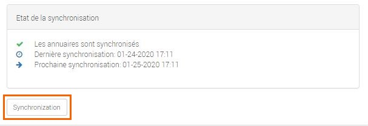
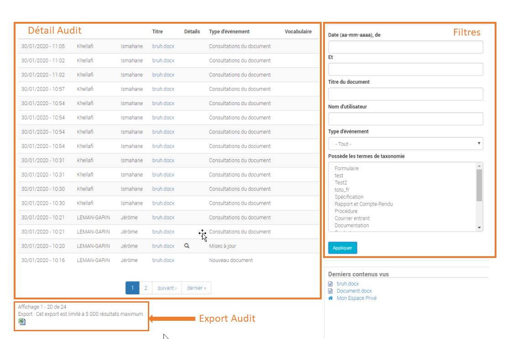
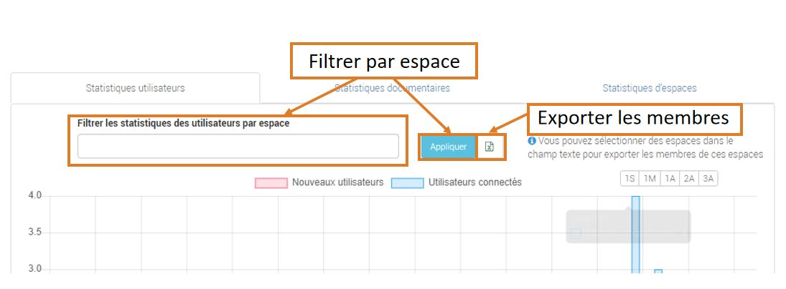

===========================
GoFAST : Administration 
===========================

Introduction
============

Cette partie de la documentation est destinée aux utilisateurs disposant du rôle "Super-Administrateur". Pour l'administration des Espaces Collaboratifs, merci de vous référer à la rubrique "Gestion des Espaces Collaboratifs". 

.. NOTE:: Le rôle "Super-Administrateur" donne accès à des fonctionnalités de configuration de GoFAST, mais en aucun cas ce rôle permet d’accéder par défaut aux Espaces Collaboratifs et documents par défaut. Il s’agit ici de garantir la confidentialité des données. Pour avoir accès aux contenus d’un Espace Collaboratif il est nécessaire d’être membre de cet Espace dont l’accès est donné uniquement par les administrateurs de l’Espace (en général des responsable métiers).  

   

Configuration de la visibilité des Utilisateurs et Espaces
==========================================================

Deux options sont disponibles : 
-------------------------------
 * Visibilité entre les utilisateurs
 * Visibilité des Espaces Collaboratifs

.. NOTE:: Cette configuration n'est pas liée aux rôles donnés dans les Espaces Collaboratifs, mais sur des rôles globaux sur GoFAST, à savoir : Utilisateurs Standard ou Extranet. 

.. NOTE:: Le cloisonnement s'applique uniquement pour les utilisateurs n'ayant aucun Espace Collaboratif en commun. Si deux utilisateurs sont membres d'un même espace, ils pourront dans tous les cas se voir entre eux.  

Visibilité entre les utilisateurs 
----------------------------------

Il s'agit de permettre aux utilisateurs de se voir entre eux dans l’annuaire des utilisateurs et de consulter les profils. 

GoFAST permet de séléctionner la visibilité ou le cloisonement selon le rôle des utilisateurs : 
 * Les utilisateurs ayant le rôle "Extranet" (rôle globale à la plateforme) peuvent se voir ou pas entre eux.
 * Tous les utilisateurs indépendament de leur rôle sur GoFAST peuvent se voir ou pas entre eux.

Le cloisonnement entre les utilisateurs extranets permet d'éviter que des partenaires et prestataires ne se voient entre eux.

Visibilité des Espaces Collaboratifs 
------------------------------------

Il s'agit de permettre aux utilisateurs de voir ou pas l'arborescence des différents Espaces Collaboratifs dont ils ne sont pas membres. . 

GoFAST permet de séléctionner la visibilité ou le cloisonement selon le rôle des utilisateurs : 
 * Les utilisateurs ayant le rôle "Extranet" (rôle globale à la plateforme) peuvent ou pas consulter l'ensemble de l'arborescence des Espaces Collaboratifs.
 * Tous les utilisateurs indépendament de leur rôle sur GoFAST peuvent ou pas consulter l'ensemble de l'arborescence des Espaces Collaboratifs.

Ce cloisonnement permet d'éviter que les utilisateurs ne puissent consulter les Espaces dont ils ne sont pas membres, dans l'annuaire des Espaces.
Pour les utilisateurs rôle Extranet, cela permet d'éviter que des partenaires et prestataires ne puissent consulter l'arborescence des Espaces internes (ex : Organisations et Groupes), ainsi que les Espaces déstinés à d'autres partenaires ou prestataires. C'est important dans le cas où il y a des Espaces Extranets dédiés à des concurrents. 

Visibilité des utilisateurs ayant quittés l'organisation ( Désactivés )
-----------------------------------------------------------------------
Pour des raisons de traçabilité, les utilisateurs ayant quittés l’organisation seront uniquement désactivés sur la plate-forme GoFAST et non supprimés définitivement. 

Leurs profils seront inaccessibles et anonymisés pour les utilisateurs classiques. Ils seront invisibles dans l’annuaire, dans tous les espaces ainsi que dans la recherche. Seuls les administrateurs de la plate-forme auront accès à une interface spécifique pour les retrouver et les ré-activer si besoin.

Désactiver un utilisateur 
~~~~~~~~~~~~~~~~~~~~~~~~~
Pour désactiver un utilisateur, connectez-vous en tant qu’administrateur de plate-forme puis afficher son profil à partir du menu «Annuaire» ou directement via la barre de recherche en tapant son nom.
Cliquer sur le bouton qui se trouve à droite des «Paramètres du compte» ensuite appuyer sur «Désactiver cet utilisateur» puis «Confirmer». 

.. figure:: media-guide/User-disable.jpg
   :alt: 

Tous les utilisateurs désactivés sont listés dans la page du menu «Utilisateurs bloqués» de l’annuaire.

Réactiver un utilisateur
~~~~~~~~~~~~~~~~~~~~~~~~
Pour réactiver un utilisateur, survoler le menu «Annuaires», puis cliquer sur le sous-menu «Utilisateurs bloqués». Aller sur la vignette de l’utilisateur concerné puis appuyer sur le lien «Réactiver cet utilisateur».

Ce dernier regagne la liste des utilisateurs actifs, récupère toutes ses données et sera visible sur toute la plate-forme (Espaces, recherche, ...). 

.. NOTE::
   Notez qu’il y a une différence entre les utilisateurs «Inactifs» et les utilisateurs bloqués «Désactivés». Les utilisateurs inactifs ne sont pas bloqués, ce sont des utilisateurs qui se connectent rarement sur la plate-forme.

Single Sign-On (SSO)
=====================

Protocole utilisé par l'application
------------------------------------

GoFAST exploite le protocole Security Assertion Markup Language Version 2.0 (SAML 2.0). Ce standard s'appuie sur la structuration de données au format XML.

Son fonctionnement fait intervenir un *fournisseur d'identité (Identity Provider ou IdP)* qui correspond à l'application fournissant l'identification d'une personne ainsi qu'un *fournisseur de service (Service Provider ou SP)* qui correspond à l'application sur laquelle on souhaite s'identifier. Dans notre cas, GoFAST est le *fournisseur de service (SP)*.

.. figure:: media-guide/sso_schema.png
   :alt: 

Configuration du fournisseur d'identité
----------------------------------------

Le paramétrage du fournisseur d'identité va permettre de dire à GoFAST comment et ou demander la vérification d'une identité. Cette configuration permets également de sécuriser l'échange au moyen de certificat(s).

Les paramètres à remplir sont : 

* *Nom* : Le nom du fournisseur d'identité. C'est ce nom qui sera affiché aux utilisateurs sur le formulaire de connexion.
* *Identifiant (ID) de l'entité* : Le champ 'entityID' qui permets d'identifier le fournisseur d'identité. Il s'agit généralement d'une URL.
* *Nom de l'application* : Le nom de l'application passé au fournisseur d'identité pour identifier l'origine de la requête.
* *URL de connexion de l'IDP* : L'URL de connexion du fournisseur d'identité.
* *URL de déconnexion de l'IDP* : L'URL de déconnexion du fournisseur d'identité.

Un certificat doit être fourni par le fournisseur d'identité. Ce certificat servira a identifier avec certitude le bon fournisseur d'identité.

.. figure:: media-guide/sso_idp_cert.png
   :alt: 

Configuration du fournisseur de service
----------------------------------------

Le paramétrage du fournisseur de service permets à l'application de transmettre les bonnes informations au fournisseur d'identité dans le bon format et avec le bon niveau de sécurité.

Il est possible de définir des contacts techniques et support à transmettre à notre fournisseur d'identité : 

.. figure:: media-guide/sso_sp_tech.png
   :alt: 

On peut également transmettre au fournisseur d'identité des informations sur l'organisation du fournisseur de service

Et enfin, nous accédons aux paramètres de sécurité qui vont permettre de s'adapter à notre fournisseur d'identité et de pouvoir communiquer avec lui. Les paramètres disponibles sont : 

*Attention*: Les 3 paramètres suivants nécessitent à GoFAST de connaitre la clé privée qui permettra de déchiffrer les informations côté IdP. Se renseigner auprès du support.

* *Champ 'NameID' chiffré* : Permets de chiffrer dans un format particulier l'information d'identité qui est transmise entre les applications
* *Requêtes 'Authn' signés* : Demande au SP (GoFAST) de signer ses requêtes vers l'IdP
* *Requêtes de déconnexion chiffrés* : Permets de chiffrer les demandes de connection vers l'IdP
* *Réponses de déconnexion chiffrés* : Permets de chiffrer les demandes de déconnection vers l'IdP

_______________

* *Messages signés requis* : Permets de demander à l'IdP de signer ses messages
* *Assertions signés requis* : Permets de demander à l'IdP de signer ses validations d'authentification
* *Champ 'NameID' chiffré* : Permets de demander à l'IdP de chiffrer le champ NameID dans le retour de la requête
* *Signature des métadonnées* : Applique notre signature et demande à l'IdP d'appliquer sa signature sur les métadonnées

Une fois la configuration terminée, un onglet métadonnées sera généré et contiendra les métadonnées à renseigner dans l'IdP pour enregistrer l'application SP (GoFAST) comme étant valide.

.. figure:: media-guide/sso_sp_metadata.png
   :alt: 

Sur la page de login, l'utilisateur pourra maintenant se connecter en cliquant sur le bouton "Se connecter avec XXX".

.. figure:: media-guide/sso_login.png
   :alt: 

Synchronisation automatique des comptes GOFAST avec AD/LDAP
===========================================================

GoFAST offre une nouvelle fonctionnalité qui permet de synchroniser automatiquement les utilisateurs depuis l’Annuaire de l’entreprise vers votre plate-forme collaborative. 

La synchronisation se fait uniquement avec des comptes qui possèdent des délégations d’authentification activées.

Les utilisateurs qui n’existent pas dans GoFAST mais qui sont présents sur l’Annuaire, au moment de la synchronisation ils seront crées et activés sur la plate-forme.

Dans le cas de suppression d’un utilisateur synchronisé coté Annuaire, ce dernier sera « Bloqué»  sur GoFAST. Ce mécanisme permet de conserver la traçabilité des actions de cet utilisateur et de lui réaffecter ces informations dans certaines circonstances. 

.. NOTE:: Veuillez noter que les comptes ne disposant pas de délégations d’authentification seront hors cycle de synchronisation. Ils ne seront pas automatiquement bloqués ou débloqués de la plate-forme.

Connexion au Serveur LDAP / AD
------------------------------

Pour établir la connexion avec votre Serveur LDAP e,   vous devez vous connecter à GoFAST en tant Administrateur technique.

Cliquer sur l’icône Burger qui se trouve à gauche du menu principal, ensuite aller dans « Administration » puis appuyer sur « GoFAST Configuration ».

.. figure:: media-guide/Synchro-ldap-access-menu.jpg
   :alt: 

Une fois la page affichée, dans la barre latérale gauche appuyer sur la rubrique « Serveur LDAP /AD ». Renseigner les paramètres de votre Serveur en respectant les préconisations indiquées ci-dessous :

**Name**:  Choisissez un nom unique pour cette configuration serveur.

**Type de serveur LDAP** :  Quatre types sont disponible, Active Directory, Open LDAP, Apple Open Directory, Novell. Ce champ est informatif. Son but est d'aider les valeurs par défaut et de donner des alertes de validation.

**Serveur LDAP** : Le nom de domaine ou l'adresse IP de votre serveur LDAP tel que « ad.unm.edu ». Pour SSL utilisez le format ldaps://DOMAIN tel que « ldaps://ad.unm.edu ».

**Port LDAP** : Le port TCP/IP sur le serveur ci-dessus qui accepte les connexions LDAP. Ceci doit être un entier.

**Utiliser Start-TLS** :  Cette option permet de sécuriser la communication entre les serveurs Drupal et LDAP à l’aide de TLS ( Pour utliser Start-TLS vous devez définir le port LDAP à 389 ).

**Suivre les références LDAP** : Le client LDAP suit les références (dans les réponses du serveur LDAP) vers d'autres serveurs LDAP. Cela nécessite que les paramètres de liaison indiqués sont également valides sur ces autres serveurs.

**Compte Service** : Certaines configurations LDAP interdisent ou restreignent les résultats des recherches anonymes. Ces LDAP requièrent une paire "DN/mot de passe" pour faire la liaison. Pour des raisons de sécurité, cette paire doit appartenir à un compte LDAP avec des permissions désactivées. Ceci est également nécessaire pour l'approvisionnement des comptes Drupal.

* **DN pour les recherches non anonymes**.

* **Mot de passe pour les recherches non anonymes**.

* **Base DNs pour les utilisateurs LDAP, les groupes et autres entrées** : Quels DNs ont des entrées appropriées pour cette configuration ? ex: ou=campus accounts,dc=ad,dc=uiuc,dc=edu. Gardez à l'esprit que chaque base supplémentaire double probablement le nombre de requêtes. Placez le plus utilisé en première position et préférez utiliser un DN de base élevée plutôt que deux DN de base faible. Entrez un DN par ligne dans le cas où plusieurs sont nécessaires.

Une fois toutes les informations correctement renseignées, un bouton est mis à disposition à la fin du formulaire « Test de connexion », celui-ci permet de tester la connexion entre GoFAST et le serveur LDAP. Un message d’information sera affiché à droite du bouton indiquant le succès ou l’échec de cette connexion. En cas d’échec, il est impératif de vérifier les paramètres et recommencer le test. Si le test est réussi, appuyer sur le bouton «Enregistrer» pour sauvegarder cette configuration.

.. NOTE:: Il est possible d’effectuer des modifications ou mettre en place une nouvelle configuration, seulement n’oubliez pas de tester la connexion ensuite enregistrer les changements uniquement en cas de réussite.

Activation de l'authentification déléguée SASL
----------------------------------------------
Une fois la connexion établie avec le Serveur LDAP, aller dans la section «Authentification SASL» qui se trouve en bas du formulaire de paramètres,  cocher la case «Déléguer l’authentification au serveur LDAP». N’oubliez d’enregistrer pour lancer l’opération de délégation. Cette opération peut prendre quelques minutes selon le nombre d’utilisateurs actifs sur GoFAST.

L'activation de l'authentification déléguée SASL permet aux utilisateurs de se connecter à GoFAST en utilisant les informations d'identification de l'entreprise (Active Directory, OpenLDAP...).

.. figure:: media-guide/Synchro-ldap-delegation.jpg
   :alt: 
.. NOTE:: L’authentification SASL ne fonctionne qu'avec les utilisateurs qui sont enregistrés dans l'annuaire de l'entreprise. En tant qu'administrateur, vous pouvez également activer/désactiver l'authentification déléguée pour un utilisateur spécifique directement à partir du formulaire de modification de compte. Assurez-vous que les paramètres LDAP sont appropriés pour que cette fonctionnalité puisse être activée.

Configuration de la synchronisation
-----------------------------------

Après avoir activé la délégation, une nouvelle section «Synchronisation d'annuaires» est visible en bas de la page, celle-ci est dédiée à la configuration de la synchronisation des comptes de la plate-forme avec l’annuaire distant paramétré plus haut.

Pour configurer la synchronisation, commencer par cocher la case «Synchroniser GoFast avec l'annuaire configuré». Ensuite aller dans la sous-section « Configuration » et choisissez la fréquence de synchronisation.

.. figure:: media-guide/Synchro-active-frequence.jpg
   :alt: 

Deux autres sous-sections importantes sont à renseigner : 

* Association de champs ( Obligatoire ) :  Vous devez au moins renseigner les champs «Nom utilisateur» et «Adresse mail» par leurs attributs respectifs dans l’annuaire ( Exemple :  Nom utilisateur -> uid, Adresse mail -> mail ). Les autres champs sont facultatifs.

.. NOTE:: L'identifiant unique de l'utilisateur, généralement associé au samAccountName pour un Active Directory.

.. figure:: media-guide/Synchro-associated-fields.jpg
   :alt: 

* Filtres ( Facultatif ) : Ici vous pouvez effectuer des filtres spécifiques pour votre requête de synchronisation. Il est recommandé de séparer chaque liste de filtres par des retours à la ligne.

Une fois la configuration de synchronisation est terminée, cliquer sur le bouton «Enregistrer» pour exécuter l’opération.

Si toute fois, vous souhaitez effectuer une synchronisation avant la prochaine date définie, il suffit de cliquer sur le bouton «Synchronisation».

Audit d'un Document
===================

Cette fonctionnalité est accessible uniquement aux administrateurs de la plate-forme. Elle permet de lister toutes les actions effectuées sur un document  : Connexions, Consultations du document, Mise à jour, Suppression d’espace, Document télécharger, ... etc.

Un aperçu est disponible en bas de la barre latérale droite du document dans le section «Audit». Vous pouvez voir les derniers événements effectués sur ce document, la date et l’heure des actions ainsi que les utilisateurs intervenants.

.. figure:: media-guide/Audit-aperçu.jpg
   :alt:

Un bouton «Aller à la page d’audit» est mis à disposition afin de vous permettre d’accéder au détail complet de l’audit de ce document.  

À partir de cette page vous pouvez :
* Filtrer les événements par date, par nom d’utilisateur, par type d’événement ainsi que par termes de taxonomie associés à ce document.
* Exporter l’audit en fichier Excel dans la limite de 5 000 résultats maximum.
* Il est possible également de d’accéder aux audits d’autres documents en saisissant le nom de ce dernier dans le champ « Titre du document».

Rapports & statistiques 
=======================

Seuls les administrateurs de la plateforme sont habilités à voir les activités de l'Espace. Dans la rubrique **Statistiques**, vous pouvez choisir les informations que vous souhaitez retrouver graphiquement et sur une période sélectionnée. Vous avez également la possibilité d’exporter les données qui concernent les membres des espaces, les documents d’un espace sélectionné ou encore la liste de tous les espaces présents sur la plateforme.

Pour y accéder, cliquer sur l’icône Burger qui se trouve à gauche du menu principal, ensuite aller dans  « Administration » puis appuyer sur « Statistiques ». 

Trois sous-onglets sont disponibles :

a) Sous-onglet « **Statistique des membres** » permet de visualiser les informations relatives aux membres actifs et inactifs, les nouveaux membres et membres connectés.

b) Sous-onglet « **Statistique documentaires** », permet de visualiser toutes les informations relatives aux documents par sa catégorie, son état et son importance.

.. figure:: media-guide/statistics-docs.jpg
   :alt: 

d) Sous-onglet « **Statistiques des espaces** », permet de visualiser toutes informations relatives aux espaces, leurs évolutions par période, les plus actifs, les plus remplis et les plus peuplés.
 
.. figure:: media-guide/statistics-spaces.jpg
   :alt: 

Exporter les données
--------------------

Export des membres des espaces 
~~~~~~~~~~~~~~~~~~~~~~~~~~~~~~
Dans l’onglet **Statistiques utilisateurs** une nouvelle fonctionnalité a été implémentée afin de permettre aux administrateurs de réaliser un export des membres des espaces. Il est possible personnaliser les données extraites dans l’export en appliquant un filtre sur un ou plusieurs espaces.

Export des listes de documents
~~~~~~~~~~~~~~~~~~~~~~~~~~~~~~

L'onglet **Statistiques documentaires** a la fonction supplémentaire de pouvoir effectuer une liste de documents d'un espace sélectionne.
Pour plus d'informations, voir le paragraphe "Exportation des listes de documents" dans le Guide Utilisateurs : http://gofast-docs.readthedocs.io/fr/latest/docs-gofast-users/doc-gofast-guide-utilisateurs.html#exportation-des-listes-de-documents .

Export complet des espaces
~~~~~~~~~~~~~~~~~~~~~~~~~~

GoFAST met à votre disposition une nouvelle fonctionnalité qui vous permet d’exporter la liste des espaces créés sur la plate-forme.
Cet export prendra forme sous fichier EXCEL (XLSX), il contient éventuellement d’autres informations importantes telles que : les administrateurs des espaces, leurs emplacements, les membres ainsi que le type de groupe de chaque espace.

Dans le sous-onglet **Statistiques des espaces**, sur la première ligne de cette section appuyer sur le bouton avec  l’icône Excel. 

Une petite fenêtre s’ouvre et vous informe que votre export est en cours de génération. Dès que le téléchargement est lancé cette dernière se fermera automatiquement.

.. figure:: media-guide/Export-all-spaces-download.jpg
   :alt:

Configurer une DUA (Durée de l'Utilité Administrative)
=======================================================

Pour gérer des DUA, il faut être administrateur de plateforme. 
À partir du menu « Burger », aller dans « Administration » puis « GoFAST configuration ».   

À gauche de votre page, défiler vers le bas puis cliquer sur « DUA (Durée d’Utilité Administrative) ».  
Deux sections sont disponibles :

* Liste des destinataires du mail de notification : dans cette section vous pouvez ajouter des utilisateurs GoFAST qui souhaitent être notifiés à la fin de la DUA.

* Liste des DUA actuelles : dans cette partie, vous trouvez la liste des DUA déjà existantes. À partir de cet emplacement, vous pouvez également créer une nouvelle DUA. 

.. figure:: media-guide/DUA_image_3.jpg
   :alt: 

Créer ou modifier une DUA 
-------------------------

Pour créer une nouvelle DUA, cliquer sur le bouton « + Créer », une nouvelle section s’affiche « Ajouter / Editer des DUA existantes ». Renseigner les champs du formulaire :

* Catégorie : plusieurs catégories sont disponibles par défaut (Contrat, Facture, Information, procédure, …). Il est possible de créer des catégories personnalisées adaptées aux besoins de l’entreprise.
* DUA :  Nombre de jours ou mois ou années. 
* Unité : Jour, Mois, Année.
* Action (Le sort final) :  Archiver, Trier, Détruire.
Ensuite appuyer sur « Enregistrer » pour valider.

Vous pouvez également apporter des changements à une DUA existante. Dans la liste, choisissez celle que vous souhaitez modifier et cliquer sur l’icône éditer.
Il est possible de modifier seulement les champs suivants :  DUA, Unité et Action. N’oubliez pas d’enregistrer pour valider.

.. figure:: media-guide/DUA_image_5.jpg
   :alt: 

.. NOTE:: Pour supprimer une DUA, il suffit de laisser le champs DUA (Durée d’Utilité Administrative) vide puis Enregistrer.

Filtrer les catégories sur les espaces 
--------------------------------------
Si vous souhaitez affecter une catégorie à un ou plusieurs espace(s) spécifique(s), aller dans le menu de « GoFAST Configuration » dans l’onglet « Catégories ».

Dans la section « Filtrer les catégories par Espace(s) Collaboratif(s) », taper le nom de l’espace dans le champ de la catégorie correspondante à votre choix puis cliquer sur Enregistrer pour valider.

.. NOTE::
   Vous pouvez filtrer les catégories sur les espaces spécifiés. Cela signifie que seuls les documents dans au moins un de ces espaces peuvent être marqués avec cette catégorie. Laisser vide pour autoriser la catégorie pour chaque espace.