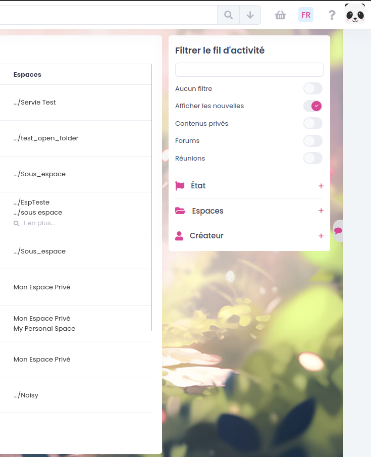
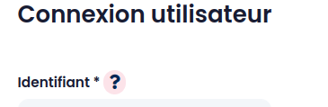

=======
GoFAST : Personnalisation 
=======
*Personnalisation du CSS sur GoFAST*
----------

Cette fonctionnalité permet de modifier l'apparence de la plateforme.

Vous avez la possibilité de modifier les paramètres suivant :

Modifier l'image de l'arrière plan
----------------
Avec **{{BACKGROUND_IMAGE}}**

Il est possible de modifier l'arrière plan comme l'image ci-dessous:

Modifier la couleur des liens, boutons et icônes
--------------------
Avec **{{PRIMARY_COLOR}}**

Il est possible de modifier la couleur des liens, boutons et icônes en utilisant le format #00bfff ou rgb(0, 191, 255).

Modifier la couleur des éléments au survol
------
Avec **{{PRIMARY_COLOR_HOVER}}**

Il est possible de modifier la couleur des éléments au survol des liens, boutons et icônes. Il est conseillé de choisir une couleur plus foncée que la **{{PRIMARY_COLOR}}**

Modifier la couleur de fond derrière certains éléments
---------
Avec **{{PRIMARY_COLOR_BACKGROUND}}**

Il est possible de modifier la couleur de fond derrière certains éléments comme l'image ci-dessous:

Modifier la couleur de la barre supérieure dans la version GoFAST Essential
--------
Avec **{{ESSENTIAL_HEADER_COLOR}}**

Il est possible de modifier la couleur de la barre supérieure dans la version GoFAST Essential comme l'image ci-dessous:

.. figure:: media-guide/image.png

Si vous êtes intéressés par ces modifications, vous pouvez nous contacter en ouvrant un ticket en précisant les données pour les différents paramètres que vous souhaitez modifier.

Vous avez la possibilité de personnaliser et ajuster le logo selon votre image ! 

 `Cliquez ici <https://gofast-docs.readthedocs.io/fr/latest/docs-gofast-users/doc-gofast-administration-plateforme.html#logo-personnalisable-de-la-page-de-connexion>`_
