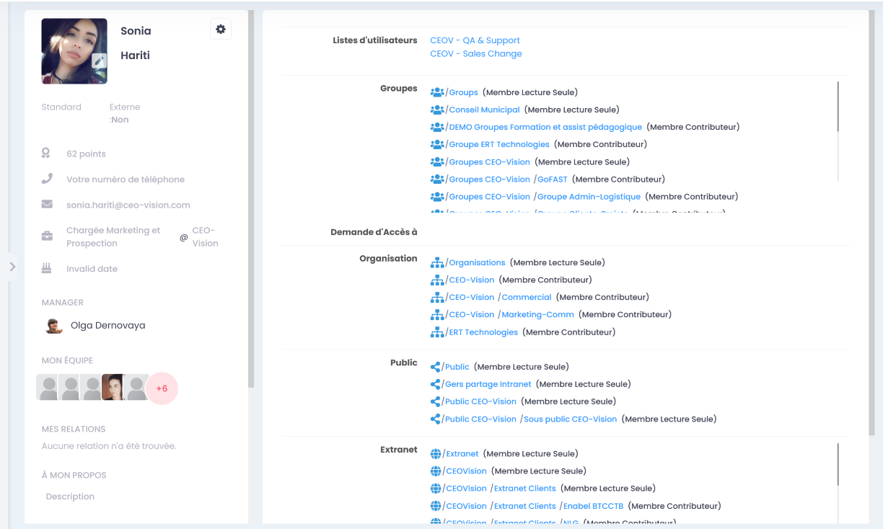
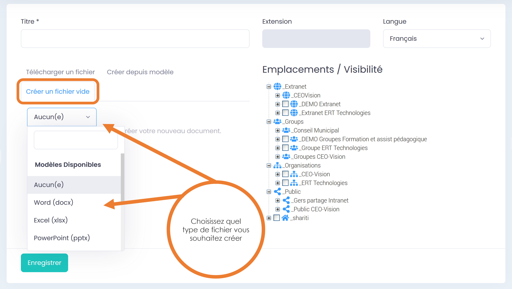
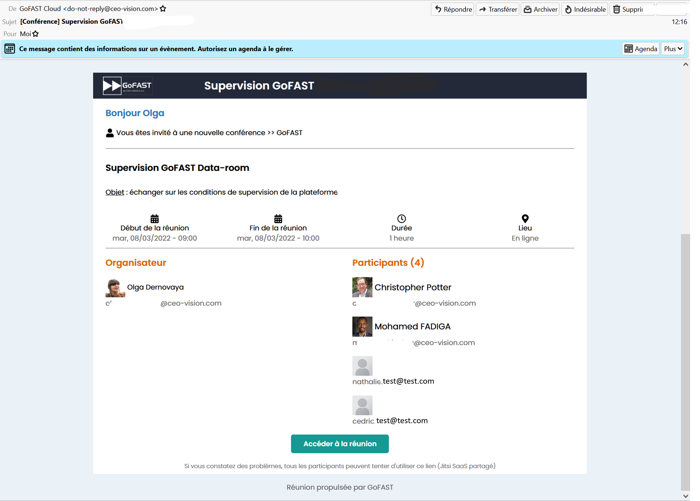
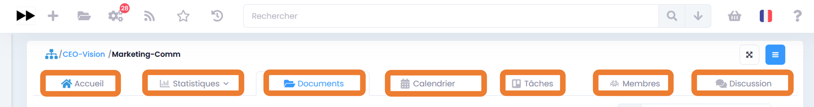

==============================
GoFAST : Guide Utilisateurs 
==============================

   
   
Introduction
============

Ce guide vous apprend à utiliser GoFAST de la manière la plus efficace possible, avec de nombreuses copies d'écran de la plateforme, qui vous guident pas à pas. Il vous explique tous les "trucs et astuces", les raccourcis et les différentes manières de faire une même action sur les documents, contenus, Espaces Collaboratifs, utilisateurs, etc.

.. NOTE:: Nous vous recommandons de lire la rubrique "Les bonnes pratiques avec GoFAST" et visionner la vidéo de démonstration :  https://mautic.ceo-vision.com/asset/81:fr-videodecouvrir-gofast-digital-workplace-et-ged-collaborative-open-source 

.. NOTE:: Des forums de la communauté d’utilisateurs est disponible pour échanger avec les équipes de l’éditeur CEO-Vision, n'hésitez pas à vous créer un compte : https://community.ceo-vision.com
   

Concept GoFAST Digital Workplace GED
-----------------------------------------------------

GoFAST en 2 mots
~~~~~~~~~~~~~~~~

GoFAST, fruit de plusieurs années de développement, est une puissante plateforme collaborative et de gestion documentaire. GoFAST est basée sur les technologies Open Source les plus reconnues et éprouvées, dont Alfresco, Drupal, Bonitasoft, OnlyOffice, Element et bien d'autres. 
Pour une plateforme aussi riche fonctionnellement, GoFAST est connue pour être très intuitive et permet de rapidement prendre en main les principales fonctionnalités.
Enfin, GoFAST est hébergé dans votre organisation (OnPremise) ou en SaaS souverain dédié, garantissant le *meilleur niveau de confidentialité* et de sécurité.

A qui est destinée la plateforme GoFAST ?
~~~~~~~~~~~~~~~~~~~~~~~~~~~~~~~~~~~

GoFAST Digital Workplace est destiné aux Grands Comptes ou PME, Collectivités, Ministères, Ecoles et Universités, Associations… 
Tous les membres de votre organisation peuvent travailler ensemble de manière collaborative, ainsi qu’avec vos partenaires grâce à une zone "Extranet".

A quoi sert la plateforme GoFAST ?
~~~~~~~~~~~~~~~~~~~~~~~~~~~~~

C’est une plateforme d’échanges d’information qui permettra à tous les collègues, aussi bien siège et terrain (et même des externes), de pouvoir gérer/modifier et commenter des documents, partager des informations, chatter en direct, traiter les processus, gérer des tâches collaboratives, et. Bref, c’est un outil de collaboration moderne et interactif qui fonctionne partout où il y a une connexion internet, et même hors ligne avec synchronisation lorsque vous vous reconnectez.
Améliorer la collaboration est la principale problématique à laquelle répond GoFAST : elle permet de centraliser les documents et les échanges à propos de ces documents en un seul endroit, accessible partout et à tout moment ; de limiter les doublons ; de diffuser des notifications automatiques qui optimisent non seulement la collaboration mais aussi la gestion documentaire.

Objectifs et avantages de GoFAST
~~~~~~~~~~~~~~~~~~~~~~~~~~~

  - Favoriser le travail collaboratif (jusqu'à la coédition simultanée) et le partage d’informations
  - Diminuer le nombre d’emails internes et supprimer les emails avec des pièces jointes (problèmes de quota, mauvaises versions)
  - Arrêter la duplication des contenus 
  - Gagner du temps dans la recherche d’informations (dont les fichiers)
  - Respecter les processus mis en place et ne plus jamais manquer une échéance
  - Diminution des erreurs en ayant accès à toutes les versions d'un document
  - Améliorer la sécurité (gestion des droits d'accès)
  - Faciliter le travail lors de déplacements
  - Réduire le volume de papier

Pour plus d’information sur les objectifs atteints avec GoFAST, merci de vous référer à la rubrique : "Quelques bonnes pratiques"

Prérequis à l’utilisation de GoFAST
----------------------------------------------

.. CAUTION:: Nous ne supportons que les navigateurs supportés par les éditeurs et ceci pour des raisons de sécurité. L’homologation de versions non supportées peut dans certains cas être envisagé avec des décharges de responsabilité et coûts additionnels 

  - Navigateurs préférentiels Windows : **Firefox (dernière version ESR ou dernière version classique'), Edge-Chromium, Chrome.**

.. NOTE::
    A titre d'illustration, au 01/04/2022 nous supportons Firefox 111 et Firefox ESR 111 (et ESR 91.10 en option) 
   
     - Edge-Chromium https://www.microsoftedgeinsider.com/fr-fr/enterprise
    
     - Firefox ESR en Français https://www.mozilla.org/fr/firefox/organizations/all/

     - Navigateur MacOS : Safari (dernière version supportée), Firefox (dernière version supportée), Chrome (dernière version supportée)

     - Navigateur Linux : Firefox (dernière version ESR)
   
     - Système d'exploitation Windows 10 Pro et supérieur, MacOS 12 et supérieur, Linux (Ubuntu 20+), ChromeOS
     
.. NOTE::
    GoFAST est connu pour fonctionner en Remote Desktop (Citrix, ...) même si certaines fonctionnalités comme la webconference peuvent perdre en performance 

  - En mobilité Android ou iOS 13+ 

  - Bureautique : Office 365 et Office Pro 2016+ pour Windows, MS-Office Pro 2016 pour Mac, LibreOffice 6+, OnlyOffice Desktop (à venir)
.. NOTE::
    Le support d'Office 2010 étant terminé par Microsoft depuis le 13 Octobre 2020, CEO-Vision ne supportera  plus cette version. Nous encourageons une migration vers l'utilisation d'OnlyOffice inclut dans GoFAST ou LibreOffice 7+
    Le support de Windows 7 étant terminé par Microsoft depuis le 14 Janvier 2020, CEO-Vision ne supporte plus cette version

  - Messagerie : Outlook 2013+ (Outlook 2010 sans garantie), Thunderbird 78+, Client léger Bluemind  

  - Une connexion relativement bonne est nécessaire : téléchargement de 512 kbits/s min. et 256kbps upload . Vous pouvez d'ailleurs tester directement votre connexion via ce lien : http://www.speedtest.net/
   
  - Une très bonne connexion pour la webconference en HD : jusqu'à 6MB/s peuvent être nécessaire. Certains filtrages réseaux peuvent empecher le fonctionnement de la webconference. Si https://gofast-docs.readthedocs.io/fr/latest/docs-gofast-users/doc-gofast-problemes-connus.html#webconference ne vous aide pas, contacter votre administrateur réseau en cas de problème.    

  - Résolution écran 1366x768 minimum (format 16:9)
  
  - Ordinateur avec 8GB RAM

 - En mobilité : Tablette ou smartphone récent (iOS ou Android)

Quelques bonnes pratiques
--------------------------------------

.. IMPORTANT:: 
   Même si GoFAST nécessite de changer un peu ses habitudes, il est important que le plus grand nombre fasse l'effort de changer. Les gains en temps sont ensuite très importants, tout le monde est alors gagnant !

Objectif 1: Diminuer le nombre de mails entre collègues et partenaires
~~~~~~~~~~~~~~~~~~~~~~~~~~~~~~~~~~~~~~~~~~~~~~~~~~~~~~~~~~

  - Je n'envoie plus de mails avec pièce jointe, mais je mets un commentaire sur le document sur GoFAST, toutes les personnes recevront une notification.

     - dans de nombreux cas la pièce jointe n'est déjà plus à jour quand votre destinataire la reçoit de plus les pièces jointes encombres les messageries.

  - Je n'envoie plus de mails avec pièce jointe à mes contacts n'ayant pas de compte GoFAST mais j'utilise la fonction "Partager par email"

  - Je n'élabore plus un document 'chacun son tour' mais utilise la coédition OnlyOffice

    - Ceci permet de gagner du temps et limite les erreurs, évite d'avoir à fusionner les sections rédigées par chacun

  - Je n’envoie plus de demandes de tâche ou validation par mail, mais j’utilise les ‘’workflows’’ (processus de tâches) pour relecture, validation, signature, etc. Tout le monde est notifié, chacun connaît sa tâche et les délais sont respectés.
  - J’utilise les forums pour mes questions/réponses au lieu des mails. Tout le monde partage ses connaissances.

Objectif 2: Gagner du temps dans la recherche d’information et contenus
~~~~~~~~~~~~~~~~~~~~~~~~~~~~~~~~~~~~~~~~~~~~~~~~~~~~~~~~~~

  - La totalité des contenus (même cellules d'un tableur...) est indexé (indexation "plein-texte") et le moteur de recherche est considéré comme un des plus puissants
  - je gagne jusqu'à 30% de mon temps *(source IDC : 30% des cadres passent leur temps à rechercher des contenus dispersés et dupliquer)*

Objectif 3 : Mettre fin aux doublons de fichiers et erreurs de versions
~~~~~~~~~~~~~~~~~~~~~~~~~~~~~~~~~~~~~~~~~~~~~~~~~~~~~~~~~~

  - Je ne garde plus de fichiers sur mon PC ou boîte mail, les documents sont centralisés et accessibles selon les droits d’utilisateurs.
  - Je ne copie plus jamais un document à plusieurs endroits, j'utilise la fonction Emplacement/Visibilité qui permet à un même document d'être vu dans plusieurs espaces.
     - Quelque-soit l'espace, tout le monde aura la bonne version

  - Je ne créé plus un fichier par version
     - GoFAST versionne automatiquement et toutes les versions sont accessibles à tout moment.

  - J’accède à mes documents de travail en mobilité et je n’ai pas besoin de copie locale ou de version papier (accès Online sur Tablettes et Online/Offline sur PC).
  - Je partager les informations avec mes clients et fournisseurs dans l’Extranet GoFAST et ainsi, ils ont accès aux mêmes documents et non plus des doublons, qui sont rapidement obsolètes.
  - Je ne stocke plus mes documents dans la messagerie car un simple glisser-déposer suffit pour les transférer sur GoFAST.

Objectif 4: Maîtriser les processus de traitement, validation et signature des documents
~~~~~~~~~~~~~~~~~~~~~~~~~~~~~~~~~~~~~~~~~~~~~~~~~~~~~~~~~~~~~~~~~~~~~~~~

  - Les processus informels ou les procédures papier souvent inefficaces, sont modélisés dans GoFAST. Grâce à des circuits de tâches prédéterminés, vous retrouvez la maîtrise des divers processus métier.

  - Je n’ai plus à chercher les dates d’échéances dans mes mails, celles-ci sont clairement indiquées sur les processus et me sont rappelées par notification.

Objectif 5 : Diminuer le volume papier
~~~~~~~~~~~~~~~~~~~~~~~~~~~~~~~

  - Je numérise les documents papiers (contrats, factures, courriers, etc.) et les envoie directement vers la plateforme GoFAST, où ils seront indexés plein texte à la volée.
  - Je transforme les formulaires papier en documents électroniques et les diffuse avec efficacité (cibler un groupe, rappels automatiques et relance, suivi des actions, etc.) et j’exporte les données dans un tableur.
  - Je signe électroniquement les PDF avec certificat sécurisé plutôt que de les imprimer pour les signer et les re-scanner. 

Quoi de neuf dans la dernière version de GoFAST
-----------------------------------------------------------------
Merci de consulter les "Release-Notes" de la dernière version disponible.  

Les Bases
=========

Connexion/Login
-----------------------

Vous pouvez vous identifier à GoFAST via l’adresse URL sur le modèle suivant :
https://gofast.monorganisation.com

Il suffit d’entrer votre **identifiant** (Attention l'adresse e-mail ne fonctionne pas) et votre **mot de passe** ou vous connecter via le SSO (Authentification automatique si celle-ci a été configurée sur votre plateforme).

.. NOTE::
   Si la délégation d'authentification a été activée sur votre site, il s'agit de votre mot de passe habituel (celui de l’annuaire de votre Organisation/Entreprise). Si le SSO a été configuré, vous n’avez pas besoin de saisir votre identifiant, ni votre mot de passe, mais juste cliquer sur le bouton de connexion automatique. 
   
.. NOTE::
   Lorsqu’un compte est bloqué au bout de 5 tentatives, vous pouvez cliquer sur « Mot de passe oublié ? ». 
- Si le compte GoFAST est couplé à l’AD, vous recevrez un e-mail, vous disant qu’il n’est pas possible de changer votre mot de passe, car il est couplé à celui de l’AD, il faut alors contacter un super administrateur ou le service informatique de votre organisation. 
- Si le compte GoFAST n’est pas couplé à l’AD, un e-mail permettant de réinitialiser son nom d’utilisateur et/ou son mot de passe sera envoyé. Attention, il faut une adresse mail valide renseignée pour que cela fonctionne. Une fois la réinitialisation effectuée, le statut de l’utilisateur passe automatiquement de « Bloqué » à « Actif » dans l’annuaire de GoFAST.

Lors de votre première connexion, vous pouvez choisir entre deux interfaces : **GoFAST plus** ou **GoFAST Essential** 
Via votre photo de profil, vous pouvez modifier ce choix à tout moment.
L’interface GoFAST Essential est la version "restreinte" de GoFAST Plus (interface complète). Elle propose les fonctionnalités principales et masque certaines fonctionnalités plus avancées (ex. Gestion d’un Espace) avec une page d’accueil et une navigation plus adaptée à un utilisateur occasionnel. Pour toute question, n’hésitez pas à allez sur les forums de la communauté des utilisateurs. 

Si vous voulez en savoir plus sur l'interface **GoFAST Essential** , merci de regarder cette vidéo :

.. youtube:: 7699ESVTOyM

Se repérer sur GoFAST (menus, icônes…)
--------------------------------------------------------

GoFAST dispose de deux menus principaux :
~~~~~~~~~~~~~~~~~~~~~~~~~~~~~~~~~~~~~
**« Menu d’accès rapides » :** 
Qui est affiché tout en haut de l’écran, sur toutes les pages de la plateforme (barre principale du haut). Ce menu permet notamment d’accéder à divers contenus et à la création de nouveaux contenus. 

**« Menu principal latéral » :**
Qui se trouve à gauche. Ce menu permet d’accéder aux principales pages de la plateforme, notamment au fil d’activité, tableau de bord, l’arborescence des Espaces Collaboratifs, annuaires, etc.

.. NOTE::
    En plus du menu principal de gauche, il est possible de déplier un volet latéral (aussi à gauche) pour un accès pratique à l’arborescence des documents, liste des pages wiki, ainsi que des forums.

Menu d’accès rapides
~~~~~~~~~~~~~~~~~~

 - Le logo : permet de retourner sur votre page d’accueil, soit le fil d’activité, soit le tableau de bord selon la configuration de votre plateforme. 
 - L’icône « + » : permet de créer les contenus, documents et utilisateurs. Pour plus d’informations, voir la partie : Création de documents, Contenus, Utilisateurs.
 - L’icône Dossier : permet d’accéder à l’arborescence des espaces de la plateforme que vous avez d’accès.
 - Les Roues Crantées : permettent l’accès à ses processus et tâches. Plus d’information, voir la rubrique : Workflows et Signature : Processus et Tâches (entreprise Only).  
 - L’icône de Flux : permet de voir les nouvelles du site internet défini. 
 - L’icône Etoile : permet de retrouver vos contenus et dossiers épinglés comme favoris personnels. 
 - L’icône Horloge : permet d’accéder à vos 10 derniers contenus vus. 
 - Le barre de recherche : permet d’effectuer une recherche parmi tous les contenus auxquels vous avez accès sur la plateforme (documents, espaces, utilisateurs, forums, etc.). Plus d’information, voir la rubrique : Moteur de Recherche.
 - L’icône Panier : permet d’accéder à la liste des documents que vous avez mis dans le panier au préalable, pour effectuer des actions sur l’ensemble des documents du panier. Plus d’information pour cette partie, voir la partie : Panier Documentaire.
 - L’icône Drapeau ou lettres désignant la langue (ex. FR/EN) : permet de changer la langue de l’interface de la plateforme.

 - L’icône Point d’interrogation permet l’accès aux : 
     - Forums : renvoie aux forums où tous les utilisateurs de GoFAST peuvent échanger sur des problématiques, évolutions, bonnes pratiques, questions fonctionnelles… entre eux et avec les équipes de CEO-Vision (éditeur de GoFAST). 
     - Nouvelles fonctionnalités : affiche le carrousel des nouvelles fonctionnalités apportées selon la version que vous utilisez. 
     - Documentation : renvoie à cette documentation en ligne. 
     - A propos : Sur cette partie, vous pouvez consulter les différents composants installés dans la plateforme ainsi que leurs versions.
     - Enfin si vous avez configurez un lien personnalisé (voir la partie Administrateur …). Vous pouvez le retrouver le lien ici (un sous onglet après A propos).
 - La photo (son avatar utilisateur) permet l’accès aux : 
     - Mon profil : vous donnez accès à votre profil, voir partie : Mon Profil
     - Abonnements : vous permet d’accéder à votre page d’abonnement, voir la partie : Gestion des abonnements 
     - Le choix entre GoFAST Essential ou GoFAST Plus. 
     - Déconnexion pour vous déconnecter de la plateforme. A noter que la durée de session de GoFAST est dans tous les cas, limitée dans le temps et vous serez donc déconnecté au bout d’un délais (10h). 
     

.. figure:: media-guide/votre-profil-0.png
   :alt: 

Menu latéral 
~~~~~~~~~~~~~~~~~~~

Ce menu est donne accès aux principales pages de GoFAST. Selon votre profil utilisateur (Standard, Support-Utilisateurs ou Super-Administrateur) vous aurez des accès standards ou supplémentaires. 
Vous pouvez plier et déplier ce menu avec l’icône burger en haut à gauche.

**Accès pour tous les niveaux de "Profil Utilisateur" (dont "Standard") :**

 - Tableau de bord. Pour plus d’information, voir la rubrique "Tableau de Bord". 
 - Fil d’activité 
 - Espaces collaboratifs : accès à l’arborescence des Espaces où vous êtes membres.
 - Processus et tâches : accès à la liste des processus et filtrer selon divers critères pour retrouver un processus en cours ou terminé.   
 - Calendrier : accès au calendrier de votre espace personnel (qui affiche la somme des échéances sur les contenus, tâches et réunions, selon vos droits d’accès).
 - Discussion : accès à la messagerie instantanée (Tchat) en plein écran dans son navigateur. 
 - Annuaires en 4 parties (Vous pouvez effectuer des actions en masse depuis ces annuaires) :
     - Utilisateurs : tous les utilisateurs que vous avez le droit de voir, avec le nom, prénom, entité, dernière connexion, date de création, statut et les points que l’utilisateur a gagné. 
     - Listes Utilisateurs : toutes les listes d’utilisateurs que vous avez le droit de voir, avec le nom, le créateur, le nombre d’administrateurs dans la liste, le nombre de membres et la date de création.
     - Espaces : tous les espaces que vous avez le droit de voir, avec le nom, le type d’espace, le nombre des documents, le nombre des administrateurs, etc. 
     - Contact : liste des contacts (non-utilisateurs) avec le nom, le prénom, l’entité, l’email et le mobile. 
     
**Accès limités aux Profil Support-Utilisateurs :**

Au-delà des accès à des pages d’audit et statistiques, ainsi qu’une visibilité plus étendue sur les utilisateurs existants et l’arborescence des Espaces, ce profil permet d’affecter plus d’actions depuis les "menu burger". Attention, ce profil ne donne en aucun cas un accès par défaut à des Espaces et leurs contenus (pour voir les contenus d’un espace, l’utilisateur doit forcément en être membre). Pour plus d’informations, merci de vous référer à la rubrique : « Profils Utilisateurs »
Les accès supplémentaires autorisés pour ce profil : 
 - GoFAST Configuration (accès uniquement aux onglets : Visibilité, Catégories, DUA et Lien personnalisé). Pour plus d’informations sur ces fonctionnalités, voir la rubrique « Administration ». 
 - Statistiques : accès aux statistiques des utilisateurs, des espaces et des documents. Pour plus d’info, voir la rubrique « Statistiques ».
 - Audit : permet de vérifier les données auditées (actions sur les documents, accès à la plateforme, suppressions, etc.). Pour plus d’informations sur ces fonctionnalités, voir la rubrique « Administration ».
 - Import d’utilisateurs (LDAP) : vous pouvez visualiser les utilisateurs qui sont dans votre annuaire interne (AD/LDAP, si celui-ci a été configuré sur votre plateforme). 

**Accès limités aux Profil Super-Administrateur :**

 - GoFAST Configuration (accès aux diverses possibilités de configurations techniques de la plateforme). Pour plus d’informations sur ces fonctionnalités, voir la rubrique « Administration ». 
Ce profil ne donne en aucun cas un accès par défaut à des Espaces et leurs contenus (pour voir les contenus d’un espace, l’utilisateur doit forcément en être membre). Pour plus d’informations, merci de vous référer à la rubrique : « Profils Utilisateurs »

.. NOTE::
    Depuis les annuaires « Utilisateurs » et « Espace », différentes actions sont possibles, selon le profil (standard, support utilisateur, super administrateur). 

Page d’Accueil
--------------------
La première fois que vous vous connectez à GoFAST à la suite d’une mise à jour, il se peut que vous arriviez sur le carrousel qui affiche les nouvelles fonctionnalités. 
Selon la configuration de la page d’accueil de votre plateforme, vous pouvez arriver soit sur le Fil d’activité, soit sur le Tableau de bord.

.. figure:: media-guide/Image-Accueil-1.png

Fil d’Activité 
~~~~~~~~~~
Le fil d’activité de GoFAST vous donne une **vue d’ensemble** sur ce qui s’est passé sur les contenus de vos espaces collaboratifs (Groupes/Organisations/Publics/Extranets).

**La page Fil d’activité est organisée en quatre parties :**

 - La photo de profil : qui renvoie la personne qui a effectué l’action.
 - Titre du document/contenu concerné et le type d’action faite. A droite du contenu, un menu "Burger" permet de réaliser des actions sur le contenu, directement depuis le fil d’activité.
 - Espace(s) où se trouve le contenu concerné (en un clic vous pouvez vous rendre sur l’Espace).
 - Bloc de filtres (permet de filtrer le fil d’activité sur divers critères).

.. NOTE::
    Vous pouvez revenir à la page du fil d’activité à tout moment depuis le menu principal de gauche (ou le logo en haut à gauche, si c’est la page d’accueil par défaut).

**Actions possible depuis le Fil d’activité :**

 - Le "Menu Burger" (actions contextuelles) 

.. figure:: media-guide/raccourci-fonctionnalités.png
   :alt: 

Pour en savoir plus sur les actions possibles sur un document/contenus, merci de vous référer à la rubrique : "Gestion Collaborative des Documents / Contenus"

Vous pouvez **filtrer** la liste des documents de votre fil d’activité selon des Espaces, le statut des documents (brouillon, en cours, validé…).

.. figure:: media-guide/filtres.png
   :alt: 

Vous pouvez choisir de masquer ou afficher les **« Nouvelles »** qui sont postées à tous les utilisateurs de la plateforme par un utilisateur ayant le Profil Support-Utilisateur ou Super-Administrateur. 
 
Si vous avez un de ces profil, vous pouvez partager une information :

* cliquez sur « Partager une nouvelle » (en haut au centre du fil d’activité) une fenêtre s’ouvre, 
* écrivez votre message 
* cliquez sur « Envoyer ». 
Le message sera visible sur le fil d’activité pour tous les utilisateurs. 

Tableau de Bord
~~~~~~~~~~~~~~

Le tableau de bord permet un accès rapide aux éléments les plus sollicités. Par défaut, tous les utilisateurs ont le même tableau de bord. 

**Accédez au Tableau de Bord :**

 - À partir du menu principal de gauche, cliquer sur « Tableau de Bord ».
 - À partir du logo en haut à gauche, à partir du moment où le Tableau de Bord est défini comme page d’accueil par défaut. 

**Le tableau de bord par défaut affiche six blocs :**
   
.. figure:: media-guide/Dashboard.png

 - **Espace personnel et Profil** : accès à votre espace personnel, profil, calendrier et à la gestion de vos abonnements. 

.. NOTE::
   Un seul espace principal pourra être mis en avant dans ce bloc du Tableau de bord. Pour modifier l’espace principal d’un utilisateur, il faut aller sur la page de profil de cet utilisateur, puis dans le menu de configuration. 

 - **Mon calendrier** : accès à vos renions à venir et tous les documents auxquels vous avez accès et ayant une échéance. Sur le filtre du bloc (haut-droite), vous pouvez choisir d’afficher les réunions ou les documents. Vous pouvez également créer une réunion avec le bouton « + ». 
 - **Mes tâches** : accès aux processus et tâches qui vous ont été assignés. Vous avez la possibilité de démarrer un nouveau processus via le bouton « + » en haut à droite. Via l’icône « tableau », vous pouvez aller sur le Tableau des Processus. 
 - **Mes espaces favoris** : affiche tous les espaces que vous avez épinglés comme favoris. Vous pouvez ajouter un espace en favori via l’icône « + ». 
 

Sélectionnez à partir de l’arborescence proposé, l’espace que vous souhaitez mettre en favori, puis cliquez sur le bouton « Epingler sur le tableau de bord ».

Vous pouvez effectuer des actions sur un espace via le "Menu Burger". 

Pour supprimer un espace des favoris, passez par le menu "Burger", puis « Supprimer des favoris ».

Un message de confirmation de suppression s’affiche en haut à droite de la fenêtre.

 - **Mes répertoires favoris** :  affiche tous les dossiers que vous avez épinglés comme favoris. Via l’icône « flèche », vous pouvez accéder à l’arborescence à l’emplacement du dossier. Vous pouvez ajouter un dossier en favori via l’icône « + ». 
 - **Mes contenus favoris** : affiche tous les documents et autres types de contenus (hors les espaces) que vous avez épinglés comme favoris. Via l’icône « + », vous pouvez accéder ajouter d’autres contenus favoris. Vous pouvez effectuer des actions sur un documents/contenu via le "Menu Burger".
Pour ajouter un ou plusieurs contenus, cliquer sur l’icône « + »  à droite du titre du bloc :

Renseigner le nom du contenu souhaité dans la barre de saisie (au moins trois lettre) puis faites cliquez sur un des contenus suggérés et enfin validez via le bouton « Épingler sur le tableau de bord ».

Les documents épinglés peuvent être prévisualisés, édités, partagés, archivés et commentés directement à partir du tableau de bord.
 

N’hésitez pas à poser vos questions sur le tableau de bord et les autres blocs disponibles via les Forums. 

Page "Profil Utilisateur"
--------------------------------

Depuis votre photo de profil (via le menu d’accès rapide, tout en haut à droite), vous pouvez accéder à votre page de profil, qui est comme votre « carte de visite virtuelle ». 

Cette page affiche les informations vous concernant :  nom, prénom, fonction, entreprise, téléphone, email, un mot à votre propos, vos compétences… ainsi que les informations liées à vos accès sur la plateforme : votre profil (ex. Support-utilisateur, Super-Administrateur ou Standard ou Externe) vos espaces collaboratifs, groupes, organisations, listes d’utilisateurs…

Paramètres du profil
~~~~~~~~~~~~~~~~~

Vous pouvez voir et/ou modifier les divers éléments de votre profil directement en cliquant dessus dans le bloc de gauche ou en passant par le menu de **paramètres du compte** : 
 - identifiant (non modifiable)
 - nom
 - prénom
 - email (modifiable uniquement pas vous)
 - option d’authentification (si la connexion est déléguée à l’annuaire interne de votre Organisation/Entreprise ou pas) 
 - mot de passe (masqué et modifiable uniquement si l’authentification n’est pas déléguée à l’annuaire interne de votre Organisation/Entreprise)
 - vos Profils sur la plateforme (Support-utilisateur, Super-Administrateur ou Standard ou Externe, Broadcaster, restriction de partage des notifications)
 - Votre rôle par défaut lorsque l’on vous ajoute à un espace (Contributeur ou Lecture Seule) 
 - Informations sur votre Entité (votre entreprise ou organisation), votre poste et Direction de rattachement, votre manageur, vos numéros de téléphone, votre date d’anniversaire, etc. 
 - Langue affichée pour l’interface de la plateforme et vos notifications email. 

.. figure:: media-guide/image019.png
   :alt: 

La plupart de ces informations ne sont pas obligatoires, mais elles peuvent être importantes pour faciliter le travail collaboratif avec vos collègues. 

Ajouter une photo à son profil 
~~~~~~~~~~~~~~~~~~~~~~~~~

Allez sur la page de votre profil, cliquez sur l’icône « crayon » qui apparait au survol de l’image (dans l’angle haut à gauche).

.. figure:: media-guide/image020.corrigée.png
   :alt: 

Vous arriverez sur la page d’ajout/modification de la photo de profil. Appuyez sur « Charger un fichier » pour aller chercher votre photo depuis votre ordinateur, double-cliquez dessus ou cliquez sur OUVRIR. Une fois chargée, vous pourrez adapter le cadre, puis « Enregistrez ».

.. figure:: media-guide/image021.png
   :alt: 

Votre photo apparaîtra dès lors sur votre profil et partout où vous êtes cité sur la plateforme (ex. fil d’activité, tâche…). C’est un moyen rapide et convivial de connaître ses collègues éloignés et de savoir plus facilement à qui on s’adresse (à condition de mettre de vraies photos de profil).

Les Espaces Collaboratifs
---------------------------------

Les Espaces Collaboratifs sont des zones de travail et de partage de documents, tâches et autres types de contenus, discussions, accessibles uniquement aux utilisateurs membres.

Types d'Espaces Collaboratifs disponibles
~~~~~~~~~~~~~~~~~~~~~~~~~~~~~~~~~~
  - Organisations (représentent globalement l’Organigramme : Directions, Départements, Services...)
  - Groupes (Dédiés au travail transversal : projet, base de connaissances, produit, site géographique, thématique...)
  - Extranets (dédiés au travail avec des partenaires externes)
  - Publics (accessible à tous les utilisateurs internes en lecture seule, non aux externes)

Chaque Espace Collaboratif est organisé de la même manière (onglet Documents, Tâches, membres…). Toutefois, il y a quelques fonctionnalités qui différent selon le type d’Espace (merci de vous référer aux rubriques décrivant chaque type d’Espace). 

**La gestion des accès aux espaces suit une suite logique d'entonnoir :**

Chaque espace peut contenir un ou plusieurs sous espaces. Dans ce cas il est possible d'avoir un sous-ensemble de membres dans ces sous-espaces afin de restreindre l'accès. Plus vous descendez dans l'arborescence, moins il y a potentiellement de membres. 

.. NOTE::
   Les espaces peuvent contenir des fichiers, autres contenus (ex : forums, pages Wiki, etc.), des sous-espaces (avec droits associés) ou encore des dossiers classiques. Les dossiers classiques héritent des mêmes droits d'accès que l'espace parent où ils se trouvent.
   Les espaces sont représentés dans l'explorateur de fichiers intégré par des icônes distinctes et avec un "_" devant le nom de l'espace (ex: _Organisation) dans l'explorateur de fichiers Windows ou Mac. 
   Avant de pouvoir déposer les fichiers sur la plateforme GoFAST, assurez-vous de créer les "bons" espaces et sous-espaces collaboratifs de type Organisation, Groupe ou Extranet ! 

 - Espace Personnel : disponible pour chaque utilisateur (personne, si ce n’est l’utilisateur lui-même n’a accès à cet espace personnel). 

Une icône « Afficher le contenu en pleine page » permet **d’agrandir la vue** de la page en masquant les menus principaux de la plateforme.

.. figure:: media-guide/image030.png
   :alt: 

Il suffit de réappuyer sur la même icône à 2 flèches pour revenir à la vue précédente.

Rôles des membres des Espaces Collaboratifs
~~~~~~~~~~~~~~~~~~~~~~~~~~~~~~~~~~~~~
 - Administrateur (il peut modifier l’espace et ses membres) 
 - Contributeur (il peut effectuer des actions sur les contenus/dossier de l’espace)
 - Lecture Seule (il peut consulter les contenus de l’espace et partager des commentaires)

Pour connaitre les "Profils" existant sur la plateforme, merci de vous référer à la rubrique dédiée. Ces profil ne donnent pas accès aux Espaces Collaboratifs, mais permettent d’effectuer des actions de configurations. 

Notion de partage de contenus entre Espaces Collaboratifs
~~~~~~~~~~~~~~~~~~~~~~~~~~~~~~~~~~~~~~~~~~~~~~~~
GoFAST est fait pour permettre le partage de documents/contenus sans créer de doublon et ainsi éviter toute erreur de version. 

.. IMPORTANT::
   Pour qu'un document se retrouve dans plusieurs espaces sans doublon, il est *partagé** en changeant sa visibilité depuis le menu "Burger", sur la page sur document ou depuis l’explorateur de fichier (clic droit où menu "Gérer", puis "Emplacements/Visibilité").

.. figure:: media-guide/image369.png
   :alt: 

Retrouver ses Espaces Collaboratifs
~~~~~~~~~~~~~~~~~~~~~~~~~~~~~
Les Espaces Collaboratifs sont accessibles depuis les menus principaux, la recherche, le fil d’activité et partout où est affiché un emplacement vers un contenu. 

.. figure:: media-guide/image025.png
   :alt: 

Pour plus d’information, merci de vous référer à la rubrique : " Se repérer sur GoFAST (menus, icônes…)"

Espaces Organisations (= Départements/Services)
~~~~~~~~~~~~~~~~~~~~~~~~~~~~~~~~~~~~~~
Les espaces collaboratifs appelés « **Organisations** » correspondent aux **départements** et **services** selon l'organigramme de votre Organisation/Entreprise ; En dehors des annuaires, vous ne voyez que les espace où vous êtes membres (RH, DAF, DSI…).

.. figure:: media-guide/image037.png
   :alt: 

Les ‘‘Organisations’’ représentent donc une structure hiérarchisée et chaque département (RH, IT, Financier...) peut avoir des sous-espaces pour les services.

.. NOTE::
   Il arrive souvent que vous n’aurez accès qu’à une seule **organisation** de premier niveau, puis à ses **sous-organisations**. 
   Un utilisateur peut éventuellement faire partie de plusieurs organisations de premier niveau si il a des fonctions partagées entre 2 départements.

.. NOTE::
   Si vous devez **partager** des documents entre différents départements, vous devez le faire à travers un **Groupe** dédié au projet, thématique, etc. Par exemple un contrat est dans l'Organisation "Juridique" et aussi dans le Groupe "ProjetA" car c'est un contrat qui concerne ce "ProjetA" dans lequel des membres de plusieurs départements sont rassemblés.
  
Espaces Groupes (= Travail transversal)
~~~~~~~~~~~~~~~~~~~~~~~~~~~~~~~~~~~~

Les « **Groupes** » sont des zones de partage **transversales** / **interservices** (ex : des groupes de projet). Ce sont des espaces dédiés à des thématiques spécifiques qui ont un grand rôle collaboratif : toutes les personnes concernées par le projet/sujet y ont accès, y compris dans le cas où elles ne sont pas rattachées à la même « Organisation » (=Direction, Service…). 
Vous pouvez donc faire partie d’un grand nombre de d’Espace de type Groupes.

Hors les annuaires, vous ne verrez que les groupes dont vous êtes membres.

.. figure:: media-guide/image036.png
   :alt: 

Espaces Publics
~~~~~~~~~~~~~

A l’inverse des autres Espaces, **l’Espace Public** n’a pas de notion de gestion des membres car il donne accès en Lecture Seule à tous les utilisateurs internes (non les "Externes") à tous les documents qui y sont partagés.

**Que trouve-t-on dans cet espace Public ?**

Dédiés aux contenus totalement transversaux et publics à l'Organisation. On peut également y mettre des forums de support et autres bases de connaissances. A noter que les documents de travail restent dans les autres Espaces Collaboratifs, où ils sont créés et gérés, puis seuls les publications PDF créées depuis les documents de travail sont partagés dans les Espaces Publics (question de bonnes pratiques).

Vous trouverez à la racine de l’espace Public, la possibilité de mettre à disposition à toute l’organisation les modèles crées dans le Dossier racine « Template ». Ainsi il est possible de donner au plus grand nombre (hors utilisateurs extranet), l’utilisation de certains modèles.

**Gestion des Espaces Publics :**
Ces Espaces Publics internes sont gérés par tous les utilisateurs membres de la "Liste Public" (permet de créer des sous-espaces, déposer les documents, etc..). 
Les autres utilisateurs sont en Lecture Seule.

Vous pouvez **vous abonner** à cet espace en cliquant sur « s’abonner ». Vous recevrez ainsi des notifications liées au contenus de cet espace (dans votre rapport de synthèse d’activité). Vous pourrez d’ailleurs faire cela pour tous les espaces.

Toutefois, les administrateurs de la plateforme (profil Support-Utilisateur) peuvent également configurer l'espace public de telle sorte que tous les utilisateurs interne (non Externes) puissent contribuer aussi à cet espace public (choix de configuration : soit la lecture, soit l'écriture).

.. figure:: media-guide/image032.png
   :alt: 

Espaces Extranets
~~~~~~~~~~~~~~~

.. figure:: media-guide/image035.png
   :alt: 

Cet espace « Extranet » permet de partager des contenus avec des clients, fournisseurs ou toute autre entité partenaire qui collabore fréquemment mais **qui ne fait pas partie de l’organisation interne.**

Si vous voulez donner accès à cet espace à une personne externe, le principe est le même que pour tout nouvel utilisateur, il faut lui créer un compte et le faire membre du sous-espace Extranet le concernant. On peut donner le rôle de « contributeur » à ce nouveau membre externe si on veut qu’il puisse travailler sur les documents partagés ou alors juste le mettre en « lecture seule », ainsi il ne pourra pas modifier de documents partagés, mais juste les commenter et télécharger (attention :
il ne pourra pas non plus en rajouter).

.. NOTE::
   Si on est administrateur d’un espace, on peut créer des comptes d’utilisateurs mais on ne pourra mettre ces utilisateurs que dans les espaces dont on a la responsabilité.

.. NOTE::
   GoFAST permet d’envoyer, vers des personnes non-utilisatrices (= qui n’ont pas de compte), des messages avec le lien vers un document qui se trouve sur GoFAST ; ils pourront dans un délai de 14 jours, télécharger via le lien et avoir accès au document. Si vous voulez donc juste partager des documents pour information et non pour travailler dessus, pas besoin de créer un compte.

Espace Personnel
~~~~~~~~~~~~~~

Plutôt que de stocker les documents sur le desktop de votre ordinateur, il est recommandé de les mettre dans cet **espace personnel** pour ainsi bénéficier des fonctionnalités GoFAST, notamment le moteur de recherche, le gestion des versions (qui évite de perdre des informations si une version de fichier est corrompue) ou encore l’accès à distance à ses fichiers (via un autre PC, tablettes et smartphone).

Pour accéder à votre espace personnel, il suffit d’aller dans le menu des accès rapides (barre principale du haut), icône "dossiers", puis « Espace Personnel » . Vous arrivez sur votre Espace avec votre page d’accueil, vos documents, vos tâches, votre calendrier… (= les mêmes onglets que vous retrouverez dans chaque espace collaboratif, hors "Membres" et "Discussion").

.. figure:: media-guide/image026.png
   :alt: 

Créer des Contenus (Documents, Réunions, Forums…)
=============================================
Créer/Ajouter des Documents/Fichiers
-----------------------------------------------------
Créer un document vierge (fichier Office)
~~~~~~~~~~~~~~~~~~~~~~~~~~~~~~~~~~~
Il est possible de **créer de nouveaux documents** directement sur la plateforme, plus besoin de créer d’abord le document sur votre PC puis de le partager après coup sur la plateforme.

Allez sur l’onglet « + », « Contenu », puis « Fichier, Document ».

.. figure:: media-guide/image049.png
   :alt: 

Une page s’ouvre, sur laquelle vous pouvez indiquer le nom du document « titre » et vérifier les deux informations (métadonnées) de base : extension (format de fichier) et la langue.

Choisissez l’option « Créer un fichier vide »

Choisissez l’emplacement où se retrouvera le document dans l’arborescence en cochant la case devant le nom d’un Espace ou d’un dossier. Vous pouvez cocher plusieurs emplacements dès la création du document, pour pouvoir collaborer dessus avec diverses équipes/Directions.

Puis enregistrez.

Si le document existe déjà ailleurs sur votre PC, vous pouvez l’ajouter sur la GoFAST via ce canal-ci également.

Il suffit alors de le télécharger en cliquant sur « **Télécharger un fichier** » et « Choisir fichier » ; l’explorateur de fichier de votre PC s’ouvre, choisissez votre document. Puis choisissez le(s) emplacement(s) dans l’arborescence de GoFAST. Puis enregistrez.

.. figure:: media-guide/image052.png
   :alt: 

Vous verrez ainsi la prévisualisation de votre document et pourrez commencer à travailler dessus : apposer les métadonnées, l’éditer/coéditer, le commenter...

Créer un document à partir d’un modèle (Template)
~~~~~~~~~~~~~~~~~~~~~~~~~~~~~~~~~~~~~~~~~~~~

Vous pouvez créer un **nouveau document à partir d’un modèle** déjà existant sur GoFAST.
Il faut pour cela que vos modèles soient placés au préalable dans un répertoire spécifique appelé « TEMPLATES » qui se trouve dans les espaces et sous-espaces. Le fait de les déposer dans ce dossier leur donne automatiquement l’étiquette de « Template ». 
Vous pourrez ensuite retrouver ces documents dans le Formulaire "Créer un document à partir d'un Modèle".

Les dossiers « TEMPLATES » sont automatiquement créés dans chaque Espace Collaboratif et peut être consulté dans l’onglet « Documents » de l’Espace.

Pour créer ce nouveau document à partir d’un modèle, via le menu des accès rapides, allez sur l’icône « + », puis « Contenu » et  « Fichier, Document ».

Choisissez l’option « Créer à partir d’un modèle » (onglet sur le formulaire de création de document), vous verrez alors les différents **dossiers « TEMPLATES »** contenant les modèles. 
Sélectionnez le modèle que vous voulez utiliser. Le titre et l’extension se mettront automatiquement selon le type de modèle choisi. Saisissez un nouveau titre, la langue et le(s) emplacement(s) où vous voulez le partager, puis cliquez sur « Enregistrer ».

Après avoir appuyé sur « Enregistrer », vous serez redirigé vers la page de ce nouveau document, avec la prévisualisation et informations associées que vous pouvez compléter/modifier.

.. NOTE::
   Lorsqu’un document est créé depuis un modèle, il prend automatiquement une étiquette « From Template » et un lien vers le modèle d’origine est ajouté. 

Glisser-déposer des documents depuis son PC par (Office, PDF, Image…)
~~~~~~~~~~~~~~~~~~~~~~~~~~~~~~~~~~~~~~~~~~~~~~~~~~~~~~~~~~~~
Vous pouvez à tout instant glisser un document vers GoFAST, depuis l'explorateur de fichiers.

.. figure:: media-guide/glisser-deposer-ithit.png
   :alt:

Ajouter des documents via le Lecteur Réseau
~~~~~~~~~~~~~~~~~~~~~~~~~~~~~~~~~~~~~
Pour utiliser l'explorateur Windows (ou Explorer sous MAC) vous devez configurer celui-ci pour qu'il accède à GoFAST.
Merci de vous référer à la rubrique : "Configurations/Installations optionnelles"
Une fois le Lecteur Réseau monté, vous pouvez naviguer dans l’arborescence et y déposer des fichiers, tout comme les éditer via vos applications du PC. Attention, cette pratique n’est pas recommandée dans la plupart des cas, car cela empêche le travail collaboratif efficace. Il s’agit ici, surtout d’un moyen simple de charger un grand nombre de fichiers sur la plateforme, surtout au démarrage de son utilisation. 

Créer une Réunion/Webconférence (Enterprise only)
-----------------------------------------------------------------------
.. CAUTION:: Les technologies de conférence « Full-Web » sont assez récentes et nécessitent de bonnes ressources (PC, réseau, ...). Assurez-vous de suivre les prérequis. En cas de problème consulter les problèmes fréquents : http://gofast-docs.readthedocs.io/fr/latest/docs-gofast-users/doc-gofast-problemes-connus.html#webconference

Il est toujours préférable de créer la réunion directement dans GoFAST car cela envoie notamment une invitation agenda à tous les participants et permet également de rattacher des contenus (ex.: ordre du jour, annexes…)

**Une webconférence peut être créé de 2 façons différentes :**

 - Pour programmer une réunion à une date précise, avec invitation agenda : à partir de la barre d’accès rapide (menu du haut) ou le Calendrier d’un Espace. 
 - Pour une webconférence immédiate : à partir d'un salon de discussion instantanée (Tchat), via l’icône « caméra ».

Programmer une réunion/Webconférence
~~~~~~~~~~~~~~~~~~~~~~~~~~~~~~~~~~~~~

Via le menu des accès rapides (menu principal du haut), allez sur l’onglet « + », puis sur « Réunion ».

    
Donnez un titre à la webconférence, écrivez un résumé dans la zone de texte, choisissez une date et heure de début et de fin.

Ajoutez les participants utilisateurs et/ou listes d’utilisateurs (écrivez les 3 premières lettres du nom, d'un espace ou d'une liste pour inviter tous les membres).

Il est possible de joindre des liens vers des documents (lien d’accès ou de téléchargement selon si on est utilisateur ou non sur GoFAST) à l'invitation qui sera envoyée par email (ex.: Ordre du jour) et des liens vers des dossiers (nécessaire d’être membre de l’Espace où se trouve ces dossiers).

Une fois les informations entrées et après avoir appuyé sur « Enregistrer », une autre fenêtre s’ouvre avec les éléments que vous avez saisis.

On y voit donc la liste des participants, le nom de l'organisateur, la date et l’heure, etc. 
Un message en rouge peut s’afficher si vous ne disposez pas des prérequis nécessaires (micro, caméra, réseau…). 

Une invitation par **mail** sera envoyée aux **participants** avec le titre de la conférence, un lien URL pour rejoindre la conférence.  

Vous pouvez même enregistrer cet événement **dans votre agenda personnel** (non GoFAST) en cliquant sur l’icône "Accepter" depuis votre messagerie classique (Outlook, BlueMind, Thunderbird…) 

Si la conférence a été modifié (changement de date ou des participants), les participants et vous recevrez l’email associé avec la modification côté agenda. 
L’utilisateur qui crée la réunion est considéré comme « organisateur » de celle-ci est sera le seul à pouvoir la modifier. 

Lancer une Webconférence depuis le Tchat 
~~~~~~~~~~~~~~~~~~~~~~~~~~~~~~~~~~~~~
Vous pouvez lancer une webconférence à partir d’un salon de discussion du Tchat (Messagerie Instantanée Element). Pratique dans le cas où vous souhaitez passer d’un échange écrit avec vos collègues à un échange vocal sans perdre de temps. 
Allez dans le salon où vous souhaitez lancer la webconférence (ex. via le bloc latéral du Tchat qui se trouve à droite de votre écran), cliquez sur l’icône « caméra » et un message de confirmation s’affiche avec une zone pour la webconférence. 
Vous pouvez détacher la zone de la webconférence pour l’ouvrir en plaine page dans un nouvel onglet de votre navigateur. 
Cliquez sur le bouton « Rejoindre ». Les membres du salon de discussion peuvent aussi se joindre à la réunion.
Pour connaître les fonctionnalités de la webconférence, merci de vous référer à la rubrique : « Réunions / Webconference (Enterprise only) » (et la documentation Jitsi Meet). 

Créer une page Wiki 
----------------------------

Il est possible de **créer une page Wiki** qui sont des pages web interne à la plateforme, partagés au sein d’un Espace Collaboratif.

Allez sur l’onglet « + » puis « Contenu », « Page Wiki ».

Donnez un titre à votre page, créez son contenu (vous disposez d’un menu avec diverses actions de mise à page possible, comme lors d’un partage de commentaire), choisissez son emplacement dans l’arborescence des Espaces.

Voici un exemple d’aperçu d’une page web, avec les métadonnées relatives sur la droite :

Créer une page Web externe (URL)
----------------------------------------------

Avec cette fonctionnalité, vous pouvez **intégrer des pages externes** qui proviennent d'autres sites web. On pourra donc visualiser le contenu d'une page web externe directement dans la plateforme GoFAST.

Allez sur l’icône « + », « Contenu », « Page Externe »

Indiquez un titre, choisissez la langue, copier le lien URL, choisissez l’emplacement dans l’arborescence (cochez la case ou cliquez sur le nom du groupe pour le retrouver en bleu sur la droite), enregistrez.

Les page web externe se comportent comme les autres fichiers/documents sur GoFAST (possible de qualifier/ajouter des métadonnées, partager dans plusieurs emplacements, mettre à jour…). 
Ces pages sont visibles dans l’explorateur de fichier, dans les emplacements où elles se trouvent, ainsi que via le moteur de recherche. 

Créer un Forum
---------------------
**Objectif des forums :**

Partager des idées, bonnes pratiques et conseils avec les membres d’un ou plusieurs Espaces Collaboratifs, sur une ou plusieurs thématiques. Les forums permettent de conserver les échanges et donc, de constituer une base de connaissances. Cela permet de gagner un temps précieux lors que l’on a besoin d’informations, plutôt que reposer sans cesse les mêmes questions.

Il est possible de créer des « forums » dans un Espaces et les partager dans plusieurs Espaces (comme un document).

Depuis la barre des accès rapides (menu principal du haut), cliquez sur « + » puis « Contenu », « Forum ». 

Indiquez le sujet du Forum, choisissez la langue, écrivez l’introduction, choisissez l’emplacement dans l’arborescence des Espaces, puis enregistrez.

.. figure:: media-guide/image064.png
   :alt: 

.. figure:: media-guide/image065.png
   :alt: 

Vous et les autres utilisateurs ayant accès, pouvez enrichir le forum par le même principe que l’ajout de commentaire sur la page d’un document. 
Vous pourrez ensuite soit supprimer (poubelle) /modifier (crayon sur feuille) votre commentaire, soit répondre à un commentaire (petite flèche), ainsi que vous abonner/désabonner à ce forum.
Un message en haut à droite apparaîtra signalant la publication de votre nouveau commentaire.
 

Pour en savoir plus sur l’utilisation des Forums, merci de vous référer à la rubrique : « Forums »

Créer un Formulaire
----------------------------
**Objectif des formulaires :**

Récolter des avis, des idées, réaliser un sondage sur un sujet prédéterminé… les formulaires permettent de créer des questionnaires avec divers champs (dates, texte, cases à cochers, listes déroulantes…) et de les diffuser auprès des utilisateurs. Une fois les formulaires renseignés par les utilisateurs GoFAST, il est possible de consulter et d’analyser les résultats.

**Lancer la création d’un formulaire :**

Dans la barre des accès rapides (menu principal du haut), allez sur l’icône "+", sur "contenu", puis dans le sous-menu cliquez sur "Formulaires"

Vous allez être redirigé vers la page de création du formulaire.

**Poursuivre la création d’un formulaire :** 

1. Renseignez un titre (et vérifiez la langue définie pour votre formulaire)
2. Cochez, le ou les Espace(s) où le formulaire sera partagé (un formulaire est classé directement à la racine des Espaces, il est donc normal de ne pas pouvoir dérouler l’arborescence des dossiers classiques dans les Espaces). 
3. Vous avez la possibilité d’ajouter un descriptif (optionnel) pour que le formulaire dispose d’une introduction. 
4. Cliquez sur "Enregistrer" en bas de la page

.. figure:: media-guide/image068.png
   :alt: 

.. figure:: media-guide/image069.png
   :alt: 

Vous allez être redirigé vers la page de gestion du formulaire où seront affichés le titre et le descriptif. C’est sur cette page qu’arriveront les utilisateurs qui voudront renseigner le formulaire (onglet "Remplir"). Toutefois, juste après cette 1ère étape de création, cette page est vide car vous n’avez pas encore ajouté de champs à votre formulaire.

**Comment retrouver un formulaire :**

 - Fil d’activité (si formulaire créé, modifié ou commenté récemment).

 - Dans le calendrier de l’un des Espaces où se trouve le formulaire ou dans son calendrier personnel (dans le cas où on a ajouté une échéance à ce formulaire). 

 - Via la recherche par mots clefs, une recherche "à blanc" (= sans mot-clef) et les filtres de recherche, en particulier par type de contenu "formulaire"

 - Dans ses contenus favoris (si on y a ajouté le formulaire au préalable)

.. figure:: media-guide/[IMAGE]
   :alt: 

.. NOTE::
   Une fois que votre formulaire est créé, vous arriverez sur la page du formulaire. C'est sur cette page qu'arriveront les utilisateurs qui rempliront votre formulaire. Pour l'instant, elle est vide et tant que vous n'aurez pas publié votre formulaire, personne ne pourra le remplir. 
   En tant que créateur du formulaire, vous avez la possibilité d'accéder aux onglets "Gérer" et "Résultats". Les administrateurs de l'espace dans lequel est ce formulaire y ont également accès.

Pour en savoir plus sur l’utilisation des formulaires, merci de vous référer à la rubrique : « Formulaires  »  

Créer des Espaces Collaboratifs
===========================

Créer un Espace à la racine
-------------------------------------------------------------------------------------------
Afin de construire l’arborescence des Espaces Collaboratifs, il est nécessaire de commencer par les tout premiers niveaux, c’est-à-dire à la racine de Organisations, Groupes, Extranet ou Public.
Pour connaitre quels profils ont la possibilité de créer ces premiers Espaces Collaboratifs, merci de vous référer aux rubriques : 
 - Tableau des permissions par Profil
 - Profil Support-Utilisateurs

Créer un Espace/Sous-Espace Collaboratif 
---------------------------------------------------------

Il est possible de **créer de nouveaux Espaces Collaboratifs (Sous-Espaces)**, **si toutefois vous en avez les droits, c’est-à-dire si vous êtes administrateur de l’espace-parent.** 

Vous pouvez créer un nouvel espace, de type :
~~~~~~~~~~~~~~~~~~~~~~~~~~~~~~~~~~~~~~~~
   - Organisation (vos services/départements/etc.)
   - Groupe (projets/partages transversaux)
   - Public (uniquement si vous êtes membres de la « Liste Public »)
   - Extranet (partage avec les utilisateurs externes) 
Pour en savoir plus sur les types d’Espaces, merci de vous référer à la rubrique : « Les Espaces collaboratifs »

Formulaire de création d’un Espace :
~~~~~~~~~~~~~~~~~~~~~~~~~~~~~~~~
Depuis la barre des accès rapides (menu principal du haut) cliquer sur « + » puis sur « Espace », et allez sur le type d’Espace que vous souhaitez créer. 
Une page s’ouvre où vous pouvez ajouter :

 - un titre de l’espace (obligatoire)
 - une brève description (obligatoire)
 - créer une page d’accueil (facultatif)
 - choisir l’emplacement (obligatoire) : vous verrez toute l’arborescence des espaces dans lesquels vous pouvez créer un nouveau sous-espace. 
 - Ajouter une identité visuelle (facultatif : image qui sera utilisée pour le salon de discussion / Tchat dédié à cet Espace si vous décider d’en créer un par la suite). 
 - puis « Enregistrer » et vous serez alors redirigé vers la page de votre nouvel Espace.

Le principe est identique pour toute création d’espace dans Groups, Public et Extranet.

On peut également voir le chemin d’accès et le nom de l’Espace, au-dessus des onglets :

.. figure:: media-guide/Image-4.png
   :alt: 

Les différents onglets de votre Espace :
~~~~~~~~~~~~~~~~~~~~~~~~~~~~~~~~

**L’onglet « Accueil » :**

Vous pouvez le personnaliser à tout moment avec une photo, un message, une page web). Les autres administrateurs de cet Espace pourront eux aussi modifier cette onglet accueil. 

**L’onglet « Statistiques » :**

Permet de visualiser sur une période donnée l’évolution des membres et de documents.

**L’onglet « Documents » :**

Montre l’explorateur de fichiers de GoFAST, avec tous les contenus qui se trouvent dans votre espace dans la zone principale au centre de l’écran, ainsi que l’arborescence complète à laquelle vous avez accès dans la zone de gauche (pour pouvoir facilement naviguer entre les divers Espaces depuis l’arborescence).

.. NOTE::
   Dans l’arborescence, on distingue les espaces avec un underscore devant leur nom « _ » ; s’il n’y a rien, ce sont des dossiers. Dans les 2 cas, vous pouvez voir leurs niveaux inférieurs en cliquant sur le petit « + » devant chacun. Ou les cacher avec le petit «  - ».

C’est ici que vous pouvez directement **glisser-déposer des fichiers** qui se trouvent sur votre ordinateur ou les télécharger via le bouton « Nouveau ».

Pour savoir comment ajouter un document depuis cet onglet « Documents », merci de vous référer à la rubrique : "Déposer des fichiers sur GoFAST via l’explorateur"

**L’onglet « Calendrier » :**

Vous permet de visualiser les réunions et webconférence planifiées dans votre espace, les échéances des documents ou des tâches collaboratives (= cartes Kanban).

**L’onglet « Tâches » :**

Contient un tableau Kanban avec des colonnes et des cartes correspondant généralement à des tâches.

**L’onglet « Membres »**

Permet de visualiser les utilisateurs ou listes d’utilisateurs ayant accès à l’espace, ainsi que leurs rôles dans l’espace.

**L’onglet « Discussion » :** 

S’il est activé par l’un des administrateurs de l’Espace, il permet de disposer d’un salon de discussion associé avec les mêmes membres, qui peuvent alors Tchater ou lancers des webconférences depuis ce salon.

Créer des dossiers dans les Espaces Collaboratifs
------------------------------------------------------------------
Contrairement aux Espaces Collaboratifs, un dossier ne dispose pas de notion de membres. Il est destiné à classer les divers contenus/fichiers dans les Espaces. Tous les membres d’un Espace Collaboratif voient et peuvent accéder aux dossiers (les Administrateurs et Contributeurs de l’Espace peuvent créer des dossiers dans l’Espace). 
Pour savoir comment créer un dossier, merci de vous référer à la rubrique : Explorateur de fichiers

Créer des Utilisateurs / Listes d’Utilisateurs / Contacts
============================================

Formulaire de création d’un Utilisateur
----------------------------------------------------

Depuis la barre de menu principal cliquer sur « +» puis « Utilisateur ». Vous serez alors redirigé vers le formulaire de création d’un utilisateur. 
Il est indispensable de renseigner tous les champs obligatoire (ayant une *) et vous pouvez renseigner les autres champs proposés (voir aussi la rubrique : « Page Profil Utilisateur »).

Chaque administrateur d’espace peut **créer un nouvel utilisateur** qu’il rattachera alors à cet Espace (et autres si besoin et s’il en est l’administrateur).

.. image:: media-guide/Tag-Enterprise.png
   :align: right
   :scale: 7%
   
Voir “Créer un utilisateur dans un espace/groupe”

Pour l’option Validation création utilisateurs, Merci de vous référez à la rubrique « GoFAST Administration / Support-utilisateurs/Configuration Validation création utilisateurs»

Importer des Utilisateurs depuis AD/LDAP
-------------------------------------------------------
Pour savoir comment créer des utilisateurs en masse via un import depuis l’annuaire interne de votre Organisation/Entreprise, merci de vous référer à la rubrique : « Profil support-utilisateur ») 

Créer une Liste d’Utilisateurs
------------------------------------------
Les listes d'utilisateurs facilitent la gestion en masse et automatisée des membres des Espaces Collaboratifs et leurs rôles. Ainsi, lorsqu’un utilisateur GoFAST est ajouté à une liste, il devient automatiquement membre de tous les espaces associés à cette liste.
Pour créer une liste, via la barre des accès rapides (menu principal du haut) cliquez sur « + », puis "Liste d’utilisateurs". 

.. figure:: media-guide/Ecran-GoFAST_Liste-Utilisateurs_creer-liste.png

Vous êtes redirigé vers le formulaire et il suffit de renseigner les 3 champs affichés :

    - Nom de la liste,
    - Membres de la liste (rentrez au moins 3 caractères du nom/prénom d'un utilisateur pour avoir des suggestions),
    - Administrateurs de la liste 
    - Description,

.. NOTE:: 
   Le créateur d’une liste d’utilisateur devient administrateur de celle-ci. Pour en savoir plus sur les listes d’utilisateurs, merci de vous référer à la rubrique : Gérer des Listes d’Utilisateurs.

Créer un contact (non-utilisateur)
-------------------------------------------------------
Actuellement, la création de nouveaux contacts est possible uniquement via le processus de tâches, lors de l’assignation d’une e-signature et dans le cas où un module optionnel est activé (couplage avec un parapheur tiers qui permet la demande de e-signatures à des non-utilisateurs).
N’hésitez pas à poser vos questions sur les possibilités liés aux contacts et à la signature électronique sur nos forums. 

.. include:: doc-gofast-guide-utilisateurs_1.rst
.. include:: doc-gofast-guide-utilisateurs_2.rst
.. include:: doc-gofast-guide-utilisateurs_3.rst
.. include:: doc-gofast-guide-utilisateurs_4.rst
