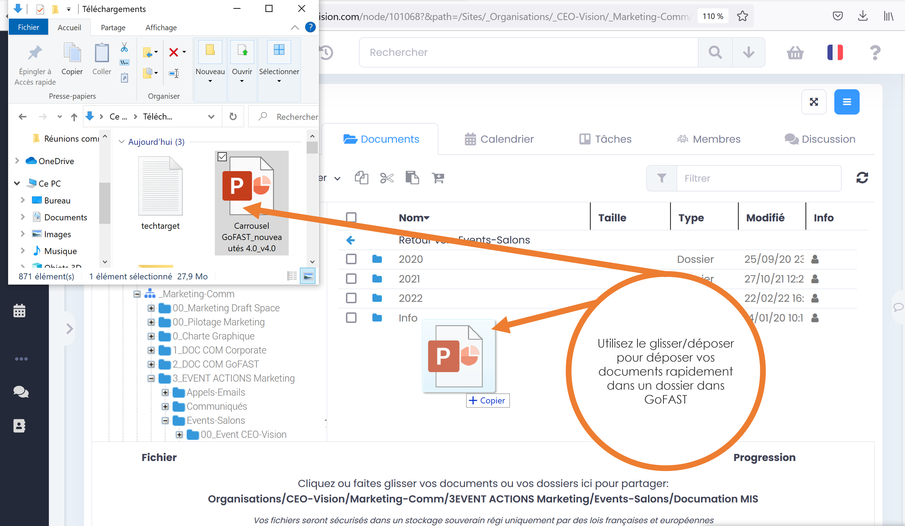
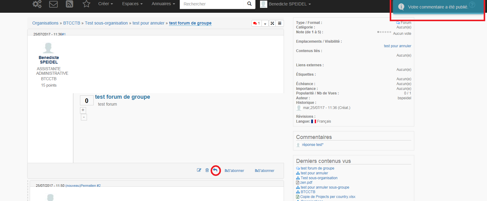
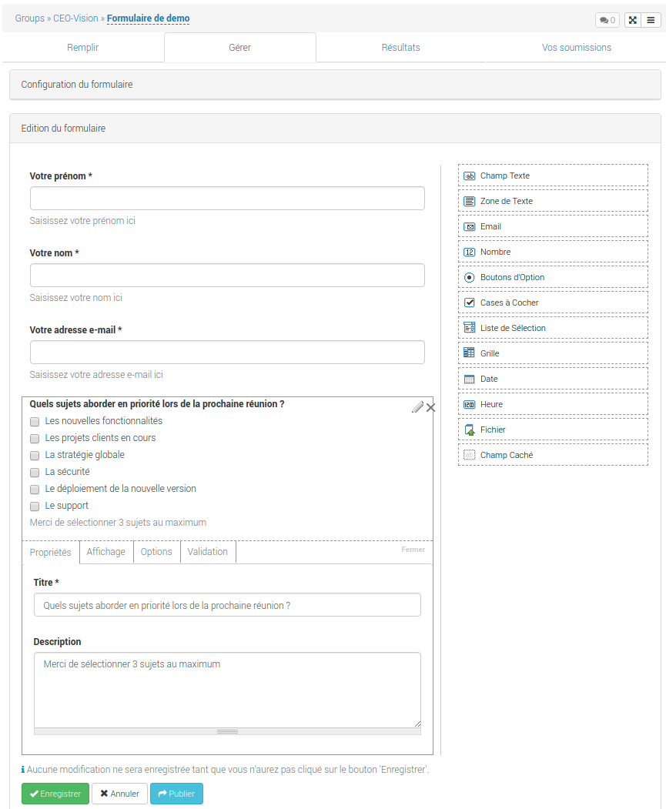

==============================
GoFAST : Guide Utilisateurs 
==============================

   
   
Introduction
============

Ce guide vous apprend à utiliser GoFAST de la manière la plus efficace
possible et de manière didactique avec de nombreuses copies d'écran de
la plateforme, qui vous guident pas à pas. Il vous explique tous les
trucs et astuces, les raccourcis et les différentes manières de faire
une même action par rapport à un document/un espace.

.. NOTE:: Nous vous recommandons de lire impérativement l'annexe "Les
   bonnes pratiques avec GoFAST" et visioner nos videos tutoriaux https://www.youtube.com/playlist?list=PLPEB28cL2VmHsEft6pxpp_LDWzPAxwxS0

.. NOTE:: Un forum vient d'être lancé, n'hésitez pas à créer un compte https://community.ceo-vision.com
   

Rappel des principes de la plateforme GoFAST
--------------------------------------------

GoFAST en 2 mots
~~~~~~~~~~~~~~~~

GoFAST, fruit de plusieurs années de développement, est une puissante
plateforme collaborative et de gestion documentaire. GoFAST est basée
sur les technologies Opensource les plus reconnues du marché dont
Alfresco, Drupal, Bonitasoft et bien d'autres. GoFAST est reconnue comme
étant une des plateformes collaboratives les plus intuitives.
Enfin, GoFAST est hébergé dans votre organisation garantissant le
*meilleur niveau de confidentialité* et de sécurité.

A quoi sert GoFAST?
~~~~~~~~~~~~~~~~~~~

C’est une plateforme d’échanges d’information qui permettra à tous les
collègues, aussi bien siège et terrain (et même des externes)
, de pouvoir gérer/modifier et commenter des documents, partager des
informations, chatter en direct, échanger des expériences, s’envoyer des
mails, … Bref, c’est un outil de collaboration moderne et interactif qui
fonctionne partout où il y a une connexion internet, et même hors ligne
avec synchronisation possible par la suite lorsque vous vous
reconnectez.

Améliorer la **collaboration** est la principale problématique à
laquelle répond GoFAST : elle permet de centraliser les documents et les
échanges à propos de ces documents en un seul endroit, accessible
partout et à tout moment ; de limiter les doublons ; de diffuser des
notifications automatiques qui optimisent non seulement la collaboration
mais aussi la gestion documentaire.

Objectifs et avantages de la GoFAST
~~~~~~~~~~~~~~~~~~~~~~~~~~~~~~~~~~~

-  Favoriser le travail collaboratif (jusqu'à la co-édition simultannée) et
   l’échange d’informations
-  Diminuer le nombre d’emails internes et supprimer les emails avec des
   pièces jointes (problèmes de quota, mauvaises versions)
-  Arrêter la duplication des contenus
-  Gagner du temps dans la recherche d’informations (dont les fichiers)
-  Respecter les processus mis en place. Et ne plus jamais manquer une
   deadline
-  Diminution des erreurs en ayant accès à toutes les versions d'un
   document
-  Améliorer la sécurité (gestion des droits d'accès)
-  Faciliter le travail lors de déplacements
-  Réduire le volume de papier

Pour qui ?
~~~~~~~~~~

Pour tous les membres de votre organisation, et des vos partenaires
réguliers grace à une zone "Extranet".

Au-delà des espaces collaboratifs, GoFAST offre un espace personnel,
réservé à chaque utilisateur pour ses documents personnels, brouillons,
mémos, etc.

Pré-requis nécessaires pour l’utilisation de GoFAST
---------------------------------------------------
-  Navigateurs préférentiels Windows: **Firefox (dernière version ESR ou dernière version 'classique'), Edge-Chromium**, Chrome

.. NOTE::
    A titre d'illustration, au 23/12/2020 nous supportons Firefox 84 et Firefox ESR 78.6 
.. NOTE::
    Le support IE11 est optionnel en 2020 et certaines nouvelles fonctionnalités sont incompatible (tâches kanban, chat,webconference), CEO-Vision recommande une migration au plus vite de IE11 et Edge vers Edge-Chromium ou Firefox ESR. CEO-Vision n'assurera plus aucun support pour IE11 en 2021 
    
    -Edge-Chromium https://www.microsoftedgeinsider.com/fr-fr/enterprise
    
    -Firefox ESR en Français https://www.mozilla.org/fr/firefox/organizations/all/

-  Navigateur MacOS : Safari 12+ (sauf webconference), Chrome 65+

-  Navigateur Linux : Firefox (dernière version ESR)
   
-  Système d'exploitation Windows7 et plus, MacOS 10.11+ et Linux (Ubuntu 16+), ChromeOS
-  En mobilité Android ou iOS 13+ 

-  Bureautique : MS-Office 2010 (>14.0.7190.5000) pour Windows, MS-Office 2016 pour Mac, LibreOffice 6+, OnlyOffice Desktop (à venir)

-  Messagerie : Outlook 2013+ (Outlook 2010 sans garantie), Thunderbird 52+, Client léger Bluemind  

-  Une connexion relativement bonne est nécessaire : téléchargement de
   512 kbits/s min. et 256kbps upload . Vous pouvez d'ailleurs tester
   directement votre connexion via ce lien http://www.speedtest.net/
   (http://beta.speedtest.net/)
   
-  Une très bonne connexion pour la webconference en HD : jusqu'à 6MB/s peuvent être nécessaire. Certains filtrages réseaux peuvent empecher le fonctionnement de la webconference. Si https://gofast-docs.readthedocs.io/fr/latest/docs-gofast-users/doc-gofast-problemes-connus.html#webconference ne vous aide pas, contacter votre administrateur réseau en cas de problème.    

-  Résolution écran 1366x768 minimum (format 16:9)

- En mobilité : Tablette ou smartphone récent (ios ou android)

Configuration/Installation supplémentaires optionnelles
---------------------------------------------------------
Des configurations et/ou installations supplémentaires sont nécessaires pour 

- Voir GoFAST dans l'explorateur de fichiers Windows
- Editer en ligne les contenus non Office ou LibreOffice (exemple signature de PDF)
- Synchonisation hors-ligne

Dans la plupart des cas contacter votre support informatique.

Quoi de neuf en GoFAST v3
-------------------------

GoFAST v3 est le résultat de 2 années et demi de R&D et est un important
saut en avant en terme fonctionnel, ergonomique et technologique.

On peut rapidemment noter :

**Un socle technologique totalement mis à jour :**

-  Alfresco 4 vers 5, Drupal 6 vers 7, CentOS 6 vers 7, ...
-  L'ajout d'un 2ème serveur pour gérer la partie collaborative

**Des nouvelles fonctionnalités :**

-  de vidéo-conférence (Jitsi)  concurrente de Skype mais d'un
   fonctionnement plus simple (simple navigateur+url de conférence) et
   prenant moins de bande passante ;
-  l'édition en ligne simultanée, c-à-d que plusieurs personnes peuvent
   désormais travailler sur un même document en même temps (même
   principe que GoogleDocs mais restant dans un format Office) ;
-  une version pour les smartphones et tablettes;
-  la possibilité de partager des documents avec des personnes n'ayant
   pas de compte

**De multiples améliorations :**

-  d’une interface plus dynamique (responsive), plus simple (menu
   contextuel d'actions, ...) et avec plus de visibilité (élargissement
   de la zone d'affichage des documents)
-  d'une meilleure gestion des "modèles/templates"
-  la possibilité de voir les changements de prévisualisation ou
   métadonnées sans recharger la page
-  d'un nouvel outil de messagerie instantannée / chat pouvant même être
   utilisé sur un smartphone
-  les téléversements en masse ne pénalisent plus ceux qui mettent un seul document
-  d’une version néerlandophone

Les Bases
=========

Connexion/Login
---------------

.. figure:: media-guide/image001.png
   :alt: 

Vous pouvez vous identifier à GoFAST 3.0 via l’adresse URL :
https://gofast.monorganisation.com

Il suffit d’entrer votre **identifiant** et votre **mot de passe**.

.. NOTE::
   Si la délégation d'authentification a été activée sur votre
   site, il s'agit de votre mot de passe Windows

Accueil
-------

La première fois que vous vous loguez sur la GoFAST 3.0, il se peut que
vous arriviez sur une page d’accueil de ce genre, avec un message
public.

.. figure:: media-guide/image002.png
   :alt: 

Voici un aperçu général de la **page d’accueil GoFAST 3.0** avec : le
fil d’activité et tous les événements au centre ; vos dossiers à
gauche ; et les filtres à droite ; ainsi que toutes les fonctionnalités
de base au-dessus sur la barre noire du menu et dans le coin gauche en
bas.

.. figure:: media-guide/Image-Accueil-1.png
   :alt: 

.. NOTE::
    Vous pouvez revenir à la page du fil d’activité à tout moment
    en cliquant sur le symbole GoFAST, dans le coin gauche supérieur.

.. figure:: media-guide/Home-GoFAST.png 
   :alt: 

Vous pouvez directement choisir la langue dans laquelle vous voulez
travailler, dans le coin en haut à droite (FR,EN, NL)

.. figure:: media-guide/choix-langue.png
   :alt: 

Pour accéder à **votre profil**, cliquez sur votre nom. De là, vous
pourrez également accéder à vos abonnements, votre panier ou vous déconnecter.

.. figure:: media-guide/votre-profil-0.png
   :alt: 
   
.. figure:: media-guide/votre-profil-1.png
   :alt: 

Dans l’ensemble, le principe et l’utilisation du fil d’activité reste
pareil que dans la GoFAST 2, c’est-à-dire qu’il vous donne une **vue
d’ensemble** sur tout ce qui s’est passé dans vos espaces collaboratifs
(groupes/organisation/Public/Extranet) ; vous pouvez voir les
personnes qui ont mis un nouveau document ou modifier un document ou
commenter un document dans vos espaces collaboratifs, quel type de
document, où il se trouve, son statut…

Il suffit de cliquer sur le nom du fichier pour l’ouvrir/le visualiser
et sur les trois bandes horizontales pour y voir les raccourcis de certaines
fonctionnalités (éditer, télécharger, commenter, favoris, abonnement,
permalien…)

.. figure:: media-guide/raccourci-fonctionnalités.png
   :alt: 

(voir aussi plus loin : Actions contextuelles)

.. HINT::
   Appuyez sur Ctrl et sur le titre du document pour
   l’ouvrir dans un nouvel onglet. Cela devrait fonctionner partout.

Vous pouvez **filtrer** la liste des documents de votre fil d’activité
selon des groupes spécifiques et le statut des documents (draft,
archivé, validé, …).

.. figure:: media-guide/filtres.png
   :alt: 

Vous pouvez également choisir de masquer ou afficher les **« Nouvelles »** =
ce que vous ou les autres écrivent dans **« Partager une
nouvelle »** et qui se retrouvent également dans le fil d’activité. Pour
ce, appuyez sur « Afficher les nouvelles » dans les « Filtrer le fil
d’activité »

.. figure:: media-guide/afficher-les-nouvelles.png
   :alt: 

Pour mettre ce genre de message général sur la GoFAST (votre humeur, une
question, une citation du jour,…des infos qui se retrouveront dans le
fil d’activités), appuyez sur « Partager une nouvelle » tout en haut du
fil d’activité. Une fenêtre s’ouvre où vous pouvez écrire votre message,
terminez par « Envoyer ». Et votre message apparaîtra dans les
événements.

.. figure:: media-guide/image015.png
   :alt: 

.. figure:: media-guide/image016.png
   :alt: 

L’écran d’accueil vous montre aussi directement **l’arborescence de vos
espaces** collaboratifs (votre espace privé, l’Extranet, vos groupes,
votre organisation, l’espace Public) si vous choisissez d’ afficher
cette partie (où on voit l’arborescence GoFAST et vos dossiers/groupes)
en cliquant sur la barre grise verticale.

Vous retrouverez cette même barre grise verticale du côté droit pour
afficher ou masquer le chat.

.. figure:: media-guide/image013.png
   :alt: 

Il suffit de cliquer sur le dossier bleu pour en voir les **niveaux
inférieurs et vos fichiers**, et d’ensuite cliquer sur le fichier
souhaité pour en prévisualiser le contenu.

.. figure:: media-guide/image012.png
   :alt: 

Mon profil
----------

.. figure:: media-guide/image017.png
   :alt: 

Vous retrouvez les données vous concernant dans « **Mon profil** »,
sous votre nom, à droite de l’écran d’accueil.

Les données de votre profil restent les mêmes que dans GoFAST 2, seule
la visualisation change un peu.

Vous retrouvez « votre carte de visite virtuelle » avec votre nom,
prénom, fonction, entreprise, rôle dans GoFAST, téléphone, email, …
ainsi que les données liées à votre compte GoFAST : vos espaces
collaboratifs, groupes, organisation(s), hobbies, …

.. figure:: media-guide/image018.png
   :alt: 

Paramètres du profil
~~~~~~~~~~~~~~~~~~~~

La page de vos **paramètres de compte** a un peu changé d’apparence mais
on y retrouve les mêmes informations : identifiant, nom, prénom, email,
mot de passe, votre **langue de travail.**

.. figure:: media-guide/image019.png
   :alt: 

Ajouter une photo à son profil 
~~~~~~~~~~~~~~~~~~~~~~~~~~~~~~~

Allez dans votre profil, cliquez sur le logo de la **photo**, vous
verrez d’ailleurs votre nom apparaître.

.. figure:: media-guide/image020.png
   :alt: 

Vous arriverez sur cette page, appuyez sur « Charger un fichier » pour
aller chercher votre photo sur votre ordinateur, double-cliquez dessus
ou cliquez sur OUVRIR. Vous pourrez l’adapter. Puis « Enregistrez ».

.. figure:: media-guide/image021.png
   :alt: 

Votre photo apparaîtra dès lors dans votre profil et partout où vous
agirez sur GoFAST. C’est un moyen rapide et amusant de connaître ses
collègues éloignés et de savoir à qui on s’adresse ( à condition de
mettre de vraies photos de profil) .

.. figure:: media-guide/image023.png
   :alt: 

.. figure:: media-guide/image024.png
   :alt: 

Les Espaces collaboratifs
-------------------------
Les espaces collaboratifs sont des zones de travail collaboratif et de partage de documents accessibles uniquement aux utilisateurs membres.

Il existe plusieurs types d'Espaces Collaboratifs : 

-  Organisation (Organigramme : Directions, Départements, Services...)
-  Groupe (espaces transverses : projet, produit, site géographique, thématique, ...)
-  Extranet (espaces de travail avec des collaborateurs extranets)
-  Public (accessible à tous les utilisateurs internes - non "extranets")

Un espace Privé est également disponible pour chaque utilisateur. 

Les Rôles disponibles pour les Membres des Espaces Collaboratifs sont : 

- Administrateur 
- Contributeur
- Lecture Seule 

Chaque espace peut contenir un ou plusieurs sous espaces. Dans ce cas il est possible d'avoir un sous-ensemble de membres dans les sous-espaces afin de restreindre l'accès. Plus vous descendez dans l'arborescence, moins il y a potentiellement de membres. 
La gestion des accès aux espaces suit une suite logique d'entonnoir. 

.. NOTE::
   Les espaces peuvent contenir des fichiers, autres contenus (ex : forums, pages Wiki, etc.), des sous-espaces (avec droits associés) ou encore des dossiers classiques. Les dossiers classiques héritent des mêmes droits d'accès que l'espace parent où ils se trouvent.
   Les espaces sont représentés dans l'explorateur de fichiers intégré par des icônes distinctes et avec un "_" devant le nom de l'espace (ex: _Organisation) dans l'explorateur de fichiers Windows ou Mac. 

Avant de pouvoir déposer les fichiers et les documents sur la plateforme GoFAST, assurez-vous de créer les "bons" espaces et sous-espaces collaboratifs de type Organisation, Groupe ou Extranet ! 

Notion de partage de contenus entre espaces
~~~~~~~~~~~~~~~~~~~~~~~~~~~~~~~~~~~~~~~~~~~

.. IMPORTANT::
   Pour qu'un document se retrouve dans plusieurs espaces (et
   bien sûr sans doublons), il est **partagé** en changeant sa visibilité
   (sur la page sur document)

Retrouver ses espaces
~~~~~~~~~~~~~~~~~~~~~

Dans l’onglet « **Espaces** », vous retrouvez tous vos **espaces
collaboratifs**, c’est-à-dire vos groupes, votre organisation, votre
espace privé, l’espace Public, l’Extranet, …

.. figure:: media-guide/image025.png
   :alt: 

Espace Privé
~~~~~~~~~~~~

Plutôt que de stocker les documents sur le desktop de votre ordinateur,
il est recommandé de les mettre dans cet **espace personnel** pour ainsi
bénéficier des fonctionnalités GoFAST, notamment le moteur de recherche,
le versionning (qui évite de perdre des informations si une version de
fichier est corrompue) ou encore l’accès à distance à ses fichiers (via
un autre PC, tablettes et smartphone).

Pour accéder à votre espace personnel, il suffit d’aller sur l’onglet «
Espaces », « Mon Espace Privé » . Vous arrivez sur votre page
personnelle avec votre page d’accueil, vos activités, vos documents,
votre calendrier, … (= les 4 onglets que vous retrouverez dans chaque
espace collaboratif/groupe).

.. figure:: media-guide/image026.png
   :alt: 

De même, dans chaque espace collaboratif, vous retrouverez les 2 petites
icônes en haut à droite ; dont la 1ère « Parcourir à partir
d’ici » vous permet d’ouvrir une **nouvelle page** avec l’arborescence
de vos dossiers et fichiers, et avoir ainsi une vue d’ensemble de vos
fichiers. (pareil que l’onglet « Documents »)

.. figure:: media-guide/image028.png
   :alt: 

.. figure:: media-guide/Image-Espace-2.png
   :alt: 

La 2eme icône « Afficher le contenu en pleine page » permet **d’agrandir
la vue** de la page, en supprimant ce qui entoure les onglets

.. figure:: media-guide/image030.png
   :alt: 

.. figure:: media-guide/image031.png
   :alt: 

Il suffit de réappuyer sur la même icône à 2 flèches pour revenir à la
vue précédente, avec plus d’infos comme les derniers contenus vus.

Espace Public
~~~~~~~~~~~~~

A l’inverse de l’espace personnel/privé, **l’Espace Public** donne accès
aux documents « publics » visibles par tous les utilisateurs internes GoFAST
(sauf les membres Extranet).

Mais contrairement à GoFAST 2, cet espace Public interne est maintenant
géré par **tous les administrateurs de plateforme** de la GoFAST (y créer des
sous-espaces, déposer les documents etc..) : les autres utilisateurs
dits « standards/contributeurs» ne peuvent *pas ajouter de contenus ni
les modifier dans l’espace Public*, ils devront le demander à leur
administrateur de plateforme.

Par contre, les administrateurs peuvent également configurer l'espace
public de telle sorte que tous les utilisateurs et membres de la plateforme (hors Extranet) puissent
contribuer aussi à cet espace public: soit la lecture, soit l'écriture.

Pour y accéder, allez dans « **Espaces** », « **Public** ». Pas
besoin d’en être membre, vous y avez accès automatiquement.

Pour résumé, il y a donc deux possibilités d'alimenter cet espace **Public**.

-  Les utilisateurs ayant pour rôle **Super-Administrateurs** peuvent alimenter, modifier, créer des documents, créer des sous-espaces, etc. Les documents sont alors visibles par tous les utilisateurs en **Lecture Seule**.
-  Tous les utilisateurs et membres de la plateforme (hors membres Extranet) sont **Contributeurs** de cet espace et ont la possibilité d'ajouter, modifier, supprimer les documents.

.. figure:: media-guide/image032.png
   :alt: 

**Que trouve-t-on dans cet espace Public ?**

Pour le contenus totalement transversal à l'Organisation. On peut également y mettre des forums de support et tout contenus généraux.

.. figure:: media-guide/image033.png
   :alt: 

.. NOTE::
   Petite différence avec la version précédente de GoFAST v2 \ **: les
   dossiers de l’Espace Public deviennent des sous-espaces** par souci de
   clarté.

Vous pouvez **vous abonner** à cet espace via le petit logo entouré en
mauve et en cliquant sur « s’abonner ». Vous recevrez ainsi directement
des notifications par rapport au contenu de cet espace. Vous pourrez
d’ailleurs faire cela pour tous les espaces.

Espace Extranet
~~~~~~~~~~~~~~~

.. figure:: media-guide/image035.png
   :alt: 

L’espace « **Extranet** » a la même fonction que dans GoFAST 2, c’est
l’espace partagé avec des externes à l'organisation.

Cet espace/groupe « Extranet » permet donc de partager des contenus avec
des clients, fournisseurs ou toute autre entité partenaire qui collabore
fréquemment mais **qui ne fait pas partie de l’organisation interne.**

Si vous voulez donner accès à cet espace à une personne externe, le
principe est le même que pour tout nouvel utilisateur, il faut lui créer
un compte et le faire membre du sous-espace Extranet le concernant. On
peut donner le rôle de « contributeur » à ce nouveau membre externe si
on veut qu’il puisse travailler sur les documents partagés ou alors
juste le mettre en « lecture seule », ainsi il ne pourra pas modifier de
documents partagés mais juste les commenter et télécharger (attention :
il ne pourra pas non plus en rajouter alors).

.. NOTE::
   Si on est administrateur d’un espace, on peut créer des comptes
   d’utilisateurs mais on ne pourra mettre ces utilisateurs que dans les
   espaces dont on a la responsabilité. Il se peut donc que vous soyez
   administrateur d’un groupe mais pas d’Extranet.

.. NOTE::
   GoFAST 3 permet d’envoyer, vers des personnes externes (= qui n’ont
   pas de compte GoFAST), des messages avec le lien vers un document qui
   se trouve sur GoFAST ; ils pourront ainsi charger le lien et avoir
   accès au document pendant 15 jours. Si vous voulez donc juste
   partager des documents pour information et non pour travailler
   dessus, pas besoin de créer un compte et un groupe spécifique avec un
   externe pour cela.

Les Groupes (= Espaces Transversaux)
~~~~~~~~~~~~~~~~~~~~~~~~~~~~~~~~~~~~

Les « **Groupes** » sont des zones de partage **transversales** /
interservices (ex : des groupes de projet). Ce sont des espaces dédiés à
des thématiques spécifiques qui ont un grand rôle collaboratif : toutes
les personnes concernées par le projet/sujet y ont accès, y compris dans
le cas où elles ne sont pas rattachées à la même « Organisation ».

Vous pouvez donc faire partie de plusieurs groupes.

A ce niveau, dans l’onglet « Espace » et « groupes » , vous ne verrez
que les groupes dont vous êtes membres et dans lesquels vous avez donc
accès aux documents. (=> non défini)

Les Organisations (= Départements/Services)
~~~~~~~~~~~~~~~~~~~~~~~~~~~~~~~~~~~~~~~~~~~

Les espaces collaboratifs appelés « **Organisations** » correspondent
aux **départements** et **services** selon l'organigramme de votre
organisation; à ce niveau, vous n’y verrez que ceux auxquels vous
appartenez (RH, FIN, ….)

.. figure:: media-guide/image037.png
   :alt: 

Les ‘‘Organisations’’ représentent donc normalement la structure
hiérarchique de l’entreprise et chaque département (RH, IT, Financier,
...) peut avoir des sous-espaces pour les services.

Vous n’aurez donc accès qu’à **une organisation** dont vous êtes membre.

.. NOTE::
   Si vous devez **partager** des documents entre différents
   départements, vous devez le faire à travers un **Groupe** dédié. Par
   exemple un contrat est dans l'Organisation "Juridique" et aussi dans
   le Groupe "ProjetA" car c'est un contrat qui concerne le "ProjetA"
   dans lequel des membres de plusieurs départements sont rassemblés.
  
.. NOTE::
   Un utilisateur peut faire partie d’une ou plusieurs organisations (si
   fonction partagée entre 2 départements) et sous-organisations (les
   Services), et fait d’office partie de **plusieurs groupes** et
   sous-groupes collaboratifs pour pouvoir travailler avec ses collègues
   sur des projets/groupes de travail transversaux.

Création de Documents, Contenus, Utilisateurs
=============================================

Créer un Espace Collaboratif
----------------------------

Il est possible de **créer de nouveaux Espaces
Collaboratifs/sous-Espaces**, **si toutefois vous en avez les droits,
c’est-à-dire si vous êtes administrateur de l’espace-parent.**

Vous pouvez créer un nouvel espace:
   - dans les groupes transversaux
   - dans les organisations (vos services/département)
   - dans Public (visible par tous les utilisateurs sauf les externes)
   - sur l’Extranet (visible aussi par les externes)

Allez sur l’onglet « Créer » puis sur la flèche à côté de « Espace »,
vous verrez la liste des espaces dans lesquels vous pouvez créer un
nouveau sous-espace/groupe.

.. figure:: media-guide/image076.png
   :alt: 

Exemple ici pour créer un nouvel espace dans « Organisation » (dans
l’organigramme de la société donc) : Appuyez sur « Organisation », une
page s’ouvre où vous pouvez ajouter le titre de l’espace, une brève
description, créer une page d’accueil, choisir l’emplacement (le groupe
parent), … puis « Enregistrez »

Même principe pour toute création d’espace dans les groupes, Public
et Extranet.

Votre sous-espace (dans Organisations ici ) est ainsi créé, avec ces
différents onglets et sa page d’\ **accueil** en 1er onglet
(que vous pouvez customiser comme vous voulez, avec une photo, un
message, une page web, …, pour présenter votre groupe)

.. figure:: media-guide/image078.png
   :alt: 

a) L’onglet « **Activité** » montre les événements qui se passent dans
   ce groupe : le forum s’il y a des conversations/commentaires ; les
   pages intranet liées ; les contenus/documents les plus consultés dans
   ce groupe ; et les contenus définis avec un état (validé, draft, etc)

.. figure:: media-guide/image079.png
   :alt: 

b) L’onglet « **Documents** » montre tous les fichiers qui se trouvent
   dans votre groupe, dans la fenêtre au centre de l’écran, et
   l’arborescence par rapport à toute la GoFAST dans la colonne de
   gauche.

On voit dans l’exemple ici qu’il y a dans la fenêtre du milieu un
dossier et plusieurs fichiers qui font partie du groupe « \_Test pour
annuler » qui lui-même se trouve dans l’arborescence (flèche rouge à
gauche) de l’espace de base/espace-parent « Organisation », sous-espaces
« BTCCTB » et « Test sous-organisation».

.. NOTE::
   Dans l’arborescence, on distingue les espaces avec un
   underscore devant leur nom « \_ » ; s’il n’y a rien , ce sont des
   dossiers/
   s. Dans les 2 cas, vous pouvez voir leurs niveaux
   inférieurs en cliquant sur le petit « + » devant chacun. Ou les cacher
   avec le petit « - ».

On peut également voir le cheminement du fichier (path), au-dessus des
onglets, encadré en vert ici.

.. figure:: media-guide/Image-4.png
   :alt: 

C’est à ce stade que vous pouvez **glisser/déposer directement des
fichiers** qui se trouvent ailleurs sur votre ordinateur ou les
télécharger en appuyant sur « Parcourir » en bleu en bas à droite.

.. figure:: media-guide/image081.png
   :alt: 

Une fois avoir double-cliqué sur le document à télécharger ou sur
« Open », vous voyez une barre de progression en bas de page qui vous
indique que le document se charge sur la GoFAST. (flèche bleue devant le
nom du document = en charge, croix = problème, sablier = en liste
d’attente)

.. figure:: media-guide/image082.png
   :alt: 

Dès que le document est chargé et apparaît dans la fenêtre centrale,
vous pouvez y travailler comme à l’habitude, grâce aux raccourcis de
fonctionnalités (clic-droit de la souris quand vous avez sélectionné le
document) ou en double-cliquant sur le titre du fichier pour le
prévisualiser et avoir accès à toutes ses métadonnées et ses
fonctionnalités.

.. figure:: media-guide/Picture1.png
   :alt: 

Voir aussi"Gestion des documents"

Créer un compte Utilisateur
--------------------------------

Voir 'Créer un utilisateur dans un
espace/groupe'

Chaque administrateur d’espace/groupe peut **créer un nouvel
utilisateur** qu’il rattachera alors directement à ce groupe (et autres
si besoin et s’il en est l’administrateur aussi).

.. image:: media-guide/Tag-Enterprise.png
   :align: right
   :scale: 7%
   

Créer/Ajouter un nouveau Document
---------------------------------

Il est possible de **créer de nouveaux documents** directement sur la
GoFAST, plus besoin de créer d’abord le document sur votre desktop puis
de le migrer .

Allez sur l’onglet « Créer », « Contenu », « Fichier,Document ».

.. figure:: media-guide/image049.png
   :alt: 

Une page s’ouvre, sur laquelle vous pouvez indiquer le nom du document «
titre » et déjà y apposer quelques métadonnées de base (extension/type,
langues).

Choisissez l’option « Créer un fichier vide »

Choisissez l’emplacement où se retrouvera le document dans
l’arborescence des fichiers en cochant la case devant le nom du
groupe/répertoire en question ou en cliquant 2x sur le nom du groupe pour
qu’il se retrouve sur la droite en bleu.

Puis enregistrez.

.. figure:: media-guide/image050.png
   :alt: 

.. figure:: media-guide/image051.png
   :alt: 

Si le document existe déjà ailleurs sur votre PC, vous pouvez l’ajouter
sur la GoFAST via ce canal-ci également.

Il suffit alors de le télécharger en cliquant sur « **Télécharger un
fichier** » et « Choose File » ; le contenu de votre PC s’ouvre,
choisissez votre document à migrer ; choisissez l’emplacement dans
l’arborescence. Puis enregistrez.

.. figure:: media-guide/image053.png
   :alt: 

Vous verrez ainsi la prévisualisation de votre document et pourrez
commencer à y travailler et y apposer les métadonnées relatives.

Créer un document à partir d’un modèle (template)
~~~~~~~~~~~~~~~~~~~~~~~~~~~~~~~~~~~~~~~~~~~~~~~~~

Vous pouvez créer un **nouveau document à partir d’un template** déjà
existant sur la GoFAST.

Il faut pour cela que vos templates soient placés au préalable dans un
répertoire spécifique appelé « TEMPLATES » qui se trouve dans les espaces et
sous-espaces.

Le fait de les déposer dans ce répertoire leur donne automatiquement
l’étiquette de « Template ». Vous pourrez ensuite retrouver ces
documents dans le Formulaire "Créer un document à partir d'un Modèle".

.. NOTE::
   Dans GoFAST 3, la catégorie « Template » n'existe plus.
   C'est à présent dans les étiquettes que vous la retrouverez.

Vous devez créer ce répertoire « TEMPLATES » dans l’onglet « Documents »
dans les espaces et les sous-espaces de type Organisation/Groupe.

Pour créer ce nouveau document à partir d’un template existant, allez
dans l’onglet « Créer »\_« Contenu »\_«Fichier,Document ».

Choisissez l’option « Créer à partir d’un modèle » (en dessous du
titre), vous verrez alors les différentes possibilités de **répertoires
« TEMPLATES »** contenant des modèles. Cochez le modèle que vous voulez
utiliser. Le titre et l’extension se mettront automatiquement selon le
type de modèle choisi. Choisissez un nouveau titre, la langue et
l’emplacement où vous voulez le placer puis « Enregistrer ».

Vous pouvez même éviter la notification aux autres membres de la
création de ce document, en cochant la petite case juste au-dessus d’ «
Enregistrer »

.. figure:: media-guide/image057.png
   :alt: 

Après avoir appuyé sur « Enregistrer » , vous verrez la prévisualisation
de votre nouveau document.

.. figure:: media-guide/image058.png
   :alt: 
   
Ajouter un ou plusieurs documents par *glisser-déposer*
~~~~~~~~~~~~~~~~~~~~~~~~~~~~~~~~~~~~~~~~~~~~~~~~~~~~~~~~~
Vous pouvez à tout instant glisser un document vers GoFAST, soit sur la page d'accueil soit dans l'explorateur de fichiers.

Ajouter un ou plusiers documents par le *Lecteur Réseau*
~~~~~~~~~~~~~~~~~~~~~~~~~~~~~~~~~~~~~~~~~~~~~~~~~~~~~~~~~
Pour utiliser l'explorateur Windows (ou Explorer sous MAC) vous devez configurer celui-ci pour qu'il accède à GoFAST.

Configurer le *Lecteur Réseau*
^^^^^^^^^^^^^^^^^^^^^^^^^^^^^^

Faire un clic-droit sur "Ce PC" et choisir "Connecter un lecteur réseau"

.. figure:: media-guide/config-win-webdav1.png
   :alt: 
   
Entrer l'adresse pointant vers votre GoFAST, ex. ``\\gofast.ceo-vision.com@SSL\alfresco\webdav\``

.. figure:: media-guide/config-win-webdav2.png
   :alt:

Une boite de dialogue s'ouvrira ensuite dans laquelle vous devrez entrer vos identifiants / mot de passe GoFAST
 
En cas d'erreur voir http://gofast-docs.readthedocs.io/fr/latest/docs-gofast-users/doc-gofast-problemes-connus.html#gofast-problemes-connus 
 
Une fois cette opération faite, vous pouvez voir GoFAST comme un "Lecteur Réseau", alors la même arborescence

.. figure:: media-guide/webdav-gofast.png
   :alt:

Vous pouvez faire toute opération, commme des copier-coller de documents ou de répertoires entiers.  

.. CAUTION:: Vous ne pouvez pas faire d'opérations sur les Espaces (commençant par un _)

.. figure:: media-guide/copier-coller-webdav.png
   :alt:

Créer une page Wiki (page interne)
--------------------------------------

Il est possible de **créer une page Intranet/Wiki** sur la GoFAST.

Allez sur l’onglet « Créer » puis « Contenu », « Page Intranet ».

Donnez-lui un titre, créez son contenu grâce aux mêmes fonctionnalités
que Word, choisissez son emplacement dans l’arborescence.

Vous pouvez choisir l'emplacement du livre, puis sélectionnez soit
« Créer un nouveau livre », soit « créer ce livre dans un autre livre »
(une sorte espace/sous-espace). Puis cliquez sur « Enregistrer ». Vous
retrouverez votre livre au niveau d'un espace choisi auparavant.

Le **livre** est une sorte de classement virtuel de pages Intranet. Vous
pouvez ajouter n'importe quelle page Intranet qui est sur GoFAST dans le
livre. Vous pouvez créer des thématiques et puis naviguer facilement
d'un contenu à l'autre.

Par exemple, créer un livre peut être intéressant dans le cadre de
réalisation d'un projet collaboratif lorsque vous avez besoin de créer
l'ensemble de contenus par thème.

Concernant le poids : plus le poids du contenu est lourd, plus il sera
négatif; si le poids du contenu est léger, plus il sera positif. Il
l'attribue automatiquement en mesurant le poids du contenu créé.

.. figure:: media-guide/image059.png
   :alt: 

.. figure:: media-guide/image060.png
   :alt: 

Voici un exemple d’aperçu d’une page web, qui se compore comme un
document, avec les métadonnées relatives sur la droite

.. figure:: media-guide/image061.png
   :alt: 

Créer une page Web externe (URL)
----------------------------------

Avec cette fonctionnalité, vous pouvez **intégrer des pages externes**
qui proviennent d'autres sites web. On pourra donc visualiser le contenu
d'une page web externe directement dans la plateforme GoFAST.

Allez sur l’onglet « Créer », « Contenu », « Page Externe URL »

.. figure:: media-guide/image062.png
   :alt: 

Indiquez un titre, choisissez la langue, copier le lien URL, choisissez
l’emplacement dans l’arborescence (cochez la case ou cliquez sur le nom
du groupe pour le retrouver en bleu sur la droite), enregistrez.

.. figure:: media-guide/image063.png
   :alt: 

Créer un Forum
---------------

Il est possible de créer des « mini-forums » dans un groupe. Ce qui
revient à démarrer un fil de **discussion** via les commentaires.

Allez sur l’onglet « Créer » , « Contenu », « Forum ».

Indiquez le sujet du Forum, choisissez la langue, écrivez du contenu
(comme dans Word), choisissez l’emplacement dans l’arborescence,
enregistrez.

.. figure:: media-guide/image064.png
   :alt: 

Si le forum que vous avez créé se trouve dans un groupe, vous le
retrouverez dans l’onglet « Activité » de votre groupe, 1\ :sup:`er`
cadre. Cliquez sur son nom pour l’ouvrir.

.. figure:: media-guide/image066.png
   :alt: 

Vous pouvez enrichir le forum de votre groupe par le même principe que
l’ajout de commentaire. Vous pourrez ensuite soit supprimer (poubelle)
/modifier (crayon sur feuille) votre commentaire, soit répondre à un
commentaire (petite flèche) ainsi que vous abonner/désabonner à ce
forum.

Un message en haut à droite apparaîtra signalant la publication de votre
commentaire.

Créer un Formulaire
-------------------

Il est possible de **créer un formulaire d’enquête** par exemple
directement sur la GoFAST.

Allez sur l’onglet  « Créer », « Contenu », « Formulaire » .

Donnez un titre au formulaire, créer le contenu de l’intro, choisissez
son emplacement dans l’arborescence, enregistrez.

.. figure:: media-guide/image068.png
   :alt: 

.. figure:: media-guide/image069.png
   :alt: 

Vous le retrouverez dans les contenus populaires ou dans l’emplacement/dans le groupe 
où vous avez mis votre formulaire. Il se retrouvera également
en haut du fil d'activité, dans la recherche et dans vos derniers contenus vus.

.. figure:: media-guide/image073.png
   :alt: 

Une fois que votre formulaire est crée, vous arriverez sur la page du formulaire.
C'est sur cette page qu'arriveront les utilisateurs
qui rempliront votre formulaire. Pour l'instant, elle est vide.

.. NOTE::
   Pour l'instant, et tant que vous n'aurez pas publié votre formulaire, personne
   ne pourra le remplir.

.. figure:: media-guide/form01.png
   :alt: 

En tant que créateur du formulaire, vous avez la possibilité
d'accéder aux onglets "Gérer" et "Résultats". Les administrateurs
de l'espace dans lequel est ce formulaire y ont également accès.

Configurer un formulaire
~~~~~~~~~~~~~~~~~~~~~~~~

Nous allons nous concentrer sur l'onglet "Gérer" qui va servir à configurer les champs de votre formulaire.

Glissez / déposez les champs que vous voulez mettre dans le formulaire, ils
apparaîtront à gauche sous « Edition du formulaire ».

En cliquant sur les champs, des options de configuration sont disponibles

.. NOTE::
   N'oubliez pas d'enregistrer régulièrement votre travail en cliquant 
   sur le bouton "Enregistrer".

Une fois que votre formulaire vous convient, vous pouvez configurer
d'autres paramètres dans l'onglet "Configuration du formulaire".

.. NOTE::
   N'oubliez pas d'enregistrer votre configuration en cliquant 
   sur le bouton "Enregistrer la configuration".

Il est enfin temps de publier votre formulaire. Pour ce faire, il suffit
de cliquer sur le bouton "Publier" dans "Edition du formulaire" tout en bas.
A partir de maintenant, toutes les personnes qui ont accès à votre formulaire
pourront le remplir.

.. include:: doc-gofast-guide-utilisateurs_1.rst
.. include:: doc-gofast-guide-utilisateurs_2.rst
.. include:: doc-gofast-guide-utilisateurs_3.rst
.. include:: doc-gofast-guide-utilisateurs_4.rst
