===========================
GoFAST : Guide Utilisateurs 
===========================

   
   
Introduction
============

Ce guide vous apprend à utiliser GoFAST de la manière la plus efficace
possible et de manière didactique avec de nombreuses copies d'écran de
la plateforme, qui vous guident pas à pas. Il vous explique tous les
trucs et astuces, les raccourcis et les différentes manières de faire
une même action par rapport à un document/un espace.

.. NOTE:: Nous vous recommandons de lire impérativement l'annexe "Les
   bonnes pratiques avec GoFAST" et visioner nos videos tutoriaux https://www.youtube.com/playlist?list=PLPEB28cL2VmHsEft6pxpp_LDWzPAxwxS0

.. NOTE:: Un forum vient d'être lancé, n'hésitez pas à créer un compte https://community.ceo-vision.com
   

Rappel des principes de la plateforme GoFAST
--------------------------------------------

GoFAST en 2 mots
~~~~~~~~~~~~~~~~

GoFAST, fruit de plusieurs années de développement, est une puissante
plateforme collaborative et de gestion documentaire. GoFAST est basée
sur les technologies Opensource les plus reconnues du marché dont
Alfresco, Drupal, Bonitasoft et bien d'autres. GoFAST est reconnue comme
étant une des plateformes collaboratives les plus intuitives.
Enfin, GoFAST est hébergé dans votre organisation garantissant le
*meilleur niveau de confidentialité* et de sécurité.

A quoi sert GoFAST?
~~~~~~~~~~~~~~~~~~~

C’est une plateforme d’échanges d’information qui permettra à tous les
collègues, aussi bien siège et terrain (et même des externes)
, de pouvoir gérer/modifier et commenter des documents, partager des
informations, chatter en direct, échanger des expériences, s’envoyer des
mails, … Bref, c’est un outil de collaboration moderne et interactif qui
fonctionne partout où il y a une connexion internet, et même hors ligne
avec synchronisation possible par la suite lorsque vous vous
reconnectez.

Améliorer la **collaboration** est la principale problématique à
laquelle répond GoFAST : elle permet de centraliser les documents et les
échanges à propos de ces documents en un seul endroit, accessible
partout et à tout moment ; de limiter les doublons ; de diffuser des
notifications automatiques qui optimisent non seulement la collaboration
mais aussi la gestion documentaire.

Objectifs et avantages de la GoFAST
~~~~~~~~~~~~~~~~~~~~~~~~~~~~~~~~~~~

-  Favoriser le travail collaboratif (jusqu'à la co-édition simultannée) et
   l’échange d’informations
-  Diminuer le nombre d’emails internes et supprimer les emails avec des
   pièces jointes (problèmes de quota, mauvaises versions)
-  Arrêter la duplication des contenus
-  Gagner du temps dans la recherche d’informations (dont les fichiers)
-  Respecter les processus mis en place. Et ne plus jamais manquer une
   deadline
-  Diminution des erreurs en ayant accès à toutes les versions d'un
   document
-  Améliorer la sécurité (gestion des droits d'accès)
-  Faciliter le travail lors de déplacements
-  Réduire le volume de papier

Pour qui ?
~~~~~~~~~~

Pour tous les membres de votre organisation, et des vos partenaires
réguliers grace à une zone "Extranet".

Au-delà des espaces collaboratifs, GoFAST offre un espace personnel,
réservé à chaque utilisateur pour ses documents personnels, brouillons,
mémos, etc.

Pré-requis nécessaires pour l’utilisation de GoFAST
---------------------------------------------------
-  Navigateurs préférentiels Windows: **Firefox 57+ (et la dernière version ESR actuellement 60 jusqu'à Oct.2019) ou Chrome.** Mais fonctionne
   également sur les versions récentes d’Internet Explorer 11 pas en mode compatibilité (sauf
   webconference), Edge (sauf webconference), en plus d’Opera 

-  Navigateur MacOS : Safari 12+ (sauf webconference), Chrome 65+

-  Navigateur Linux : Firefox 57+
   
-  Système d'exploitation Windows7 et plus, MacOS 10.10+ et Linux (Ubuntu 14+) et en mobilité Android ou iOS.  

-  Bureautique : MS-Office 2010 (>14.0.7190.5000) pour Windows, MS-Office 2016 pour Mac, LibreOffice 5+, WPS (sans support), OnlyOffice Desktop (sans suport)

-  Messagerie : Outlook 2010+, Thunderbird 52+ 

-  Une connexion relativement bonne est nécessaire : téléchargement de
   512 kbits/s min. et 256kbps upload . Vous pouvez d'ailleurs tester
   directement votre connexion via ce lien http://www.speedtest.net/
   (http://beta.speedtest.net/)
   
-  Une très bonne connexion pour la webconference en HD : jusqu'à 6MB/s peuvent être nécessaire. Certains filtrages réseaux peuvent empecher le fonctionnement de la webconference. Si https://gofast-docs.readthedocs.io/fr/latest/docs-gofast-users/doc-gofast-problemes-connus.html#webconference ne vous aide pas, contacter votre administrateur réseau en cas de problème.    

-  Résolution écran 1366x768 minimum (format 16:9)

Configuration/Installation supplémentaires optionnelles
---------------------------------------------------
Des configurations et/ou installations supplémentaires sont nécessaires pour 

- Voir GoFAST dans l'explorateur de fichiers Windows
- Editer en ligne les contenus non Office ou LibreOffice (exemple signature de PDF)
- Synchonisation hors-ligne

Dans la plupart des cas contacter votre support informatique.

Quoi de neuf en GoFAST v3
-------------------------

GoFAST v3 est le résultat de 2 années et demi de R&D et est un important
saut en avant en terme fonctionnel, ergonomique et technologique.

On peut rapidemment noter :

**Un socle technologique totalement mis à jour :**

-  Alfresco 4 vers 5, Drupal 6 vers 7, CentOS 6 vers 7, ...
-  L'ajout d'un 2ème serveur pour gérer la partie collaborative

**Des nouvelles fonctionnalités :**

-  de vidéo-conférence (Jitsi)  concurrente de Skype mais d'un
   fonctionnement plus simple (simple navigateur+url de conférence) et
   prenant moins de bande passante ;
-  l'édition en ligne simultanée, c-à-d que plusieurs personnes peuvent
   désormais travailler sur un même document en même temps (même
   principe que GoogleDocs mais restant dans un format Office) ;
-  une version pour les smartphones et tablettes;
-  la possibilité de partager des documents avec des personnes n'ayant
   pas de compte

**De multiples améliorations :**

-  d’une interface plus dynamique (responsive), plus simple (menu
   contextuel d'actions, ...) et avec plus de visibilité (élargissement
   de la zone d'affichage des documents)
-  d'une meilleure gestion des "modèles/templates"
-  la possibilité de voir les changements de prévisualisation ou
   métadonnées sans recharger la page
-  d'un nouvel outil de messagerie instantannée / chat pouvant même être
   utilisé sur un smartphone
-  les téléversements en masse ne pénalisent plus ceux qui mettent un seul document
-  d’une version néerlandophone

Les Bases
=========

Connexion/Login
---------------

.. figure:: media-guide/image001.png
   :alt: 

Vous pouvez vous identifier à GoFAST 3.0 via l’adresse URL :
https://gofast.monorganisation.com

Il suffit d’entrer votre **identifiant** et votre **mot de passe**.

.. NOTE::
   Si la délégation d'authentification a été activée sur votre
   site, il s'agit de votre mot de passe Windows

Accueil
-------

La première fois que vous vous loguez sur la GoFAST 3.0, il se peut que
vous arriviez sur une page d’accueil de ce genre, avec un message
public.

.. figure:: media-guide/image002.png
   :alt: 

Voici un aperçu général de la **page d’accueil GoFAST 3.0** avec : le
fil d’activité et tous les événements au centre ; vos dossiers à
gauche ; et les filtres à droite ; ainsi que toutes les fonctionnalités
de base au-dessus sur la barre noire du menu et dans le coin gauche en
bas.

.. NOTE::
    Vous pouvez revenir à la page du fil d’activité à tout moment
    en cliquant sur le symbole GoFAST, dans le coin gauche supérieur.

.. figure:: media-guide/Home-GoFAST.png 
   :alt: 

Vous pouvez directement choisir la langue dans laquelle vous voulez
travailler, dans le coin en haut à droite (FR,EN, NL)

Pour accéder à **votre profil**, cliquez sur votre nom. De là, vous
pourrez également accéder à vos abonnements, votre panier ou vous déconnecter.

   
.. figure:: media-guide/votre-profil-1.png
   :alt: 

Les 5 cases noires dans le coin gauche inférieur sont surtout **liées
aux fichiers**

.. figure:: media-guide/image008.png
   :alt: 

-  La 1\ :sup:`ere`, le « V », permet de sélectionner tous vos dossiers ;

-  La 2\ :sup:`ème`, le cercle avec les flèches, permet d’actualiser ;

-  La 3\ :sup:`ème`, la flèche ve s le haut, permet de charger un fichier ;

-  La 4\ :sup:`ème`, un dossier avec un « + », permet de créer un nouveau
   dossier ;

-  La 5\ :sup:`ème`, un icône noir et blanc », permet de coller un fichier.

.. NOTE::
   Ces options peuvent varier dès que vous sélectionnez un fichier
   (couper, coller, suprimer, ..)

Dans l’ensemble, le principe et l’utilisation du fil d’activité reste
pareil que dans la GoFAST 2, c’est-à-dire qu’il vous donne une **vue
d’ensemble** sur tout ce qui s’est passé dans vos espaces collaboratifs
(groupes/organisation/Public/Extranet) ; vous pouvez voir les
personnes qui ont mis un nouveau document ou modifier un document ou
commenter un document dans vos espaces collaboratifs, quel type de
document, où il se trouve, son statut…

Il suffit de cliquer sur le nom du fichier pour l’ouvrir/le visualiser
et sur les trois bandes horizontales pour y voir les raccourcis de certaines
fonctionnalités (éditer, télécharger, commenter, favoris, abonnement,
permalien…)

(voir aussi plus loin : Actions contextuelles)

.. HINT::
   Appuyez sur Ctrl et sur le titre du document pour
   l’ouvrir dans un nouvel onglet. Cela devrait fonctionner partout.

Vous pouvez **filtrer** la liste des documents de votre fil d’activité
selon des groupes spécifiques et le statut des documents (draft,
archivé, validé, …).

Vous pouvez également choisir de masquer ou afficher les **« Nouvelles »** =
ce que vous ou les autres écrivent dans **« Partager une
nouvelle »** et qui se retrouvent également dans le fil d’activité. Pour
ce, appuyez sur « Display blog messages » dans les « Filtrer le fil
d’activité »

Pour mettre ce genre de message général sur la GoFAST (votre humeur, une
question, une citation du jour,…des infos qui se retrouveront dans le
fil d’activités), appuyez sur « Partager une nouvelle » tout en haut du
fil d’activité. Une fenêtre s’ouvre où vous pouvez écrire votre message,
terminez par « Envoyer ». Et votre message apparaîtra dans les
événements.

.. figure:: media-guide/image014.png
   :alt: 

.. figure:: media-guide/image016.png
   :alt: 

L’écran d’accueil vous montre aussi directement **l’arborescence de vos
espaces** collaboratifs (votre espace privé, l’Extranet, vos groupes,
votre organisation, l’espace Public) si vous choisissez d’ afficher
cette partie (où on voit l’arborescence GoFAST et vos dossiers/groupes)
en cliquant sur la barre grise verticale.

Vous retrouverez cette même barre grise verticale du côté droit pour
afficher ou masquer le chat.

Il suffit de cliquer sur le dossier bleu pour en voir les **niveaux
inférieurs et vos fichiers**, et d’ensuite cliquer sur le fichier
souhaité pour en prévisualiser le contenu.

Mon profil
----------

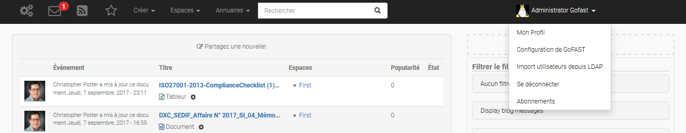

Vous retrouvez les données vous concernant dans « **Mon profil** »,
sous votre nom, à droite de l’écran d’accueil.

Les données de votre profil restent les mêmes que dans GoFAST 2, seule
la visualisation change un peu.

Vous retrouvez « votre carte de visite virtuelle » avec votre nom,
prénom, fonction, entreprise, rôle dans GoFAST, téléphone, email, …
ainsi que les données liées à votre compte GoFAST : vos espaces
collaboratifs, groupes, organisation(s), hobbies, …

.. figure:: media-guide/image018.png
   :alt: 

Paramètres du profil
~~~~~~~~~~~~~~~~~~~~

La page de vos **paramètres de compte** a un peu changé d’apparence mais
on y retrouve les mêmes informations : identifiant, nom, prénom, email,
mot de passe, votre **langue de travail.**

Ajouter une photo à son profil 
~~~~~~~~~~~~~~~~~~~~~~~~~~~~~~~

Allez dans votre profil, cliquez sur le logo de la **photo**, vous
verrez d’ailleurs votre nom apparaître.

Vous arriverez sur cette page, appuyez sur « Charger un fichier » pour
aller chercher votre photo sur votre ordinateur, double-cliquez dessus
ou cliquez sur OUVRIR. Vous pourrez l’adapter. Puis « Enregistrez ».

Votre photo apparaîtra dès lors dans votre profil et partout où vous
agirez sur GoFAST. C’est un moyen rapide et amusant de connaître ses
collègues éloignés et de savoir à qui on s’adresse ( à condition de
mettre de vraies photos de profil) .

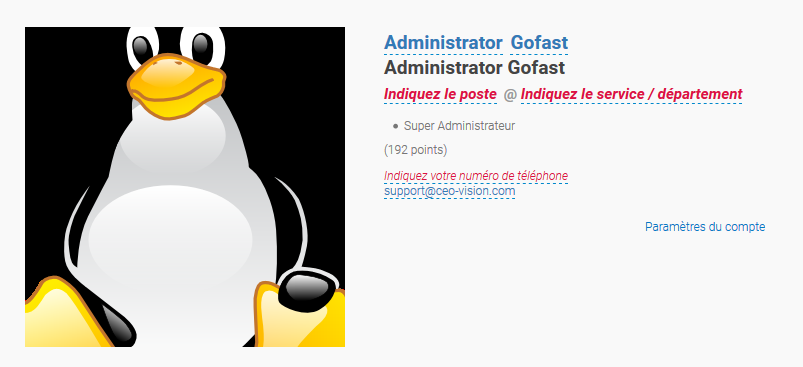

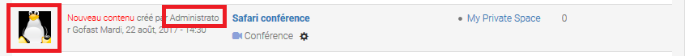

Les Espaces collaboratifs
-------------------------
Les espaces collaboratifs sont des zones de travail collaboratif et de partage de documents accessibles uniquement aux utilisateurs membres.

Il existe plusieurs types d'Espaces Collaboratifs : 

-  Organisation (Organigramme : Directions, Départements, Services...)
-  Groupe (espaces transverses : projet, produit, site géographique, thématique, ...)
-  Extranet (espaces de travail avec des collaborateurs extranets)
-  Public (accessible à tous les utilisateurs internes - non "extranets")

Un espace Privé est également disponible pour chaque utilisateur. 

Les Rôles disponibles pour les Membres des Espaces Collaboratifs sont : 

- Administrateur 
- Contributeur
- Lecture Seule 

Chaque espace peut contenir un ou plusieurs sous espaces. Dans ce cas il est possible d'avoir un sous-ensemble de membres dans les sous-espaces afin de restreindre l'accès. Plus vous descendez dans l'arborescence, moins il y a potentiellement de membres. 
La gestion des accès aux espaces suit une suite logique d'entonnoir. 

.. NOTE::
   Les espaces peuvent contenir des fichiers, autres contenus (ex : forums, pages Wiki, etc.), des sous-espaces (avec droits associés) ou encore des dossiers classiques. Les dossiers classiques héritent des mêmes droits d'accès que l'espace parent où ils se trouvent.
   Les espaces sont représentés dans l'explorateur de fichiers intégré par des icônes distinctes et avec un "_" devant le nom de l'espace (ex: _Organisation) dans l'explorateur de fichiers Windows ou Mac. 

Avant de pouvoir déposer les fichiers et les documents sur la plateforme GoFAST, assurez-vous de créer les "bons" espaces et sous-espaces collaboratifs de type Organisation, Groupe ou Extranet ! 

Notion de partage de contenus entre espaces
~~~~~~~~~~~~~~~~~~~~~~~~~~~~~~~~~~~~~~~~~~~

.. IMPORTANT::
   Pour qu'un document se retrouve dans plusieurs espaces (et
   bien sûr sans doublons), il est **partagé** en changeant sa visibilité
   (sur la page sur document)

.. figure:: media-guide/image369.png
   :alt: 

Retrouver ses espaces
~~~~~~~~~~~~~~~~~~~~~

Dans l’onglet « **Espaces** », vous retrouvez tous vos **espaces
collaboratifs**, c’est-à-dire vos groupes, votre organisation, votre
espace privé, l’espace Public, l’Extranet, …

Espace Privé
~~~~~~~~~~~~

Plutôt que de stocker les documents sur le desktop de votre ordinateur,
il est recommandé de les mettre dans cet **espace personnel** pour ainsi
bénéficier des fonctionnalités GoFAST, notamment le moteur de recherche,
le versionning (qui évite de perdre des informations si une version de
fichier est corrompue) ou encore l’accès à distance à ses fichiers (via
un autre PC, tablettes et smartphone).

Pour accéder à votre espace personnel, il suffit d’aller sur l’onglet «
Espaces », « Mon Espace Privé » . Vous arrivez sur votre page
personnelle avec votre page d’accueil, vos activités, vos documents,
votre calendrier, … (= les 4 onglets que vous retrouverez dans chaque
espace collaboratif/groupe).

.. figure:: media-guide/image027.png
   :alt: 

De même, dans chaque espace collaboratif, vous retrouverez les 2 petites
icônes en haut à droite ; dont la 1\ :sup:`ere` « Parcourir à partir
d’ici » vous permet d’ouvrir une **nouvelle page** avec l’arborescence
de vos dossiers et fichiers, et avoir ainsi une vue d’ensemble de vos
fichiers. (pareil que l’onglet « Documents »)

.. figure:: media-guide/Image-Espace-2.png
   :alt: 

La 2eme icône « Afficher le contenu en pleine page » permet **d’agrandir
la vue** de la page, en supprimant ce qui entoure les onglets

.. figure:: media-guide/image031.png
   :alt: 

Il suffit de réappuyer sur la même icône à 2 flèches pour revenir à la
vue précédente, avec plus d’infos comme les derniers contenus vus.

Espace Public
~~~~~~~~~~~~~

A l’inverse de l’espace personnel/privé, **l’Espace Public** donne accès
aux documents « publics » visibles par tous les utilisateurs internes GoFAST
(sauf les membres Extranet).

Mais contrairement à GoFAST 2, cet espace Public interne est maintenant
géré par **tous les administrateurs de plateforme** de la GoFAST (y créer des
sous-espaces, déposer les documents etc..) : les autres utilisateurs
dits « standards/contributeurs» ne peuvent *pas ajouter de contenus ni
les modifier dans l’espace Public*, ils devront le demander à leur
administrateur de plateforme.

Par contre, les administrateurs peuvent également configurer l'espace
public de telle sorte que tous les utilisateurs et membres de la plateforme (hors Extranet) puissent
contribuer aussi à cet espace public: soit la lecture, soit l'écriture.

Pour y accéder, allez dans « **Espaces** », « **Public** ». Pas
besoin d’en être membre, vous y avez accès automatiquement.

Pour résumé, il y a donc deux possibilités d'alimenter cet espace **Public**.

-  Les utilisateurs ayant pour rôle **Super-Administrateurs** peuvent alimenter, modifier, créer des documents, créer des sous-espaces, etc. Les documents sont alors visibles par tous les utilisateurs en **Lecture Seule**.
-  Tous les utilisateurs et membres de la plateforme (hors membres Extranet) sont **Contributeurs** de cet espace et ont la possibilité d'ajouter, modifier, supprimer les documents.

.. figure:: media-guide/image032.png
   :alt: 

**Que trouve-t-on dans cet espace Public ?**

Pour le contenus totalement transversal à l'Organisation. On peut également y mettre des forums de support et tout contenus généraux.

.. figure:: media-guide/image033.png
   :alt: 

.. NOTE::
   Petite différence avec la version précédente de GoFAST v2 \ **: les
   dossiers de l’Espace Public deviennent des sous-espaces** par souci de
   clarté.

Vous pouvez **vous abonner** à cet espace via le petit logo entouré en
mauve et en cliquant sur « s’abonner ». Vous recevrez ainsi directement
des notifications par rapport au contenu de cet espace. Vous pourrez
d’ailleurs faire cela pour tous les espaces.

.. figure:: media-guide/image034.png
   :alt: 

Espace Extranet
~~~~~~~~~~~~~~~

.. figure:: media-guide/image035.png
   :alt: 

L’espace « **Extranet** » a la même fonction que dans GoFAST 2, c’est
l’espace partagé avec des externes à l'organisation.

Cet espace/groupe « Extranet » permet donc de partager des contenus avec
des clients, fournisseurs ou toute autre entité partenaire qui collabore
fréquemment mais **qui ne fait pas partie de l’organisation interne.**

Si vous voulez donner accès à cet espace à une personne externe, le
principe est le même que pour tout nouvel utilisateur, il faut lui créer
un compte et le faire membre du sous-espace Extranet le concernant. On
peut donner le rôle de « contributeur » à ce nouveau membre externe si
on veut qu’il puisse travailler sur les documents partagés ou alors
juste le mettre en « lecture seule », ainsi il ne pourra pas modifier de
documents partagés mais juste les commenter et télécharger (attention :
il ne pourra pas non plus en rajouter alors).

.. NOTE::
   Si on est administrateur d’un espace, on peut créer des comptes
   d’utilisateurs mais on ne pourra mettre ces utilisateurs que dans les
   espaces dont on a la responsabilité. Il se peut donc que vous soyez
   administrateur d’un groupe mais pas d’Extranet.

.. NOTE::
   GoFAST 3 permet d’envoyer, vers des personnes externes (= qui n’ont
   pas de compte GoFAST), des messages avec le lien vers un document qui
   se trouve sur GoFAST ; ils pourront ainsi charger le lien et avoir
   accès au document pendant 15 jours. Si vous voulez donc juste
   partager des documents pour information et non pour travailler
   dessus, pas besoin de créer un compte et un groupe spécifique avec un
   externe pour cela.

Les Groupes (= Espaces Transversaux)
~~~~~~~~~~~~~~~~~~~~~~~~~~~~~~~~~~~~

Les « **Groupes** » sont des zones de partage **transversales** /
interservices (ex : des groupes de projet). Ce sont des espaces dédiés à
des thématiques spécifiques qui ont un grand rôle collaboratif : toutes
les personnes concernées par le projet/sujet y ont accès, y compris dans
le cas où elles ne sont pas rattachées à la même « Organisation ».

Vous pouvez donc faire partie de plusieurs groupes.

A ce niveau, dans l’onglet « Espace » et « groupes » , vous ne verrez
que les groupes dont vous êtes membres et dans lesquels vous avez donc
accès aux documents. (=> non défini)

.. figure:: media-guide/image036.png
   :alt: 

Les Organisations (= Départements/Services)
~~~~~~~~~~~~~~~~~~~~~~~~~~~~~~~~~~~~~~~~~~~

Les espaces collaboratifs appelés « **Organisations** » correspondent
aux **départements** et **services** selon l'organigramme de votre
organisation; à ce niveau, vous n’y verrez que ceux auxquels vous
appartenez (RH, FIN, ….)

.. figure:: media-guide/image037.png
   :alt: 

Les ‘‘Organisations’’ représentent donc normalement la structure
hiérarchique de l’entreprise et chaque département (RH, IT, Financier,
...) peut avoir des sous-espaces pour les services.

Vous n’aurez donc accès qu’à **une organisation** dont vous êtes membre.

.. NOTE::
   Si vous devez **partager** des documents entre différents
   départements, vous devez le faire à travers un **Groupe** dédié. Par
   exemple un contrat est dans l'Organisation "Juridique" et aussi dans
   le Groupe "ProjetA" car c'est un contrat qui concerne le "ProjetA"
   dans lequel des membres de plusieurs départements sont rassemblés.
  
.. NOTE::
   Un utilisateur peut faire partie d’une ou plusieurs organisations (si
   fonction partagée entre 2 départements) et sous-organisations (les
   Services), et fait d’office partie de **plusieurs groupes** et
   sous-groupes collaboratifs pour pouvoir travailler avec ses collègues
   sur des projets/groupes de travail transversaux.

Création de Documents, Contenus, Utilisateurs
=============================================

Créer un Espace Collaboratif
----------------------------

Il est possible de **créer de nouveaux Espaces
Collaboratifs/sous-Espaces**, **si toutefois vous en avez les droits,
c’est-à-dire si vous êtes administrateur de l’espace-parent.**

Vous pouvez créer un nouvel espace:
   - dans les groupes transversaux
   - dans les organisations (vos services/département)
   - dans Public (visible par tous les utilisateurs sauf les externes)
   - sur l’Extranet (visible aussi par les externes)

Allez sur l’onglet « Créer » puis sur la flèche à côté de « Espace »,
vous verrez la liste des espaces dans lesquels vous pouvez créer un
nouveau sous-espace/groupe.

.. figure:: media-guide/image076.png
   :alt: 

Exemple ici pour créer un nouvel espace dans « Organisation » (dans
l’organigramme de la société donc) : Appuyez sur « Organisation », une
page s’ouvre où vous pouvez ajouter le titre de l’espace, une brève
description, créer une page d’accueil, choisir l’emplacement (le groupe
parent), … puis « Enregistrez »

Même principe pour toute création d’espace dans les groupes, Public
et Extranet.

.. figure:: media-guide/image077.png
   :alt: 

Votre sous-espace (dans Organisations ici ) est ainsi créé, avec ces
différents onglets et sa page d’\ **accueil** en 1\ :sup:`er` onglet
(que vous pouvez customiser comme vous voulez, avec une photo, un
message, une page web, …, pour présenter votre groupe)

.. figure:: media-guide/image078.png
   :alt: 

a) L’onglet « **Activité** » montre les événements qui se passent dans
   ce groupe : le forum s’il y a des conversations/commentaires ; les
   pages intranet liées ; les contenus/documents les plus consultés dans
   ce groupe ; et les contenus définis avec un état (validé, draft, etc)

.. figure:: media-guide/image079.png
   :alt: 

b) L’onglet « **Documents** » montre tous les fichiers qui se trouvent
   dans votre groupe, dans la fenêtre au centre de l’écran, et
   l’arborescence par rapport à toute la GoFAST dans la colonne de
   gauche.

On voit dans l’exemple ici qu’il y a dans la fenêtre du milieu un
dossier et plusieurs fichiers qui font partie du groupe « \_Test pour
annuler » qui lui-même se trouve dans l’arborescence (flèche rouge à
gauche) de l’espace de base/espace-parent « Organisation », sous-espaces
« BTCCTB » et « Test sous-organisation».

.. NOTE::
   Dans l’arborescence, on distingue les espaces avec un
   underscore devant leur nom « \_ » ; s’il n’y a rien , ce sont des
   dossiers/
   s. Dans les 2 cas, vous pouvez voir leurs niveaux
   inférieurs en cliquant sur le petit « + » devant chacun. Ou les cacher
   avec le petit « - ».

On peut également voir le cheminement du fichier (path), au-dessus des
onglets, encadré en vert ici.

C’est à ce stade que vous pouvez **glisser/déposer directement des
fichiers** qui se trouvent ailleurs sur votre ordinateur ou les
télécharger en appuyant sur « Parcourir » en bleu en bas à droite.

Une fois avoir double-cliqué sur le document à télécharger ou sur
« Open », vous voyez une barre de progression en bas de page qui vous
indique que le document se charge sur la GoFAST. (flèche bleue devant le
nom du document = en charge, croix = problème, sablier = en liste
d’attente)

.. figure:: media-guide/image082.png
   :alt: 

Dès que le document est chargé et apparaît dans la fenêtre centrale,
vous pouvez y travailler comme à l’habitude, grâce aux raccourcis de
fonctionnalités (clic-droit de la souris quand vous avez sélectionné le
document) ou en double-cliquant sur le titre du fichier pour le
prévisualiser et avoir accès à toutes ses métadonnées et ses
fonctionnalités.

Voir aussi"Gestion des documents"

Créer un compte Utilisateur
--------------------------------

Voir 'Créer un utilisateur dans un
espace/groupe'

Chaque administrateur d’espace/groupe peut **créer un nouvel
utilisateur** qu’il rattachera alors directement à ce groupe (et autres
si besoin et s’il en est l’administrateur aussi).

.. image:: media-guide/Tag-Enterprise.png
   :align: right
   :scale: 7%
   

Créer/Ajouter un nouveau Document
---------------------------------

Il est possible de **créer de nouveaux documents** directement sur la
GoFAST, plus besoin de créer d’abord le document sur votre desktop puis
de le migrer .

Allez sur l’onglet « Créer », « Contenu », « Fichier,Document ».

.. figure:: media-guide/image049.png
   :alt: 

Une page s’ouvre, sur laquelle vous pouvez indiquer le nom du document «
titre » et déjà y apposer quelques métadonnées de base (extension/type,
langues).

Choisissez l’option « Créer un fichier vide »

Choisissez l’emplacement où se retrouvera le document dans
l’arborescence des fichiers en cochant la case devant le nom du
groupe/répertoire en question ou en cliquant 2x sur le nom du groupe pour
qu’il se retrouve sur la droite en bleu.

Puis enregistrez.

.. figure:: media-guide/image050.png
   :alt: 

Si le document existe déjà ailleurs sur votre PC, vous pouvez l’ajouter
sur la GoFAST via ce canal-ci également.

Il suffit alors de le télécharger en cliquant sur « **Télécharger un
fichier** » et « Choose File » ; le contenu de votre PC s’ouvre,
choisissez votre document à migrer ; choisissez l’emplacement dans
l’arborescence. Puis enregistrez.

.. figure:: media-guide/image052.png
   :alt: 

.. figure:: media-guide/image053.png
   :alt: 

Vous verrez ainsi la prévisualisation de votre document et pourrez
commencer à y travailler et y apposer les métadonnées relatives.

Créer un document à partir d’un modèle (template)
~~~~~~~~~~~~~~~~~~~~~~~~~~~~~~~~~~~~~~~~~~~~~~~~~

Vous pouvez créer un **nouveau document à partir d’un template** déjà
existant sur la GoFAST.

Il faut pour cela que vos templates soient placés au préalable dans un
répertoire spécifique appelé « TEMPLATES » qui se trouve dans les espaces et
sous-espaces.

Le fait de les déposer dans ce répertoire leur donne automatiquement
l’étiquette de « Template ». Vous pourrez ensuite retrouver ces
documents dans le Formulaire "Créer un document à partir d'un Modèle".

.. NOTE::
   Dans GoFAST 3, la catégorie « Template » n'existe plus.
   C'est à présent dans les étiquettes que vous la retrouverez.

Vous devez créer ce répertoire « TEMPLATES » dans l’onglet « Documents »
dans les espaces et les sous-espaces de type Organisation/Groupe.

Pour créer ce nouveau document à partir d’un template existant, allez
dans l’onglet « Créer »\_« Contenu »\_«Fichier,Document ».

Choisissez l’option « Créer à partir d’un modèle » (en dessous du
titre), vous verrez alors les différentes possibilités de **répertoires
« TEMPLATES »** contenant des modèles. Cochez le modèle que vous voulez
utiliser. Le titre et l’extension se mettront automatiquement selon le
type de modèle choisi. Choisissez un nouveau titre, la langue et
l’emplacement où vous voulez le placer puis « Enregistrer ».

Vous pouvez même éviter la notification aux autres membres de la
création de ce document, en cochant la petite case juste au-dessus d’ «
Enregistrer »

.. figure:: media-guide/image057.png
   :alt: 

Après avoir appuyé sur « Enregistrer » , vous verrez la prévisualisation
de votre nouveau document.

.. figure:: media-guide/image058.png
   :alt: 
   
Ajouter un ou plusieurs documents par *glisser-déposer*
~~~~~~~~~~~~~~~~~~~~~~~~~~~~~~~~~~~~~~~~~~~~~~~~~~~~~~
Vous pouvez à tout instant glisser un document vers GoFAST, soit sur la page d'accueil soit dans l'explorateur de fichiers.

.. figure:: media-guide/glisser-deposer-ithit.png
   :alt:

Ajouter un ou plusiers documents par le *Lecteur Réseau*
~~~~~~~~~~~~~~~~~~~~~~~~~~~~~~~~~~~~~~~~~~~~~~~~~~~~~~
Pour utiliser l'explorateur Windows (ou Explorer sous MAC) vous devez configurer celui-ci pour qu'il accède à GoFAST.

Configurer le *Lecteur Réseau*
^^^^^^^^^^^^^^^^^^^^^^^^^^^^^^

Faire un clic-droit sur "Ce PC" et choisir "Connecter un lecteur réseau"

.. figure:: media-guide/config-win-webdav1.png
   :alt: 
   
Entrer l'adresse pointant vers votre GoFAST, ex. ``\\gofast.ceo-vision.com@SSL\alfresco\webdav\``

.. figure:: media-guide/config-win-webdav2.png
   :alt: 
Une boite de dialogue s'ouvrira ensuite dans laquelle vous devrez entrer vos identifiants / mot de passe GoFAST
 
En cas d'erreur voir http://gofast-docs.readthedocs.io/fr/latest/docs-gofast-users/doc-gofast-problemes-connus.html#gofast-problemes-connus 
 
Une fois cette opération faite, vous pouvez voir GoFAST comme un "Lecteur Réseau", alors la même arborescence

Vous pouvez faire toute opération, commme des copier-coller de documents ou de répertoires entiers.  

.. CAUTION:: Vous ne pouvez pas faire d'opérations sur les Espaces (commençant par un _)

Créer une page Wiki (page interne)
--------------------------------------

Il est possible de **créer une page Intranet/Wiki** sur la GoFAST.

Allez sur l’onglet « Créer » puis « Contenu », « Page Intranet ».

Donnez-lui un titre, créez son contenu grâce aux mêmes fonctionnalités
que Word, choisissez son emplacement dans l’arborescence.

Vous pouvez choisir l'emplacement du livre, puis sélectionnez soit
« Créer un nouveau livre », soit « créer ce livre dans un autre livre »
(une sorte espace/sous-espace). Puis cliquez sur « Enregistrer ». Vous
retrouverez votre livre au niveau d'un espace choisi auparavant.

Le **livre** est une sorte de classement virtuel de pages Intranet. Vous
pouvez ajouter n'importe quelle page Intranet qui est sur GoFAST dans le
livre. Vous pouvez créer des thématiques et puis naviguer facilement
d'un contenu à l'autre.

Par exemple, créer un livre peut être intéressant dans le cadre de
réalisation d'un projet collaboratif lorsque vous avez besoin de créer
l'ensemble de contenus par thème.

Concernant le poids : plus le poids du contenu est lourd, plus il sera
négatif; si le poids du contenu est léger, plus il sera positif. Il
l'attribue automatiquement en mesurant le poids du contenu créé.

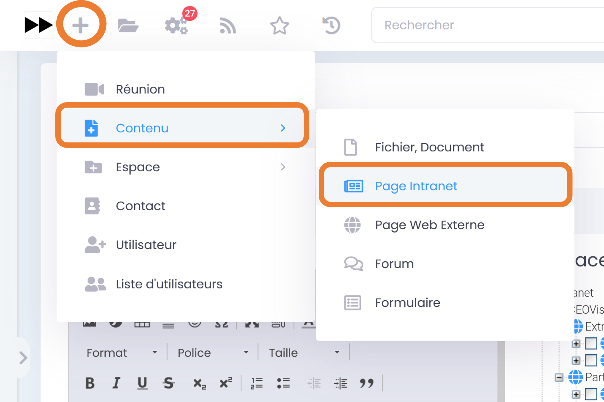

Voici un exemple d’aperçu d’une page web, qui se compore comme un
document, avec les métadonnées relatives sur la droite

.. figure:: media-guide/image061.png
   :alt: 

Créer une page Web externe (URL)
-------------------------------

Avec cette fonctionnalité, vous pouvez **intégrer des pages externes**
qui proviennent d'autres sites web. On pourra donc visualiser le contenu
d'une page web externe directement dans la plateforme GoFAST.

Allez sur l’onglet « Créer », « Contenu », « Page Externe URL »

.. figure:: media-guide/image062.png
   :alt: 

Indiquez un titre, choisissez la langue, copier le lien URL, choisissez
l’emplacement dans l’arborescence (cochez la case ou cliquez sur le nom
du groupe pour le retrouver en bleu sur la droite), enregistrez.

.. figure:: media-guide/image063.png
   :alt: 

Créer un Forum
---------------

Il est possible de créer des « mini-forums » dans un groupe. Ce qui
revient à démarrer un fil de **discussion** via les commentaires.

Allez sur l’onglet « Créer » , « Contenu », « Forum ».

Indiquez le sujet du Forum, choisissez la langue, écrivez du contenu
(comme dans Word), choisissez l’emplacement dans l’arborescence,
enregistrez.

.. figure:: media-guide/image064.png
   :alt: 

.. figure:: media-guide/image065.png
   :alt: 

Si le forum que vous avez créé se trouve dans un groupe, vous le
retrouverez dans l’onglet « Activité » de votre groupe, 1\ :sup:`er`
cadre. Cliquez sur son nom pour l’ouvrir.

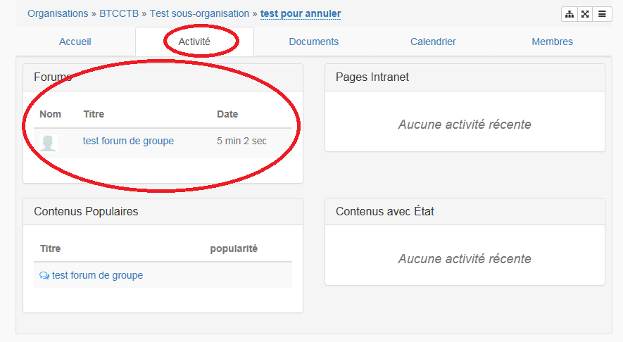

Vous pouvez enrichir le forum de votre groupe par le même principe que
l’ajout de commentaire. Vous pourrez ensuite soit supprimer (poubelle)
/modifier (crayon sur feuille) votre commentaire, soit répondre à un
commentaire (petite flèche) ainsi que vous abonner/désabonner à ce
forum.

Un message en haut à droite apparaîtra signalant la publication de votre
commentaire.

.. figure:: media-guide/image067.png
   :alt: 

Créer un Formulaire
-------------------

Il est possible de **créer un formulaire d’enquête** par exemple
directement sur la GoFAST.

Allez sur l’onglet  « Créer », « Contenu », « Formulaire » .

Donnez un titre au formulaire, créer le contenu de l’intro, choisissez
son emplacement dans l’arborescence, enregistrez.

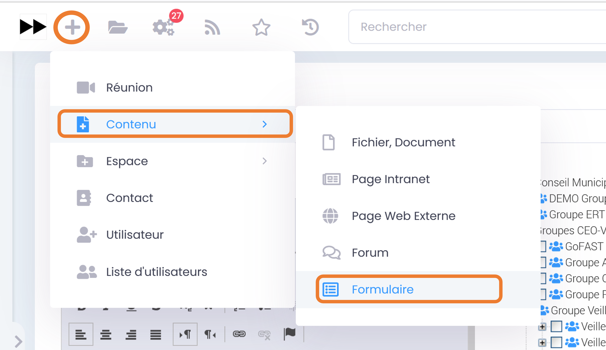

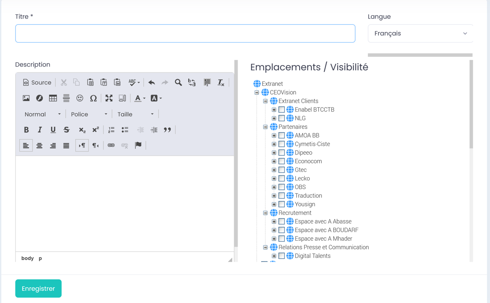

Après avoir appuyé sur « Enregistrer », une autre page s’ouvre et c’est
là que vous pourrez créer le contenu de votre formulaire, avec les
champs, etc.

.. figure:: media-guide/image070.png
   :alt: 

Cliquez sur les champs que vous voulez mettre dans le formulaire, ils
apparaîtront à gauche sous « Afficher le formulaire ». Puis
« Enregistrer »

.. figure:: media-guide/image071.png
   :alt: 

Un message vous confirmant l’enregistrement de votre formulaire
apparaîtra .

.. figure:: media-guide/image072.png
   :alt: 

Retournez ensuite à l’emplacement/dans le groupe où vous avez mis votre
formulaire, et vous le retrouverez dans les contenus populaires ou
derniers contenus vus.

Cliquez sur le fichier pour l’ouvrir et visualiser le contenu du
formulaire, et ajoutez les métadonnées relatives.

Voici un aperçu de formulaire à remplir puis « Valider».

.. figure:: media-guide/image074.png
   :alt: 

Lorsque les personnes concernées auront valider leurs réponses, ils
verront le message suivant

.. figure:: media-guide/image075.png
   :alt: 

Créer une Web-conférence/Réunion (Enterprise only)
----------------------------------------------------
    

.. CAUTION:: Les technologies de conférence Web sont assez récentes et nécessitent de bonnes ressources (PC, réseau, ...). Assurez-vous de suivre les pré-requis. En cas de problème consulter les problèmes fréquents : http://gofast-docs.readthedocs.io/fr/latest/docs-gofast-users/doc-gofast-problemes-connus.html#webconference

Tout comme dans Skype ou autres outils de discussion en ligne, vous
pouvez démarrer une **vidéoconférence** directement sur la GoFAST.

Allez sur l’onglet « Créer », « Conférence ».

Donnez un titre à la conférence, écrivez un résumé dans la grande
fenêtre grâce aux mêmes options que Word, choisissez une date, ajoutez
les participants (écrivez les 3 premières lettres du nom pour avoir les
propositions du système) et « Enregistrez »

.. figure:: media-guide/image084.png
   :alt: 

Vous pouvez remplir différents champs lors de la création d'une « Conférence ». 

Vous avez la possibilité d'informer une Date de début et de Fin de la conférence,
le lieu où se déroulera la visio-conférence et la possibilité de choisir les participants
par Espace.

Par exemple, concernant le choix des participants par Espace, vous avez la possibilité d'inviter tous les membres liés à l'Espace Commercial. 

.. figure:: media-guide/Visio-conference.png
   :alt: 

Une fois les participants et la date/heure de conférence introduits, et
après avoir appuyé sur « Enregistrer », une autre fenêtre s’ouvre avec
les données de la conférence.

On y voit la liste des participants, le nom de celui qui a lancé la
conférence, la date et l’heure, un message d’erreur (en rouge) si vous
ne disposez pas des accessoires nécessaires, …

.. figure:: media-guide/image085.png
   :alt: 

Par contre si tous vos accessoires sont disponibles, ils seront en vert
et vous serez aptes à commencer la conférence

Un **mail** sera également envoyé aux **participants** avec le titre de
la conférence, un lien URL pour rejoindre la conférence sur GoFAST ou
direct sur le système de vidéoconférence JITSI, la liste des
participants, …

Vous serez en copie de ce mail de notification, ce qui vous permet de
renvoyer le lien URL à n’importe quel moment en cas de problème.

.. figure:: media-guide/image087.png
   :alt: 

Vous pouvez même enregistrer cet événement **dans votre agenda** Lotus
par exemple, en cliquant sur l’icône Lotus Note dans l’email, un message
s’affichera , vous demandant si vous voulez l’ajouter dans votre agenda.

.. figure:: media-guide/image088.png
   :alt: 

Si la conférence a été enregistrée pour une autre date à venir, les
participants et vous recevrez un reminder/rappel par mail également,
reprenant les mêmes informations et le lien URL.

Gestion des Documents et Travail Collaboratif
=============================================

Lors de la **prévisualisation d’un document**, vous pouvez accéder
à plusieurs **fonctionnalités** liées directement au document .

En page centrale, la prévisualisation de votre document vous permet de
vérifier le contenu en un coup d’œil et voir si c’est le bon document.

Au-dessus de la prévisualisation, il y a le titre du document et le
chemin (path) = l’emplacement où se trouve le document dans
l’arborescence.

A gauche, vous voyez en même temps les autres documents qui se trouvent
dans ce même répertoire.

En haut à droite, encadré en orange sur l’image, vous retrouvez des
raccourcis de fonctionnalités liées au document prévisualisé.
(processus, commentaire, affichage, actions contextuelles)

A droite, se trouvent toutes les métadonnées liées au document : type,
format, statut, langue, emplacement, historique, version, ….

.. figure:: media-guide/image129.png
   :alt: 

.. NOTE::
   Il se peut que la prévisualisation ne s’ouvre pas
   directement et que vous ayez le message suivant :

.. figure:: media-guide/image374.png
   :alt: 

Il faudra juste cliquer sur la zone bleue « Tenter de prévisualiser à
nouveau ».

Si ça ne fonctionne toujours pas, vous pouvez tout de même accéder aux
fonctionnalités et options liées au document et donc vous pourrez par
exemple télécharger le document malgré tout. Allez dans les actions
contextuelles (3 barres horizontales, dans le coin droit supérieur, à
côté du titre) (voir plus loin pour les détails)

Pour rappel, vous pouvez **masquer ou afficher** à tout moment la partie
avec l’\ **arborescence** de vos répertoires/groupes en cliquant sur la
barre grise verticale qui se trouve à gauche de la partie centrale de
l’écran. (prévisualisation ou fil d’activité)

Voici en détail, la liste des actions contextuelles (fonctionnalités)
liées au document : parcourir, télécharger, éditer, commenter, …

Vous y accédez par l’icône avec les 3 barres horizontales tout à droite,
sur la même ligne que le titre de votre document. (voir plus bas pour
les détails des Actions contextuelles p.75)

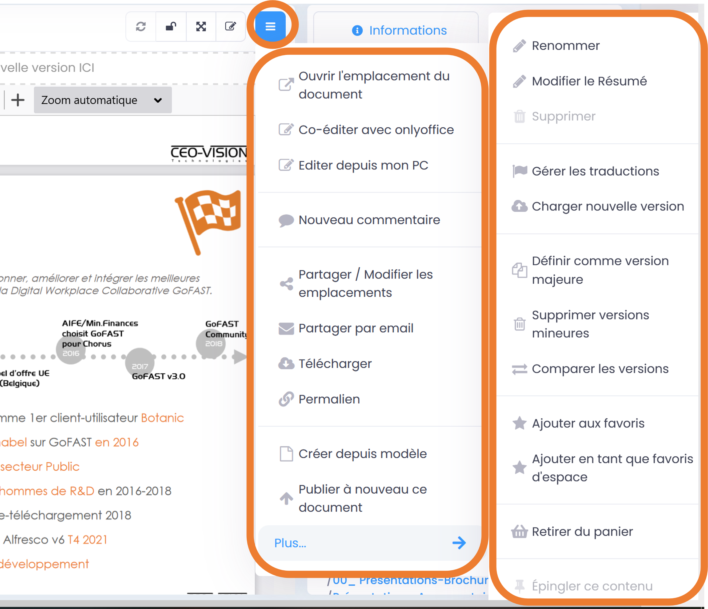

Prévisualisation des Documents : fonctionnement et fonctionnalités
------------------------------------------------------------------

Au-dessus de la **prévisualisation** du document, vous voyez une **barre
d’outils noire.**

Celle-ci permet certaines fonctionnalités comme la loupe, le zoom, page
suivante, etc.

.. figure:: media-guide/image377.png
   :alt: 

Le premier icône, (carré gris et noir) « **Toggle sidebar** », permet
de voir les « slides/pages » que comprend le document. Vous pouvez ainsi
aller directement sur la page souhaitée. Ce même icône donne accès à 3
autres options **« Show thumbnails », « Show document outline », « Show
attachment »**

La **loupe** permet de rechercher un mot dans le texte (= Ctrl+F)

Les **flèches** vers le haut ou vers le bas permettent d’aller à la page
précédente ou suivante

.. figure:: media-guide/image380.png
   :alt: 

«**Page**» et les numéros permettent de voir combien de pages
comprend le document et vous pouvez changer le numéro pour atteindre la
page souhaitée

.. figure:: media-guide/image381.png
   :alt: 

Le **« -»  et le « + »** permettent de zoomer. Et l’ « \ **Automatic
zoom** » vous donne des dimensions prédéfinies

.. figure:: media-guide/image382.png
   :alt: 

Le dossier blanc avec une flèche noire vers le haut permet **d’ouvrir
votre browser** et d’aller chercher un document sur votre ordinateur.

.. figure:: media-guide/image383.png
   :alt: 

La feuille blanche avec une flèche noire vers le bas permet de
**télécharger** le document en PDF. Vous retrouverez le lien pour
l’ouvrir dans le coin inférieur gauche de votre écran (selon votre
browser)

.. figure:: media-guide/image384.png
   :alt: 
   
.. figure:: media-guide/image385.png
   :alt: 

Un clic-droit sur l’étendard vertical permet plusieurs options, dont
celle d’ouvrir le document ou la **prévisualisation** dans une autre
fenêtre/onglet ou copier le lien (URL).

.. figure:: media-guide/image386.png
   :alt: 

.. figure:: media-guide/image387.png
   :alt: 

Vous pourrez alors **consulter la version PDF** du document avec les
fonctionnalités PDF associées

Et enfin, le dernier icône avec les 2 flèches vers la droites ouvrent
d’autres options, dont « **Enable hand tool** », la petite main qui
permet notamment de monter/descendre dans un PDF sans utiliser le
curseur.

.. figure:: media-guide/image389.png
   :alt: 

Actions sur la page d'un document/contenu
-----------------------------------------

Il y a plusieurs **fonctionnalités liées à un document** telles que :
actualiser l’aperçu, processus et tâches (workflow), pleine page,
actions contextuelles (parcourir, modifier, télécharger, …)

Actualiser l’aperçu
~~~~~~~~~~~~~~~~~~~

Revient à **rafraîchir la page** et permet de mettre à jour la
synchronisation.

.. figure:: media-guide/image131.png
   :alt: 

Processus et tâches / Workflow
~~~~~~~~~~~~~~~~~~~~~~~~~~~~~~

Permet de **confier une tâche** à un autre utilisateur, par rapport à ce
document : demander une contribution, une validation, … Ou de voir
quelles sont les tâches qui vous sont attribuées par rapport à ce
document\ **.(= To Do)**

Commenter
~~~~~~~~~~~~~~~~~~~~~~~~~~~

Permet de mettre un **commentaire général** sur le document, qui se
retrouvera en dessous de la prévisualisation et donc sera visible par
tous les membres de ce groupe dès qu’ils arriveront sur la
prévisualisation de ce document.

.. figure:: media-guide/image133.png
   :alt: 
   
Afficher le contenu en pleine page
~~~~~~~~~~~~~~~~~~~~~~~~~~~~~~~~~~

Permet de **masquer** toutes les données autour de la prévisualisation
et ne n’avoir plus que la page du document en vue plein écran.

.. figure:: media-guide/image134.png
   :alt: 

Pour revenir à la prévisualisation normale avec les infos, il suffira
d’appuyer sur le logo à 2 flèches 

.. figure:: media-guide/image135.png
   :alt: 

Actions contextuelles
~~~~~~~~~~~~~~~~~~~~~

Ce sont toutes les **actions qu’on peut faire avec /sur ce document** :
parcourir, télécharger, éditer en ligne/modifier, nouveau commentaire,
envoyer par mail, gérer les traductions, créer une publication, …

.. figure:: media-guide/image136.png
   :alt: 

Actions contextuelles / fonctionnalités sur un document
-------------------------------------------------------

Ces actions liées directement au document que vous prévisualisez peuvent
**varier selon le rôle** que vous avez dans ce groupe
(standard/contributeur, administrateur ou en lecture seule). Et selon
que vous en êtes l’auteur ou pas.

.. figure:: media-guide/image137.png
   :alt: 

   
Renommer un document
~~~~~~~~~~~~~~~~~~~~

Si vous en avez les droits ou en êtes l’auteur, vous pouvez renommer un
fichier via l’ action contextuelle : «**Rename**».

Changez le nom dans la case blanche et « Appliquez »

.. figure:: media-guide/image138.png
   :alt: 
   

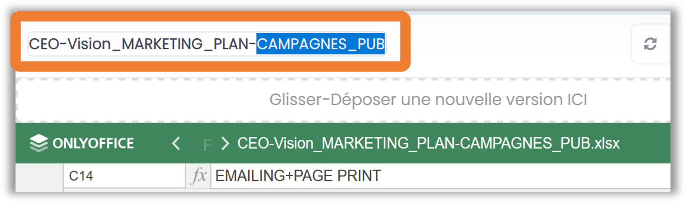

Faites ensuite un refresh de la page pour être certain que le changement
a été enregistré. Les petites flèches rondes apparaîtront en rouge pour
vous le rappeler.

.. figure:: media-guide/image140.png
   :alt: 

Résumé/présentation d’un document
~~~~~~~~~~~~~~~~~~~~~~~~~~~~~~~~~

Si vous voulez ajouter un genre de résumé/présentation à votre document,
cliquez sur « **Modifier le Résumé** » dans les « actions contextuelles»
dans le coin droit en haut de la prévisualisation du document.

.. figure:: media-guide/image390.png
   :alt: 

Une fenêtre de texte s’ouvre avec les mêmes fonctionnalités que Word :
écrivez votre texte et sauvez en cliquant sur « Appliquer ».

.. figure:: media-guide/image391.png
   :alt: 

Le texte se retrouvera au-dessus de la prévisualisation de votre
document, entre le titre et le document.

.. figure:: media-guide/image392.png
   :alt: 

Si vous voulez changer le contenu de ce résumé, appuyez sur « Modifier
le Résumé», qui apparaît lorsque vous mettez la souris au niveau du
résumé.

Télécharger le document
~~~~~~~~~~~~~~~~~~~~~~~

A partir des actions contextuelles de la prévisualisation, vous pouvez
**télécharger le document** afin de l’ouvrir pour lecture ou pour le
sauver sur votre ordinateur.

Vous verrez probablement ce message vous demandant si vous voulez
ouvrir, sauver le document ou annuler l’action.

Si vous voulez juste l’ouvrir pour lecture => « Open »

Si vous voulez le sauver ailleurs => « Save » et l’explorateur de votre
ordinateur s’ouvrira pour pouvoir enregistre ce document où vous voulez,
ailleurs que sur la GoFAST.

.. figure:: media-guide/image142.png
   :alt: 

Ou alors il se téléchargera tout seul, et vous le retrouverez dans le
coin inférieur gauche de votre écran

.. NOTE::
    Si vous téléchargez un document, que vous y apportez
    des modifications, elles ne seront pas synchronisées sur la GoFAST.
    Il faudra remettre le document au même emplacement (glisser/coller
    comme nouvelle version) pour que GoFAST les prennent en compte. Cela
    porte un risque car si un autre collègue a fait des modifications en
    ligne pendant au même moment, vous allez écraser sa version actuelle
    et ses modifications seront donc perdues.

Charger une nouvelle version du document
~~~~~~~~~~~~~~~~~~~~~~~~~~~~~~~~~~~~~~~~

Via les actions contextuelles de la prévisualisation, vous pouvez
**charger une nouvelle version du document**, ce qui revient à écraser
l’ancienne version et à repartir de celle que vous venez de charger
comme nouvelle base de travail. Vous pouvez même la rendre « Version
majeure ».

Aller chercher la nouvelle version du document sur votre ordinateur via
le « Browse », terminez avec « Open ». Le nom du fichier apparaîtra sur
la ligne grise.

Choisissez de la rendre version majeure (1.36 => 2.0) en cochant la case
« Enregistrer comme version majeure », ajoutez un commentaire si vous
voulez et terminez avec « Valider »

.. figure:: media-guide/image151.png
   :alt: 

Par conséquent le numéro de version changera dans les métadonnées.

.. figure:: media-guide/image152.png
   :alt: 

Glisser-déposer une nouvelle version 
~~~~~~~~~~~~~~~~~~~~~~~~~~~~~~~~~~~~

Le fait de **glisser une nouvelle version** de votre document à cet
endroit (dans la fenêtre des métadonnées liées au document) va écraser
la précédente mais conservera toutes les anciennes versions (=>
historique). Le système vous demandera alors si vous voulez qu’elle
devienne une version majeure (passer de 1.0 à 2.0 par exemple = nouvelle
base de travail). Les autres petites modifications précédentes étant
considérées comme des versions mineures à chaque fois qu’il y a eu une
sauvegarde sur le document.

Si pouvez également ajouter un commentaire sur cette nouvelle version.

Terminez par « Valider »

Vous pouvez retrouver les versions précédentes en bas des métadonnées
également.

.. NOTE::
    Vous ne pouvez glisser/coller que des documents de
    même format, ce qui veut dire que vous ne pouvez pas remplacer une
    version avec une extension « doc » par une version « docx » et
    vice-versa.

Sinon voici le message d’erreur que vous aurez

.. figure:: media-guide/image155.png
   :alt: 

Si vous chargez une nouvelle version mais que le nom du fichier est
différent, vous recevrez ce message.

.. figure:: media-guide/image156.png
   :alt: 

Gérer les traductions du document
~~~~~~~~~~~~~~~~~~~~~~~~~~~~~~~~~

Si le document existe en **plusieurs langues**, vous pouvez les **lier
entre elles** pour ainsi passer d’une version de document à sa
traduction en un clic .

Dans les actions contextuelles, prenez l’option « Gérer les
traductions ». Il se peut qu’elle ne se voit pas tout de suite et qu’il
faille aller dans « voir plus d’options »

.. figure:: media-guide/image167.png
   :alt: 

Une fenêtre avec plusieurs champs s’ouvre, ceux-ci correspondent aux
traductions possibles.

Pour notre exemple, prenons la version en Français à laquelle on veut
lier la version en Anglais. On part donc de la prévisualisation du
document en français.

Et on remplit le champ de la version anglaise. Il suffit d’écrire les 3
premières lettres du nom du fichier anglais et le système vous donnera
des propositions, sélectionnez votre document et terminez avec « Mettre
à jour les traductions ».

Dans les métadonnées, il sera à présent indiqué les différentes
versions/traductions dans lesquelles on peut trouver ce document. Le
1\ :sup:`er` drapeau étant le document d’origine que vous prévisualisez
et les drapeaux suivants sont les traductions existantes.

Il suffit de cliquer sur les différents drapeaux pour prévisualiser les
autres traductions.

.. figure:: media-guide/image169.png
   :alt: 

.. NOTE::
   GoFAST ne permet pas de traduire des documents, il s’agit
   ici de documents qui existent déjà en différentes langues et qu’on veut
   lier par facilité pour pouvoir passer d’une à l’autre en un clic.

Partager le document par mail
~~~~~~~~~~~~~~~~~~~~~~~~~~~~~

Via les actions contextuelles de la prévisualisation, vous pouvez **envoyer un lien sécurisé** sur le document directement **par email** à un utilisateur, une liste d'utilisateur, les membres d'un Espace Collaboratif ou bien à une adresse email externe. Le document sera donc automatiquement attaché à votre message. Ce lien est contextuel : les utilisateurs ayant accès au document pourront consulter sa page avec tous les détails, alors que les non-utilisateurs auront un lien de téléchargement valable 14 jours avec accusé de téléchargement.

.. NOTE:: Cette méthode est nettement plus sécurisée (RGPD) et auditable que l'envoi d'un email classique avec des pièces jointes sensibles
   
.. NOTE:: Ceci permet notamment de ne plus surcharger votre boîte mail avec
   des pièces jointes lourdes destinée à des personnes n'ayant pas de
   comptes GoFAST.

.. figure:: media-guide/image170.png
   :alt: 

Choisissez les destinataires en écrivant les 3 premières lettres de leur
nom/prénom (le système vous proposera des utilisateurs) ; leur nom et
photo se retrouveront dans la barre des destinataires. Vous pourrez
d’ailleurs annuler des noms en cliquant sur la petite croix rouge à côté
de leur profil.

Le sujet est automatiquement généré.

Le lien vers le document est également automatiquement attaché.

Ecrivez votre message et « Envoyez »

.. figure:: media-guide/image171.png
   :alt: 

Le destinataire recevra une **notification par mail** et verra également
un petit numéro à côté de l’enveloppe dans la barre des fonctionnalités
générales de la GoFAST lui indiquant qu’il a reçu un nouveau message.

Pareil pour vous lorsque que vous recevrez un nouveau message par mail
via la GoFAST.

.. NOTE::
   Pour que les non-utilisateurs de la plateforme puissent
   également avoir accès à certains documents, les liens attachés au mail
   sont utilisables pendant 15 jours. Une fois le document téléchargé, les
   non-utilisateurs peuvent le consulter de suite.

**Exemple** de mail/notification reçu dans votre boîte mail normale,
vous invitant à cliquer sur le lien attaché pour visualiser un document.
Avec le message pour les non-utilisateurs de GoFAST (qui n’ont pas de
compte GoFAST) signalant que ce lien est utilisable 2 semaines à partir
de la date de réception du mail.

.. figure:: media-guide/image173.png
   :alt: 

Créer une publication du document
~~~~~~~~~~~~~~~~~~~~~~~~~~~~~~~~~

Faire d’un document une publication consiste à en copier une version
donnée dans un autre espace, d'éventuellement le transformer en PDF pour
le **rendre non modifiable.**

.. figure:: media-guide/image174.png
   :alt: 

L’avantage de faire une publication est de garder la version d’origine
en Word/Excel/Power Point liée au document publié (généralement en PDF),
même si la publication se trouve dans un autre emplacement.

.. NOTE::    
    Vous pouvez donc avoir 20 versions de travail d’un document
    Office au sein d'un service avec des commentaires et ne publier que
    la version finale sans les commentaires pour tous les autres
    utilisateurs.

Vous pouvez choisir où sera la publication de votre document de
travail, où il apparaîtra uniquement en PDF. Cochez la case
correspondant à l’emplacement voulu pour la publication. Et « Valider »

.. figure:: media-guide/image175.png
   :alt: 

Vous verrez alors dans les métadonnées de ce document que c’est devenu
une publication et les emplacements de la publication par rapport au
document d’origine.

.. NOTE::
   Le document publié possède un nom se terminant par \_PUB

Vous pouvez de la même manière supprimer une publication, cette action
ne supprimera que le document publié (le PDF) mais pas le document
d’origine (Word/Excel/Powerpoint).

Archiver le document
~~~~~~~~~~~~~~~~~~~~

**Archiver un document** permet de le rendre invisible dans la
recherche, à moins de spécifier l’option « inclure les contenus
archivés », sans qu’il soit complètement supprimé de la GoFAST. Et de ce
fait, vous ne pouvez plus travailler dessus.

.. figure:: media-guide/image178.png
   :alt: 

Le document aura désormais le statut « archivé » et toutes ses versions
mineures seront effacées.

Un message vous redemande donc si vous êtes certain de vouloir archiver,
si oui, appuyez sur « Archive »

.. figure:: media-guide/image179.png
   :alt: 

Une fois le **document archivé**, il apparaîtra dans les métadonnés que
vous pouvez juste le lire => « en lecture seule », et son état est
« archivé ». Plus aucune modification n’est donc possible sur un
document « archivé ».

Il se peut aussi, lorsque vous voulez visualiser un document, que vous
voyez un message orange vous signalant qu’il est en statut « archivé »
et que si vous voulez retravailler dessus, il faut demander à
l’administrateur du groupe de le désarchiver.

.. figure:: media-guide/image180.png
   :alt: 

Vous pouvez inverser le processus et désarchiver le document pour le
rendre actif à nouveau.

Cliquez sur « Unarchive »

.. figure:: media-guide/image182.png
   :alt: 

Il n’y à présent plus de message dans les métadonnées et l’état est
redevenu normal ou comme à l’origine.

.. figure:: media-guide/image183.png
   :alt: 

Vous pouvez aussi voir l’état de vos documents dans l’onglet
« Activité » du groupe, dans l’encadré « Contenus avec Etat », à
condition que son état ait bien été enregistré dans les métadonnées
(voir § sur les métadonnées d’un document p.106)

.. figure:: media-guide/image184.png
   :alt: 

Supprimer le document
~~~~~~~~~~~~~~~~~~~~~

**Supprimer un document** de la GoFAST revient à le supprimer de toutes
vues définitivement, donc Attention !!! si vous le supprimez à un
endroit et qu’il était multifilé, il sera supprimé partout.

.. figure:: media-guide/image185.png
   :alt: 

Seul l’auteur du document ou les administrateurs de l’espace où était le
document pourront le restaurer en cas de suppression erronée ; le
document leur étant encore accessible pendant 90 jours avant de
disparaître définitivement du système.

Ajouter le document aux favoris
~~~~~~~~~~~~~~~~~~~~~~~~~~~~~~~

**Ajouter un document aux favoris** permet de créer des **raccourcis**
pour atteindre ce document car ils se retrouveront à un endroit
accessible à tout moment.

Lorsque vous cliquez sur l’option « Ajouter aux favoris », dans les
actions contextuelles de la prévisualisation, apparaît, en haut à
droite, un message vert vous confirmant que le contenu a été ajouté à
vos favoris.

.. figure:: media-guide/image187.png
   :alt: 

La prochaine fois que vous voulez accéder à ce document, il suffira
d’aller sur **l’étoile** dans le menu principal de la GoFAST pour voir
la liste de vos documents favoris.

Cliquez sur votre fichier pour l’ouvrir, ou cliquez sur la poubelle à
droite du titre de votre fichier pour le supprimer de cette liste.

.. figure:: media-guide/image188.png
   :alt: 

Un message en vert vous confirmera sa suppression de la liste des
favoris.

.. figure:: media-guide/image189.png
   :alt: 

Ajouter le document aux favoris publics
~~~~~~~~~~~~~~~~~~~~~~~~~~~~~~~~~~~~~~~

.. figure:: media-guide/image190.png
   :alt: 

.. figure:: media-guide/image191.png
   :alt: 

Vous pouvez faire l’inverse et le supprimer des favoris publics, avec
l’option « Supprimer des favoris publics » dans les actions
contextuelles de la prévisualisation.

Permalien du document
~~~~~~~~~~~~~~~~~~~~~

Le permalien d’un document est son **lien « URL »,** que vous pouvez
copier et coller où vous voulez pour renvoyer à ce document en un clic.
(dans un mail par exemple)

Dans la actions contextuelles de la prévisualisation, appuyer une fois
sur l’option « Permalien », vous verrez un message en bleu signalant que
le lien est prêt à être copié ailleurs. Collez le où vous voulez.

.. figure:: media-guide/image193.png
   :alt: 

Vous pouvez retrouver le permalien également dans les raccourcis à
partir du fil d’activité. Appuyez sur la petite rue sous le nom du
fichier pour ouvrir la liste des fonctionnalités, puis appuyez sur
« Permalien » pour copier le lien.

Voici ce que ça donne lorsque vous le coller :
*https://gofast3-integration.ceo-vision.com/node/4551*

Il suffira de cliquer dessus pour être renvoyé sur la GoFAST et sur la
prévisualisation du document. (cfr : si vous n’êtes pas membre du groupe
dans lequel se trouve ce document, vous n’y aurez pas accès, d’où
l’avantage encore une fois de multifiler les documents dans plusieurs
groupes).

Encore un autre raccourci pour le lien URL d’un document: via les
derniers contenus vus, sélectionnez le document, clic-droit de la souris
pour ouvrir la fenêtre avec l’option « Copy link address ». Ensuite
coller l’URL où vous voulez.

Ou ouvrez carrément le document sur un autre onglet/fenêtre Window avec
l’option « Open link in new tab/window »

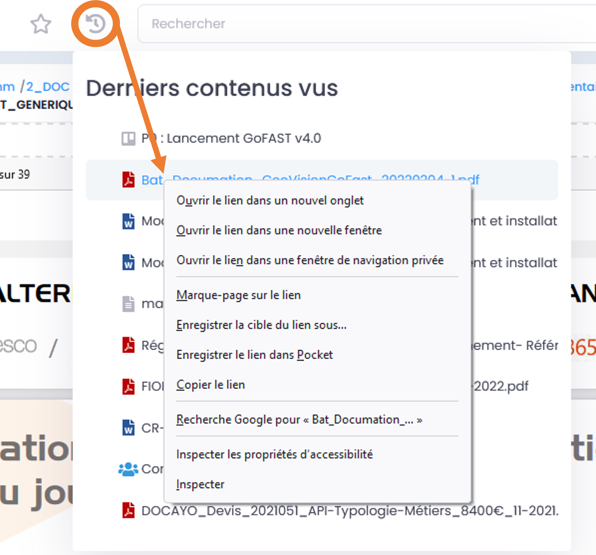

Ouvrir l’emplacement du document
~~~~~~~~~~~~~~~~~~~~~~~~~~~~~~~~

Lorsque vous prévisualisez un document, vous pouvez voir le
**cheminement** (path), le trajet dans l’\ **arborescence** avec les
niveaux supérieurs de répertoires et espaces. (encadré en vert sur l’image).

Si vous voulez voir les détails de l’arborescence et l’emplacement du
document que vous visualisez par rapport à cette arborescence, vous
pouvez ouvrir l’explorateur de fichiers à partir des actions
contextuelles de lhb va prévisualisation, en cliquant sur « Ouvrir
l’emplacement du document ».

.. figure:: media-guide/image195.png
   :alt: 

Voici le genre de vue que vous aurez, où vous retrouverez votre document
et son emplacement par rapport au reste de l’arborescence GoFAST.

.. figure:: media-guide/image399.png
   :alt: 

De là, vous pouvez naviguer dans l’arborescence, chercher d’autres
documents, utiliser les raccourcis, …

S’abonner au document
~~~~~~~~~~~~~~~~~~~~~

Voir aussi "Vos abonnements"

**S’abonner à un document** permet de **rester au courant** de ce qu’il
se passe par rapport à ce document ; vous recevrez une notification par
mail dès qu’il y a activité sur ce document : une modification, un
commentaire, une mise à jour des métadonnées, …. Vous pouvez choisir
l’intervalle de ces notifications (instantanément, 2x/jour, 1x/jour,
1x/semaine, 1x/mois).

Allez dans les actions contextuelles de la prévisualisation et cliquez
sur « S’abonner »

.. figure:: media-guide/image197.png
   :alt: 

Un message en vert, dans le coin droit supérieur, vous confirme votre
abonnement à ce contenu.

.. figure:: media-guide/image198.png
   :alt: 

Vous voir vos abonnements et gérer leurs intervalles, cliquez sur la
flèche à côté de votre nom de profil puis sur « Abonnements »

.. figure:: media-guide/image199.png
   :alt: 

Vous retrouvez toute la liste de vos abonnements à des espaces/groupes
ou documents. Vous pouvez choisir les intervalles dans la colonne
« Fréquence », en cliquant sur la petite flèche, vous aurez les
propositions d’intervalles, sélectionnez celles que vous souhaitez pour
chaque abonnement.

.. figure:: media-guide/image200.png
   :alt: 

De la même manière, vous pourrez également vous désabonner quand vous
voulez.

Un message vert vous confirmera votre désabonnement à ce contenu.

.. figure:: media-guide/image201.png
   :alt: 

Comparer deux versions d'un document (beta en v3.6)
~~~~~~~~~~~~~~~~~~~~~~~~~~~~~~~~~~~~~~~~~~~~~~~~~~~
Pour afficher les écarts entre deux versions d’un même document, vous avez la possibilité de lancer le comparatif via le menu "Burger" (actions contextuelles).

.. figure:: media-guide/Ecran-GoFAST_Comparatif-Versions_lancer-le-comparatif.png
   :alt: 

Sélectionnez dans les deux listes les deux versions que vous souhaitez comparer : 

   

Créer une version majeure du document
~~~~~~~~~~~~~~~~~~~~~~~~~~~~~~~~~~~~~

Dès que vous faites une modification sur un document avec la
fonctionnalité « Editer en ligne » et que vous la sauver, une nouvelle
version du document est générée (1.0=>1.1, 1.2, 1.3, etc), ce qu’on
appelle des «Version mineures ». Mais vous pouvez écraser ces versions
mineures avec une version majeure, c’est-à-dire une nouvelle base de
travail (1.11 =>2.0).

**Importance des versions majeures :**

-  Si vous archivez un document, ses versions mineures seront
   supprimées, seule sa dernière version majeure sera encore accessible.

-  Pareil si un document est supprimé par erreur, seule sa dernière
   version majeure sera récupérable.

.. figure:: media-guide/image202.png
   :alt: 

Vous pouvez également ajouter un commentaire à cette nouvelle version
majeure. Celui-ci sera visible sous la prévisualisation.

Terminer avec « Valider »

.. figure:: media-guide/image204.png
   :alt: 

Dans les métadonnées, vous verrez le changement de numéro des versions
(1.2=> 2.0 ou 3.0,etc), quand le 1\ :sup:`er` chiffre change, c’est une
version majeure. Sinon ça reste une version mineure.

Vous verrez également un nouveau commentaire par rapport à la version
majeure xx.

.. figure:: media-guide/image205.png
   :alt: 

Voir aussi "Glisser et déposer une nouvelle version"

Supprimer les versions mineures du document
~~~~~~~~~~~~~~~~~~~~~~~~~~~~~~~~~~~~~~~~~~~

Comme signaler plus haut, pour une raison d’espace de stockage et
**éviter de surcharger** la plateforme inutilement, vous pouvez
**supprimer des versions mineures** qui n’ont plus d’intérêt.

Dès lors que vous en faites une version majeure et que vous ne devez
plus consulter les versions mineures antérieures, cela ne pose pas de
problème d’historique.

.. figure:: media-guide/image206.png
   :alt: 

Un message vous avertit de la suppression définitive et irréversible des
versions mineures précédentes. Si vous êtes d’accord, appuyez sur
« Supprimer ».

.. figure:: media-guide/image207.png
   :alt: 

Dans les métadonnées, vous ne verrez désormais plus que les versions
majeures de ce document, plus aucune version mineure ne sera disponible.

.. figure:: media-guide/image208.png
   :alt: 

Commentaires et Annotations des documents
-----------------------------------------

Commentaire sur le document
~~~~~~~~~~~~~~~~~~~~~~~~~~~

Pour réduire le nombre d'emais et sécuriser les échanges, il est possible de faire des **commentaires** sur les documents. Ceux-là seront affichés sous la prévisualisation et visible par ceux qui ont accès au dit document.

Il n’y a donc même pas besoin d'ouvrir le fichier pour lire les commentaires.

A ne pas confondre avec les commentaires faits diréctement dans le fichier, qui se retrouvent dans le contenu même du document.

Pour ajouter un commentaire, cliquez sur « Nouveau commentaire » dans le menu des actions contextuelles.

.. figure:: media-guide/image143.png
   :alt: 

Une fenêtre s’ouvre où vous pouvez écrire le titre de votre commentaire et son contenu, puis « Enregistrez ». 

Le commentaire se retrouve sous la prévisualisation du document et vous pouvez le modifier ou le supprimer à tout moment. De la même manière, vous pouvez répondre à un autre commentaire existant.

Vous retrouverez également le titre des commentaires dans l'index (bloc sur la droite sous les métadonnées). Cela permet de naviguer plus facilement entre les divers commentaires.

.. figure:: media-guide/image145.png
   :alt: 

Les utilisateurs qui ont accès à ce document verrons un numéro dans l’icône commentaire (en haut de la prévisualisation, à droite du titre du document) indiquant qu’il y a des nouveaux commentaires. L’icône est alors de couleur rouge.

.. figure:: media-guide/image146.png
   :alt: 

Commentaires partagés ou privés
~~~~~~~~~~~~~~~~~~~~~~~~~~~~~~~

Au moment où on fait un commentaire, on a le choix entre "privé" ou "partagé". Attention : par défaut, le commentaire est partagé.

   
Le commentaire privé est visible uniquement par l'utilisateur qui l'a rédigé. Le commentaire partagé est visible par les utilisateurs ayant accès au document.

Il est possible de modifier la visibilité du commentaire en l'éditant, puis en décochant "privé".

Si jamais le commentaire est "partagé" et qu'on veut changer pour "privé" : le commentaire et les éventuelles réponses au commentaire laissées par les autres utilisateurs deviennent privés.

Si le commentaire est supprimé, les réponses à ce commentaire le sont également. 

.. NOTE:: Le super administrateur a la possibilité de cocher/décocher une case sur le profil d'un utilisateur pour lui interdire/autoriser les commentaires partagés. Dans ce cas, l'utilisateur ne pourra faire que des commentaires privés. 

.. NOTE:: Il n'y a pas de notification email, ni dans le fil d'activité pour les commentaires privés. 

   
Annotations contextuelles sur la prévisualisation
~~~~~~~~~~~~~~~~~~~~~~~~~~~~~~~~~~~~~~~~~~~~~~~~~

Les annotations permettent de commenter une **partie du texte** sur la prévisualisation, plutôt que de faire un commentaire général. Très pratiques dans le cadre d'une relécture/correction des documents de travail. 

Pour **annoter un mot ou un paragraphe** il suffit de séléctionner le texte souhaité : une icône avec un crayon apparaît, cliquez dessus pour ouvrir la fenêtre d'annotation, rédigez votre annotation, puis enregistrez.

.. figure:: media-guide/image147.png
   :alt: 
   

Vous verrez l’endroit que vous avez annoté surligné en jaune dans la prévisualisation et en cliquant dessus, vous verrez le contenu de l’annotation.

.. ATTENTION::
   Les annotations ne sont que sur une version donnée du document, si la version est mise à jour, vous ne verrez plus
   l'annotation dans la prévisualisation, mais celle-ci reste dans les commentaires en dessous du document.

.. figure:: media-guide/image149.png
   :alt: 

Vous pourrez également retrouver votre annotation sous la prévisualisation, comme les commentaires, avec la précision de quelle
version a été annotée.

Annotations partagées ou privées
~~~~~~~~~~~~~~~~~~~~~~~~~~~~~~~~

Au moment où on fait une annotation, on a le choix entre "privé" ou "partagé". Attention : par défaut, l'annotation est partagée.

.. figure:: media-guide/Annotation1.png
   :alt: 

.. figure:: media-guide/Annotation2.png
   :alt:

L'annotation privée est visible uniquement par l'utilisateur qui l'a rédigée. L'annotation partagée est visible par les utilisateurs ayant accès au document. 

Dans le cas d'une annotation privée, cela génère un commentaire qui est lui aussi privé.

Il est possible de modifier la visibilité de l'annotation en retournant dessus et en décochant "privé". Il en est de même pour le commentaire associé. 

Si jamais l'annotation est "partagée" et qu'on veut changer pour "privée" : l'annotation et le commentaire associé deviennent privés, y compris les éventuelles réponses au commentaire laissées par les autres utilisateur.

Si l'annotation de départ est supprimée, le commentaire associé et les réponses à ce commentaire le sont également. 

.. NOTE:: Le super administrateur a la possibilité de cocher/décocher une case sur le profil d'un utilisateur pour lui interdire/autoriser les annotations partagées. Dans ce cas, l'utilisateur ne pourra faire que des annotations privées. 

.. NOTE:: Il n'y a pas de notification email, ni dans le fil d'activité pour les annotations privées. 

Métadonnées : infos relatives aux documentx
-----------------------------------------

Lors de la prévisualisation, vous voyez toute une série **d’informations
relatives au document** que vous êtes en train de **prévisualiser **:
type de document, taille, format, catégorie, auteur, langue, version,
emplacement, etc

Ces informations sont très utiles lors de la recherche automatique car
elles vous permettront de filtrer davantage vos résultats.

.. figure:: media-guide/image209.png
   :alt: 

Emplacements
~~~~~~~~~~~

L’emplacement correspond aux Espaces et dossiers où se trouve votre
document sur GoFAST (ex: dans un groupe ou une organisation ou votre
espace privé et/ou un répertoire). 

Un même et unique fichier peut être classé dans plusieurs emplacements grâce au *Multi-filing* et ainsi ne plus avoir de doublons de fichiers, ni d'erreurs de versions. 

.. figure:: media-guide/image213.png
   :alt: 

Catégories et Etats
~~~~~~~~~~~~~~~~~~~

.. figure:: media-guide/image400.png
   :alt: 

Les **catégories** correspondent à la nature du contenu du document :
template, guideline, article, PV, … 

L’\ **état** correspond aux « stades de vie » du document : draft, à
valider, validé, obsolète, archivé, …

Pour les modifier, allez sur « Autre » en face de « catégorie » ou
« état » , la case bleue « Modifier » apparaît, cliquez dessus et
choisissez la proposition adéquate.

**Exemples de catégories et états:**

.. figure:: media-guide/image401.png
   :alt: 
   
.. figure:: media-guide/image402.png
   :alt: 

Contenus liés
~~~~~~~~~~~~~

Si 2 documents ont **un lien commun**, si un document renvoie à un autre
par exemple, vous pouvez mettre à cet endroit le nom du document lié au
document initial que vous êtes en train de prévisualiser.

C’est un peu une autre manière de voir les hyperliens dans un document.
Ici vous n’êtes pas obligés d’ouvrir le document où il y a les
hyperliens, vous pouvez directement cliquer sur le document lié dans les
métadonnées.

Mettez la souris sur « Autre » en face de « Contenus liés », cliquez sur
la case bleue « Modifier », tapez les premières lettres du nom du
document que vous voulez lier ; le système devrait vous le proposer
automatiquement ; cliquez sur le nom de votre document pour le
sélectionner et sur « Appliquer »

.. figure:: media-guide/image215.png
   :alt: 

.. figure:: media-guide/image216.png
   :alt: 

Ainsi, un document sera lié à votre document original et vous pourrez
cliquer sur son lien pour l’ouvrir directement et passer d’un document à
l’autre en un clic.

.. figure:: media-guide/image217.png
   :alt: 

N’oubliez pas de sauver en actualisant l’aperçu du document : cliquez
sur les petites flèches arrondies rouges, entouré en rouge sur l’image.
Un message vous le rappelle dans l’encadré bleu, en haut à droite de
l’écran.

.. figure:: media-guide/image218.png
   :alt: 

**Liens vers / Liens depuis**

Nous avons volontairement dissocié la formulation des liens "depuis" et liens "vers" pour la possibilité de modification. 

Un « *lien vers* » signifie : un lien vers d'autres contenus, depuis le document sélectionné (= sur lequel vous vous trouvez).
Un « *lien depuis* » signifie : un lien provenant depuis d'autres contenus. 

Le lien vers un document a la possibilité d'être modifié depuis celui-ci, néanmoins un lien depuis un document tiers ne peut être modifié que depuis ce document tiers (non depuis le document sélectionné). 

C'est sur le constat de liens entrants et sortants. 

.. figure:: media-guide/lien-vers_lien-depuis.png
   :alt:

**Liens externes**

Permet d’ajouter un **lien vers une page web externe** en y mettant
**l’URL.**

Ainsi les **documents seront toujours liés** et vous pourrez passer d’un
à l’autre en un clic (pareil que « Contenus liés »)

C’est le même principe que pour les autres métadonnées, lorsque la case
bleue « Modifier » apparaît en face de « Liens externes », cliquez
dessus et coller l’URL souhaité. Puis terminez en appuyant sur
« Appliquer »

.. figure:: media-guide/image219.png
   :alt: 

Etiquettes (mots-clefs)
~~~~~~~~~~~~~~~~~~~~~~

Les "Etiquettes" sont des mots-clés que les utilisateurs peuvent à tout moment ajouter aux documents. 

**Ces étiquettes sont utiles dans les cas suivants :**

* Informer les autre utilisateurs qui consultent le document sur la thématique ou une spécificité liée au document,
* Retrouver plus facilement certains contenus car les étiquettes sont indexées par le moteur de recherche et donnent un poids supplémentaire qui remonte ces contenus dans le résultat,
* Pouvoir filtrer un résultat de recherche par "étiquette" (ex : on recherche "documentation" et on filtre avec l'étiquette "GoFAST"),
* Pouvoir s'abonner à ces étiquettes pour être notifié de l'activité des documents ayant cette étiquette (chaque abonnement à une "étiquette" peut être paramétré par l'utilisateur pour sa fréquence).
* Pouvoir retrouver des fichiers qui sont dans des formats autres que texte (ex : les images, les vidéo, PDF images, etc.)

**Pour ajouter ou enlever une "étiquette" :**

* Allez au niveau de "Etiquettes" avec la souris et le bouton "Modifier" apparaît,
* Cliquer sur le bouton "Modifier" pour ouvrir la popup de modification des étiquettes,
* Pour ajouter une étiquette, il faut commencer à taper le mot souhaité et des suggestions vous seront proposées. Cliquez sur une des suggestions ou sur "nouveau terme" si aucune suggestion ne vous convient. Enfin, cliquez sur "Appliquer" pour enregistrer les modifications,
* Pour enlever une étiquette existante, il suffit de cliquer sur la petite croix au niveau de l'étiquette.

.. figure:: media-guide/image221.png
   :alt: 

**S'abonner ou se désaboner des "Etiquettes" :**

L'abonnement à des étiquettes permet d'être notifié sur l'activité des contenus selon une thématique ou un sujet spécifique (ex: on est membre d'un espace de travail, mais plutôt que d'être notifié sur toute l'activité de cet espace, on fait le choix d'être notifié sur les documents ayant une étiquette précise). 
Sur la page d'un document, pour vous abonner ou vous désabonner d'une étiquette, il faut cliquer sur la petite icône d'abonnement.
Ensuite, il est possible de paramétrer la fréquence de ses notifications selon les étiquettes (dans le menu du profil utilisateur, entrée "Abonnements").

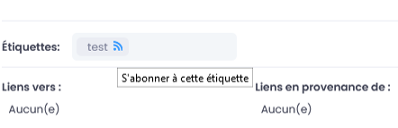
   
.. figure:: media-guide/image225.png
   :alt:

Un message apparaît dans le coin droit supérieur, pour vous confirmer la prise en compte de l'abonnement ou du désabonnement.

.. figure:: media-guide/image226.png
   :alt: 

L'icône d'abonnement apparaîtra en rouge dans l'étiquette si vous êtes abonné à ce terme, et en bleu si vous n’y êtes pas abonné.

.. figure:: media-guide/image227.png
   :alt: 

Échéance
~~~~~~~~
Consiste à donner une **date d’échéance** au document, c’est-à-dire
qu’un rappel par notification vous sera envoyé par rapport à ce document
à cette date.

Cela peut servir pour un contrat avec une date limite, un document qui
doit être finalisé à une date précise, …

.. figure:: media-guide/image228.png
   :alt: 

Pour introduire la date, cliquez sur « Aucun » face à « Echéance » et
choisissez la date pour le rappel. Terminez par « Appliquer »

Importance du Document/Contenu
~~~~~~~~~~~~~~~~~~~~~~~~~~~~~~~~

Vous pouvez signaler **l’importance d’un document** dans les métadonnées
et son niveau : critique, haute, normale ou basse.

Allez au niveau « Importance » dans les métadonnés du document, appuyez
sur « Modifier », choisissez le niveau d’importance et terminez avec
« Appliquer »

.. figure:: media-guide/image232.png
   :alt: 

Cette métadonnée permet d’ajouter un filtre à votre recherche
automatique et ….. ? (listing résultat ?) (en attente réponse CEO
vision)

Auteur du Document/Contenu
~~~~~~~~~~~~~~~~~~~~~~~~~~

Le fait d’indiquer **l’auteur** du document permet de savoir
à qui s’adresser en cas de question et d’ajouter un filtre lors de la
recherche.

Si le fichier déposé sur GoFAST contient une métadonnée "auteur" (ex: un fichier Word indique dans les informations du document que l'auteur est "Christopher"), ça sera automatiquement récupéré depuis le fichier par GoFAST et affiché sur la page du document. 

.. figure:: media-guide/image233.png
   :alt: 

Tapez les premières lettres du nom et le système vous proposera une
liste d’utilisateurs, sélectionnez le nom souhaité et cliquez sur
« Appliquer ».

.. figure:: media-guide/image234.png
   :alt: 

Historique et versions du Document
~~~~~~~~~~~~~~~~~~~~~~~~~~~~~~~~~~

L’\ **historique** indique les actions qui ont été faites sur le
document, par qui et quand : création, modification, …

.. figure:: media-guide/image235.png
   :alt: 

Juste en dessous de l’historique , vous pouvez voir aussi les
**versions** du documents, c’est-à-dire le numéro des versions actuelles
et combien il y en a eu avant. Sachant que chaque sauvegarde du document
est considérée comme une nouvelle version mineure (1.0 => 1.1, 1.2, 1.3,
….) . Par contre, si vous écrasez la dernière version mineure par une
nouvelle version du document (avec le glisser/coller par exemple), le
système vous demandera si vous voulez qu’elle devienne une version
majeure (1.3 => 2.0) et donc une nouvelle base de travail.

La 1ere version que vous créez ou migrez sur GoFAST commence à 1.0.

Cliquez sur « Show versions list » pour voir les versions antérieures,
vous pouvez même choisir le type de versions (actuelle, majeure ou
toutes), puis cliquez sur le numéro de la version que vous voulez
ouvrir.

.. figure:: media-guide/image237.png
   :alt: 

Les langues et traductions du Document/Contenu
~~~~~~~~~~~~~~~~~~~~~~~~~~~~~~~~~~~~~~~~~~~~~~

Vous pouvez mettre la **langue du document** dans les métadonnées, ainsi
plus besoin d’indiquer la langue dans le nom du document. Cela donne
également un niveau de **filtre** supplémentaire dans la recherche de
documents.

Allez dans les métadonnées, tout en bas, au niveau « Langues », appuyer
sur « Modifier », une petite fenêtre s’ouvre où vous pouvez choisir la
langue de ce document, avec le petit dérouleur qui vous donnera un choix
de plusieurs langues.

Terminez avec « Appliquer ».

.. figure:: media-guide/image238.png
   :alt: 

.. figure:: media-guide/image239.png
   :alt: 

De même, si le document existe en différentes langues (comme c’est le
cas des templates, guidelines, etc), vous pouvez lier entre elles les
traductions de ce document ; il suffira ensuite d’appuyer sur le drapeau
correspondant à la langue souhaitée pour prévisualiser le document dans
cette langue.

.. figure:: media-guide/image240.png
   :alt: 

Le premier drapeau correspond à la langue du document prévisualisé, les
autres sont les traductions disponibles. Donc dans l’exemple ci-dessus
le document est en anglais (on voit le drapeau + la langue à côté) et il
existe une traduction en français (on voit juste le drapeau).

Pour **lier 2 documents de langues différentes** : cliquez sur l’icône
avec les 3 barres horizontales dans la barre d’outil de la
prévisualisation, et choisissez la fonction « Editer les traductions « .

.. figure:: media-guide/image241.png
   :alt: 

Vous arrivez sur un formulaire où vous pouvez taper les premières
lettres du document que vous voulez lier, dans la case de la langue
souhaitée. Dans l’exemple ci-dessous, c’est la version française qu’on
veut ajouter et lier au document initial.

Terminez en appuyant sur la case bleue « Mettre à jour les traductions »

.. figure:: media-guide/image242.png
   :alt: 

Vous pouvez ainsi lier les différentes versions d’un même document qui
existe en plusieurs langues. Et les drapeaux correspondant à ces langues
se retrouveront dans les métadonnées du document.

Panier Documentaire 
-------------------
Le panier documentaire permet de rassembler plusieurs documents sans modifier leur emplacements pour exécuter diverses fonctionnalités sur l’ensemble du panier.
Le panier est accessible depuis le menu principale, icône "3 barres"/"burger" puis clic sur "Panier documentaire" (à partir de la v3.6, autrement c’est dans le menu du profil utilisateur).

.. figure:: media-guide/Ecran-GoFAST_Panier-Documentaire_acces-au-panier.png	
   :alt:

Ajouter/retirer des documents dans son panier documentaire
~~~~~~~~~~~~~~~~~~~~~~~~~~~~~~~~~~~~~~~~~~~~~~~~~~~~~~~~~~
**Il est possible d’ajouter des documents dans le panier :** 
   - Via le menu "burger" (actions contextuelles sur un document) sur la page du document, le fil d’activité, résultat de recherche…
   
.. figure:: media-guide/ Ecran-GoFAST_Panier-Documentaire_ajout-au-panier-sur-page-document.png
   :alt:	
   
   - Depuis l’explorateur de fichiers "GoFAST File Browser" en sélectionnant les documents souhaités et en cliquant sur l’icône "panier"
   
.. figure:: media-guide/Ecran-GoFAST_Panier-Documentaire_ajout-au-panier-dans-gofast-file-browser.png	
   :alt:
   
**Il est possible de retirer les documents de son panier documentaire :**
   - Unitairement, en cliquant sur "retirer du panier"
   - Tous les documents en une fois, en cliquant sur "retirer tous les documents"

.. figure:: media-guide/Ecran-GoFAST_Panier-Documentaire_retirer-du-panier.png	
   :alt:

Actions possible depuis le panier documentaire
~~~~~~~~~~~~~~~~~~~~~~~~~~~~~~~~~~~~~~~~~~~~~~
**Gérer en masse les documents du panier :**
   - Gérer la taxonomie (catégorie, étiquettes, état, langue)
   - Gérer les emplacements/visibilité des documents
   - Gérer les publications (créer/mettre à jour les publications des documents)

**Démarrer un processus de tâches depuis le panier (Enterprise only) :**
Les documents du paniers sont proposés lors du démarrage d’un nouveau workflow, via le menu principale. Cela permet d’associés au processus tous les documents en une fois, que l’on peut ensuite retirer unitairement dans le formulaire du processus.

.. figure:: media-guide/Ecran-GoFAST_Panier-Documentaire_retirer-du-panier.png	
   :alt:
   
Pour savoir comment démarrer un nouveau processus de tâches, merci de vous référer à la documentation : https://gofast-docs.readthedocs.io/fr/latest/docs-gofast-users/doc-gofast-guide-utilisateurs.html#workflows-processus-de-taches-enterprise-only

Edition de fichiers et Suite Office Collaborative
=================================================

Editer/modifier en ligne le document
------------------------------------

Cette fonction permet **d’ouvrir un fichier pour édition/modification**
sans avoir à le sauvegarder au préalable en local.

Le document type « Office » sera ouvert avec l’application définie par
défaut sur votre poste (exemple Office, LibreOffice, WPS). A noter que
sur Firefox, vous avez la possibilité de choisir à chaque ouverture
l’application.

Pour les types de contenus comme PDF, Images, une petite application
doit être installée au préalable sur le poste. Vous pouvez ensuite
ouvrir un PDF dans Adobe ou Foxit, le signer et directement le
sauvegarder sur GoFAST.

Si vous êtes donc un utilisateur standard/contributeur dans vos groupes,
vous pouvez modifier des documents, « éditer en ligne », de telle sorte
que les modifications apportées au document seront directement
enregistrées sur la GoFAST et donc visibles à tous les membres de ce
groupe. C’est ce qu’on appelle la synchronisation.

Allez dans le menu des fonctionnalités/actions contextuelles de la
prévisualisation et cliquez sur « **Editer en ligne** »…

    .. figure:: media-guide/image157.png
       :alt: 

Le système vous demande votre mot de passe afin de vous **identifier**.
Ainsi le système pourra montrer qui a fait les derniers changements
(cf : historique des versions et du document dans les métadonnées).

Votre identifiant et mot de passe sont les mêmes que pour vous loguer à
GoFAST.

.. figure:: media-guide/image158.png
   :alt: 

Le document s’ouvre dans Office et vous pouvez y travailler normalement,
n’oubliez pas de sauver (disquette) avant de fermer le document pour
être certain que le système a enregistré vos modifications.

.. figure:: media-guide/image159.png
   :alt: 

De retour sur l’interface GoFAST, faites un refresh de la page pour que
la prévisualisation du document apparaisse avec les modifications qui
viennent d’être faites.

.. figure:: media-guide/image160.png
   :alt: 

Vous pouvez voir qui a fait une action sur ce document dans
l’historique, dans l’encadrement des métadonnées, tout en bas.

Vous pouvez également voir les versions précédentes, en cliquant sur
« Show versions list » au niveau « Révisions dans les métadonnées.

.. figure:: media-guide/image161.png
   :alt: 

.. NOTE::
    Lorsque vous êtes en train d’éditer un document (que
    vous l’avez ouvert en ligne ), les autres personnes qui voudraient
    l’ouvrir auront ce message lors de sa prévisualisation, au-dessus
    des métadonnées « Vous êtes en lecture-seule sur ce document »

Et ils verront un petit cadenas fermé rouge dans la barre des
fonctionnalités de la prévisualisation, avec la photo de l’utilisateur
qui est en train de travailler sur le document. En mettant sa souris sur
l’icône, vous pouvez voir le nom de l’autre utilisateur.

.. figure:: media-guide/image162.png
   :alt: 

.. image:: media-guide/Tag-Enterprise.png
   :align: right
   :scale: 7%
   
   
Editer avec la Suite Collaborative OnlyOffice (Enterprise only)
---------------------------------------------------------------
   
GoFAST 3 apporte une dimension très innovante et vous permet d’éditer
des documents Office dans un simple navigateur **avec d’autres personnes
en simultané**. Vous pouvez ainsi travailler à plusieurs, en même temps,
sur un même document.

.. NOTE::
   Contrairement à GoogleDocs/Drive, **vous conservez vos formats
   Office** et vous pouvez ensuite directement ouvrir le fichier avec
   Office sans avoir à changer de format.

.. NOTE::
   De plus OnlyOffice est dans votre datacenter limitant les besoins
   de bande passante et garantissant une confidentialité totale.

.. CAUTION::   
   Une connexion réseau d'assez bonne qualité est nécessaire
   

Pour cela lancer la co-édition, allez dans les actions contextuelles de
la prévisualisation et appuyez sur l’option «  Editer avec OnlyOfice »

.. figure:: media-guide/image163.png
   :alt: 

.. IMPORTANT::
   Si vous souhaitez co-éditer les anciens formats Microsoft (.doc, .xls, .ppt) ou les formats
   OpenDocument (.odt, ...) ceux-ci seront convertis dans les formats équivalents .docx, .xlsx, .pptx). Si vous souhaitez une conversion la plus fidèle possible, faire cette conversion sous Office ou LibreOffice
   De même la version actuelle ne génère pas les Table de Matières, celles-ci devant être
   généré une fois le document terminé sous votre éditeur de texte.
   
Ce message apparaît, cliquez sur « Continuer »

.. figure:: media-guide/image395.png
   :alt: 
   
Voici un exemple d’un document Word ouvert avec OnlyOffice, pour
modification. On peut noter qu'une personne est entrain d'éditer en même
temps le document.

.. figure:: media-guide/image396.png
   :alt: 

Faites vos modifications puis fermer OnlyOffice, vous serez redirigé sur
la prévisualisation de votre document dans GoFAST ; **une fois que
toutes les personnes seront sorties d’OnlyOffice, une nouvelle version
sera créée** ; rafraichissez la page avec les petites flèches rondes
rouges, vous verrez ainsi vos modifications enregistrées dans le
document.

.. NOTE::
   Vous pouvez utiliser de nombreuses fonctionnalités de Word,
   notamment nous vous recommandons d'activer le mode révision (en bas à
   droite), les autres éditeurs identifieront mieux vos changements.

.. NOTE::
   Lorsque vous êtes en train d’éditer un document avec
   OnlyOffice (que vous l’avez ouvert en ligne), les autres personnes qui
   voudraient l’ouvrir auront ce message lors de sa prévisualisation,
   au-dessus des métadonnées « Vous êtes en lecture-seule sur ce document »

Et ils verront un petit cadenas ouvert rouge dans la barre des
fonctionnalités de la prévisualisation, avec la photo de l’utilisateur
qui est en train de travailler sur le document. En mettant sa souris sur
l’icône, vous pouvez voir le nom de l’utilisateur qui a ouvert en
1\ :sup:`er` le document.

.. figure:: media-guide/image166.png
   :alt: 

.. NOTE::
   OnlyOffice vous permet de co-éditer des contrats, des budgets, des
   présentations Powerpoint d'une façon beaucoup plus rapide que
   traditionnement, chacun travaillant à son tour.

Moteur de Recherche
===================

Fonctionnement du Moteur de Recherche :
---------------------------------------
Tout le contenu texte des documents (Word, Excel, PDF, mail, pages web, wiki, etc.) et leurs caractéristiques (les métadonnées) sont indexés. Vous trouvez une information précise ou un fichier par mots-clefs, même approximatifs (pluriel vs singulier, fautes de frappe, etc…) et sans avoir à connaitre le titre. Des mots-clefs approchants sont proposés en cas de recherche infructueuse.

Le moteur de recherche restitue le résultat selon la pertinence : 
~~~~~~~~~~~~~~~~~~~~~~~~~~~~~~~~~~~~~~~~~~~~~~~~~~~~~~~~~~~~~~~~~
Tout un ensemble de critères est pris en compte dans le calcul de cette pertinence : le nombre d’occurrences des mots-clefs recherchés, les emplacements des mots-clefs (ex : titre du fichier, d’un paragraphe dans le document…), les dates de création et modification (ex : un contenu récent sera privilégié vis-à-vis d’un document ancien), la popularité des contenus (ex : un document consulté souvent sera privilégié vis-à-vis d’un document qui n’a pas été consulté depuis des mois), etc.

Liste des principaux formats pris en charge par l’extraction/indexation :
~~~~~~~~~~~~~~~~~~~~~~~~~~~~~~~~~~~~~~~~~~~~~~~~~~~~~~~~~~~~~~~~~~~~~~~~~
* HyperText Markup Language (HTML)
* Fichiers vectoriels (SVG, VSD)
* Formats XML et dérivés (XHTML, OOXML, ODF)
* Documents Microsoft Office (DOC, PPT, EXL, DOCX, PPTX, PPSX, EXLX, etc.)
* OpenDocument Format (ODF)
* Documents iWorks
* Portable Document Format (PDF)
* Format de publication électronique (EPUB)
* Rich Text Format (RTF)
* Formats de compression et d'emballage (Tar, RAR, AR, CPIO, Zip, 7Zip, Gzip, BZip2, XZ et Pack200)
* Formats de texte (TXT)
* Formats de flux et de la syndication (RSS, Atom)
* Formats d'aide (CHM)
* Formats audio - au cas où il y a du texte intégré, ex : paroles (mp3, mp4, Vorbis, Speex, Opus, Flac etc.)
* Dossiers et archives de classe Java
* Code source (Java, C, C++, Groovy, etc)
* Formats e-mail (ex : eml, PST, MSG, TNEF)

Rechercher un document avec des mots-clefs
-------------------------------------------
La barre de recherche se trouve dans le menu principale pour être accessible à tout moment, depuis toutes les pages de GoFAST. 
Pour rechercher, il suffit de taper les mots clefs-souhaités et cliquer sur le bouton "loupe" ou faire "Entrer" sur son clavier. 

.. NOTE::
Une recherche avec 1 ou 2 mots-clefs sera élargie, alors qu'une recherche avec 3 mots-clefs ou plus sera plus restreinte. En effet, avec 2 mots clefs le moteur de recherche va proposer des contenus qui ont soit les 2 mots-clefs, soit l'un des deux mots-clefs. Alors qu’avec plus de 3 mots-clefs le moteur de recherche va proposer des contenus qui répondent à au moins 75% de la recherche. Donc, plus il y a de mots-clefs, plus la recherche est précise. 
Il est donc conseillé de rentrer peu de mots-clefs si on n’est pas certain des termes recherchés et au contraire, rentrer plus de 3 mots-clefs si on sais exactement ce qu’on cherche et qu’on est sûr des termes saisis. 

Recherche avancée avec les opérateurs booléens 
-----------------------------------------------
Par défaut, le moteur de recherche fonctionne avec la notion de "OU" : lorsqu'on saisit 2 mots-clefs le moteur va proposer les contenus avec le 1ère mot-clef OU l'autre mot-clef OU les 2 mots-clefs. 
Cela permet un résultat de recherche très large, mais parfois il est nécessaire de restreindre la recherche. Il est alors possible d’utiliser les "opérateurs booléens" qui sont des symboles à mettre avant ou après les mots-clefs pour indiquer au moteur de recherche comment traiter ces mots-clefs en particulier (ex : mot obligatoire, à exclure, chaine de mots exacte, etc.).

Liste des opérateurs booléens possibles :
~~~~~~~~~~~~~~~~~~~~~~~~~~~~~~~~~~~~~~~~~
* **AND** : intercalé entre les mots-clefs permet d'indiquer au moteur de recherche qu'il faut que tous les mots clefs soit présents (ex: Mémoire AND Technique AND Fonctionnalités)
* **+** : ajouté devant un mot-clef permet de le rendre obligatoire (ex : Mémoire Technique +Fonctionnalités) pour indiquer au moteur de recherche que parmi les termes saisis, certains doivent obligatoirement être présents dans le document recherché. 
* **"..."** : appliqués sur une suite de mots permet de rechercher une expression exacte (ex : "Mémoire Technique et Fonctionnalités GoFAST") et donc d’indiquer au moteur de recherche d’exclure les documents qui contiennent ses mots clefs s’ils ne sont pas exactement comme dans l’expression saisie. 
* ***** : ajoutée à la fin ou au début d’un mot-clef permet de le rendre approximatif (ex : Fonction*) et donc d’indiquer au moteur de recherche d’afficher les documents qui contiennent tous les termes qui ont pour racine le mot-clef sais. 

.. figure:: media-guide/operateurs-booleens.jpg
   :alt: 

Consulter le résultat de Recherche
---------------------------------------------
.. NOTE:: Pour connaître la manière dont GoFAST restitue un résultat de recherche, merci de consulter la partie : "Le moteur de recherche restitue le résultat selon la pertinence"

Pour chaque document affiché dans le résultat de recherche, vous pouvez consulter :
~~~~~~~~~~~~~~~~~~~~~~~~~~~~~~~~~~~~~~~~~~~~~~~~~~~~~~~~~~~~~~~~~~~~~~~~~~~~~~~~~~~
* L’icône indiquant le type du document (fichier texte, tableur, PDF, image, vidéo…) ou autre contenu (forum, page Wiki, profil utilisateur, Espace Collaboratif…),
* Le titre du fichier (un clic dessus permet d'aller sur la page du document), 
* Le menu des actions possible sur un document (icône avec 3 petite barres à droite du titre du document), 
* Des "fragments" de texte qui sont des extraits du contenu avec les mots-clefs recherchés et qui permettent de vérifier si le document est bien celui que l’on cherche sans avoir à l’ouvrir (si plusieurs extraits sont trouvés, il est possible de les consulter l’un après l’autre en utilisant la pagination), 
* Un bouton "prévisualiser" qui permet d’afficher un aperçu du document en un clic (NB : certains contenu ne le permettent pas car ne bénéficient pas la prévisualisation)
* Des informations clefs sur le contenu (date de création/dernière modification, la popularité...)
* Les étiquettes, catégories, l'importance et les états des documents. 

.. figure:: media-guide/recherche-contextuelle.png
   :alt:

Recherche contextuelle dans un document :
-----------------------------------------
Le résultat de recherche permet de cliquer sur les mots-clefs mis en gras dans les titres et dans les extraits des contenus trouvés.
Ces mots en gras permettent une recherche contextuelle dans un document : en cliquant sur un mot-clé mis en gras, vous accéder à la page du document avec dans la prévisualisation, la mise en évidence des mots-clefs recherchés et la possibilité de les passer l’un après l’autre. 
Cette recherche contextuelle offre un important gain de temps lorsqu’il faut trouver un élément précis dans un document en particulier ou pour en faire une lecture rapide.  

Filtrer le résultat de recherche
--------------------------------
Dans le cas où les mots-clefs saisis ne permettent pas de retrouver rapidement le document recherché, GoFAST propose de nombreux filtres.
La liste des filtres est conditionnée au résultat de recherche, ex : si pour les mots-clefs saisis il n'y a aucun document de type PDF, ce format ne sera pas proposé dans les filtres disponibles.

Groupes de filtres disponibles : 

* Date de création, 
* Date de modification, 
* Type de document (selon le format de fichier), 
* Etiquettes, 
* Catégorie,
* Espaces Collaboratifs,
* Créateur, 
* Dernier contributeur, 
* Auteur, 
* Etat, 
* Importance, 
* Langue,
* Echéance.

.. figure:: media-guide/image038.png
   :alt: 

Trier le résultat de recherche
------------------------------
Par défaut, le résultat de recherche classe les documents par pertinence selon les mots-clefs recherchés (voir "fonctionnement du moteur de recherche").
 
Il est toutefois possible de modifier de tri pour classer les contenus par : 

* Titre (ordre alphabétique)
* Auteur, 
* Popularité
* Date de création 
* Date de modification, 
* Type de document

.. NOTE:: trier le résultat de recherche sur un autre critère que la pertinence, peut afficher en haut de la liste des contenus qui correspondent mois bien aux mots-clefs saisis car le critère sélectionné pour le tri prime. 

Explorateur de fichiers GoFAST File Browser
============================================

Accéder à l'explorateur de fichiers GoFAST 
------------------------------------------

Il existe 3 façons d'accéder à l'explorateur de fichiers GoFAST File Browser :

.. [#f1] Vous pouvez afficher l'explorateur de fichier GoFAST depuis le menu principal en allant dans "Espace", puis sur "Explorateur". 
  

.. [#f2] Vous pouvez afficher l'explorateur de fichier GoFAST depuis la page d'un espace en cliquant sur l'onglet "Documents" 

.. [#f3] Vous pouvez à tout moment déplier le bloc de l'explorateur de fichiers qui est caché à gauche sur chaque page de GoFAST

.. figure:: media-guide/FBrowser-03.png
   :alt: 

Se repérer dans GoFAST File Browser
-----------------------------------

L'explorateur de fichiers GoFAST comporte 4 zones distinctes : 

1.	Barre de tâche (zone horizontale en haute)
2.	Bloc structure de l'arborescence (zone verticale à gauche)   
3.	Bloc principale affichant le contenu d'un dossier (zone la plus large, centre-droit)
4.	Bloc de progression (zone horizontale en bas) 

.. figure:: media-guide/FBrowser-04.png
   :alt:

Les divers contenus affichés dans l'explorateur de fichiers sont identifiés par des icônes selon leur type ou format de fichier. Chaque type d'espace collaboratif ou votre espace privé disposent d'une icône distincte. Les répertoires dits classiques sont représentés par des icônes "Dossier". 

.. Note:: 
   Dans la zone principale à la première ligne, vous disposez d'un bouton qui permet de revenir à l’emplacement précédent. 

.. figure:: media-guide/FBrowser-05.png
   :alt:

Déposer des fichiers sur GoFAST via l'explorateur 
-------------------------------------------------

Pour déposer des fichiers depuis votre PC vers GoFAST, il est conseillé de faire un *Glisser/Déposer* directement dans l'espace ou le dossier souhaité. 

.. WARNING::
 Il faut déposer le(s) fichier(s) soit dans le cadre principal (zone 2 sur la copie écran ci-dessus), soit dans le cadre à gauche où il y a l'arborescence (zone 3 sur la copie écran au-dessus).

Les fichiers ainsi déposés sont chargés et la progression est affichée dans la zone horizontale en bas de l'explorateur. Vous pouvez à tout moment cliquer sur *Pause*, *Annuler* ou bien *Reprendre* le chargement. 

.. NOTE:: 
   Le chargement se fera uniquement si vous avez les droits pour déposer des contenus dans l'espace concerné.  
   Pendant le chargement des fichiers depuis le PC vers GoFAST, ne pas supprimer, ni déplacer les fichiers côté PC car pour charger il faut conserver l'emplacement d'origine, autrement GoFAST ne sais plus depuis où il faut les récupérer . 

Utiliser la barre d’outils de GoFAST File Browser
--------------------------------------------------

La barre d'outils de l'explorateur de fichier permet d'effectuer les action suivantes : 

Modifier la manière dont sont affichés les contenus
~~~~~~~~~~~~~~~~~~~~

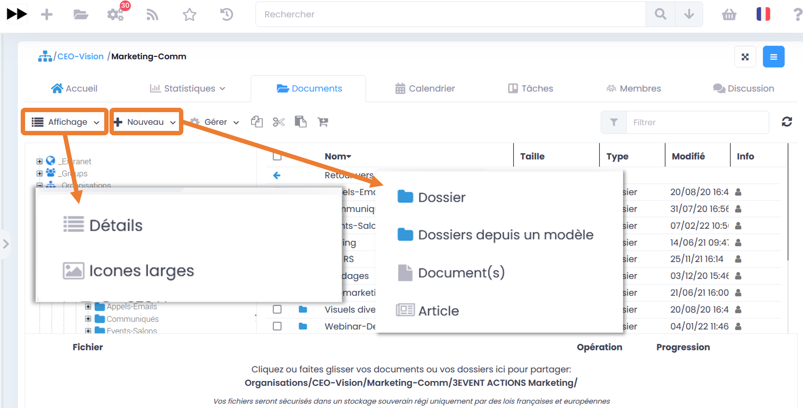

Créer un nouveau contenu dans le dossier sectionné
~~~~~~~~~~~~~~~~~~~~

Si vous appuyez sur le bouton *Nouveau* puis *Dossier*, cela vous permet de créer un nouveau dossier à cet emplacement. Il vous suffit ensuite de le nommer, puis valider. 

Pour créer un nouveau document dans l'emplacement où vous vous trouvez, cliquez sur *Nouveau*, puis *Document*. Vous serez alors ramené vers le formulaire de création de document avec l'emplacement présélectionné.

Gérer les métadonnées (taxonomie) et les emplacements d’un ou plusieurs contenu(s)
~~~~~~~~~~~~~~~~~~~~~~~~~~~~~~~~~~~~~~~~~~~~~~~~~~~~~~~~~~~~~~~~~~~~~~~~~~~~~~~~

Pour pouvoir cliquer sur le bouton *Gérer* il faut au-préalable sélectionner un ou plusieurs dossier(s) et/ou contenu(s) dans la zone principale de l'explorateur de fichiers.

Une fois les éléments sélectionnés, vous pouvez gérer la visibilité des contenus (selon vos droits utilisateur) en cliquant sur *Gérer les emplacements*, ou bien modifier les informations de taxonomie. 

.. Note:: 
   Les modifications d'informations de taxonomie sont possibles sur : l'état, la catégorie, le(s) étiquette(s), et la langue. Dans le cas où vous ne souhaitez pas modifier tous ces éléments, laisser le champ positionné sur *Ne pas modifier*. 
Ces informations serviront ensuie dans les filtres de la recherche automatique pour réduire la liste des résultats. 

.. figure:: media-guide/FBrowser-08.png
   :alt:

Gérer en masse les Publications de documents (en v 3.6)
~~~~~~~~~~~~~~~~~~~~~~~~~~~~~~~~~~~~~~~~~~~~~~~~~~~~~~~
Il est possible de générer des publications depuis une sélection de document de travail pour partager dans d'autres Espaces Collaboratifs des versions finies/validées, sans partager tout l'historique des versions et commentaires des documents de travail. Les publications sont ainsi largement partagées et les documents de travail restent accessibles uniquement dans les Espaces d'origine. 

.. Note:: 
   Cette fonctionnalité est possible unitairement sur la page d'un document, mais aussi en masse depuis GoFAST File Browser (à partir de la v3.6). 
   
Après avoir séléctionné les documents souhaités, il suffit de cliquer sur *Gérer*, puis sur *Gérer les publications*. 

.. figure:: media-guide/Ecran-GoFAST_Publication-en-masse_slelectionner-pour-publier-en-masse.png	
   :alt:

Le formulaire de gestion des publications s'ouvre et il faut alors cocher les emplacements où seront partagées ces publications. Il est possible de demander à convertir au format PDF ou de laisser les formats d'origine. 

.. figure:: media-guide/Ecran-GoFAST_Publication-en-masse_publier-en-masse.png
   :alt:
   
.. Note:: 
   Les publications sont une fonctionnalité clef pour une gestion efficace et en toute sécurité des documents.

Ajouter un/des document(s) au panier
~~~~~~~~~~~~~~~~~~~~~~~~~~~~~~~~~~~~

Lorsque vous sélectionnez un ou plusieurs fichiers vous avez la possibilité en cliquant sur l'icône (voir ci-dessous) de les ajouter à votre panier documentaire. 

Ce panier documentaire d'exécuter des actions sur une sélection de documents, comme par exemple lancer un processus de validation (workflow). 
*Pour plus de détails voire le paragraphe consacré aux Workflows et au Panier Documentaire*

.. figure:: media-guide/FBrowser-11.png
   :alt: 

Filtrer les contenus dans un dossier ou espace
~~~~~~~~~~~~~~~~~~~~~~~~~~~~~~~~~~~~~~~~~~~~~~~~

Cette nouvelle fonctionnalité va vous permettre de retrouver vos documents plus facilement. Dans la barre *Filtre* (voir image ci-dessous), écrivez le titre du document que vous recherchez, et la recherche va filtrer tous les documents sur la page de l'espace où vous êtes.

.. figure:: media-guide/FBrowser-12.png
   :alt: 
   
   
Copier/Couper/Coller des documents
~~~~~~~~~~~~~~~~~~~~~~~~~~~~~~~~~~

En survolant les icônes avec la souris, vous verrez à quelle action elle correspond avec un petit mot affiché sous l'icône. 

**Copier/Coller un document**

L’icône des 2 feuilles superposées (encadré en orange ici) permet de *Copier* le document sélectionné dans un autre emplacement de la GoFAST, il vous faudra alors ensuite appuyer sur le dernier icône (encadré en jaune ici) quand vous voudrez coller le document à l'emplacement où vous souhaitez le coller, clic-droit de la souris et "Coller". 

Cette démarche revient à dire que le document sera à 2 endroits différents sur GoFAST et le risque à ce moment là est d'avoir des doublons car si quelqu'un modifie le document à un endroit, l'autre document copié ne sera pas modifié lui. Vous vous retrouverez alors avec 2 documents de même nom, à des emplacements différents, avec des versions différentes. 

MAIS, GoFAST vous permet le multi-emplacement des documents sans créer de copies de vos documents. Le multi-emplacement est préférable (via les métadonnées), ainsi il permet de garder la même version du document visible à partir de plusieurs emplacements et évite les doublons avec des versions différentes et toujours avec la mise à jour la plus actuelle. ( = un seul document, une seule version actuelle, un permalink unique, à plusieurs endroits). 

.. figure:: media-guide/FBrowser-09.png
   :alt: 
   
   
**Couper/Coller un document**

Même principe que pour *Copier/Coller* , mais ici pour déplacer un dossier vers un autre emplacement sur GoFAST est de *Couper* puis *Coller*. Cette fois, il faut utiliser les ciseaux pour couper (entouré ci-dessous en orange) et l’avant dernier icône noir et blanc pour Coller (entouré ci-dessous en jaune). 

.. figure:: media-guide/FBrowser-10.png
   :alt:

Cette démarche, contrairement à la précédente permet d'éviter les doublons. Il n'y alors qu'une version du document à un seul endroit sur GoFAST. 

.. NOTE:: 
   C’est le même principe que de déplacer en glissant le document d’un emplacement à un autre dans l’arborescence.
   Vous ne pouvez *Couper/Coller* des documents que dans GoFAST. Vous ne pouvez donc pas coller un document externe à la GoFAST, il faut le télécharger préalablement. 

Actions depuis GoFAST File Browser selon le type de contenu  
-----------------------------------------------------------

De manière générale, les actions autorisées sur les espaces, dossiers et/ou fichiers visibles dans l'explorateur de fichiers restent strictement conforme à vos droits sur l'espace concerné.

Lorsque vous êtes dans votre explorateur de fichiers/arborescence
GoFAST, vous pouvez aussi gérer vos documents avec quelques raccourcis
via le **clic-droit de la souris**, sans devoir passer par la
prévisualisation donc.

Il faut juste sélectionner le/les documents sur lesquels s’appliquent la
fonctionnalité

Le clic droit permet d'afficher le menu des actions contextuelles au type de contenu. Ci-après les diverses actions possibles par type de contenu avec les droits d'administrateur de l'espace. 

Actions sur un unique document
~~~~~~~~~~~~~~~~~~~~

.. figure:: media-guide/FBrowser-13.png
   :alt:

Lorsque vous faite un clic droit sur le document souhaité, une liste de plusieurs menus vous sont proposez (voir copie d’écran) qui va vous permettre un certains nombre d’actions sans pour autant avoir besoin d’aller sur la prévisualisation du document. 

Actions sur une selection de fichiers ou dossier (classique)
~~~~~~~~~~~~~~~~~~~~

Un clic droit sur une sélection de plusieurs fichiers, plusieurs actions vous sont proposées (de manière restreinte par rapport à l’action sur un fichier unique) telles que : 

 * (1) Supprimer 
 * (2) Télécharger 
 * (3) Gérer la taxonomie 
 * (4) Gérer les emplacements 

.. figure:: media-guide/FBrowser-14.png
   :alt:

-
.. figure:: media-guide/FBrowser-15.jpg
   :align: right

Pour sélectionner plusieurs documents dans l’explorateur de fichiers vous devez sélectionner le premier document en tête de votre liste à sélectionner, puis maintenir la touche «Shift» enfoncée tout en sélectionnant le dernier document de votre liste que vous souhaitez sélectionner.  

Cette démarche est valable sur : Windows, Mac, Linux 

Gérer les emplacements (Multi-emplacement = zéro doublon de fichier)
~~~~~~~~~~~~~~~~~~~~

**Multifiler** signifie mettre le *même et seul document à plusieurs endroits* sur la GoFAST et ainsi rendre une même et seule version visible par plusieurs groupes. Il s’agit d’une action de «Partage» évitant tout doublon.

Si votre document est dans votre groupe et que vous voulez que les membres d’un autre groupe puissent le voir aussi pour y travailler, il suffit d’ajouter un emplacement dans les métadonnées du document.

Cliquez sur « Gérer les emplacements », et choisissez les différents groupes/espaces/répertoires où vous voulez que le document soit visible (cochez les cases ou cliquez sur le nom de l’espace pour qu’il se retrouve à droite en bleu).

Terminez avec « Enregistrer »

Lisez bien la remarque dans l’encadré

.. figure:: media-guide/image254.png
   :alt: 

Vous pouvez aller plus loin dans l’arborescence en cliquant sur les petits « + » devant les noms d’espaces

Lorsque vous retournez sur la prévisualisation du document, vous verrez, dans les métadonnées, les différents emplacements où se trouve le document.

.. figure:: media-guide/image256.png
   :alt: 

Actions sur un Espace
~~~~~~~~~~~~~~~~~~~~

Plusieurs actions sont également disponible sur un Espace (voir copie d’écran ci-dessous). 

.. figure:: media-guide/FBrowser-16.png
   :alt:

Exportation des listes de documents
------------------------------------
Sous le profil Administrateur de la plate-forme, de nouveaux menus apparaissent tel que « **Statistics** ». Vous retrouvez ce nouveau sous-menus sous votre Menu Utilisateur. Cette fonctionnalité vous permet alors de visualiser les différentes statistiques découpées en 3 catégories. 

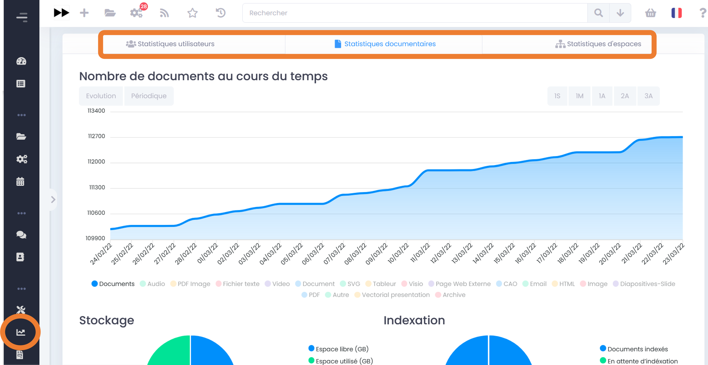

Depuis ce nouveau menu, vous visualisez toutes les statistiques utilisateurs, documentaires et d'espaces. Vous devez cliquer sur l'onglet « **Statistiques documentaires** », afin d'accéder au menu qui permet d'exporter une liste de documents. 

Vous faites le choix des sous-groupes et répertoires dont vous souhaitez exporter votre liste de documents. Une fois votre choix sélectionné, une extraction est faite dans un fichier Excel. 

.. figure:: media-guide/Export_liste_documents.png
   :alt:

Gestion des Espaces Collaboratifs
=================================

Voir aussi "Création d’un espace"

Devenir membre d’un espace/groupe
---------------------------------

Il faut bien sûr d’abord avoir un compte GoFAST. Si ce n’est pas encore
le cas, il faut **le demander** à l’administrateur général (à ICT) ou à
un autre administrateur d’espace (désormais possible dans GoFAST3) .
Puis,

-  soit l’administrateur du groupe qui a créé votre compte, vous ajoute
   directement comme membre de ce groupe ;

-  soit en faisant la demande via l’annuaire et les
   groupes/organisations/espaces : vous avez la liste des espaces
   collaboratifs à droite (cliquez sur ceux que vous voulez) , vous les
   retrouvez ainsi à gauche et avez la possibilité de les rejoindre un
   par un en cliquant sur « Rejoindre » dans chaque case d’espace.

Vous verrez un message bleu s’afficher confirmant votre demande de
joindre ce groupe/cet espace

.. figure:: media-guide/image091.png
   :alt: 

Vous retrouverez ensuite vos demandes dans votre profil.

.. figure:: media-guide/image092.png
   :alt: 

Ajouter des membres à un espace/groupe
--------------------------------------

Le **compte** de la personne doit déjà exister, si pas, il doit **être
créé** dans l'annuaire par quelqu'un d'habilité (l’administrateur
général/ICT ou un autre administrateur de l’espace en question) .

(voir « Création d’ un utilisateur » p.43 et « Créer un utilisateur dans
un espace » p.52)

Pour connaître les administrateurs d’un groupe, allez sur l’onglet
« Membres » de ce groupe, vous y verrez en 1ere ligne les
administrateurs de l’espace.

.. figure:: media-guide/image093.png
   :alt: 

**Si vous avez donc les droits d’administrateur de cet espace** ;
lorsque vous êtes dans l’espace collaboratif en question (groupe ou
organisation), allez dans les actions contextuelles (3 barres
horizontales) , cliquez sur « Ajouter membre»

Remplissez cette fenêtre avec le nom du nouveau membre (inscrivez les 3
premières lettres pour avoir des propositions de noms), choisissez le
rôle que vous lui donnez (administrateur, contributeur standard ou
lecture seule). Vous pouvez également mettre un petit mot dans la zone
de texte « Request message » pour prévenir les autres administrateurs de
cet espace de cet ajout et la raison. Terminez en cliquant sur « Ajouter
le nouveau membre » en vert.

.. figure:: media-guide/image095.png
   :alt: 

.. figure:: media-guide/image096.png
   :alt: 

Lorsque vous revenez sur l’onglet « Membres » du groupe, vous voyez les
noms des membres (icône/photo) et dans quelle catégorie de rôle ils
sont.

**Rechercher/modifier/supprimer un membre dans un espace**

-  Vous pouvez **rechercher** un membre en tapant les 3 premières
   lettres de son nom/prénom.

-  Sous les noms des membres, vous pouvez **modifier** un par un leur
   rôle ; appuyez sur « Modifier rôle » ; la fenêtre pour changer les
   rôles s’ouvre. Mettez à jour.

-  Vous pouvez aussi **supprimer** un membre dans un groupe de cette
   façon. Appuyez sur « Retirer »

.. figure:: media-guide/image097.png
   :alt: 

Voir aussi"Gérer les membres d’un groupe" 

Créer un utilisateur dans un espace/groupe
------------------------------------------

Si vous voulez **ajouter un nouvel utilisateur** à la GoFAST, il faut
lui créer un compte.

Toujours dans les actions contextuelles d’un groupe, vous pouvez créer
un nouvel utilisateur dans ce groupe/espace, à condition d’en avoir les
droits d’administrateur d’espace.

.. figure:: media-guide/image098.png
   :alt: 

Ce formulaire s’ouvre, dans lequel vous pouvez soit aller chercher dans
le LDAP, l’annuaire (AD) de l'Organisation (si le couplage a été fait) , et certaines les données seront alors
préremplies ; soit remplir à la main avec les données du nouvel
utilisateur (externe) pour lequel vous créez ce compte.

Terminez par « Enregistrer »

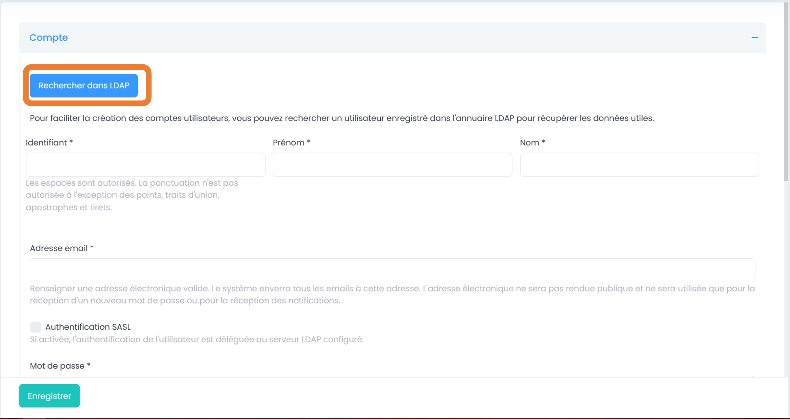

.. figure:: media-guide/image100.png
   :alt: 

.. figure:: media-guide/image101.png
   :alt: 

Gérer les membres d’un espace/groupe
------------------------------------

Gérer les membres d’un groupe signifie **ajouter/supprimer des membres,
leur donner un rôle spécifique** (voir : « Rôles/droits des membres d’un
espace/groupe » p.56).

C’est **l’administrateur du groupe** qui peut faire cela.
L’administrateur étant celui qui a créé le groupe ou celui à qui on a
confié ce rôle (assistant administratif, N+1, responsable du groupe, …)

Si vous avez donc les droits pour gérer les membres d’un groupe parce
que vous en êtes l’administrateur, il faut cliquer sur la flèche de
l’onglet « Espaces » puis sur « Gérer les membres des espaces » ; une
fenêtre s’ouvre avec 2 parties : « Ajouter un membre » et « Mettre à
jour ».

La 1ere partie « \ **Ajouter un membre** » vous permet d’ajouter un ou
plusieurs membres en une fois dans un groupe. Sélectionnez les membres à
ajouter, en tapant les 1eres lettres de leur nom ou prénom, le système
vous proposera une liste à cocher ; choisissez ensuite le ou les
groupe(s) dans lesquels vous voulez les ajouter, ainsi que le rôle que
vous voulez leur donner (administrateur, contributeur ou en lecture
seule). Par défaut, ils seront abonnés à ce/ces groupes, donc n’oubliez
pas de choisir NON sous « subscription » si vous ne voulez pas qu’ils
reçoivent automatiquement les notifications liées à ce(s) groupe(s).

Terminez par « **Appliquer** »

.. figure:: media-guide/image103.png
   :alt: 

La 2eme partie «**Mettre à jour** » permet de gérer les utilisateurs
déjà membres de ce groupe et donc soit de les supprimer, soit de changer
leur rôle.

Cochez le groupe dont il est question, une liste apparaît, on y voit les
noms des membres et leur rôle actuel dans ce groupe. Cochez les membres
que vous voulez changer, choisissez leur nouveau rôle et « Appliquez » ;
ou supprimez les du groupe avec « Retirer les droits d’accès »

.. figure:: media-guide/image104.png
   :alt: 

Pour annuler l’action, cliquez sur le logo GoFAST, dans le coin gauche
supérieur de l’écran ; vous revenez ainsi à la page d’accueil.

.. figure:: media-guide/image105.png
   :alt: 

Rôles/droits des membres d’un groupe/espace
-------------------------------------------

Il y a **3 types d’utilisateurs** selon les droits qu’ils ont sur la
gestion des documents :

1) **L’administrateur/rice** d’un groupe : peut tout faire dans le
   groupe : ajouter/supprimer des membres, leur donner différents
   droits, supprimer/ajouter n’importe quel document, créer des
   sous-espaces dans ce groupe, et toutes les fonctionnalités de base :
   télécharger, éditer, déplacer un document, gérer la taxonomie (=
   métadonnées/infos liées au document), …

2) **L’utilisateur standard** : peut utiliser toutes les fonctionnalités
   de base : télécharger, éditer, ajouter/supprimer/déplacer un document
   *dont il est l’auteur,* gérer la taxonomie (= métadonnées/infos liées
   au document), …

3) **L’utilisateur « read only/lecture seule »** : peut juste
   télécharger le document ou le commenter. 

Gérer un espace collaboratif /groupe
------------------------------------

Lorsque vous êtes dans un **espace/groupe,** voici le genre de données
que vous pouvez voir :

a) Une page d’\ **Accueil **;

.. figure:: media-guide/image106.png
   :alt: 

b) Un onglet « **Activité** », où vous avez une vue d’ensemble de ce
   qui se passe dans ce groupe ;

.. figure:: media-guide/image107.png
   :alt: 
   
c) Un onglet « **Statistiques** », où vous voyez les activités des membres actifs et inactifs, ainsi que les statistiques documentaires de l'espace ;

.. figure:: media-guide/Statistiques.png
   :alt: 

d) Un onglet « **Documents** », où vous voyez les documents et
   l’arborescence de ceux-ci ; 

.. figure:: media-guide/Image-Document-6.png
   :alt: 

e) Un onglet « **Calendrier** », où vous pouvez mettre des dates
   d’échéance, des rappels, … ;

f) Un onglet « **Membres** », où vous voyez les membres du groupe et
   leur rôle respectif

.. figure:: media-guide/image110.png
   :alt: 

S’il y a des utilisateurs qui ont fait la demande de rejoindre ce
groupe, on peut le voir sous ce titre « Utilisateurs en attente »

.. figure:: media-guide/image111.png
   :alt: 

Vous pouvez gérer votre groupe grâce à l’icône avec les **3 barres
horizontales**, dans le coin droit supérieur de la page du groupe, qui
correspond aux fonctionnalités/actions contextuelles liées à un groupe,.
Par contre, si vous n’êtes pas administrateur de groupe, certaines de
ces options vous seront invisibles.

.. figure:: media-guide/image112.png
   :alt: 

Vous pouvez y ajouter un membre, créer un nouvel utilisateur pour cet
espace, créer un sous-espace, modifier les données du groupe, archiver
ce groupe, supprimer ce groupe, se désabonner ou s’abonner, rejoindre
une discussion,...

.. NOTE:: Les onglets "accueil", "activité", "statistiques", "membres" d'un espace affichent des éléments liés à l'espace sur lequel on se trouve et dont le titre est indiqué juste au-dessus des onglets. Toutefois, l'onglet "Document" ne cloisonne pas l'utilisateur à cet unique espace, mais lui permet de naviguer dans tous les emplacements où il a accès. Il peut donc arriver que le nom de l'espace indiqué au dessus des onglet ne soit pas celui de l'emplacement d'arborescence où on se trouve. 

Ajouter un sous-espace
----------------------

.. NOTE:: Merci de lire en introduction la différence entre les espaces de type Organisation, Groupes, Extranet, ... http://gofast-docs.readthedocs.io/fr/latest/docs-gofast-users/doc-gofast-guide-utilisateurs.html#les-espaces-collaboratifs

Il est possible de créer de **nouveaux espaces dans un espace**
déjà existant ou dans une organisation, que nous appellerons « sous-espaces »; 

.. IMPORTANT:: Pourquoi créer des sous-espaces au lieu de simples répertoires ? => Pour limiter l'accès de ce nouveau sous-espace à un nombre plus restreints de membres que l'espace "parent"

.. CAUTION:: Seul le super-administrateur ou Administrateur de plateforme peut créer des sous-espaces à la racine

Dans les actions contextuelles de l’espace (icône avec 3 barres
horizontales), choisissez « Ajouter sous-organisation ou sous-groupe »

.. figure:: media-guide/image113.png
   :alt: 

Il suffit alors de remplir cette page avec le nom du nouvel espace,
donner une brève description, créer éventuellement une page d’accueil,
choisir l’endroit où il se trouvera dans l’arborescence de la GoFAST et
terminer avec « Enregistrer ».

.. figure:: media-guide/image114.png
   :alt: 

Ce sera donc un nouveau groupe/espace qui se gère comme les autres, où
il faudra y ajouter des membres et des fichiers à partager.

Vous pouvez retrouver ce **sous-espaces dans vos espaces** ; par
exemple, ici comme c’est un sous-espace d’une organisation, allez sur
les petites flèches à côté des noms d’espaces/organisation jusqu’au
niveau de votre sous-espace.

.. figure:: media-guide/image115.png
   :alt: 

.. NOTE::
    Il est conseillé de ne pas créer trop de sous-groupes
    si il n’est pas nécessaire de gérer des droits particuliers quant au
    contenu de ce groupe ; créez plutôt des répertoires qui resteront
    visibles à tous les membres du groupe-parent.

Si les sous-espaces/groupes ne sont pas visibles directement via
l’onglet « Espaces », une autre manière d’explorer les sous-niveaux et
leur contenu, est d’appuyer sur le logo d’organigramme (« Parcourir à
partir d’ici » ) à droite du nom du groupe ; cela vous amènera à
l’arborescence plus détaillée de l’espace (avec ses sous-espaces) et son
contenu.

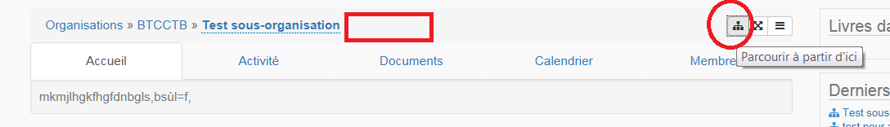

.. figure:: media-guide/Image-Arborescence-7.png
   :alt: 

.. NOTE::
   Les membres d’un sous-groupe auront accès aux documents/répertoires qui se
   trouvent à un niveau supérieur (dans le groupe-parent) , par contre les
   membres du groupe-parent n’auront pas nécessairement accès aux documents
   de ce sous-groupes car la liste des membres du sous-groupe peut varier
   par rapport à celle des membres du groupe-parent.

**Exemple :**

-  Monsieur X est membre du *sous-groupe* « Support GoFAST », entouré
   en rouge ; 

-  Madame Y est membre du *sous-groupe* « test\_group », entouré en
   noir ; 

-  Junior fait partie du *groupe-parent* ou groupe-racine « Groupes »,
   entouré en jaune.

.. figure:: media-guide/image370.png
   :alt: 

Ils voient tous les 3 ce qu’il se passe dans le groupe-racine
« Groupes » (entouré en jaune) , c’est-à-dire les répertoires et activités
propres à ce groupe-racine *MAIS* Monsieur X et Madame Y ne voient que
ce qu’il se passe dans leur propre sous-groupe respectif ( entouré en
rouge ou en noir) et donc l’un ne voit pas ce qu’il se passe dans le
groupe de l’autre. Madame Y (entouré en noir) ne voit pas ce qu’il se
passe chez Monsieur X (entouré en rouge) et vice -versa. Quant à Junior
(entouré en jaune), il ne voit pas ce qu’il se passe dans les
(sous-)groupes de Madame Y et Monsieur X, à moins qu’il ne devienne
membre de ce/ces sous-groupes aussi. => nouveaux groupes et sous-groupes
= plus de confidentialité et possibilité de membres différents d’un
groupe à l’autre.

**Autre manière d’expliquer, avec l’arborescence :**

Je suis membre du groupe « \_Support GoFAST » qui est un sous-groupe de
l’espace « Groupes ». J’ai donc accès à tous les répertoires qui se trouvent
dans « \_Groupes » et dans « \_Support GoFAST » (nom précédé d’un
underscore = espace/groupe).

Par contre, je ne vois pas le sous-groupe « test\_group » dans
l’arborescence car je n’en suis pas membre.

Je sais juste qu’il existe parce qu’il est dans les espaces visibles à
partir du menu.

.. figure:: media-guide/image372.png
   :alt: 

Et si je clique dessus à partir du menu, j’arriverai sur la page du
groupe « Test\_group » mais l’accès à son contenu me sera refusé.

Je devrai demander d’en devenir membre si je veux voir le contenu et y
travailler.

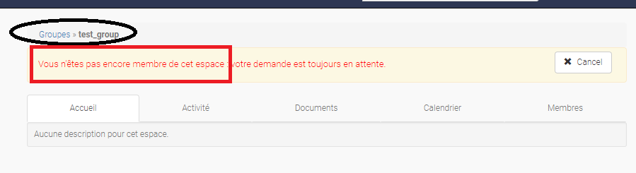

Modifier un groupe
------------------

Cette fonctionnalité permet de **modifier les informations concernant un
groupe** déjà existant : vous pouvez changer le nom, la description, la
page d’accueil et son emplacement dans l’arborescence (par exemple,
changer l’espace-parent).

Reprenez les actions contextuelles d’un groupe (les 3 barres
horizontales), choisissez « Modifier » et changer les données. Terminez
par « Enregistrer ».

.. figure:: media-guide/image118.png
   :alt: 

.. figure:: media-guide/image119.png
   :alt: 

Archiver un groupe
------------------

**Archiver un groupe** permet de garder une trace de son contenu et donc
de ne pas le supprimer totalement de la GoFAST. On peut archiver un
groupe de travail qui n’est plus actif par exemple.

Pour archiver un groupe : allez dans les actions contextuelles du groupe
(les 3 barres horizontales) et choisissez « Archivez cet espace ».

Une fenêtre s’ouvre vous demandant si vous êtes sûr de vouloir archiver
cet espace, confirmez en appuyant sur « Archive ».

.. figure:: media-guide/image120.png
   :alt: 

Le contenu de ce groupe apparaîtra comme archivé et ne sera plus visible
lors de la recherche, sauf si vous mettez l’option de recherche
« Inclure les contenus archivés ».

.. figure:: media-guide/image121.png
   :alt: 

Supprimer un groupe
-------------------

Supprimer un groupe consiste à **supprimer tout son contenu** de la
GoFAST définitivement ! Il ne sera donc plus visible nulle part.
Réfléchissez donc bien avant de vouloir supprimer un groupe,
assurez-vous qu’il soit bien vide par exemple.

Toujours dans les actions contextuelles, choisissez « Supprimer cet
espace »

.. figure:: media-guide/image122.png
   :alt: 

S’abonner ou se désabonner à un groupe (voir mes abonnements)
-------------------------------------------------------------

Vous pouvez vous **abonner à un groupe** pour rester au courant de tout
ce qu’il s’y passe, vous recevrez alors régulièrement une notification
vous informant de telle ou telle action sur les documents de ce groupe.

Dans les actions contextuelles du groupe (3 barres horizontales),
choisissez « S’abonner ».

.. figure:: media-guide/image123.png
   :alt: 

Un message en vert apparaîtra à droite de l’écran vous confirmant
l’abonnement à ce groupe.

.. figure:: media-guide/image124.png
   :alt: 

Vous pouvez par la même manœuvre vous désabonner à ce groupe. Ce qui
veut dire que vous ne recevrez plus aucune notification en rapport avec
ce groupe et son contenu.

Le même message en vert vous confirme votre désabonnement

Voir aussi  "Vos abonnements"

Rejoindre la discussion (à compléter après test)
------------------------------------------------

Pour **rejoindre des discussions/videoconférences** en cours, un peu
comme un chat/skype, appuyez sur « Rejoindre la discussion » dans les
actions contextuelles ;

.. figure:: media-guide/image127.png
   :alt: 

Des messages en bleu apparaîtront dans le coin droit supérieur de
l’écran avec les différentes discussions en cours. Il suffira d’appuyer
sur celle qui vous intéresse pour vous y intégrer.

.. figure:: media-guide/image128.png
   :alt: 

Gestion des Listes d'Utilisateurs (en v3.6)
===========================================
Les listes d'utilisateurs facilitent la gestion en masse et automatisée des membres des Espaces Collaboratifs et leurs rôles. Ainsi, lorsqu’un utilisateur GoFAST est ajouté à une liste, il devient automatiquement membre de tous les espaces associés à cette liste. 

Les listes peuvent aussi être sélectionnées lors d'un partage de documents par email (voir *Partager le document par mail* : https://gofast-docs.readthedocs.io/fr/latest/docs-gofast-users/doc-gofast-guide-utilisateurs.html?highlight=panier#partager-le-document-par-mail)

Créer/Modifier une liste d'utilisateurs
---------------------------------------

.. figure:: media-guide/Ecran-GoFAST_Liste-Utilisateurs_creer-liste.png
   :alt: 

Pour créer une liste, cliquez sur "Créer", puis "Liste d’utilisateurs" dans le menu principale. Vous êtes redirigé vers le formulaire et il suffit de renseigner les 3 champs affichés :

   - Nom de la liste,
   - Desccription,
   - Membres de la liste (rentrez au moins 3 caractère du nom/prénom d'un utilisateur pour avoir des suggestions),

.. figure:: media-guide/Ecran-GoFAST_Liste-Utilisateurs_creer-liste-renseigner-formulaire.png	
   :alt: 

.. NOTE:: 
   Le créateur d’une liste d’utilisateur devient administrateur de celle-ci. 

Pour modifier les éléments de la liste (nom, description, membres), il suffit de cliquer sur le menu "Burger" (actions contextuelles) sur la page de la liste. 

Ajouter/enlever une liste d'utilisateurs comme membre d’un Espace Collaboratif
------------------------------------------------------------------------------
L'ajout d'une liste dans un espace collaboratif se fait comme pour un utilisateur unitaire :

   - Aller sur la page de l'espace
   - Ouvrir le menu "Burger" (actions contextuelles)
   - Cliquer sur "ajouter membre/liste"
   
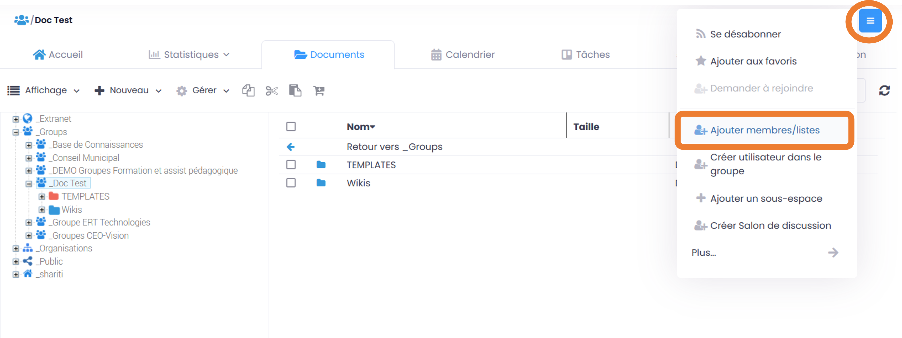

Le formulaire d'ajout d'un membre s'ouvre et il faut commencer à rentrer le nom de la liste (au moins 3 caractères) pour avoir des suggestions. 

.. figure:: media-guide/Ecran-GoFAST_Liste-Utilisateurs_ajouter-liste-dans-espace-collaboratif-formulaire.png	
   :alt: 

.. NOTE:: 
   Pour ajouter une liste d'utilisateurs comme membre d'un espace, il faut être administrateur de l'espace. 

.. NOTE:: 
   Le rôle attribué à chaque utilisateur dans l'Espace Collaboratif et celui coché lors de l'ajout de la liste. Si l'utilisateur est membre d'un espace de plusieurs façons (Listes + directement via son profile), c'est le rôle qui offre le plus de privilège qui s'appliquera. De cette façon, on évite de restreindre les droits d'un utilisateur qui serait déjà membre de l'Espace Collaboratif.
   
Une fois la liste ajoutée à l'Espace Collaboratif, celle-ci est affichée parmi les autres membres. 

.. figure:: media-guide/Ecran-GoFAST_Liste-Utilisateurs_liste-dans-espace-collaboratif.png	
   :alt: 

Les Espaces Collaboratifs dont est membre la liste sont affichés sur la page de la liste, onglet "Emplacements". 

Afficher/Rechercher les listes d'utilisateurs
---------------------------------------------

Annuaire des Liste d'Utilisateurs
~~~~~~~~~~~~~~~~~~~~~~~~~~~~~~~~~
Pour consulter les listes existantes, il suffit de passer par les annuaires accessibles depuis le menu principal. 

   
Pour aller sur un liste depuis l'annuaire, vous pouvez cliquer sur le nom de la liste. Vous pourrez alors consulter les membres et les emplacements de celle-ci. 

Rechercher une Liste d'Utilisateurs
~~~~~~~~~~~~~~~~~~~~~~~~~~~~~~~~~~

Les listes d'utilisateurs sont recherchables via la moteur de recherche et peuvent être utilisées comme "filtre de format".

.. figure:: media-guide/Ecran-GoFAST_Liste-Utilisateurs_rechercher-liste.png	
   :alt: 
   
.. NOTE:: 
   Les listes dont fait partie un utilisateur sont affichées sur sa page de profile. 

   

Gestion des abonnements
=======================

Un abonnement permet de **rester au courant** de ce qu’il se passe dans
un groupe ou sur un document ; ce qui veut dire qu’ à chaque fois qu’il
y aura une activité dans ce groupe ou sur ce document, vous recevrez une
notification par mail, dont vous pouvez choisir l’intervalle (2x/jour,
1x/jour, 1x/semaine, …).

Vous pouvez accéder à vos abonnements à partir de votre nom et les gérer
comme vous le souhaitez

.. figure:: media-guide/image317.png
   :alt: 

Si au contraire, vous voyez que vous recevez **trop de notifications**
par rapport à un groupe où vous n’êtes pas très actif et qui ne vous
intéresse pas davantage, vous pouvez vous désabonner ou choisir un
intervalle hebdomadaire par exemple. Vous ne recevrez alors qu’un mail
par semaine qui vous indiquera ce qu’il s’est passé sur ce document ou
dans ce groupe.

Pour vous **abonner à un document**, allez sur la prévisualisation du
document et cliquez sur le dernier icône avec les 3 barres horizontales,
à côté du titre. Une liste de fonctionnalités s’ouvre, choisissez
« s’abonner ».

.. figure:: media-guide/image318.png
   :alt: 

(cfr : Gestion de groupe/ « S’abonner à un groupe » p.66 et Gestion de
documents/« Actions contextuelles »/ « S’abonner au document » p.100 )

Workflows : Processus de Tâches (Enterprise only)
=================================================
   
Dans cette partie de la documentation vous trouverez comment consulter les processus en cours/archivés, les tâches à traiter, mais aussi comment démarrer un processus de tâches parmi la liste des processus disponibles, sur un ou plusieurs documents en les attribuant à des utilisateurs GoFAST (y compris vous-même).

.. NOTE::
    GoFAST propose dans tous les cas au moins un workflow de "Diffusion de Document(s)" qui permet d’assigner des tâches essentielles de manière très flexible, pour répondre à la majorité des besoins de vérification, correction, validation et signature des documents.
    
.. NOTE::
    Il est aussi possible de modéliser des processus spécifiques simples ou avancés et dans ce cas, leur fonctionnement et les formulaires associés peuvent ne pas correspondre à certaines parties de cette documentation. Pour savoir comment modéliser un workflow spécifique, merci de vous tourner vers les forums GoFAST (https://community.ceo-vision.com/). 
    

1. Démarrer un processus de tâches
----------------------------------

GoFAST propose deux façons de lancer un workflow : 

- Depuis le menu principale, via l’accès rapide aux "Processus et Tâches"
- Depuis la page d’un document, via le bouton "Processus et Tâches" 

Dans les deux cas, l'icône représentant les workflows est :

.. figure:: media-guide/Ecran-GoFAST_Workflows_icone-processus-et-taches.png
   :alt:

Demarrer un processus depuis le menu pricnipal
~~~~~~~~~~~~~~~~~~~~~~~~~~~~~~~~~~~~~~~~~~~~~~

Pour sélectionner un processus et le démarrer depuis le menu principal de GoFAST :

- Cliquez sur l’icône "Processus et Tâches" qui se trouve tout en haut de la page sur la gauche, 
- Dans la fenêtre qui s’affiche (la liste des tâches en cours), cliquez sur "Nouveau" pour avoir la possibilité de démarrer soit un "Nouveau processus", soit un "Nouveau processus depuis les documents du panier",

.. figure:: media-guide/Ecran-GoFAST_Workflows_lancer-processus-depuis-menu-principal-acces-rapide.png
   :alt:

- Une liste des processus disponibles vous sera proposée
- Cliquer sur le nom du processus souhaité ou sur l’icône ">" 

.. figure:: media-guide/Ecran-GoFAST_Workflows_choix-processus.png
   :alt:

.. NOTE::
    En lançant un processus depuis le menu principal, le formulaire du processus n'intégre pas de document et il faut donc le(s) ajouter directement depuis ce formulaire (hors dans le cas d'un éventuel processus spécifique ayant un autre fonctionnement). 
    
.. NOTE::
   En lançant un processus depuis le menu principal sur les documents du "panier documentaire", ces derniers sont automatiquement associés au processus. Vous avez ensuite la possibilité d'enlever/ajouter les documents dans le formulaire du workflow.

Démarrer un processus depuis la page d'un document
~~~~~~~~~~~~~~~~~~~~~~~~~~~~~~~~~~~~~~~~~~~~~~~~~~~~~

Pour sélectionner un processus et le démarrer depuis la page d’un document :

- Cliquez sur l’icône "Processus et Tâches" qui se trouve en haut à droite de l’aperçu du document, 

- Une liste des processus disponibles vous sera proposée
- Cliquer sur le nom du processus souhaité ou sur l’icône ">"
   
.. figure:: media-guide/Ecran-GoFAST_Workflows_choix-processus.png
   :alt:

.. NOTE::
    En lançant un processus directement depuis la page du document, ce dernier est automatiquement associé au workflow dans le formulaire. 

Renseigner le formulaire du processus de tâches pour le démarrer  
~~~~~~~~~~~~~~~~~~~~~~~~~~~~~~~~~~~~~~~~~~~~~~~~~~~~~~~~~~~~~~~~
Une fois que le processus souhaité est sélectionné, le formulaire associé s’ouvre et vous permet de renseigner les diverses informations nécessaires. 

Le formulaire proposé et donc les champs à renseigner, sont totalement dépendants du processus choisi. 

.. figure:: media-guide/Ecran-GoFAST_Workflows_formulaire-processus-standard.png
   :alt:

**Focus sur les champs "Document(s)" et "Assignation(s)" du formulaire :** 
  Dans le cas du processus standard GoFAST, parmi les champs proposés il y a les documents associés et les personnes à assigner. 
  
  Pour correctement renseigner ces champs, il est nécessaire de commencer à rentrer le nom du document ou d’un utilisateur (minimum 3 caractères), puis cliquer sur la suggestion pour valider son choix. 
  
  Que ce soit pour les documents ou les assignations, vous avez la possibilité de cliquer sur "+" pour ajouter des champs supplémentaires, ou sur la corbeille pour en enlever. 

Enfin, pour lancer le processus et les notifications associées, il suffit de cliquer sur "Envoyer" (en bas du formulaire).

2. Etre notifié et consulter ses tâches à traiter et/ou assignées aux autres
----------------------------------------------------------------------------

Notifications des workflows envoyées par e-mail 
~~~~~~~~~~~~~~~~~~~~~~~~~~~~~~~~~~~~~~~~~~~~~~~

.. NOTE::
   Les notifications sont dépendantes du processus lancé. Par exemple, dans le cas d’un processus spécifique il est possible que le contenu des notifications et leur fréquence soient fortement adaptées aux équipes métier concernés. 
   Le descriptif ci-après est donc basé sur le fonctionnement du processus standard disponible dans GoFAST. 

A chaque démarrage du processus, les personnes assignées sont notifiées et c’est aussi le cas à chaque fois qu’une étape est traitée. 

.. figure:: media-guide/Ecran-GoFAST_Workflows_notification-email-processus-tache-traitee.png	
   :alt:

**Les notifications indiquent donc :** 
   - le type de processus lancé et le nom spécifique renseigné par l’initiateur,
   - l’initiateur du processus, 
   - la tâche qu’on a à traiter et les autres tâches du processus (avec état de la tâche),
   - l’étape du processus (ex : initiation ou fin d’une tâche ou fin du processus),
   - la date de démarrage, de traitement des tâches et l’échéance,
   - titre(s) et lien(s) vers le(s) document(s) concerné(s),
   - le commentaire fait au moment du démarrage, puis ceux ajoutés lors du traitement des tâches,

.. NOTE::
   Les notifications liées aux workflows et envoyées par email ne sont pas configurables par les utilisateurs car elles sont directement dépendantes du processus lancé. Il n’est donc pas possible de se désabonner de ces notifications ou de changer leur fréquence. 

Liste des tâches à traiter et tâches assignées aux autres
~~~~~~~~~~~~~~~~~~~~~~~~~~~~~~~~~~~~~~~~~~~~~~~~~~~~~~~~~

En complément des notifications envoyées par e-mail, chaque utilisateur a la possibilité de consulter la liste des tâches qu’il a à traiter, ainsi que les tâches qu’il a assignées à d’autres. Les utilisateurs sont également informés lorsqu'un document qu'ils consultent est associé à un processus. 

**Dans le menu principal :** un numéro apparait sur l'icône "Processus et Taches" indiquant le nombre de tâche qu'on a à traiter.

.. figure:: media-guide/Ecran-GoFAST_Workflows_consulter-processus-depuis-menu-principal.png	
   :alt:

**Sur la page d'un document :** l'icône "Processus et Tâches" est rouge dès lors qu'un processus en cours y est associé, précisant le nombre de tâche. Si aucun processus n'est en cours, l'icône reste grise.

**Pour afficher la liste de tâches :** il suffit de cliquer sur l’icône "Processus et Tâches" (que ce soit depuis le menu ou la page d'un document).

.. figure:: media-guide/Ecran-GoFAST_Workflows_liste-taches-dans-menu-principal-acces-rapide.png
   :alt:

Vous avez alors un onglet distinct pour les tâches à traiter et un autre pour les tâches assignées à d'autres utilisateurs. Dans le cas où il y a beaucoup de tâches, vous disposez d’une pagination. 

**Cette vue permet de consulter en un clin d’œil les informations clefs :** 
   - type et nom du processus
   - le(s) document(s) concerné(s)
   - date de démarrage et échéance 
   - l’initiateur du processus 

**Les actions possibles depuis cette liste des tâches :** 
   - Aller sur la page de(s) document(s) du processus en cliquant sur le titre du document,
   - Consulter l’historique du processus du processus en cours en cliquant sur l’icône "i",
   - Effectuer sa tâche et consulter l’historique du processus en cours en cliquant sur l’icône ">"

.. figure:: media-guide/Ecran-GoFAST_Workflows_details-tache-dans-menu-principal-acces-rapide.png
   :alt:

Traiter ses tâches
~~~~~~~~~~~~~~~~~~
Depuis la liste des tâches à traiter, il suffit de cliquer sur l'icône ">" pour ouvrir le formulaire et indiquer qu'on a effectué sa tâche. 

.. figure:: media-guide/Ecran-GoFAST_Workflows_formulaire-traiter-sa-tache.png	
   :alt:

Cliquez sur "Envoyer" (ou autre selon la tâche qui nous a été assignée) pour enregistrer le traitement de la tâche. 

.. NOTE:: 
   Selon le processus, il est possible de laisser un commentaire (ex : processus standard GoFAST). Celui-ci est vivement conseillé pour favoriser le travail collaboratif.

3. Historique des tâches et processus en cours et archivés
----------------------------------------------------------

Que ce soit pour les processus en cours ou archivés, vous avez la possibilité de consulter les détails des étapes et commentaires faits. 

**Cet historique est accessible :**
   - via le menu principal
   - depuis la page d’un document

.. figure:: media-guide/Ecran-GoFAST_Workflows_acces-aux-processus-et-taches.png	
   :alt:   

Historique des processus en cours 
~~~~~~~~~~~~~~~~~~~~~~~~~~~~~~~~~~
  
Pour consulter l'historique des actions dans un processus en cours, il suffit de cliquer sur l’icône "i" ou ">" au niveau d'une tâche : 
   
.. figure:: media-guide/Ecran-GoFAST_Workflows_details-tache-ouvrir-formulaire-historique.png	
   :alt:      

   - le ">" s'affiche uniquement s'il s'agit d'une tâche qui nous a été assignée (permet d'ouvrir le formulaire pour effectuer sa tâche et de voir l'historique des tâches précédentes),
   - le "i" permet de consulter l'historique depuis une tâche assignée à quelqu'un d'autre (ou bien à soi-même, si on ne souhaite pas ouvrir le formulaire).

.. figure:: media-guide/Ecran-GoFAST_Workflows_processus-en-cours-historique.png	
   :alt:

Historique des processus archivés 
~~~~~~~~~~~~~~~~~~~~~~~~~~~~~~~~~

Pour consulter la liste des processus archivés associés à un document, rendez-vous sur la page du dit document et cliquez sur l’icône "Processus et Tâches". 

   
Une fois la fenêtre des Processus et Tâches ouverte, il faut aller dans l’onglet "Historique". Cette onglet affiche la liste de tous les processus archivés associés au document. 

.. figure:: media-guide/Ecran-GoFAST_Workflows_processus-archive-acces-historique.png	
   :alt:
  
Pour consulter les détails d'un processus archivé, il suffit de cliquer sur l’icône "i" au niveau du processus. 

.. figure:: media-guide/Ecran-GoFAST_Workflows_processus-archive-historique.png	
   :alt:

Forums de discussion
===================

Le forum général pour tous les utilisateurs de la GoFAST permet
d’échanger des informations et questions sur l’outil et sur son
utilisation.

C’est à ce niveau notamment que vous allez retrouver la vidéo
d’introduction de la GoFAST (version 2.0), les tutoriels, les guides
d’utilisation, les guides de gestion documentaire, …

Vous pourrez y posez des questions générales et chacun pourra y
répondre. De même, l’administrateur général peut vous donner des trucs
et astuces via ce canal également.

Vous pouvez d’ailleurs vous abonner à ce forum si vous voulez rester au
courant de tout ce qu’il s’y passe.

   
Chat/Messagerie instantanée (Enterprise only)
==================================
   
   
.. NOTE:: Nous parlons ici de la version dans le navigateur du Chat, vous pouvez également recevoir les messages avec votre smartphone (voir Utilisation Avancée)

Pour **ouvrir le chat**, il faut aller sur l’extrême droite de l’écran,
cliquer sur la barre verticale grise.

.. figure:: media-guide/image336.png
   :alt: 

Vous pouvez ainsi voir la liste des personnes qui font partie des mêmes
groupes que vous et qui sont, en ce moment, en ligne (boule verte sur la
photo) ou absents (boule orange sur la photo).

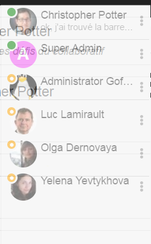

Vous pouvez choisir votre **statut** sur le chat en cliquant sur le
statut actuel à côté de votre photo, vous verrez ainsi une liste
apparaître, cliquez sur votre choix pour le changer.

Vous verrez si vous avez un **nouveau message dans le chat** grâce à un
petit numéro qui « saute » à côté de votre statut. Mais ce message peut
être une pop up, pas nécessairement un message d’un utilisateur.

.. figure:: media-guide/image339.png
   :alt: 

Vous voyez aussi si vous avez un **message sur le chat** avec un petit
carré qui clignote dans le coin droit inférieur de l’écran ou avec une
pop-up si vous n’êtes pas sur l’écran GoFAST

   

.. figure:: media-guide/image341.png
   :alt: 

Ou d’une manière plus générale, vous verrez aussi un numéro sur l’onglet
de votre page URL vous indiquant que vous avez un nouveau message (mail
ou chat)

.. figure:: media-guide/image403.png
   :alt: 

Vous pouvez alors **commencer la discussion**.

Les petits « v » en fin de message confirment que votre interlocuteur a
reçu le message.

Vous pouvez remonter dans l’historique de la conversation en faisant
glisser la barre grise sur la droite

.. figure:: media-guide/image343.png
   :alt: 

Si vous cliquez sur les 3 points verticaux à côté du nom du contact,
vous voyez 3 propositions : renommer, montrer info, supprimer contact .

Voici un exemple de ce qui apparaît si vous choisissez « Montrer les
informations »

Dans le coin droit en bas, à côté de votre profil du chat « en ligne » ,
l’icône avec les **3 barres horizontales ouvre plusieurs
fonctionnalités** comme : les réglages du chat, le son, à propos des
contacts, …

.. figure:: media-guide/image346.png
   :alt: 

a) Voici la page qui s’ouvre si vous choisissez « \ **Réglages** », vous
   pouvez y régler vos options d’identification, les priorités, la copie
   carbone, le message history, les notifications de compositions, etc.

Il y a déjà des données enregistrées par défaut.

.. figure:: media-guide/image348.png
   :alt: 

b) Si vous voulez ajouter un contact au chat , appuyez sur « \ **Ajouter
   un contact** » ; une fenêtre s’ouvre où vous pouvez ajouter un nom et
   un pseudo. Terminez avec « Ajouter ».

.. figure:: media-guide/image349.png
   :alt:
   
.. figure:: media-guide/image350.png
   :alt:

c) L’ « \ **Aide en ligne** » vous amène à un site externe avec des
   explications et des démos

.. figure:: media-guide/image352.png
   :alt: 

d) Pour **rejoindre une discussion** en cours, appuyez sur « Joindre la
   discussion »

.. figure:: media-guide/image353.png
   :alt: 

Une fenêtre s’ouvre avec les propositions de discussions existantes,
sélectionnez celle que vous voulez joindre et appuyez sur « Continuer ».

.. figure:: media-guide/image354.png
   :alt: 

« Salon » étant le « forum/la chatroom »

Si l’encadrement devient rouge, ce n’est pas une discussion, s’il
devient vert, vous pouvez continuer. Vous verrez une connexion s’activer
sur le coin droit supérieur.

.. figure:: media-guide/image355.png
   :alt: 

Lorsqu’une conversation dans le chat est en cours, avec un ou plusieurs
interlocuteurs, vous voyez leur nom apparaître dans une petite fenêtre
dans le bas de l’écran.

Vous pouvez ainsi voir leur message et y répondre.

Si vous voulez démarrer une **vidéoconférence,** appuyez sur la petite
caméra à côté du nom de la personne en ligne. Elle sera blanche si vous
et votre interlocuteur avez les accessoires nécessaires pour une
vidéoconférence, elle sera barrée si ce n’est pas le cas.

.. figure:: media-guide/image358.png
   :alt: 

.. figure:: media-guide/image404.png
   :alt: 

Si vous voulez terminer la conversation dans le chat, appuyez sur la
petite croix à côté du nom de l’interlocuteur.

L’icône des 3 points verticaux à côté du nom de l’interlocuteur ouvre
une petite fenêtre où vous pouvez effacer l’historique de cette
conversation avec cet interlocuteur.

Pour **refermer la barre du chat,** et ne plus voir du tout les autres
utilisateurs en ligne, il suffit de réappuyer sur la barre grise
verticale.

.. figure:: media-guide/image361.png
   :alt: 

.. image:: media-guide/Tag-Enterprise.png
   :align: right
   :scale: 7%
   
Messages internes
=================

D’une manière générale, vous verrez un **numéro** sur l’onglet de votre
page URL vous indiquant que vous avez un nouveau message (mail ou chat)

.. figure:: media-guide/image324.png
   :alt: 

Lire ses messages et y répondre
-------------------------------

Lorsque vous apercevez un numéro rouge sur le logo GoFAST, dans le coin
en haut à gauche, à côté de l’adresse GoFAST, cela veut aussi dire que
vous avez un ou plusieurs **nouveaux messages (**\ par email). Cliquez
sur ce numéro ou sur le message en vert (« You have 1 unread message »)
pour voir la liste des messages reçus.

.. figure:: media-guide/image325.png
   :alt: 

a) **Voici ce que vous verrez si vous appuyez sur le message vert**

    Vous voyez le titre du message reçu, l’expéditeur, la date et heure
    de l’envoi et si c’est un nouveau message (« NOUVEAU » en bleu à
    côté du titre)

    Pour supprimer des messages, sélectionnez les en cochant les cases
    devant chacun et appuyez sur « Supprimer » (en rouge)

    .. figure:: media-guide/image326.png
       :alt: 

    Vous pouvez aussi choisir une action comme « Marquer comme lu ou
    non-lu », en cliquant sur la flèche à droite au niveau de la ligne
    « Actions »

    .. figure:: media-guide/image327.png
       :alt: 

    Vous pouvez également trier par ordre chronologique croissant ou
    décroissant en cliquant sur la flèche au-dessus des dates et heures
    d’envoi

.. figure:: media-guide/image328.png
   :alt: 

b) **Et voici ce que vous verrez si vous appuyez sur l’enveloppe**

    Vous voyez la liste des messages, les participants (expéditeurs et
    destinataires), la date et l’heure d’envoi et la poubelle pour le
    supprimer.

.. figure:: media-guide/image329.png
   :alt: 

.. NOTE::
    Si vous cliquez sur l’enveloppe , une punaise rouge
    apparaît, ce qui fixe la fenêtre avec les messages. Pour la
    débloquer, cliquez ailleurs sur la bande noire du menu, ainsi la
    fenêtre avec la liste des messages se refermera.

.. figure:: media-guide/image330.png
       :alt: 

**Cliquez sur le titre du message pour l’ouvrir.**

Lorsque vous ouvrez le mail, vous retrouvez les informations telles que
l’expéditeur (avec sa photo), la date et l’heure de l’envoi, le message
envoyé et la possibilité d’y répondre avec les mêmes options que dans
Word. Terminez avec « Envoyer le message »

.. NOTE::
   Vous ne pouvez ni ajouter, ni supprimer un participant en
   cours de conversation, ce qui veut dire que si l’échange de mail
   commence entre 2-3 personnes, vous ne pourrez pas y ajouter/supprimer un
   participant lors de vos échanges/réponses. Il n’est donc pas possible
   non plus de transférer un message.

Le service de mails sur GoFAST ne doit pas remplacer votre boîte mail
traditionnelle (Lotus, Outlook, …) . Il est surtout utile pour converser
directement sur GoFAST entre utilisateurs sans devoir passer d’une boîte
de messagerie à une autre et de pouvoir, via la prévisualisation,
envoyer directement un document (son lien GoFAST) par mail.

(Cfr : voir « Actions contextuelles de prévisualisation d’un
document » / « Envoyer par mail » p.88)

.. figure:: media-guide/image332.png
   :alt: 

.. figure:: media-guide/image333.png
   :alt: 

Créer un nouveau message
------------------------

Pour **créer un nouveau message/Email**, allez sur l’icône de
l’enveloppe sur la barre noire supérieure. Cliquez ensuite sur « Nouveau
message » en bleu.

.. figure:: media-guide/image334.png
   :alt: 

Ecrivez les 3 premières lettres du nom de l’utilisateur à qui vous
voulez envoyer le mail (celui-ci doit être un utilisateur de la GoFAST),
et le système vous proposera une liste de noms à sélectionner.

Donnez un titre au mail et écrivez le contenu puis envoyez

.. figure:: media-guide/image335.png
   :alt: 

.. image:: media-guide/Tag-Enterprise.png
   :align: right
   :scale: 7%
   
   
Favoris et Derniers contenus vus
================================

Derniers contenus vus
~~~~~~~~~~~~~~~~~~~~~

Cette petite fenêtre visible presque sur toutes les pages, sur la droite de
l’écran, vous permet de voir les **10 derniers documents** que vous avez
consultés/ouverts, cela sert de raccourcis puisqu’il suffit de cliquer
sur le titre pour ouvrir la prévisualisation.

.. figure:: media-guide/image249.png
   :alt: 
   
Accès aux Favoris 
~~~~~~~~~~~~~~~~~
Vous pouvez voir **la liste** de vos documents/espaces/dossiers **favoris** en
cliquant sur l’\ **étoile** sur la bande noire du menu général. Une
punaise rouge y apparaîtra, ce qui fixe la fenêtre avec la liste. Pour
débloquer la liste, appuyez ailleurs sur la bande noire.

Lorsque vous ajouterez un favori à votre liste, il y aura le message en
vert sur la droite de l’écran qui vous signalera l’ajout du favori.

(Cfr : voir « Comment ajouter un favori » dans les actions contextuelles
de prévisualisation p. 95)

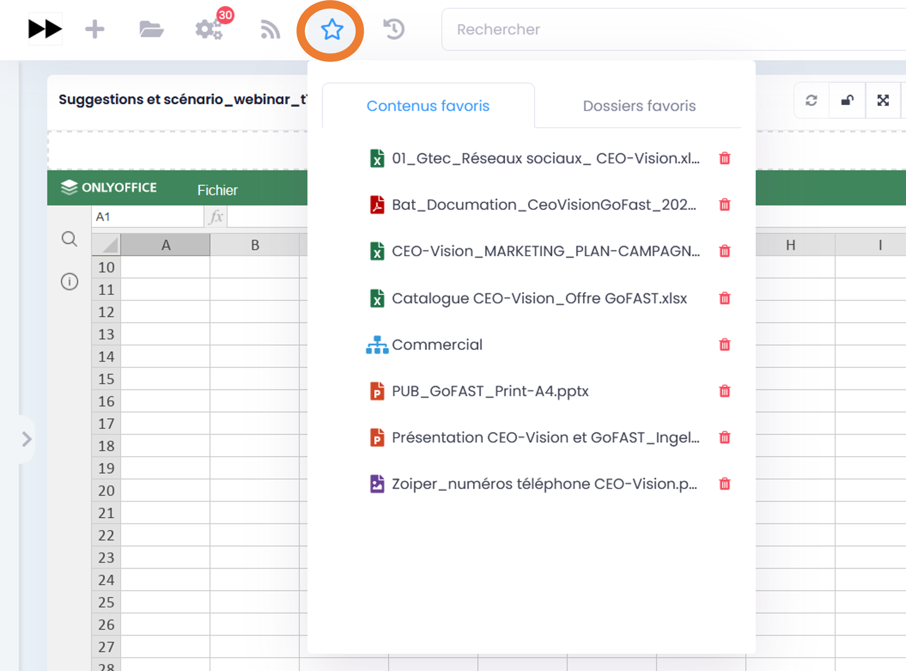

Annuaires
=========

Chercher un Espace Collaboratif
-------------------------------

Pour **rechercher des Espaces Collaboratifs via l’annuaire,** allez sur *Annuaire* dans le menu principal, puis sur Organisations, Groupes, Public ou Extranets. Vous trouverez l'arborescence des espaces existants, que vous pouvez rejoindre en cliquant dans les cases (une demande est alors envoyée aux administrateurs métier de l'Espace). 

.. figure:: media-guide/image319.png
   :alt: 
   
.. figure:: media-guide/image320.png
   :alt: 

Chercher une Liste d'utilisateurs
----------------------------------

Pour **rechercher des Listes d'utilisateurs via l’annuaire,** allez sur *Annuaire* dans le menu principal, puis sur *Listes d'utilisateurs*.

Chercher un utilisateur
-----------------------

Pour rechercher un utilisateur vous avez le choix entre tapez son nom dans la
recherche, ou passer par l’ "Annuaire" / "Utilisateurs". Vous
verrez toute la liste des utilisateurs GoFAST avec leur « carte de
visite ».

.. figure:: media-guide/image321.png
   :alt: 

Vous pouvez **filtrer** votre recherche selon les noms et l’alphabet ou
les organisations/groupes/espaces

.. figure:: media-guide/image322.png
   :alt: 

Vous pouvez directement envoyer un mail ou appeler l’utilisateur via son
profil. De même que lui envoyer une demande de « relation », ce qui
permet de contacter/voir le raccourci de cette personne même si elle ne
fait pas partie de vos espaces collaboratifs.

.. figure:: media-guide/image323.png
   :alt: 

Flux d'information
==================

Vous pouvez voir les **news** (pareil que sur l’Intranet) via ce logo
(Flux) sur la bande noire du menu.

.. figure:: media-guide/image366.png
   :alt: 

Statistics Reporting
======================

Onglet « Statistiques » dans un Espace
--------------------------------------
Chaque utilisateur à la possibilité de voir l'activité de l'Espace. Dans l'onglet **Statistiques**, vous pouvez ainsi choisir les informations que vous souhaitez retrouver graphiquement et sur une période sélectionnée. 

Deux sous-onglets vous permet de faire un reporting, les Statistiques des membres, et les Statistiques documentaires. 

a) Sous-onglet « **Statistique des membres** » permet de visualiser les infomations relatives aux membres actifs et inactifs, les nouveaux membres et membres connectés ; 

b) Sous-onglet « **Statistique documentaires** », permet de visualiser toutes les informations relatives aux documents par sa catégorie, son état et son importance ; 

Menu «**Statistics**», dans le Menu Utilisateur pour un Administrateur de plate-forme
-------------------------------------------------------------------------------------
Avec le profil "Administrateur de la plate-forme", de nouveaux sous-menus apparaissent dans votre Menu Utilisateur, comme « **Statistics** ». 

Ce menu permet à l'Administrateur de plate-forme de visualiser 3 onglets pour effectuer des Statistics Reporting : 

-  Statistiques Utilisateurs 
-  Statistiques d'Espaces
-  Statistiques Documentaires

L'onglet **Statistiques documentaires** à la fonction supplémentaire de pouvoir effectuer une liste de documents d'un espace selectionné.
Pour plus d'informations, voir le paragraphe "Exportation des listes de documents" dans le Guide Utilisateurs : http://gofast-docs.readthedocs.io/fr/latest/docs-gofast-users/doc-gofast-guide-utilisateurs.html#exportation-des-listes-de-documents 

Version mobile
======================

La plateforme GoFAST peut fonctionner également en mobilité, et est accessible depuis n'importe quel support sur smartphone ou tablette.

Nous vous proposons une version simplifiée de la plateforme pour plus de facilité d'utilisation, voici quelques exemples des écrans que vous pouvez alors retrouver dans votre poche : 

1. Le menu contextuel 
-------------------

   
   
2. Le fil d'actualité et son menu 
------------------------------

   
3. L'explorateur de fichiers / GoFAST File Browser
--------------------------------------------------

.. figure:: media-guide/Mobile-Explorateur-GFBrowser.png
   :alt:
   

4. La prévisualisation et son menu de métadonnées
------------------------------------------------

.. figure:: media-guide/Mobile-Menu-Preview.png
   :alt:

Vous pouvez alors mettre à jour une version d'un document, ou encore ajouter un commentaire 

5. Moteur de Recherche 
-------------------------

.. figure:: media-guide/Mobile-Recherche-Menu-Modified.png
   :alt:

6. Le calendrier 
-------------

.. figure:: media-guide/Mobile-Calendrier.png
   :alt:
   

Utilisation avancée (signature, mobilité, ...)
==============================================

Un guide séparé a pour but de donner les instructions de configuration
de logiciels tiers fonctionnant avec la plate-forme GoFAST démultipliant
les usages et la puissance de la plateforme

Ces outils complémentaires permettent :

-  Des outils complémentaires en mobilité
-  Une synchronisation de GoFAST avec un PC pour travailler en mode «
   déconnecté » (type DropBox)
-  L’accès à GoFAST sur les terminaux mobiles (tablettes,…) par
   explorateur de fichiers
-  La visualisation et/ou l’édition en ligne de documents Office sur
   tablette
-  La messagerie instantanée (« chat ») sur mobile
-  La vidéoconférence sur mobile (dans navigateur)

-  Des outils de dématérialisation (smartphone, copieur, ...)
-  Des outils de signature électronique

Vous trouverez ce Guide ici :
http://gofast-docs.readthedocs.io/fr/latest/docs-gofast-users/doc-gofast-utilisation-avancee.html

Annexes : Quelques bonnes pratiques
===================================

.. IMPORTANT:: 
   Même si GoFAST nécessite de changer un peu ses habitudes,
   il est important que le plus grand nombre fasse l'effort de changer. Les
   gains en temps sont ensuite très importants, tout le monde est alors
   gagnant!

**Objectif 1: Diminuer le nombre de mails entre collègues et partenaires**

-  Je n'envoie plus de mails avec pièce jointe, mais je mets un
   commentaire sur le document sur GoFAST, toutes les personnes
   recevront une notification

   -  dans de nombreux cas la pièce jointe n'est déjà plus à jour quand
      votre destinataire la recoit de plus les pièces jointes encombres
      les messageries.

-  Je n'envoie plus de mails avec pièce jointe à mes contacts n'ayant
   pas de compte GoFAST mais j'utilise la fonction "Partager par email"
-  Je n'élabore plus un document 'chacun son tour' mais utilise la co-édition OnlyOffice

   - Ceci permet de gagner du temps et limite les erreurs, évite d'avoir à fusionner les sections rédigées par chacun

-  Je n’envoie plus de demandes de tâche ou validation par mail, mais
   j’utilise les ‘’workflows’’ (processus de tâches) pour relecture,
   validation, signature, etc. => tout le monde est notifié, chacun
   connaît sa tâche et les délais sont respectés.
-  J’utilise les forums pour mes questions/réponses au lieu des mails =>
   tout le monde partage ses connaissances.

**Objectif 2: Gagner du temps dans la recherche d’information, fichiers et autres contenus**

-  La totalité des contenus (même cellules d'un tableur, ....) est
   indexé (indexation "plein-texte") et le moteur de recherche est
   considéré comme un des plus puissants
-  je gagne jusqu'à 30% de mon temps *(source IDC : 30% des cadres
   passent leur temps à rechercher des contenus dispersés et dupliquer)*

**Objectif 3 : Mettre fin aux doublons de fichiers et autres contenus**

-  Je ne garde plus de fichiers sur mon PC ou boîte mail, les documents
   sont centralisés et accessibles selon les droits d’utilisateurs.
-  Je ne copie plus jamais un document à plusieurs endroits, j'utilise
   la fonction Emplacement/Visibilité qui permet à un même document
   d'être vu dans plusieurs espaces.

   -  Quelque soit l'espace, tout le monde aura la bonne version

-  Je ne créé plus un fichier par version

   -  GoFAST versionne automatiquement et toutes les versions sont
      accessibles à tout moment.

-  J’accède à mes documents de travail en mobilité et je n’ai pas besoin
   de copie locale ou de version papier (accès Online sur Tablettes et
   Online/Offline sur PC).
-  Je partager les informations avec mes clients et fournisseurs dans
   l’Extranet GoFAST et ainsi, ils ont accès aux mêmes documents et non
   plus des doublons, qui sont rapidement obsolètes.
-  Je ne stocke plus mes documents dans la messagerie car un simple
   glisser-déposer suffit pour les transférer sur GoFAST.

**Objectif 4: Maîtriser les processus de traitement, validation et signature des documents**

-  Les processus informels ou les procédures papier souvent inefficaces,
   sont modélisés dans GoFAST => grâce à des circuits de tâches
   prédéterminés, vous retrouvez la maîtrise des divers processus
   métier.

-  Je n’ai plus à chercher les dates d’échéances dans mes mails,
   celles-ci sont clairement indiquées sur les processus et me sont
   rappelées par notification.

**Objectif 5: Diminuer le volume papier**

-  Je numérise les documents papiers (contrats, factures, courriers,
   etc.) et les envoie directement vers la plateforme GoFAST où ils
   seront indexés plein texte à la volée.
-  Je transforme les formulaires papier en documents électroniques et
   les diffuse avec efficacité (cibler un groupe, rappels automatiques
   et relance, suivi des actions, etc.) et j’exporte les données dans un
   tableur.
-  Je signe électroniquement les PDF avec certificat sécurisé plutôt que
   de les imprimer pour les signer et les re-scanner.
