Consulter un Document/Contenu et informations associées
=================================================
En plus de pouvoir consulter le document ou autre contenu, il y a plusieurs fonctionnalités telles que : actualiser l’aperçu, processus et tâches (workflow), pleine page, actions contextuelles (parcourir, modifier, télécharger…).

Accès à un Document/Contenu
---------------------------------------------------------------------------------------------------
GoFAST permet d’accéder à un document ou autre contenu par divers moyens. Dès qu’un contenu est mentionné (titre du contenu), il suffit de cliquer dessus pour arriver sur la page de consultation du contenu et des informations associés. 
**Il est possible d’accès à un document/contenu depuis :**
 - le fil d’activité
 - le tableau de bord
 - le résultat d’une recherche 
 - un lien depuis un autre document
 - accès à ces derniers contenus vus
 - accès depuis ses favoris 
 - le panier documentaire 
 - l’explorateur de fichier (double clic à faire) 
 - liste des tâches/processus sur les documents
 - le Tchat (si un lien a été partagé)

Comprendre la page d’un document/contenu
------------------------------------------------------------
Sur la page d’un document/contenu, vous pouvez le consulter et accéder à plusieurs fonctionnalités liées directement au type de contenu et à vos droits sur celui-ci.
En zone centrale, la prévisualisation de votre document vous permet de vérifier le contenu en un coup d’œil et voir si c’est le bon document.
Au-dessus de la prévisualisation, il y a le titre du document et le(s) emplacement(s) où se trouve le document dans l’arborescence.
A droite, se trouvent toutes les informations (métadonnées) liées au document : type, format, catégorie, état, langue, emplacement(s), historique, versions, etc.

.. figure:: media-guide/image129.png
   :alt: 

Vous pouvez déplier le bloc caché de gauche (accès rapide à l’explorateur de fichiers sans quitter la page du document), pour voir les autres documents qui se trouvent dans ce même emplacement.

Vous pouvez accéder aux fonctionnalités liées au document via le menu « Burger » (menu des actions contextuelles : 3 barres horizontales, dans le coin droit au-dessus de la prévisualisation).

.. figure:: media-guide/image375.png
   :alt: 

Pour avoir la liste des diverses actions possible depuis ce menu, merci de vous référer à la rubrique : « Menu des actions contextuelles Menu Burger »

.. figure:: media-guide/image130.png
   :alt: 

Zone de prévisualisation/Aperçu (dont titre +)
~~~~~~~~~~~~~~~~~~~~~~~~~~~~~~~~~~~~~~~

La prévisualisation d'un fichier sert à consulter le fichier (document, image, vidéo...) directement dans le navigateur, sans avoir à l'ouvrir en édition avec une application sur son poste de travail ou le Suite Collaborative intégrée.

.. NOTE:: Certains types de fichiers (MS-Office ou LibreOffice), sont affiché au format PDF dans cette zone de prévisualisation. La transformation à la volé des formats MS-Office vers PDF est effectuée par un système de Libreoffice (Community) ou d’OnlyOffice (Enterprise) GoFAST. Attention, le document lui-même ne change pas de format, cette transformation à la volé n’est utile que pour la prévisualisation. Les fichiers tableurs sont eux affiché soit en PDF, soit directement via OnlyOffice (selon la configuration de votre plateforme).  

**Les principaux formats prévisualisés :**

.. csv-table::  
   :header: "Formats", "Commentaires"
   :widths: 10, 40
   
   "doc,dot,xls,ppt", "transformé en PDF" 
   "docx,dotx,xlsx,pptx","transformé en PDF"
   "odt,ott,ods,odp","transformé en PDF"
   "txt,rtf","transformé en PDF"
   "eps","transformé en PDF"
   "msg","transformé text brut puis PDF"
   "eml","transformé en PDF"
   "jpg,png,gif","directement affiché par le navigateur"
   "svg","directement affiché par le navigateur"
   "mp4","directement lu dans le navigateur (streaming video)"
   "pdf","directement lu dans le navigateur"

.. NOTE::
   Il se peut que la prévisualisation ne s’ouvre pas directement.
Il faudra juste actualiser la page (cela arrive si la connexion internet est de mauvaise qualité/instable). 

Au-dessus de la **prévisualisation** du document, vous voyez une **barre
d’outils**. 
Celle-ci permet certaines fonctionnalités comme la loupe, le zoom, page suivante, etc.

.. figure:: media-guide/image377.png
   :alt: 

La première icône (carré gris) « **Toggle sidebar** », permet de voir les « slides/pages » que comprend le document. Vous pouvez ainsi aller directement sur la page souhaitée. Ce même icône donne accès à 3 autres options **« Show thumbnails », « Show document outline », « Show attachment »**

.. figure:: media-guide/image378.png
   :alt: 

La **loupe** permet de rechercher un mot dans le texte (= Ctrl+F)

.. figure:: media-guide/image379.png
   :alt: 

Les **flèches** vers le haut ou vers le bas permettent d’aller à la page précédente ou suivante

.. figure:: media-guide/image380.png
   :alt: 

«**Page**» et les numéros permettent de voir combien de pages comprend le document et vous pouvez changer le numéro pour atteindre la page souhaitée.

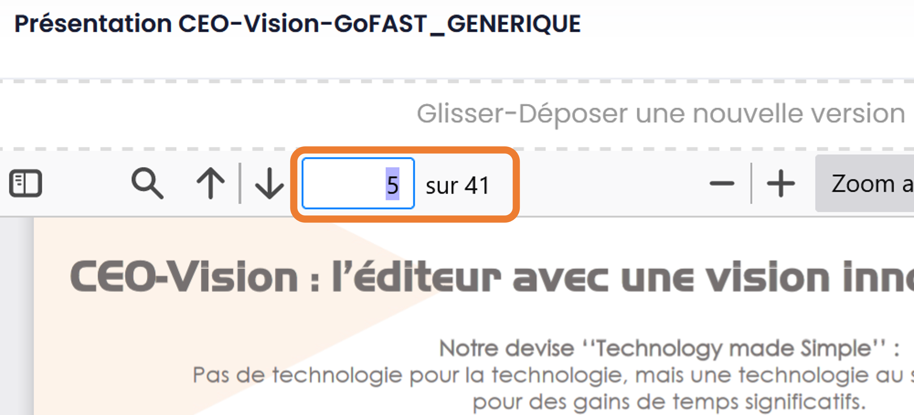

Le **« -»  et le « + »** permettent de zoomer. Et l’ « \ **Automatic zoom** » vous donne des dimensions prédéfinies.

.. figure:: media-guide/image382.png
   :alt: 

L’icône « imprimante » permet de **télécharger** le document en PDF. Vous retrouverez le lien pour l’ouvrir dans le coin inférieur gauche de votre écran ou en haut à droite de votre navigateur (selon le navigateur utilisé). Par défaut Windows classe les fichiers téléchargés dans le dossier « Téléchargements » (de votre PC).    

Et enfin, la dernière icône avec les 2 flèches vers la droite ouvre d’autres options, dont « **Enable hand tool** », la petite main qui permet notamment de monter/descendre dans un PDF sans utiliser le curseur.

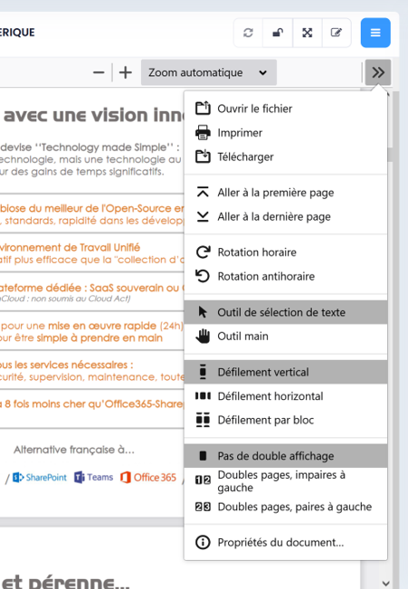

Afficher le contenu en pleine page
~~~~~~~~~~~~~~~~~~~~~~~~~~~~~~~~~~

Permet de **masquer** toutes les données autour de la prévisualisation et n’avoir plus que la page du document en plein écran.

.. figure:: media-guide/image133.png
   :alt: 

Pour revenir à la prévisualisation normale avec les infos, il suffira d’appuyer sur le logo à 2 flèches. 

.. figure:: media-guide/image134.png
   :alt: 

Actualiser la prévisualisation
~~~~~~~~~~~~~~~~~~~~~~~~

Permet de **rafraîchir la prévisualisation** pour la mettre à jour après l’édition du document (ex. Si vous consultez un document alors qu’il est en cours d’édition par un autre utilisateur et après qu’il ait sauvegardé ses modifications).

.. figure:: media-guide/image131.png
   :alt: 

Zone pour glisser-déposer nouvelle version
~~~~~~~~~~~~~~~~~~~~~~~~~~~~~~~~~~~~

.. figure:: media-guide/image153.png
   :alt:
   
Le fait de **glisser une nouvelle version** de votre document à cet endroit (au-dessus de la prévisualisation) va écraser la précédente version, mais conservera dans tous les cas toutes les anciennes versions (accessible via l’onglet « versions »).

Le système vous demandera alors si vous voulez qu’elle devienne une version majeure (ex. passer de 1.24 à 2.0). A ce moment-là, vous pouvez également ajouter un commentaire lié à cette nouvelle version majeure. 

Les autres versions faites lors de l’édition et de l’enregistrement via une application de son PC ou la Suite Office Collaborative sont considérées mineures.

Terminez en cliquant sur « Valider »

.. figure:: media-guide/image154.png
   :alt: 

Vous pouvez retrouver le numéro et la date, avec le contributeur de cette dernière version, à droite des métadonnées (bloc d’informations).

.. NOTE::
    Vous ne pouvez glisser/coller que des documents de même format, ce qui veut dire que vous ne pouvez pas remplacer une version avec une extension « doc » par une version « docx » et vice-versa.
Autrement, voici le message d’erreur que vous aurez :

.. figure:: media-guide/image155.png
   :alt: 

Si vous chargez une nouvelle version, mais que le nom du fichier est différent, vous aurez ce message (mais vous ne serez pas bloqué) :

.. figure:: media-guide/image156.png
   :alt: 

Bloc d’informations (onglets : informations, Tâches, Commentaires, Versions, Audit)
~~~~~~~~~~~~~~~~~~~~~~~~~~~~~~~~~~~~~~~~~~~~~~~~~~~~~~~~~~~~~~~~~~~~~
Sur la page d’un document/contenu, vous avez un bloc de métadonnées et autres éléments associé au document (à droite de votre prévisualisation). Ce bloc est constitué de différents onglets :

**Informations**

Sur la page du document, vous disposez de diverses informations relatives au document/contenu : type de document, taille, format, catégorie, auteur, langue, version, emplacement, etc

Ces informations sont très utiles lors de la recherche automatique car elles vous permettront de filtrer davantage vos résultats.

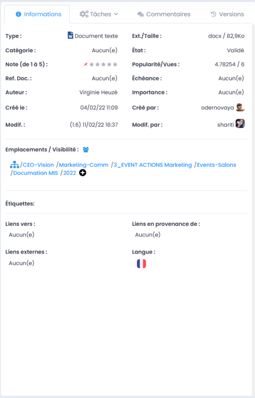

Liste des métadonnées standards GoFAST : 
 - Type de fichier (selon le format, ex : texte, présentation, tableur, image…)
 - Extension de fichier (ex : docx, xlsx, odt, png, mp4…)
 - Taille du fichier 
 - Catégories de document (ex. Facture, Rapport, Contrat, Documentation…) 
 - Etat (ex : brouillon, en cours, en attente de validation, terminé…) 
 - Note (de 1 à 5 avec un unique vote par utilisateur) 
 - Popularité (dépende des consultations et actions récentes sur le document) 
 - Référence documentaire  
 - Échéance
 - Auteur (différent du créateur : donnée libre ou récupérée depuis le fichier) 
 - Importance (dont classification selon niveau de confidentialité). 
 - Date de création du document (piste d’audit)
 - Créateur du document (piste d’audit) 
 - Date de modification du document avec numéro de version (piste d’audit et gestion des versions) 
 - Modifié par (utilisateur à l’origine de la dernière version du document) 
 - Emplacements/Visibilité (renvoi vers le multi-emplacement)
 - Etiquettes (mots-clefs à ajouter librement)
 - Contenus liés (liens vers/en prévenance de, liens externes)
 - Langues

Ces métadonnées sont en grande partie utilisées comme filtres du résultat de recherche (après avoir effectué une recherche par mots-clefs). 

Pour en savoir plus sur l’utilisation des métadonnées, merci de bien vouloir vous référer à la rubrique : « Ajouter/Modifier les informations d’un document (métadonnées) »

**Tâches**

Permet de **consulter ou d’assigner une tâche de processus** à un autre utilisateur sur le document : demander une contribution, une validation… Ou de voir quelles sont les tâches qui vous sont attribuées sur le document\ **.(= To Do)**

Pour en savoir plus sur l’utilisation des tâches de processus, merci de bien vouloir vous référer à la rubrique : « Processus de Tâches-Workflows (Entreprise Olny)»

**Commentaires**

Permet de consulter les divers commentaires laissés par les utilisateurs ayant accès au document ou de partager un nouveau commentaire sur le document, qui sera donc visible par les membres du/des Espace(s) où se trouve le document, dès qu’ils arriveront sur la page.

Pour en savoir plus sur l’utilisation des commentaires, merci de bien vouloir vous référer à la rubrique : « Commenter un document »

**Versions**

GoFAST permet de sauvegarder chaque nouvelle version d’un document après édition, avec un numéro de version, l’horodatage et l’identité de l’utilisateur contributeur. 
Pour plus d’information sur la gestion des versions, merci de vous référer aux rubriques : 
 - Gestionnaire de versions de document
 - Charger nouvelle version
 - Définir comme version majeure
 - Supprimer les versions mineures

**Audit**

GoFAST offre de très nombreuses pistes d’audit sur les actions réalisées sur les documents pour des questions de sécurité et de contrôle des données. 
L’audit n’est accessible que pas les utilisateurs ayant le profil "support-utilisateurs", sur la page d’un document (dernier onglet du bloc d’information), ou depuis la page Audit accessible via le menu principal de gauche. 
Pour en savoir plus, merci de vous référer à la rubrique : « Profil Support-Utilisateurs ». 

Accès direct à l’édition collaborative 
~~~~~~~~~~~~~~~~~~~~~~~~~~~~~~~~~~~~~~~~~~~~~~~~~~~~~~~~~~~~~~~~
A dessus de la prévisualisation du document, vous trouverez l’icône « crayon » qui permet d’ouvrir un fichier office directement dans la Suite Collaborative OnlyOffice, sans passer par le menu « Burger » (menu des actions contextuelles). 
Pour en savoir plus sur l’édition d’un document, merci de vous référer à la rubrique : « éditer/coéditer un document »

Comprendre le verrou d’édition
~~~~~~~~~~~~~~~~~~~~~~~~~~~~~~~~~~~~~~~~~~~~~~~~~~~~~~~~~~~~~~~~
GoFAST dispose d’un système automatique de verrouillage d’un document lorsqu’il est en cours d’édition. Ce verrou est aussi relâché automatiquement dès lors que l’utilisateur a fermé l’application utilisée pour l’édition. 
Le verrou est rouge fermé, si le document est édité par un utilisateur via une application de son PC (ne permet pas la coédition en simultanée). 
Le verrou est rouge ouvert, si le document est édité par un ou plusieurs utilisateur(s) via la Suite Office Collaborative de GoFAST OnlyOffice (cela permet alors la coédition en simultanée et vous pouvez rejoindre cette coédition dans OnlyOffice).
Pour en savoir plus sur l’édition d’un document, merci de vous référer à la rubrique : « éditer/coéditer un document »

Menu des actions contextuelles "Menu Burger"
~~~~~~~~~~~~~~~~~~~~~~~~~~~~~~~~~~~~~~

**Liste des actions disponibles dans le menu "Burger" (dépend de vos droits sur le document) :**

 - Ouvrir l’emplacement du document 
 - Co-éditer avec OnlyOffice (renvoi vers éditer un document)
 - Editer depuis PC (renvoi vers éditer un document)
 - Nouveau Commentaire (renvoi ver Travail Collaboratif sur les documents)
 - Partager/ Modifier les emplacements (renvoi ver Travail Collaboratif sur les documents)
 - Partager le document par mail (renvoi ver Travail Collaboratif sur les documents)
 - Télécharger le document
 - Permalien 
 - Créer depuis modèle (renvoi vers créer un document)
 - Créer une publication
 - Renommer un document
 - Modifier le Résumé
 - Supprimer
 - Gérer les traductions 
 - Charger nouvelle version
 - Définir comme version majeure
 - Supprimer les versions mineures 
 - Comparer deux versions 
 - Ajouter aux favoris (renvoi vers Tableau de Bord d’Accueil)
 - Ajouter aux favoris d’Espace
 - Ajouter au panier (renvoi vers panier)
 - Epingler ce contenu (renvoi vers fil d’activité) 
 - S’abonner (renvoi vers gérer ses abonnements) 
 - Autre actions possibles (renvoi vers les modifier les autres types de contenus + modules additionnels)

Pour en savoir plus sur ces actions, merci de vous référer à la rubrique : « Actions sur un document/contenu »)

Gestion Collaborative des Documents / Contenus
========================================

Actions sur un document/contenu (Cf. Menu "Burger")
-------------------------------------------------------------------------------------------

Ce sont toutes les **actions qu’on peut faire avec /sur ce document** : parcourir, télécharger, éditer en ligne/modifier, nouveau commentaire, envoyer par mail, gérer les traductions, créer une publication, …

Ces actions liées directement au document que vous prévisualisez, peuvent **varier selon le rôle** que vous avez dans le(s) Espace(s) où se trouve le document (administrateur, contributeur, ou en lecture seule), et selon que vous en êtes le créateur ou pas du document.

.. figure:: media-guide/image137.png
   :alt: 

Pour voir la liste des actions possibles depuis ce menu, merci de vous référer à la rubrique : « Menu des actions contextuelles Menu Burger ». Pour savoir comment effectuer les diverses actions possibles sur un document, merci de poursuivre dans cette rubrique. 

Ouvrir l’emplacement du document 
~~~~~~~~~~~~~~~~~~~~~~~~~~~~~~
Lorsque vous prévisualisez un document, vous pouvez voir le(s) emplacements de ce dernier dans l’arborescence, avec les niveaux supérieurs de dossiers et espaces.
Vous pouvez aller dans l’explorateur de fichiers à partir :

* des actions contextuelles (Menu « Burger »), en cliquant sur « Ouvrir l’emplacement du document ».
* En un clic sur les emplacements listés dans le bloc d’informations (Champ « Emplacements /Visibilité »).

.. figure:: media-guide/image195.png
   :alt: 

Vous arriverez alors sur l’explorateur de fichiers, sur la page d’un espace (onglet Documents), où retrouverez votre document dans l’arborescence.

.. figure:: media-guide/image399.png
   :alt: 

De là, vous pouvez naviguer dans l’arborescence, chercher d’autres documents, utiliser le filtre par dossier…

Co-éditer avec OnlyOffice 
~~~~~~~~~~~~~~~~~~~~~~
GoFAST apporte une dimension très innovante et vous permet d’éditer des documents Office dans un simple navigateur **avec d’autres personnes en simultané**. 
Vous pouvez ainsi travailler à plusieurs, en même temps, sur un même document.
Pour savoir comment coéditer un document, merci de vous référer à la rubrique : « Coéditer un document ». 

Editer depuis PC 
~~~~~~~~~~~~~~~~~~~~~~
Cette fonction permet **d’ouvrir un fichier pour édition/modification** via une application instalée sur son PC, sans avoir à le télécharger au préalable. 
Pour savoir comment coéditer un document, merci de vous référer à la rubrique : « Editer un document ». 

Nouveau Commentaire
~~~~~~~~~~~~~~~~~~~
Le bouton « Nouveau commentaire » permet d’ajouter un commentaire sur le document où on se trouve. Ce commentaire sera visible dans l’onglet « Commentaires » du bloc de droite et partagé avec tous les utilisateurs qui ont accès à ce document. Cela évite l’envoi d’un grand nombre d’emails et évité par la même d’envoyer des pièces-jointes d’emails. 
Pour savoir comment les commentaires d’un document, merci de vous référer à la rubrique : « Commennter un document ». 

Partager/ Modifier les emplacements
~~~~~~~~~~~~~~~~~~~~~~~~~~~~~~~
Ce bouton permet d’ouvrir la fenêtre de gestion des emplacements du document. Il s’agit d’un partage sans doublon, dans divers Espaces Collaboratifs (ou dossiers) pour pouvoir aisément collaborer avec diverses équipes et autres directions. 
Pour savoir comment ajouter/enlever des emplacements à un document, merci de vous référer à la rubrique : « Modifier les Emplacements/Visibilité ». 

Partager le document par mail
~~~~~~~~~~~~~~~~~~~~~~~~~

Via les actions contextuelles (menu « Burger ») vous pouvez **envoyer un lien sécurisé par email** d’accès (pour les utilisateurs) ou de téléchargement du document (pour les non-utilisateurs), directement depuis GoFAST. 
Il est possible de saisir comme destinataires : un utilisateur, une liste d'utilisateur, les membres d'un Espace Collaboratif ou bien une adresse email externe. 
Le lien vers le document est également automatiquement attaché à votre message.
Ce lien est contextuel : les utilisateurs ayant accès au document pourront consulter sa page avec tous les détails, alors que les non-utilisateurs auront un lien de téléchargement valable 14 jours avec accusé de téléchargement, l’audit de l’IP et horodatage.

.. NOTE:: 
   Cette méthode est nettement plus sécurisée (RGPD) et auditable que l'envoi d'un email classique avec des pièces jointes. Cela permet notamment de ne plus surcharger votre boîte de messagerie avec des pièces jointes lourdes et rapidement obsolètes (car le travail collaboratif continu sur GoFAST par vos collègues).

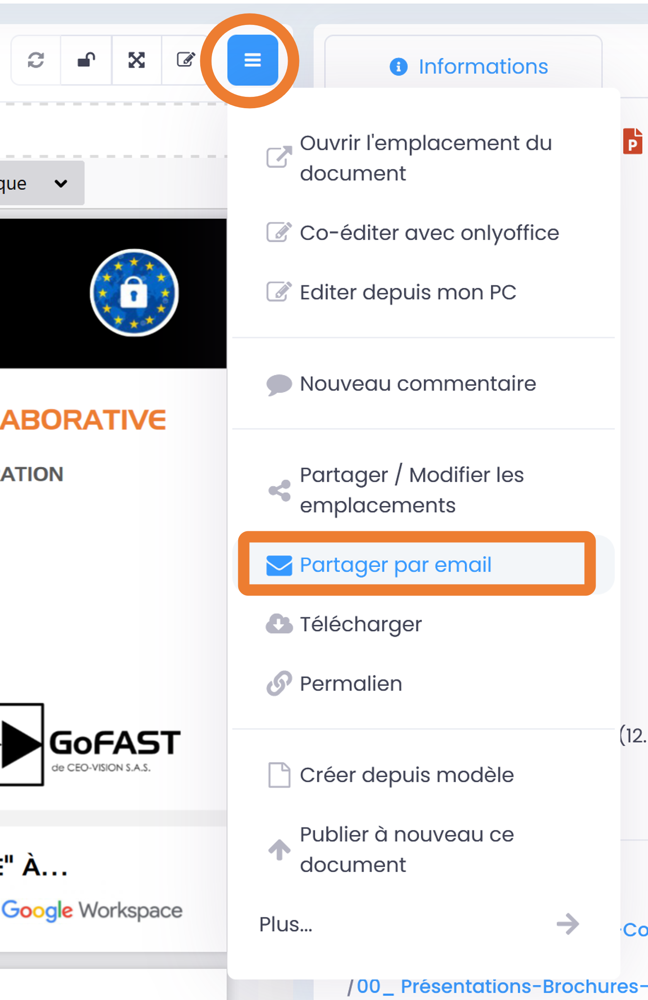

Choisissez les destinataires en écrivant les 3 premières lettres de leur nom/prénom (le système vous proposera des utilisateurs) ; leur nom et photo se retrouveront dans la barre des destinataires. 
Vous pourrez annuler des destinataires en cliquant sur la petite croix à côté de leur profil.
Le sujet est automatiquement généré, mais vous pouvez le modifier.

Ecrivez votre message et « Envoyez »

.. figure:: media-guide/image171.png
   :alt: 

Le destinataire recevra une **notification par mail** avec le lien et votre commentaire. 
Il pourra clique sur répondre à la notification et c’est l’adresse email de l’expéditeur qui sera alors chargée dans la barre destinataire de messagerie. De même pour vous, lorsque que vous recevrez un nouveau message par mail via la GoFAST.

.. NOTE::
   Pour que les non-utilisateurs de la plateforme puissent récupérer les documents, ces liens redirigent vers un page où ils pourront télécharger les documents dans un délai de 14 jours. 

**Exemple** de mail/notification reçu dans votre boîte mail normale, vous invitant à cliquer sur le lien attaché pour visualiser un document. Avec le message pour les non-utilisateurs de GoFAST (qui n’ont pas de compte GoFAST) signalant que ce lien est utilisable 2 semaines à partir de la date de l’envoi de l’email.

Télécharger le document
~~~~~~~~~~~~~~~~~~~~

Via le menu des actions contextuelles (menu « Burger »), vous pouvez **télécharger le document** afin de le sauver sur votre ordinateur. A noter qu’il s’agit d’une pratique fortement déconseillée, car une version donnée téléchargée à un instant précis, devient rapidement obsolète (si le document est mis à jour par un autre utilisateur). 

.. figure:: media-guide/image141.png
   :alt: 

Vous verrez probablement ce message vous demandant si vous voulez ouvrir, sauver le document ou annuler l’action.

Si vous voulez juste l’ouvrir pour lecture => « Open » /  « Ouvrir » 

Si vous voulez le sauvegarder sur votre PC => « Save » / « Enregistrer » et l’explorateur de votre ordinateur s’ouvrira pour pouvoir enregistre ce document où vous voulez.

.. figure:: media-guide/image142.png
   :alt: 

Il se peut que le document se téléchargera directement (dépend de la configuration de votre PC), et vous le retrouverez sur votre PC (souvent le dossier « téléchargements » sur Windows). 

.. figure:: media-guide/image394.png
   :alt: 

.. NOTE::
    Si vous téléchargez un document et que vous y apportez des modifications, elles ne seront pas synchronisées sur GoFAST. Il faudra alors remettre le document au même emplacement (glisser/coller comme nouvelle version) pour partager cette nouvelle version sur GoFAST. Cela crée un risque, car si un autre collègue a fait des modifications en ligne entre temps, vous allez écraser sa version et ses modifications seront donc perdues (mais récupérable en allant chercher les versions précédentes dans l’onglet « Versions »).

Permalien 
~~~~~~~~~

Le permalien d’un document correspond au **lien « URL » qui ramène sur la page du document**. 
Vous pouvez copier et coller où vous voulez pour renvoyer à ce document en un clic, par exemple dans le Tchat (messagerie instantanée), un email (ainsi ne plus envoyer de pièces-jointes) ou dans un commentaire sur un autre document, etc.

Via le menu des actions contextuelles (menu « Burger »), cliquez une fois sur « Permalien », vous verrez un message en bleu signalant que le lien bien été copié dans le presse-papier de votre PC. Puis, collez-le où vous voulez (clic droit de votre souri, puis coller).

.. figure:: media-guide/image193.png
   :alt: 

.. figure:: media-guide/image194.png
   :alt: 

Vous pouvez retrouver le permalien également dans les raccourcis à partir du fil d’activité. Toujours depuis le menu des actions contextuelles à côté du nom du document. 

.. figure:: media-guide/image397.png
   :alt: 

Voici ce que ça donne lorsque vous le coller :
*https://gofast3-integration.ceo-vision.com/node/4551*

Il suffira de cliquer dessus pour être renvoyé sur la page du document (si vous n’êtes pas membre d’au moins un des Espaces où se trouve ce document, vous n’y aurez pas accès). Cela offre une grande sécurité, car il y a moins de risques d’erreurs, comme on a souvent l’occasion de voir quand on partage des pièces-jointes par email).
Il est possible de récupérer un permalien partout où un document est cité : clic droit sur le nom du document et « copier l’adresse du lien » (hors sur l’explorateur om le clic droit permet d’ouvrir le menu « burger » où vous pouvez cliquer sur « Permalien »). 

Créer depuis modèle 
~~~~~~~~~~~~~~~~~~~~~~~~~~~~~~~~~~~~~~~~~~~~~
Tous les documents identifiés comme modèle, disposent d’un bouton « Créer depuis modèle » via le menu « Burger » (menu des actions contextuelles). 
Si vous cliquer sur « Créer depuis modèle », vous serez redirigé vers la page de création d’un document, onglet « Depuis modèle ». 
Pour savoir comment créer un nouveau document depuis ce formulaire, merci de vous référer à la rubrique : « Créer un nouveau Document ». 

Créer une publication
~~~~~~~~~~~~~~~~~~~

Objectif d’une publication : partager auprès d’un public élargi (ex. DG, Partenaires, Base de connaissances, etc.) une version finie et validée, créée depuis un document de travail. Le document de travail reste dans le(s) Espace(s) dédié(s) à son élaboration, visible uniquement par les utilisateurs en charge, alors que la Publication est visible dans d’autres Espaces Collaboratifs dédiés à la consultation. 

**Principaux avantages de la Publication :** 
 - Gérer de manière indépendante les accès/la visibilité des deux documents (publication et le document de travail d’origine).
 - Eviter de partager tous les commentaires de travail faits au fur et à mesure de l’élaboration du document. La Publication dispose alors de son propre flux de commentaires. 
 - Disposer d’une gestion séparée des versions (chaque document a sa propre gestion des versions)
 - Disposer d’un lien entre le document de travail et sa publication pour pouvoir passer en un clic de l’un à l’autre (remarque : si un utilisateur ayant accès à la Publication n’est pas membres des Espaces où se trouve le document d’origine, il aura un accès refusé s’il tente de le consulter). 
 - Pouvoir mettre à jour à tout moment la Publication depuis le document de travail (ex. si ce dernier a évolué dans le temps et que la publication faite initialement n’est plus d’actualité). 
 - Disposer d’une gestion séparée des métadonnées/informations entre la Publication et son document de travail d’origine (ex. état « en attente de signature » pour la Publication, et état « terminé » pour le document de travail). 
 - Notifier les utilisateurs ayant accès à la Publication de ses mises à jours et commentaires, en évitant de les notifier de l’activité liée au document de travail.

.. NOTE::    
    Vous pouvez donc avoir un grand nombre de versions d’un document de travail au sein d'un service, pour seulement 1 ou 2 versions de la Publication.

La création d’une Publication consiste donc à générer un nouveau document (souvent au format PDF) à partir de la dernière version du document de travail existant (souvent un fichier bureautique/Office). 
Passer par le menu « Burger » (menu des actions contextuelles) disponible sur la page du document (ou via un clic-droit dans l’explorateur de fichiers), puis cliquez sur « Créer Publication ».

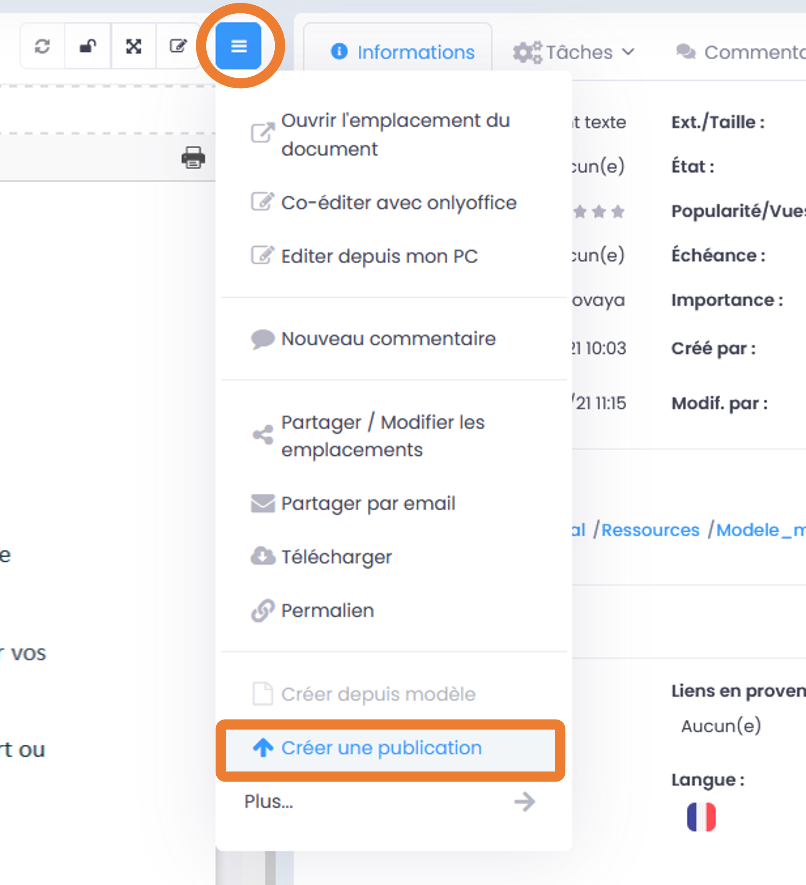

Une fenêtre s’ouvre pour vous permettre de sélectionner les emplacements souhaités pour votre Publication. 
Les emplacements du document de travail sont pré-cochés pour que vous puissiez à la fois partager la publication dans des nouveaux Espaces, tout en la classant dans les mêmes emplacements que le document d’origine (très pratique lorsque l’on navigue dans l’arborescence documentaire). 
Une fois les emplacements sélectionnés, cliquez sur « Valider ». 

.. figure:: media-guide/image175.png
   :alt: 

Vous serez redirigé vers la page de cette nouvelle Publication, où vous pourrez vérifier le document et ses emplacements.

.. NOTE::
   Les Publication prennent automatiquement \_PUB à la fin du titre. Ex. pour un fichier nommé « Contrat-A », la Publication deviendra « « Contrat-A_PUB ».

.. figure:: media-guide/image176.png
   :alt: 

**À tout moment, vous avez la possibilité de mettre à jour la Publication :**

 - Depuis le document de travail, allez dans le menu « Burger »
 - Cliquer sur « Publier à nouveau »
 - A chaque mise à jour réalisée de cette manière, la Publication prendra un numéro de version majeure (ex. de 1.0 on passe à 2.0). 
 - Pour chaque version du document de travail ayant généré une Publication (ex. 3.14), on peut voir le numéro de la Publication associée (ex. 2.0), l’affichage prend cette forme : version 3.14(2.0).
 
Vous pouvez supprimer une Publication via le menu « Burger », dans « voir plus » cliquez sur « Supprimer Publication ».
Cette action ne supprimera que la Publication, mais pas le document de travail d’origine.

.. figure:: media-guide/image177.png
   :alt: 

Renommer 
~~~~~~~~~~~~~~~~~~~~
Pour renommer un document, il faut avoir au moins le rôle de « Contributeur » dans l’Espace où il se trouve. 
Vous pouvez renommer un document depuis : 
 - L’explorateur de fichiers : clic droit sur le document, puis dans le menu cliquez sur « Renommer ». 
 - La page du document en faisant un clic sur le titre (au-dessus de la prévisualisation du document). 

Changez le titre dans le champ et cliquez sur l’icône de validation (ou juste sortez du champ en cliquant ailleurs lors que vous renommer depuis la page du document).

.. figure:: media-guide/image138.png
   :alt: 

Ajouter/Modifier le Résumé
~~~~~~~~~~~~~~~~~~~~~~

Vous pouvez ajouter un texte d’introduction ou de synthèse à votre document, qui sera affiché au-dessus de la prévisualisation. Ainsi, tous ceux qui consulterons le document, verront ce Résumé. 
Via le menu « Burger » (les actions contextuelles), cliquez sur « **Modifier le Résumé** ».

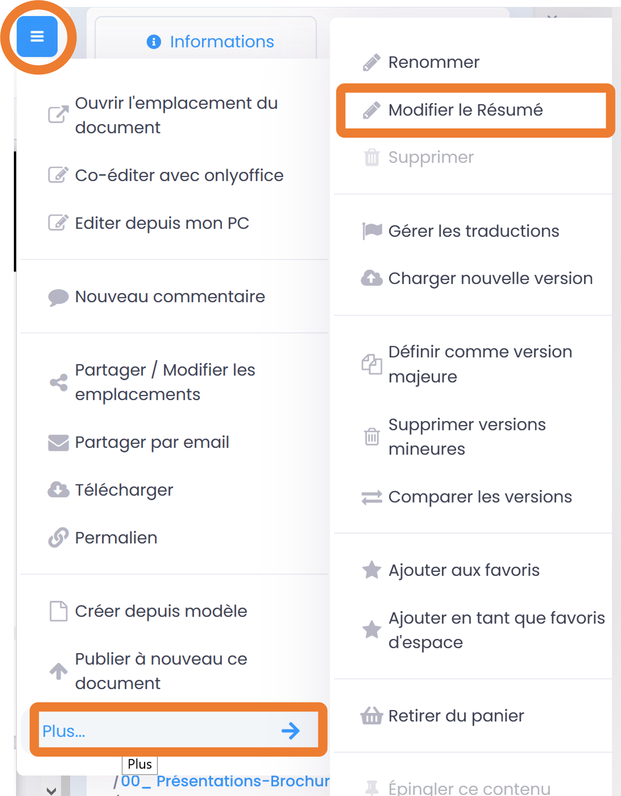

Une zone de texte s’ouvre avec les mêmes possibilités de mise en page que dans les commentaires (type/taille de police, couleurs, tableau, images, etc.). 
Rédigez votre texte, puis sauvegardez en cliquant sur « Appliquer ».

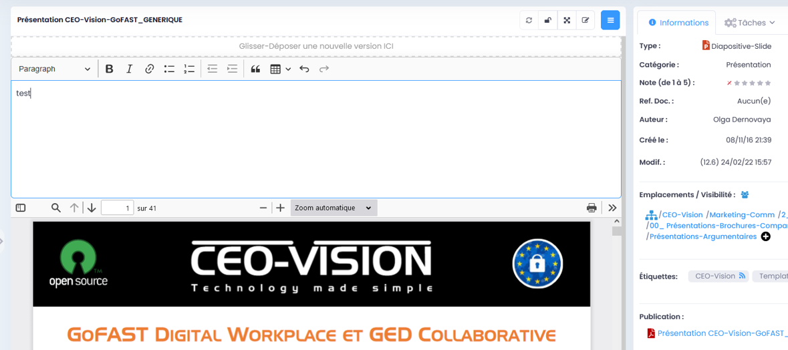

Le texte s’affiche au-dessus de la prévisualisation et sous le titre du document.

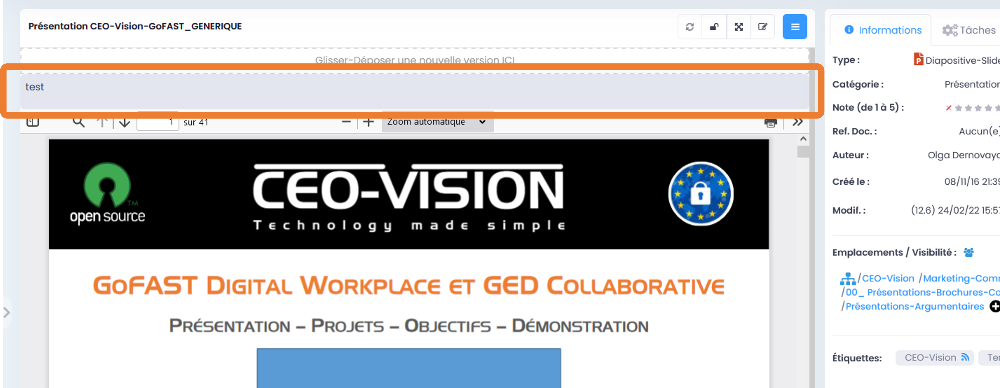

Vous pouvez à tout moment modifier le résumé, toujours via le menu « Burger » et clic sur « Modifier le Résumé ».

Tous les utilisateurs pouvant modifier le document (contributeur ou administrateurs), pourront également modifier le résumé, contrairement aux commentaires (NB. seul l’auteur d’un commentaire ou un administrateur de l’espace peuvent le modifier). 

Supprimer/Restaurer
~~~~~~~~~
Sur GoFAST, la suppression d’un document reste rare car il n’y a plus de doublons et donc, la suppression est souvent utilisée à la suite d’une erreur (ex. on a créer un doublon par mégarde). Dans le cas où vous avez fait une erreur d’emplacement à la création/dépôt d’un document, il est préférable de modifier le ou les emplacement(s), plutôt que de supprimer. 

**Supprimer un document revient à :** 

 - le supprimer de tous les emplacements (Espaces où il se trouve). 
 - Supprimer la page du document, avec tous ses commentaires et ses versions. 
 - Supprimer les liens pointant vers ce document depuis les autres documents (cf. notion de liens entre contenus). 
 - Supprimer le document des favoris (pour tous les utilisateurs qui auraient épinglé ce document comme favoris)

.. figure:: media-guide/image185.png
   :alt: 

**Restaurer un document supprimé :**

A la suppression d’un document, celui-ci n’est pas supprimé définitivement et il sera possible de le restaurer dans un délai de 90 jours. 
Seul le créateur du document ou les administrateurs de l’espace où se trouvait le document pourront le restaurer en cas d’erreur. 
Dans le cas où on se rend sur la page d’un document supprimé, à la place de la prévisualisation on verra un message indiquant cette suppression, avec comme seule action possible « Restaurer le document » (via le menu « Burger »). 

Pour restaurer un document il faut : 
 - Retrouver le document via la recherche avec l’option « Rechercher dans la corbeille » : possible uniquement pour les utilisateurs qui avaient accès au document avant sa suppression. 
 - Retrouver le document via la piste d’audit : possible uniquement pour les utilisateurs ayant le « Profil Support-Utilisateurs » (les autres n’ayant pas accès à ces pistes d’audit). 
 - Une fois sur la page du document, allez dans le menu « Burger » et cliquez sur « Restaurer le document ». La page va alors se recharger, en affichant la prévisualisation, les métadonnées et tous les commentaires associés au document. Le document sera restauré dans tous les emplacements où il se trouvait avant la suppression. 

.. NOTE::
   Une fois le délai de 90 jours passé, il ne sera plus possible de restaurer le document. 

Gérer les traductions
~~~~~~~~~~~~~~~~~

Si un document existe en **plusieurs langues**, vous pouvez **lier entre eux** les divers fichiers considérés comme étant des traductions. Vous pourrez ainsi passer d’une traduction à l’autre en un clic, peu importe dans quels dossiers ces documents se trouvent.
La langue d’un document est affichée sous la forme d’un drapeau dans l’onglet « Informations », du bloc qui se trouve à droite de la prévisualisation d’un document (tout en bas de la liste des métadonnées). 

**Comment gérer les traductions :**

Sur la page d’un document, via le menu « Burger » (les actions contextuelles) : 
 - allez dans « voir plus », 
 - cliquez sur « Gérer les traductions ». 
 - une fenêtre avec plusieurs champs s’ouvre, ceux-ci correspondent aux traductions possibles.

.. figure:: media-guide/image167.png
   :alt: 

.. NOTE::
   La même action est possible via un clic droit sur un document depuis l’explorateur de fichiers. 

**Lier plusieurs documents existants sur la plateforme, comme étant des traductions :**

Dans la fenêtre de gestion des traductions, allez dans le champ qui correspond à la langue du document cible. Les langues sont indiquées par un drapeau. 
 - Il faut saisir au moins les 3 premières lettres du titre du document cible (ici le document en anglais).
 - Une liste affichera des suggestions basées sur le titre (il faut commencer par le début du titre du document cible pur avoir des suggestions pertinentes ou copier-coller le titre dans le champ). 
 - Sélectionnez votre document cible dans la liste des suggestions. 
 - Cliquez sur « Mettre à jour les traductions » pour sauvegarder vos liens de traductions. 

.. figure:: media-guide/image168.png
   :alt: 

**Lier un document existant à un document de traduction à charger depuis votre PC :**

 - Dans la fenêtre de gestion des traductions, cliquez sur le bouton « + » au niveau du drapeau qui correspond à la langue du document cible. 
 - Vous serez alors redirigé vers le formulaire de création de document. 
 - Le titre de votre document sera prérempli, avec à la fin du titre les lettres qui correspondent à la langue ciblée (ex . /_EN)
 - Selon sur la langue cible choisie, la langue du document cible sera pré-renseignée. 
 - Cliquez sur « Choisissez un fichier » et votre explorateur de fichiers local s’ouvre (celui de votre PC). 
 - Allez chercher votre document cible dans votre arborescence et cliquez sur « ouvrir » (ou faites un double-clic sur le document). 
 - Sélectionnez les emplacements souhaités dans l’arborescence documentaire. 
 - Cliquez sur « Enregistrer » pour à la fois charger le nouveau document et sauvegarder votre lien de traduction. 

Dans le bloc d’informations (les métadonnées), les différentes traductions disponibles pour votre document seront liées et indiquées sous la forme d’un drapeau :

 - Le 1\ :sup:`er` drapeau affiché est le document sur lequel vous vous trouvez. 
 - Les drapeaux suivants sont les traductions liées.
Il suffit de cliquer sur l’un des drapeaux pour aller sur l’une des traductions liées.

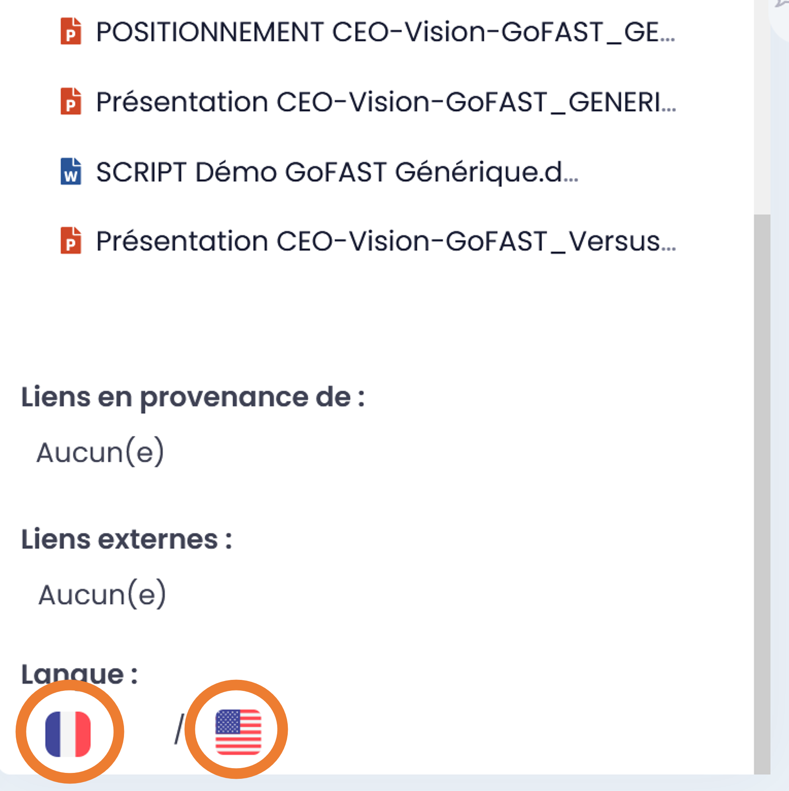

.. NOTE::
   GoFAST ne permet pas de traduire le contenu des documents automatiquement. Il s’agit ici de documents qui existent déjà en différentes langues et qu’on veut lier pour pouvoir passer d’une à l’autre en un clic.
   Toutefois, lors du chargement d’un nouveau document sur la plateforme, la langue est automatiquement détectée (détection basée sur l‘extraction du contenu, faite automatiquement après le dépôt du nouveau document sur GoFAST). 
   Pour modifier la langue d’un document, il suffit de cliquer sur le drapeau désignant la langue du document sur lequel on se trouve. Une liste va alors s’afficher, où il sera possible de sélectionner la langue souhaitée. 

Charger une nouvelle version 
~~~~~~~~~~~~~~~~~~~~~~~~~

Avant de mettre à jour un document sur GoFAST en chargeant un fichier qui se trouve sur votre PC, il est impératif de vérifier la date de mise à jour du document (sur la page du document dans le Bloc d’informations, ou dans l’explorateur de fichier, colonne « Modifié »). 
 - Si la date « Modifié le » est postérieure à la version sur votre PC, il est préférable de ne pas écraser la version sur GoFAST. 
 - Dans ce cas, il est conseillé de contacter l’utilisateur à l’origine de la dernière version (ex. via le Tchat ou « Partager le document par email » possible dans le menu « Burger »). Le dernier contributeur est indiqué dans le champ « Modifié par » dans le Bloc d’informations (sur la page du document).   

.. figure:: media-guide/image150.png
   :alt: 

**Charger un fichier depuis son PC pour mettre à jour un document sur GoFAST :**

 - Aller sur la page du document.
 - Glissez-déposez votre fichier depuis votre PC vers la zone de « glisser-déposer » qui se trouve au-dessus de la prévisualisation. 
OU
 - Passez par le menu « Burger », puis dans « Voir plus », cliquez sur « Charger nouvelle version ». 

.. NOTE::
   Une fois votre fichier déposé, une fenêtre s’ouvre pour pouvoir laisser un commentaire lié à votre nouvelle version. Vous pouvez également cocher la case « Version majeure » (conseillé dans le cas où vous considérez que les modifications faites sont importantes).

La version du document sur GoFAST sera écrasée par celle que vous venez de charger : 

 - Dans le cas où vous avez laissé un commentaire, celui-ci sera consultable via l’onglet « Commentaires » du bloc d’information. 
Si vous avez coché « Version majeure », le numéro de version passera en version majeure (ex. depuis 1.4, vous passerez en 2.0). 

.. figure:: media-guide/image151.png
   :alt: 

.. figure:: media-guide/image152.png
   :alt: 

Définir comme version majeure
~~~~~~~~~~~~~~~~~~~~
Dès que vous faites une modification sur un document via la fonctionnalité « Coéditer avec OnlyOffice » ou « Editer depuis PC » et que vous sauvegardez, une nouvelle version mineure du document est générée (1.0=>1.1, 1.2, 1.3, etc.). 
Si besoin, vous pouvez transformer la version en cours du document en une version majeure, c’est-à-dire une nouvelle base de travail (ex. la version 1.11 devient la version 2.0).

**Passer en version majeure un document à tout moment :**

 - Sur la page du document, allez dans le menu « Burger » (actions contextuelles)
 - Allez dans « Voir plus »
 - Cliquer sur « Définir comme version majeure ».

.. figure:: media-guide/image202.png
   :alt: 

**Passer un document source en version majeure lors d’une Publication :**

 - Sur la page du document, allez dans le menu « Burger » (les actions contextuelles).
 - Cliquez sur « Créer une publication » (ou sur « Publier à nouveau ce document » si une publication existe déjà et que vous souhaitez la mettre à jour).
 - Cocher la case « Définir comme version majeure le document d’origine », 

 - Cliquez sur le bouton « Valider » pour sauvegarder. 

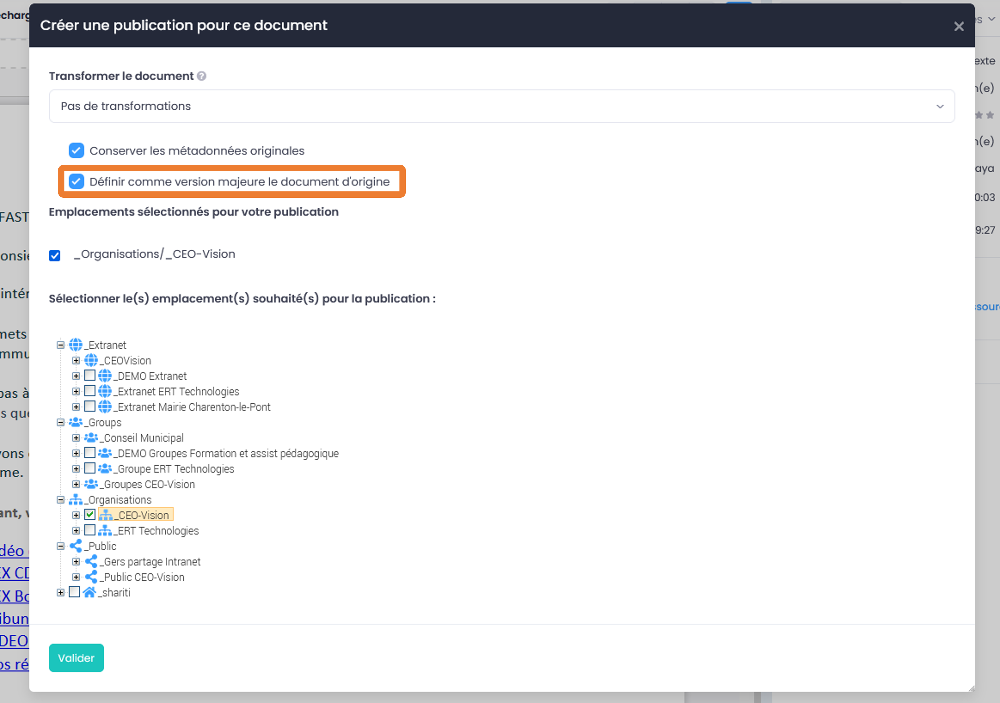

**Importance des versions majeures :**

 -  Si vous pré-archivez un document (cf. champs « état » d’un document), ses versions mineures seront supprimées et donc, seules les versions majeures (ex. 1.0, 2.0, 3.0…) et la dernière version en cours avant le préarchivage, seront conservées. 

**Commenter votre version majeure :**

Vous pouvez ajouter un commentaire à cette nouvelle version majeure à l’occasion de cette mise à jour. 
Celui-ci sera visible dans l’onglet « Commentaires » à droite de la prévisualisation du document, par tous les utilisateurs ayant accès au document.

Terminer en cliquant sur « Valider ». 

.. figure:: media-guide/image203.png
   :alt: 

.. figure:: media-guide/image204.png
   :alt: 

Dans les métadonnées, vous verrez le changement du numéro de version (ex. version 1.2 est passée en 2.0). Quand le 1\ :sup:`er` chiffre change, c’est une version majeure, autrement il s’agit d’une version mineure.

Voir aussi "Glisser et déposer une nouvelle version"

Supprimer les versions mineures 
~~~~~~~~~~~~~~~~~~~~~~~~~~~~
Le principal objectif de la suppression des versions mineures est de libérer de l’espace de stockage sur la plateforme. Dans le cas où un document a énormément de versions mineures, cela permet aussi de réduire la liste dans l’onglet « Versions ». 

**Avant de supprimer les versions mineures, il est conseillé de vérifier si le document comporte des versions majeures :**

 - Si c’est le cas, les versions majeures seront conservées et vous pourrez les télécharger en cas de besoins. 
 - Si le document ne comporte aucune version majeure en dehors de la toute première (1.0), seule cette première version et la dernière version en cours seront conservées. 

**Pour supprimer les versions mineures :**

 - Sur la page d’un document, allez dans le menu « Burger » (actions contextuelles) ou depuis l’explorateur de fichier faites un clic-droit.
 - Dans « Voir plus », cliquez sur « Supprimer versions mineures ».

.. figure:: media-guide/image206.png
   :alt: 

Un message vous avertit de la suppression définitive et irréversible des versions mineures. Si vous êtes d’accord, cliquez sur « Supprimer ». 

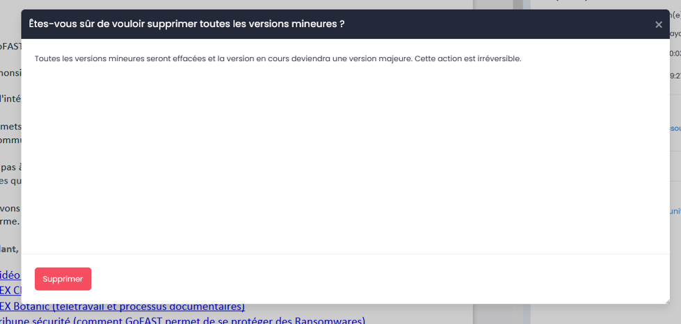

La version en cours du document passe alors en version majeure. 
Dans le bloc des métadonnées, onglet « versions », vous ne verrez désormais plus que les versions majeures du document.

.. figure:: media-guide/image208.png
   :alt: 

.. NOTE::
   Pour une bonne gestion des versions, il est conseillé de régulièrement « transformer en version majeure » la dernière version disponible du document. Ainsi, en cas de suppression des versions mineures, on conserve quelques versions traçant l’historique du document. 

Comparer deux versions
~~~~~~~~~~~~~~~~~~~~
Pour afficher les écarts entre deux versions d’un même document, vous avez la possibilité de lancer un comparatif : 

 - Depuis la page du document, allez dans le menu « Burger » (les actions contextuelles).
 - Allez dans « Voir plus ».
 - Cliquez sur « Comparer les versions »

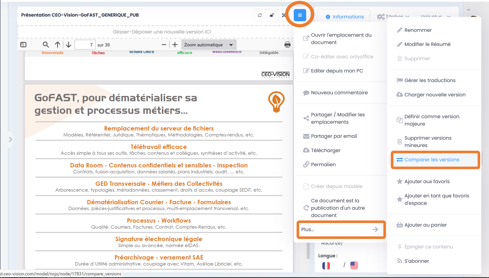

Sélectionnez dans les deux champs les deux versions que vous souhaitez comparer : 

.. figure:: media-guide/Ecran-GoFAST_Comparatif-Versions_lancer-le-comparatif-choix-versions.png	
   :alt: 
   

Ajouter aux favoris
~~~~~~~~~~~~~~~~

**Ajouter un document aux favoris** permet d’y accéder très rapidement par la suite, depuis la barre des accès rapides icône « étoile » (menu du haut) ou depuis son tableau de bord (page d’accueil, si on dispose du bloc « Contenus favoris ». 

Ajouter un document/contenu à ses favoris personnels est possible depuis :

 - la page du document, via le menu « Burger » (les actions contextuelles)
 - l’explorateur de fichiers en faisant un clic-droit sur le document pour ouvrir le menu
 - partout où vous avez le menu « Burger » d’un document (ex. fil d’activité, résultat d’une recherche…)

Lorsque vous cliquez sur « Ajouter aux favoris » un message apparaît, en haut à droite de l’écran pour confirmer que le contenu a bien été ajouté aux favoris.

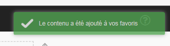

La prochaine fois que vous voulez accéder à ce document, il suffira d’aller sur l’icône « étoile » dans la barre des accès rapides (menu principal du haut) et cliquer sur le document dans la liste de vos favoris.

Vous pouvez enlever le document/contenu favoris : 
 - de la même manière que pour l’ajout (via le menu des actions contextuelles)
 - depuis la liste des contenus favoris, en cliquez sur la corbeille à droite du titre du document.

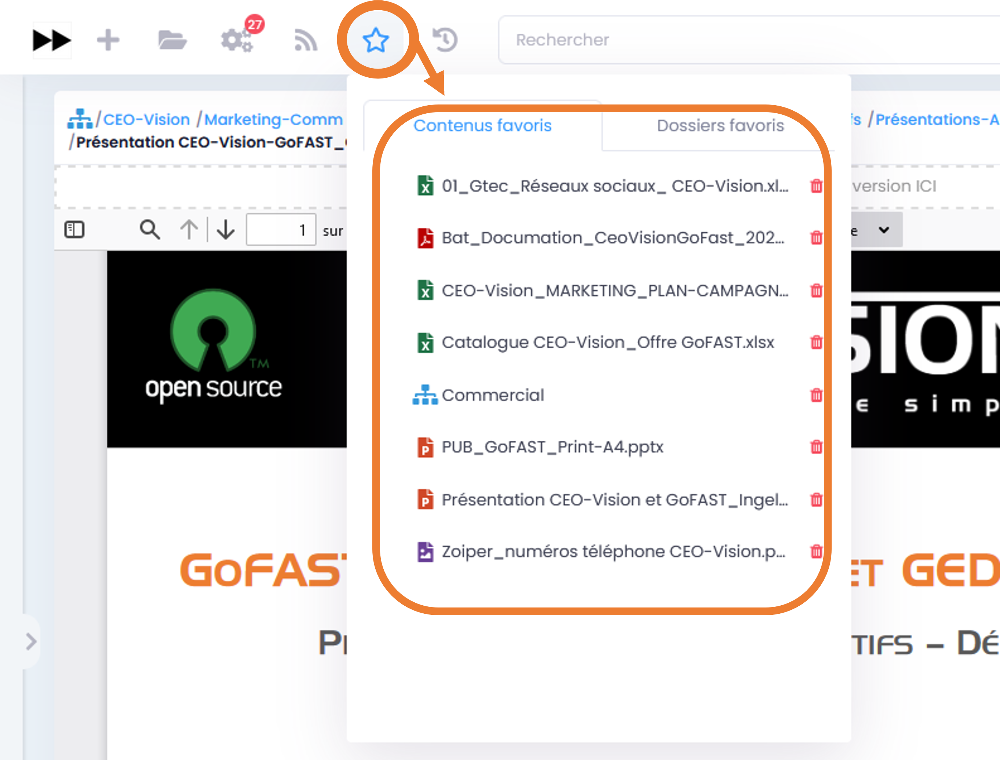

Un message en haut à droite de l’écran vous confirmera la bonne suppression du document de votre liste des favoris.

.. figure:: media-guide/image189.png
   :alt: 

Ajouter au panier documentaire
~~~~~~~~~~~~~~~~~~~~
**Objectif du panier documentaire :** 
Rassemble plusieurs documents, pouvant se trouver dans des dossiers divers de l’arborescence, pour pouvoir effectuer des actions sur l’ensemble de ces documents. 

**Pour ajouter des documents dans son panier :**
 - Sur la page d’un document, via le menu « Burger » (menu des actions contextuelles), allez dans « Voir plus » et cliquez sur « Ajouter au panier ».
   
.. figure:: media-guide/ Ecran-GoFAST_Panier-Documentaire_ajout-au-panier-sur-page-document.png

 - Partout où vous voyez le menu « Burger » d’un document, vous pouvez réaliser la même action.
 - Depuis l’explorateur de fichiers, faites un clic-droit sur un document pour ouvrir le même menu « Burger ».
 - Pour ajouter plusieurs documents au panier, allez dans l’explorateur de fichier, cochez un ensemble de documents, puis cliquez sur l’icône « panier » dans la barre des actions de l’explorateur de fichiers.   
    - Depuis l’explorateur de fichiers "GoFAST File Browser" en sélectionnant les documents souhaités et en cliquant sur l’icône "panier"
   
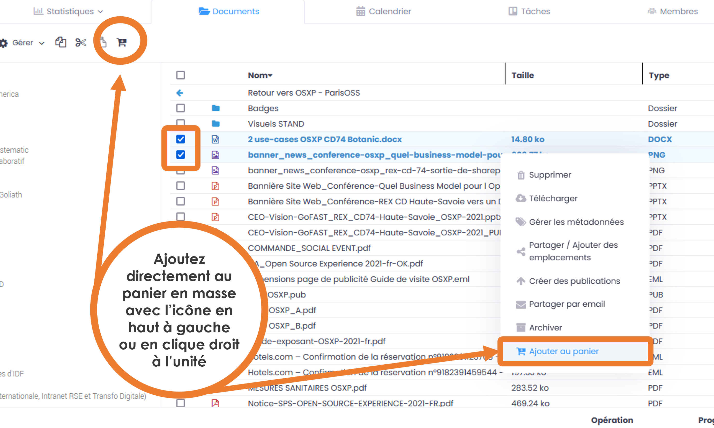
   
**Il est possible de retirer les documents de son panier documentaire :**

    - Unitairement, en cliquant sur l’icône à droite du document dans le panier.
    - Tous les documents en une fois, en cliquant sur "retirer tous les documents" en bas de la fenêtre du panier. 

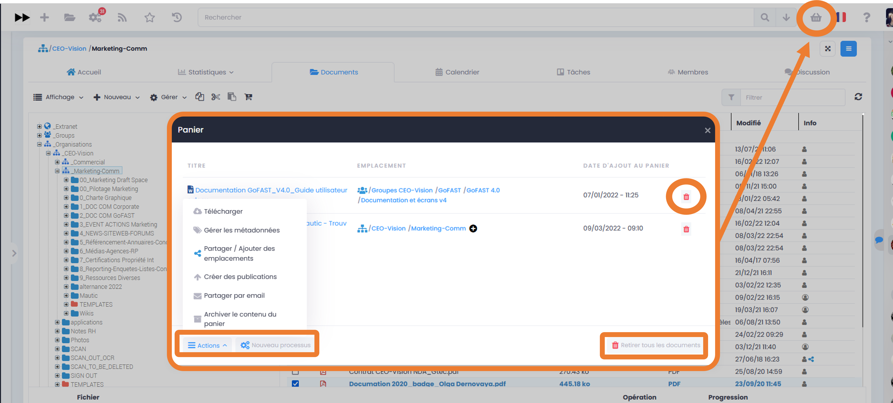

Pour en savoir plus sur les actions possibles depuis un panier documentaire, merci de vous référer à la rubrique : « Panier Documentaire » 

Epingler un contenu 
~~~~~~~~~~~~~~~~
**Objectif de « épingler un contenu » :** afficher tout en haut du fil d’activité, un document spécifique. Ainsi peu importe l’activité sur la plateforme, tous les utilisateurs ayant accès à ce document, le verront épinglé en haut du fil. 
Seul le « Profil de Support-Utilisateurs » ou « Super-Administrateur » permet d’épingler un document sur le fil d’activité. 

**Pour épingler un document/contenu en haut du fil d’activité :**

 - Sur la page d’un document, via le menu « Burger » (menu des actions contextuelles), allez dans « Voir plus » et cliquez sur « Epingler ».
 - Partout où vous voyez le menu « Burger » d’un document, vous pouvez réaliser la même action.
 - Depuis l’explorateur de fichiers, faites un clic-droit sur un document pour ouvrir le même menu « Burger ».

Pour en savoir plus sur les profils ayant des permissions avancées, merci de vous référer aux rubriques : « Profil Support-Utilisateur » et « Profil Super-Administrateur ». 
Vous pouvez également consulter la rubrique « Fil d’Activité » ; 

S’abonner 
~~~~~~~~~
**Objectif de s’abonner :** permet de gérer la fréquence des notifications liées à l’activité d’un document spécifique. Ainsi, vous pouvez par exemple avoir un rapport d’activité sur tous les contenus des espaces où vous êtres membres 2 fois par jour, mais être notifié immédiatement dès lors que ce document spécifique est modifié ou commenté. 

**Pour s’aboner à un contenu/document :**

 - Sur la page d’un document, via le menu « Burger » (menu des actions contextuelles), allez dans « Voir plus » et cliquez sur « Epingler ».
 - Partout où vous voyez le menu « Burger » d’un document, vous pouvez réaliser la même action.
 - Depuis l’explorateur de fichiers, faites un clic-droit sur un document pour ouvrir le même menu « Burger ».

.. figure:: media-guide/image197.png
   :alt: 

Un message, en haut à droite de votre écran, vous confirme que l’abonnement à ce contenu a bien été pris en compte.

.. figure:: media-guide/image198.png
   :alt: 

Pous voir vos abonnements et gérer leurs intervalles, cliquez sur la flèche à côté de votre nom de profil puis sur « Abonnements »

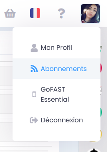
 
Vous retrouvez toute la liste de vos abonnements en passant par le menu du profil utilisateur (barre des accès rapides / menu principal du haut), dans le sous-menu « Abonnements ». 

Pour en savoir plus sur les abonnements à l’activité documentaire, merci de vous référer à la rubrique : « Gérer ses abonnements ».

Autres actions possibles
~~~~~~~~~~~~~~~~~~~~
En plus du menu "Burger" (actions contextuelles), sur la page du document il est possible d’effectuer d’autres actions, dont : 

 - Modifier les informations (=métadonnées), voir : Ajouter/Modifier les informations d’un document (métadonnées)
 - Pré-archiver un document (via la modification de la métadonnée "Etat"), voir : Pré-archiver des documents et DUA
 - Modifier les emplacements/visibilité (dans les Espaces Collaboratifs), voir : « Modifier les Emplacements/Visibilité »
 - Mettre à jour le document en chargeant un fichier depuis son PC, voir : « Glisser-déposer un document »
 - Partager des commentaires (onglet "Commentaires"), voir : « Onglet Commentaires » 
 - Assigner des tâches de processus (onglet "Tâches"), voir : « Onglet Tâches »

Modifier les Emplacements/Visibilité 
-------------------------------------------------------------------------------------------------

L’emplacement correspond aux Espaces et dossiers où se trouve votre document sur GoFAST (ex: dans un groupe ou une organisation ou votre espace privé et/ou un répertoire).
Un même et unique fichier peut être classé dans plusieurs emplacements grâce au *Multi-emplacement*. Vous évitez ainsi d’avoir des doublons de fichiers et donc, ne plus faire d'erreurs de versions. 

.. figure:: media-guide/image213.png
   :alt: 

L’ajout ou la suppression des emplacements dépend des rôles que vous avez dans les divers Espaces Collaboratifs. Pour plus d’information, merci de vous référer à la rubrique : « Espaces Collaboratifs »

Ajouter/Modifier les informations d’un document (métadonnées) 
-------------------------------------------------------------------------------------------------
Pour modifier les informations liées à un document, il faut se rendre sur la page du document ou passer par l’explorateur de fichiers, puis bouton gérer un fois que l’on sélectionnés les documents que l’ont souhaite qualifier. 
Sur la page du document dans le champ « Emplacements/Visibilité » cliquez sur le bouton « Modifier », une fenêtre s’ouvre et affiche l’arborescence où vous pouvez partager le document. Vous pouvez alors cocher ou décocher les emplacements, puis cliquez sur le bouton « Enregistrer ». 
Le document est partagé dans les emplacements choisis, sans aucun doublon.
Vous pouvez consulter toute la liste des utilisateurs ayant accès au document via l’icône juste à droite de « Emplacements/Visibilité » (icône représentant un ensemble d’utilisateurs). 

Catégories et Etats
~~~~~~~~~~~~~~~

.. figure:: media-guide/image400.png
   :alt: 

Les **catégories** correspondent à la nature du document : facture, courrier, contrat, rapport compte-rendu, article… Les catégories peuvent être gérés par les utilisateurs ayant le profil « Support-Utilisateurs » (pour en savoir plus, merci de vous référer à la rubrique « Profil Support-Utilisateurs »). 

L’\ **état** correspond aux « stades de vie » du document : brouillon, en cours, en attente de validation, validé, en attente de signature, obsolète, pré-archivé…

Pour les modifier, allez sur le champ « catégorie » ou « Etat ». Ce champ peut être renseigné ou non et dans ce cas il est affiché « Aucun ». Cliquez sur cette case et choisissez la proposition adéquate dans la liste déroulante. 
Vous pouvez également commencer à saisir quelques lettres pour filtrer cette liste déroulante.
Sortez du champ pour valider (clic ailleurs sur la page).

**Exemples de catégories et états :**

.. figure:: media-guide/image401.png
   :alt: 
   
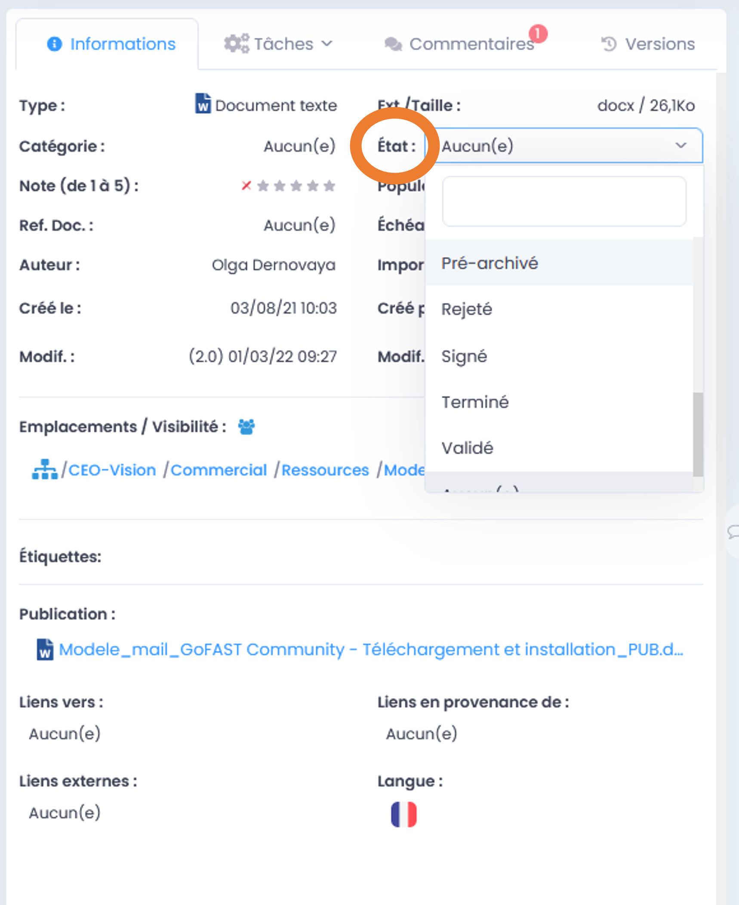
Donner une note 
~~~~~~~~~~~~~~~
Vous pouvez partage rune appréciation sur le document en cliquant sur les points (1 à 5). Vous ne pouvez noter le document qu’une seule fois, mais vous pouvez modifier votre note à tout moment en recliquant dessus. 

Référence documentaire 
~~~~~~~~~~~~~~~~~~~~~
Il s’agit d’un champ libre, qui permet de renseigner un code ou un numéro désigné comme étant la référence du document. 
Sortez du champ pour valider (clic ailleurs sur la page).
Il est envisageable de mettre un système automatique basé sur un modèle de nommage, mais cela implique un accompagnement pour la mise en place. N’hésitez pas à poser vos questions sur les forums de la communauté d’utilisateurs. 

Echéance
~~~~~~~~
Consiste à appliquer une date d’échéance au document, afin qu’un rappel soit envoyé 24h avant. Il s’agira de retrouver ce document dans la synthèse des échéances envoyées par email, listant tous les contenus dont l’échéance arrive à sa fin. 
Cela peut servir pour un contrat avec une date limite, un document qui doit être finalisé à une date précise…

Pour ajouter une échéance, cliquez sur « Aucun » face à « Echéance » et choisissez la date. Sortez du champ pour valider (clic ailleurs sur la page). 

.. figure:: media-guide/image229.png
   :alt: 

Auteur 
~~~~~~
L’auteur d’un document (champs libre) est une notion différente du créateur de document (métadonnée automatique et non modifiable à la main). Il peut donc y avoir deux personnes différentes entre ces deux champs.
Le fait d’indiquer **l’auteur** du document permet de savoir qui a créé le fichier initial (ex. si créé sur un PC avant le dépôt sur GoFAST). Cela permet par exemple, de savoir à qui s’adresser en cas de questions, mais surtout de l’utiliser comme filtre lors de la recherche. 

Si le fichier déposé sur GoFAST contient une métadonnée "auteur" (ex: un fichier Word indique dans les informations du document que l'auteur est "Christopher"), ça sera automatiquement récupéré depuis le fichier par GoFAST et affiché sur la page du document. 

Pour modifier ce champ, cliquez dessus et saisissez un nom et/ou prénom, ou tapez les premières lettres du nom et le système vous proposera une liste des auteurs déjà saisis par vous, sélectionnez le nom souhaité. 

Sortez du champ pour valider (clic ailleurs sur la page).

.. figure:: media-guide/image234.png
   :alt: 

Importance 
~~~~~~~~~~~~~~~
Vous pouvez signaler l’importance d’un document dans les métadonnées et son niveau : critique, haute, normale, basse et autres niveaux de confidentialités. 
Certains niveaux permettent de restreindre le partage et le téléchargement d’un document afin de garantir un niveau de sécurité de la donnée plus élevée.
      - Niveau « Donnée confidentielle », le document associé à ce type d’importance ne peut pas être ni téléchargé ni partagé. 
      - Niveau « Diffusion Interne » le document ne peut pas être partagé ou téléchargé dans un Espace Extranet.

Allez au niveau « Importance » dans les métadonnées du document, cliquez sur le champ puis choisissez le niveau d’importance.
Sortez du champ pour valider (clic ailleurs sur la page).

.. figure:: media-guide/image231.png
   :alt: 

Cette métadonnée peut être aussi utilisée comme filtre d’un résultat de recherche.

Etiquettes (mots-clefs)
~~~~~~~~~~~~~~~~~~~

Les "Etiquettes" sont des mots-clés que les utilisateurs peuvent à tout moment ajouter aux documents. 

**Ces étiquettes sont utiles dans les cas suivants :**

* Informer les autres utilisateurs qui consultent le document sur la thématique ou une spécificité liée au document,
* Retrouver plus facilement certains contenus car les étiquettes sont indexées par le moteur de recherche et donnent un poids supplémentaire qui remonte ces contenus dans le résultat,
* Pouvoir filtrer un résultat de recherche par "étiquette" (ex : on recherche "documentation" et on filtre avec l'étiquette "GoFAST"),
* Pouvoir s'abonner à ces étiquettes pour être notifié de l'activité des documents ayant cette étiquette (chaque abonnement à une "étiquette" peut être paramétré par l'utilisateur pour sa fréquence).
* Pouvoir retrouver des fichiers qui sont dans des formats autres que texte (ex : les images, les vidéo, PDF images, etc.)

**Pour ajouter ou enlever une "étiquette" :**

* Allez au niveau de "Etiquettes" et cliquez dans la zone grise (non sur une étiquette déjà mise, mais à côté),
* Pour ajouter une étiquette, il faut commencer à taper le mot souhaité et des suggestions vous seront proposées. Cliquez sur une des suggestions. Si aucune suggestion ne vous convient, saisissez le mot ou les mots souhaité(s). 
* Sortez du champ pour valider (clic ailleurs sur la page).
* Pour enlever une étiquette existante, il suffit de re-rentrer dans le champ et cliquer sur la petite croix au niveau de l'étiquette.

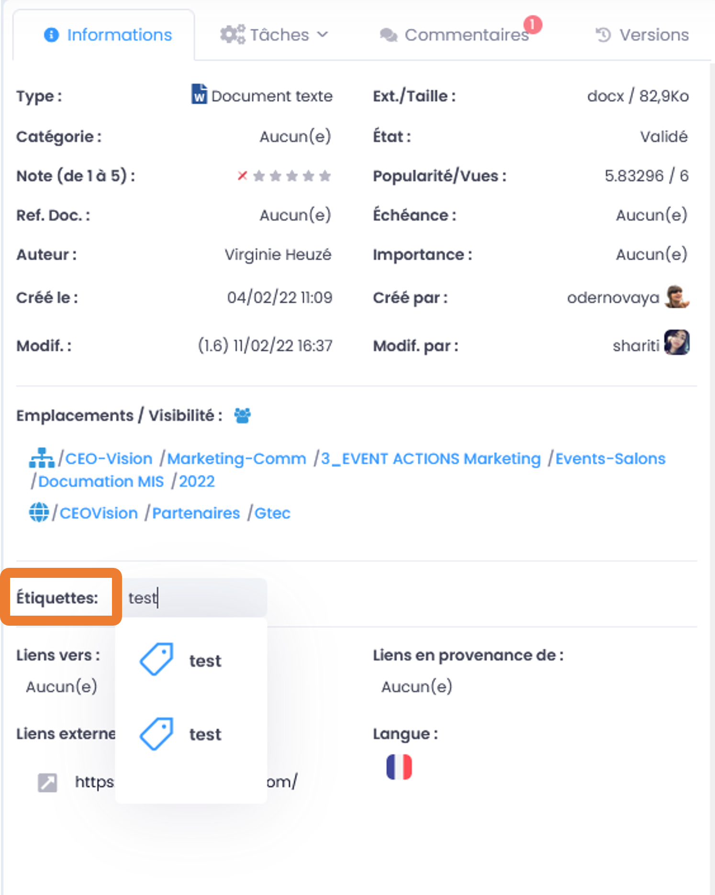

.. figure:: media-guide/image222.png
   :alt: 

**S'abonner ou se désabonner des "Etiquettes" :**

L'abonnement à des étiquettes permet d'être notifié sur l'activité des contenus selon une thématique ou un sujet spécifique (ex. on est membre d'un espace de travail, mais plutôt que d'être notifié sur toute l'activité de cet espace, on fait le choix d'être notifié sur les documents ayant une étiquette précise). 
Sur la page d'un document, pour vous abonner ou vous désabonner d'une étiquette : il faut cliquer sur la petite icône d'abonnement au niveau de l’étiquette.
Ensuite, il est possible de paramétrer la fréquence de ses notifications par étiquette ou se désabonner (dans le menu du profil utilisateur, entrée "Abonnements").

.. figure:: media-guide/image224.png
   :alt:
   
.. figure:: media-guide/image225.png
   :alt:

Un message apparaît dans le coin droit supérieur, pour vous confirmer la prise en compte de l'abonnement ou du désabonnement.

.. figure:: media-guide/image226.png
   :alt: 

L'icône d'abonnement apparaîtra en rouge dans l'étiquette si vous êtes abonné à ce terme, et en bleu si vous n’y êtes pas abonné.

.. figure:: media-guide/image227.png
   :alt: 

Contenus liés (liens vers/en prévenance de, liens externes)
~~~~~~~~~~~~~~~~~~~~~~~~~~~~~~~~~~~~~~~~~~~~~~~~

Si des documents ont **un lien vers/depuis**, il est possible de passer de l’un à l’autre en un clic, peu importe où se trouvent ces documents, mais selon ses droits d’accès (si vous n’avez pas accès à un des documents liés, vous aurez une page accès refusé).

C’est un peu une autre manière de voir les hyperliens dans un document. Ici vous n’êtes pas obligés d’ouvrir le document où il y a les hyperliens, vous pouvez directement cliquer sur le document lié dans les métadonnées.

**Liens vers / Liens depuis**

* Un « lien vers » signifie : un lien ajouté depuis le document où on se trouve vers d’autres contenus. * Un « lien en provenance » signifie : un lien ajouté depuis d’autres contenus vers le document où on se trouve.

Le lien vers un document a la possibilité d’être modifié depuis celui-ci, néanmoins un lien en provenance d’un autre document ne peut être modifié que depuis ce dernier.

Pour ajouter des documents/contenus liés, cliquez sur le champ, puis tapez les premières lettres du nom du document que vous voulez lier (au moins 3 caractères). Le système va vous le proposer automatiquement (liste de suggestions). 
Puis, cliquez sur le document souhaité dans la liste suggérée pour le sélectionner. Sortez du champ pour valider (clic ailleurs sur la page).

.. figure:: media-guide/image215.png
   :alt: 

Ainsi, les documents auront un lien entre eux et vous pourrez cliquer sur ces liens pour passer d’un document à l’autre en un clic pour gagner un temps précieux.

**Liens externes**

Permet d’ajouter un **lien vers une page web externe** en y mettant **une URL.**

Ainsi vous pourrez en un clic ouvrir cette page web externe dans un nouvel onglet de votre navigateur.

C’est le même principe que pour les autres métadonnées : cliquez dans le champ « Liens externes », et coller l’URL souhaité. 
Sortez du champ pour valider (clic ailleurs sur la page).

.. figure:: media-guide/image219.png
   :alt: 

Historique et versions du Document
~~~~~~~~~~~~~~~~~~~~~~~~~~~~~~~~~~

L’\ **historique** indique les actions qui ont été faites sur le document, par qui et quand : création, modification, …

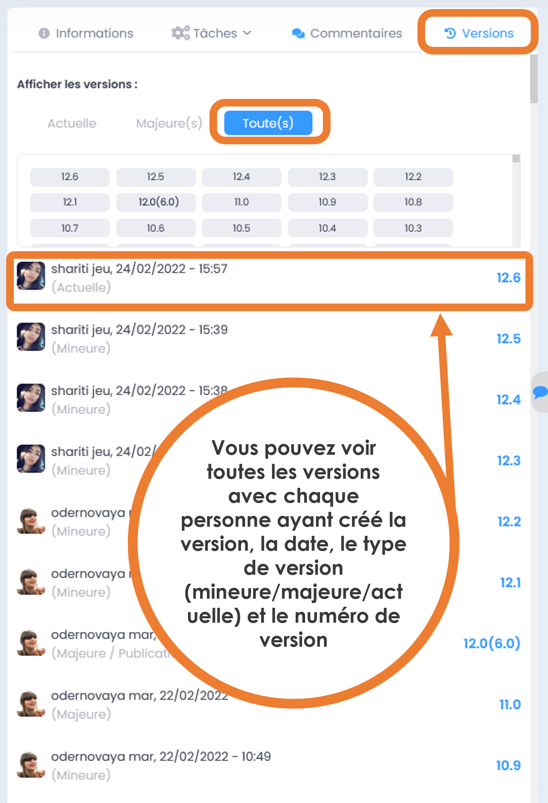

Juste en dessous de l’historique, vous pouvez voir aussi les **versions** du documents, c’est-à-dire le numéro des versions actuelles et combien il y en a eu avant. Sachant que chaque sauvegarde du document est considérée comme une nouvelle version mineure (1.0 => 1.1, 1.2, 1.3,….) .
 Par contre, si vous écrasez la dernière version mineure par une nouvelle version du document (avec le glisser/coller par exemple), le système vous demandera si vous voulez qu’elle devienne une version majeure (1.3 => 2.0) et donc une nouvelle base de travail.
La 1ere version que vous créez ou migrez sur GoFAST commence à 1.0.

Cliquez sur « Show versions list » pour voir les versions antérieures, vous pouvez même choisir le type de versions (actuelle, majeure ou toutes), puis cliquez sur le numéro de la version que vous voulez ouvrir.

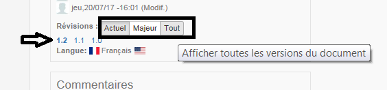

Voir également la rubrique : “Gestion des versions ». 

Les langues
~~~~~~~~~~~~~~~~~~~~~~~~~~~~

Vous pouvez mettre la **langue du document** dans les métadonnées, ainsi plus besoin d’indiquer la langue dans le nom du fichier ou de rajouter un « EN » ou « FR » etc. 
Cela donne également un niveau de **filtre** supplémentaire dans la recherche de documents.

Si le document existe en différentes langues, vous pouvez lier entre elles les traductions de ce document : il suffira ensuite d’appuyer sur le drapeau correspondant à la langue souhaitée pour aller sur la page du document considéré comme étant la traduction.

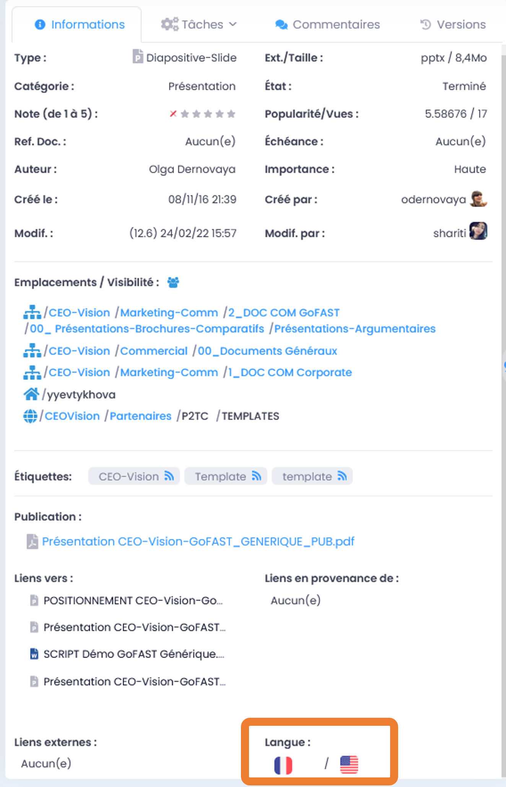

Le premier drapeau correspond à la langue du document où vous trouvez, les autres sont les traductions disponibles. 
Donc dans l’exemple ci-dessus le document est en français (on voit le drapeau) et il existe une traduction en anglais (on voit l’autre drapeau).

Pour **lier 2 documents de langues différentes** il faut passer par le menu « Burger » (menu des actions contextuelles), dans « voir plus » cliquer sur « gérer les traductions ».

.. figure:: media-guide/image241.png
   :alt: 

Voir aussi la rubrique : Actions contextuelles sur un document

Vous arrivez sur un formulaire où vous pouvez taper les premières lettres du document (au moins 3) que vous voulez lier, dans le champ de la langue souhaitée. 
Terminez en appuyant sur le bouton « Mettre à jour les traductions »

.. figure:: media-guide/image242.png
   :alt: 

Vous pouvez ainsi lier les documents qui existe en plusieurs langues et les drapeaux correspondant à ces langues se retrouveront dans les métadonnées du document.

Commenter/Annoter les Documents/Contenus
---------------------------------------------------------------

Commenter un document
~~~~~~~~~~~~~~~~~~~~~
**Objectif des commentaires et annotations :** Centraliser tous les échanges liés à un document, sur la page de ce document afin de garantir que tous ceux qui doivent travailler ou consulter ce document, soient au courant des questions, réponses et autres remarques faites sur le document. Cela permet de réduire drastiquement le nombre d’emails entre collègues, mais aussi de ne plus jamais envoyer de pièce-jointe. Enfin, cela évite de perdre les échanges et de pérenniser l’information. 
Les commentaires sont affichés à droite de la prévisualisation et visible par ceux qui ont accès au document. Il n’y a donc pas besoin d'ouvrir le fichier pour les lire.
A ne pas confondre avec les commentaires faits directement dans le fichier lors de l’édition (ex. dan fichier Office), qui se retrouvent dans le contenu même du document.

**Pour ajouter un commentaire :**
 -  Allez dans l’onglet « Commentaires » et cliquez sur « Ajouter ici un nouveau commentaire »
OU 
 - Allez dans le menu « Burger » (les actions contextuelles), puis cliquez sur « Nouveau commentaire ».

.. figure:: media-guide/image143.png
   :alt: 

Une fenêtre s’ouvre où vous pouvez écrire le titre de votre commentaire et son contenu, puis cliquez sur « Enregistrez ». 

.. figure:: media-guide/image144.png
   :alt: 

Le commentaire se retrouve dans le bloc à droite de la prévisualisation, dans l’onglet « Commentaire ». 
Vous pouvez modifier ou supprimer votre commentaire à tout moment, via les icônes sous le commentaire. 
De la même manière, vous pouvez répondre à un autre commentaire en cliquant sur l’icône « flèche vers la gauche ».

.. figure:: media-guide/image145.png
   :alt: 

.. NOTE:: 
  Dans le cas d'une réponse à un commentaire, le titre est prérempli depuis le titre du commentaire d’origine préfixé de "Re:" (pour réponse). Il est toutefois possible de le modifier.

Les utilisateurs qui ont accès au document, verront une alerte (bulle rouge) dans l’onglet « Commentaire » (dans le bloc d’informations) avec le nombre de commentaires non lus.

**Commentaires partagés ou privés**

Au moment où on fait un commentaire, on a le choix entre "privé" ou "partagé". 
Attention : par défaut, le commentaire est partagé.

.. figure:: media-guide/Commentaire1.png
   :alt: 

.. figure:: media-guide/Commentaires2.png
   :alt:
   
Le commentaire privé est visible uniquement par l'utilisateur qui l'a rédigé. 
Le commentaire partagé est visible par tous les utilisateurs ayant accès au document.

Il est possible de modifier la visibilité de votre commentaire à tout moment, en cliquant sur l’icône pour modifier le commentaire.

 - Si le commentaire est "partagé" et qu'on veut le rendre "privé" : le commentaire et les éventuelles réponses au commentaire laissées par les autres utilisateurs deviennent privés.
 - Si le commentaire est supprimé, les réponses à ce commentaire les sont également. 

.. NOTE:: Le profil super administrateur a la possibilité de cocher/décocher une case sur le profil d'un utilisateur pour lui interdire/autoriser les commentaires partagés. Dans ce cas, l'utilisateur ne pourra faire que des commentaires privés. 

.. NOTE:: Il n'y a pas de notification email, ni dans le fil d'activité dès l’ors qu’il s’agit de commentaires privés. 

   
Annotations contextuelles (partagées ou privées)
~~~~~~~~~~~~~~~~~~~~~~~~~~~~~~~~~~~~~~~~~~~~

Les annotations permettent de commenter une **partie du texte** sur la prévisualisation, plutôt que de faire un commentaire général. Très pratiques dans le cadre d'une relecture/correction des documents de travail. 

Pour **annoter un mot ou un paragraphe** il suffit de sélectionner le texte souhaité : une icône avec un crayon apparaît, cliquez dessus pour ouvrir la fenêtre d'annotation, rédigez votre annotation, puis enregistrez.

.. figure:: media-guide/image147.png
   :alt: 
   
.. figure:: media-guide/image148.png
   :alt: 

Vous verrez l’endroit que vous avez annoté surligner en jaune dans la prévisualisation et en cliquant dessus, vous verrez le contenu de l’annotation.

.. ATTENTION::
   Les annotations ne sont que sur une version donnée du document, si la version est mise à jour, vous ne verrez plus l'annotation dans la prévisualisation, mais celle-ci reste dans les commentaires dans le bloc des metadonnées.

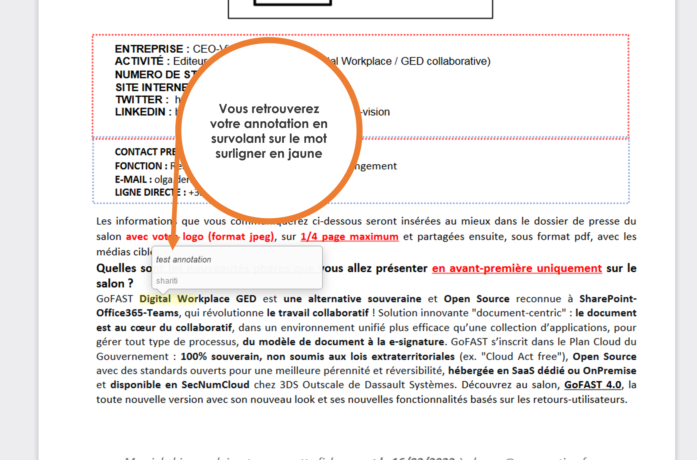

Vous pourrez également retrouver votre annotation sous la prévisualisation, comme les commentaires, avec la précision de quelle version a été annotée.

**Annotations partagées ou privées**

Au moment où on fait une annotation, on a le choix entre "privé" ou "partagé". Attention : par défaut, l'annotation est partagée.

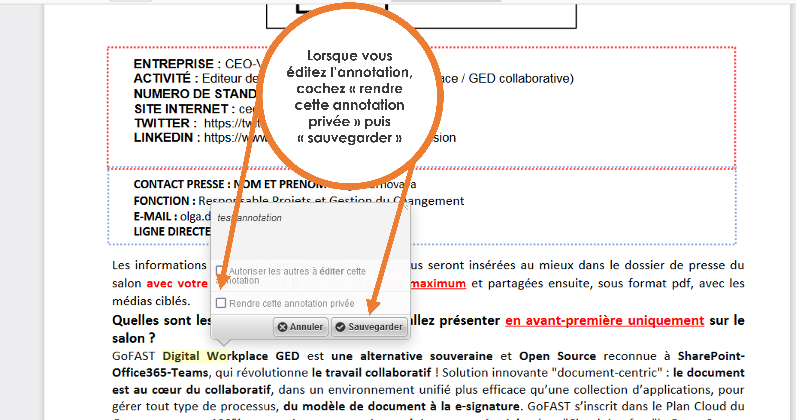

L'annotation privée est visible uniquement par l'utilisateur qui l'a rédigée. L'annotation partagée est visible par les utilisateurs ayant accès au document. 

Dans le cas d'une annotation privée, cela génère un commentaire qui est lui aussi privé.

Il est possible de modifier la visibilité de l'annotation en retournant dessus et en décochant "privé". Il en est de même pour le commentaire associé. 

Si jamais l'annotation est "partagée" et qu'on veut changer pour "privée" : l'annotation et le commentaire associé deviennent privés, y compris les éventuelles réponses au commentaire laissées par les autres utilisateurs.

Si l'annotation de départ est supprimée, le commentaire associé et les réponses à ce commentaire le sont également. 

.. NOTE:: Le super administrateur a la possibilité de cocher/décocher une case sur le profil d'un utilisateur pour lui interdire/autoriser les annotations partagées. Dans ce cas, l'utilisateur ne pourra faire que des annotations privées. 

.. NOTE:: Il n'y a pas de notification email, ni dans le fil d'activité pour les annotations privées. 

 
Pré-archiver des documents et DUA
------------------------------------------------

Etat "Pré-archivé"
~~~~~~~~~~~~~~~~~

**Pré-archiver un document** permet de le rendre invisible dans la recherche, à moins de spécifier l’option « inclure les contenus pré-archivés », sans qu’il soit complètement supprimé de GoFAST. Et de ce fait, vous ne pouvez plus travailler dessus.

.. figure:: media-guide/image178.png
   :alt: 

Le document aura désormais le statut « archivé » et toutes ses versions mineures seront effacées.

Un message vous redemande donc si vous êtes certain de vouloir archiver, si oui, appuyez sur « Archive »

.. figure:: media-guide/image179.png
   :alt: 

Une fois le **document archivé**, il apparaîtra dans les métadonnées que vous pouvez juste le lire => « en lecture seule », et son état est « archivé ». Plus aucune modification n’est donc possible sur un document « archivé ».

Il se peut aussi, lorsque vous voulez visualiser un document, que vous voyez un message orange vous signalant qu’il est en statut « archivé » et que si vous voulez retravailler dessus, il faut demander à l’administrateur du groupe de le désarchiver.

.. figure:: media-guide/image180.png
   :alt: 

Vous pouvez inverser le processus et désarchiver le document pour le rendre actif à nouveau.

.. figure:: media-guide/image181.png
   :alt: 

Cliquez sur « Désarchive »

Il n’y à présent plus de message dans les métadonnées et l’état est redevenu normal ou comme à l’origine.

.. figure:: media-guide/image183.png
   :alt: 

Vous pouvez aussi voir l’état de vos documents dans l’onglet « Activité » du groupe, dans l’encadré « Contenus avec Etat », à condition que son état ait bien été enregistré dans les métadonnées (voir § sur les métadonnées d’un document p.106)

Appliquer une DUA 
~~~~~~~~~~~~~~~~~
La DUA ou la durée d’utilité administrative, est la durée pendant laquelle un document est conservé afin d’être consulté ou utilisé pendant la gestion d’un dossier ou à des fins juridiques. Une fois ce temps écoulé, il sera archivé de façon définitive ou détruit. 
Ce processus est indispensable dans la continuité des actions administratives. Il est donc fondamental dans une entreprise de bien maîtriser le cycle de vie de chaque document et d’optimiser leur archivage.
GoFAST propose cette fonctionnalité importante et offre la possibilité de personnaliser une DUA selon la catégorie du document, la durée du processus de traitement et le sort final.  Il est également possible de définir une liste d’utilisateurs qui souhaitent être notifiés quand la DUA sera atteinte. 
Le déclenchement de la DUA se fera lors de l'application du statut "Pré-archivé" sur un document, à condition que celui-ci possède une catégorie associée à une DUA.
Une DUA peut être appliquée sur un document ou plusieurs documents d’un ou plusieurs espace(s).  

Pour déclencher une DUA sur un document, dans le bloc métadonnées de ce dernier, aller dans le champ « Catégorie » puis cliquer sur modifier. 

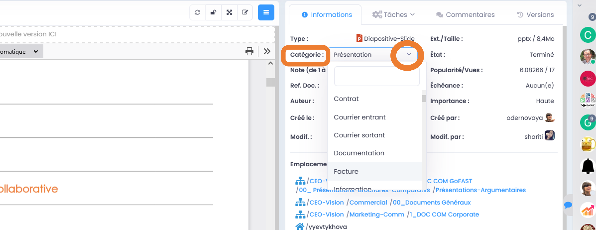

Choisissez la catégorie qui correspond au type de votre dossier puis appuyer sur « Appliquer ». 

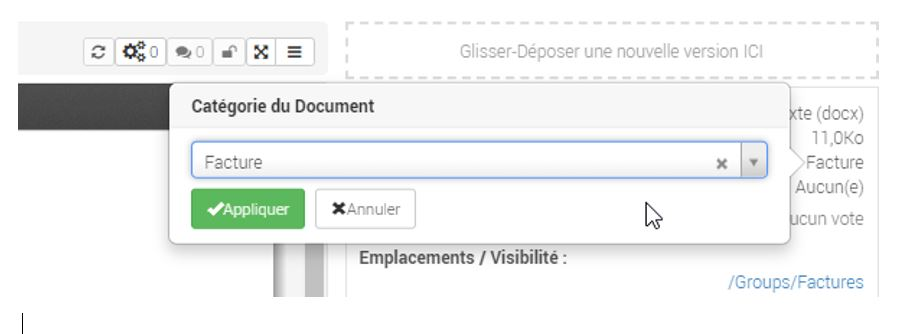

Ensuite, aller dans le champ « État », appuyer sur « Modifier », sélectionner « Pré-archivé » puis cliquer sur le bouton « Appliquer » pour sauvegarder.

Une fois ce document est en état pré-archivé, son contenu et sa catégorie ne seront plus modifiables et la DUA est déclenchée à partir de la dernière date de modification de ce document. 

Quand la DUA est atteinte, les différents utilisateurs associés à cette dernière seront notifiés. 

.. NOTE::
   Il est important de renseigner le couple (Catégorie, État : Pré-archivé), si l’un des deux est vide, la DUA ne se déclenchera pas. 
   

.. NOTE::
   Pour configurer une DUA, seuls les administrateurs de plateforme sont habilités, merci de vous référer à la documentation : https://gofast-docs.readthedocs.io/fr/3.8.0/docs-gofast-users/doc-gofast-administration-plateforme.html#configurer-une-dua-duree-de-l-utilite-administrative

Panier Documentaire
----------------------------
**Objectif du panier documentaire :** 

Rassemble plusieurs documents, pouvant se trouver dans des dossiers divers de l’arborescence, pour pouvoir effectuer des actions sur l’ensemble de ces documents.

Le panier est accessible depuis la barre des accès rapides (menu principal du haut), à droite de la barre de recherche, dans l’icône « Panier ».  

Ajouter/retirer des documents dans son panier documentaire
~~~~~~~~~~~~~~~~~~~~~~~~~~~~~~~~~~~~~~~~~~~~~~~~~~~~~
Pour savoir comment ajouter des documents dans votre panier, merci de vous référer à la rubrique : « Ajouter/retirer des documents dans son panier documentaire ». 

Actions possibles depuis le panier documentaire
~~~~~~~~~~~~~~~~~~~~~~~~~~~~~~~~~~~~~~~~
**Gérer en masse les documents du panier :**

    - Télécharger
    - Gérer les métadonnées (catégorie, étiquettes, état, langue, etc.)
    - Partager / Ajouter des emplacements 
    - Créer des publications 
    - Partager par email 
    - Pré-archiver 

**Démarrer un processus de tâches depuis le panier (Enterprise only) :**

Les documents du panier sont proposés lors du démarrage d’un nouveau workflow, via le menu principal. 

Cela permet d’associés au processus tous les documents en une fois, que l’on peut ensuite retirer unitairement dans le formulaire du processus.

   
Pour savoir comment démarrer un nouveau processus de tâches, merci de vous référer à la documentation : https://gofast-docs.readthedocs.io/fr/latest/docs-gofast-users/doc-gofast-guide-utilisateurs.html#workflows-processus-de-taches-enterprise-only

