Exploiter les réponses d'un formulaire
~~~~~~~~~~~~~~~~~~~~~~~~~~~~~~~~~~~~~~

L'onglet "Résultats" est accessible par le créateur du formulaire
et les administrateurs des espaces dans lesquelles est le formulaire.
L'entrée "Soumissions" vous permets de visualiser unitairement les soumissions
de chaque utilisateur.

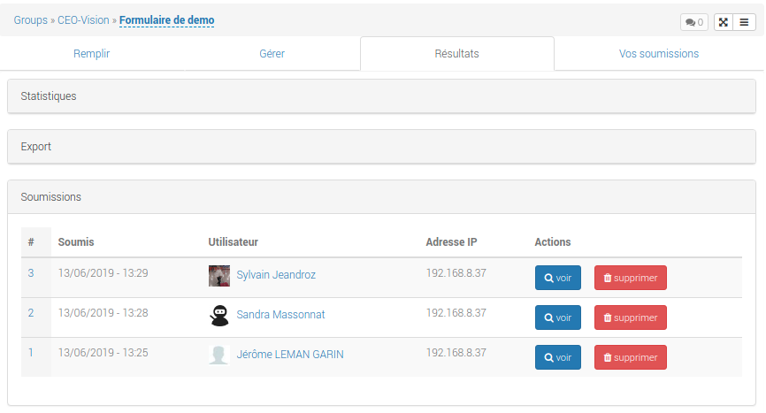

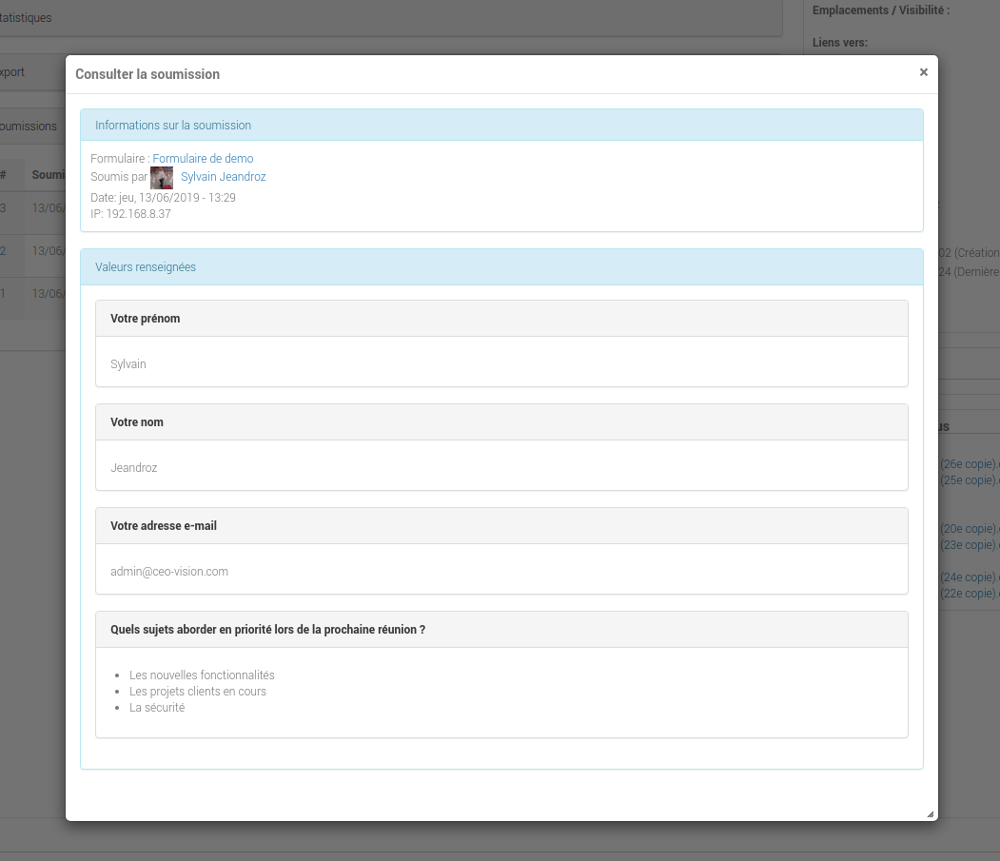

L'entrée "Statistiques" permets d'afficher des statistiques globales
concernant les champs de votre formulaire.

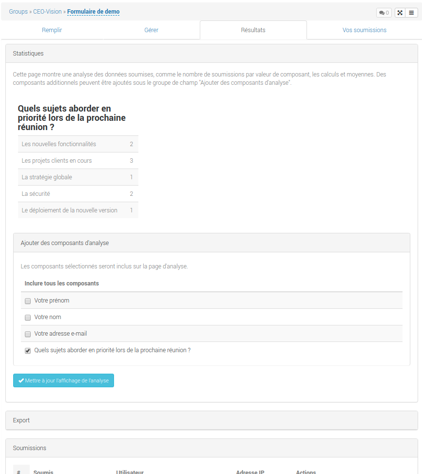

L'entrée "Export" permets d'exporter les statistiques au format CSV.
Il suffit de choisir les champs souhaités et de cliquer sur "Téléchargement".

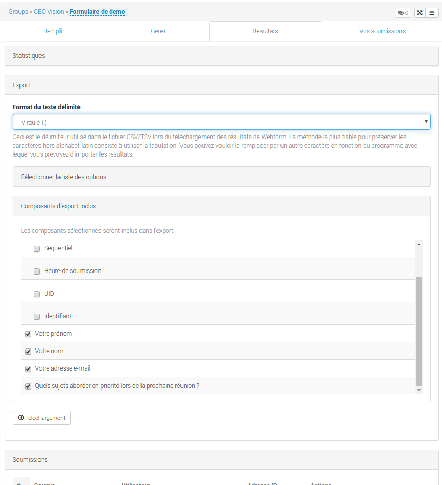

.. figure:: media-guide/form11.png
   :alt:

Créer une Web-conférence/Réunion (Enterprise only)
----------------------------------------------------
    

.. CAUTION:: Les technologies de conférence Web sont assez récentes et nécessitent de bonnes ressources (PC, réseau, ...). Assurez-vous de suivre les pré-requis. En cas de problème consulter les problèmes fréquents : http://gofast-docs.readthedocs.io/fr/latest/docs-gofast-users/doc-gofast-problemes-connus.html#webconference

Il est toujours préférable de créér une webconférence directement dans GoFAST car cela envoie notamment une invitation agenda à tous les participants et permet également de rattacher des contenus à cette évennement (ex.: ordre du jour, ...)

Allez sur l’onglet « Créer », « Réunion ».

Donnez un titre à la webconférence, écrivez un résumé dans la zone de texte, choisissez une date, ajoutez
les participants (écrivez les 3 premières lettres du nom pour avoir les
propositions du système) et « Enregistrez »

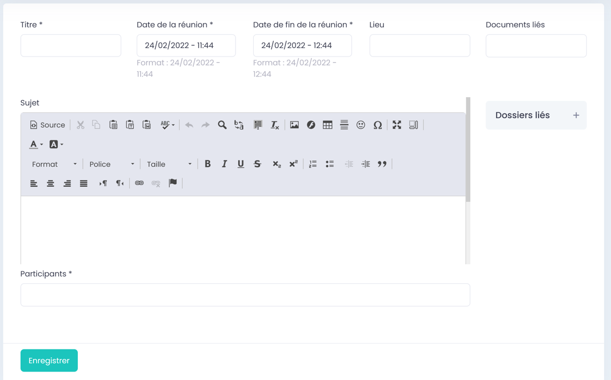

Vous pouvez remplir différents champs lors de la création d'une « Réunion ». 

Vous avez la possibilité d'informer une Date de début et de Fin de la conférence,
le lieu où se déroulera la webconférence et la possibilité de choisir les participants
par Espace collaboratif.

Par exemple, concernant le choix des participants par Espace, vous avez la possibilité d'inviter tous les membres liés à l'Espace Commercial. 

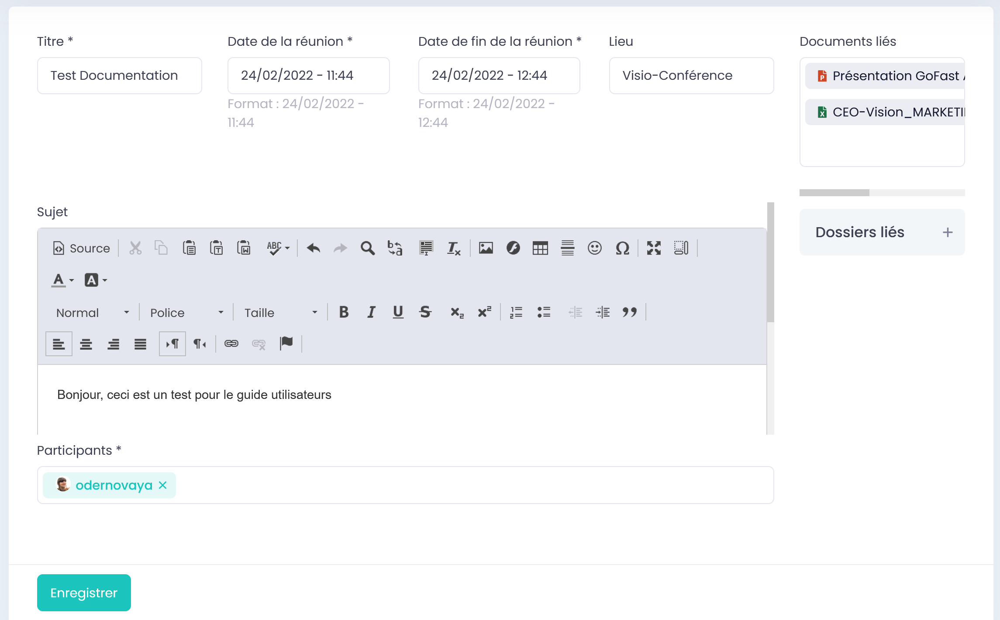

Une fois les participants et la date/heure de conférence introduits, et
après avoir appuyé sur « Enregistrer », une autre fenêtre s’ouvre avec
les données de la conférence.

On y voit la liste des participants, le nom de celui qui a lancé la
conférence, la date et l’heure, un message d’erreur (en rouge) si vous
ne disposez pas des pré-requis nécessaires, …

.. figure:: media-guide/image085.png
   :alt: 

Une invitation par **mail** sera également envoyé aux **participants** avec le titre de
la conférence, un lien URL pour rejoindre la conférence sur GoFAST ou
sur le système de webconference JITSI (SaaS) en cas de secours, la liste des
participants, …

Vous serez en copie de ce mail de notification, ce qui vous permet de
renvoyer le lien URL à n’importe quel moment en cas de problème.

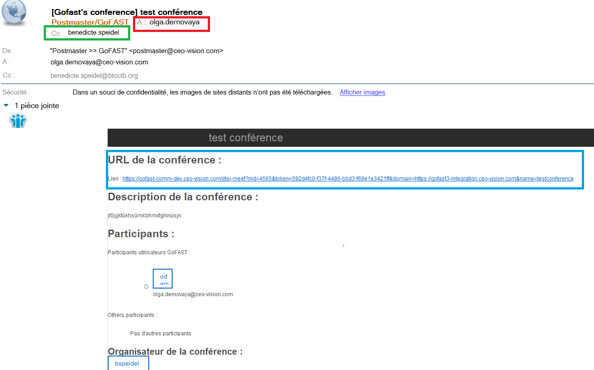

Vous pouvez même enregistrer cet événement **dans votre agenda** (Outlook, Thunderbird,...) en cliquant sur l’icône "Accepter"

.. figure:: media-guide/image088.png
   :alt: 

Si la conférence a été enregistrée pour une autre date à venir, les
participants et vous recevrez un reminder/rappel par mail également,
reprenant les mêmes informations et le lien URL.

.. figure:: media-guide/image089.png
   :alt: 

Gestion des Documents et Travail Collaboratif
=============================================

Lors de la **prévisualisation d’un document**, vous pouvez accéder
à plusieurs **fonctionnalités** liées directement au document .

En page centrale, la prévisualisation de votre document vous permet de
vérifier le contenu en un coup d’œil et voir si c’est le bon document.

Au-dessus de la prévisualisation, il y a le titre du document et le
chemin (path) = l’emplacement où se trouve le document dans
l’arborescence.

A gauche, vous voyez en même temps les autres documents qui se trouvent
dans ce même répertoire.

En haut à droite, encadré en orange sur l’image, vous retrouvez des
raccourcis de fonctionnalités liées au document prévisualisé.
(processus, commentaire, affichage, actions contextuelles)

A droite, se trouvent toutes les métadonnées liées au document : type,
format, statut, langue, emplacement, historique, version, ….

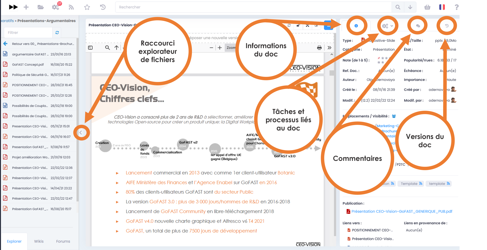

.. NOTE::
   Il se peut que la prévisualisation ne s’ouvre pas
   directement et que vous ayez le message suivant :

.. figure:: media-guide/image374.png
   :alt: 

Il faudra juste cliquer sur la zone bleue « Tenter de prévisualiser à
nouveau ».

Si ça ne fonctionne toujours pas, vous pouvez tout de même accéder aux
fonctionnalités et options liées au document et donc vous pourrez par
exemple télécharger le document malgré tout. Allez dans les actions
contextuelles (3 barres horizontales, dans le coin droit supérieur, à
côté du titre) (voir plus loin pour les détails)

.. figure:: media-guide/image375.png
   :alt: 

Pour rappel, vous pouvez **masquer ou afficher** à tout moment la partie
avec l’\ **arborescence** de vos répertoires/groupes en cliquant sur la
barre grise verticale qui se trouve à gauche de la partie centrale de
l’écran. (prévisualisation ou fil d’activité)

.. figure:: media-guide/image376.png
   :alt: 

Voici en détail, la liste des actions contextuelles (fonctionnalités)
liées au document : parcourir, télécharger, éditer, commenter, …

Vous y accédez par l’icône avec les 3 barres horizontales tout à droite,
sur la même ligne que le titre de votre document. (voir plus bas pour
les détails des Actions contextuelles p.75)

.. figure:: media-guide/image130.png
   :alt: 

Prévisualisation des Documents : fonctionnement et fonctionnalités
------------------------------------------------------------------

La prévisualisation d'un fichier est la possibilité de visualiser le fichier (document, image, vidéo,...) directement dans le navigateur, sans avoir à l'ouvrir avec une application sur son poste de travail.

.. NOTE:: Pour certains types de fichiers (MS-Office ou LibreOffice), une transformation PDF est nécessaire. La transformation MS-Office => PDF est effectuée par Libreoffice (Community) ou OnlyOffice (Enterprise) GoFAST > 3.7

Les principaux formats prévisualisés : 

.. csv-table::  
   :header: "Formats", "Commentaires"
   :widths: 10, 40
   
   "doc,dot,xls,ppt", "transformé en PDF" 
   "docx,dotx,xlsx,pptx","transformé en PDF"
   "odt,ott,ods,odp","transformé en PDF"
   "txt,rtf","transformé en PDF"
   "eps","transformé en PDF"
   "msg","transformé text brut puis PDF"
   "eml","transformé en PDF"
   "jpg,png,gif","directement affiché par le navigateur"
   "svg","directement affiché par le navigateur"
   "mp4","directement lu dans le navigateur (streaming video)"
   "pdf","directement lu dans le navigateur"

Au-dessus de la **prévisualisation** du document, vous voyez une **barre
d’outils noire.**

Celle-ci permet certaines fonctionnalités comme la loupe, le zoom, page
suivante, etc.

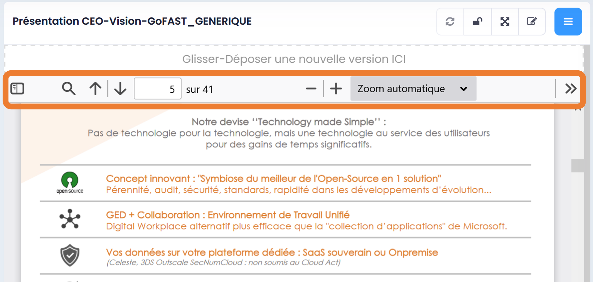

Le premier icône, (carré gris et noir) « **Toggle sidebar** », permet
de voir les « slides/pages » que comprend le document. Vous pouvez ainsi
aller directement sur la page souhaitée. Ce même icône donne accès à 3
autres options **« Show thumbnails », « Show document outline », « Show
attachment »**

.. figure:: media-guide/image378.png
   :alt: 

La **loupe** permet de rechercher un mot dans le texte (= Ctrl+F)

.. figure:: media-guide/image379.png
   :alt: 

Les **flèches** vers le haut ou vers le bas permettent d’aller à la page
précédente ou suivante

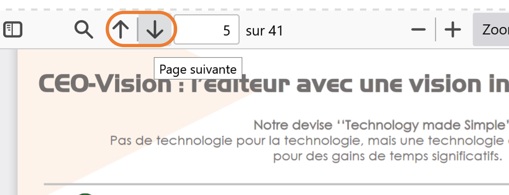

«**Page**» et les numéros permettent de voir combien de pages
comprend le document et vous pouvez changer le numéro pour atteindre la
page souhaitée

.. figure:: media-guide/image381.png
   :alt: 

Le **« -»  et le « + »** permettent de zoomer. Et l’ « \ **Automatic
zoom** » vous donne des dimensions prédéfinies

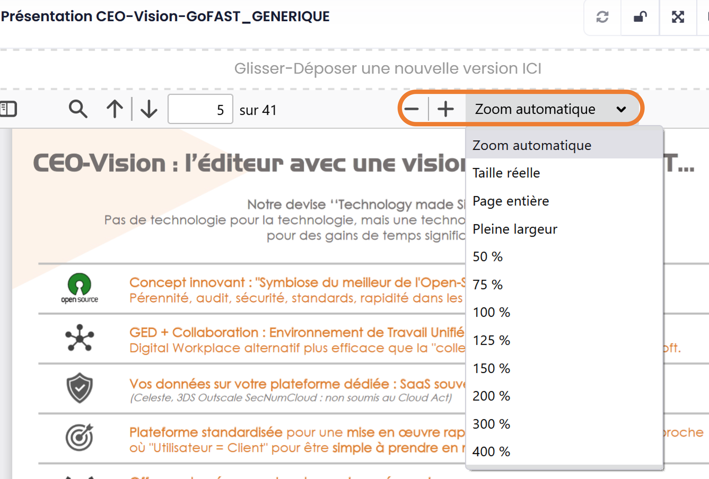

Le dossier blanc avec une flèche noire vers le haut permet **d’ouvrir
votre browser** et d’aller chercher un document sur votre ordinateur.

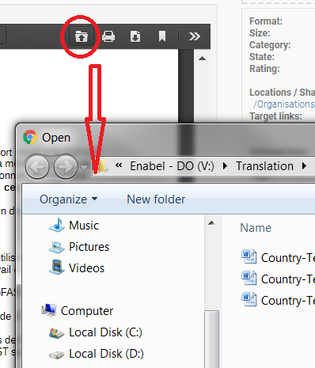

La feuille blanche avec une flèche noire vers le bas permet de
**télécharger** le document en PDF. Vous retrouverez le lien pour
l’ouvrir dans le coin inférieur gauche de votre écran (selon votre
browser)

.. figure:: media-guide/image384.png
   :alt: 
   
.. figure:: media-guide/image385.png
   :alt: 

Un clic-droit sur l’étendard vertical permet plusieurs options, dont
celle d’ouvrir le document ou la **prévisualisation** dans une autre
fenêtre/onglet ou copier le lien (URL).

.. figure:: media-guide/image386.png
   :alt: 

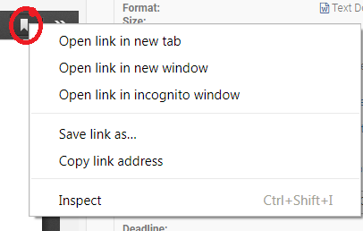

Vous pourrez alors **consulter la version PDF** du document avec les
fonctionnalités PDF associées

.. figure:: media-guide/image388.png
   :alt: 

Et enfin, le dernier icône avec les 2 flèches vers la droites ouvrent
d’autres options, dont « **Enable hand tool** », la petite main qui
permet notamment de monter/descendre dans un PDF sans utiliser le
curseur.

.. figure:: media-guide/image389.png
   :alt: 

Actions sur la page d'un document/contenu
-----------------------------------------

Il y a plusieurs **fonctionnalités liées à un document** telles que :
actualiser l’aperçu, processus et tâches (workflow), pleine page,
actions contextuelles (parcourir, modifier, télécharger, …)

Actualiser l’aperçu
~~~~~~~~~~~~~~~~~~~

Revient à **rafraîchir la page** et permet de mettre à jour la
synchronisation.

.. figure:: media-guide/image131.png
   :alt: 

Processus et tâches / Workflow
~~~~~~~~~~~~~~~~~~~~~~~~~~~~~~

Permet de **confier une tâche** à un autre utilisateur, par rapport à ce
document : demander une contribution, une validation, … Ou de voir
quelles sont les tâches qui vous sont attribuées par rapport à ce
document\ **.(= To Do)**

.. figure:: media-guide/image132.png
   :alt: 

Commenter
~~~~~~~~~~~~~~~~~~~~~~~~~~~

Permet de mettre un **commentaire général** sur le document, qui se
retrouvera en dessous de la prévisualisation et donc sera visible par
tous les membres de ce groupe dès qu’ils arriveront sur la
prévisualisation de ce document.

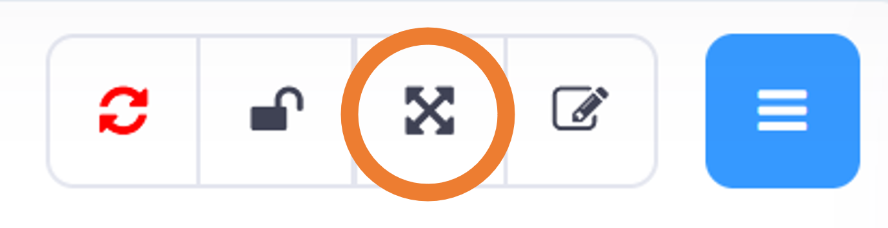
   
Afficher le contenu en pleine page
~~~~~~~~~~~~~~~~~~~~~~~~~~~~~~~~~~

Permet de **masquer** toutes les données autour de la prévisualisation
et ne n’avoir plus que la page du document en vue plein écran.

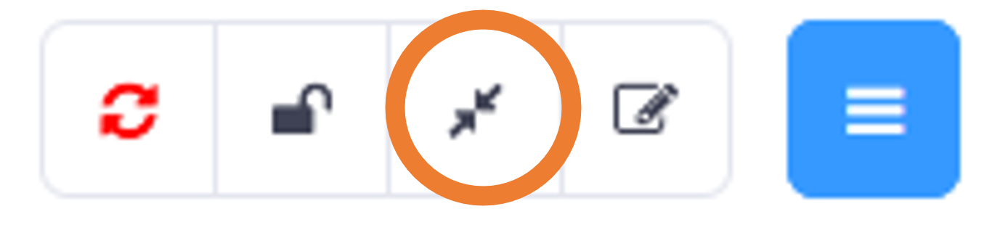

Pour revenir à la prévisualisation normale avec les infos, il suffira
d’appuyer sur le logo à 2 flèches 

.. figure:: media-guide/image135.png
   :alt: 

Actions contextuelles
~~~~~~~~~~~~~~~~~~~~~

Ce sont toutes les **actions qu’on peut faire avec /sur ce document** :
parcourir, télécharger, éditer en ligne/modifier, nouveau commentaire,
envoyer par mail, gérer les traductions, créer une publication, …

.. figure:: media-guide/image136.png
   :alt: 

Actions contextuelles / fonctionnalités sur un document
-------------------------------------------------------

Ces actions liées directement au document que vous prévisualisez peuvent
**varier selon le rôle** que vous avez dans ce groupe
(standard/contributeur, administrateur ou en lecture seule). Et selon
que vous en êtes l’auteur ou pas.

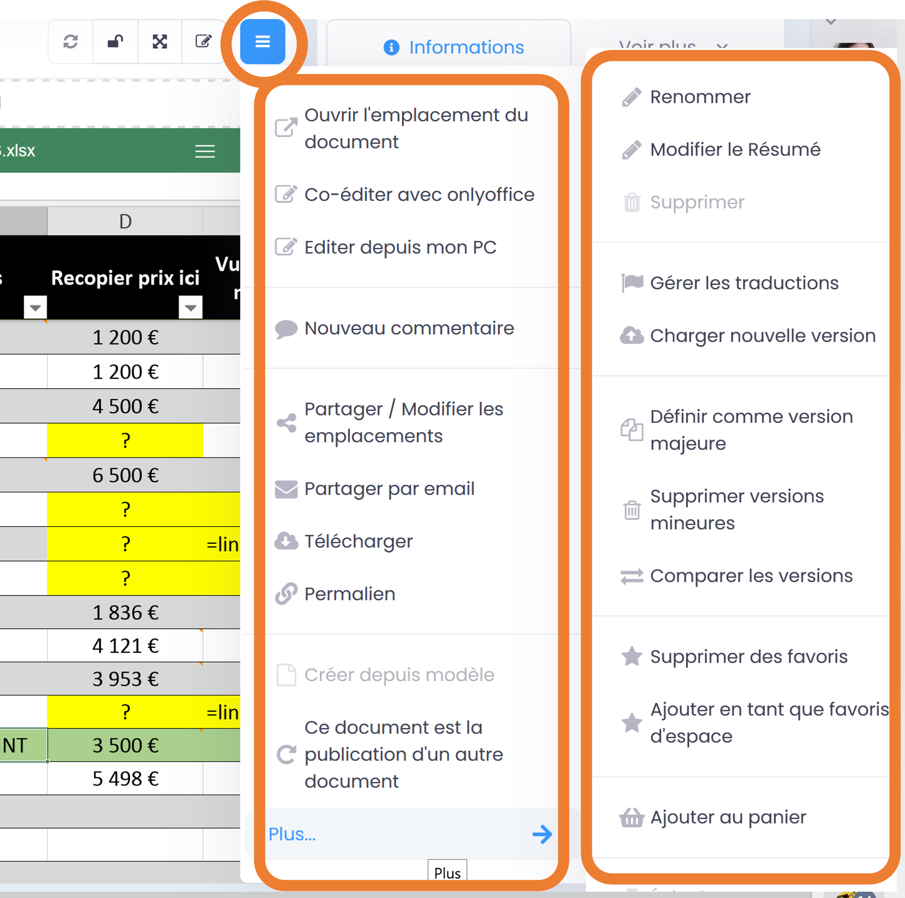

   
Renommer un document
~~~~~~~~~~~~~~~~~~~~

Si vous en avez les droits ou en êtes l’auteur, vous pouvez renommer un
fichier via l’ action contextuelle : «**Rename**».

Changez le nom dans la case blanche et « Appliquez »

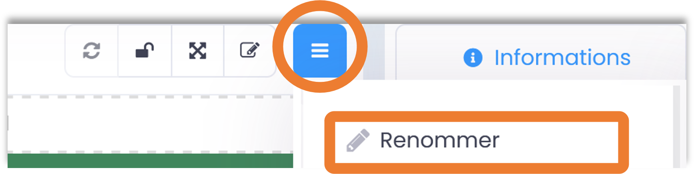
   

.. figure:: media-guide/image139.png
   :alt: 

Faites ensuite un refresh de la page pour être certain que le changement
a été enregistré. Les petites flèches rondes apparaîtront en rouge pour
vous le rappeler.

.. figure:: media-guide/image140.png
   :alt: 

Résumé/présentation d’un document
~~~~~~~~~~~~~~~~~~~~~~~~~~~~~~~~~

Si vous voulez ajouter un genre de résumé/présentation à votre document,
cliquez sur « **Modifier le Résumé** » dans les « actions contextuelles»
dans le coin droit en haut de la prévisualisation du document.

.. figure:: media-guide/image390.png
   :alt: 

Une fenêtre de texte s’ouvre avec les mêmes fonctionnalités que Word :
écrivez votre texte et sauvez en cliquant sur « Appliquer ».

.. figure:: media-guide/image391.png
   :alt: 

Le texte se retrouvera au-dessus de la prévisualisation de votre
document, entre le titre et le document.

.. figure:: media-guide/image392.png
   :alt: 

Si vous voulez changer le contenu de ce résumé, appuyez sur « Modifier
le Résumé», qui apparaît lorsque vous mettez la souris au niveau du
résumé.

.. figure:: media-guide/image393.png
   :alt: 

Télécharger le document
~~~~~~~~~~~~~~~~~~~~~~~

A partir des actions contextuelles de la prévisualisation, vous pouvez
**télécharger le document** afin de l’ouvrir pour lecture ou pour le
sauver sur votre ordinateur.

.. figure:: media-guide/image141.png
   :alt: 

Vous verrez probablement ce message vous demandant si vous voulez
ouvrir, sauver le document ou annuler l’action.

Si vous voulez juste l’ouvrir pour lecture => « Open »

Si vous voulez le sauver ailleurs => « Save » et l’explorateur de votre
ordinateur s’ouvrira pour pouvoir enregistre ce document où vous voulez,
ailleurs que sur la GoFAST.

.. figure:: media-guide/image142.png
   :alt: 

Ou alors il se téléchargera tout seul, et vous le retrouverez dans le
coin inférieur gauche de votre écran

.. figure:: media-guide/image394.png
   :alt: 

.. NOTE::
    Si vous téléchargez un document, que vous y apportez
    des modifications, elles ne seront pas synchronisées sur la GoFAST.
    Il faudra remettre le document au même emplacement (glisser/coller
    comme nouvelle version) pour que GoFAST les prennent en compte. Cela
    porte un risque car si un autre collègue a fait des modifications en
    ligne pendant au même moment, vous allez écraser sa version actuelle
    et ses modifications seront donc perdues.

Charger une nouvelle version du document
~~~~~~~~~~~~~~~~~~~~~~~~~~~~~~~~~~~~~~~~

Via les actions contextuelles de la prévisualisation, vous pouvez
**charger une nouvelle version du document**, ce qui revient à écraser
l’ancienne version et à repartir de celle que vous venez de charger
comme nouvelle base de travail. Vous pouvez même la rendre « Version
majeure ».

.. figure:: media-guide/image150.png
   :alt: 

Aller chercher la nouvelle version du document sur votre ordinateur via
le bouton « Browse », terminez avec « Open ». Le nom du fichier apparaîtra sur
la ligne grise.

Choisissez de la rendre version majeure (1.36 => 2.0) en cochant la case
« Enregistrer comme version majeure », ajoutez un commentaire si vous
voulez et terminez avec « Valider »

.. figure:: media-guide/image151.png
   :alt: 

Par conséquent le numéro de version changera dans les métadonnées.

.. figure:: media-guide/image152.png
   :alt: 

Glisser-déposer une nouvelle version 
~~~~~~~~~~~~~~~~~~~~~~~~~~~~~~~~~~~~

.. figure:: media-guide/image153.png
   :alt: 

Le fait de **glisser une nouvelle version** de votre document à cet
endroit (dans la fenêtre des métadonnées liées au document) va écraser
la précédente mais conservera toutes les anciennes versions (=>
historique). Le système vous demandera alors si vous voulez qu’elle
devienne une version majeure (passer de 1.0 à 2.0 par exemple = nouvelle
base de travail). Les autres petites modifications précédentes étant
considérées comme des versions mineures à chaque fois qu’il y a eu une
sauvegarde sur le document.

Si pouvez également ajouter un commentaire sur cette nouvelle version.

Terminez par « Valider »

.. figure:: media-guide/image154.png
   :alt: 

Vous pouvez retrouver les versions précédentes en bas des métadonnées
également.

.. NOTE::
    Vous ne pouvez glisser/coller que des documents de
    même format, ce qui veut dire que vous ne pouvez pas remplacer une
    version avec une extension « doc » par une version « docx » et
    vice-versa.

Sinon voici le message d’erreur que vous aurez

.. figure:: media-guide/image155.png
   :alt: 

Si vous chargez une nouvelle version mais que le nom du fichier est
différent, vous recevrez ce message.

.. figure:: media-guide/image156.png
   :alt: 

Gérer les traductions du document
~~~~~~~~~~~~~~~~~~~~~~~~~~~~~~~~~

Si le document existe en **plusieurs langues**, vous pouvez les **lier
entre elles** pour ainsi passer d’une version de document à sa
traduction en un clic .

Dans les actions contextuelles, prenez l’option « Gérer les
traductions » dans « voir plus d’options »

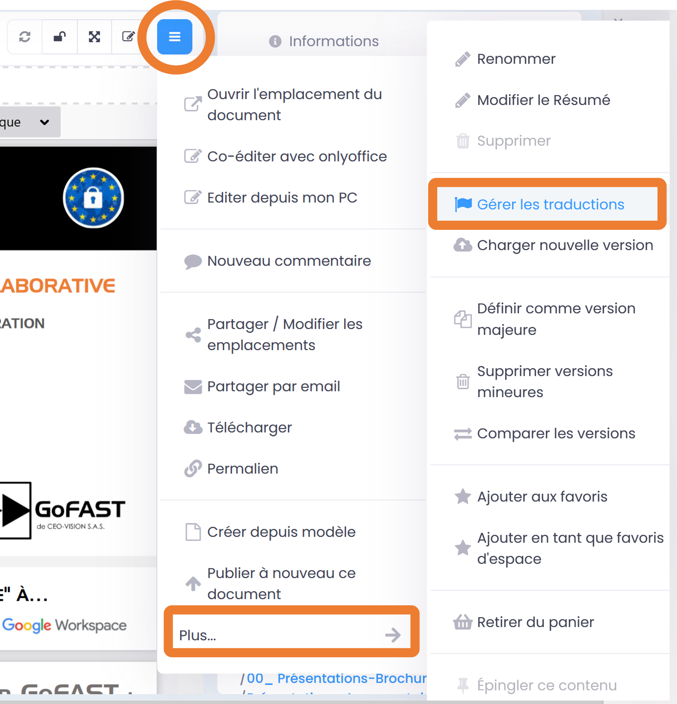

Une fenêtre avec plusieurs champs s’ouvre, ceux-ci correspondent aux
traductions possibles.

Pour notre exemple, prenons la version en Français à laquelle on veut
lier la version en Anglais. On part donc de la prévisualisation du
document en français.

Et on remplit le champ de la version anglaise. Il suffit d’écrire les 3
premières lettres du nom du fichier anglais et le système vous donnera
des propositions, sélectionnez votre document et terminez avec « Mettre
à jour les traductions ».

.. figure:: media-guide/image168.png
   :alt: 

Dans les métadonnées, il sera à présent indiqué les différentes
versions/traductions dans lesquelles on peut trouver ce document. Le
1\ :sup:`er` drapeau étant le document d’origine que vous prévisualisez
et les drapeaux suivants sont les traductions existantes.

Il suffit de cliquer sur les différents drapeaux pour prévisualiser les
autres traductions.

.. figure:: media-guide/image169.png
   :alt: 

.. NOTE::
   GoFAST ne permet pas de traduire des documents, il s’agit
   ici de documents qui existent déjà en différentes langues et qu’on veut
   lier par facilité pour pouvoir passer d’une à l’autre en un clic.

Partager le document par mail
~~~~~~~~~~~~~~~~~~~~~~~~~~~~~

Via les actions contextuelles de la prévisualisation, vous pouvez **envoyer un lien sécurisé** sur le document directement **par email** à un utilisateur, une liste d'utilisateur, les membres d'un Espace Collaboratif ou bien à une adresse email externe. Le document sera donc automatiquement attaché à votre message. Ce lien est contextuel : les utilisateurs ayant accès au document pourront consulter sa page avec tous les détails, alors que les non-utilisateurs auront un lien de téléchargement valable 14 jours avec accusé de téléchargement.

.. NOTE:: Cette méthode est nettement plus sécurisée (RGPD) et auditable que l'envoi d'un email classique avec des pièces jointes sensibles
   
.. NOTE:: Ceci permet notamment de ne plus surcharger votre boîte mail avec
   des pièces jointes lourdes destinée à des personnes n'ayant pas de
   comptes GoFAST.

.. figure:: media-guide/image170.png
   :alt: 

Choisissez les destinataires en écrivant les 3 premières lettres de leur
nom/prénom (le système vous proposera des utilisateurs) ; leur nom et
photo se retrouveront dans la barre des destinataires. Vous pourrez
d’ailleurs annuler des noms en cliquant sur la petite croix rouge à côté
de leur profil.

Le sujet est automatiquement généré.

Le lien vers le document est également automatiquement attaché.

Ecrivez votre message et « Envoyez »

.. figure:: media-guide/image171.png
   :alt: 

Le destinataire recevra une **notification par mail** et verra également
un petit numéro à côté de l’enveloppe dans la barre des fonctionnalités
générales de la GoFAST lui indiquant qu’il a reçu un nouveau message.

Pareil pour vous lorsque que vous recevrez un nouveau message par mail
via la GoFAST.

.. figure:: media-guide/image172.png
   :alt: 

.. NOTE::
   Pour que les non-utilisateurs de la plateforme puissent
   également avoir accès à certains documents, les liens attachés au mail
   sont utilisables pendant 15 jours. Une fois le document téléchargé, les
   non-utilisateurs peuvent le consulter de suite.

**Exemple** de mail/notification reçu dans votre boîte mail normale,
vous invitant à cliquer sur le lien attaché pour visualiser un document.
Avec le message pour les non-utilisateurs de GoFAST (qui n’ont pas de
compte GoFAST) signalant que ce lien est utilisable 2 semaines à partir
de la date de réception du mail.

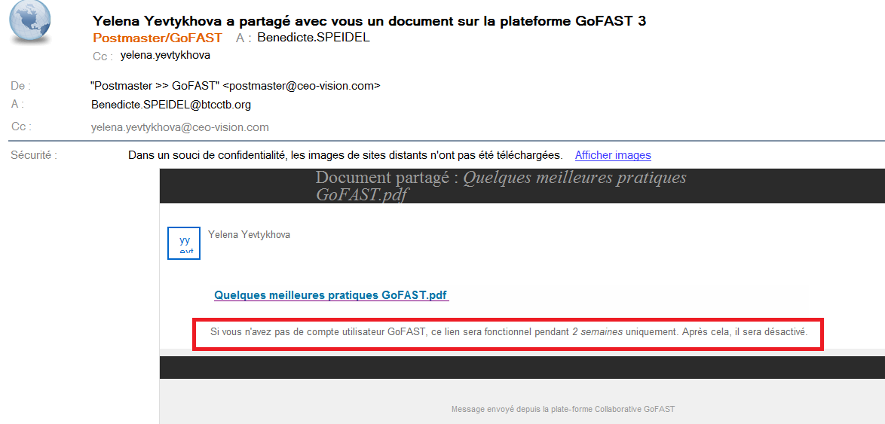

Créer une publication du document
~~~~~~~~~~~~~~~~~~~~~~~~~~~~~~~~~

Faire d’un document une publication consiste à en copier une version
donnée dans un autre espace, d'éventuellement le transformer en PDF pour
le **rendre non modifiable.**

.. figure:: media-guide/image174.png
   :alt: 

L’avantage de faire une publication est de garder la version d’origine
en Word/Excel/Power Point liée au document publié (généralement en PDF),
même si la publication se trouve dans un autre emplacement.

.. NOTE::    
    Vous pouvez donc avoir 20 versions de travail d’un document
    Office au sein d'un service avec des commentaires et ne publier que
    la version finale sans les commentaires pour tous les autres
    utilisateurs.

Vous pouvez choisir où sera la publication de votre document de
travail, où il apparaîtra uniquement en PDF. Cochez la case
correspondant à l’emplacement voulu pour la publication. Et « Valider »

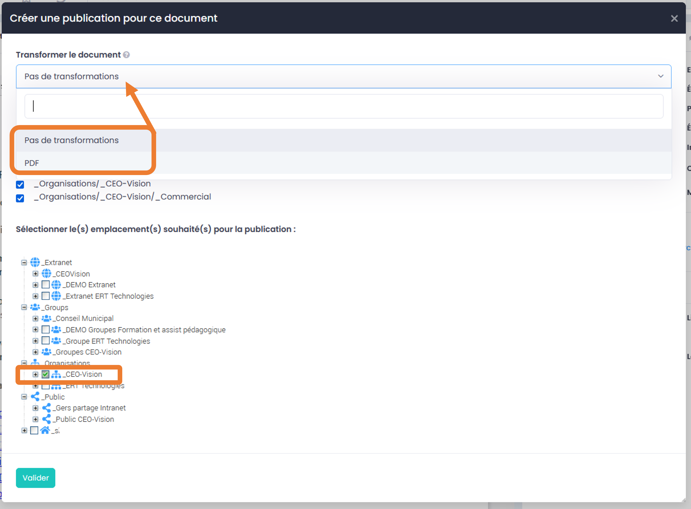

Vous verrez alors dans les métadonnées de ce document que c’est devenu
une publication et les emplacements de la publication par rapport au
document d’origine.

.. NOTE::
   Le document publié possède un nom se terminant par \_PUB

.. figure:: media-guide/image176.png
   :alt: 

Vous pouvez de la même manière supprimer une publication, cette action
ne supprimera que le document publié (le PDF) mais pas le document
d’origine (Word/Excel/Powerpoint).

.. figure:: media-guide/image177.png
   :alt: 

Archiver le document
~~~~~~~~~~~~~~~~~~~~

**Archiver un document** permet de le rendre invisible dans la
recherche, à moins de spécifier l’option « inclure les contenus
archivés », sans qu’il soit complètement supprimé de la GoFAST. Et de ce
fait, vous ne pouvez plus travailler dessus.

.. figure:: media-guide/image178.png
   :alt: 

Le document aura désormais le statut « archivé » et toutes ses versions
mineures seront effacées.

Un message vous redemande donc si vous êtes certain de vouloir archiver,
si oui, appuyez sur « Archive »

.. figure:: media-guide/image179.png
   :alt: 

Une fois le **document archivé**, il apparaîtra dans les métadonnés que
vous pouvez juste le lire => « en lecture seule », et son état est
« archivé ». Plus aucune modification n’est donc possible sur un
document « archivé ».

Il se peut aussi, lorsque vous voulez visualiser un document, que vous
voyez un message orange vous signalant qu’il est en statut « archivé »
et que si vous voulez retravailler dessus, il faut demander à
l’administrateur du groupe de le désarchiver.

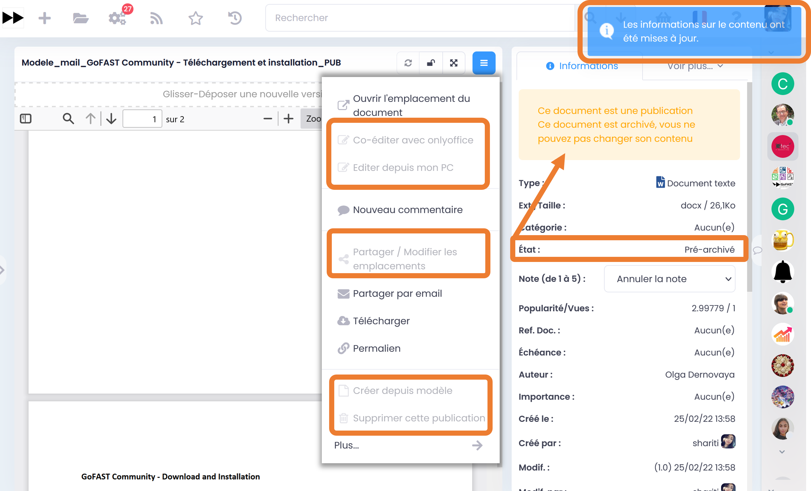

Vous pouvez inverser le processus et désarchiver le document pour le
rendre actif à nouveau.

.. figure:: media-guide/image181.png
   :alt: 

Cliquez sur « Unarchive »

.. figure:: media-guide/image182.png
   :alt: 

Il n’y à présent plus de message dans les métadonnées et l’état est
redevenu normal ou comme à l’origine.

.. figure:: media-guide/image183.png
   :alt: 

Vous pouvez aussi voir l’état de vos documents dans l’onglet
« Activité » du groupe, dans l’encadré « Contenus avec Etat », à
condition que son état ait bien été enregistré dans les métadonnées
(voir § sur les métadonnées d’un document p.106)

.. figure:: media-guide/image184.png
   :alt: 

Supprimer le document
~~~~~~~~~~~~~~~~~~~~~

**Supprimer un document** de la GoFAST revient à le supprimer de toutes
vues définitivement, donc Attention !!! si vous le supprimez à un
endroit et qu’il était multifilé, il sera supprimé partout.

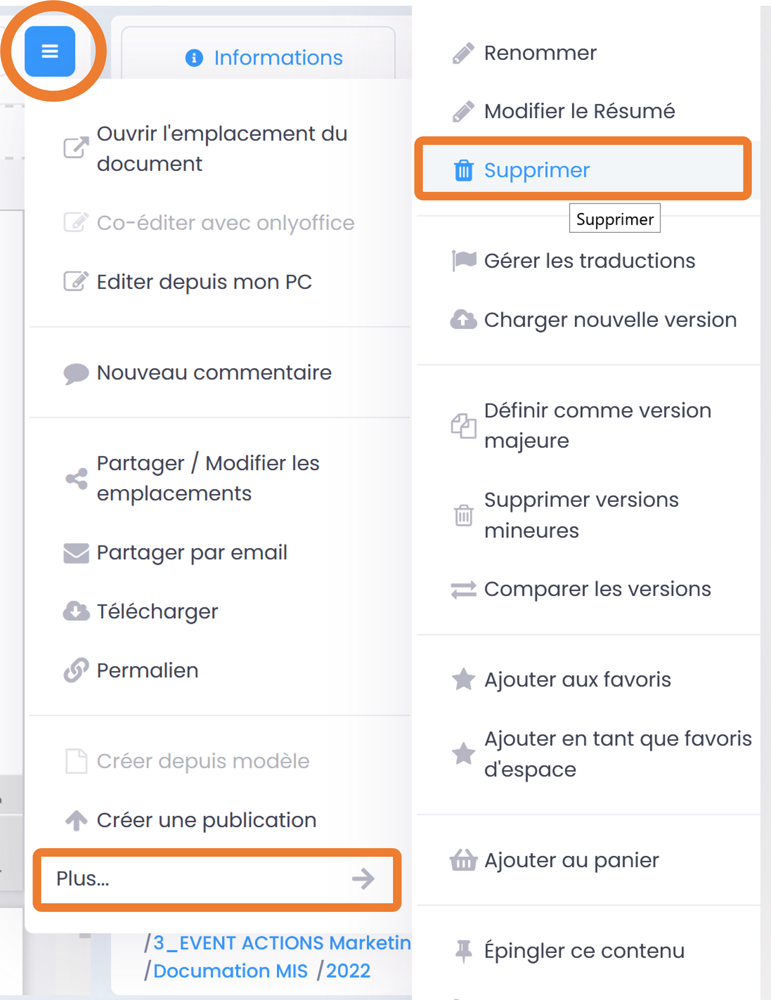

Seul l’auteur du document ou les administrateurs de l’espace où était le
document pourront le restaurer en cas de suppression erronée ; le
document leur étant encore accessible pendant 90 jours avant de
disparaître définitivement du système.

Ajouter le document aux favoris
~~~~~~~~~~~~~~~~~~~~~~~~~~~~~~~

**Ajouter un document aux favoris** permet de créer des **raccourcis**
pour atteindre ce document car ils se retrouveront à un endroit
accessible à tout moment.

.. figure:: media-guide/image186.png
   :alt: 

Lorsque vous cliquez sur l’option « Ajouter aux favoris », dans les
actions contextuelles de la prévisualisation, apparaît, en haut à
droite, un message vert vous confirmant que le contenu a été ajouté à
vos favoris.

.. figure:: media-guide/image187.png
   :alt: 

La prochaine fois que vous voulez accéder à ce document, il suffira
d’aller sur **l’étoile** dans le menu principal de la GoFAST pour voir
la liste de vos documents favoris.

Cliquez sur votre fichier pour l’ouvrir, ou cliquez sur la poubelle à
droite du titre de votre fichier pour le supprimer de cette liste.

.. figure:: media-guide/image188.png
   :alt: 

Un message en vert vous confirmera sa suppression de la liste des
favoris.

.. figure:: media-guide/image189.png
   :alt: 

Ajouter le document aux favoris publics
~~~~~~~~~~~~~~~~~~~~~~~~~~~~~~~~~~~~~~~

.. figure:: media-guide/image190.png
   :alt: 

.. figure:: media-guide/image191.png
   :alt: 

Vous pouvez faire l’inverse et le supprimer des favoris publics, avec
l’option « Supprimer des favoris publics » dans les actions
contextuelles de la prévisualisation.

.. figure:: media-guide/image192.png
   :alt: 

Permalien du document
~~~~~~~~~~~~~~~~~~~~~

Le permalien d’un document est son **lien « URL »,** que vous pouvez
copier et coller où vous voulez pour renvoyer à ce document en un clic.
(dans un mail par exemple)

Dans la actions contextuelles de la prévisualisation, appuyer une fois
sur l’option « Permalien », vous verrez un message en bleu signalant que
le lien est prêt à être copié ailleurs. Collez le où vous voulez.

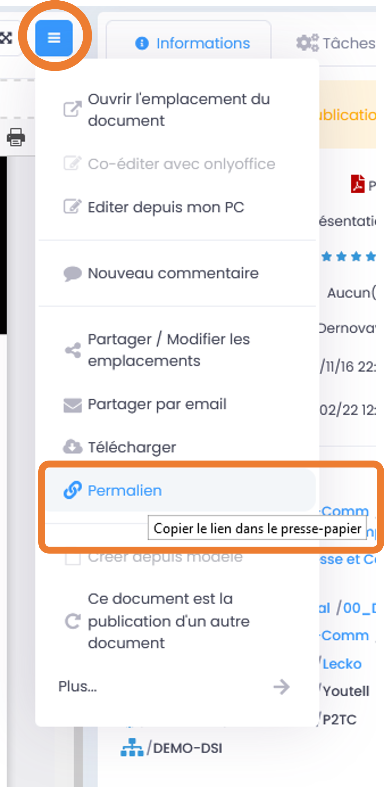

.. figure:: media-guide/image194.png
   :alt: 

Vous pouvez retrouver le permalien également dans les raccourcis à
partir du fil d’activité. Appuyez sur l'icône d'actions contextuelles sous le nom du
fichier pour ouvrir la liste des fonctionnalités, puis appuyez sur
« Permalien » pour copier le lien.

.. figure:: media-guide/image397.png
   :alt: 

Voici ce que ça donne lorsque vous le coller :
*https://gofast3-integration.ceo-vision.com/node/4551*

Il suffira de cliquer dessus pour être renvoyé sur la GoFAST et sur la
prévisualisation du document. (cfr : si vous n’êtes pas membre du groupe
dans lequel se trouve ce document, vous n’y aurez pas accès, d’où
l’avantage encore une fois de multifiler les documents dans plusieurs
groupes).

Encore un autre raccourci pour le lien URL d’un document: via les
derniers contenus vus, sélectionnez le document, clic-droit de la souris
pour ouvrir la fenêtre avec l’option « Copy link address ». Ensuite
coller l’URL où vous voulez.

Ou ouvrez carrément le document sur un autre onglet/fenêtre Window avec
l’option « Open link in new tab/window »

.. figure:: media-guide/image398.png
   :alt: 

Ouvrir l’emplacement du document
~~~~~~~~~~~~~~~~~~~~~~~~~~~~~~~~

Lorsque vous prévisualisez un document, vous pouvez voir le
**cheminement** (path), le trajet dans l’\ **arborescence** avec les
niveaux supérieurs de répertoires et espaces. (encadré en vert sur l’image).

Si vous voulez voir les détails de l’arborescence et l’emplacement du
document que vous visualisez par rapport à cette arborescence, vous
pouvez ouvrir l’explorateur de fichiers à partir des actions
contextuelles de lhb va prévisualisation, en cliquant sur « Ouvrir
l’emplacement du document ».

.. figure:: media-guide/image195.png
   :alt: 

Voici le genre de vue que vous aurez, où vous retrouverez votre document
et son emplacement par rapport au reste de l’arborescence GoFAST.

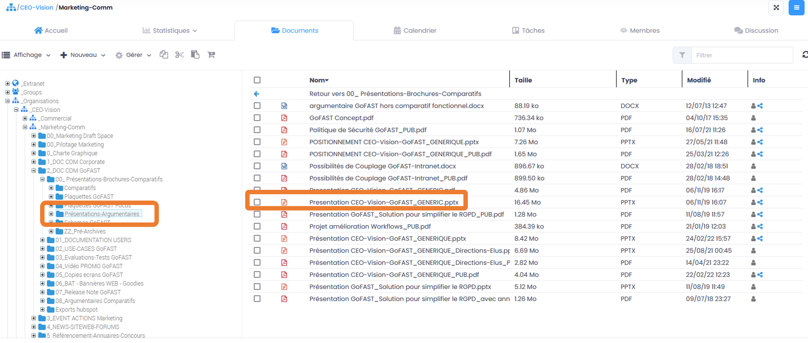

De là, vous pouvez naviguer dans l’arborescence, chercher d’autres
documents, utiliser les raccourcis, …

S’abonner au document
~~~~~~~~~~~~~~~~~~~~~

Voir aussi "Vos abonnements"

**S’abonner à un document** permet de **rester au courant** de ce qu’il
se passe par rapport à ce document ; vous recevrez une notification par
mail dès qu’il y a activité sur ce document : une modification, un
commentaire, une mise à jour des métadonnées, …. Vous pouvez choisir
l’intervalle de ces notifications (instantanément, 2x/jour, 1x/jour,
1x/semaine, 1x/mois).

Allez dans les actions contextuelles de la prévisualisation et cliquez
sur « S’abonner »

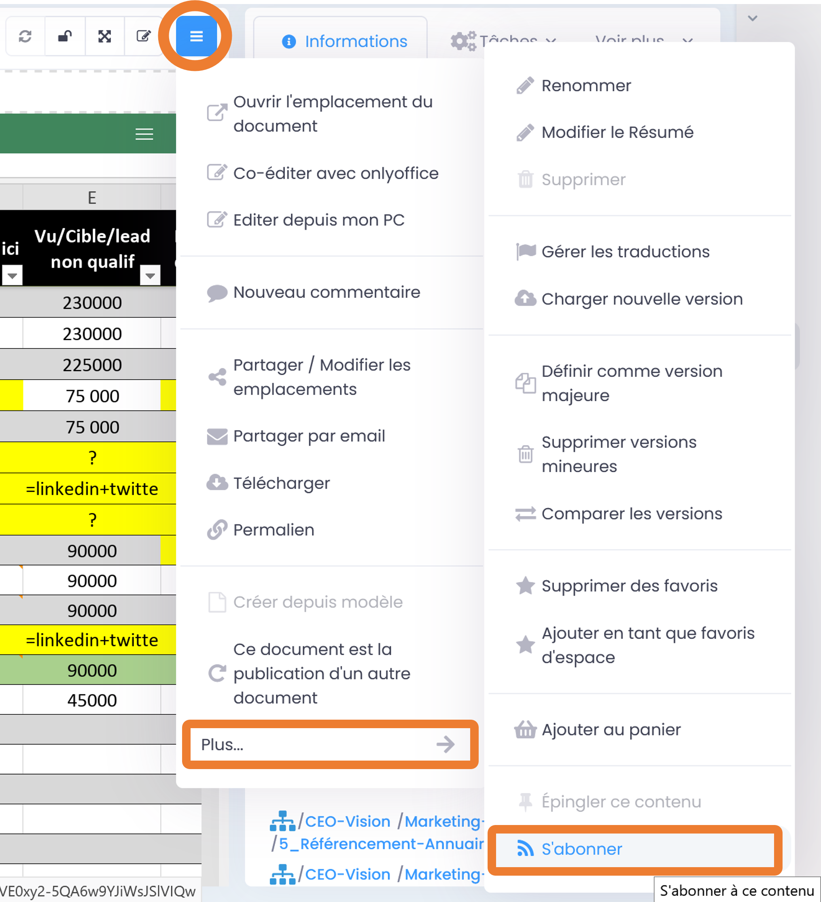

Un message en vert, dans le coin droit supérieur, vous confirme votre
abonnement à ce contenu.

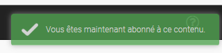

Vous voir vos abonnements et gérer leurs intervalles, cliquez sur la
flèche à côté de votre nom de profil puis sur « Abonnements »

.. figure:: media-guide/image199.png
   :alt: 

Vous retrouvez toute la liste de vos abonnements à des espaces/groupes
ou documents. Vous pouvez choisir les intervalles dans la colonne
« Fréquence », en cliquant sur la petite flèche, vous aurez les
propositions d’intervalles, sélectionnez celles que vous souhaitez pour
chaque abonnement.

.. figure:: media-guide/image200.png
   :alt: 

De la même manière, vous pourrez également vous désabonner quand vous
voulez.

Un message vert vous confirmera votre désabonnement à ce contenu.

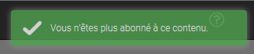

Comparer deux versions d'un document (beta en v3.6)
~~~~~~~~~~~~~~~~~~~~~~~~~~~~~~~~~~~~~~~~~~~~~~~~~~~
Pour afficher les écarts entre deux versions d’un même document, vous avez la possibilité de lancer le comparatif via le menu "Burger" (actions contextuelles).

.. figure:: media-guide/Ecran-GoFAST_Comparatif-Versions_lancer-le-comparatif.png
   :alt: 

Sélectionnez dans les deux listes les deux versions que vous souhaitez comparer : 

.. figure:: media-guide/Ecran-GoFAST_Comparatif-Versions_lancer-le-comparatif-choix-versions.png	
   :alt: 
   

Créer une version majeure du document
~~~~~~~~~~~~~~~~~~~~~~~~~~~~~~~~~~~~~

Dès que vous faites une modification sur un document avec la
fonctionnalité « Editer en ligne » et que vous la sauver, une nouvelle
version du document est générée (1.0=>1.1, 1.2, 1.3, etc), ce qu’on
appelle des «Version mineures ». Mais vous pouvez écraser ces versions
mineures avec une version majeure, c’est-à-dire une nouvelle base de
travail (1.11 =>2.0).

**Importance des versions majeures :**

-  Si vous archivez un document, ses versions mineures seront
   supprimées, seule sa dernière version majeure sera encore accessible.

-  Pareil si un document est supprimé par erreur, seule sa dernière
   version majeure sera récupérable.

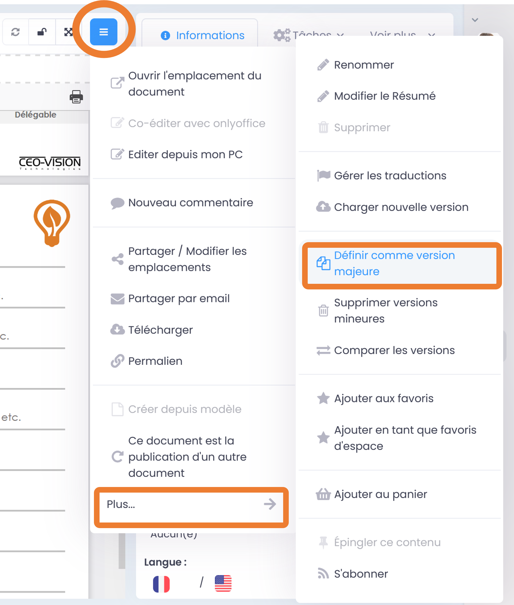

Vous pouvez également ajouter un commentaire à cette nouvelle version
majeure. Celui-ci sera visible sous la prévisualisation.

Terminer avec « Valider »

.. figure:: media-guide/image203.png
   :alt: 

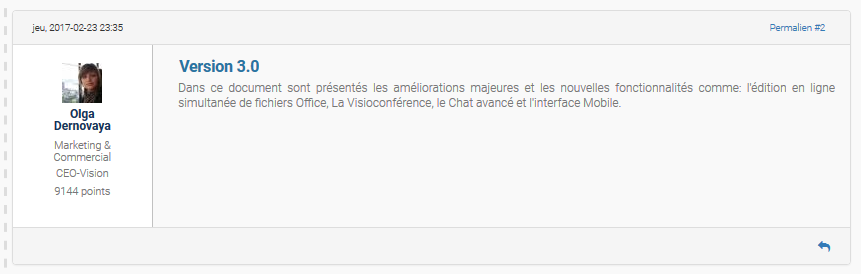

Dans les métadonnées, vous verrez le changement de numéro des versions
(1.2=> 2.0 ou 3.0,etc), quand le 1\ :sup:`er` chiffre change, c’est une
version majeure. Sinon ça reste une version mineure.

Vous verrez également un nouveau commentaire par rapport à la version
majeure xx.

.. figure:: media-guide/image205.png
   :alt: 

Voir aussi "Glisser et déposer une nouvelle version"

Supprimer les versions mineures du document
~~~~~~~~~~~~~~~~~~~~~~~~~~~~~~~~~~~~~~~~~~~

Comme signaler plus haut, pour une raison d’espace de stockage et
**éviter de surcharger** la plateforme inutilement, vous pouvez
**supprimer des versions mineures** qui n’ont plus d’intérêt.

Dès lors que vous en faites une version majeure et que vous ne devez
plus consulter les versions mineures antérieures, cela ne pose pas de
problème d’historique.

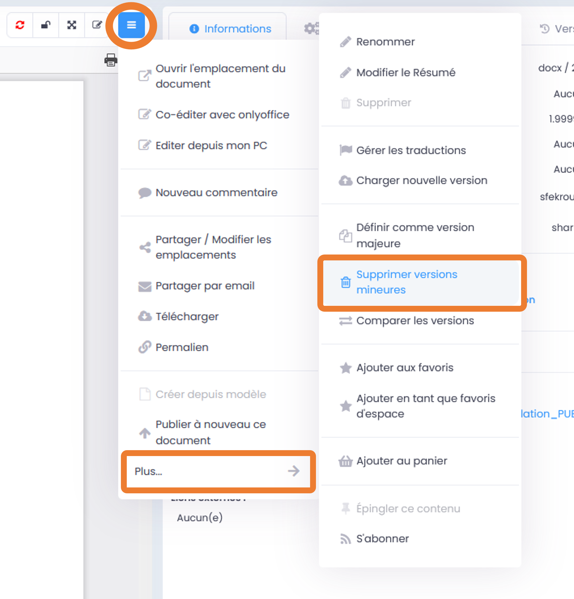

Un message vous avertit de la suppression définitive et irréversible des
versions mineures précédentes. Si vous êtes d’accord, appuyez sur
« Supprimer ».

.. figure:: media-guide/image207.png
   :alt: 

Dans les métadonnées, vous ne verrez désormais plus que les versions
majeures de ce document, plus aucune version mineure ne sera disponible.

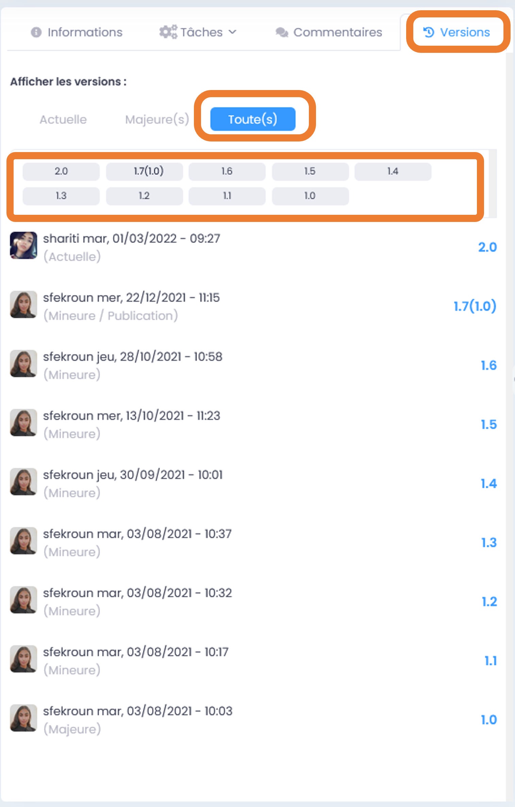

Commentaires et Annotations des documents
-----------------------------------------

Commentaire sur le document
~~~~~~~~~~~~~~~~~~~~~~~~~~~

Pour réduire le nombre d'emais et sécuriser les échanges, il est possible de faire des **commentaires** sur les documents. Ceux-là seront affichés sous la prévisualisation et visible par ceux qui ont accès au dit document.

Il n’y a donc même pas besoin d'ouvrir le fichier pour lire les commentaires.

A ne pas confondre avec les commentaires faits diréctement dans le fichier, qui se retrouvent dans le contenu même du document.

Pour ajouter un commentaire, cliquez sur « Nouveau commentaire » dans le menu des actions contextuelles.

.. figure:: media-guide/image143.png
   :alt: 

Une fenêtre s’ouvre où vous pouvez écrire le titre de votre commentaire et son contenu, puis « Enregistrez ». 

.. figure:: media-guide/image144.png
   :alt: 

Le commentaire se retrouve sous la prévisualisation du document et vous pouvez le modifier ou le supprimer à tout moment. De la même manière, vous pouvez répondre à un autre commentaire existant.

Vous retrouverez également le titre des commentaires dans l'index (bloc sur la droite sous les métadonnées). Cela permet de naviguer plus facilement entre les divers commentaires.

.. figure:: media-guide/image145.png
   :alt: 

.. NOTE:: Dans le cas d'une réponse à un commentaire existant, le titre est pré-rempli avec le titre de celui-ci préfixé de "Re:"(pour réponse). Il est toutefois possible de le modifier, si l'utilisateur le souhaite.

Les utilisateurs qui ont accès à ce document verrons un numéro dans l’icône commentaire (en haut de la prévisualisation, à droite du titre du document) indiquant qu’il y a des nouveaux commentaires. L’icône est alors de couleur rouge.

.. figure:: media-guide/image146.png
   :alt: 

Commentaires partagés ou privés
~~~~~~~~~~~~~~~~~~~~~~~~~~~~~~~

Au moment où on fait un commentaire, on a le choix entre "privé" ou "partagé". Attention : par défaut, le commentaire est partagé.

.. figure:: media-guide/Commentaire1.png
   :alt: 

.. figure:: media-guide/Commentaires2.png
   :alt:
   
Le commentaire privé est visible uniquement par l'utilisateur qui l'a rédigé. Le commentaire partagé est visible par les utilisateurs ayant accès au document.

Il est possible de modifier la visibilité du commentaire en l'éditant, puis en décochant "privé".

Si jamais le commentaire est "partagé" et qu'on veut changer pour "privé" : le commentaire et les éventuelles réponses au commentaire laissées par les autres utilisateurs deviennent privés.

Si le commentaire est supprimé, les réponses à ce commentaire le sont également. 

.. NOTE:: Le super administrateur a la possibilité de cocher/décocher une case sur le profil d'un utilisateur pour lui interdire/autoriser les commentaires partagés. Dans ce cas, l'utilisateur ne pourra faire que des commentaires privés. 

.. NOTE:: Il n'y a pas de notification email, ni dans le fil d'activité pour les commentaires privés. 

   
Annotations contextuelles sur la prévisualisation
~~~~~~~~~~~~~~~~~~~~~~~~~~~~~~~~~~~~~~~~~~~~~~~~~

Les annotations permettent de commenter une **partie du texte** sur la prévisualisation, plutôt que de faire un commentaire général. Très pratiques dans le cadre d'une relécture/correction des documents de travail. 

Pour **annoter un mot ou un paragraphe** il suffit de séléctionner le texte souhaité : une icône avec un crayon apparaît, cliquez dessus pour ouvrir la fenêtre d'annotation, rédigez votre annotation, puis enregistrez.

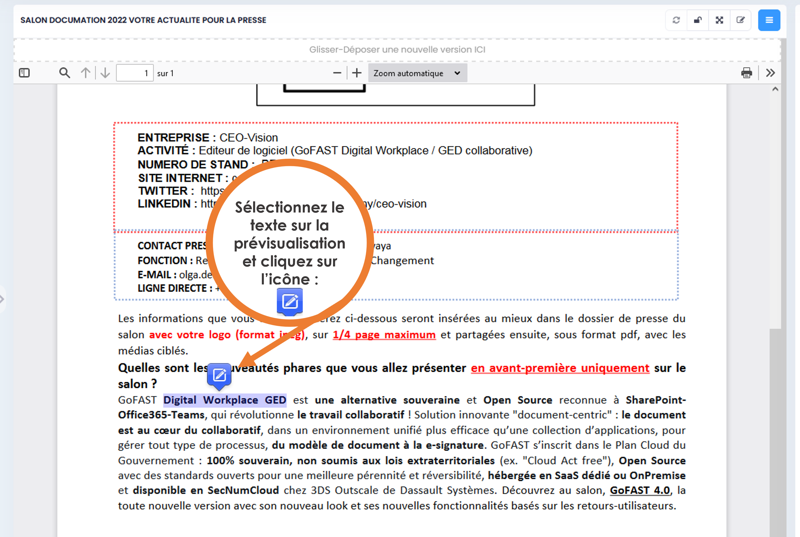
   
.. figure:: media-guide/image148.png
   :alt: 

Vous verrez l’endroit que vous avez annoté surligné en jaune dans la prévisualisation et en cliquant dessus, vous verrez le contenu de l’annotation.

.. ATTENTION::
   Les annotations ne sont que sur une version donnée du document, si la version est mise à jour, vous ne verrez plus
   l'annotation dans la prévisualisation, mais celle-ci reste dans les commentaires en dessous du document.

.. figure:: media-guide/image149.png
   :alt: 

Vous pourrez également retrouver votre annotation sous la prévisualisation, comme les commentaires, avec la précision de quelle
version a été annotée.

Annotations partagées ou privées
~~~~~~~~~~~~~~~~~~~~~~~~~~~~~~~~

Au moment où on fait une annotation, on a le choix entre "privé" ou "partagé". Attention : par défaut, l'annotation est partagée.

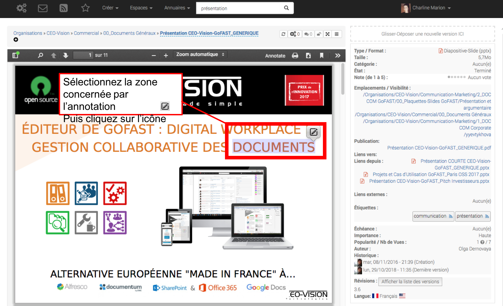

.. figure:: media-guide/Annotation2.png
   :alt:

L'annotation privée est visible uniquement par l'utilisateur qui l'a rédigée. L'annotation partagée est visible par les utilisateurs ayant accès au document. 

Dans le cas d'une annotation privée, cela génère un commentaire qui est lui aussi privé.

Il est possible de modifier la visibilité de l'annotation en retournant dessus et en décochant "privé". Il en est de même pour le commentaire associé. 

Si jamais l'annotation est "partagée" et qu'on veut changer pour "privée" : l'annotation et le commentaire associé deviennent privés, y compris les éventuelles réponses au commentaire laissées par les autres utilisateur.

Si l'annotation de départ est supprimée, le commentaire associé et les réponses à ce commentaire le sont également. 

.. NOTE:: Le super administrateur a la possibilité de cocher/décocher une case sur le profil d'un utilisateur pour lui interdire/autoriser les annotations partagées. Dans ce cas, l'utilisateur ne pourra faire que des annotations privées. 

.. NOTE:: Il n'y a pas de notification email, ni dans le fil d'activité pour les annotations privées. 

