Métadonnées : infos relatives aux documentx
--------------------------------------------

Lors de la prévisualisation, vous voyez toute une série d’informations relatives au document que vous êtes en train de **prévisualiser** :
type de document, taille, format, catégorie, auteur, langue, version,
emplacement, etc

Ces informations sont très utiles lors de la recherche automatique car
elles vous permettront de filtrer davantage vos résultats.

.. figure:: media-guide/image209.png
   :alt: 

Emplacements
~~~~~~~~~~~~~~

L’emplacement correspond aux Espaces et dossiers où se trouve votre
document sur GoFAST (ex: dans un groupe ou une organisation ou votre
espace privé et/ou un répertoire). 

Un même et unique fichier peut être classé dans plusieurs emplacements grâce au *Multi-filing* et ainsi ne plus avoir de doublons de fichiers, ni d'erreurs de versions. 

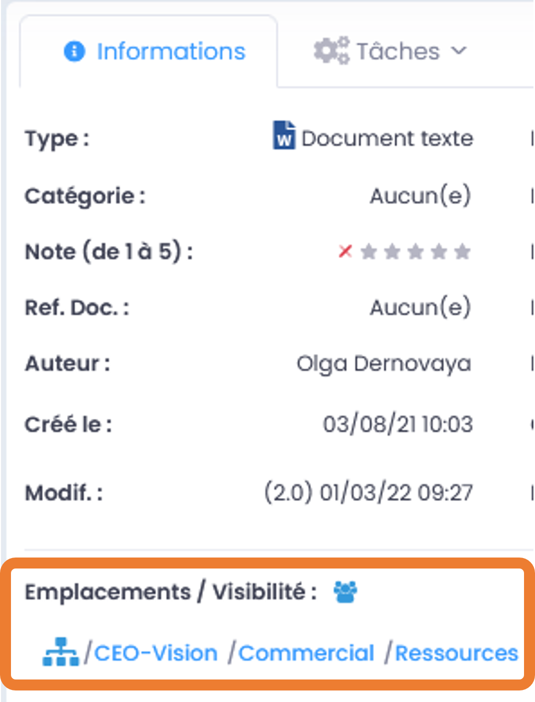

Catégories et Etats
~~~~~~~~~~~~~~~~~~~~

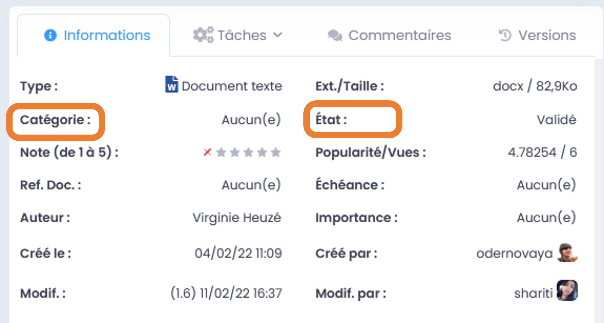

Les **catégories** correspondent à la nature du contenu du document :
template, guideline, article, PV, … 

L’\ **état** correspond aux « stades de vie » du document : draft, à
valider, validé, obsolète, archivé, …

Pour les modifier, allez sur « Autre » en face de « catégorie » ou
« état » , la case bleue « Modifier » apparaît, cliquez dessus et
choisissez la proposition adéquate.

**Exemples de catégories et états:**

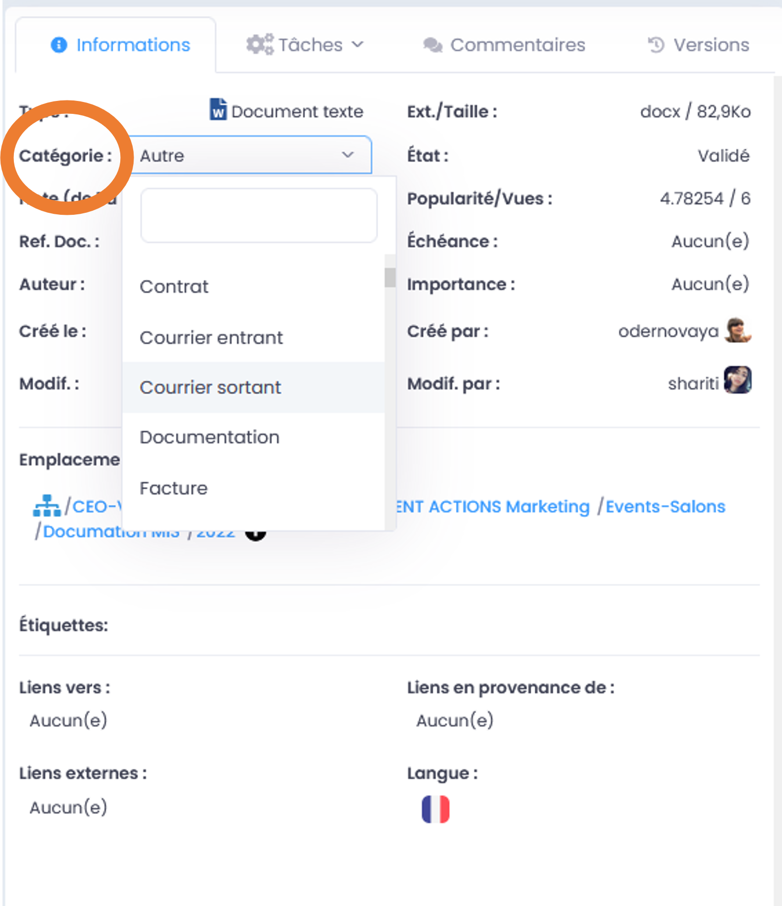
   
.. figure:: media-guide/image402.png
   :alt: 

Contenus liés
~~~~~~~~~~~~~

Si 2 documents ont **un lien commun**, si un document renvoie à un autre
par exemple, vous pouvez mettre à cet endroit le nom du document lié au
document initial que vous êtes en train de prévisualiser.

C’est un peu une autre manière de voir les hyperliens dans un document.
Ici vous n’êtes pas obligés d’ouvrir le document où il y a les
hyperliens, vous pouvez directement cliquer sur le document lié dans les
métadonnées.

Mettez la souris sur « Autre » en face de « Contenus liés », cliquez sur
la case bleue « Modifier », tapez les premières lettres du nom du
document que vous voulez lier ; le système devrait vous le proposer
automatiquement ; cliquez sur le nom de votre document pour le
sélectionner et sur « Appliquer »

.. figure:: media-guide/image214.png
   :alt: 

.. figure:: media-guide/image215.png
   :alt: 

.. figure:: media-guide/image216.png
   :alt: 

Ainsi, un document sera lié à votre document original et vous pourrez
cliquer sur son lien pour l’ouvrir directement et passer d’un document à
l’autre en un clic.

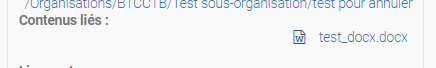

N’oubliez pas de sauver en actualisant l’aperçu du document : cliquez
sur les petites flèches arrondies rouges, entouré en rouge sur l’image.
Un message vous le rappelle dans l’encadré bleu, en haut à droite de
l’écran.

.. figure:: media-guide/image218.png
   :alt: 

**Liens vers / Liens depuis**

Nous avons volontairement dissocié la formulation des liens "depuis" et liens "vers" pour la possibilité de modification. 

Un « *lien vers* » signifie : un lien vers d'autres contenus, depuis le document sélectionné (= sur lequel vous vous trouvez).
Un « *lien depuis* » signifie : un lien provenant depuis d'autres contenus. 

Le lien vers un document a la possibilité d'être modifié depuis celui-ci, néanmoins un lien depuis un document tiers ne peut être modifié que depuis ce document tiers (non depuis le document sélectionné). 

C'est sur le constat de liens entrants et sortants. 

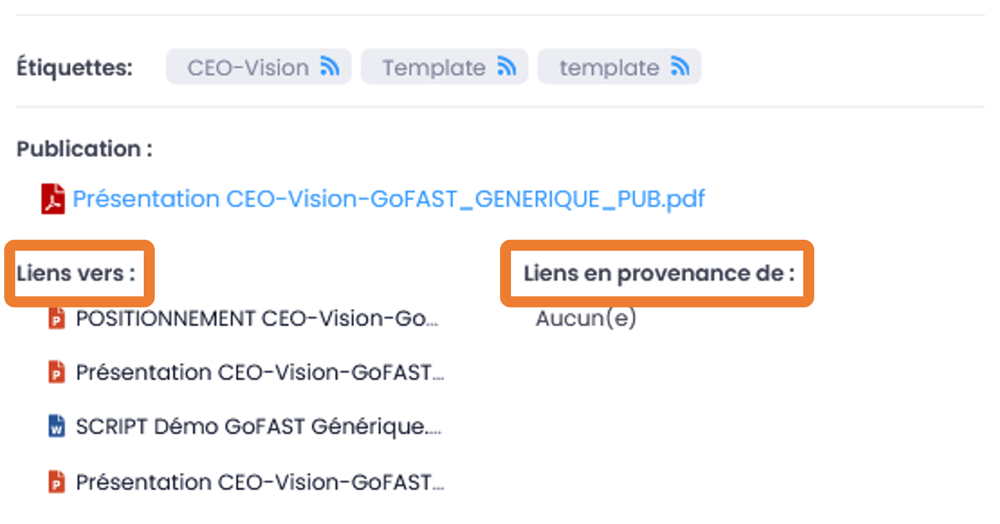

**Liens externes**

Permet d’ajouter un **lien vers une page web externe** en y mettant
**l’URL.**

Ainsi les **documents seront toujours liés** et vous pourrez passer d’un
à l’autre en un clic (pareil que « Contenus liés »)

C’est le même principe que pour les autres métadonnées, lorsque la case
bleue « Modifier » apparaît en face de « Liens externes », cliquez
dessus et coller l’URL souhaité. Puis terminez en appuyant sur
« Appliquer »

.. figure:: media-guide/image219.png
   :alt: 

.. figure:: media-guide/image220.png
   :alt: 

Etiquettes (mots-clefs)
~~~~~~~~~~~~~~~~~~~~~~~~

Les "Etiquettes" sont des mots-clés que les utilisateurs peuvent à tout moment ajouter aux documents. 

**Ces étiquettes sont utiles dans les cas suivants :**

* Informer les autre utilisateurs qui consultent le document sur la thématique ou une spécificité liée au document,
* Retrouver plus facilement certains contenus car les étiquettes sont indexées par le moteur de recherche et donnent un poids supplémentaire qui remonte ces contenus dans le résultat,
* Pouvoir filtrer un résultat de recherche par "étiquette" (ex : on recherche "documentation" et on filtre avec l'étiquette "GoFAST"),
* Pouvoir s'abonner à ces étiquettes pour être notifié de l'activité des documents ayant cette étiquette (chaque abonnement à une "étiquette" peut être paramétré par l'utilisateur pour sa fréquence).
* Pouvoir retrouver des fichiers qui sont dans des formats autres que texte (ex : les images, les vidéo, PDF images, etc.)

**Pour ajouter ou enlever une "étiquette" :**

* Allez au niveau de "Etiquettes" avec la souris et le bouton "Modifier" apparaît,
* Cliquer sur le bouton "Modifier" pour ouvrir la popup de modification des étiquettes,
* Pour ajouter une étiquette, il faut commencer à taper le mot souhaité et des suggestions vous seront proposées. Cliquez sur une des suggestions ou sur "nouveau terme" si aucune suggestion ne vous convient. Enfin, cliquez sur "Appliquer" pour enregistrer les modifications,
* Pour enlever une étiquette existante, il suffit de cliquer sur la petite croix au niveau de l'étiquette.

.. figure:: media-guide/image221.png
   :alt: 

.. figure:: media-guide/image222.png
   :alt: 

**S'abonner ou se désaboner des "Etiquettes" :**

L'abonnement à des étiquettes permet d'être notifié sur l'activité des contenus selon une thématique ou un sujet spécifique (ex: on est membre d'un espace de travail, mais plutôt que d'être notifié sur toute l'activité de cet espace, on fait le choix d'être notifié sur les documents ayant une étiquette précise). 
Sur la page d'un document, pour vous abonner ou vous désabonner d'une étiquette, il faut cliquer sur la petite icône d'abonnement.
Ensuite, il est possible de paramétrer la fréquence de ses notifications selon les étiquettes (dans le menu du profil utilisateur, entrée "Abonnements").

.. figure:: media-guide/image224.png
   :alt:
   
.. figure:: media-guide/image225.png
   :alt:

Un message apparaît dans le coin droit supérieur, pour vous confirmer la prise en compte de l'abonnement ou du désabonnement.

.. figure:: media-guide/image226.png
   :alt: 

L'icône d'abonnement apparaîtra en rouge dans l'étiquette si vous êtes abonné à ce terme, et en bleu si vous n’y êtes pas abonné.

.. figure:: media-guide/image227.png
   :alt: 

Échéance
~~~~~~~~
Consiste à donner une **date d’échéance** au document, c’est-à-dire
qu’un rappel par notification vous sera envoyé par rapport à ce document
à cette date.

Cela peut servir pour un contrat avec une date limite, un document qui
doit être finalisé à une date précise, …

.. figure:: media-guide/image228.png
   :alt: 

Pour introduire la date, cliquez sur « Aucun » face à « Echéance » et
choisissez la date pour le rappel. Terminez par « Appliquer »

.. figure:: media-guide/image229.png
   :alt: 

Importance du Document/Contenu
~~~~~~~~~~~~~~~~~~~~~~~~~~~~~~~~

Vous pouvez signaler **l’importance d’un document** dans les métadonnées
et son niveau : critique, haute, normale ou basse.

Allez au niveau « Importance » dans les métadonnés du document, appuyez
sur « Modifier », choisissez le niveau d’importance et terminez avec
« Appliquer »

.. figure:: media-guide/image230.png
   :alt: 

.. figure:: media-guide/image231.png
   :alt: 

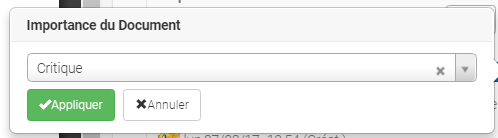

Cette métadonnée permet d’ajouter un filtre à votre recherche
automatique et ….. ? (listing résultat ?) (en attente réponse CEO
vision)

Auteur du Document/Contenu
~~~~~~~~~~~~~~~~~~~~~~~~~~

Le fait d’indiquer **l’auteur** du document permet de savoir
à qui s’adresser en cas de question et d’ajouter un filtre lors de la
recherche.

Si le fichier déposé sur GoFAST contient une métadonnée "auteur" (ex: un fichier Word indique dans les informations du document que l'auteur est "Christopher"), ça sera automatiquement récupéré depuis le fichier par GoFAST et affiché sur la page du document. 

.. figure:: media-guide/image233.png
   :alt: 

Tapez les premières lettres du nom et le système vous proposera une
liste d’utilisateurs, sélectionnez le nom souhaité et cliquez sur
« Appliquer ».

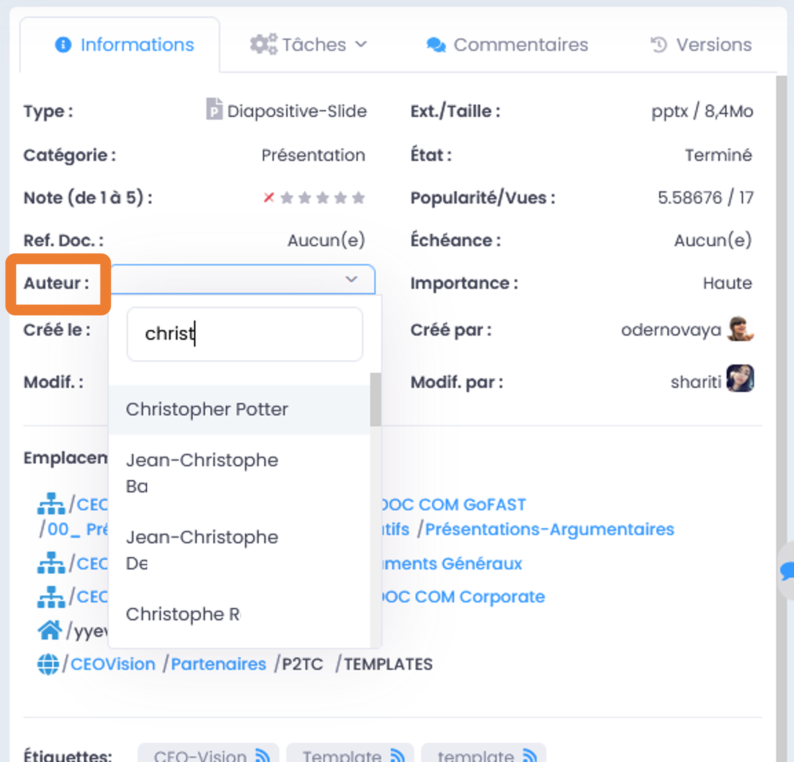

Historique et versions du Document
~~~~~~~~~~~~~~~~~~~~~~~~~~~~~~~~~~

L’\ **historique** indique les actions qui ont été faites sur le
document, par qui et quand : création, modification, …

.. figure:: media-guide/image235.png
   :alt: 

Juste en dessous de l’historique , vous pouvez voir aussi les
**versions** du documents, c’est-à-dire le numéro des versions actuelles
et combien il y en a eu avant. Sachant que chaque sauvegarde du document
est considérée comme une nouvelle version mineure (1.0 => 1.1, 1.2, 1.3,
….) . Par contre, si vous écrasez la dernière version mineure par une
nouvelle version du document (avec le glisser/coller par exemple), le
système vous demandera si vous voulez qu’elle devienne une version
majeure (1.3 => 2.0) et donc une nouvelle base de travail.

La 1ere version que vous créez ou migrez sur GoFAST commence à 1.0.

.. figure:: media-guide/image236.png
   :alt: 

Cliquez sur « Show versions list » pour voir les versions antérieures,
vous pouvez même choisir le type de versions (actuelle, majeure ou
toutes), puis cliquez sur le numéro de la version que vous voulez
ouvrir.

.. figure:: media-guide/image237.png
   :alt: 

Les langues et traductions du Document/Contenu
~~~~~~~~~~~~~~~~~~~~~~~~~~~~~~~~~~~~~~~~~~~~~~

Vous pouvez mettre la **langue du document** dans les métadonnées, ainsi
plus besoin d’indiquer la langue dans le nom du document. Cela donne
également un niveau de **filtre** supplémentaire dans la recherche de
documents.

Allez dans les métadonnées, tout en bas, au niveau « Langues », appuyer
sur « Modifier », une petite fenêtre s’ouvre où vous pouvez choisir la
langue de ce document, avec le petit dérouleur qui vous donnera un choix
de plusieurs langues.

Terminez avec « Appliquer ».

.. figure:: media-guide/image238.png
   :alt: 

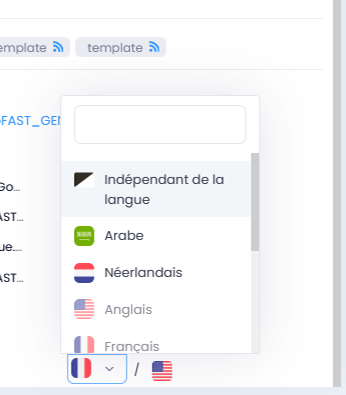

De même, si le document existe en différentes langues (comme c’est le
cas des templates, guidelines, etc), vous pouvez lier entre elles les
traductions de ce document ; il suffira ensuite d’appuyer sur le drapeau
correspondant à la langue souhaitée pour prévisualiser le document dans
cette langue.

.. figure:: media-guide/image240.png
   :alt: 

Le premier drapeau correspond à la langue du document prévisualisé, les
autres sont les traductions disponibles. Donc dans l’exemple ci-dessus
le document est en anglais (on voit le drapeau + la langue à côté) et il
existe une traduction en français (on voit juste le drapeau).

Pour **lier 2 documents de langues différentes** : cliquez sur l’icône
avec les 3 barres horizontales dans la barre d’outil de la
prévisualisation, et choisissez la fonction « Editer les traductions « .

.. figure:: media-guide/image241.png
   :alt: 

Vous arrivez sur un formulaire où vous pouvez taper les premières
lettres du document que vous voulez lier, dans la case de la langue
souhaitée. Dans l’exemple ci-dessous, c’est la version française qu’on
veut ajouter et lier au document initial.

Terminez en appuyant sur la case bleue « Mettre à jour les traductions »

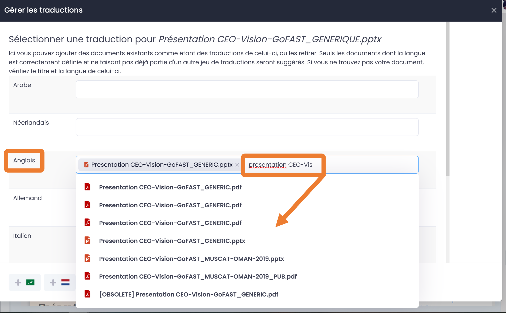

Vous pouvez ainsi lier les différentes versions d’un même document qui
existe en plusieurs langues. Et les drapeaux correspondant à ces langues
se retrouveront dans les métadonnées du document.

Panier Documentaire 
-------------------
Le panier documentaire permet de rassembler plusieurs documents sans modifier leur emplacements pour exécuter diverses fonctionnalités sur l’ensemble du panier.
Le panier est accessible depuis le menu principale, icône "3 barres"/"burger" puis clic sur "Panier documentaire" (à partir de la v3.6, autrement c’est dans le menu du profil utilisateur).

.. figure:: media-guide/Ecran-GoFAST_Panier-Documentaire_acces-au-panier.png	
   :alt:

Ajouter/retirer des documents dans son panier documentaire
~~~~~~~~~~~~~~~~~~~~~~~~~~~~~~~~~~~~~~~~~~~~~~~~~~~~~~~~~~
**Il est possible d’ajouter des documents dans le panier :** 
   - Via le menu "burger" (actions contextuelles sur un document) sur la page du document, le fil d’activité, résultat de recherche…
   
.. figure:: media-guide/ Ecran-GoFAST_Panier-Documentaire_ajout-au-panier-sur-page-document.png
   :alt:

.

   - Depuis l’explorateur de fichiers "GoFAST File Browser" en sélectionnant les documents souhaités et en cliquant sur l’icône "panier"
   
.. figure:: media-guide/Ecran-GoFAST_Panier-Documentaire_ajout-au-panier-dans-gofast-file-browser.png	
   :alt:
   
**Il est possible de retirer les documents de son panier documentaire :**
   - Unitairement, en cliquant sur "retirer du panier"
   - Tous les documents en une fois, en cliquant sur "retirer tous les documents"

.. figure:: media-guide/Ecran-GoFAST_Panier-Documentaire_retirer-du-panier.png	
   :alt:

Actions possible depuis le panier documentaire
~~~~~~~~~~~~~~~~~~~~~~~~~~~~~~~~~~~~~~~~~~~~~~
**Gérer en masse les documents du panier :**
   - Gérer la taxonomie (catégorie, étiquettes, état, langue)
   - Ajouter des emplacements aux documents de travail
   - Créer des publications à partir des documents de travail
   - Partager par mail des documents
   - Archiver les documents

.. figure:: media-guide/Ecran-GoFAST_Panier-Documentaire_actions-depuis-panier-gestion-en-masse.png	
   :alt:

**Démarrer un processus de tâches depuis le panier (Enterprise only) :**
Les documents du paniers sont proposés lors du démarrage d’un nouveau workflow, via le menu principale. 

Cela permet d’associés au processus tous les documents en une fois, que l’on peut ensuite retirer unitairement dans le formulaire du processus.

.. figure:: media-guide/Ecran-GoFAST_Panier-Documentaire_retirer-du-panier.png	
   :alt:
   
Pour savoir comment démarrer un nouveau processus de tâches, merci de vous référer à la documentation : https://gofast-docs.readthedocs.io/fr/latest/docs-gofast-users/doc-gofast-guide-utilisateurs.html#workflows-processus-de-taches-enterprise-only

DUA et pré-archivage des documents
----------------------------------
La DUA ou la durée d’utilité administrative, est la durée pendant laquelle un document est conservé afin d’être consulté ou utilisé pendant la gestion d’un dossier ou à des fins juridiques. Une fois ce temps écoulé, il sera archivé de façon définitive ou détruit. 

Ce processus est indispensable dans la continuité des actions administratives. Il est donc fondamental dans une entreprise de bien maîtriser le cycle de vie de chaque document et d’optimiser leur archivage.

GoFAST propose cette fonctionnalité importante et offre la possibilité de personnaliser une DUA selon la catégorie du document, la durée du processus de traitement et le sort final.  Il est également possible de définir une liste d’utilisateurs qui souhaitent être notifiés quand la DUA sera atteinte. 

Appliquer une DUA 
~~~~~~~~~~~~~~~~~

Le déclenchement de la DUA se fera lors de l'application du statut "Pré-archivé" sur un document, à condition que celui-ci possède une catégorie associée à une DUA.

Une DUA peut être appliquée sur un document ou plusieurs documents d’un ou plusieurs espace(s) spécifié(s).  

Pour déclencher une DUA sur un document, dans le bloc métadonnées de ce dernier, aller dans le champ « Catégorie » puis cliquer sur modifier. 

Choisissez la catégorie qui correspond au type de votre dossier puis appuyer sur « Appliquer ». 

.. figure:: media-guide/DUA_image_7.jpg
   :alt: 

Ensuite, aller dans le champs «État», appuyer sur «Modifier»,  sélectionner « Pré-archivé » puis cliquer sur le bouton « Appliquer » pour sauvegarder.

Une fois ce document est en état pré-archivé, son contenu et sa catégorie ne seront plus modifiables et la DUA est déclenchée à partir de la dernière date de modification de ce document. 

Quand la DUA est atteinte, les différents utilisateurs associés à cette dernière seront notifiés. 

.. NOTE::
   Il est important de renseigner le couple ( Catégorie, État : Pré-archivé ), si l’un des deux est vide, la DUA ne se déclenchera pas. 
   

.. NOTE::
   Pour configurer une DUA, seuls les administrateurs de plateforme sont habilités, merci de vous référer à la documentation : https://gofast-docs.readthedocs.io/fr/3.8.0/docs-gofast-users/doc-gofast-administration-plateforme.html#configurer-une-dua-duree-de-l-utilite-administrative

Edition de fichiers et Suite Office Collaborative
=================================================

Editer/modifier en ligne le document
------------------------------------

Cette fonction permet **d’ouvrir un fichier pour édition/modification**
sans avoir à le sauvegarder au préalable en local.

Le document type « Office » sera ouvert avec l’application définie par
défaut sur votre poste (exemple Office, LibreOffice, WPS). A noter que
sur Firefox, vous avez la possibilité de choisir à chaque ouverture
l’application.

Pour les types de contenus comme PDF, Images, une petite application
doit être installée au préalable sur le poste. Vous pouvez ensuite
ouvrir un PDF dans Adobe ou Foxit, le signer et directement le
sauvegarder sur GoFAST.

Si vous êtes donc un utilisateur standard/contributeur dans vos groupes,
vous pouvez modifier des documents, « éditer en ligne », de telle sorte
que les modifications apportées au document seront directement
enregistrées sur la GoFAST et donc visibles à tous les membres de ce
groupe. C’est ce qu’on appelle la synchronisation.

Allez dans le menu des fonctionnalités/actions contextuelles de la
prévisualisation et cliquez sur « **Editer en ligne** »…

    .. figure:: media-guide/image157.png
       :alt: 

Le système vous demande votre mot de passe afin de vous **identifier**.
Ainsi le système pourra montrer qui a fait les derniers changements
(cf : historique des versions et du document dans les métadonnées).

Votre identifiant et mot de passe sont les mêmes que pour vous loguer à
GoFAST.

.. figure:: media-guide/image158.png
   :alt: 

Le document s’ouvre dans Office et vous pouvez y travailler normalement,
n’oubliez pas de sauver (disquette) avant de fermer le document pour
être certain que le système a enregistré vos modifications.

.. figure:: media-guide/image159.png
   :alt: 

De retour sur l’interface GoFAST, faites un refresh de la page pour que
la prévisualisation du document apparaisse avec les modifications qui
viennent d’être faites.

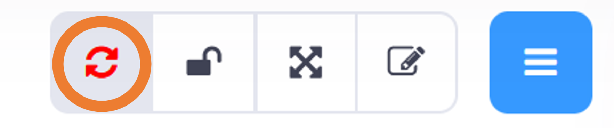

Vous pouvez voir qui a fait une action sur ce document dans
l’historique, dans l’encadrement des métadonnées, tout en bas.

Vous pouvez également voir les versions précédentes, en cliquant sur
« Show versions list » au niveau « Révisions dans les métadonnées.

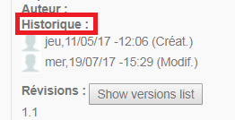

.. NOTE::
    Lorsque vous êtes en train d’éditer un document (que
    vous l’avez ouvert en ligne ), les autres personnes qui voudraient
    l’ouvrir auront ce message lors de sa prévisualisation, au-dessus
    des métadonnées « Vous êtes en lecture-seule sur ce document »

Et ils verront un petit cadenas fermé rouge dans la barre des
fonctionnalités de la prévisualisation, avec la photo de l’utilisateur
qui est en train de travailler sur le document. En mettant sa souris sur
l’icône, vous pouvez voir le nom de l’autre utilisateur.

.. figure:: media-guide/image162.png
   :alt: 

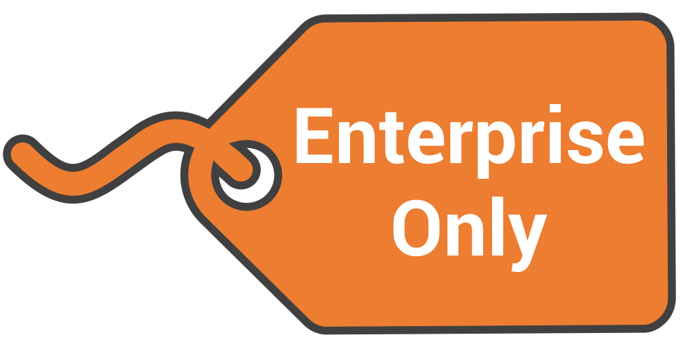
   
   
Editer avec la Suite Collaborative OnlyOffice (Enterprise only)
---------------------------------------------------------------
   
GoFAST 3 apporte une dimension très innovante et vous permet d’éditer
des documents Office dans un simple navigateur **avec d’autres personnes
en simultané**. Vous pouvez ainsi travailler à plusieurs, en même temps,
sur un même document.

.. NOTE::
   Contrairement à GoogleDocs/Drive, **vous conservez vos formats
   Office** et vous pouvez ensuite directement ouvrir le fichier avec
   Office sans avoir à changer de format.

.. NOTE::
   De plus OnlyOffice est dans votre datacenter limitant les besoins
   de bande passante et garantissant une confidentialité totale.

.. CAUTION::   
   Une connexion réseau d'assez bonne qualité est nécessaire
   

Pour cela lancer la co-édition, allez dans les actions contextuelles de
la prévisualisation et appuyez sur l’option «  Editer avec OnlyOfice »

.. figure:: media-guide/image163.png
   :alt: 

.. IMPORTANT::
   Si vous souhaitez co-éditer les anciens formats Microsoft (.doc, .xls, .ppt) ou les formats
   OpenDocument (.odt, ...) ceux-ci seront convertis dans les formats équivalents .docx, .xlsx, .pptx). Si vous souhaitez une conversion la plus fidèle possible, faire cette conversion sous Office ou LibreOffice
   De même la version actuelle ne génère pas les Table de Matières, celles-ci devant être
   généré une fois le document terminé sous votre éditeur de texte.
   
Ce message apparaît, cliquez sur « Continuer »

.. figure:: media-guide/image395.png
   :alt: 
   
Voici un exemple d’un document Word ouvert avec OnlyOffice, pour
modification. On peut noter qu'une personne est entrain d'éditer en même
temps le document.

.. figure:: media-guide/image396.png
   :alt: 

Faites vos modifications puis fermer OnlyOffice, vous serez redirigé sur
la prévisualisation de votre document dans GoFAST ; **une fois que
toutes les personnes seront sorties d’OnlyOffice, une nouvelle version
sera créée** ; rafraichissez la page avec les petites flèches rondes
rouges, vous verrez ainsi vos modifications enregistrées dans le
document.

.. NOTE::
   Vous pouvez utiliser de nombreuses fonctionnalités de Word,
   notamment nous vous recommandons d'activer le mode révision (en bas à
   droite), les autres éditeurs identifieront mieux vos changements.

.. NOTE::
   Lorsque vous êtes en train d’éditer un document avec
   OnlyOffice (que vous l’avez ouvert en ligne), les autres personnes qui
   voudraient l’ouvrir auront ce message lors de sa prévisualisation,
   au-dessus des métadonnées « Vous êtes en lecture-seule sur ce document »

Et ils verront un petit cadenas ouvert rouge dans la barre des
fonctionnalités de la prévisualisation, avec la photo de l’utilisateur
qui est en train de travailler sur le document. En mettant sa souris sur
l’icône, vous pouvez voir le nom de l’utilisateur qui a ouvert en
1\ :sup:`er` le document.

.. figure:: media-guide/image166.png
   :alt: 

.. NOTE::
   OnlyOffice vous permet de co-éditer des contrats, des budgets, des
   présentations Powerpoint d'une façon beaucoup plus rapide que
   traditionnement, chacun travaillant à son tour.

Gestionnaire de versions de document
====================================

GoFAST dispose d’un gestionnaire de versions de document. Il consiste à mettre en place un historique de toutes les modifications effectuées sur un document. Chaque modification enregistrée, un point de sauvegarde est crée de l’état actuel du document avec un numéro de version.

Le but de ce fonctionnement est de permettre de récupérer une version  antérieure et ce en cas d'erreur ou de problème sur une version actuelle.

Pour remettre une version antérieure, il suffit de cliquer sur le numéro de version souhaitée afin de télécharger le document puis le faire glisser et déposer dans la zone de chargement.

Par défaut la version 1.0 est considérée comme la version majeure du document. La notion majeure  signifie que le document est finalisé et près à être publié.

Définir la version actuelle comme version majeure
-------------------------------------------------

Pour passer un document encours de modification en version majeure, aller dans le menu contextuel de ce dernier, survoler le sous-menu «Voir plus» puis cliquer sur « Définir comme version majeur».

Passer le document source en version majeure lors d'une publication
-------------------------------------------------------------------

Pour passer un document source en version majeure lors d’une publication, aller dans le menu contextuel de ce document,  cliquer sur le sous-menu «Créer une  publication». Ensuite configurer votre publication et ne pas oublier de cocher la case «Définir comme version majeure le document origine» puis appuyer sur le bouton «Valider» pour exécuter. 

Moteur de Recherche
===================

Fonctionnement du Moteur de Recherche :
---------------------------------------
Tout le contenu texte des documents (Word, Excel, PDF, mail, pages web, wiki, etc.) et leurs caractéristiques (les métadonnées) sont indexés. Vous trouvez une information précise ou un fichier par mots-clefs, même approximatifs (pluriel vs singulier, fautes de frappe, etc…) et sans avoir à connaitre le titre. Des mots-clefs approchants sont proposés en cas de recherche infructueuse.

Le moteur de recherche restitue le résultat selon la pertinence : 
~~~~~~~~~~~~~~~~~~~~~~~~~~~~~~~~~~~~~~~~~~~~~~~~~~~~~~~~~~~~~~~~~
Tout un ensemble de critères est pris en compte dans le calcul de cette pertinence : le nombre d’occurrences des mots-clefs recherchés, les emplacements des mots-clefs (ex : titre du fichier, d’un paragraphe dans le document…), les dates de création et modification (ex : un contenu récent sera privilégié vis-à-vis d’un document ancien), la popularité des contenus (ex : un document consulté souvent sera privilégié vis-à-vis d’un document qui n’a pas été consulté depuis des mois), etc.

Liste des principaux formats pris en charge par l’extraction/indexation :
~~~~~~~~~~~~~~~~~~~~~~~~~~~~~~~~~~~~~~~~~~~~~~~~~~~~~~~~~~~~~~~~~~~~~~~~~
* HyperText Markup Language (HTML)
* Fichiers vectoriels (SVG, VSD)
* Formats XML et dérivés (XHTML, OOXML, ODF)
* Documents Microsoft Office (DOC, PPT, EXL, DOCX, PPTX, PPSX, EXLX, etc.)
* OpenDocument Format (ODF)
* Documents iWorks
* Portable Document Format (PDF)
* Format de publication électronique (EPUB)
* Rich Text Format (RTF)
* Formats de compression et d'emballage (Tar, RAR, AR, CPIO, Zip, 7Zip, Gzip, BZip2, XZ et Pack200)
* Formats de texte (TXT)
* Formats de flux et de la syndication (RSS, Atom)
* Formats d'aide (CHM)
* Formats audio - au cas où il y a du texte intégré, ex : paroles (mp3, mp4, Vorbis, Speex, Opus, Flac etc.)
* Dossiers et archives de classe Java
* Code source (Java, C, C++, Groovy, etc)
* Formats e-mail (ex : eml, PST, MSG, TNEF)

Rechercher un document avec des mots-clefs
-------------------------------------------
La barre de recherche se trouve dans le menu principale pour être accessible à tout moment, depuis toutes les pages de GoFAST. 
Pour rechercher, il suffit de taper les mots clefs-souhaités et cliquer sur le bouton "loupe" ou faire "Entrer" sur son clavier. 

.. NOTE:: Une recherche avec 1 ou 2 mots-clefs sera élargie, alors qu'une recherche avec 3 mots-clefs ou plus sera plus restreinte. En effet, avec 2 mots clefs le moteur de recherche va proposer des contenus qui ont soit les 2 mots-clefs, soit l'un des deux mots-clefs. Alors qu’avec plus de 3 mots-clefs le moteur de recherche va proposer des contenus qui répondent à au moins 75% de la recherche. Donc, plus il y a de mots-clefs, plus la recherche est précise. Il est donc conseillé de rentrer peu de mots-clefs si on n’est pas certain des termes recherchés et au contraire, rentrer plus de 3 mots-clefs si on sais exactement ce qu’on cherche et qu’on est sûr des termes saisis. 

Recherche avancée avec les opérateurs booléens 
-----------------------------------------------
Par défaut, le moteur de recherche fonctionne avec la notion de "OU" : lorsqu'on saisit 2 mots-clefs le moteur va proposer les contenus avec le 1ère mot-clef OU l'autre mot-clef OU les 2 mots-clefs. 
Cela permet un résultat de recherche très large, mais parfois il est nécessaire de restreindre la recherche. Il est alors possible d’utiliser les "opérateurs booléens" qui sont des symboles à mettre avant ou après les mots-clefs pour indiquer au moteur de recherche comment traiter ces mots-clefs en particulier (ex : mot obligatoire, à exclure, chaine de mots exacte, etc.).

Liste des opérateurs booléens possibles :
~~~~~~~~~~~~~~~~~~~~~~~~~~~~~~~~~~~~~~~~~
* **AND** : intercalé entre les mots-clefs permet d'indiquer au moteur de recherche qu'il faut que tous les mots clefs soit présents (ex: Mémoire AND Technique AND Fonctionnalités)
* **+** : ajouté devant un mot-clef permet de le rendre obligatoire (ex : Mémoire Technique +Fonctionnalités) pour indiquer au moteur de recherche que parmi les termes saisis, certains doivent obligatoirement être présents dans le document recherché. 
* **"..."** : appliqués sur une suite de mots permet de rechercher une expression exacte (ex : "Mémoire Technique et Fonctionnalités GoFAST") et donc d’indiquer au moteur de recherche d’exclure les documents qui contiennent ses mots clefs s’ils ne sont pas exactement comme dans l’expression saisie. 
* ***** : ajoutée à la fin ou au début d’un mot-clef permet de le rendre approximatif (ex : Fonction*) et donc d’indiquer au moteur de recherche d’afficher les documents qui contiennent tous les termes qui ont pour racine le mot-clef sais. 

.. figure:: media-guide/operateurs-booleens.jpg
   :alt: 

Consulter le résultat de Recherche
---------------------------------------------
.. NOTE:: Pour connaître la manière dont GoFAST restitue un résultat de recherche, merci de consulter la partie : "Le moteur de recherche restitue le résultat selon la pertinence"

Pour chaque document affiché dans le résultat de recherche, vous pouvez consulter :
~~~~~~~~~~~~~~~~~~~~~~~~~~~~~~~~~~~~~~~~~~~~~~~~~~~~~~~~~~~~~~~~~~~~~~~~~~~~~~~~~~~
* L’icône indiquant le type du document (fichier texte, tableur, PDF, image, vidéo…) ou autre contenu (forum, page Wiki, profil utilisateur, Espace Collaboratif…),
* Le titre du fichier (un clic dessus permet d'aller sur la page du document), 
* Le menu des actions possible sur un document (icône avec 3 petite barres à droite du titre du document), 
* Des "fragments" de texte qui sont des extraits du contenu avec les mots-clefs recherchés et qui permettent de vérifier si le document est bien celui que l’on cherche sans avoir à l’ouvrir (si plusieurs extraits sont trouvés, il est possible de les consulter l’un après l’autre en utilisant la pagination), 
* Un bouton "prévisualiser" qui permet d’afficher un aperçu du document en un clic (NB : certains contenu ne le permettent pas car ne bénéficient pas la prévisualisation)
* Des informations clefs sur le contenu (date de création/dernière modification, la popularité...)
* Les étiquettes, catégories, l'importance et les états des documents. 

.. figure:: media-guide/recherche-contextuelle.png
   :alt:

Recherche contextuelle dans un document :
-----------------------------------------
Le résultat de recherche permet de cliquer sur les mots-clefs mis en gras dans les titres et dans les extraits des contenus trouvés.
Ces mots en gras permettent une recherche contextuelle dans un document : en cliquant sur un mot-clé mis en gras, vous accéder à la page du document avec dans la prévisualisation, la mise en évidence des mots-clefs recherchés et la possibilité de les passer l’un après l’autre. 
Cette recherche contextuelle offre un important gain de temps lorsqu’il faut trouver un élément précis dans un document en particulier ou pour en faire une lecture rapide.  

Filtrer le résultat de recherche
--------------------------------
Dans le cas où les mots-clefs saisis ne permettent pas de retrouver rapidement le document recherché, GoFAST propose de nombreux filtres.
La liste des filtres est conditionnée au résultat de recherche, ex : si pour les mots-clefs saisis il n'y a aucun document de type PDF, ce format ne sera pas proposé dans les filtres disponibles.

Groupes de filtres disponibles : 

* Date de création, 
* Date de modification, 
* Type de document (selon le format de fichier), 
* Etiquettes, 
* Catégorie,
* Espaces Collaboratifs,
* Créateur, 
* Dernier contributeur, 
* Auteur, 
* Etat, 
* Importance, 
* Langue,
* Echéance.

.. figure:: media-guide/image038.png
   :alt: 

Trier le résultat de recherche
------------------------------
Par défaut, le résultat de recherche classe les documents par pertinence selon les mots-clefs recherchés (voir "fonctionnement du moteur de recherche").
 
Il est toutefois possible de modifier de tri pour classer les contenus par : 

* Titre (ordre alphabétique)
* Auteur, 
* Popularité
* Date de création 
* Date de modification, 
* Type de document

.. NOTE:: trier le résultat de recherche sur un autre critère que la pertinence, peut afficher en haut de la liste des contenus qui correspondent mois bien aux mots-clefs saisis car le critère sélectionné pour le tri prime. 

Sauvegarde des critères de recherche
------------------------------------
Avec GoFAST, il est possible de sauvegarder manuellement plusieurs recherches prédéfinies et les relancer en un clic en cas de besoin. Cela permettra un gain de temps considérable.
Pour enregistrer une sauvegarde, il suffit de taper le mot clef dans la barre de recherche puis cliquer sur la « loupe » ou faire « Entrer » sur le clavier. Une fois que votre recherche est validée et vos filtres sont appliqués, aller dans le volet « Recherche actuelle » et cliquer sur la disquette dans le coin à droite, donner un titre à votre recherche puis appuyer sur « Enregistrer ».

.. figure:: media-guide/search-title-save.png
   :alt:

Pour accéder aux recherches sauvegardées, vous avez deux possibilités :

* Dans la barre de recherche, à droite il suffit de passer la souris sur la petite fléchette à coté de la loupe, une liste s’affichera contenant les titres des recherches enregistrées. A ce niveau, vous pouvez accéder seulement à votre recherche en cliquant sur le titre souhaité.

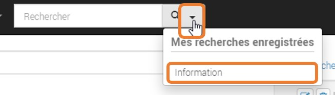

* Á partir du bloc de recherche (Filtres) dans le volet « Mes recherches enregistrées », à ce niveau vous pouvez :
   * Exécuter votre recherche en cliquant sur le «Titre»,
   * Remplacer la recherche sauvegardée par la recherche courante en appuyant sur la «Disquette»,
   * Supprimer cette recherche en allant sur le bouton «Corbeille».

Recherche stricte
-----------------
La recherche stricte est une fonctionnalité activée par défaut sur GoFAST, elle signifie que tous les mots clés renseignés dans la barre de recherche sont obligatoires et qu’ils doivent être impérativement présents dans les documents listés dans le résultats de recherche. Pour chaque document recensé, ces mots clés se trouvent soit dans son titre, soit dans son contenu, soit dans les commentaires et les métadonnées.

.. IMPORTANT::
   Notez que les mots clés précédés par un tiret « - » sont exclus de la recherche.
   Exemple : « Réunion février 2019  -Mardi » ( Tous les documents contenant le mot clé «Mardi» seront exclus des résultats ).

Explorateur de fichiers GoFAST File Browser
============================================

Accéder à l'explorateur de fichiers GoFAST 
------------------------------------------

Il existe 3 façons d'accéder à l'explorateur de fichiers GoFAST File Browser :

1. Vous pouvez afficher l'explorateur de fichier GoFAST depuis le menu principal en allant dans "Espace", puis sur "Explorateur". 
  
.. figure:: media-guide/FBrowser-01.png
   :alt:

2. Vous pouvez afficher l'explorateur de fichier GoFAST depuis la page d'un espace en cliquant sur l'onglet "Documents" 

.. figure:: media-guide/FBrowser-02.png
   :alt:

3. Vous pouvez à tout moment déplier le bloc de l'explorateur de fichiers qui est caché à gauche sur chaque page de GoFAST

.. figure:: media-guide/FBrowser-03.png
   :alt: 

Se repérer dans GoFAST File Browser
-----------------------------------

L'explorateur de fichiers GoFAST comporte 4 zones distinctes : 

1.	Barre de tâche (zone horizontale en haute)
2.	Bloc structure de l'arborescence (zone verticale à gauche)   
3.	Bloc principale affichant le contenu d'un dossier (zone la plus large, centre-droit)
4.	Bloc de progression (zone horizontale en bas) 

.. figure:: media-guide/FBrowser-04.png
   :alt:

Les divers contenus affichés dans l'explorateur de fichiers sont identifiés par des icônes selon leur type ou format de fichier. Chaque type d'espace collaboratif ou votre espace privé disposent d'une icône distincte. Les répertoires dits classiques sont représentés par des icônes "Dossier". 

.. Note:: 
   Pour plus de lisibilité, vous pouvez redimentionner les blocs 2, 3 et 4 ainsi que les en-têtes des colonnes de l'explorateur.

.. figure:: media-guide/FBrowser-17.png
   :alt:

.. Note:: 
   Dans la zone principale à la première ligne, vous disposez d'un bouton qui permet de revenir à l’emplacement précédent. 

.. figure:: media-guide/FBrowser-05.png
   :alt:

Déposer des fichiers sur GoFAST via l'explorateur 
-------------------------------------------------

Pour déposer des fichiers depuis votre PC vers GoFAST, il est conseillé de faire un *Glisser/Déposer* directement dans l'espace ou le dossier souhaité. 

.. WARNING::
 Il faut déposer le(s) fichier(s) soit dans le cadre principal (zone 2 sur la copie écran ci-dessus), soit dans le cadre à gauche où il y a l'arborescence (zone 3 sur la copie écran au-dessus).

Les fichiers ainsi déposés sont chargés et la progression est affichée dans la zone horizontale en bas de l'explorateur. Vous pouvez à tout moment cliquer sur *Pause*, *Annuler* ou bien *Reprendre* le chargement. 

.. NOTE:: 
   Le chargement se fera uniquement si vous avez les droits pour déposer des contenus dans l'espace concerné.  
   Pendant le chargement des fichiers depuis le PC vers GoFAST, ne pas supprimer, ni déplacer les fichiers côté PC car pour charger il faut conserver l'emplacement d'origine, autrement GoFAST ne sais plus depuis où il faut les récupérer . 

Utiliser la barre d’outils de GoFAST File Browser
--------------------------------------------------

La barre d'outils de l'explorateur de fichier permet d'effectuer les action suivantes : 

Modifier la manière dont sont affichés les contenus
~~~~~~~~~~~~~~~~~~~~~~~~~~~~~~~~~~~~~~~~~~~~~~~~~~~

.. figure:: media-guide/FBrowser-06.png
   :alt:

Créer un nouveau contenu dans le dossier sectionné
~~~~~~~~~~~~~~~~~~~~~~~~~~~~~~~~~~~~~~~~~~~~~~~~~~

Si vous appuyez sur le bouton *Nouveau* puis *Dossier*, cela vous permet de créer un nouveau dossier à cet emplacement. Il vous suffit ensuite de le nommer, puis valider. 

.. figure:: media-guide/FBrowser-07.png
   :alt:

Pour créer un nouveau document dans l'emplacement où vous vous trouvez, cliquez sur *Nouveau*, puis *Document*. Vous serez alors ramené vers le formulaire de création de document avec l'emplacement présélectionné.

Gérer les métadonnées (taxonomie) et les emplacements d’un ou plusieurs contenu(s)
~~~~~~~~~~~~~~~~~~~~~~~~~~~~~~~~~~~~~~~~~~~~~~~~~~~~~~~~~~~~~~~~~~~~~~~~~~~~~~~~~~~

Pour pouvoir cliquer sur le bouton *Gérer* il faut au-préalable sélectionner un ou plusieurs dossier(s) et/ou contenu(s) dans la zone principale de l'explorateur de fichiers.

Une fois les éléments sélectionnés, vous pouvez gérer la visibilité des contenus (selon vos droits utilisateur) en cliquant sur *Gérer les emplacements*, ou bien modifier les informations de taxonomie. 

.. Note:: Les modifications d'informations de taxonomie sont possibles sur : l'état, la catégorie, le(s) étiquette(s), et la langue. Dans le cas où vous ne souhaitez pas modifier tous ces éléments, laisser le champ positionné sur *Ne pas modifier*. Ces informations serviront ensuie dans les filtres de la recherche automatique pour réduire la liste des résultats. 

.. figure:: media-guide/FBrowser-08.png
   :alt:

Créer en masse les Publications de documents (en v 3.6)
~~~~~~~~~~~~~~~~~~~~~~~~~~~~~~~~~~~~~~~~~~~~~~~~~~~~~~~
Il est possible de générer des publications depuis une sélection de document de travail pour partager dans d'autres Espaces Collaboratifs des versions finies/validées, sans partager tout l'historique des versions et commentaires des documents de travail. Les publications sont ainsi largement partagées et les documents de travail restent accessibles uniquement dans les Espaces d'origine. 

.. Note:: 
   Cette fonctionnalité est possible unitairement sur la page d'un document, mais aussi en masse depuis GoFAST File Browser (à partir de la v3.6). 
   
Après avoir séléctionné les documents souhaités, il suffit de cliquer sur *Gérer*, puis sur *Créer des publications*. 

.. figure:: media-guide/Ecran-GoFAST_Publication-en-masse_slelectionner-pour-publier-en-masse.png	
   :alt:

Le formulaire de gestion des publications s'ouvre et il faut alors cocher les emplacements où seront partagées ces publications. Il est possible de demander à convertir au format PDF ou de laisser les formats d'origine. 

.. figure:: media-guide/Ecran-GoFAST_Publication-en-masse_publier-en-masse.png
   :alt:
   
.. Note:: 
   Les publications sont une fonctionnalité clef pour une gestion efficace et en toute sécurité des documents.
   
   
Archiver en masse les documents (en v 3.7)
~~~~~~~~~~~~~~~~~~~~~~~~~~~~~~~~~~~~~~~~~~~~~~~~~~~~~~~
Il est possible d'archiver une sélection de document de travail. 

.. Note:: 
   Cette fonctionnalité est possible unitairement sur la page d'un document, mais aussi en masse depuis GoFAST File Browser (à partir de la v3.7). 
   
Après avoir séléctionné les documents souhaités, il suffit de cliquer sur *Gérer*, puis sur *Archiver*. 

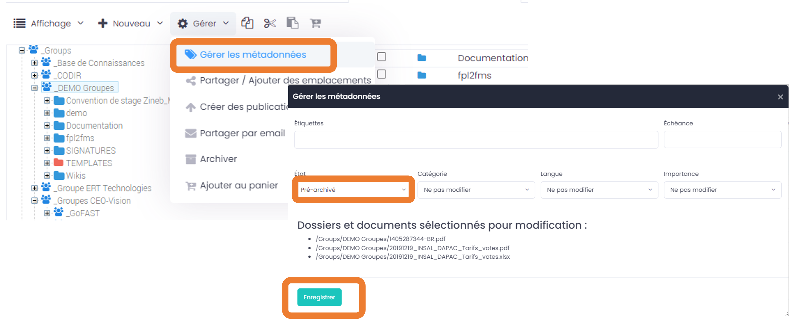
  

Partager par email en masse les documents
~~~~~~~~~~~~~~~~~~~~~~~~~~~~~~~~~~~~~~~~~~~~~~~~~~~~~~~
Il est possible d'envoyer plusieurs fichiers via un partage par mail. 

.. Note:: Cette fonctionnalité est possible unitairement sur la page d'un document, mais aussi en masse depuis GoFAST File Browser. 

Après avoir sélectionné les documents souhaités, il suffit de cliquer sur *Gérer*, puis sur *Partager par email*. 

Le formulaire d'envoi par email s'ouvre et il faut alors entrer les utilisateurs (GoFAST ou externe).

.. figure:: media-guide/Ecran-GoFAST_GoFASTFileBrowser_Partager-par-email-en-masse-modal.png
	:alt: 

L'utilisateur recevra alors une notification listant tous les documents avec un bouton "Télécharger les documents", dès qu'il cliquera dessus, il sera redirigé vers cette fenêtre de téléchargement:

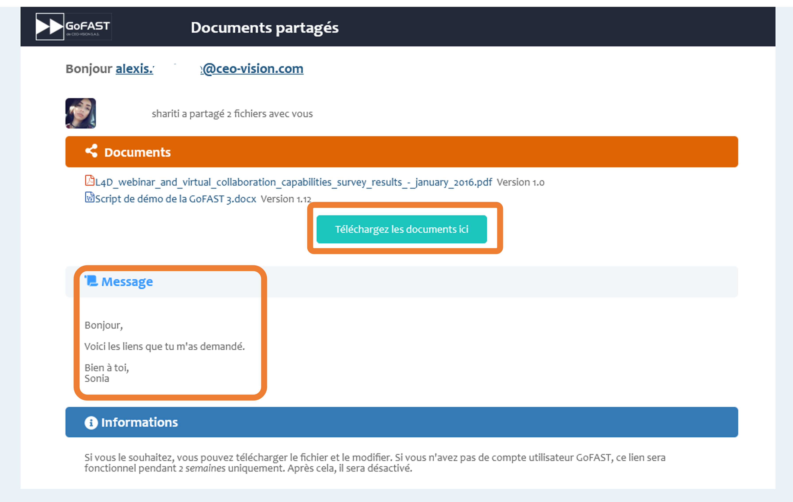

.. Note:: 
	L'utilisateur recevra une notification dès que la personne a téléchargé le document.

Ajouter un/des document(s) au panier
~~~~~~~~~~~~~~~~~~~~~~~~~~~~~~~~~~~~

Lorsque vous sélectionnez un ou plusieurs fichiers vous avez la possibilité en cliquant sur l'icône (voir ci-dessous) de les ajouter à votre panier documentaire. 

Ce panier documentaire d'exécuter des actions sur une sélection de documents, comme par exemple lancer un processus de validation (workflow). 
*Pour plus de détails voire le paragraphe consacré aux Workflows et au Panier Documentaire*

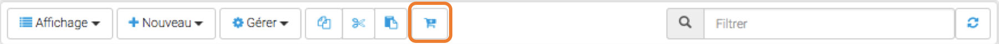

Filtrer les contenus dans un dossier ou espace
~~~~~~~~~~~~~~~~~~~~~~~~~~~~~~~~~~~~~~~~~~~~~~~~

Cette nouvelle fonctionnalité va vous permettre de retrouver vos documents plus facilement. Dans la barre *Filtre* (voir image ci-dessous), écrivez le titre du document que vous recherchez, et la recherche va filtrer tous les documents sur la page de l'espace où vous êtes.

.. figure:: media-guide/FBrowser-12.png
   :alt: 
   
   
Copier/Couper/Coller des documents
~~~~~~~~~~~~~~~~~~~~~~~~~~~~~~~~~~

En survolant les icônes avec la souris, vous verrez à quelle action elle correspond avec un petit mot affiché sous l'icône. 

**Copier/Coller un document**

L’icône des 2 feuilles superposées (encadré en orange ici) permet de *Copier* le document sélectionné dans un autre emplacement de la GoFAST, il vous faudra alors ensuite appuyer sur le dernier icône (encadré en jaune ici) quand vous voudrez coller le document à l'emplacement où vous souhaitez le coller, clic-droit de la souris et "Coller". 

Cette démarche revient à dire que le document sera à 2 endroits différents sur GoFAST et le risque à ce moment là est d'avoir des doublons car si quelqu'un modifie le document à un endroit, l'autre document copié ne sera pas modifié lui. Vous vous retrouverez alors avec 2 documents de même nom, à des emplacements différents, avec des versions différentes. 

MAIS, GoFAST vous permet le multi-emplacement des documents sans créer de copies de vos documents. Le multi-emplacement est préférable (via les métadonnées), ainsi il permet de garder la même version du document visible à partir de plusieurs emplacements et évite les doublons avec des versions différentes et toujours avec la mise à jour la plus actuelle. ( = un seul document, une seule version actuelle, un permalink unique, à plusieurs endroits). 

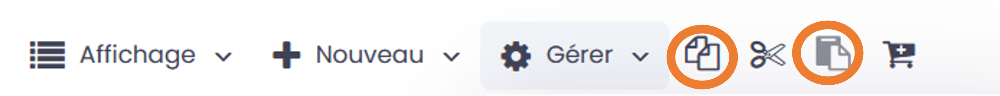
   
   
**Couper/Coller un document**

Même principe que pour *Copier/Coller* , mais ici pour déplacer un dossier vers un autre emplacement sur GoFAST est de *Couper* puis *Coller*. Cette fois, il faut utiliser les ciseaux pour couper (entouré ci-dessous en orange) et l’avant dernier icône noir et blanc pour Coller (entouré ci-dessous en jaune). 

.. figure:: media-guide/FBrowser-10.png
   :alt:

Cette démarche, contrairement à la précédente permet d'éviter les doublons. Il n'y alors qu'une version du document à un seul endroit sur GoFAST. 

.. NOTE:: 
   C’est le même principe que de déplacer en glissant le document d’un emplacement à un autre dans l’arborescence.
   Vous ne pouvez *Couper/Coller* des documents que dans GoFAST. Vous ne pouvez donc pas coller un document externe à la GoFAST, il faut le télécharger préalablement. 

Actions depuis GoFAST File Browser selon le type de contenu  
-----------------------------------------------------------

De manière générale, les actions autorisées sur les espaces, dossiers et/ou fichiers visibles dans l'explorateur de fichiers restent strictement conforme à vos droits sur l'espace concerné.

Lorsque vous êtes dans votre explorateur de fichiers/arborescence
GoFAST, vous pouvez aussi gérer vos documents avec quelques raccourcis
via le **clic-droit de la souris**, sans devoir passer par la
prévisualisation donc.

Il faut juste sélectionner le/les documents sur lesquels s’appliquent la
fonctionnalité

Le clic droit permet d'afficher le menu des actions contextuelles au type de contenu. Ci-après les diverses actions possibles par type de contenu avec les droits d'administrateur de l'espace. 

Actions sur un unique document
~~~~~~~~~~~~~~~~~~~~~~~~~~~~~~~

.. figure:: media-guide/FBrowser-13.png
   :alt:

Lorsque vous faite un clic droit sur le document souhaité, une liste de plusieurs menus vous sont proposez (voir copie d’écran) qui va vous permettre un certains nombre d’actions sans pour autant avoir besoin d’aller sur la prévisualisation du document. 

Actions sur une selection de fichiers ou dossier (classique)
~~~~~~~~~~~~~~~~~~~~~~~~~~~~~~~~~~~~~~~~~~~~~~~~~~~~~~~~~~~~~~

Un clic droit sur une sélection de plusieurs fichiers, plusieurs actions vous sont proposées (de manière restreinte par rapport à l’action sur un fichier unique) telles que : 

 * (1) Supprimer 
 * (2) Télécharger 
 * (3) Gérer la taxonomie 
 * (4) Gérer les emplacements 

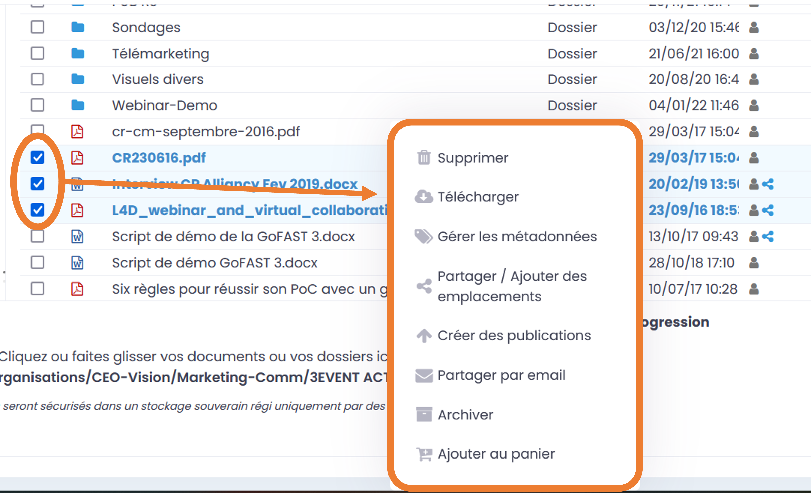

.. figure:: media-guide/FBrowser-15.jpg
   :align: right

Pour sélectionner plusieurs documents dans l’explorateur de fichiers vous devez sélectionner le premier document en tête de votre liste à sélectionner, puis maintenir la touche «Shift» enfoncée tout en sélectionnant le dernier document de votre liste que vous souhaitez sélectionner.  

Cette démarche est valable sur : Windows, Mac, Linux 

Gérer les emplacements (Multi-emplacement = zéro doublon de fichier)
~~~~~~~~~~~~~~~~~~~~~~~~~~~~~~~~~~~~~~~~~~~~~~~~~~~~~~~~~~~~~~~~~~~~~~~

**Multifiler** signifie mettre le *même et seul document à plusieurs endroits* sur la GoFAST et ainsi rendre une même et seule version visible par plusieurs groupes. Il s’agit d’une action de «Partage» évitant tout doublon.

Si votre document est dans votre groupe et que vous voulez que les membres d’un autre groupe puissent le voir aussi pour y travailler, il suffit d’ajouter un emplacement dans les métadonnées du document.

.. figure:: media-guide/image253.png
   :alt: 

Cliquez sur « Gérer les emplacements », et choisissez les différents groupes/espaces/répertoires où vous voulez que le document soit visible (cochez les cases ou cliquez sur le nom de l’espace pour qu’il se retrouve à droite en bleu).

Terminez avec « Enregistrer »

Lisez bien la remarque dans l’encadré

.. figure:: media-guide/image254.png
   :alt: 

Vous pouvez aller plus loin dans l’arborescence en cliquant sur les petits « + » devant les noms d’espaces

.. figure:: media-guide/image255.png
   :alt: 

Lorsque vous retournez sur la prévisualisation du document, vous verrez, dans les métadonnées, les différents emplacements où se trouve le document.

.. figure:: media-guide/image256.png
   :alt: 

Actions sur un Espace
~~~~~~~~~~~~~~~~~~~~~~

Plusieurs actions sont également disponible sur un Espace (voir copie d’écran ci-dessous). 

.. figure:: media-guide/FBrowser-16.png
   :alt:

Exportation des listes de documents
------------------------------------
Sous le profil Administrateur de la plate-forme, de nouveaux menus apparaissent tel que « **Statistics** ». Vous retrouvez ce nouveau sous-menus sous votre Menu Utilisateur. Cette fonctionnalité vous permet alors de visualiser les différentes statistiques découpées en 3 catégories. 

.. figure:: media-guide/Menu-statistics-export-liste-docs.png
   :alt:

Depuis ce nouveau menu, vous visualisez toutes les statistiques utilisateurs, documentaires et d'espaces. Vous devez cliquer sur l'onglet « **Statistiques documentaires** », afin d'accéder au menu qui permet d'exporter une liste de documents. 

.. figure:: media-guide/onglet-statistiques-docs-export.png
   :alt: 

Vous faites le choix des sous-groupes et répertoires dont vous souhaitez exporter votre liste de documents. Une fois votre choix sélectionné, une extraction est faite dans un fichier Excel. 

.. figure:: media-guide/Export_liste_documents.png
   :alt:

Modèle d’arborescence de répertoires
------------------------------------
Créer un modèle d’arborescence de répertoires est une fonctionnalité qui a été implémentée dans le but de permettre aux utilisateurs de la plateforme  GoFAST de dupliquer un gabarit déjà existant sur d’autres espaces pour gagner du temps. Cela est principalement utile quand l’arborescente possède une structure complexe et comprend plusieurs niveaux.

Pour commencer, connectez-vous en tant qu’administrateur de plateforme puis aller dans l’Explorateur. 

Positionnez-vous dans le répertoire «FOLDERS TEMPLATES» qui se trouve dans la barre latérale gauche de la page ( Bloc structure de l'arborescence ), ensuite cliquer sur la menu «Nouveau» puis «Dossier». Vous pouvez créer autant de répertoires et personnaliser votre arborescence à votre convenance. 

Une fois votre gabarit est prêt, il suffit de se rendre dans un répertoire d’un espace de votre choix, cliquer sur le menu «Nouveau» puis «Dossiers depuis un modèle».

Choisissez votre modèle de répertoires, en cochant les dossiers que vous souhaitez dupliquer ensuite cliquer sur le bouton «Valider».

