Editer/Coéditer des Documents/Contenus
=================================================

**Qui peut modifier un document :**

Tous les utilisateurs ayant le rôle de « Contributeur » ou « Administrateur » d’au moins un des Espaces où se trouve le document. 
Donc, si vous êtes membre contributeur dans un Espace, vous pouvez modifier les documents de cet Espace, soit via la fonctionnalité « éditer en ligne », soit « Coéditer avec OnlyOffice ». Pour les autres type de contenus, comme les forums ou pages Wiki, le bouton sera « Modifier ». 

Editer un document depuis PC (via une application installée sur PC)
-----------------------------------------------------------------------------------------

Cette fonction permet d’ouvrir un fichier pour l’éditer avec une application de son PC, sans avoir à le télécharger au préalable en local (sur son PC), ni devoir le recharger sur GoFAST après édition.

Types de fichiers concernés 
~~~~~~~~~~~~~~~~~~~~~~~~

**Le document type « Office » :**

Sera ouvert avec l’application définie par défaut sur votre poste (exemple Office, LibreOffice, WPS). A noter que selon le navigateur et la configuration de votre PC, soit vous avez la possibilité de choisir à ouverture l’application souhaitée, soit celle par défaut s’ouvre automatiquement.

**Autre type de fichiers :**

Pour les fichiers de type PDF, Images, etc. un module nommé « ITHIT » doit être installée au préalable sur le poste et activé dans votre navigateur. Vous pouvez ensuite ouvrir le fichier en édition (ex. un PDF avec Adobe ou Foxit) pour le modifier ou le signer, puis le sauvegarder directement sur GoFAST (clic sur le buton « enregistrer » de votre application).

  .. figure:: media-guide/ithit.png
       :alt:

Comment « Editer depuis PC » :  
~~~~~~~~~~~~~~~~~~~~~~~~

**Depuis la page d’un document :**

 - Allez dans le menu « Burger » (les actions contextuelles) 
 - Cliquez sur « Editer depuis PC »

    .. figure:: media-guide/image157.png
       :alt: 

Cette action est possible également depuis d’autres pages de GoFAST où un document est cité et où il y a un menu « Burger » pour ce document (ex. Fil d’Activité », résultat d’une recherche, etc.). 

**Depuis l’explorateur de fichiers :**

 - Faites un clic-droit sur le document pour ouvrir le menu des actions contextuelles
 - Cliquez sur « Editer depuis PC »

Dans certains cas, le système vous demande votre mot de passe avant d’ouvrir le document, afin de vous identifier. Il faut alors saisir votre identifiant et mot de passe (les mêmes que pour vous connecter à GoFAST).
 

Le document s’ouvre dans Office et vous pouvez l’éditer. Dans certains cas, la Suite Office Microsoft demande « d’activer la modification ». Cliquez dessus pour pouvoir rentrer en édition. 
N’oubliez pas de sauver (icône « disquette » de votre application) avant de fermer le document pour être certain que le système a enregistré vos modifications.

.. figure:: media-guide/image159.png
   :alt: 

Verrou d’édition
~~~~~~~~~~~~~~~~~~~~~~~~

Lorsqu’un document est en cours d’édition par vous ou un autre utilisateur, un verrou est apposé automatiquement. 

Ce verrou apparaitra en « rouge » et « fermé » sur la page du document et dans l’explorateur de fichiers. Cela signifie que personne d’autre ne peut ouvrir le document pour l’éditer, tant que vous n’avez pas fini. Cela évite donc les erreurs de versions et le temps perdu à consolider plusieurs versions en une seule (ex. si trois personnes éditent chacune de son côté le document sans tenir compte du travail des ses collègues).

A côté du verrou vous verrez la photo de l’utilisateur qui édite le document. En passant la souri dessus, vous verrez le nom de l’utilisateur. En cas de besoin, n’hésitez pas à le contacter via le Tchat ou le citer dans un commentaire sur la page du document (pour citer, commencez par saisir @ puis le prénom ou nom de l’utilisateur. Il sera alors alerté automatiquement dans le Tchat).

.. figure:: media-guide/image162.png
   :alt: 

.. NOTE::

   Lors de l’édition d’un document, un message est affiché sur la page du document, en haut du bloc d’informations à droite de la prévisualisation : « Document en cours d’édition, les métadonnées sont verrouillées ».

Le verrou saute automatiquement dès lors que l’on sort de l’édition en fermant son application.  

Actualiser l’aperçu du document
~~~~~~~~~~~~~~~~~~~~~~~~

Afin de faciliter la lecture du document alors qu’un autre utilisateur est entrain de l’éditer, la prévisualisation (sur la page du document) ne se met pas à jour automatiquement, mais une icône « actualiser l’aperçu » devient rouge et vous pouvez cliquer dessus pour actualiser. 

Une fois que vous avez actualisé la prévisualisation, vous pouvez voir la nouvelle version du document, avec les modifications qui viennent d’être faites.

.. figure:: media-guide/image160.png
   :alt: 

Vous pouvez voir qui a fait une action sur ce document dans le bloc d’informations (à droite de la prévisualisation).

Vous pouvez également voir les versions précédentes, en allant dans l’onglet « versions ». 

   
Editer/Coéditer un document via la Suite Collaborative OnlyOffice (Enterprise only) 
-------------------------------------------------------------------------------------
   
.. image:: media-guide/Tag-Enterprise.png
   :align: right
   :scale: 7%

GoFAST apporte une dimension très innovante et vous permet d’éditer des documents dans un simple navigateur **avec d’autres personnes en simultané**. Vous pouvez ainsi travailler à plusieurs, en même temps, sur un même document pour d’importants gains de temps. 

.. CAUTION::   

   Cette rubrique décrit comment éditer/coéditer un fichier bureautique via la Suite OnlyOffice sur GoFAST (ouvrir, fermer, système de verrou…). Toutefois, pour connaitre les nombreuses fonctionnalités de cette Suite collaborative, merci de bien vouloir vous référer à la documentation de OnlyOffice, ici : https://helpcenter.onlyoffice.com/fr/userguides.aspx

Types de fichiers concernés 
~~~~~~~~~~~~~~~~~~~~~~~~
L’édition et la coédition via OnlyOffice n’est possible que pour les fichiers de type Office (ex. docx, xlsx, pptx). 

.. NOTE::

   Contrairement à GoogleDocs/Drive, **vous conservez vos formats Office** et vous pouvez ensuite ouvrir le fichier avec la Suite Microsoft Office ou LibreOffice, sans avoir à changer de format.
   La Suite Collaborative OnlyOffice est totalement intégrée à GoFAST et donc, hébergée soit en SaaS souverain, soit dans votre datacenter et dans ce cas cela limite les besoins de bande passante et garantie une confidentialité totale.

Comment « Coéditer via OnlyOffice » :  
~~~~~~~~~~~~~~~~~~~~~~~~~~~~~~~~
**Depuis la page d’un document :**

 - Allez dans le menu « Burger » (les actions contextuelles).
 - Cliquez sur « Coéditer via OnlyOffice ».
 - La Suite collaborative s’ouvre dans un nouvel onglet de votre navigateur web. 

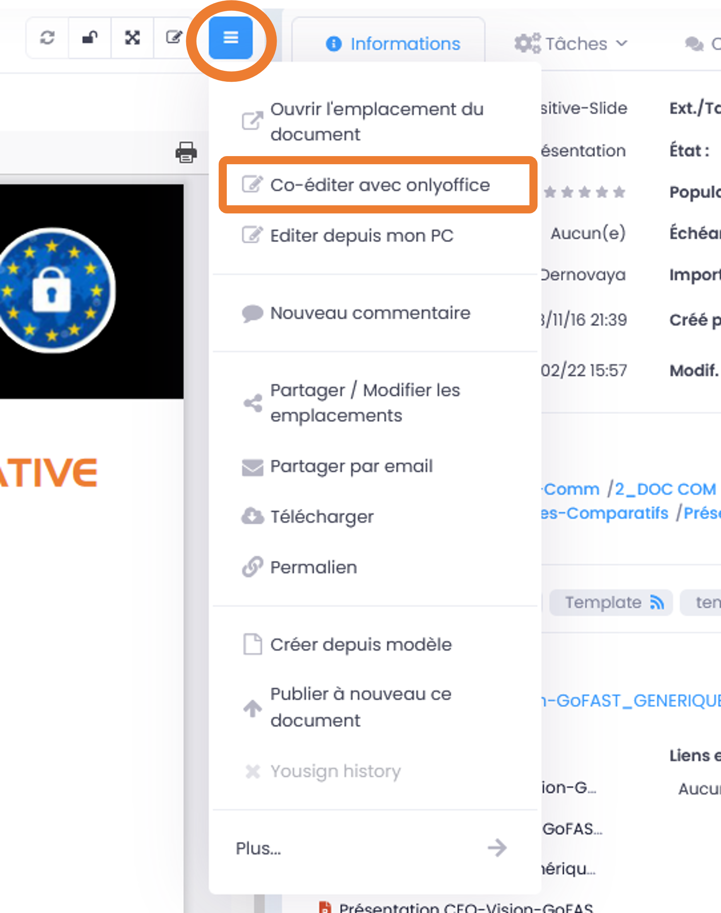

Cette action est possible également depuis d’autres pages de GoFAST où un document est cité et où il y a un menu « Burger » pour ce document (ex. Fil d’Activité », résultat d’une recherche, etc.). 

**Depuis l’explorateur de fichiers :**

 - Faites un clic-droit sur le document pour ouvrir le menu des actions contextuelles
 - Cliquez sur « Coéditer via OnlyOffice »

.. IMPORTANT::

   Si vous souhaitez co-éditer les anciens formats Microsoft (.doc, .xls, .ppt) ou les formats LibreOffice (ex. un .odt), ceux-ci seront convertis dans les formats récents (.docx, .xlsx, .pptx). Selon la mise en page de votre document, il est possible que le passage de la Suite Microsoft Office ou LibreOffice vers OnlyOffice présente quelques écarts. Toutefois OnlyOffice a une compatibilité élevée avec la Suite Microsoft Office, ce qui limite le risque d’avoir une mise en page mal formatée. 
   
Selon le format de fichier, il se peut que ce message apparaisse : 

.. figure:: media-guide/image395.png
   :alt: 

Cliquez sur « Continuer » si vous souhaitez poursuivre l’ouverture avec OnlyOffice. 

Voici l’exemple d’un document texte ouvert avec OnlyOffice, pour coédition. On peut noter qu'un autre utilisateur est entrain d'éditer en même temps le document.

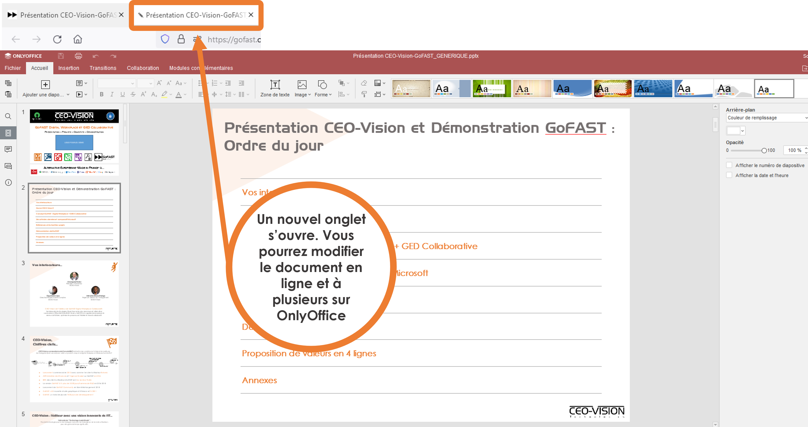

Verrou d’édition
~~~~~~~~~~~~~~~~~~~~~~~~

Lorsqu’un document est en cours d’édition via la Suite OnlyOffice, un verrou est apposé automatiquement. 
Ce verrou apparaitra en « rouge » et « ouvert » sur la page du document et dans l’explorateur de fichiers. 
A côté du verrou vous verrez la photo de l’utilisateur qui est le premier à avoir ouvert le document pour coédition. En passant la souri dessus, vous verrez le nom de l’utilisateur. 

.. figure:: media-guide/image166.png
   :alt: 

.. NOTE::

   Vous pouvez utiliser les fonctionnalités habituelles d’une Suite Office. Notamment, il est recommandé d'activer le mode révision (en bas à droite dans OnlyOffice), les autres utilisateurs amenés à éditer/coéditer ce document, identifieront mieux vos modifications.

.. NOTE::

   Lors de la coédition d’un document, un message est affiché sur la page du document, en haut du bloc d’informations à droite de la prévisualisation : « Document en cours d’édition, les métadonnées sont verrouillées ».

Faites vos modifications, puis fermez OnlyOffice et vous serez redirigé sur la page du document. 
Le verrou saute automatiquement dès lors que tous les utilisateurs sont sortis de la coédition, en fermant OnlyOffice. 
Une fois que tous les utilisateurs ont fermé la Suite OnlyOffice, une nouvelle version est créée. Pour en savoir plus, merci de vous référer à la rubrique « Gestion des versions ». 

.. NOTE::

   OnlyOffice vous permet de co-éditer des contrats, des budgets, des présentations Powerpoint d'une façon beaucoup plus rapide que traditionnellement, c’est-à-dire chacun son tour.

.. CAUTION::  

   Une connexion réseau d'assez bonne qualité est nécessaire pour éviter d’éventuelles pertes de connexion ou des latences lors de la coédition. 

Actualiser l’aperçu du document
~~~~~~~~~~~~~~~~~~~~~~~~
Le fonctionnement de la prévisualisation est le même que l’on « édite depuis PC » ou que l’on « coédite via OnlyOffice ». 
Merci de bien vouloir consulter la sous-rubrique « Actualiser l’aperçu du document » dans la rubrique « Editer un document depuis PC (via une application installée sur PC) ».

Modifier les autres types de contenus (forums, Wiki…)
----------------------------------------------------------------------------
Les actions de modification des autres types (ex. Forums, page Wiki) de contenus suit la même logique que pour les fichiers classiques : les actions sont listées dans le menu « Burger » du contenu. Les possibilités sont dépendantes du type de contenu et de vos droits sur ce contenu (cf. rôle que vous avez des le(s) Espace(s) où se trouve le contenu). 
**Pour savoir comment modifier les autres types de contenus, merci de vous référez aux rubriques suivantes :**

 - « Réunions / Webconférence (Enterprise only) »
 - « Forums et Pages Wiki »
 - « Formulaires »

Gestion des versions 
-----------------------------------------------------
GoFAST dispose d’un gestionnaire de versions de document. Il consiste à numéroter et horodater chaque nouvelle version d’un document après modification (ex. édition depuis PC ou Coédition via OnlyOffice).

**Objectifs principaux de la gestion des versions :**

 - Disposer d’un point de sauvegarde de toutes les versions pour pouvoir récupérer une ancienne version en cas de besoin. 
 - Horodater chaque version pour ainsi savoir de quand date la dernière version. 
 - Identifier l’utilisateurs à l’origine de chaque version 

**Récupérer une ancienne version :**

Si la version actuelle du document est erronée, par exemple si un collègue a supprimé certaines parties par erreur, vous pouvez récupérer la version précédente ou toute autre ancienne version. 

**Sur la page d’un document :**

 - Allez dans l’onglet « Version » du bloc d’information (à droite de la prévisualisation). 
 - Choisissez si vous affichez toutes les versions ou uniquement les version dites « majeures ». 
 - Cliquer sur le numéro de version souhaitée pour lancer le téléchargement. 
 - Le document va être téléchargé sur votre PC (souvent dans le dossier « Téléchargement » de votre Windows), avec à la fin du titre du fichier, le numéro de la version téléchargée.  
Si vous avez besoin d’écraser le document sur GoFAST pour le mettre à jour (=écraser la version en cours), faites un glisser-déposer dans la zone prévue pour, sur la page du document, au-dessus de la prévisualisation. 

.. NOTE::

   La numérotation des versions permet la notion de « version mineur » (ex. 1.39 qui est générée automatiquement à l’enregistrement du document lors de l’édition/coédition) et de « version majeure » (ex. 3.0 qui peut être créée lors d’une mise à jour par glisser-déposer sur la page du document, lors de la création d’une Publication depuis le document de travail ou à tout moment via le menu « Burger » du document).
   
.. NOTE::

   A la création ou au dépôt sur GoFAST d’un nouveau document, le numéro de version sera toujours 1.0. 

Pour plus d’information sur la gestion des versions, merci de vous référer aux rubriques : 

 - « Charger nouvelle version »
 - « Définir comme version majeure »
 - « Supprimer les versions mineures »

Rechercher des Documents / Contenus
=================================

Introduction au Moteur de recherche 
------------------------------------------------------
Fonctionnement du Moteur de Recherche :
~~~~~~~~~~~~~~~~~~~~~~~~~~~~~~~~~~~~
Tout le contenu texte des documents (Word, Excel, PDF, mail, pages web, wiki, etc.) et leurs caractéristiques (les métadonnées) sont indexés. Vous trouvez une information précise ou un fichier par mots-clefs, même approximatifs (pluriel vs singulier, fautes de frappe, etc…) et sans avoir à connaitre le titre. Des mots-clefs approchants sont proposés en cas de recherche infructueuse.

Principaux formats pris en charge par l’indexation
~~~~~~~~~~~~~~~~~~~~~~~~~~~~~~~~~~~~
 - HyperText Markup Language (HTML)
 - Fichiers vectoriels (SVG, VSD)
 - Formats XML et dérivés (XHTML, OOXML, ODF)
 - Documents Microsoft Office (DOC, PPT, EXL, DOCX, PPTX, PPSX, EXLX, etc.)
 - OpenDocument Format (ODF)
 - Documents iWorks
 - Portable Document Format (PDF)
 - Format de publication électronique (EPUB)
 - Rich Text Format (RTF)
 - Formats de compression et d'emballage (Tar, RAR, AR, CPIO, Zip, 7Zip, Gzip, BZip2, XZ et Pack200)
 - Formats de texte (TXT)
 - Formats de flux et de la syndication (RSS, Atom)
 - Formats d'aide (CHM)
 - Formats audio - au cas où il y a du texte intégré, ex : paroles (mp3, mp4, Vorbis, Speex, Opus, Flac etc.)
 - Dossiers et archives de classe Java
 - Code source (Java, C, C++, Groovy, etc)
 - Formats e-mail (ex : eml, PST, MSG, TNEF)

Recherche par mots-clefs
-----------------------------------
Saisir des mots-clefs dans la barre de recherche (entrée/suggestions)
~~~~~~~~~~~~~~~~~~~~~~~~~~~~~~~~~~~~~~~~~~~~~~~~~~~~~~~~~~
La recherche se trouve dans la barre d’accès rapide (menu du haut) pour être accessible à tout moment, depuis toutes les pages de GoFAST. 
Pour rechercher, il suffit de saisir les mots clefs-souhaités et cliquer sur le bouton "loupe" ou faire "Entrer" sur son clavier. 

.. NOTE::

   Une recherche avec 1 ou 2 mots-clefs sera élargie, alors qu'une recherche avec 3 mots-clefs ou plus sera plus restreinte. En effet, avec 2 mots clefs le moteur de recherche va proposer des contenus qui ont soit les 2 mots-clefs, soit l'un des deux mots-clefs. Alors qu’avec plus de 3 mots-clefs le moteur de recherche va proposer des contenus qui répondent à au moins 75% de votre recherche. Donc, plus il y a de mots-clefs, plus la recherche est restreinte. Il est donc conseillé de rentrer peu de mots-clefs si on n’est pas certain des termes recherchés et au contraire, rentrer plus de 3 mots-clefs si on sait exactement ce qu’on cherche et qu’on est sûr des mots-clefs saisis. 

Utiliser des opérateurs booléens 
~~~~~~~~~~~~~~~~~~~~~~~~~~~~~~~~~~~~
Par défaut, le moteur de recherche fonctionne avec la notion de "OU" : lorsqu'on saisit 2 mots-clefs, le moteur va proposer les contenus avec le 1ère mot-clef OU l'autre mot-clef OU les 2 mots-clefs. 
Cela permet un résultat de recherche très large, mais parfois il est nécessaire de restreindre la recherche. 
Il est alors possible d’utiliser les « opérateurs booléens » qui sont des symboles à mettre avant ou après les mots-clefs, pour indiquer au moteur de recherche comment traiter ces mots-clefs en particulier (ex : mot obligatoire, à exclure, chaine de mots exacte, etc.).

**Principaux opérateurs booléens :**

* **AND** : intercalé entre les mots-clefs permet d'indiquer au moteur de recherche qu'il faut que tous les mots clefs soit présents (ex: Mémoire AND Technique AND Fonctionnalités)
* **+** : ajouté devant un mot-clef permet de le rendre obligatoire (ex : Mémoire Technique +Fonctionnalités) pour indiquer au moteur de recherche que parmi les termes saisis, certains doivent obligatoirement être présents dans le document recherché. 
* **"..."** : appliqués sur une suite de mots permet de rechercher une expression exacte (ex : "Mémoire Technique et Fonctionnalités GoFAST") et donc d’indiquer au moteur de recherche d’exclure les documents qui contiennent ses mots clefs s’ils ne sont pas exactement comme dans l’expression saisie. 
* ***** : ajoutée à la fin ou au début d’un mot-clef permet de le rendre approximatif (ex : Fonction*) et donc d’indiquer au moteur de recherche d’afficher les documents qui contiennent tous les termes qui ont pour racine le mot-clef saisi. 

Résultat de recherche
------------------------------

Affichage du résultat par pertinence 
~~~~~~~~~~~~~~~~~~~~~~~~~~~~~~~~~~~~~~~~~~~~~~~~~~~~~~~~~~~~~~~~~
Tout un ensemble de critères est pris en compte dans le calcul de cette pertinence, dont : 
 - le nombre d’occurrences des mots-clefs recherchés, 
 - les emplacements des mots-clefs (ex : titre du fichier, d’un paragraphe dans le document…), 
 - les dates de création et modification (ex : un contenu récent sera privilégié vis-à-vis d’un document ancien), 
 - la popularité des contenus (ex : un document consulté souvent sera privilégié vis-à-vis d’un document qui n’a pas été consulté depuis des mois).

Actions depuis le résultat de recherche
~~~~~~~~~~~~~~~~~~~~~~~~~~~~~~~~~ 
Pour chaque document affiché dans le résultat de recherche, vous pouvez consulter :
 - L’icône indiquant le type du document (fichier texte, tableur, PDF, image, vidéo…) ou autre contenu (forum, page Wiki, profil utilisateur, Espace Collaboratif…),
 - Le titre du fichier (un clic dessus permet d'aller sur la page du document), 
 - Le menu « Burger » (les actions contextuelles) sur un document (icône avec 3 petite barres à droite du titre du document), 
 - Des "fragments" de texte qui sont des extraits du contenu avec les mots-clefs recherchés et qui permettent de vérifier si le document est bien celui que l’on cherche sans avoir à l’ouvrir (si plusieurs extraits sont trouvés, il est possible de les consulter l’un après l’autre en utilisant la pagination), 
 - Un bouton "prévisualiser" qui permet d’afficher un aperçu du document en un clic (NB : certains contenu ne le permettent pas car ne bénéficient pas la prévisualisation)
 - Des informations clefs sur le contenu (dont date de création/dernière modification et le(s) Espace(s) ù se trouve le document)
 - Les métadonnées associées aux documents, dont : étiquettes, catégories, importance et états des documents. 

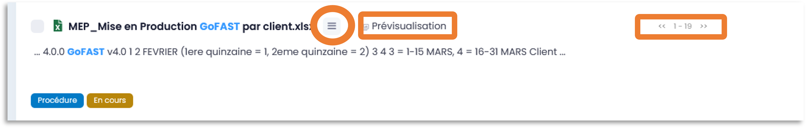

Recherche contextuelle dans un document
~~~~~~~~~~~~~~~~~~~~~~~~~~~~~~~~
Le résultat de recherche permet de cliquer sur les mots-clefs mis en gras dans les extraits des contenus trouvés.
Ces mots en gras permettent une recherche contextuelle dans un document : en cliquant sur un mot-clé mis en gras, vous accéder à la page du document avec dans la prévisualisation, la mise en évidence des mots-clefs recherchés et la possibilité de les passer l’un après l’autre. 
Cette recherche contextuelle offre un important gain de temps lorsqu’il faut trouver un élément précis dans un document en particulier ou pour en faire une lecture rapide.  

Options de Recherche 
------------------------------

Recherche normale ou stricte
~~~~~~~~~~~~~~~~~~~~~~~~
La recherche stricte est une option qui signifie que tous les mots-clés renseignés dans la barre de recherche sont obligatoires et qu’ils doivent être impérativement présents dans les documents listés dans le résultat de recherche. 
Pour chaque document indexé, ces mots clés se trouvent soit dans son titre, soit dans son contenu, soit dans les commentaires et les métadonnées.
Pour activer/désactiver cette option, sur la page d’un résultat de recherche, allez dans le bloc des Options de recherche et cliquer sur « l’interrupteur ». Il est en couleur si activé ou grisé si non activé. 

.. figure:: media-guide/image038.png
   :alt: 

.. IMPORTANT:: 
   Si vous utilisez des « Opérateurs booléens », notez que les mots clés précédés par un tiret « - » sont exclus de la recherche.
   Exemple : « Réunion février 2019  -Mardi » ( Tous les documents contenant le mot clé «Mardi» seront exclus des résultats ).

Autres options de recherche disponibles
~~~~~~~~~~~~~~~~~~~~~~~~~~~~~~~~

 - **Conserver les filtres** (permet de changer les mots-clefs saisis dans sa recherche, sans avoir à remettre ses filtres entre deux recherches)

 - **Rechercher uniquement dans le titre** 

 - **Rechercher les contenus archivés** (état « pré-archivé ») 

 - **Rechercher les contenus obsolètes** (état « Obsolète »)

 - **Rechercher dans la corbeille** (pour retrouver un document supprimé et restaurable) 

Filtrer le résultat de recherche
---------------------------------------
Dans le cas où les mots-clefs saisis ne permettent pas de retrouver rapidement le document recherché, GoFAST propose de nombreux filtres.
Pour appliquer des filtres, il faut aller dans le bloc des filtres, à droite du résultat de recherche, puis déplier les types de filtres souhaités (ex. Catégories, Etat, Date de création, Type, etc.).
La liste des filtres est conditionnée au résultat de recherche, ex : si pour les mots-clefs saisis il n'y a aucun document de type PDF, ce format ne sera pas proposé dans les filtres.

.. NOTE::

   La plupart des métadonnées que vous pouvez associer à un document, ou qui sont générées automatiquement (ex. date de création), peuvent être utilisées comme filtre du résultat de recherche. 

**Filtres disponibles :**

Entre parenthèses, le nombre de documents disponibles en ajoutant ce filtre est affiché)

 - Date de création, 
 - Date de modification, 
 - Type de document (selon le format de fichier), 
 - Etiquettes, 
 - Catégorie,
 - Espaces Collaboratifs,
 - Créateur, 
 - Dernier contributeur, 
 - Auteur, 
 - Etat, 
 - Importance, 
 - Langue,
 - Echéance.

Il est possible d’effacer les filtres de recherche un à un, en cliquant sur la croix rouge correspondante, dans le bloc à droite du résultat de recherche.

Trier le résultat de recherche
----------------------------------------

Par défaut, le résultat de recherche classe les documents par pertinence selon les mots-clefs recherchés (voir "fonctionnement du moteur de recherche").
 
**Il est possible de modifier de tri pour classer les contenus par :** 

 - Titre (ordre alphabétique)
 - Auteur
 - Popularité
 - Date de création 
 - Date de modification
 - Type/Format 

.. NOTE::
trier le résultat de recherche sur un autre critère que la pertinence, peut afficher en haut de la liste des contenus qui correspondent mois bien aux mots-clefs saisis, car le critère sélectionné pour le tri prime. Pour affiner votre recherche, il est donc plutôt conseillé d’utiliser les filtres qui se trouvent dans le bloc à droite du résultat de recherche. 

Sauvegarde sa recherche
------------------------------------

Avec GoFAST, il est possible de sauvegarder manuellement plusieurs recherches prédéfinies et les relancer en un clic à tout moment. Cela permet un gain de temps considérable.

Une fois votre recherche au point (avec ou sans mots-clefs, avec vos filtres), il suffit de cliquer sur la disquette dans le bloc de droite (au-dessus des options de recherche), donner un titre à votre recherche puis appuyer sur « Enregistrer ». 

**Pour accéder aux recherches sauvegardées, vous avez deux possibilités :**

 - Dans la barre de recherche, à droite il suffit de cliquer sur la flèche descendante.

 - Depuis le bloc de recherche à droite, onglet « Mes recherches enregistrées », à ce niveau vous pouvez :
 
 	- Exécuter une recherche sauvegardée en cliquant dessus,
 	- Remplacer « écraser » la recherche sauvegardée par la recherche courante en cliquant sur la « Disquette », Supprimer cette recherche en allant sur le bouton « Corbeille »,
 	- Supprimer une recherche sauvegardée en cliquant sur « Corbeille ».

Explorateur de fichiers GoFAST File Browser
============================================

Accéder à l'explorateur de fichiers GoFAST 
------------------------------------------

Il existe 4 façons d'accéder à l'explorateur de fichiers GoFAST File Browser :

1. Depuis la barre des accès rapides (menu principal du haut), en allant sur l’icône « Dossier », puis un type d’espace et dans le menu qui s’affiche vous pouvez naviguer dans l’arborescence des Espaces pour aller sur celui que vous souhaitez. Vous serez redirigé vers la page de l’Espace et arriver par défaut sur l’onglet « Document » où il y a l’explorateur de fichiers. 

.. figure:: media-guide/FBrowser-01.png
   :alt:

2. Si vous êtes sur la page d'un Espace, cliquez sur l'onglet « Documents ».

.. figure:: media-guide/FBrowser-02.png
   :alt:

3. Depuis le menu principal de gauche, allez sur « Espaces Collaboratifs » et vous serez alors redirigé vers la page d’un Espace, onglet « Documents ». 

4. Vous pouvez à tout moment déplier le bloc de l'explorateur de fichiers qui est caché à gauche (petite icône avant le menu principal de gauche). Cet explorateur est disponible sur presque toutes les pages de GoFAST, dont la page d’un document. 

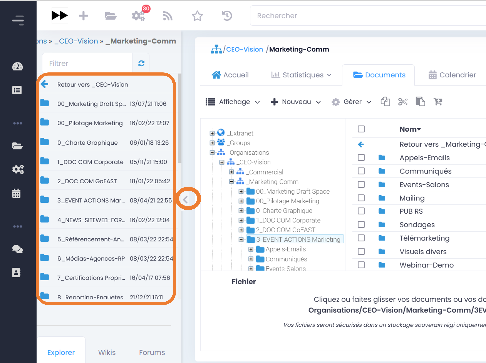

Se repérer dans GoFAST File Browser
-----------------------------------

Se repérer dans l’explorateur de fichiers
~~~~~~~~~~~~~~~~~~~~~~~~~~~~~~~~~~

**L'explorateur de fichiers GoFAST comporte 4 zones distinctes :**

1. Menu des actions (barre horizontale en haut de l’explorateur de fichiers)
2. Zone structure de l'arborescence (zone verticale à gauche)   
3. Zone principale affichant le contenu d'un dossier (zone la plus large, centre-droit)
4. Zone de chargement, avec la barre de progression (zone horizontale en bas) 

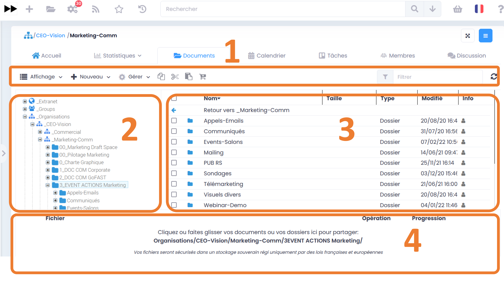

Les divers contenus affichés dans l’explorateur de fichiers sont identifiés par des icônes selon leur type/format de fichier. 
Chaque type d’espace collaboratif a une icône spécifique (Organisation, Groupe, Extranet, Public, Personnel). Les dossiers dits classiques sont représentés par l’icône « Dossier ».

Dans la zone principale, les dossiers et fichiers sont présentés sous forme de tableau avec pour colonnes : 
 - Le nom du dossier ou du contenu (le titre) 
 - La taille 
 - La type de dossier ou le format, l’extension du fichier 
 - La date de dernière modification 
 - Infos : vos droits associés aux dossiers ou contenus et les partages en vigueur

.. Note:: 
   Pour plus de lisibilité, vous pouvez redimensionner les blocs 2, 3 et 4 ainsi que les en-têtes des colonnes de l’explorateur.

.. Note:: 
   Dans la zone principale à la première ligne, vous disposez d'un bouton qui permet de revenir à l’emplacement précédent. 

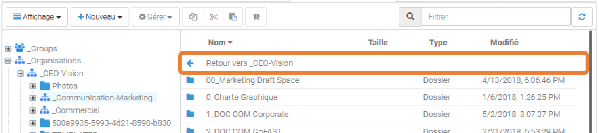

Comprendre les icônes (Multi-emplacement et permissions)
~~~~~~~~~~~~~~~~~~~~~~~~~~~~~~~~~~~~~~~~~~~~~~~~~~~

Dans l’explorateur de fichiers, il existe plusieurs icônes communes dans la colonne « Info » de la zone principale. Ces icônes donnent des informations concernant le multi-emplacement et vos permissions sur les documents, les répertoires et les espaces. L’objectif de cet affichage est de simplifier le travail de l’utilisateur et d'éviter la duplication inutile des éléments.

**Ci-dessous la liste des icônes et leur signification :**

+-------------------------------------------------------+---------------------+--------------+--------------------------------------------------------------------------------------------------------------------------------------------------+
| Icônes	                                        | Permissions         |            Significations                                                                                                                                       |
+=======================================================+=====================+=================================================================================================================================================================+
| .. figure:: media-guide/icon-read-only.png            | Lecture Seule       | Vous avez des permissions de lecture seule, vous pouvez voir tous les contenus de ce dossier / cet espace mais vous n'aurez pas de permissions supplémentaires. |
|    :alt:                                              |                     |                                                                                                                                                                 |
+-------------------------------------------------------+---------------------+-----------------------------------------------------------------------------------------------------------------------------------------------------------------+
| .. figure:: media-guide/icon-contributor.png          | Contributeur        | Vous avez des permissions de contribution, vous pourrez collaborer sur tous les contenus de ce dossier / cet espace.                                            |
|    :alt:                                              |                     |                                                                                                                                                                 |
+-------------------------------------------------------+---------------------+-----------------------------------------------------------------------------------------------------------------------------------------------------------------+
| .. figure:: media-guide/icon-owner.png                | Propriétaire        |Vous pouvez gérer ce contenu (édition, suppression) car vous avez des droits de créateur sur celui-ci.                                                           |
|    :alt:                                              |                     |                                                                                                                                                                 |
+-------------------------------------------------------+---------------------+-----------------------------------------------------------------------------------------------------------------------------------------------------------------+
| .. figure:: media-guide/icon-administrator.png        | Administrateur      | Vous avez des permissions d'administration, vous pouvez gérer tous les contenus de ce dossier / cet espace.                                                     |
|    :alt:                                              |                     |                                                                                                                                                                 |
+-------------------------------------------------------+---------------------+-----------------------------------------------------------------------------------------------------------------------------------------------------------------+
| .. figure:: media-guide/icon-share.png                | Partagé             | Ce contenu est dans plusieurs emplacements mais vous n'avez pas accès à tous ces emplacements.                                                                  |
|    :alt:                                              |                     |                                                                                                                                                                 |
+-------------------------------------------------------+---------------------+-----------------------------------------------------------------------------------------------------------------------------------------------------------------+
| .. figure:: media-guide/icon-cat-specefic.png         | Catégorie spéciale  | Vous pouvez seulement consulter ce contenu et le commenter car il a des permissions spéciales (archivé, DUA...).                                                |
|    :alt:                                              |                     |                                                                                                                                                                 |
+-------------------------------------------------------+---------------------+-----------------------------------------------------------------------------------------------------------------------------------------------------------------+

Déposer des fichiers sur GoFAST via l'explorateur 
-----------------------------------------------------------------

Pour déposer des fichiers depuis votre PC vers GoFAST, il est conseillé de faire un Glisser/Déposer directement dans l’espace ou le dossier souhaité.

.. WARNING:: 

   Il faut déposer le(s) fichier(s) soit dans le cadre principal (zone 2 sur la copie écran ci-dessus), soit dans le cadre à gauche où il y a l'arborescence (zone 3 sur la copie écran au-dessus).

Les fichiers ainsi déposés sont chargés et la progression est affichée dans la zone horizontale en bas de l'explorateur. Vous pouvez à tout moment cliquer sur *Pause*, *Annuler* ou bien *Reprendre* le chargement. 

.. NOTE:: 

   Le chargement se fera uniquement si vous avez les droits pour déposer des contenus dans l'espace concerné (dont non autorisé pour les membres ayant le rôle « Lecture Seule » dans l’Espace).  
   
.. NOTE::
  Lorsque vous effectuez un glisser-déposer d'un document portant le même nom depuis votre PC vers GoFAST, une fenêtre s'ouvrira vous demandant si vous souhaitez écraser le fichier existant.

.. WARNING:: 

   Pendant le chargement des fichiers depuis le PC vers GoFAST : ne pas supprimer, ni déplacer les fichiers côté PC car pour charger il faut conserver l'emplacement d'origine. 

Barre d’outils de GoFAST File Browser
--------------------------------------------------

La barre d’outils de l’explorateur de fichier se situe dans la partie haute de l’écran.

En survolant les icônes avec la souris, vous verrez à quelle action elle correspond avec un petit mot affiché sous l’icône.

Les actions possibles depuis cette barre sont listées si après.  

Modifier la manière dont sont affichés les contenus
~~~~~~~~~~~~~~~~~~~~~~~~~~~~~~~~~

.. figure:: media-guide/FBrowser-06.png
   :alt:

.. NOTE:: 

   Le mode d’affichage de l’explorateur choisi s’applique instantanément partout.

Créer un nouveau contenu dans le dossier sélectionné
~~~~~~~~~~~~~~~~~~~~~~~~~~~~~~~~~

Si vous appuyez sur le bouton Nouveau, vous avez le choix de créer à l’emplacement en cours : 
 - Un dossier 
 - Un dossier depuis modèle permet d’ajouter plusieurs dossiers selon un template d’arborescence préenregistré 
 - Un ou plusieurs documents 
 - Un article (page Wiki)

.. figure:: media-guide/FBrowser-07.png
   :alt:

.. NOTE::

   Pour créer un nouveau document dans l'emplacement où vous vous trouvez, cliquez sur *Nouveau*, puis *Document*. Vous serez alors ramené vers le formulaire de création de document avec l'emplacement présélectionné.
   

Gérer les métadonnées (taxonomie) et les emplacements des contenu(s)
~~~~~~~~~~~~~~~~~~~~~~~~~~~~~~~~~

Pour pouvoir cliquer sur le bouton « Gérer » il faut au-préalable sélectionner au moins un dossier ou contenu dans la zone principale de l’explorateur de fichiers.
Une fois les éléments sélectionnés, vous pouvez réaliser des actions en masse via ce bouton « Gérer », c’est-à-dire sur plusieurs fichiers ou contenus simultanément.

**Les actions disponibles sont :**

 - Gérer les métadonnées
 - Partager / Ajouter des emplacements  
 - Créer des publications 
 - Partager par email 
 - Pré-Archiver 
 - Ajouter au panier

.. Note:: Les modifications d'informations de taxonomie sont possibles sur : l'état, la catégorie, le(s) étiquette(s), et la langue. Dans le cas où vous ne souhaitez pas modifier tous ces éléments, laisser le champ positionné sur *Ne pas modifier*. Ces informations serviront ensuite dans les filtres d’un résultat de recherche. 

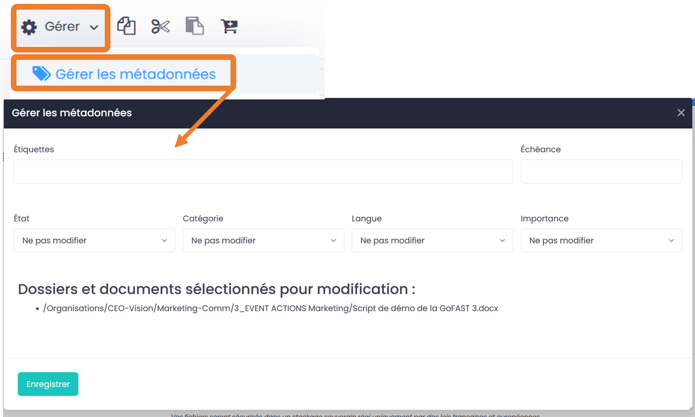

Filtrer les contenus
~~~~~~~~~~~~~~~~~~~~~~~~~~~~~~~~~

Cette fonctionnalité permet de retrouver vos documents plus facilement dans le dossier où vous vous trouvez. Dans la barre *Filtre* (dans la zone principale de l’explorateur de fichiers), écrivez le titre du document que vous recherchez, et tous les documents du dossier seront filtrés.

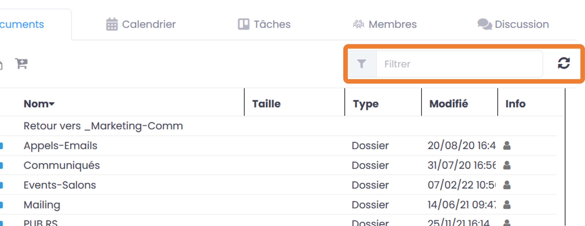

Copier/Couper/Coller un document
~~~~~~~~~~~~~~~~~~~~~~~~~~~~~~~~~

**Copier/Coller un document :**

L’icône des 2 feuilles superposées permet de Copier le document sélectionné dans un autre emplacement de la GoFAST, il vous faudra alors ensuite appuyer sur la dernière icône quand vous voudrez coller le document à l’emplacement où vous souhaitez le coller, clic-droit de la souris et « Coller ».

Cette démarche revient à dire que le document sera dupliqué et le risque à ce moment-là est d’avoir des doublons car si quelqu’un modifie le document à un endroit, l’autre document copié ne sera pas modifié lui. Vous vous retrouverez alors avec 2 documents de même nom, à des emplacements différents, avec des versions différentes.

Dans ce cas d’usage, nous vous conseillons de privilégier l’utilisation de la fonction multi-emplacements. Copier-coller un document est utile donc uniquement si on souhaite créer un nouveau document semblable au premier et en changeant le titre, mais non pour partager un même document dans plusieurs emplacements.

.. NOTE:: 
   GoFAST vous permet le multi-emplacement des documents sans créer de copies de vos documents. Le multi-emplacement est préférable (via les métadonnées), ainsi il permet de garder la même version du document visible à partir de plusieurs emplacements et évite les doublons avec des versions différentes et toujours avec la mise à jour la plus actuelle. ( = un seul document, une seule version actuelle, un permalien unique). 

.. figure:: media-guide/FBrowser-09.png
   :alt: 
      

**Couper/Coller un document**

Le principe est proche de celui de Copier/Coller, mais le Couper/Coller permet de déplacer un dossier vers un autre emplacement sur GoFAST =. Cette fois, il faut utiliser les ciseaux pour couper et l’avant dernier icône noir et blanc pour Coller.

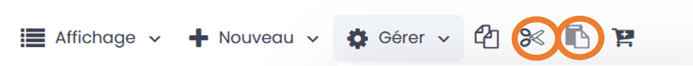

Cette démarche, contrairement à la précédente permet d’éviter les doublons. Il n’y alors qu’une version du document à un seul endroit sur GoFAST.

.. NOTE:: 

   Cela fonctionne aussi avec les raccourcis claviers habituels : 
    - CTRL+ C pour Copier
    - CTRL + X pour Couper 
    - CTRL + V pour Coller

.. NOTE:: 

   C’est le même principe que de déplacer en glissant le document d’un emplacement à un autre dans l’arborescence. Vous ne pouvez Couper/Coller des documents que dans GoFAST. Vous ne pouvez donc pas coller un document externe à la GoFAST, il faut le télécharger préalablement. 
   Il est également possible de déplacer un document en modifiant ses emplacements.
  
  
Ajouter un/des document(s) au panier
~~~~~~~~~~~~~~~~~~~~~~~~~~~~~~~~~

Lorsque vous sélectionnez un ou plusieurs fichiers vous avez la possibilité en cliquant sur l'icône « Panier » de les ajouter à votre panier documentaire. 
Ce panier documentaire d'exécuter des actions sur une sélection de documents, comme lancer un processus de validation (workflow).

Pour plus de détails voire le paragraphe consacré aux Processus de Tâches (Workflows) » et au « Panier Documentaire ».

.. figure:: media-guide/FBrowser-11.png
   :alt: 

Actions depuis GoFAST File Browser (Explorateur de Fichiers)
-----------------------------------------------------------

Les actions autorisées sur les espaces, dossiers et/ou fichiers visibles dans l'explorateur de fichiers restent strictement conforme à vos droits sur l'espace concerné.
Lorsque vous êtes dans l’explorateur de fichiers, faites un clic droit pour afficher le menu des actions contextuelles. 

Actions sur un unique document
~~~~~~~~~~~~~~~~~~~~~~~~~~~~~~~
Lorsque vous faite un clic droit sur le document souhaité, le menu des actions contextuelles s’ouvre et vous permet de réaliser diverses actions, sans pour autant avoir besoin d’aller sur la page du document. 

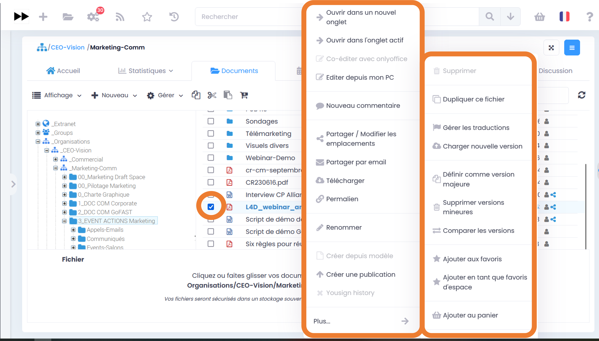

Pour connaître la liste des actions possibles via le menu des actions contextuelles sur un document (menu « Burger »), merci de vous référer à la rubrique : « Menu ses actions contextuelles  ».

En plus des actions disponibles habituellement dans le menu « Burger », depuis l’explorateur de fichiers, vous avec ces deux actions supplémentaires : 
 - Ouvrir dans un nouvel onglet (de votre navigateur)
 - Ouvrir dans l’onglet actif (remplace l’affichage en cours) 

Actions sur une sélection de fichiers ou dossier (classique)
~~~~~~~~~~~~~~~~~~~~~~~~~~~~~~~~~~~~~~~~~~~~~~~~~~~~~~~~~~~~~~
Pour sélectionner plusieurs documents dans l’explorateur de fichiers vous devez cocher les cases qui sont à gauche des titres des fichiers (dans la zone principale de l’explorateur de fichiers). Vous pouvez sélectionner tous les contenus de l’emplacement où vous vous trouvez en un clic dans la case qui se trouve tout en haut de la liste des contenus. 

.. Note::

   Vous pouvez également sélectionner le premier document en tête de votre liste à sélectionner, puis maintenir la touche « Shift » enfoncée tout en cliquant sur le dernier document de la liste que vous souhaitez sélectionner. Cette démarche est valable sur : Windows, Mac, Linux
   
Via un clic-droit sur une sélection de plusieurs fichiers, les actions proposées sont restreintes par rapport à l’action sur un fichier unique : 

 - Supprimer 
 - Télécharger
 - Compresser
 - Gérer les métadonnées
 - Partager / Ajouter des emplacements 
 - Créer des Publications 
 - Partager par email
 - Pré-Archiver
 - Ajouter au panier 

.. figure:: media-guide/FBrowser-14-modifié.png
   :alt:

.. Note:: Lors de la multi-sélection, si un dossier est sélectionné, seules deux actions sont disponibles "Supprimer" et "Compresser"

Télécharger en masse les documents
~~~~~~~~~~~~~~~~~~~~~~~~~~~~~~~~~

Vous pouvez télécharger en masse des documents depuis l’explorateur de fichiers.

Après avoir sélectionné les documents voulus, cliquez sur « Télécharger ». Cela téléchargera un fichier ZIP sur votre ordinateur.

Gestion des ZIP depuis l’explorateur de fichiers
~~~~~~~~~~~~~~~~~~~~~~~~~~~~~~~~~

Il est possible de compresser et décompresser des fichiers depuis l’explorateur de fichiers de GoFAST.

**Compression de fichiers et dossiers**

Après avoir sélectionné les éléments voulus, il suffit de faire un clic droit sur l’un d’eux et de faire un clic gauche sur « Compresser ».

La fenêtre de compression s’ouvre :
 - Les fichiers sélectionnés sont affichés
 - Cliquez sur « Compresser » pour finaliser la création du fichier ZIP
 
Une fois celui-ci créé, il est possible d’interagir avec le fichier ZIP comme n’importe quel fichier.

**Extraction de fichiers et dossiers**

Via un clic droit sur un fichier ZIP ouvrant les actions proposées, cliquez sur « Plus », puis sur « Extraire ».

La fenêtre d’extraction s’ouvre :
 - Le fichier ZIP sélectionné est affiché
 - Cliquez sur « Extraire » 
 
.. Note:: Si les fichiers de ce fichier ZIP existent déjà dans cet espace, un nouveau dossier sera créé avec le nom du fichier ZIP et les fichiers y seront extraits.

 
Partager par email en masse les documents
~~~~~~~~~~~~~~~~~~~~~~~~~~~~~~~~~

Il est possible d'envoyer plusieurs fichiers via un partage par mail. 

.. Note:: Cette fonctionnalité est possible unitairement sur la page d'un document, mais aussi en masse depuis GoFAST File Browser. 

Après avoir sélectionné les documents souhaités, il suffit de cliquer sur *Gérer* (barre des tâches de l’explorateur de fichiers) ou faire un clic-droit sur votre sélection, puis cliquer sur *Partager par email*. 

Le formulaire d'envoi par email s'ouvre et il faut alors entrer les utilisateurs (GoFAST ou emails externes).

L'utilisateur recevra alors une notification listant tous les documents avec un bouton "Télécharger les documents", dès qu'il cliquera dessus, il sera redirigé vers la page de téléchargement :

.. figure:: media-guide/Ecran-GoFAST_GoFASTFileBrowser_Partager-par-email-en-masse-telechargement.png
	:alt:

.. Note:: 
	Vous recevrez une notification par email dès que la personne a téléchargé le document.

Créer en masse les Publications de documents
~~~~~~~~~~~~~~~~~~~~~~~~~~~~~~~~~

Il est possible de générer des publications depuis une sélection de document de travail pour partager dans d'autres Espaces Collaboratifs des versions finies/validées, sans partager tout l'historique des versions et commentaires des documents de travail. Les publications sont ainsi largement partagées et les documents de travail restent accessibles uniquement dans les Espaces d'origine. 

.. Note:: 
   Cette fonctionnalité est possible unitairement sur la page d'un document, mais aussi en masse depuis GoFAST File Browser. 
   
Après avoir sélectionné les documents souhaités, il suffit de cliquer sur *Gérer* ou faire un clic-droit sur votre sélection, puis sur *Créer des publications*. 

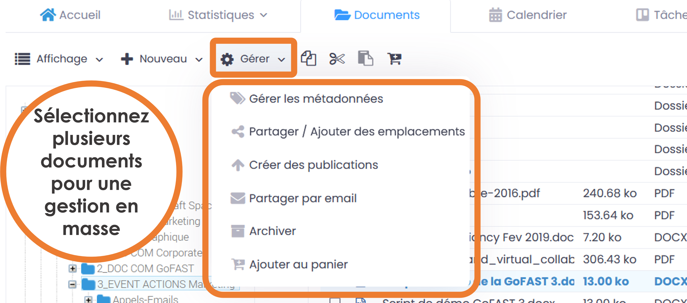

Le formulaire de gestion des publications s'ouvre et il faut alors cocher les emplacements où seront partagées ces publications. Il est possible de demander à convertir au format PDF ou de laisser les formats d'origine. 

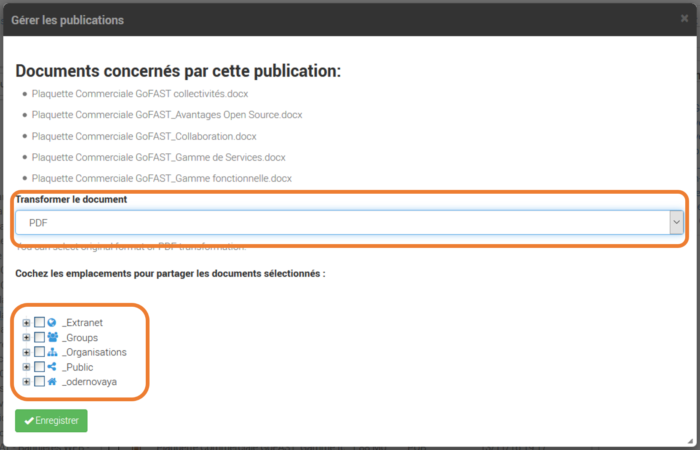
   
.. Note:: 

   Les publications sont une fonctionnalité clef pour une gestion efficace et en toute sécurité des documents.
  

Pré-Archiver en masse les documents
~~~~~~~~~~~~~~~~~~~~~~~~~~~~~~~~~
Il est possible de prés-archiver une sélection de documents en une fois. 

.. Note:: 

   Cette fonctionnalité est possible unitairement sur la page d'un document, mais aussi en masse depuis GoFAST File Browser. 
   
Après avoir sélectionné les documents souhaités, il suffit de cliquer sur *Gérer* puis sur *Gérer les métadonnées*, une fênetre s'ouvre et vous selectionnez *Pré-Archivé* sur le champs *Etat* puis cliquez sur « Enregistrer »

.. figure:: media-guide/Ecran-GoFAST_GoFASTFileBrowser_Archiver-en-masse.png

Partager / Ajouter des emplacements (Multi-emplacement = zéro doublon de fichier)
~~~~~~~~~~~~~~~~~~~~~~~~~~~~~~~~~~~~~~~~~~~~~~~~~~~~~~~~~~~~~~~~~~~~~~~
Il est possible d’ajouter des emplacements à un ou plusieurs documents en une fois, depuis l’explorateur de fichiers. Il s’agit ici de partager sans doublonner les documents.

Pour en savoir plus sur la notion de Multi-emplacement, merci de vous référer aux rubriques : 
 - « Modifier les Emplacements/Visibilité 
 - « Espaces Collaboratifs »

Après avoir sélectionné les documents souhaités, il suffit de cliquer sur *Gérer* ou faire un clic-droit sur votre sélection, puis cliquer sur « Partager / Ajouter des emplacements ».

.. figure:: media-guide/image253.png
   :alt: 

**La fenêtre d’ajout d’emplacement s’ouvre :**

 - Cocher les différents emplacements où vous voulez partager le document.
 - Terminez en cliquant sur « Enregistrer »

Lisez bien la remarque dans l’encadré :

.. figure:: media-guide/image254.png
   :alt: 

Vous pouvez aller plus loin dans l’arborescence en cliquant sur les petits « + » devant les noms d’espaces :

.. NOTE::
  Si vous n'avez pas les droits d'administration de l'espace ou si vous n'êtes pas le propriétaire du document, la case d'emplacement sera grisée. Vous pourrez partager le document dans plusieurs emplacements, mais vous ne pourrez pas le retirer de son emplacement initial.

Lorsque des documents ont plusieurs emplacements, une icône « partagé » est affichée dans la colonne « info » dans la zone principale de l’explorateur de fichiers.

Modèle d’arborescence de répertoires (dossiers)
------------------------------------
Créer un modèle d’arborescence de répertoires est une fonctionnalité qui a été implémentée dans le but de permettre aux utilisateurs de la plateforme GoFAST de dupliquer un ensemble de dossiers/sous-dossiers pour gagner du temps. Cela est très pratique quand on doit construire dans un Espace, une arborescence type, par exemple un modèle d’arborescence pour des projets. 

.. NOTE:: 
   Les modèles d'arborescences sont à créer dans FOLDERS TEMPLATES par les support-utilisateurs. Ce dossier se trouve dans l'explorateur de fichiers et est uniquement visible par les support-utilisateurs.

Dans la barre de tâche de l’explorateur de fichiers, cliquez sur « Nouveau » puis « Dossier depuis modèle ». 

Choisissez votre modèle de répertoires, en cochant les dossiers que vous souhaitez dupliquer ensuite cliquer sur le bouton « Valider ».

   
.. NOTE:: 

   Vous pouvez créer autant de répertoires et personnaliser votre arborescence à votre convenance, pour peu que vous ayez le rôle Contributeur ou Administrateur des Espaces où vous souhaitez créer ces dossiers. 

