Iconologie GoFAST (Multifiling et permissions)
==============================================
Dans tous les espaces de la plate-forme, il existe plusieurs icônes communes dans la colonne «Info» du bloc principal. Ces icônes donnent des informations concernant le multifiling et les permissions  sur les documents, les répertoires et les espaces. L’objectif de cet affichage est de simplifier le travail de l’utilisateur et d'éviter la duplication inutile des éléments.

.. figure:: media-guide/Display-multifiling-icons.jpg
   :alt:

Vous trouvez ci-dessous la liste de ces dernières ainsi que leurs significations respectives :

+-------------------------------------------------------+---------------------+--------------+--------------------------------------------------------------------------------------------------------------------------------------------------+
| Icônes	                                        | Permissions         |            Significations                                                                                                                                       |
+=======================================================+=====================+=================================================================================================================================================================+
| .. figure:: media-guide/icon-read-only.png            | Lecture Seule       | Vous avez des permissions de lecture seule, vous pouvez voir tous les contenus de ce dossier / cet espace mais vous n'aurez pas de permissions supplémentaires. |
|    :alt:                                              |                     |                                                                                                                                                                 |
+-------------------------------------------------------+---------------------+-----------------------------------------------------------------------------------------------------------------------------------------------------------------+
| .. figure:: media-guide/icon-contributor.png          | Contributeur        | Vous avez des permissions de contribution, vous pourrez collaborer sur tous les contenus de ce dossier / cet espace.                                            |
|    :alt:                                              |                     |                                                                                                                                                                 |
+-------------------------------------------------------+---------------------+-----------------------------------------------------------------------------------------------------------------------------------------------------------------+
| .. figure:: media-guide/icon-owner.png                | Propriétaire        |Vous pouvez gérer ce contenu (édition, suppression) car vous avez des droits de créateur sur celui-ci.                                                           |
|    :alt:                                              |                     |                                                                                                                                                                 |
+-------------------------------------------------------+---------------------+-----------------------------------------------------------------------------------------------------------------------------------------------------------------+
| .. figure:: media-guide/icon-administrator.png        | Administrateur      | Vous avez des permissions d'administration, vous pouvez gérer tous les contenus de ce dossier / cet espace.                                                     |
|    :alt:                                              |                     |                                                                                                                                                                 |
+-------------------------------------------------------+---------------------+-----------------------------------------------------------------------------------------------------------------------------------------------------------------+
| .. figure:: media-guide/icon-share.png                | Partagé             | Ce contenu est dans plusieurs emplacements mais vous n'avez pas accès à tous ces emplacements.                                                                  |
|    :alt:                                              |                     |                                                                                                                                                                 |
+-------------------------------------------------------+---------------------+-----------------------------------------------------------------------------------------------------------------------------------------------------------------+
| .. figure:: media-guide/icon-cat-specefic.png         | Catégorie spéciale  | Vous pouvez seulement consulter ce contenu et le commenter car il a des permissions spéciales (archivé, DUA...).                                                |
|    :alt:                                              |                     |                                                                                                                                                                 |
+-------------------------------------------------------+---------------------+-----------------------------------------------------------------------------------------------------------------------------------------------------------------+

Gestion des Espaces Collaboratifs
=================================

Voir aussi "Création d’un espace"

Devenir membre d’un espace/groupe
---------------------------------

Il faut bien sûr d’abord avoir un compte GoFAST. Si ce n’est pas encore
le cas, il faut **le demander** à l’administrateur général (à ICT) ou à
un autre administrateur d’espace (désormais possible dans GoFAST3) .
Puis,

-  soit l’administrateur du groupe qui a créé votre compte, vous ajoute
   directement comme membre de ce groupe ;

-  soit en faisant la demande via l’annuaire et les
   groupes/organisations/espaces : vous avez la liste des espaces
   collaboratifs à droite (cliquez sur ceux que vous voulez) , vous les
   retrouvez ainsi à gauche et avez la possibilité de les rejoindre un
   par un en cliquant sur « Rejoindre » dans chaque case d’espace.

.. figure:: media-guide/image090.png
   :alt: 

Vous verrez un message bleu s’afficher confirmant votre demande de
joindre ce groupe/cet espace

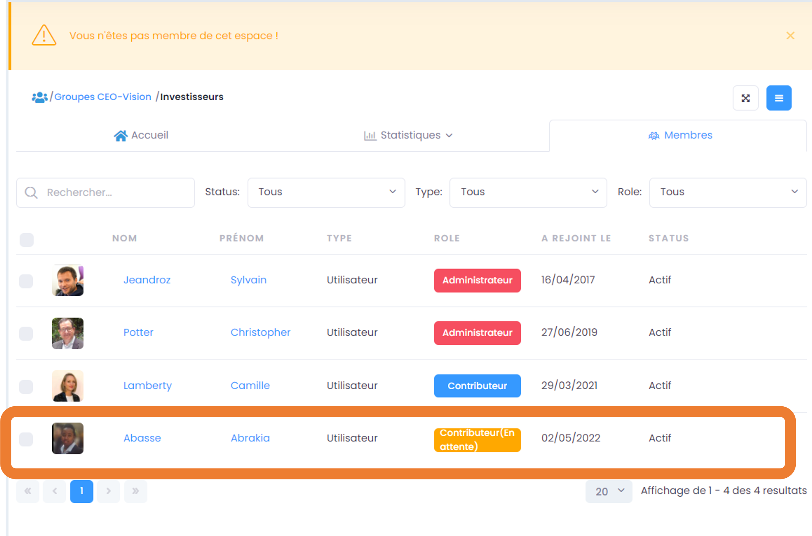

Vous retrouverez ensuite vos demandes dans votre profil.

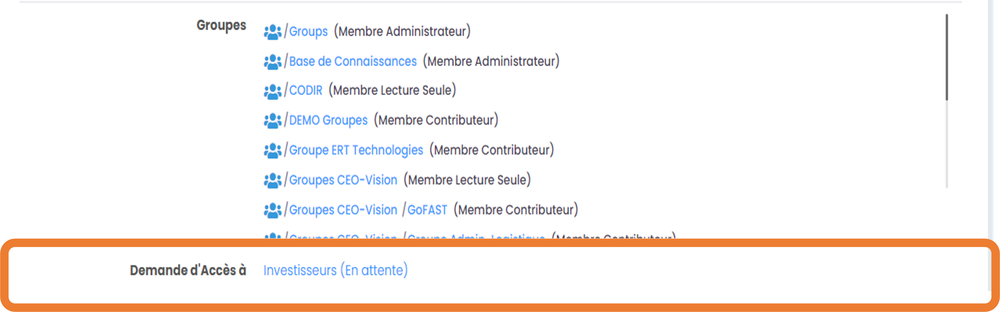

Ajouter des membres à un espace/groupe
--------------------------------------

Le **compte** de la personne doit déjà exister, si pas, il doit **être
créé** dans l'annuaire par quelqu'un d'habilité (l’administrateur
général/ICT ou un autre administrateur de l’espace en question) .

(voir « Création d’ un utilisateur » p.43 et « Créer un utilisateur dans
un espace » p.52)

Pour connaître les administrateurs d’un groupe, allez sur l’onglet
« Membres » de ce groupe, vous y verrez en 1ere ligne les
administrateurs de l’espace.

.. figure:: media-guide/image093.png
   :alt: 

**Si vous avez donc les droits d’administrateur de cet espace** ;
lorsque vous êtes dans l’espace collaboratif en question (groupe ou
organisation), allez dans les actions contextuelles (3 barres
horizontales) , cliquez sur « Ajouter membre»

.. figure:: media-guide/image094.png
   :alt: 

Remplissez cette fenêtre avec le nom du nouveau membre (inscrivez les 3
premières lettres pour avoir des propositions de noms), choisissez le
rôle que vous lui donnez (administrateur, contributeur standard ou
lecture seule). Vous pouvez également mettre un petit mot dans la zone
de texte « Request message » pour prévenir les autres administrateurs de
cet espace de cet ajout et la raison. Terminez en cliquant sur « Ajouter
le nouveau membre » en vert.

.. figure:: media-guide/image095.png
   :alt: 

.. figure:: media-guide/image096.png
   :alt: 

Lorsque vous revenez sur l’onglet « Membres » du groupe, vous voyez les
noms des membres (icône/photo) et dans quelle catégorie de rôle ils
sont.

**Rechercher/modifier/supprimer un membre dans un espace**

-  Vous pouvez **rechercher** un membre en tapant les 3 premières
   lettres de son nom/prénom.

-  Sous les noms des membres, vous pouvez **modifier** un par un leur
   rôle ; appuyez sur « Modifier rôle » ; la fenêtre pour changer les
   rôles s’ouvre. Mettez à jour.

-  Vous pouvez aussi **supprimer** un membre dans un groupe de cette
   façon. Appuyez sur « Retirer »

.. figure:: media-guide/image097.png
   :alt: 

Voir aussi"Gérer les membres d’un groupe" 

Créer un utilisateur dans un espace/groupe
------------------------------------------

Si vous voulez **ajouter un nouvel utilisateur** à la GoFAST, il faut
lui créer un compte.

Toujours dans les actions contextuelles d’un groupe, vous pouvez créer
un nouvel utilisateur dans ce groupe/espace, à condition d’en avoir les
droits d’administrateur d’espace.

.. figure:: media-guide/image098.png
   :alt: 

Ce formulaire s’ouvre, dans lequel vous pouvez soit aller chercher dans
le LDAP, l’annuaire (AD) de l'Organisation (si le couplage a été fait) , et certaines les données seront alors
préremplies ; soit remplir à la main avec les données du nouvel
utilisateur (externe) pour lequel vous créez ce compte.

Terminez par « Enregistrer »

.. figure:: media-guide/image099.png
   :alt: 

.. figure:: media-guide/image100.png
   :alt: 

.. figure:: media-guide/image101.png
   :alt: 

Gérer les membres d’un espace/groupe
------------------------------------

Gérer les membres d’un groupe signifie **ajouter/supprimer des membres,
leur donner un rôle spécifique** (voir : « Rôles/droits des membres d’un
espace/groupe » p.56).

C’est **l’administrateur du groupe** qui peut faire cela.
L’administrateur étant celui qui a créé le groupe ou celui à qui on a
confié ce rôle (assistant administratif, N+1, responsable du groupe, …)

Si vous avez donc les droits pour gérer les membres d’un groupe parce
que vous en êtes l’administrateur, il faut cliquer sur la flèche de
l’onglet « Espaces » puis sur « Gestion des membres » ; une
page s’ouvre avec 2 parties : « Ajouter un membre » et « Mettre à
jour ».

.. figure:: media-guide/image102.png
   :alt: 

La 1ere partie « \ **Ajouter un membre** » vous permet d’ajouter un ou
plusieurs membres en une fois dans un groupe. Sélectionnez les membres à
ajouter, en tapant les 1eres lettres de leur nom ou prénom, le système
vous proposera une liste à cocher ; choisissez ensuite le ou les
groupe(s) dans lesquels vous voulez les ajouter, ainsi que le rôle que
vous voulez leur donner (administrateur, contributeur ou en lecture
seule). Par défaut, ils seront abonnés à ce/ces groupes, donc n’oubliez
pas de choisir NON sous « subscription » si vous ne voulez pas qu’ils
reçoivent automatiquement les notifications liées à ce(s) groupe(s).

Terminez par « **Appliquer** »

.. figure:: media-guide/image103.png
   :alt: 

La 2eme partie «**Mettre à jour** » permet de gérer les utilisateurs
déjà membres de ce groupe et donc soit de les supprimer, soit de changer
leur rôle.

Cochez le groupe dont il est question, une liste apparaît, on y voit les
noms des membres et leur rôle actuel dans ce groupe. Cochez les membres
que vous voulez changer, choisissez leur nouveau rôle et « Appliquez » ;
ou supprimez les du groupe avec « Retirer les droits d’accès »

.. figure:: media-guide/image104.png
   :alt: 

Pour annuler l’action, cliquez sur le logo GoFAST, dans le coin gauche
supérieur de l’écran ; vous revenez ainsi à la page d’accueil.

.. figure:: media-guide/image105.png
   :alt: 

Rôles/droits des membres d’un groupe/espace
-------------------------------------------

Il y a **3 types d’utilisateurs** selon les droits qu’ils ont sur la
gestion des documents :

1) **L’administrateur/rice** d’un groupe : peut tout faire dans le
   groupe : ajouter/supprimer des membres, leur donner différents
   droits, supprimer/ajouter n’importe quel document, créer des
   sous-espaces dans ce groupe, et toutes les fonctionnalités de base :
   télécharger, éditer, déplacer un document, gérer la taxonomie (=
   métadonnées/infos liées au document), …

2) **L’utilisateur standard** : peut utiliser toutes les fonctionnalités
   de base : télécharger, éditer, ajouter/supprimer/déplacer un document
   *dont il est l’auteur,* gérer la taxonomie (= métadonnées/infos liées
   au document), …

3) **L’utilisateur « read only/lecture seule »** : peut juste
   télécharger le document ou le commenter. 

Gérer un espace collaboratif /groupe
------------------------------------

Lorsque vous êtes dans un **espace/groupe,** voici le genre de données
que vous pouvez voir :

a) Une page **d'Accueil** ;

.. figure:: media-guide/image106.png
   :alt: 

b) Un onglet « **Activité** », où vous avez une vue d’ensemble de ce
   qui se passe dans ce groupe ;

.. figure:: media-guide/image107.png
   :alt: 
   
c) Un onglet « **Statistiques** », où vous voyez les activités des membres actifs et inactifs, ainsi que les statistiques documentaires de l'espace ;

.. figure:: media-guide/Statistiques.png
   :alt: 

d) Un onglet « **Documents** », où vous voyez les documents et
   l’arborescence de ceux-ci ; 

.. figure:: media-guide/Image-Document-6.png
   :alt: 

e) Un onglet « **Calendrier** », où vous pouvez mettre des dates
   d’échéance, des rappels, … ;

.. figure:: media-guide/image109.png
   :alt: 

f) Un onglet « **Membres** », où vous voyez les membres du groupe et
   leur rôle respectif

.. figure:: media-guide/image110.png
   :alt: 

S’il y a des utilisateurs qui ont fait la demande de rejoindre ce
groupe, on peut le voir sous ce titre « Utilisateurs en attente »

.. figure:: media-guide/image111.png
   :alt: 

Vous pouvez gérer votre groupe grâce à l’icône avec les **3 barres
horizontales**, dans le coin droit supérieur de la page du groupe, qui
correspond aux fonctionnalités/actions contextuelles liées à un groupe,.
Par contre, si vous n’êtes pas administrateur de groupe, certaines de
ces options vous seront invisibles.

.. figure:: media-guide/image112.png
   :alt: 

Vous pouvez y ajouter un membre, créer un nouvel utilisateur pour cet
espace, créer un sous-espace, modifier les données du groupe, archiver
ce groupe, supprimer ce groupe, se désabonner ou s’abonner, rejoindre
une discussion,...

.. NOTE:: Les onglets "accueil", "activité", "statistiques", "membres" d'un espace affichent des éléments liés à l'espace sur lequel on se trouve et dont le titre est indiqué juste au-dessus des onglets. Toutefois, l'onglet "Document" ne cloisonne pas l'utilisateur à cet unique espace, mais lui permet de naviguer dans tous les emplacements où il a accès. Il peut donc arriver que le nom de l'espace indiqué au dessus des onglet ne soit pas celui de l'emplacement d'arborescence où on se trouve. 

Ajouter un sous-espace
----------------------

.. NOTE:: Merci de lire en introduction la différence entre les espaces de type Organisation, Groupes, Extranet, ... http://gofast-docs.readthedocs.io/fr/latest/docs-gofast-users/doc-gofast-guide-utilisateurs.html#les-espaces-collaboratifs

Il est possible de créer de **nouveaux espaces dans un espace**
déjà existant ou dans une organisation, que nous appellerons « sous-espaces »; 

.. IMPORTANT:: Pourquoi créer des sous-espaces au lieu de simples répertoires ? => Pour limiter l'accès de ce nouveau sous-espace à un nombre plus restreints de membres que l'espace "parent"

.. CAUTION:: Seul le super-administrateur ou Administrateur de plateforme peut créer des sous-espaces à la racine

Dans les actions contextuelles de l’espace (icône avec 3 barres
horizontales), choisissez « Ajouter sous-organisation ou sous-groupe »

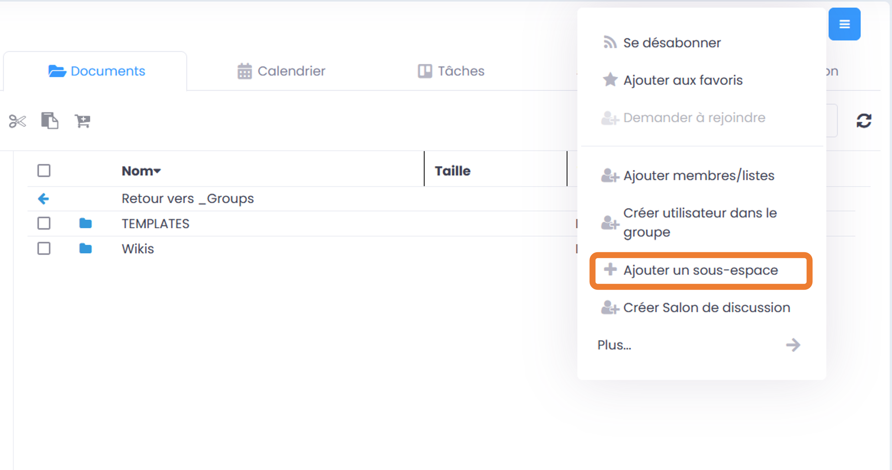

Il suffit alors de remplir cette page avec le nom du nouvel espace,
donner une brève description, créer éventuellement une page d’accueil,
choisir l’endroit où il se trouvera dans l’arborescence de la GoFAST et
terminer avec « Enregistrer ».

.. figure:: media-guide/image114.png
   :alt: 

Ce sera donc un nouveau groupe/espace qui se gère comme les autres, où
il faudra y ajouter des membres et des fichiers à partager.

Vous pouvez retrouver ce **sous-espaces dans vos espaces** ; par
exemple, ici comme c’est un sous-espace d’une organisation, allez sur
les petites flèches à côté des noms d’espaces/organisation jusqu’au
niveau de votre sous-espace.

.. figure:: media-guide/image115.png
   :alt: 

.. NOTE::
    Il est conseillé de ne pas créer trop de sous-groupes
    si il n’est pas nécessaire de gérer des droits particuliers quant au
    contenu de ce groupe ; créez plutôt des répertoires qui resteront
    visibles à tous les membres du groupe-parent.

Si les sous-espaces/groupes ne sont pas visibles directement via
l’onglet « Espaces », une autre manière d’explorer les sous-niveaux et
leur contenu, est d’appuyer sur le logo d’organigramme (« Parcourir à
partir d’ici » ) à droite du nom du groupe ; cela vous amènera à
l’arborescence plus détaillée de l’espace (avec ses sous-espaces) et son
contenu.

.. figure:: media-guide/image116.png
   :alt: 

.. figure:: media-guide/Image-Arborescence-7.png
   :alt: 

.. NOTE::
   Les membres d’un sous-groupe auront accès aux documents/répertoires qui se
   trouvent à un niveau supérieur (dans le groupe-parent) , par contre les
   membres du groupe-parent n’auront pas nécessairement accès aux documents
   de ce sous-groupes car la liste des membres du sous-groupe peut varier
   par rapport à celle des membres du groupe-parent.

**Exemple :**

-  Monsieur X est membre du *sous-groupe* « Support GoFAST », entouré
   en rouge ; 

-  Madame Y est membre du *sous-groupe* « test\_group », entouré en
   noir ; 

-  Junior fait partie du *groupe-parent* ou groupe-racine « Groupes »,
   entouré en jaune.

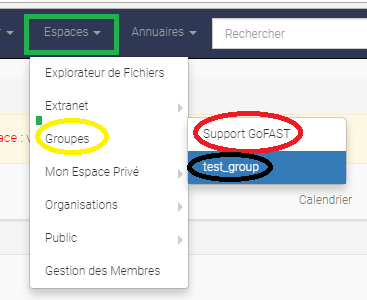

Ils voient tous les 3 ce qu’il se passe dans le groupe-racine
« Groupes » (entouré en jaune) , c’est-à-dire les répertoires et activités
propres à ce groupe-racine *MAIS* Monsieur X et Madame Y ne voient que
ce qu’il se passe dans leur propre sous-groupe respectif ( entouré en
rouge ou en noir) et donc l’un ne voit pas ce qu’il se passe dans le
groupe de l’autre. Madame Y (entouré en noir) ne voit pas ce qu’il se
passe chez Monsieur X (entouré en rouge) et vice -versa. Quant à Junior
(entouré en jaune), il ne voit pas ce qu’il se passe dans les
(sous-)groupes de Madame Y et Monsieur X, à moins qu’il ne devienne
membre de ce/ces sous-groupes aussi. => nouveaux groupes et sous-groupes
= plus de confidentialité et possibilité de membres différents d’un
groupe à l’autre.

**Autre manière d’expliquer, avec l’arborescence :**

Je suis membre du groupe « \_Support GoFAST » qui est un sous-groupe de
l’espace « Groupes ». J’ai donc accès à tous les répertoires qui se trouvent
dans « \_Groupes » et dans « \_Support GoFAST » (nom précédé d’un
underscore = espace/groupe).

.. figure:: media-guide/image371.png
   :alt: 

Par contre, je ne vois pas le sous-groupe « test\_group » dans
l’arborescence car je n’en suis pas membre.

Je sais juste qu’il existe parce qu’il est dans les espaces visibles à
partir du menu.

.. figure:: media-guide/image372.png
   :alt: 

Et si je clique dessus à partir du menu, j’arriverai sur la page du
groupe « Test\_group » mais l’accès à son contenu me sera refusé.

Je devrai demander d’en devenir membre si je veux voir le contenu et y
travailler.

.. figure:: media-guide/image373.png
   :alt: 

Modifier un espace collaboratif/groupe
---------------------------------------

Cette fonctionnalité permet de **modifier les informations concernant un
groupe** déjà existant : vous pouvez changer le nom, la description, la
page d’accueil et son emplacement dans l’arborescence (par exemple,
changer l’espace-parent).

Reprenez les actions contextuelles d’un groupe (les 3 barres
horizontales), choisissez « Modifier » et changer les données. Terminez
par « Enregistrer ».

.. figure:: media-guide/image118.png
   :alt: 

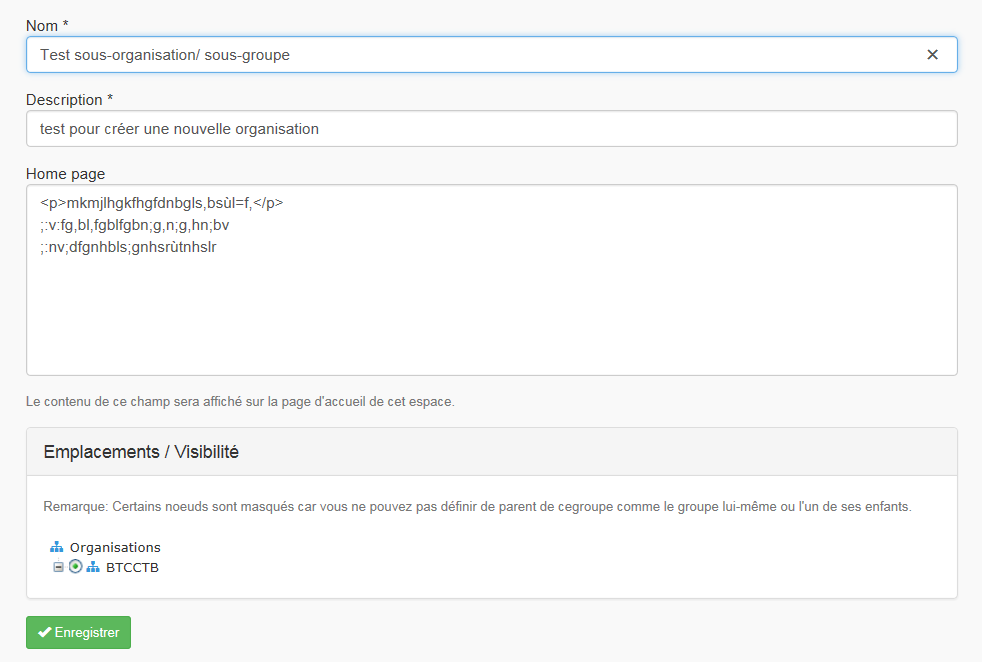

Archiver un espace collaboratif/groupe
-----------------------------------------

**Archiver un groupe** permet de garder une trace de son contenu et donc
de ne pas le supprimer totalement de la GoFAST. On peut archiver un
groupe de travail qui n’est plus actif par exemple.

Pour archiver un groupe : allez dans les actions contextuelles du groupe
(les 3 barres horizontales) et choisissez « Archivez cet espace ».

Une fenêtre s’ouvre vous demandant si vous êtes sûr de vouloir archiver
cet espace, confirmez en appuyant sur « Archive ».

.. figure:: media-guide/image120.png
   :alt: 

Le contenu de ce groupe apparaîtra comme archivé et ne sera plus visible
lors de la recherche, sauf si vous mettez l’option de recherche
« Inclure les contenus archivés ».

.. figure:: media-guide/image121.png
   :alt: 

.. NOTE:: 
   Seuls les espaces collaboratifs de type "Groupe" sont archivables.

Supprimer un groupe
-------------------

Supprimer un groupe consiste à **supprimer tout son contenu** de la
GoFAST définitivement ! Il ne sera donc plus visible nulle part.
Réfléchissez donc bien avant de vouloir supprimer un groupe,
assurez-vous qu’il soit bien vide par exemple.

Toujours dans les actions contextuelles, choisissez « Supprimer cet
espace »

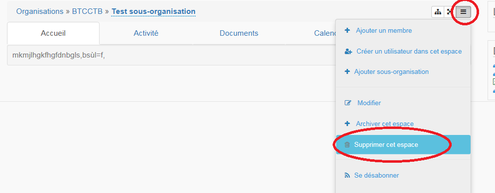

S’abonner ou se désabonner à un groupe (voir mes abonnements)
-------------------------------------------------------------

Vous pouvez vous **abonner à un groupe** pour rester au courant de tout
ce qu’il s’y passe, vous recevrez alors régulièrement une notification
vous informant de telle ou telle action sur les documents de ce groupe.

Dans les actions contextuelles du groupe (3 barres horizontales),
choisissez « S’abonner ».

.. figure:: media-guide/image123.png
   :alt: 

Un message en vert apparaîtra à droite de l’écran vous confirmant
l’abonnement à ce groupe.

.. figure:: media-guide/image124.png
   :alt: 

Vous pouvez par la même manœuvre vous désabonner à ce groupe. Ce qui
veut dire que vous ne recevrez plus aucune notification en rapport avec
ce groupe et son contenu.

.. figure:: media-guide/image125.png
   :alt: 

Le même message en vert vous confirme votre désabonnement

.. figure:: media-guide/image126.png
   :alt: 

Voir aussi  "Vos abonnements"

Créer un Salon de discussion
------------------------------------------------

Si vous êtes administrateur de l'espace, vous pouvez **Créer un salon de discussion** qui sera utilisable dans l'outil
de chat temps réel Element. Tous les membres de l'espace seront automatiquement ajoutés au nouveau salon.

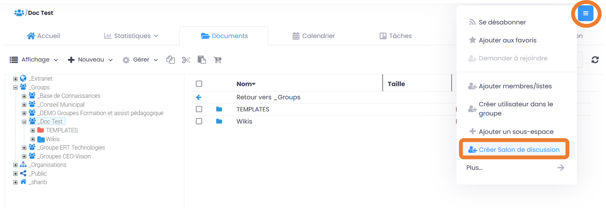

Gestion des Listes d'Utilisateurs (en v3.6)
===========================================
Les listes d'utilisateurs facilitent la gestion en masse et automatisée des membres des Espaces Collaboratifs et leurs rôles. Ainsi, lorsqu’un utilisateur GoFAST est ajouté à une liste, il devient automatiquement membre de tous les espaces associés à cette liste. 

Les listes peuvent aussi être sélectionnées lors d'un partage de documents par email (voir *Partager le document par mail* : https://gofast-docs.readthedocs.io/fr/latest/docs-gofast-users/doc-gofast-guide-utilisateurs.html?highlight=panier#partager-le-document-par-mail)

Créer/Modifier une liste d'utilisateurs
---------------------------------------

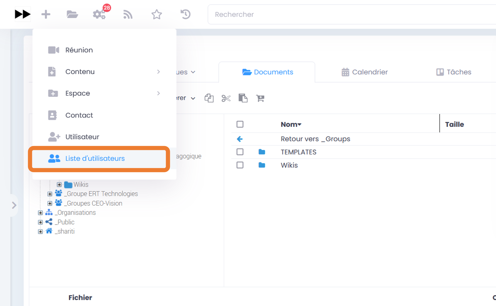

Pour créer une liste, cliquez sur "Créer", puis "Liste d’utilisateurs" dans le menu principale. Vous êtes redirigé vers le formulaire et il suffit de renseigner les 3 champs affichés :

   - Nom de la liste,
   - Desccription,
   - Membres de la liste (rentrez au moins 3 caractère du nom/prénom d'un utilisateur pour avoir des suggestions),

.. figure:: media-guide/Ecran-GoFAST_Liste-Utilisateurs_creer-liste-renseigner-formulaire.png	
   :alt: 

.. NOTE:: 
   Le créateur d’une liste d’utilisateur devient administrateur de celle-ci. 

Pour modifier les éléments de la liste (nom, description, membres), il suffit de cliquer sur le menu "Burger" (actions contextuelles) sur la page de la liste. 

.. figure:: media-guide/Ecran-GoFAST_Liste-Utilisateurs_modifier-les-membres-de-la-liste.png	
   :alt: 

Ajouter/enlever une liste d'utilisateurs comme membre d’un Espace Collaboratif
------------------------------------------------------------------------------
L'ajout d'une liste dans un espace collaboratif se fait comme pour un utilisateur unitaire :

   - Aller sur la page de l'espace
   - Ouvrir le menu "Burger" (actions contextuelles)
   - Cliquer sur "ajouter membre/liste"
   
.. figure:: media-guide/Ecran-GoFAST_Liste-Utilisateurs_ajouter-liste-dans-espace-collaboratif.png	
   :alt: 

Le formulaire d'ajout d'un membre s'ouvre et il faut commencer à rentrer le nom de la liste (au moins 3 caractères) pour avoir des suggestions. 

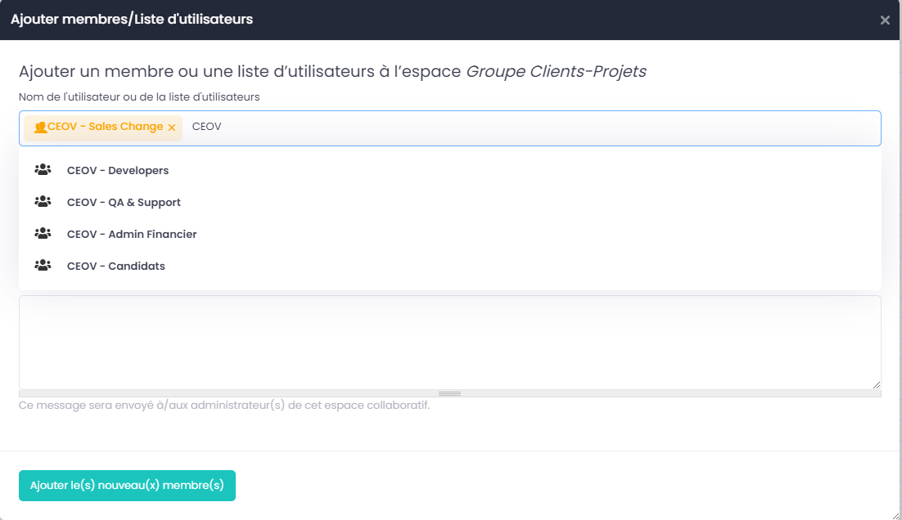

.. NOTE:: 
   Pour ajouter une liste d'utilisateurs comme membre d'un espace, il faut être administrateur de l'espace. 

.. NOTE:: 
   Le rôle attribué à chaque utilisateur dans l'Espace Collaboratif et celui coché lors de l'ajout de la liste. Si l'utilisateur est membre d'un espace de plusieurs façons (Listes + directement via son profile), c'est le rôle qui offre le plus de privilège qui s'appliquera. De cette façon, on évite de restreindre les droits d'un utilisateur qui serait déjà membre de l'Espace Collaboratif.
   
Une fois la liste ajoutée à l'Espace Collaboratif, celle-ci est affichée parmi les autres membres. 

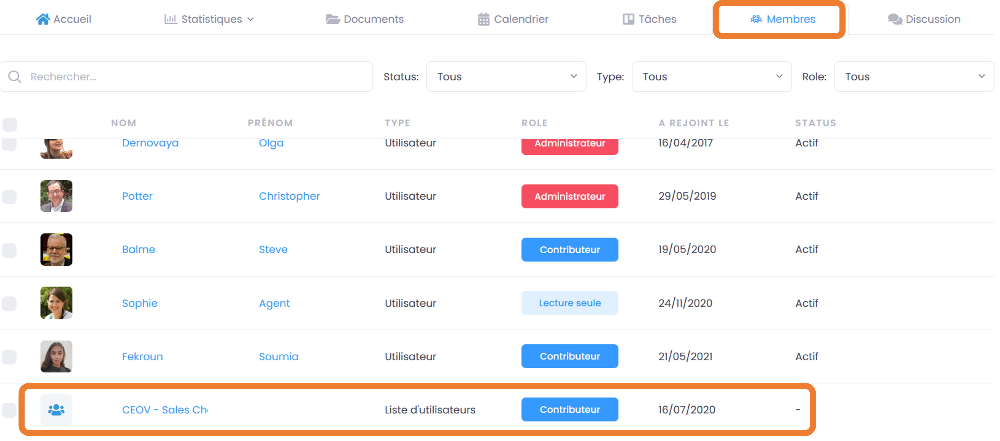

Les Espaces Collaboratifs dont est membre la liste sont affichés sur la page de la liste, onglet "Emplacements". 

.. figure:: media-guide/Ecran-GoFAST_Liste-Utilisateurs_emplacements-associes-a-la-liste.png	
   :alt: 

Afficher/Rechercher les listes d'utilisateurs
---------------------------------------------

Annuaire des Liste d'Utilisateurs
~~~~~~~~~~~~~~~~~~~~~~~~~~~~~~~~~
Pour consulter les listes existantes, il suffit de passer par les annuaires accessibles depuis le menu principal. 

.. figure:: media-guide/Ecran-GoFAST_Liste-Utilisateurs_annuaire-liste.png	
   :alt: 
   
Pour aller sur un liste depuis l'annuaire, vous pouvez cliquer sur le nom de la liste. Vous pourrez alors consulter les membres et les emplacements de celle-ci. 

Rechercher une Liste d'Utilisateurs
~~~~~~~~~~~~~~~~~~~~~~~~~~~~~~~~~~~~~

Les listes d'utilisateurs sont recherchables via la moteur de recherche et peuvent être utilisées comme "filtre de format".

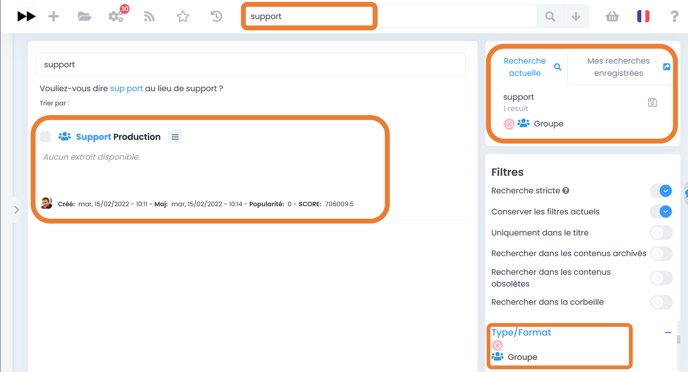
   
.. NOTE:: 
   Les listes dont fait partie un utilisateur sont affichées sur sa page de profile. 

   

Gestion des abonnements
=======================

Un abonnement permet de **rester au courant** de ce qu’il se passe dans
un groupe ou sur un document ; ce qui veut dire qu’ à chaque fois qu’il
y aura une activité dans ce groupe ou sur ce document, vous recevrez une
notification par mail, dont vous pouvez choisir l’intervalle (2x/jour,
1x/jour, 1x/semaine, …).

Vous pouvez accéder à vos abonnements à partir de votre nom et les gérer
comme vous le souhaitez

.. figure:: media-guide/image316.png
   :alt: 

.. figure:: media-guide/image317.png
   :alt: 

Si au contraire, vous voyez que vous recevez **trop de notifications**
par rapport à un groupe où vous n’êtes pas très actif et qui ne vous
intéresse pas davantage, vous pouvez vous désabonner ou choisir un
intervalle hebdomadaire par exemple. Vous ne recevrez alors qu’un mail
par semaine qui vous indiquera ce qu’il s’est passé sur ce document ou
dans ce groupe.

Pour vous **abonner à un document**, allez sur la prévisualisation du
document et cliquez sur le dernier icône avec les 3 barres horizontales,
à côté du titre. Une liste de fonctionnalités s’ouvre, choisissez
« s’abonner ».

.. figure:: media-guide/image318.png
   :alt: 

(cfr : Gestion de groupe/ « S’abonner à un groupe » p.66 et Gestion de
documents/« Actions contextuelles »/ « S’abonner au document » p.100 )

Workflows : Processus de Tâches (Enterprise only)
=================================================
   
Dans cette partie de la documentation vous trouverez comment consulter les processus en cours/archivés, les tâches à traiter, mais aussi comment démarrer un processus de tâches parmi la liste des processus disponibles, sur un ou plusieurs documents en les attribuant à des utilisateurs GoFAST (y compris vous-même).

.. NOTE::
    GoFAST propose dans tous les cas au moins un workflow de "Diffusion de Document(s)" qui permet d’assigner des tâches essentielles de manière très flexible, pour répondre à la majorité des besoins de vérification, correction, validation et signature des documents.
    
.. NOTE::
    Il est aussi possible de modéliser des processus spécifiques simples ou avancés et dans ce cas, leur fonctionnement et les formulaires associés peuvent ne pas correspondre à certaines parties de cette documentation. Pour savoir comment modéliser un workflow spécifique, merci de vous tourner vers les forums GoFAST (https://community.ceo-vision.com/). 
    

1. Démarrer un processus de tâches
----------------------------------

GoFAST propose deux façons de lancer un workflow : 

- Depuis le menu principale, via l’accès rapide aux "Processus et Tâches"
- Depuis la page d’un document, via le bouton "Processus et Tâches" 

Dans les deux cas, l'icône représentant les workflows est :

.. figure:: media-guide/Ecran-GoFAST_Workflows_icone-processus-et-taches.png
   :alt:

Demarrer un processus depuis le menu pricnipal
~~~~~~~~~~~~~~~~~~~~~~~~~~~~~~~~~~~~~~~~~~~~~~

Pour sélectionner un processus et le démarrer depuis le menu principal de GoFAST :

- Cliquez sur l’icône "Processus et Tâches" qui se trouve tout en haut de la page sur la gauche, 
- Dans la fenêtre qui s’affiche (la liste des tâches en cours), cliquez sur "Nouveau" pour avoir la possibilité de démarrer soit un "Nouveau processus", soit un "Nouveau processus depuis les documents du panier",

.. figure:: media-guide/Ecran-GoFAST_Workflows_lancer-processus-depuis-menu-principal-acces-rapide.png
   :alt:

- Une liste des processus disponibles vous sera proposée
- Cliquer sur le nom du processus souhaité ou sur l’icône ">" 

.. figure:: media-guide/Ecran-GoFAST_Workflows_choix-processus.png
   :alt:

.. NOTE::
    En lançant un processus depuis le menu principal, le formulaire du processus n'intégre pas de document et il faut donc le(s) ajouter directement depuis ce formulaire (hors dans le cas d'un éventuel processus spécifique ayant un autre fonctionnement). 
    
.. NOTE::
   En lançant un processus depuis le menu principal sur les documents du "panier documentaire", ces derniers sont automatiquement associés au processus. Vous avez ensuite la possibilité d'enlever/ajouter les documents dans le formulaire du workflow.

Démarrer un processus depuis la page d'un document
~~~~~~~~~~~~~~~~~~~~~~~~~~~~~~~~~~~~~~~~~~~~~~~~~~~~~

Pour sélectionner un processus et le démarrer depuis la page d’un document :

- Cliquez sur l’icône "Processus et Tâches" qui se trouve en haut à droite de l’aperçu du document, 

.. figure:: media-guide/Ecran-GoFAST_Workflows_lancer-processus-depuis-page-document.png
   :alt:

- Une liste des processus disponibles vous sera proposée
- Cliquer sur le nom du processus souhaité ou sur l’icône ">"
   
.. figure:: media-guide/Ecran-GoFAST_Workflows_choix-processus.png
   :alt:

.. NOTE::
    En lançant un processus directement depuis la page du document, ce dernier est automatiquement associé au workflow dans le formulaire. 

Renseigner le formulaire du processus de tâches pour le démarrer  
~~~~~~~~~~~~~~~~~~~~~~~~~~~~~~~~~~~~~~~~~~~~~~~~~~~~~~~~~~~~~~~~
Une fois que le processus souhaité est sélectionné, le formulaire associé s’ouvre et vous permet de renseigner les diverses informations nécessaires. 

Le formulaire proposé et donc les champs à renseigner, sont totalement dépendants du processus choisi. 

.. figure:: media-guide/Ecran-GoFAST_Workflows_formulaire-processus-standard.png
   :alt:

**Focus sur les champs "Document(s)" et "Assignation(s)" du formulaire :** 
  Dans le cas du processus standard GoFAST, parmi les champs proposés il y a les documents associés et les personnes à assigner. 
  
  Pour correctement renseigner ces champs, il est nécessaire de commencer à rentrer le nom du document ou d’un utilisateur (minimum 3 caractères), puis cliquer sur la suggestion pour valider son choix. 
  
  Que ce soit pour les documents ou les assignations, vous avez la possibilité de cliquer sur "+" pour ajouter des champs supplémentaires, ou sur la corbeille pour en enlever. 

Enfin, pour lancer le processus et les notifications associées, il suffit de cliquer sur "Envoyer" (en bas du formulaire).

2. Etre notifié et consulter ses tâches à traiter et/ou assignées aux autres
----------------------------------------------------------------------------

Notifications des workflows envoyées par e-mail 
~~~~~~~~~~~~~~~~~~~~~~~~~~~~~~~~~~~~~~~~~~~~~~~

.. NOTE::
   Les notifications sont dépendantes du processus lancé. Par exemple, dans le cas d’un processus spécifique il est possible que le contenu des notifications et leur fréquence soient fortement adaptées aux équipes métier concernés. 
   Le descriptif ci-après est donc basé sur le fonctionnement du processus standard disponible dans GoFAST. 

A chaque démarrage du processus, les personnes assignées sont notifiées et c’est aussi le cas à chaque fois qu’une étape est traitée. 

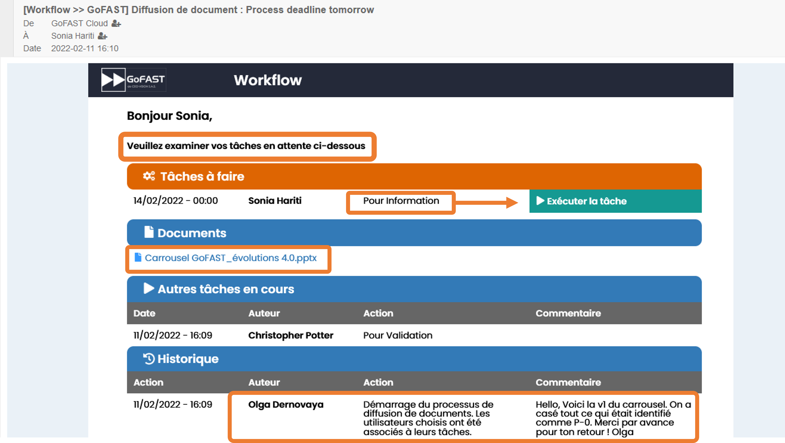

**Les notifications indiquent donc :** 
   - le type de processus lancé et le nom spécifique renseigné par l’initiateur,
   - l’initiateur du processus, 
   - la tâche qu’on a à traiter et les autres tâches du processus (avec état de la tâche),
   - l’étape du processus (ex : initiation ou fin d’une tâche ou fin du processus),
   - la date de démarrage, de traitement des tâches et l’échéance,
   - titre(s) et lien(s) vers le(s) document(s) concerné(s),
   - le commentaire fait au moment du démarrage, puis ceux ajoutés lors du traitement des tâches,

.. NOTE::
   Les notifications liées aux workflows et envoyées par email ne sont pas configurables par les utilisateurs car elles sont directement dépendantes du processus lancé. Il n’est donc pas possible de se désabonner de ces notifications ou de changer leur fréquence. 

Liste des tâches à traiter et tâches assignées aux autres
~~~~~~~~~~~~~~~~~~~~~~~~~~~~~~~~~~~~~~~~~~~~~~~~~~~~~~~~~

En complément des notifications envoyées par e-mail, chaque utilisateur a la possibilité de consulter la liste des tâches qu’il a à traiter, ainsi que les tâches qu’il a assignées à d’autres. Les utilisateurs sont également informés lorsqu'un document qu'ils consultent est associé à un processus. 

**Dans le menu principal :** un numéro apparait sur l'icône "Processus et Taches" indiquant le nombre de tâche qu'on a à traiter.

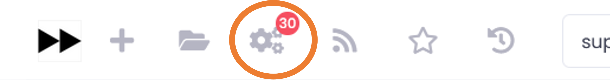

**Sur la page d'un document :** l'icône "Processus et Tâches" est rouge dès lors qu'un processus en cours y est associé, précisant le nombre de tâche. Si aucun processus n'est en cours, l'icône reste grise.

.. figure:: media-guide/Ecran-GoFAST_Workflows_consulter-processus-depuis-page-document.png	
   :alt:

**Pour afficher la liste de tâches :** il suffit de cliquer sur l’icône "Processus et Tâches" (que ce soit depuis le menu ou la page d'un document).

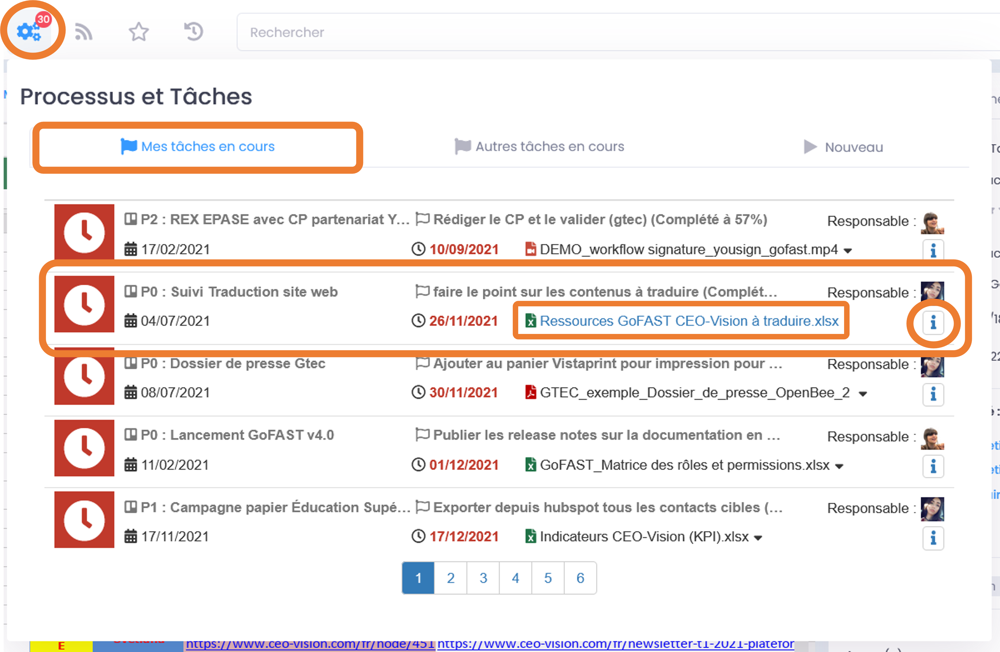

Vous avez alors un onglet distinct pour les tâches à traiter et un autre pour les tâches assignées à d'autres utilisateurs. Dans le cas où il y a beaucoup de tâches, vous disposez d’une pagination. 

**Cette vue permet de consulter en un clin d’œil les informations clefs :** 
   - type et nom du processus
   - le(s) document(s) concerné(s)
   - date de démarrage et échéance 
   - l’initiateur du processus 

**Les actions possibles depuis cette liste des tâches :** 
   - Aller sur la page de(s) document(s) du processus en cliquant sur le titre du document,
   - Consulter l’historique du processus du processus en cours en cliquant sur l’icône "i",
   - Effectuer sa tâche et consulter l’historique du processus en cours en cliquant sur l’icône ">"

.. figure:: media-guide/Ecran-GoFAST_Workflows_details-tache-dans-menu-principal-acces-rapide.png
   :alt:

Traiter ses tâches
~~~~~~~~~~~~~~~~~~
Depuis la liste des tâches à traiter, il suffit de cliquer sur l'icône ">" pour ouvrir le formulaire et indiquer qu'on a effectué sa tâche. 

.. figure:: media-guide/Ecran-GoFAST_Workflows_formulaire-traiter-sa-tache.png	
   :alt:

Cliquez sur "Envoyer" (ou autre selon la tâche qui nous a été assignée) pour enregistrer le traitement de la tâche. 

.. NOTE:: 
   Selon le processus, il est possible de laisser un commentaire (ex : processus standard GoFAST). Celui-ci est vivement conseillé pour favoriser le travail collaboratif.

3. Historique des tâches et processus en cours et archivés
----------------------------------------------------------

Que ce soit pour les processus en cours ou archivés, vous avez la possibilité de consulter les détails des étapes et commentaires faits. 

**Cet historique est accessible :**
   - via le menu principal
   - depuis la page d’un document

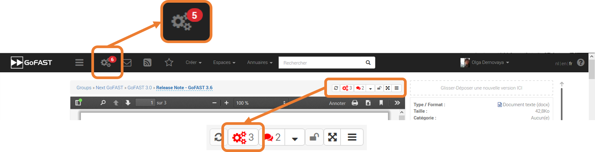

Historique des processus en cours 
~~~~~~~~~~~~~~~~~~~~~~~~~~~~~~~~~~
  
Pour consulter l'historique des actions dans un processus en cours, il suffit de cliquer sur l’icône "i" ou ">" au niveau d'une tâche : 
   
.. figure:: media-guide/Ecran-GoFAST_Workflows_details-tache-ouvrir-formulaire-historique.png

.

   - le ">" s'affiche uniquement s'il s'agit d'une tâche qui nous a été assignée (permet d'ouvrir le formulaire pour effectuer sa tâche et de voir l'historique des tâches précédentes),
   - le "i" permet de consulter l'historique depuis une tâche assignée à quelqu'un d'autre (ou bien à soi-même, si on ne souhaite pas ouvrir le formulaire).

.. figure:: media-guide/Ecran-GoFAST_Workflows_processus-en-cours-historique.png	
   :alt:

Historique des processus archivés 
~~~~~~~~~~~~~~~~~~~~~~~~~~~~~~~~~

Pour consulter la liste des processus archivés associés à un document, rendez-vous sur la page du dit document et cliquez sur l’icône "Processus et Tâches". 

.. figure:: media-guide/Ecran-GoFAST_Workflows_consulter-processus-depuis-page-document.png
   :alt:
   
Une fois la fenêtre des Processus et Tâches ouverte, il faut aller dans l’onglet "Historique". Cette onglet affiche la liste de tous les processus archivés associés au document. 

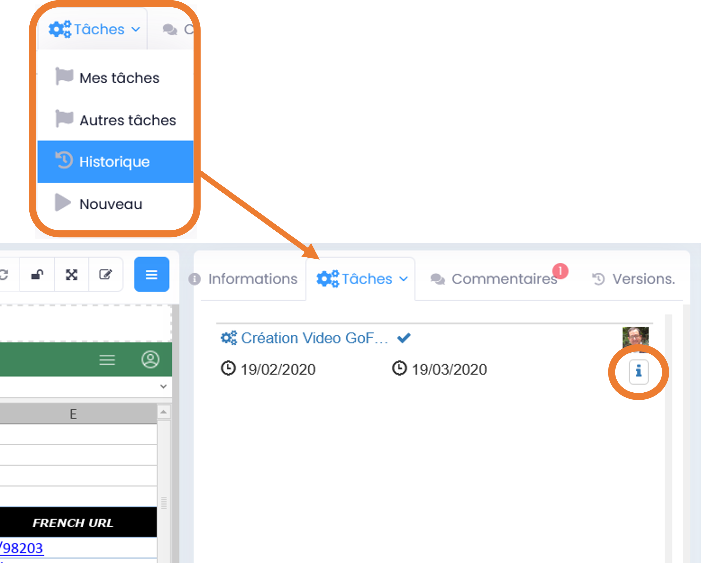
  
Pour consulter les détails d'un processus archivé, il suffit de cliquer sur l’icône "i" au niveau du processus. 

.. figure:: media-guide/Ecran-GoFAST_Workflows_processus-archive-historique.png	
   :alt:

4. Tableau de bord
-------------------

GoFAST intègre un tableau de bord pour afficher tous les workflows créés par l’utilisateur ainsi que ceux qui  lui ont été assignés. Pour y accéder, cliquer sur l’icône Burger du menu principal, dans le menu déroulant appuyer sur « Tableau de bord des processus ».

Par défaut, dans la section « Resultats de recherche » tous les processus en cours sont listées. 

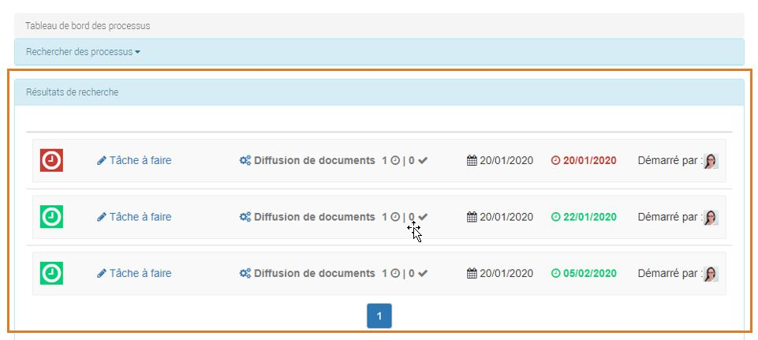

Filtrer les résultats de recherche
~~~~~~~~~~~~~~~~~~~~~~~~~~~~~~~~~~

Le tableau de bord offre un filtre avec plusieurs options afin de rechercher un processus particulier. Pour y accéder, appuyer sur la barre bleue « Rechercher des processus ».

La recherche se fait avec un ou plusieurs critère(s) :

- Titre du processus : Nom complet du processus.

- Démarré après le :  Date après le démarrage du processus.

- Échéance avant le :  Date d‘échéance avant la fin du processus.

- Type de processus : Il est possible de faire le tri avec deux types de processus « Diffusion de document » et « Sous processus de diffusion de document ».

- État du processus : Deux états sont disponibles « En cours » et « Terminé ».

- Démarré par : Ce champs vous permet de renseigner le nom de l’utilisateur qui a démarré le processus ( Liste de propositions disponible ). 

- Documents associés : Document(s) lié(s) au processus recherché ( Liste de propositions disponible).
 
- Utilisateurs associés :  Dans ce champs, vous pouvez renseigner les utilisateurs assignés aux différents actions du processus recherché(Liste de propositions disponible).

Pour lancer la requête de tri, ne pas oublier d’appuyer sur le bouton « Rechercher ».

Afficher les détails d'un processus
~~~~~~~~~~~~~~~~~~~~~~~~~~~~~~~~~~~
Pour consulter les détails d'un processus, il suffit de cliquer sur le nom de ce dernier dans les Résultats de recherche.
Trois sections sont disponibles :

1- Tâches du processus 

2- Documents dans ce processus

3- Historique du processus

.. figure:: media-guide/Dashboard-workflows-history.jpg
   :alt:

Gestion des tâches collaboratives (Kanban)
==========================================

Pour une meilleure gestion de tâches, GoFast propose une interface sous forme de kanban avec un système de colonnes et de cartes pour organiser les différentes actions à mener lors d’un projet.

.. NOTE::
   Un seul Kanban est disponible par espace. Les espaces publiques ne disposent pas de ce gestionnaire de tâches.

Gestion du Kanban
-----------------
Pour accéder à cette fonctionnalité, aller dans la page d’un espace puis cliquer sur l’onglet « Tâches ». La configuration la plus classique consiste à créer 4 colonnes : Démarrage, En cours, Finalisation, Terminé ou Annulé.
Pour créer une carte cliquer sur le bouton « Ajouter une nouvelle Carte ». 

Renseigner le titre, la description, les documents liés, la date d’échéance, le responsable puis les participants et enfin appuyer sur « Enregistrer ».

Une fois la carte créée, vous pouvez modifier les informations précédemment entrées ou ajouter plus d’éléments en cliquant sur le champ concerné. 

1. Statut :  La carte peut avoir trois états possibles (A traiter en priorité, En cours, Terminé).
2. Todolist :  Dans cette section vous pouvez ajouter plusieurs actions à effectuer avec échéance. Chaque action pourra être affectée à un membre de l’équipe.
3. Commentaire (s) : Ici vous pouvez partager des remarques et des suggestions avec les participants.
4. Afficher le détail : Afficher l’audit des actions d’une carte.
5. Fermer ou supprimer : la suppression est activée uniquement pour les administrateurs de l’espace ou le créateur de la carte.

.. NOTE::
   Dans la section Todolist, les membres de l’équipe peuvent indiquer la fin de la réalisation des actions en cochant les cases adjacentes aux titres. 
   Ils peuvent également modifier les informations d’une action (Titre, affectation, échéance) ou la supprimer.

Les cartes peuvent être déplacées en glisser/déposer d’une colonne à une autre suivant la progression des actions menées.

Il est possible également de personnaliser les colonnes, en ajoutant de nouvelles, renommant ou supprimant des existantes.
Pour ajouter une nouvelle colonne, placez-vous à droite du tableau puis cliquer dans le champs « Saisir le titre de la colonne », renseigner le nom puis appuyer sur « Ajouter colonne ».

Pour supprimer ou renommer une colonne, il suffit de cliquer sur l’icône qui se trouve au coin en haut à droite de la colonne, puis choisir l’action souhaitée.

.. NOTE::
   - La suppression de la colonne effacera toutes les cartes qu’elle contient. 
   - Cette action est irréversible. 

Enfin, pour déplacer une colonne, il faudra la faire glisser vers l’emplacement souhaité puis la déposer.

  
Permissions 
-----------
- Qui peut ajouter/renommer/supprimer/déplacer les colonnes ?  Les administrateurs de l’espace. 
- Qui peut créer/modifier/déplacer les cartes ? Les administrateurs de l’espace et les contributeurs.
- Qui peut supprimer une carte ? Les administrateurs de l’espace et les créateurs des tâches. 
- Qui peut commenter les cartes/valider les checklist (Todolist) ? Les administrateurs de l’espace, contributeurs et les membres en lecture seul si assignés à la tâche/Checklist.

Notifications 
---------------------- 
+---------------------------------------+-------------+--------------+----------------------+
| Notifications	                        | Responsable | Participants | Assignés aux actions |
+=======================================+=============+==============+======================+
| Création de carte 	                |      X      |      X	     |                      |
+---------------------------------------+-------------+--------------+----------------------+
| Création d’action (Checklist)	        |      X      |      X	     |          X           |
+---------------------------------------+-------------+--------------+----------------------+
| Date d’échéance de la carte   	|      X      |      X       |  	X           |
+---------------------------------------+-------------+--------------+----------------------+
| Date d’échéance de l’action Checklist	|             |       	     |          X           |
+---------------------------------------+-------------+--------------+----------------------+
| Soumission Commentaire	        |      X      |      X	     |          X           |
+---------------------------------------+-------------+--------------+----------------------+

Visualisation des cartes (Agenda & Menu Tâches)
-----------------------------------------------

Les cartes sont présentes dans les calendriers des espaces ou leurs sous-espaces. Elles sont également visibles dans le calendrier de l’espace personnel sur lequel le membre de l’équipe est assigné en tant que :

- Membre de la carte.
- Affecté à un élément de Checklist.

Il suffit de cliquer sur l’événement dans le calendrier pour se rediriger sur le tableau (kanban) contenant la carte en question.

.. figure:: media-guide/kanban-card-display-calendar.jpg	
   :alt:

.. NOTE::
   Dans le cas où on est assigné sur un élément de Checklist, la carte apparaîtra dans le calendrier à la date d'échéance de la carte et non à la date d'échéance de la checklist.

À partir du menu principal, vous pouvez visualiser les cartes ouvertes dans la rubrique Mes tâches (Roues crantées).
L’icône en petite fenêtre disposée à côté du titre de la carte permet de faire la différence entre les tâches workflow et les tâches créées à partir du Kanban.
Pour se rediriger vers le Kanban concerné, il faudra appuyer sur l’icône information en bas à droite.

Filtrer les cartes
------------------
GoFast met à disposition une barre de recherche pour filtrer les cartes, elle est placée au dessus des colonnes dans le Kanban. 
La recherche se fait uniquement sur le titre de la carte. Il suffit de taper son nom, la carte concernée s’affichera dans le tableau et toutes les autres deviendront invisibles. 

Forums de discussion
=====================

Le forum général pour tous les utilisateurs de la GoFAST permet
d’échanger des informations et questions sur l’outil et sur son
utilisation.

C’est à ce niveau notamment que vous allez retrouver la vidéo
d’introduction de la GoFAST (version 2.0), les tutoriels, les guides
d’utilisation, les guides de gestion documentaire, …

Vous pourrez y posez des questions générales et chacun pourra y
répondre. De même, l’administrateur général peut vous donner des trucs
et astuces via ce canal également.

Vous pouvez d’ailleurs vous abonner à ce forum si vous voulez rester au
courant de tout ce qu’il s’y passe.

   
