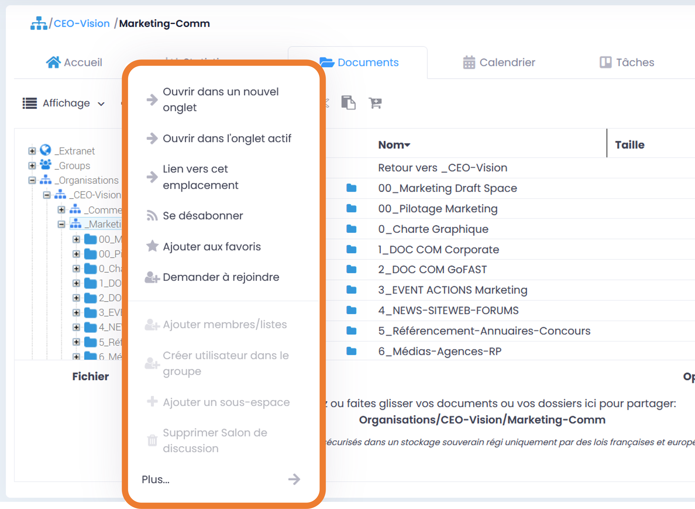
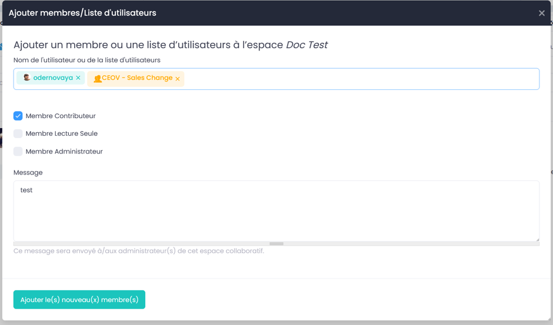
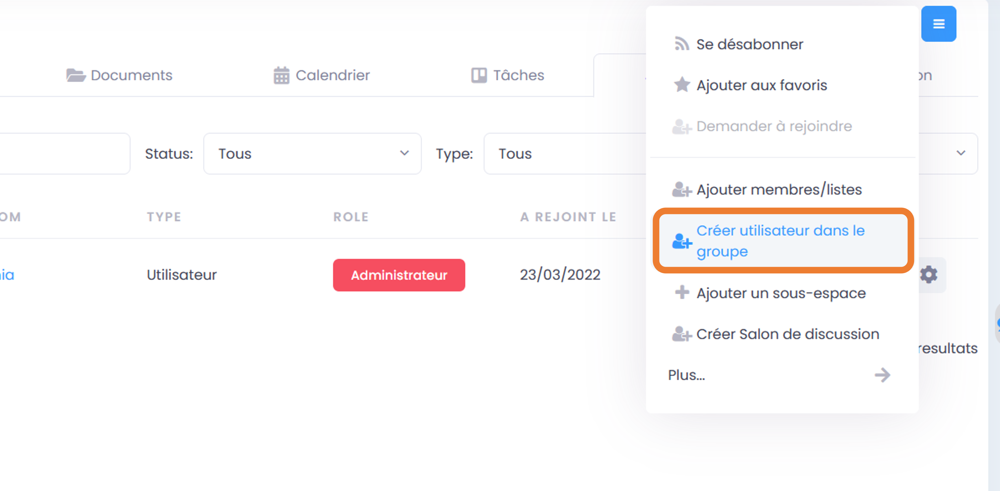
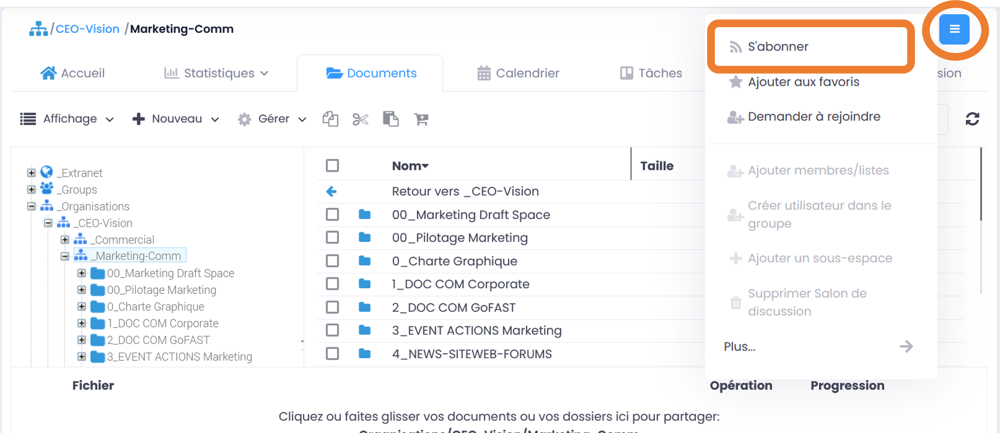
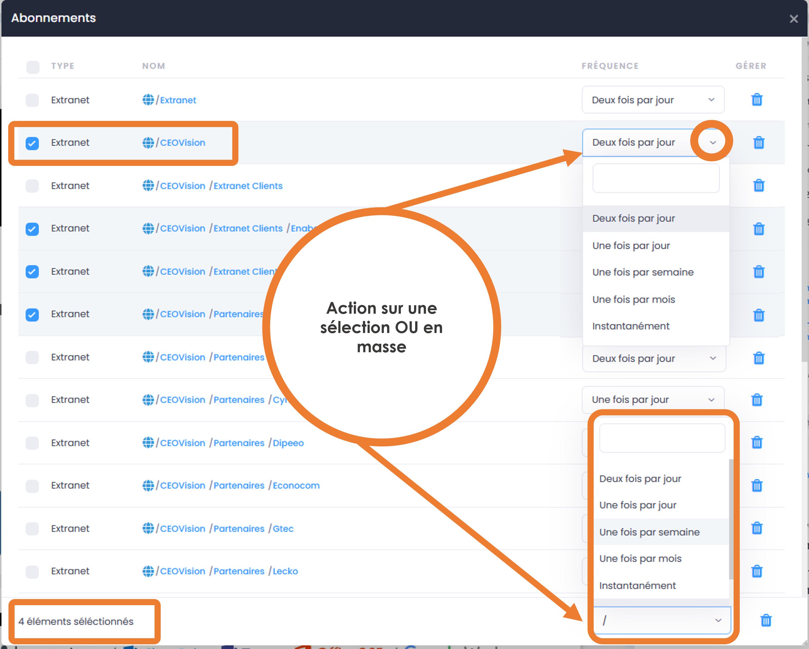
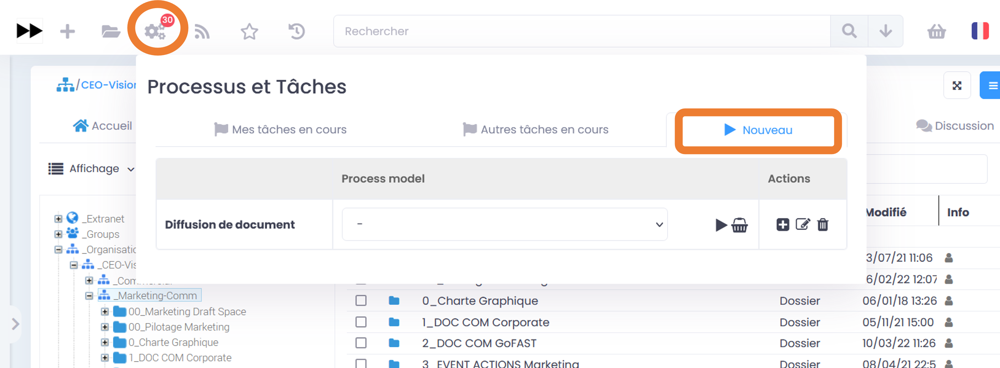
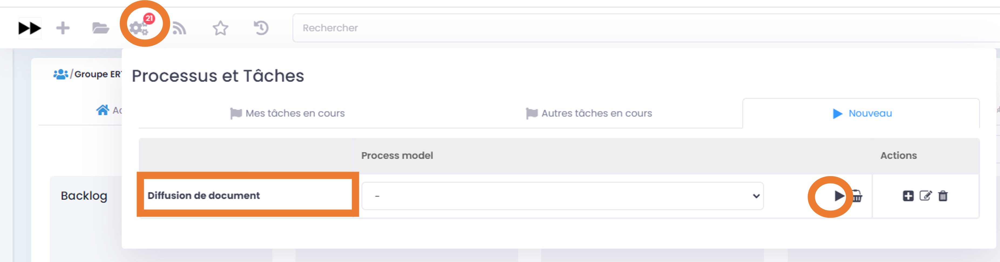
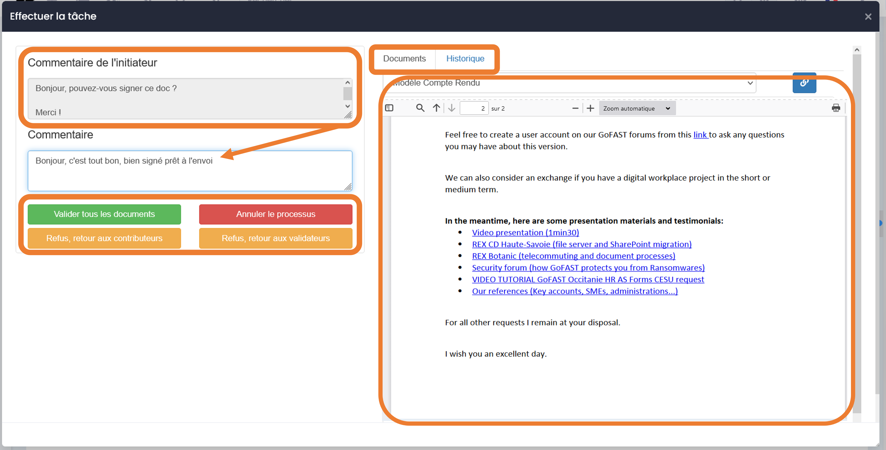
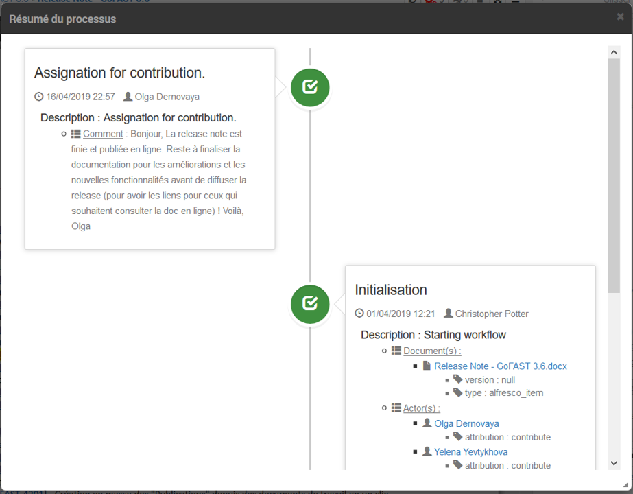

Gérer les Espaces Collaboratifs
=================================

Les Espaces Collaboratifs structure toute la gestion collaborative et le partage de contenus entre les diverses Directions, Services, groupes de travail, partenaires externes, etc. 

C’est un élément capital sur la plateforme GoFAST Digital Workplace et il est fortement recommandé de consulter la rubrique : « Les Espaces collaboratifs » dans « Les Bases ». 

Se repérer sur la page d’un Espace Collaboratif
-------------------------------------------------------------
Généralités 
~~~~~~~~~~~~~~~~~~~~~~~~~~~~~~~~~~~~~~~~~~~~~~~
Un Espace est un ensemble de : 
 - Membres ayant accès à cet Espace
 - Documents/Contenus/Taches/Discussions/Statistiques partagés dans cet Espace. 
Le nom de l’Espace où vous trouvez, est indiqué à gauche en haut sur la page de l’Espace.
Merci de consulter la rubrique : « Les bases » pour en savoir plus sur les types d’Espaces Collaboratifs. 

Onglets disponibles sur la page d’un Espace Collaboratif 
~~~~~~~~~~~~~~~~~~~~~~~~~~~~~~~~~~~~~~~~~~~~~~~
- **Accueil :** page personnalisable par les Administrateurs de l’Espace.

.. figure:: media-guide/accueil.png
   :alt: 

- **Statistiques :** avec les statistiques de l’activité des membres de l’espace, ainsi que les statistiques documentaires.

Merci de consulter également la rubrique : « Onglet Statistiques dans un Espace » (dans « Statistiques ») 

Mais en cliquant sur l'onglet statistique, il est aussi possible de d'accéder à **l'audit** de l'espace. 

.. NOTE:: L'audit de l'espace est uniquement disponible pour les administrateurs d'espace. 

**Documents :** explorateur de fichiers positionné au niveau de l’arborescence de l’Espace. 

.. figure:: media-guide/Image-Document-6.png
   :alt: 

**Calendrier :** avec les dates d’échéance, les réunions et les tâches de cet espace.

.. figure:: media-guide/image109.png
   :alt: 

**Tâches :** donne accès au tableau de tâches collaboratives de l’Espace (tâche de type « Kanban » : post-it partagés avec des « todolists ») 

**Membres :** avec la liste des membres de l’Espace et leur rôle (pour les utilisateurs unitaire et pour les listes d’utilisateurs. 

.. figure:: media-guide/image110.png
   :alt: 

S’il y a des utilisateurs qui ont fait la demande de rejoindre cet espace, le rôle indiqué sera « en attente » et seuls les Administrateurs de l’Espace peuvent valider la demande d’accès et attribuer un rôle. 

**Discussions :** salon de Tchat / messagerie instantanée dédié à l’Espace. 

.. NOTE:: 
   Les onglets d'un espace affichent des éléments liés à l'espace sur lequel on se trouve et dont le titre est indiqué juste au-dessus des onglets. Toutefois, l'onglet "Document" ne cloisonne pas l'utilisateur à cet unique espace, mais lui permet de naviguer dans tous les emplacements où il a accès. Il peut donc arriver que le nom de l'espace indiqué au-dessus des onglets ne soit pas celui de l'emplacement dans l'arborescence où on se trouve. 

Actions sur un Espace
---------------------------------

Plusieurs actions sont disponibles sur un Espace, selon le rôle du membre de cet Espace (Administrateur, Contributeur, Lecture Seule) : 

Selon votre rôle dans un Espace, vous pouvez y ajouter des membres ou modifier leur rôle, créer un nouvel utilisateur dans cet espace, créer un sous-espace, archiver l’espace ou le supprimer, se désabonner ou s’abonner, créer un document/contenus, etc.
Pour accéder aux diverses actions possibles dans l’Espace, allez dans le menu « Burger » (Actions contextuelles) via l’icône avec les **3 barres horizontales** dans le coin droit supérieur de la page de l’espace.
Les actions réservées aux administrateurs d’espaces sont précisées avec une *. Elles seront grisées et non cliquables pour les membres contributeurs ou lecture seule :
 - S’abonner / Se désabonner  
 - Ajouter aux / Supprimer des favoris 
 - Demander à rejoindre 
 - Ajouter membres / listes * 
 - Créer utilisateur dans le groupe* 
 - Ajouter un sous-espace * 
 - Créer / Supprimer Salon de discussion* 
 - Plus …
    - Renommer cet espace *
    - Déplacer cet espace *
    - Archiver cet espace *
    - Supprimer*
    - Pré-ajouter membres*
    - Contacter les administrateurs de l’espace * 

.. NOTE:: 
   Les onglets d’un espace affichent des éléments liés à l’espace sur lequel on se trouve. Le titre de l’espace et le chemin d’accès s’actualisent juste au-dessus des onglets.

Merci de consulter aussi la rubrique : « Créer un Espace Collaboratif »

Être membre d’un Espace (dont rôles possibles)
------------------------------------------------------------

Il faut bien sûr d’abord avoir un compte GoFAST. Si ce n’est pas encore le cas, il faut **le demander** à votre service IT interne.

**Les diverses façons de devenir membre d’un espace :**
 - soit l’administrateur de l’Espace qui a créé votre compte, vous ajoute directement comme membre,
 - soit en faisant la demande via l’annuaire des Espaces : vous avez la liste des espaces collaboratifs (sélectionnez ceux que vous souhaitez), puis via le menu « Burger » cliquer sur « Rejoindre ».
 
.. figure:: media-guide/image090.png

Un message s’afficher confirmant votre demande de rejoindre cet espace :

.. figure:: media-guide/image091.png

Vous retrouverez ensuite vos demandes sur votre page de profil utilisateur.

.. figure:: media-guide/image092.png

- Être membre d’une liste d’utilisateurs qui elle-même devient membre de l’Espace (vous aurez donc le même rôle que celui attribué à la liste). 

Créer un Espace / Sous-Espace Collaboratif
------------------------------------------------------------

Créer un Espace à la racine (1er niveau)
~~~~~~~~~~~~~~~~~~~~~~~~~~~~~~~~
Dans le cas où vous avez besoin de créer un nouvel Espace à la racine, c’est-à-dire au premier niveau dans Organisations, Groupes, Extranet ou Public, merci de vous référer à la rubrique : « Créer des Espaces Collaboratifs ». Cette action nécessite d’avoir le profil "support-utilisateur" alors que la création d’un sous-espace (les autres niveaux dans l’arborescence des Espaces) nécessite d’être membre administrateur de l’espace parent. 

Créer un Sous-Espace (dans un Espace)
~~~~~~~~~~~~~~~~~~~~~~~~~~~~~~~~
Pour savoir comment créer de nouveaux Espaces/Sous-Espaces Collaboratifs, merci de vous référer à la rubrique : « Créer des Espaces Collaboratifs ».  

.. NOTE:: Merci de lire en introduction la différence entre les espaces de type Organisation, Groupes, Extranet, Public.

Rôles/droits des membres d’un Espace
------------------------------------------------------------
Au sein d’un espace, un utilisateur « Membre » peut avoir l’un des 3 « Rôles » disponibles (Administrateur, Contributeur, Lecture Seule), impactant les droits qu’ils ont sur la gestion des documents et de l’Espace lui-même.

.. NOTE:: 
   Voir le « Tableau des permissions par Rôle » à la fin de cette rubrique en plus du descriptif de chaque rôle). 

Membre Administrateur d’un Espace
~~~~~~~~~~~~~~~~~~~~~~~~~~~

Ce rôle est réservé aux responsables métiers (ex. responsables d’un Service, Projet, etc.) qui sont donc en charge de la gestion de l’Espace, avec les documents et autres contenus partagés dans l’Espace. 

.. NOTE:: 
   Il s’agit d’un rôle important qui doit absolument être partagé entre plusieurs membres, pour éviter tout blocage dans la gestion de l’Espace dans le cas où un des Administrateurs n’est pas disponible (ex. en congés, a quitté l’entreprise, n’a pas le temps de gérer l’espace, etc.) 

Permissions principales liées au rôle Administrateur : ajouter/supprimer des membres et déterminer leur rôle, créer des sous-espaces, créer/modifier/supprimer des dossiers (pour classer les documents), réaliser toutes les actions disponibles sur les documents/contenus (dont les modèles dans dossier « TEMPLATES » : ajouter, renommer, éditer, partager/déplacer, télécharger, gérer les métadonnées, commentaire, etc. Il a également la possibilité de modifier les commentaires laissés par les autres membres (il est clairement précisé que le commentaire a été modifié, par qui et quand). 

Membre Contributeur d’un Espace
~~~~~~~~~~~~~~~~~~~~~~~~~~~

Ce rôle est donné à la plupart des Membres d’un Espace Collaboratif, pour leur permettre de travailler aisément sur les documents/contenus et en créer/partager de nouveaux. 
Permissions principales liées au rôle Contributeur : réaliser la grande majorité des actions disponibles sur les documents/contenus de l’Espace (ajouter, renommer, éditer, partager dans d’autres Espaces, télécharger, ajouter/modifier la plupart des métadonnées, commentaire, etc.). Ce rôle permet également de créer des dossiers pour classer les documents. 

.. NOTE:: 
   Ce rôle Contributeur ne permet pas de supprimer un document/contenu, sauf s’il en est lui-même le créateur. Il ne peut pas effectuer certaines modifications de métadonnées qui impactent le document (ex. désarchiver un document ou enlever les niveaux les plus élevés pour la confidentialité des documents, comme « Diffusion interne » dans le champ « importance »).  

Membre Lecture Seule d’un Espace 
~~~~~~~~~~~~~~~~~~~~~~~~~~~

Ce rôle est donné à tous les Membres d’un Espace qui doivent pouvoir consulter un document, souvent utilisé dans des Espaces dédiés au partage d’un référentiel, d’une base de connaissances, ou dans des Espaces qui ont pour but de partager des Publications finies et validées (souvent des PDF générés depuis un document de travail qui est classé dans d’autres Espaces). 

.. NOTE:: 
   Il est conseillé de donner ce rôle dans tous les Espaces des premiers niveaux, voués à organiser l’arborescence/structure des Espaces, ex : dans l’espace « Direction RH » la majorité des utilisateurs sont en Lecture Seule », mais ces mêmes utilisateurs sont Contributeurs, voir Administrateurs des Sous-Espaces « Service Formations et Développement » ou « Service Recrutements » ou « Service Communication RH », etc.). 

Permissions principales liées au rôle Lecture Seule : consulter les documents, les commenter, télécharger sur son PC, partager par email (lien d’accès/téléchargement sécurisé).

Tableau des permissions par Rôle
~~~~~~~~~~~~~~~~~~~~~~~~~~~
Ce tableau récence les permissions données aux 3 rôles disponibles dans un Espace Collaboratif, sur les documents/contenus/dossiers, ainsi que l’Espace lui-même.

[Tableau en cours de construction et sera disponible d’ici quelques jours.]

Gérer les membres d’un Espace 
------------------------------------------------------------

Gérer les membres d’un Espace Collaboratif signifie **ajouter/enlever des membres et définir leur rôle dans l’Espace** (voir : « Rôles/droits des membres d’un Espace »). 

.. NOTE:: 
   Ces droits sont strictement réservés aux membres administrateurs des Espaces. Toutefois, il existe un profil « Support-Utilisateurs » qui permet de pré-ajouter des membres dans des Espaces, sans en être membre lui-même : les administrateurs des Espaces devront valider ce pré-ajout avant que les nouveaux membres n’aient effectivement accès aux Espaces. 

**La gestion des membres d’un Espace peut être réalisée via :**

 - Le menu « Burger » (actions contextuelles) sur la page d’un Espace
 - Le menu « Burger » (actions contextuelles) d’un Espace ou une sélection d’Espaces, depuis l’annuaire des Espaces
 - Via la gestion des Listes d’Utilisateurs (voir la rubrique : « Gérer des Listes d’Utilisateurs »)

Rechercher un membre d’un espace
~~~~~~~~~~~~~~~~~~~~~~~~~~~~~~~~~~~~
 - Allez dans l’onglet « Membres » sur la page d’un Espace et vous retrouverez le tableau des membres, avec les colonnes : **Nom, Prénom, Type, Rôle, A rejoint le, Statut**, ainsi que la colonne avec les menus des **Actions** possibles sur un membre (dernière colonne). 
 - Vous pouvez **trier** les membres en cliquant sur le nom des colonnes du tableau (la ligne d’entête du tableau). 
 - Vous pouvez **filtrer** les membres de l’Espace par : « statu » (actif ou bloqué), type (utilisateur unique ou liste d’utilisateurs), rôle (administrateur, contributeur, lecture seule). 
 - Vous pouvez **rechercher** un membre en saisissant son nom/prénom (au moins les 3 premières lettres).

.. NOTE:: 
   Il est possible de connaître tous les Espaces dont est membre un utilisateur en allant sur sa page de profil. 

Modifier le membre d’un Espace 
~~~~~~~~~~~~~~~~~~~~~~~~~~~~~~~~~~~~

Pour modifier le rôle ou enlever un membre d’un espace : 
 - Allez sur la page de l’Espace que vous souhaitez gérer. 
 - Retrouver l’utilisateur membre que vous souhaitez gérer. 
 - Cliquez sur le menu des actions contextuelles de ce membre (bouton à droite dans la dernière colonne du tableau des membres)

La fenêtre pour changer le rôle s’ouvre : 
 - Vous voyez les 3 rôles possibles et celui qui est attribué actuellement au membre. 
 - Cochez le nouveau rôle souhaité et cliquez sur « Mettre à jour ». 
 - Pour enlever le membre de l’Espace : cliquez sur « Retirer ».

.. figure:: media-guide/image097.png

Merci de consulter également la rubrique : « Rôles/droits des membres d’un Espace ».  

Ajouter des membres à un Espace 
~~~~~~~~~~~~~~~~~~~~~~~~~~~~~~~~~~~~
**Ajouter des membres** dans un Espace signifie donner accès à cet Espace à un ou plusieurs Utilisateur(s) ou à une Liste d’Utilisateurs, en spécifiant le rôle. 

**Pour ajouter des membres à un Espace :**

- Allez dans le menu « Burger » (les actions contextuelles, en haut à droite sur la page de l’Espace ou via la page « Annuaire des Espaces »).

.. figure:: media-guide/image094.png

- Cliquez sur « Ajouter membres/listes », la fenêtre d’ajout de membres s’ouvre. 
- Utiliser la recherche pour sélectionner les utilisateurs ou listes que vous souhaitez ajouter : saisissez au moins les 3 premières lettres du nom de l’utilisateur ou de la liste.
 
- Cliquez sur une des suggestions pour ajouter l’utilisateur ou la liste d’utilisateurs. Vous pouvez ainsi rechercher et ajouter plusieurs utilisateurs. 
- Cocher le rôle souhaité pour l’ensemble des utilisateurs et/ou des listes sélectionnés. 
- Vous pouvez écrire un message qui sera envoyé aux autres administrateurs de cet Espace. 
- Cliquez sur « Ajouter le(s) nouveau(x) membre(s) » pour valider. 

.. NOTE:: 
   Si le compte utilisateur n’existe pas encore, il doit être créé. Il est possible d’effectuer cette action depuis le même menu « Burger » en cliquant sur « Créer utilisateur dans l’Espace ». 

Créer un utilisateur dans un Espace
~~~~~~~~~~~~~~~~~~~~~~~~~~~~~
Cette fonctionnalité permet à la fois de créer un nouvel utilisateur et l’ajouter comme membre dans un Espace.

**Pour créer un utilisateur dans l’Espace :**
 - Allez dans le menu « Burger » (les actions contextuelles, en haut à droite sur la page de l’Espace ou via la page « Annuaire des Espaces »).
 - Cliquez sur « Créer utilisateur dans l’Espace » et vous serez redirigé vers le formulaire de création d’un utilisateur.
 

- Depuis le formulaire de création d’un utilisateur, vous pouvez soit renseigner les divers champs disponibles, soit « recherche dans LDAP » pour préremplir les données (il s’agit de l’annuaire interne de votre organisation/entreprise : AD ou LDAP). 
- Terminez la création du nouvel utilisateur en cliquant sur « Enregistrer »

.. figure:: media-guide/image099.png

Vous pouvez consulter cette `section <https://gofast-docs.readthedocs.io/fr/latest/docs-gofast-users/doc-gofast-guide-utilisateurs.html#creer-des-utilisateurs-listes-dutilisateurs-contacts>`_ pour découvrir d'autres méthodes de création d'un utilisateur.

.. NOTE :: 
   Lorsque vous créez un utilisateur, vous indiquez son rôle par défaut dans les Espaces. Une fois l’utilisateur créé, vous pouvez modifier son rôle dans l’espace à tout moment. 
   
.. NOTE::
  Si vous saisissez une adresse e-mail qui est déjà associée à un utilisateur, un avertissement s'affichera indiquant qu'un utilisateur existe déjà avec cette adresse e-mail.

Modifier le nom et l’accueil d’un Espace Collaboratif 
--------------------------------------------------------------------
**Pour renommer l’Espace :**
 - Via le menu « Burger » de l’Espace, puis clic que « Renommer ».
 - En cliquant sur le nom de l’Espace (en haut de la page de l’Espace) : modifier et cliquer en dehors du champ pour sauvegarder. 

**Pour modifier la page d’accueil :**
 - Allez sur l’onglet Accueil de l’Espace.
 - Cliquer sur la page pour la modifier (vous disposez d’un éditeur avec diverses possibilités de mises en page). 

Modifier les emplacements d’un Espace Collaboratif 
---------------------------------------------------------------------
Modifier l’emplacement d’un Espace dans l’arborescence signifie changer l’espace-parent : attention, les Membres seront automatiquement ajoutés dans les nouveaux Espaces parents, avec leur rôle par défaut).

 - Allez dans le menu « Burger » (actions contextuelles) d’un Espace.
 - Cliquer sur « Déplacer cet Espace », la fenêtre de modification de l’emplacement s’ouvre (on voit l’emplacement en cours de l’Espace dans l’arborescence). 
 - Sélectionnez en un clic le nouvel emplacement souhaité. 
 - Terminez par « Déplacer cet Espace ».

.. figure:: media-guide/image118.png

.. NOTE:: 
   Pour réaliser ce déplacement, il est nécessaire d’avoir le rôle administrateur à la fois dans l’espace parent (là où se trouve votre Espace) et dans l’espace cible (vers lequel vous souhaitez faire le déplacement). Vous allez déplacer cet espace et tout son contenu, ses membres et ses sous espaces vers un autre emplacement. Cette opération peut prendre du temps et ne peut pas être interrompue.

Archiver un Espace Collaboratif
-----------------------------------------

Archiver un Espace permet de conserver tout son contenu en Lecture Seule, afin de permettre aux membres d’y accéder, mais sans pouvoir le modifier, ni ajouter de nouveaux contenus. 

.. NOTE:: 
   Il est par exemple conseillé d’archiver un Espace de type Groupe, dédié à un projet, une fois que celui-ci est terminé.

**Pour archiver un espace :**

 - Allez dans le menu « Burger » de l’Espace (actions contextuelles). 
 - Cliquez sur « Archivez cet espace ».
 - Une fenêtre de confirmation s’ouvre. 
 - Confirmez en cliquant sur « Archiver ».
 
.. figure:: media-guide/image120.png

Le contenu de cet Espace apparaîtra comme archivé et ne sera plus visible lors de la recherche, sauf si vous mettez l’option de recherche « Rechercher dans les contenus archivés ».

.. NOTE:: 
   Les espaces collaboratifs de type "Organisation" ne peuvent pas être archivés, ni les Espaces personnels des utilisateurs.
   Les éléments archivés sont identifiés dans l’explorateur de fichiers grâce à l’icône « archive ». 

Supprimer un Espace Collaboratif 
--------------------------------------------

.. NOTE:: 
   Supprimer un Espace est une action définitive : il n’y a pas de possibilité de le restaurer. Une fois supprimé, l’Espace ne sera plus visible nulle part. 

**Pour supprimer un espace :**

 - Allez dans le menu « Burger » de l’Espace (actions contextuelles). 
 - Cliquez sur « Supprimer cet espace ».
 - Une fenêtre de confirmation s’ouvre. 
 - Confirmez en cliquant sur « Supprimer ».

.. NOTE:: 
   Lors de la suppression d’un Espace, plusieurs opérations sont automatiquement réalisées : traitement des contenus « multifilés » (ceux qui ont d’autres emplacements dans d’autres Espaces), la suppression des contenus non « multifilés », la suppression des dossiers. Si vous souhaitez conserver les contenus tout en mettant l’Espace en Lecture Seule, privilégiez l’action « Archiver ». 

S’abonner ou se désabonner d’un Espace Collaboratif 
-------------------------------------------------------------

Vous pouvez vous **abonner à un Espace** pour rester au courant de tout ce qu’il s’y passe, vous recevrez alors régulièrement une notification vous informant de telle ou telle action sur les documents de cet espace.

Dans les actions contextuelles du groupe (3 barres horizontales), choisissez « S’abonner ».

Un message en vert apparaîtra à droite de l’écran vous confirmant l’abonnement à ce groupe.

Vous pouvez par la même manœuvre vous désabonner à ce groupe. Ce qui veut dire que vous ne recevrez plus aucune notification en rapport avec ce groupe et son contenu.

Le même message en vert vous confirme votre désabonnement

Voir aussi la rubrique : "Gérer ses abonnements"

Créer un Salon de Discussion dans un Espace
----------------------------------------------------------

Si vous êtes administrateur de l'espace, vous pouvez **Créer un salon de discussion** qui sera utilisable dans l'outil de Tchat (Messagerie instantanée). Tous les membres de l'espace seront automatiquement ajoutés au nouveau salon de discussion.

.. figure:: media-guide/image127.png
   :alt: 

Pour en savoir plus sur le fonctionnement du Tchat, merci de vous référer à la rubrique : « Tchat/Messagerie instantanée ».

Gérer des Listes d’Utilisateurs
===========================
Les listes d'utilisateurs facilitent la gestion en masse et automatisée des membres des Espaces Collaboratifs et leurs rôles. Ainsi, lorsqu’un utilisateur GoFAST est ajouté à une liste, il devient automatiquement membre de tous les espaces associés à cette liste. 

.. NOTE:: 
   Les listes peuvent aussi être sélectionnées lors d'un partage de documents par email (voir « Partager le document par mail ».  

Pour savoir comment créer une Liste d’Utilisateurs, merci de vous référer à la rubrique : « Créer une Liste d’Utilisateurs »

Modifier une liste d’utilisateurs
--------------------------------------------------
Vous pouvez voir les membres d’une Liste d’Utilisateurs en allant sur cette liste, puis sur l’onglet « Membres ». Vous verrez alors qui est membre ou qui est Administrateur non-membre. 

**Pour modifier les éléments de la liste (nom, description, membres), il faut :**

 - Cliquer sur le menu « Burger » (actions contextuelles) sur la page de la Liste ou depuis l’annuaire des Listes d’Utilisateurs. 
 - Cliquer sur « Editer cette Liste d’utilisateurs ». 
 - Dans le champ « Membres de la liste d'utilisateurs », commencez à saisir le nom/prénom d’un utilisateur et cliquez sur une des suggestions (liste qui s’affiche selon votre saisie). 
 - Dans le champ « Administrateurs de la liste d'utilisateurs », commencez à saisir le nom/prénom d’un utilisateur et cliquez sur une des suggestions (liste qui s’affiche selon votre saisie). 
 - Pour enlever un membre ou un administrateur de la liste, cliquez sur la croix à droite du nom de l’utilisateur (dans la vignette). 
 - Vous pouvez modifier la description de la liste dans le champ « Description »
 - Cliquer sur « Enregistrer » pour sauvegarder vos modifications. 

.. figure:: media-guide/liste_utilisateur1.png

.. NOTE:: 
   Les membre d’une Liste vont avoir accès à tous les Espaces où cette Liste est elle-même membre. Les Administrateurs de la Liste n’ont pas accès aux Espaces, mais peuvent gérer la Liste. 

Voir également la rubrique : « Créer une Liste d’Utilisateurs ». 

Ajouter/enlever une liste d'utilisateurs comme membre d’un Espace Collaboratif
------------------------------------------------------------------------------------------------------------

L'ajout d'une liste dans un espace collaboratif est similaire à l’ajout d’un utilisateur unitaire :
 - Aller sur la page de l'espace (ou via l’Annuaire des Espaces)
 - Ouvrir le menu "Burger" (actions contextuelles)
 - Cliquer sur "ajouter membre/liste"
 
.. figure:: media-guide/Ecran-GoFAST_Liste-Utilisateurs_ajouter-liste-dans-espace-collaboratif.png 
   
Le formulaire d'ajout d'un membre s'ouvre et il faut commencer à rentrer le nom de la liste (au moins 3 caractères) pour avoir des suggestions. 

.. figure:: media-guide/Ecran-GoFAST_Liste-Utilisateurs_ajouter-liste-dans-espace-collaboratif-formulaire.png

.. NOTE:: 
   Pour ajouter une liste d'utilisateurs comme membre d'un espace, il faut être administrateur de l'Espace. 

.. NOTE:: 
   Le rôle attribué à chaque utilisateur dans l'Espace Collaboratif et celui coché lors de l'ajout de la liste. Si l'utilisateur est membre d'un espace de plusieurs façons (Listes + unitairement), c'est le rôle qui offre le plus de droits qui s'appliquera. De cette façon, on évite de restreindre les droits d'un utilisateur qui serait déjà membre de l'Espace Collaboratif... figure:: media-
   
Une fois la liste ajoutée à l'Espace Collaboratif, celle-ci est affichée parmi les autres membres. 

.. figure:: media-guide/Ecran-GoFAST_Liste-Utilisateurs_liste-dans-espace-collaboratif.png

Les Espaces Collaboratifs dont est membre la liste sont affichés sur la page de la liste, onglet "Emplacements".

.. figure:: media-guide/Ecran-GoFAST_Liste-Utilisateurs_emplacements-associes-a-la-liste.png

Afficher/Rechercher les listes d'utilisateurs
---------------------------------------------

Annuaire des Liste d'Utilisateurs
~~~~~~~~~~~~~~~~~~~~~~~~~~~~~~~~~
Pour consulter les listes existantes, il suffit de passer par les annuaires accessibles depuis le menu principal de gauche. 
 
   
Pour aller sur une liste depuis l'annuaire, vous pouvez cliquer sur le nom de la liste. Vous pourrez alors consulter les membres et les emplacements de celle-ci. 

Rechercher une Liste d'Utilisateurs
~~~~~~~~~~~~~~~~~~~~~~~~~~~~~~~~~~~~~

Les listes d'utilisateurs sont recherchables via le moteur de recherche et peuvent être utilisées comme "filtre de format".

.. figure:: media-guide/Ecran-GoFAST_Liste-Utilisateurs_rechercher-liste.png	
   :alt: 
   
.. NOTE:: 
   Les listes dont fait partie un utilisateur sont affichées sur sa page de profile. 

Gérer ses Abonnements / Notifications
================================

Objectifs des abonnements
-------------------------------------
Suivre grâce à une synthèse d’activité les actions faites sur les documents/contenus auxquels vous avez accès. 

Cela permet de réduire considérablement les emails, car plus besoin d’envoyer un email à vos collègues pour les avertir des modifications que vous avez réalisées ou des commentaires faits. Tout le monde reçoit un email listant ces actions, les documents/contenus concernés, classés par Espace Collaboratif et bien entendu, selon ses droits d’accès aux Espaces.

Par défaut, GoFAST envoie 2 emails de notification de « Synthèse d’Activité » par jour : un à midi et un à minuit (ce dernier à lire le matin, en arrivant au bureau par exemple). 

Types d’abonnement pour la « Synthèse d’Activité »
----------------------------------------------------------------------

Tous les membres d’un Espace Collaboratif sont par défaut abonnés à l’activité de cet Espace. 

**Les actions notifiées concernent :**
 - la mise à jour d’un document/contenu (après édition/modification, nouvelle version)
 - la modification des informations et du partage d’un document/contenu (changement d’état, ajout d’un emplacement, renommage, etc.) 
 - les commentaires faits sur les documents/contenus 

**Les éléments auxquels on peut s’abonner :** 

 - Espaces Collaboratifs (toute l’activité des Espaces dont on est membre)
 - Une Etiquette (métadonnée liée aux documents/contenus)
 - Un document/contenu spécifique 
 - Un utilisateur (les modifications et commentaires faits par un autre utilisateur) 

**Fréquence des notifications :**
Chaque utilisateur peut s’abonner à tout moment aux divers éléments, en spécifiant la fréquence souhaitée pour chacun. 
Pour chaque élément, il est possible de choisir : 
- 2 fois par jour
- 1 fois par jour
- 1 fois par semaine
- 1 fois par mois
- Instantanément

.. NOTE:: 
   Vous ne recevrez pas spécialement plus d’emails en ayant des fréquences différentes, mais vous ne verrez dans ces notifications, que l’activité réalisée dans l’intervalle de temps choisie. Exemple : si vous avez fait le choix d’être notifié qu’une fois par semaine pour un Espace, vous ne retrouverez l’activité de cet Espace que dans une seule de vos notifications (une fois dans la semaine).

Modifier ses abonnements :
---------------------------------------------------------------------
Chaque utilisateur peut s’abonner ou se désabonner à tout moment des divers éléments, unitairement ou en masse. 

**Pour gérer vos abonnements :**

- Via le menu de votre Profil (dans la barre des accès rapides, en haut à droite), cliquez sur « Abonnements ».

- La fenêtre des abonnements s’ouvre, avec un tableau de tous les éléments auxquels vous êtes abonné. 

Dans le tableau des abonnements, vous pouvez modifier la fréquence pour chaque élément ou vous désabonner en cliquant sur l’icône « corbeille » (tout à droite dans le tableau). 

.. NOTE:: 
   Si vous voyez que vous recevez **trop de notifications** liées à un Espace où vous n’êtes pas très actif et qui ne vous intéresse pas davantage, vous pouvez vous désabonner ou choisir une fréquence hebdomadaire par exemple. 

.. figure:: media-guide/image201.png
   :alt:

**Pour modifier plusieurs abonnements en une fois :**
 - Cocher les éléments souhaités dans le tableau des abonnements 
 - Sélectionnez la fréquence souhaitée dans la liste déroulante tout en bas à droite de la fenêtre des abonnements ou cliquez sur l’icône « corbeille » pour vous désabonner. 

S’abonner à un élément :
--------------------------------------
Pour vous abonner à un document/contenu, étiquette ou tout un Espace, il faut avant tout avoir accès à cet élément.

**Pour s’abonner à un document/contenu :**
 - Allez sur la page du document/contenu et cliquez sur le menu « Burger » (actions contextuelles) OU faites un clic droit sur le document dans l’explorateur de fichiers. 
 - Dans le menu (des actions contextuelles), cliquez sur « s’abonner ».

.. figure:: media-guide/image318.png
   :alt: 

**Pour s’abonner à une Etiquette ou à un Utilisateur :**
 - Allez sur la page du document/contenu OU sur la page de profil d’un utilisateur. 
 - Pour les Etiquettes : faites un clic sur l’icône « s’abonner » (à droite de chaque étiquette, et . 
 - Pour un Utilisateur : dans le menu « Burger » (des actions contextuelles) sur la page de profil, cliquez sur « s’abonner ».

**Pour s’abonner à un Espace Collaboratif :**
Merci de vous référer à la rubrique : « s'abonner ou se désabonner d'un Espace Collaboratif »

Processus de Tâches - Workflows (Enterprise only)
=================================================
   
Dans cette partie de la documentation vous trouverez comment consulter les processus en cours/archivés, les tâches à traiter, mais aussi comment démarrer un processus de tâches parmi la liste des processus disponibles, sur un ou plusieurs documents en les attribuant à des utilisateurs GoFAST (y compris vous-même).

.. NOTE::
    GoFAST propose en standard un workflow de "Diffusion de Document(s)" qui permet d’assigner des tâches essentielles de manière très flexible, pour répondre à la majorité des besoins de vérification, correction, validation et signature des documents. Il est possible que d’autres processus vous soient proposés (selon les modules optionnels activés ou un processus spécifiquement modélisé pour/par votre organisation/entreprise). 
    
.. NOTE::
    Si des processus spécifiques vous sont proposés, leur fonctionnement et les formulaires associés peuvent ne pas correspondre à certaines parties de cette documentation. Pour savoir comment modéliser un workflow spécifique, merci de vous tourner vers les forums GoFAST (https://community.ceo-vision.com/). 
    

Démarrer un processus de tâches
--------------------------------------------

**GoFAST propose 3 façons de lancer un workflow :**

 - Depuis la barre principale du haut, via l’accès rapide aux "Processus et Tâches"
 - Depuis la page d’un document, via le bouton "Processus et Tâches" 
 - Depuis le panier documentaire. 

**L'icône représentant les workflows est :**

.. figure:: media-guide/Ecran-GoFAST_Workflows_icone-processus-et-taches.png
   :alt:

Démarrer un processus via la barre des accès rapides
~~~~~~~~~~~~~~~~~~~~~~~~~~~~~~~~~~~~~~~~~~~~~~

Pour sélectionner un processus et le démarrer depuis la barre d’accès rapide (menu du haut) :

 - Cliquez sur l’icône "Processus et Tâches" qui se trouve tout en haut de la page, 
 - Dans la fenêtre "Processus et Tâches", cliquez sur l’onglet "Nouveau" 
 

 - Sélectionner le processus souhaité en cliquant sur le titre du processus (ex. « Diffusion de documents ») OU sur l’icône « > » OU sur l’icône « panier » si vous souhaité lancer votre processus sur tous les documents de votre panier. 

 
 - Vous pouvez sélectionner un modèle (pour avoir le formulaire du processus prérempli) via la liste déroulante disponible au niveau de chaque type de processus. Dans ce cas, sélectionner le modèle souhaité avant de cliquer sur « > ». 

.. NOTE::
    En lançant un processus depuis la barre des actions rapides (menu principal du haut), le formulaire du processus n'intègre pas de document et il faut donc le(s) ajouter directement depuis ce formulaire (hors dans le cas d'un processus lancé sur les documents de votre panier ou un modèle de processus ayant des documents déjà présélectionnés). 
    
.. NOTE::
   En lançant un processus depuis le menu principal sur les documents du "panier documentaire", ces derniers sont automatiquement associés au processus. Vous avez ensuite la possibilité d'enlever/ajouter les documents dans le formulaire du workflow.

.. NOTE::
   L'affichage des échéances de Workflow se fait dans le calendrier des espaces où se trouvent les documents ainsi que dans l’espace personnel.

Lorsque vous démarrez un modèle, une fenêtre s'affiche pour renseigner le workflow : 
 - Titre de votre processus
 - Date de l'échéance
 - Commentaire
 - Document(s) : rechercher les documents par leur nom ou leur numéro de node
 - Possibilité de générer une publication PDF avant la validation.

Puis, on peut choisir : étapes de travail et étapes de validation. Il est possible de choisir pour chaque tâche une date d'expiration. 

.. figure:: media-guide/workflow_creation2.png

Les champs avec des étoiles sont à remplir obligatoirement

Démarrer un processus depuis la page d'un document
~~~~~~~~~~~~~~~~~~~~~~~~~~~~~~~~~~~~~~~~~~~~
Pour sélectionner un processus et le démarrer depuis la page d’un document :

- Allez dans l’onglet « Tâches » qui se trouve dans le bloc d’informations à droite de la prévisualisation du document, 

.. figure:: media-guide/Ecran-GoFAST_Workflows_lancer-processus-depuis-page-document.png

 - Cliquer sur « Nouveau » et vous aurez la liste des processus disponibles. 
 - Cliquer sur le nom du processus souhaité ou sur l’icône ">"
   
 - Vous pouvez sélectionner un modèle (pour avoir le formulaire du processus prérempli) via la liste déroulante disponible au niveau de chaque type de processus. Dans ce cas, sélectionner le modèle souhaité avant de cliquer sur « > ». 

.. NOTE::
    En lançant un processus directement depuis la page du document, ce dernier est automatiquement associé au formulaire du processus. 

Démarrer un processus depuis le panier  
~~~~~~~~~~~~~~~~~~~~~~~~~~~~~~~~~~~~~~~~
 - Cliquez sur l’icône « panier » dans la barre des accès rapides (menu principale du haut)
 - Sous la liste des documents de votre panier, cliquez sur « Nouveau processus ».  
 - La liste des processus disponible s’affiche : sélectionner le processus souhaité et cliquez sur « > » ou le titre du processus. 
 - Vous pouvez sélectionner un modèle (pour avoir le formulaire du processus prérempli) via la liste déroulante disponible au niveau de chaque type de processus. Dans ce cas, sélectionner le modèle souhaité avant de cliquer sur « > ». 

Merci de vous référer également à la rubrique : « Panier Documentaire ». 

Renseigner le formulaire du processus de tâches 
~~~~~~~~~~~~~~~~~~~~~~~~~~~~~~~~~~~~~~~~

Une fois que le processus souhaité est sélectionné, le formulaire associé s’ouvre et vous permet de renseigner les diverses informations nécessaires. 
Le formulaire proposé et donc les champs à renseigner, sont totalement dépendants du processus choisi. 

.. figure:: media-guide/Ecran-GoFAST_Workflows_formulaire-processus-standard.png
   :alt:

**Focus sur les champs "Document(s)" et "Assignation(s)" du formulaire :** 
Dans le cas du processus standard, parmi les champs proposés il y a les documents associés et les personnes à assigner. 

Pour correctement renseigner ces champs, il est nécessaire de commencer à saisir le nom du document ou d’un utilisateur (minimum 3 caractères), puis cliquer sur la suggestion pour valider son choix. 

Que ce soit pour les documents ou les assignations, vous avez la possibilité de cliquer sur "+" pour ajouter des champs supplémentaires, ou sur la corbeille pour en enlever. 

Enfin, pour lancer le processus, il suffit de cliquer sur "Envoyer" (en bas du formulaire).

**Création automatique de Publications PDF :**

Lorsque vous renseignez le formulaire du processus standard, vous avez la possibilité de transformer un document de travail (ex. docx) en une Publication PDF avant : 
 - L’étape des validations 
 - L’étape des signatures

.. NOTE::
    De cette manière, vous n’aurez pas besoin de créer vos Publications PDF à la main, elles seront automatiquement créées à l’étape choisie, puis partagées dans les mêmes emplacements que les documents de travail d’origine. 
Si vous ne souhaitez pas générer de Publication PDF, laisser le choix sur « Pas de Publication PDF ». 

**Etape de Signatures :**

Vous pouvez demander des signatures sur les documents via le processus standard. 
Dans le cas où aucun parapheur n’est couplé à GoFAST, il s’agit d’une simple demande de signature : Les signataires pourront alors cliquez sur « éditer depuis PC » pour les documents concernés, puis apposer une signature via leur application PDF (ex. Acrobat Reader ou Foxit Reader), soit une image, soit un certificat électronique personnel (ex. sur clef USB RGS**).  

Dans le cas où un parapheur est couplé à GoFAST via le module de signature (Yousign, Pastell i-Parapheur, ESUP-Signature, Xparaph, etc.) vous pouvez choisir le parapheur disponible (où l’un des processus de signature du parapheur). 

.. NOTE::
    Dans le cas d’un couplage avec un Parapheur électronique, les documents seront automatiquement transmis au dit Parapheur à l’étape de signature. Une fois que toutes les demandes de signature prévues par le Parapheur seront traitées, le document sera automatiquement mis à jour sur GoFAST, avec l’historique des actions dans les commentaires des documents. 
N'hésitez pas à poser vos questions sur les modules de signatures disponibles, sur les forums. 

Modèle de processus
-------------------------------------------

Vous avez la possibilité de renseigner le formulaire du processus standard et de le sauvegarder comme modèle, afin de gagner du temps au moment où vous ou un autre utilisateur, voudrez lancer ce processus. 

**Pour créer un modèle de processus :**

 - Comme pour lancer un processus, allez dans « Nouveau » (depuis la barre des accès rapides ou la page d’un document ou le panier documentaire)
 - Au niveau du processus, vous verrez une icône « + ». Cliquez dessus et le formulaire va s’ouvrir. 
 - Renseigner le formulaire du processus et cliquez sur : « Créer le modèle de processus »
Vous retrouverez votre nouveau modèle dans la liste des modèles proposés au lancement d’un processus. 

.. NOTE::
    Si vous créez votre modèle à partir de la page d’un document ou du panier, le(s) document(s) sont pris en compte sur la création du modèle.

Voir aussi la rubrique : « Renseigner le formulaire du processus de tâches »

Suivre ses tâches à traiter et/ou assignées aux autres
----------------------------------------------------------------------------

Notifications emails liées aux Processus
~~~~~~~~~~~~~~~~~~~~~~~~~~~~~~~~~~

A chaque démarrage du processus, les personnes assignées sont notifiées et c’est aussi le cas à chaque fois qu’une étape est traitée. 

.. NOTE::
   Les notifications sont dépendantes du processus lancé. Par exemple, dans le cas d’un processus spécifique il est possible que le contenu des notifications et leur fréquence soient fortement adaptées aux équipes métier concernés. 
   Le descriptif ci-après est donc basé sur le fonctionnement du processus standard disponible dans GoFAST. 

.. figure:: media-guide/Ecran-GoFAST_Workflows_notification-email-processus-tache-traitee.png	
   :alt:

**Les notifications indiquent :** 

 - le type de processus lancé et le nom spécifique renseigné par l’initiateur,
 - l’initiateur du processus, 
 - la date de démarrage et d’échéance,
 - l’étape d’avancement du processus (ex : initiation ou fin d’une tâche ou fin du processus),
 - la tâche qu’on a à traiter et les autres tâches déjà traitées (avec état de la tâche),
 - titre(s) et lien(s) vers le(s) document(s) concerné(s),
 - le commentaire fait au moment du démarrage, puis ceux ajoutés lors du traitement des tâches,

.. NOTE::
   Les notifications liées aux processus et envoyées par email, ne sont pas configurables par les utilisateurs car elles sont directement dépendantes du processus lancé. Il n’est donc pas possible de se désabonner de ces notifications ou de changer leur fréquence à sa guise (comme c’est le cas pour les notifications « Synthèse d’Activité »). 

Liste des tâches à traiter et assignées aux autres
~~~~~~~~~~~~~~~~~~~~~~~~~~~~~~~~~~~~~~~

Chaque utilisateur a la possibilité de consulter la liste des tâches qu’il a à traiter, ainsi que les tâches qu’il a assignées à d’autres utilisateurs. De même, on est notifié sur la page d’un document, si celui-ci est associé à un processus en cours. 

**Dans la barre des accès rapides (menu principal du haut) :** 

- Un chiffre apparait sur l’icône « Processus et Tâches » indiquant le nombre de tâche que vous avez à traiter.
- Cliquez sur l’icône pour afficher la liste de tâches.

.. figure:: media-guide/Ecran-GoFAST_Workflows_consulter-processus-depuis-menu-principal.png	
   :alt:

.. figure:: media-guide/Ecran-GoFAST_Workflows_liste-taches-dans-menu-principal-acces-rapide.png
   :alt:

Vous avez alors un onglet distinct pour les tâches à traiter et un autre pour les tâches assignées à d'autres utilisateurs. Dans le cas où il y a beaucoup de tâches, vous disposez d’une pagination. 

**Sur la page d'un document :** 

 - Un chiffre apparait dans l’onglet « Taches » du bloc d’informations du document, indiquant le nombre de tâche en attente d’être traitées (toutes les tâches en cours, non seulement les vôtres).
 - Cliquez une fois sur cet onglet, puis sur « Mes tâches » OU sur « Autres tâches », selon si vous souhaitez effectuer vos tâches ou vérifier celles assignées aux autres utilisateurs. 

.. figure:: media-guide/Ecran-GoFAST_Workflows_consulter-processus-depuis-page-document.png	
   :alt:

**La liste des tâches permet de consulter les informations clefs :** 

 - type et nom du processus
 - les tâches à assignées (ex. pour commentaire, pour validation, etc.)
 - le(s) document(s) concerné(s)
 - date de démarrage et l’échéance 
 - l’initiateur du processus 

**Les actions possibles depuis cette liste des tâches :** 
 - Aller sur la page de(s) document(s) du processus en cliquant sur le titre du document,
 - Consulter l’historique du processus du processus en cours en cliquant sur l’icône "i",
 - Déléguer la tâche à une autre personne en cliquant sur l'icône orange,
 - Effectuer sa tâche et consulter l’historique du processus en cours en cliquant sur l’icône ">".

Lorsque vous déléguer une tâche, une pop up s'ouvre afin de vous demander de réassigner la tâche.

Dans la liste des tâches, l’icône « Horloge » peut apparaitre sous 3 couleurs :
 - Rouge si date d’échéance atteinte/dépassée  
 - Orange 24h avant la date d’échéance
 - Vert si date d’échéance à plus de 24h

Traiter ses tâches
~~~~~~~~~~~~~~~~~~

**Vous pouvez traiter vos tâches :**

 - Soit depuis la page d’un document : dans le bloc d’informations, onglet « Tâches », vous retrouverez le formulaire pour effectuer votre tâche (en arrivant sur le document, vous serez automatiquement positionné sur cet onglet si vous avez une tâche à traiter). 
[IMAGE]

 - Soit depuis la liste des tâches et processus : cliquez sur l'icône ">" pour ouvrir le formulaire et indiquer que vous avez effectué votre tâche, en laissant un commentaire.  

- Soit depuis le Calendrier GoFast si la tâche à une date d'échéance. Vous trouverez la tâche dans le calendrier au jour de son échéance, en cliquant dessus, cela vous redirigera soit vers la carte Kanban soit vers le processus en cours. 

Cliquez sur "Envoyer" (ou autre selon la tâche qui vous a été assignée) pour enregistrer le traitement de la tâche. 

.. NOTE:: 
   Selon le processus, il est possible de laisser un commentaire (ex : processus standard GoFAST). Celui-ci est vivement conseillé pour favoriser le travail collaboratif.

Historique des processus en cours et archivés
----------------------------------------------------------

Que ce soit pour les processus en cours ou archivés, vous avez la possibilité de consulter les détails des étapes et commentaires faits. 

**Cet historique détaillé est accessible :**

 - Via la barre des accès rapides (menu principal du haut), clic sur l’icône « i » au niveau d’un processus.
 - Depuis la page d’un document, onglet « Tâches », soit sur l’icône « i » d’un processus s’il est en cours, soit via l’onglet « Historique » pour les processus terminés. 
 - Depuis le Tableau des Processus (merci de vous référer à la rubrique « Tableau des Processus »).    

Historique des processus en cours 
~~~~~~~~~~~~~~~~~~~~~~~~~~~~~~~~~~

Pour consulter l'historique des actions dans un processus en cours, il suffit de cliquer sur l’icône "i" ou ">" au niveau d'une tâche : 
.. figure:: media-guide/Ecran-GoFAST_Workflows_details-tache-ouvrir-formulaire-historique.png

 - le ">" s'affiche uniquement s'il s'agit d'une tâche qui vous a été assignée (permet d'ouvrir le formulaire pour effectuer sa tâche et de voir l'historique des tâches déjà traitées de ce processus),
 - le "i" permet de consulter l'historique depuis une tâche assignée à quelqu'un d'autre (ou bien à soi-même, si on ne souhaite pas ouvrir le formulaire de traitement).

Historique des processus terminés 
~~~~~~~~~~~~~~~~~~~~~~~~~~~~~~~~~

**Depuis la page d’un document :**

Pour consulter la liste des processus terminés, associés à un document rendez-vous sur la page du dit document et cliquez sur l’onglet « Tâches » du bloc d’informations, puis « Historique » dans le menu déroulant.

.. figure:: media-guide/Ecran-GoFAST_Workflows_consulter-processus-depuis-page-document.png
   :alt:
   
Cet onglet affiche la liste de tous les processus terminés associés au document. 

.. figure:: media-guide/Ecran-GoFAST_Workflows_processus-archive-acces-historique.png	
   :alt:
  
Pour consulter les détails d'un processus terminé, il suffit de cliquer sur l’icône "i" au niveau du processus. 

.. figure:: media-guide/Ecran-GoFAST_Workflows_processus-archive-historique.png	
   :alt:

Tableau des processus 
-------------------------------

Le tableau des processus affiche tous les processus existants (en cours ou terminés), selon ses droits d’accès : créés par l’utilisateur et que ceux qui lui ont été assignés. 

Pour accéder au Tableau des Processus :
 - Dépliez le menu principal de gauche
 - Allez dans « Processus et Tâches » 
Vous pouvez également cliquez sur l’icône « Processus » dans ce menu principal de gauche. 

Par défaut, quand vous arrivez sur le Tableau des Processus, seuls les processus en cours sont listés. 

.. figure:: media-guide/Dashboard-workflow-listing.jpg.
   :alt:

Filtrer la liste des processus 
~~~~~~~~~~~~~~~~~~~~~~~

Le tableau de bord offre divers filtres afin de rechercher un processus. 

**La recherche se fait avec un ou plusieurs critère(s) :**

 - Titre du processus : Nom complet du processus.
 - Démarré après le :  Date après le démarrage du processus.
 - Échéance avant le :  Date d‘échéance avant la fin du processus.
 - Type de processus : Il est possible de faire le tri avec deux types de processus « Diffusion de document » et « Sous processus de diffusion de document ».
 - État du processus : Deux états sont disponibles « En cours » et « Terminé ».
 - Démarré par : Ce champs permet de renseigner le nom de l’utilisateur qui a démarré le processus (suggestions si on saisit au moins 3 caractères du nom/prénom).
 - Documents associés : Document(s) lié(s) au processus recherché (suggestions si on saisit au moins 3 caractères du titre). 
 - Utilisateurs associés : Dans ce champ, vous pouvez renseigner les utilisateurs assignés aux différentes tâches du processus recherché (suggestions si on saisit au moins 3 caractères du nom/prénom).

Pour lancer la requête de recherche, ne pas oublier d’appuyer sur le bouton « Rechercher ».

Afficher les détails d'un processus
~~~~~~~~~~~~~~~~~~~~~~~~~~~~~

Pour consulter les détails d’un processus, il suffit de cliquer sur le nom de ce dernier dans les Résultats de recherche. 

**Trois sections sont disponibles :**

1- Tâches du processus 

2- Documents dans ce processus

.. figure:: media-guide/Dashboard-workflow-doc-linked.jpg
   :alt:

3- Historique du processus

Tâches collaboratives - Kanban
==========================================

Pour une meilleure gestion de tâches collaboratives, GoFAST propose une interface de type « kanban » avec un système de colonnes (par état d’avancement) et de cartes (post-it) pour organiser les différentes actions à mener lors d’un projet.

.. NOTE::
   Un seul tableau « Kanban » est disponible par espace. Les espaces publiques ne disposent pas de ce gestionnaire de tâches.

Gestion du Tableau Kanban
------------------------

Pour accéder à un tableau Kanban :
~~~~~~~~~~~~~~~~~~~~~~~~~~~~~
 - Allez sur la page d’un Espace 
 - Allez sur l’onglet « Tâches » de l’Espace.

La configuration la plus classique consiste à créer 4 colonnes : Démarrage, En cours, Finalisation, Terminé ou Annulé. Dans chaque colonne, vous retrouverez les cartes existantes. 

Gérer les colonnes 
~~~~~~~~~~~~~~~~~~~~~~~~~~~~~~~~~~
**Pour créer une nouvelle colonne :**

 - Renseignez le champ « Saisir le nom de la nouvelle colonne »
 - Cliquez sur le bouton « Ajouter la colonne » et votre nouvelle colonne apparait alors dans le tableau kanban. 

**Pour déplacer une colonne :**
 - Cliquez sur la colonne en maintenant le clic
 - Glissez vers l’emplacement souhaité et déposez.
 

**Renommer ou supprimer une colonne :**
Pour supprimer ou renommer une colonne, il suffit de cliquer sur l’icône « ... » qui se trouve au coin
en haut à droite de la colonne, puis choisir l’action souhaitée.

.. NOTE::
   - La suppression de la colonne effacera toutes les cartes qu’elle contient. 
   - Cette action est irréversible. 

Créer une nouvelle carte 
~~~~~~~~~~~~~~~~~~~~~~~~~~~~~~~~~~

Cliquez sur le bouton « + » en haut à droite de l’une des colonnes disponibles 

Renseignez un titre pour votre carte dans le champ qui apparait, cliquez ensuite sur l’icône « v » et votre nouvelle carte est créée. 
Puis cliquez sur la nouvelle carte que vous venez de créer pour ouvrir le formulaire associé. 

.. figure:: media-guide/créer-une-carte-kanban-maj.png
   :alt:

- Renseigner le titre, la description, les documents liés, la date d’échéance, le responsable puis les participants. Ces informations sont enregistrées automatiquement.

.. NOTE::
   Vous pouvez modifier les informations précédemment entrées ou ajouter plus d’éléments à tout moment, en cliquant sur la carte. 
   

Les champs disponibles dans une carte
~~~~~~~~~~~~~~~~~~~~~~~~~~~~~~~~

 - Le titre de la carte : champ modifiable en un clic dessus
 - Le Permalien
 - Créé le : date non modifiable 
 - Etat : modifiable en un clic dessus, puis un clic pour sélectionner l’état. La carte peut avoir trois états (A traiter en priorité, En cours, Terminé).
 - Responsable : champ modifiable en un clic, puis saisi du nom d’un utilisateur (au moins 3 caractères à saisir pour avoir des suggestions). Un seul responsable est possible. 
 - Participants : champ modifiable en un clic, puis saisi du nom d’un utilisateur (au moins 3 caractères à saisir pour avoir des suggestions). Plusieurs participants peuvent être ajutés. 
 - Description : champ modifiable, faites un clic dessus pour rentrer en édition, puis sur « enregistrer » ou « annuler » pour sortir du champ. 
 - Documents : champ modifiable, vous pouvez lier des documents à cette carte en saisissant le titre (au moins 3 caractères à saisir pour avoir des suggestions) ou en collant le titre d’un document. Cliquez sur une des suggestions pour lier le document ou sur « x » pour un document déjà lié. 
 - Todolist :  champ modifiable, où vous pouvez lister les sous-tâches précises à effectuer. Cliquez sur « Ajouter nouvelle tâche », saisissez un titre, puis cliquez sur « v » pour enregistrer votre nouvelle tâche de la todolist. Chaque tâche pourra être affectée à un membre de l’Espace avec une échéance précise. 
 

- Commentaire (s) : champ modifiable, où vous pouvez partager des remarques et des suggestions avec les participants de la carte. Il est aussi possible de taguer des utilisateurs. 
-  Historique : champ non modifiable, qui affiche l’audit des actions faites sur la carte.

.. NOTE::
   Dans la section Todolist, les membres de l’Espace peuvent indiquer la fin de la réalisation des tâches en cochant les cases adjacentes aux titres. Cela les feront apparaître dans le Calendrier GoFAST.
   Les membres contributeurs de l’Espace peuvent également modifier les informations d’une Carte.

Cliquez sur « Fermer » pour sortir de la carte. 

Supprimer la carte
~~~~~~~~~~~~~~~~~~

Pour supprimer une carte, il faut d’abord l’ouvrir, puis cliquer sur « Supprimer » en bas de la carte. 

La suppression est activée uniquement pour les administrateurs de l’espace ou le créateur de la carte.

Déplacer une carte 
~~~~~~~~~~~~~~~~~~

Les cartes peuvent être déplacées par glisser-déposer d’une colonne à une autre, suivant la progression :
 - Cliquez sur la carte sans l’ouvrir, en maintenant le clic
 - Glissez vers l’emplacement souhaité et déposez.

  
Afficher ses cartes (tâches d’un Kanban)
-----------------------------------------------

Accès à une carte Kanban
~~~~~~~~~~~~~~~~~~

Les cartes sont visibles aux utilisateurs membres de l’Espace où elles se trouvent.
**Vous pouvez y accéder :**

 - Depuis l’onglet « Tâche » ou « Calendrier » d’un Espace Collaboratif ou son Espace Personnel.
 

.. NOTE::
   La carte et ses sous-tâches apparaîtront dans le calendrier à leurs dates d'échéances.

 - Depuis l’icône « processus et tâches » dans la barre des accès rapides (menu principal du haut), où il n’y a que les tâches où vous avez été assigné. Pour aller sur une tâche, cliquez sur l’icône « i » en bas à droite de cette tâche.

.. NOTE::
   L’icône « Post-it » disposée à côté du titre de la carte permet de faire la différence entre les tâches de processus et les tâches collaboratives d’un Kanban.

 - Depuis le moteur de recherche (dont filtre par type de contenus « tâches »). 

Il suffit de cliquer sur la carte pour être redirigé sur le tableau Kanban, avec la carte ouverte.

Filtrer les cartes
~~~~~~~~~~~~~~~~~~

GoFAST met à disposition une barre de recherche pour filtrer les cartes, elle est placée au-dessus des colonnes dans le Kanban, sur la page d’un Espace. 
La recherche se fait uniquement sur le titre de la carte. Il suffit de taper le titre, la carte concernée s’affichera dans le tableau et toutes les autres deviendront invisibles. 

Permissions  
-----------------
Pour connaître les permissions sur la gestion des colonnes et des cartes dans un tableau Kanban, merci de vous référer à la rubrique : « Tableau des permissions par rôles » 

Notifications 
----------------------

+---------------------------------------+-------------+--------------+----------------------+
| Notifications	                        | Responsable | Participants | Assignés aux actions |
+=======================================+=============+==============+======================+
| Création de carte 	                |      X      |      X	     |                      |
+---------------------------------------+-------------+--------------+----------------------+
| Création de tâches (Todolist)	        |      X      |      X	     |          X           |
+---------------------------------------+-------------+--------------+----------------------+
| Date d’échéance de la carte   	|      X      |      X       |  	X           |
+---------------------------------------+-------------+--------------+----------------------+
| Date d’échéance de tâches (Todolist)	|             |       	     |          X           |
+---------------------------------------+-------------+--------------+----------------------+
| Commentaires sur une Carte	        |      X      |      X	     |          X           |
+---------------------------------------+-------------+--------------+----------------------+

.. NOTE::
   Les échéances qui arrivent à leurs termes, sont rappelées dans une notification email de synthèse : la liste de toutes les cartes et tâches dont l’échéance est à 24h. 

