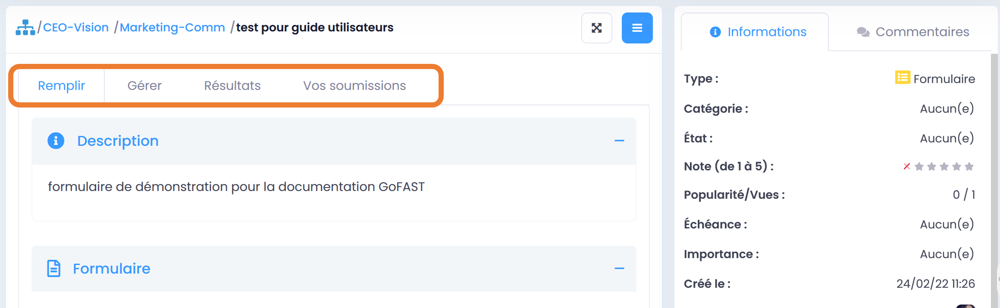

Forums et Wikis
=====================

Les Forums 
----------------

**Objectif des forums :**
Partager des idées, bonnes pratiques et conseils avec les membres d’un ou plusieurs Espaces Collaboratifs, sur une ou plusieurs thématiques. 
Les forums permettent de conserver les échanges et donc, de constituer une base de connaissances. Cela permet de gagner un temps précieux lors que l’on a besoin d’informations, plutôt que reposer sans cesse les mêmes questions.

Aller sur un Forum
~~~~~~~~~~~~~~~~
Les forums sont accessibles à tous les membres des Espaces où sont partagés ces forums, peu importe leur rôle dans ces Espaces. 

**Pour trouver un forum :** 
 - Via le volet de gauche : clic sur la « > » pour déplier le volet, puis sur l’onglet « Forums » en bas de ce volet. Vous verrez tous les forums existants où vous avez accès. Vous pouvez filtrer l’arborescence (le sommaire) des forums via le champ « Filtrer », en saisissant les premières lettres du nom du forum. 
 - Via le moteur de recherche, en saisissant des mots-clefs ou en faisant une recherche à blanc, puis en filtrant part type de contenu « Forums ». 

Il faut cliquer sur le nom du forum pour aller dessus. 

Participer dans un forum
~~~~~~~~~~~~~~~~~~~~~~~~~~~
Tous les utilisateurs ayant accès, peuvent enrichir le forum en partageant leurs commentaires.

**Pour partager un commentaire dans un forum :**
 - Allez sur la page du forum (voir rubrique précédente).
 - Via le menu « Burger », clic sur « Nouveau commentaire ».
 - OU clic sur l’icône « flèche » sous l’introduction/descriptif du forum (message tout en haut, sous le titre du forum). 
 - OU clic sur l’icône « flèche » sous un commentaire pour répondre à un commentaire existant. 

Vous pourrez ensuite soit supprimer (corbeille), soit modifier (crayon sur feuille) votre commentaire, ainsi que vous abonner/désabonner à ce forum via le menu « Burger ».
Un message en haut à droite apparaîtra signalant la publication de votre nouveau commentaire.

Seuls les membres administrateurs ou contributeurs des Espaces peuvent créer un forum. Les membres Lecture Seule peuvent toutefois poster des commentaires dans les forums existants. 
Merci de vous référer également à la rubrique : « Créer un Forum ». 

Les Wikis 
----------------

**Objectif des Wikis :**
Partager des bases de conférences, bonnes pratiques et conseils avec les membres d’un Espace Collaboratif, sur une ou plusieurs thématiques. Cela permet de gagner un temps précieux lors que l’on a besoin d’informations, plutôt que reposer sans cesse les mêmes questions.

Aller sur un Wiki
~~~~~~~~~~~~~~~~
Les Wikis sont accessibles à tous les membres de l’Espace où sont partagés ces Wikis, peu importe leur rôle dans cet Espace. 

**Pour trouver un Wiki :** 
 - Via le volet de gauche : clic sur la « > » pour déplier le volet, puis sur l’onglet « Wikis » en bas de ce volet. Vous verrez tous les Wikis existants où vous avez accès. Vous pouvez filtrer l’arborescence (le sommaire) des Wikis via le champ « Filtrer », en saisissant les premières lettres du nom du Wiki. 
 - Via l’explorateur de fichier, onglet « Documents » sur la page d’un Espace, dans le dossier « Wikis »
 - Via le moteur de recherche, en saisissant des mots-clefs ou en faisant une recherche à blanc, puis en filtrant part type de contenu « Wikis ». 

Il faut cliquer sur le nom du Wiki pour aller dessus ou faire un double-clic si c’est depuis l’explorateur de fichiers.

Participer dans un Wiki
~~~~~~~~~~~~~~~~~~~~~~~~~~~
Tous les utilisateurs ayant accès, peuvent partager des commentaires sur le Wiki.

**Pour partager un commentaire dans un Wiki :**
 - Allez sur l'article Wiki (voir rubrique précédente).
 - Via le menu « Burger », clic sur « Nouveau commentaire ». 
 - Via l’onglet « Commentaires » dans le bloc d’information du Wiki : clic sur « Nouveau commentaire » OU clic sur l’icône « flèche » sous un commentaire pour répondre à un commentaire existant.

Vous pourrez ensuite soit supprimer (corbeille), soit modifier (crayon sur feuille) votre commentaire, ainsi que vous abonner/désabonner à ce Wiki via le menu « Burger ».
Seuls les membres administrateurs ou contributeurs des Espaces peuvent créer un Wiki. Les membres Lecture Seule peuvent toutefois poster des commentaires dans les Wikis existants. 

Merci de vous référer également à la rubrique : « Créer une page Wiki »

Notion de Livre Wiki 
~~~~~~~~~~~~~~~~~
Un **Livre Wiki** est un regroupement d'articles Wiki. 
Tous les Wikis créés dans un Espace sont listés comme pages du Livre Wiki de cet Espace. 
Vous pouvez naviguer facilement d'un Wiki à l'autre via le volet de gauche, onglet « Wikis ».

Merci de vous référer également à la rubrique : « Créer une page Wiki »

Messagerie instantanée / TChat (Enterprise only)
===============================================

GoFAST inclut un outil de discussion/conversation en temps réel (basé sur « Element » anciennement Riot Matrix) similaire à MS-Teams et Slack. Mais, contrairement à ces 2 solutions concurrentes, vous savez exactement où sont stockés vos données, dans un datacenter souverain ou dans votre datacenter suivant l’hébergement choisi par votre Organisation/Entreprise.

.. NOTE:: Element est un logiciel libre de messagerie instantanée et c’est la technologie retenue par l’Etat Français (sous le nom de Tchap) et Thales (sous le nom de Citadel Team).

L’outil permet des discussions de personne à personne ou des salons rassemblant plusieurs utilisateurs autour d’une même thématique. Ces échanges peuvent être des messages texte, des images ou des conférences audio/video.

Accéder au Tchat 
------------------------------------

**Le Tchat est accessible de plusieurs façons :**
 - Via le volet de droite : clic sur l’icône « bulle de discussion » ou sur un des salons représentés par une image-cercle, pour déplier le volet. Très pratique su besoin de discuter sans quitter la page d’un document par exemple. 
 - Sur la page d'un espace, onglet « Discussion » (si le salon a été activé)
 - Via le menu principal de gauche, clic sur "Discussion" pour ouvrir le Tchat en pleine page.  
 - Depuis une application à installer sur votre PC ou Smartphone : merci de vous référer à la rubrique « Application Tchat PC / Smartphone »

Organisation des salons de discussions 
--------------------------------------------------
Un salon de discussions est normalement associé à un Espace Collaboratif. Dans ce cas, tous les membres de cet Espace ont accès à ce salon.

.. NOTE::

C'est l'administrateur de l'espace qui peut décider d'associer un salon à l’espace. Toutefois, certains salons de discussions liés aux Espaces Collaboratifs sont créés automatiquement (les premiers niveaux des Espaces de type Organisation). 

**Le Tchat est séparé en plusieurs zones :**
 - la zone des salons « favoris » : si on a indiqué favoris pours certains salons, ils seront dans la zone du haut dans la colonne des salons. 
 - la zone réservée aux conversations entre 2 utilisateurs (2e zone si on a des salons favoris, ou 1ère zone).
 - la zone des salons dont on est membre (la dernière zone de la colonne des salons).
 
.. NOTE:: Pour créer un salon privé avec un utilisateur en particulier ou créer un salon de discussion non lié à un Espace, vous devez cliquer sur le + dans la colonne des salons.
 
.. figure:: media-guide/gofast-conversation-riot-conversation-zones_FR_EN.png
   :alt: 

**Pour sélectionner le salon, cliquez dans le rond correspondant, puis :**
 - commencer à taper du texte (champs en-bas du Tchat).
.. NOTE:: Si dans un salon vous voulez désigner un utilisateur en particulier, démarrer par @ puis le prénom et nom de la personne, celle-ci recevra une notification particulière
 - déclencher une webconférence (audio ou video), via les icônes tout en haut du volet du Tchat. Si une conférence est déjà existante, vous pouvez cliquer sur « détacher » pour ouvrir la webconférence en pleine page, dans un nouvel onglet. 
.. NOTE:: C'est l'administrateur du salon (donc administrateur de l'espace) qui doit initier la 1ère webconference.

Application Tchat PC / Smartphone 
-----------------------------------------------
Il est nécessaire de télécharger l’application « Element » pour avoir accès au Tchat via votre Smartphone. 
Liens pour télécharger l’application : 
 - PC Windows : https://packages.riot.im/desktop/install/win32/x64/Element%20Setup.exe 
 - PC Mac : https://packages.riot.im/desktop/install/macos/Element.dmg
 - PC Linux : https://element.io/get-started#linux-details
 - Smartphone App Store : https://apps.apple.com/app/vector/id1083446067
 - Smartphone Google Play : https://play.google.com/store/apps/details?id=im.vector.app
 - Smartphone F-Droid : https://f-droid.org/packages/im.vector.app/

Pour avoir accès à votre Tchat via l’application : 
 - Renseigner l’URL de votre serveur, sur le modèle : https://XXXXXX-comm.YYYYYYYYY.com/ (recopiez l’URL depuis votre PC et ajouter « -comm » avant le « . »)
 - Rentrez vos identifiants GoFAST (les mêmes que lorsque vous-vous connectez à GoFAST). 

N’hésitez pas à poser vos questions sur les forums de la communauté GoFAST : https://community.ceo-vision.com/ 

Réunions / Webconférence (Enterprise only)
==========================================
GoFAST inclut la technologie de Webconférence Open Source Jitsi, alternative à MS-Teams et Zoom. Toutefois avec Jitsi, vos données restent sur votre GoFAST dans votre datacenter ou en SaaS souverain. Il est possible de faire des webconférences à des dizaines de participants sans problème de qualité. Jitsi fonctionne aussi via l'application Element pour Android et iOS.

Retrouver une Réunion/Webconférence 
------------------------------------------------------
Pour retrouver une réunion / webconférence, plusieurs possibilités : 
 - Depuis l’onglet « Calendrier » de votre espace personnel ou un espace collaboratif (si la réunion est lié à cet Espace). 
 - Via le moteur de recherche
 - Sur votre Tableau de Bord (si le bloc « Mes Réunions » est affiché) 
 - Via votre outil de messagerie (ex. Bluemind, Outlook) : les réunions où vous êtes convié sont notifiées par email avec une invitation agenda. 
 - Via la notification envoyée par email 

Une fois que vous avez trouvé la réunion, vous pouvez cliquer dessus et voir les détails (participants, organisateur, documents ou dossiers liés, descriptif, etc.). 

Rejoindre une Réunion / Webconférence
------------------------------------------------------
Depuis la page de la réunion ou l’email de notification, vous pouvez cliquer sur « rejoindre » pour aller sur la page de la webconférence. 

**Sur la première page de confirmation, vous pouvez :**
 - Choisir/activer le microphone,
 - Choisir/activer la caméra,
 - Personnaliser votre nom/identifiant, 
 - Cliquer sur « Rejoindre la réunion ». 

.. NOTE:: Sur la page de la webconférence, vous avez en haut le nom de la réunion, le nombre de participants présents et les paramètres de performance. 

**Dans la webconférence, vous pouvez notamment :**
 - A gauche, vous avez les vignettes de tous les participants de la réunion, vous pouvez choisir la vignette de la personne que vous souhaitez voir en plein écran (surtout si ce participant fait un partage d’écran). 
 - En bas de la page, vous pouvez activer ou désactiver le micro et la caméra en cliquant sur les icônes. 
 - En bas de la page, vous pouvez faire un partage d’écran. Pour cela, cliquez sur l’icône, une fenêtre s’ouvre, vous choisissez ce que vous souhaitez partager (tout l’écran, la fenêtre, un onglet ...) puis cliquez sur Partager. Vous pouvez à tout moment arrêter le partage en cliquant sur le bouton « Arrêter le partage ».
 - En bas de la page, la « petite main » vous permet de lever la main si vous souhaitez prendre la parole. 
 - Via l’icône « participants », vous pouvez voir tous les participants de la réunion et inviter d’autres si besoin.
 - En bas de la page, vous pouvez activer et désactiver la vue mosaïque (pour passer en plein écran ou avoir des vignettes).
 - En bas de la page, via l’icône « … », vous pouvez réaliser les autres actions disponibles (ex. enregistrer la réunion, couper le micro de tous les autres participants, si vous êtes l’organisateur).

**Pour enregistrer une réunion :**
 - Le premier participant à se connecter à la webconférence peut enregistrer la réunion (car il est considéré comme organisateur de la webconférence.
 - Cliquez sur les trois points en bas de l’écran (le menu des actions).
 - Cliquez sur « commencer l’enregistrement ». Un message vocal indique à ce moment là qu’un enregistrement est lancé. 
 - Une fois que la réunion est finie, cliquez à nouveau sur les trois points puis sur « Arrêter l’enregistrement ». Une demande de confirmation s’affiche, vous validez après vous raccrochez pour fermer la webconférence.
 - Allez dans votre espace personnel sur GoFAST pour retrouver le fichier vidéo de la réunion.

Modifier une Réunion
------------------------------
Seul l’utilisateur qui a créé une réunion ou un administrateur de l’Espace auquel est associée la réunion, peut la modifier. 
Pour modifier une réunion : 
 - Allez sur la page de la réunion (via la recherche, le fil d’activité ou votre calendrier).
 - Cliquez sur le menu « Burger » de la réunion, puis « Modifier cette réunion » 
Une fois que vous enregistrez les modifications, vous et les participants recevrez les modifications (ex. si la date ou l’heure ont été mis à jour).   

Pour savoir comment créer une webconférence, merci de vous référer à la rubrique : « Créer une Réunion/Webconférence (Enterprise only) »

Formulaires 
==========================================
**Objectif des formulaires :**
Récolter des avis, des idées, réaliser un sondage sur un sujet prédéterminé… les formulaires permettent de créer des questionnaires avec divers champs (dates, texte, cases à cochers, listes déroulantes…) et de les diffuser auprès des utilisateurs. Une fois les formulaires renseignés par les utilisateurs GoFAST, il est possible de consulter et d’analyser les résultats.

Merci de vous référer également à la rubrique : « Créer un Formulaire »

Retrouver/Consulter un formulaire
------------------------------------------------
 - Fil d’activité (si formulaire créé, modifié ou commenté récemment). 
 - Dans le calendrier de l’un des Espaces où se trouve le formulaire ou dans son calendrier personnel (dans le cas où on a ajouté une échéance à ce formulaire). 
 - Via la recherche par mots clefs, une recherche "à blanc" (= sans mot-clef) et les filtres de recherche, en particulier par type de contenu "formulaire"
 - Dans ses contenus favoris (si on y a ajouté le formulaire au préalable)

.. NOTE::
   Une fois que votre formulaire est créé, vous arriverez sur la page du formulaire. C'est sur cette page qu'arriveront les utilisateurs qui rempliront votre formulaire. Pour l'instant, elle est vide et tant que vous n'aurez pas publié votre formulaire, personne ne pourra le remplir. 
   En tant que créateur du formulaire, vous avez la possibilité d'accéder aux onglets "Gérer" et "Résultats". Les administrateurs de l'espace dans lequel est ce formulaire y ont également accès.

**La page d’un formulaire affiche les onglets suivants :** 

1. "Remplir" avec l’introduction et les champs à remplir par les utilisateurs
2. "Gérer" où vous avez la possibilité de créer, modifier, supprimer les champs
3. "Résultats" où seront présentées les résultats quantifiés, les soumissions et les valeurs saisies par les utilisateurs 
4. "Vos soumissions" où chaque utilisateur pourra voir les éléments qu’il a lui-même soumis  

**L’accès à ces onglets dépend de vos droits sur le formulaire :**

1. Tous les membres des Espaces où est partagé le formulaire pourront accéder aux onglets "Remplir" et "Vos soumissions". Attention, dans ce dernier onglet chaque utilisateur ne voit que les soumissions qu’il a lui-même réalisées. 
2. Seul le créateur du formulaire et les administrateurs des Espaces où se trouve le formulaire pourront accéder aux onglets "Gérer" et "Résultats".

Gérer un formulaire : ajouter, déplacer, supprimer les champs 

1. Pour ajouter des champs au formulaire, allez sur l’onglet "Gérer"
2. Une fois sur l’onglet "Gérer", allez dans la zone "Edition"
3. Glissez-déposez les champs souhaités depuis la liste des champs disponibles (à droite), vers la zone de construction du formulaire (à gauche)
4. Vous pouvez glisser-déplacer les champs pour en changer l’ordre
5. Pour supprimer un champ, cliquez sur la (x) qui s’affiche en haut à droite au survol de la sourie sur le champ. 

Gérer un formulaire : modifier les champs
-------------------------------------------------------

1. Pour modifier un champ, cliquez sur l’icône "crayon" [ajouter icone] qui s’affiche en haut à droite au survol de la sourie sur le champ. 
2. Vous allez alors rentrer dans la configuration du champ. Selon le type de champs, diverses possibilités seront proposées. 
3. Pour modifier le nom d’un champ, saisissez le texte souhaité dans la propriété "Titre"
4. La propriété "valeur par défaut" permet d’afficher un exemple pour faciliter la compréhension de ce qui est attendu comme information dans le champ.
5. Vous pouvez choisir de "Désactiver" un champ pour qu’il soit affiché dans le formulaire, mais uniquement en consultation (il ne sera pas possible d’y saisir d’information".
6. Vous pouvez rendre un champs "privé" pour qu’il ne soit affiché que pour les utilisateurs autorisés à consulter les résultats (créateur et administrateurs des espaces où se trouve le formulaire).
7. Si vous souhaitez obliger les utilisateurs à renseigner un champ, vous pouvez cocher la case "Requis(e)"

Gérer un formulaire : configurer 
---------------------------------------------
La partie "Configurer" dans l’onglet "Gérer" vous permet de modifier des conditions telles que : 

1. Le nombre maximal de soumissions autorisées (au total)
2. Le nombre maximal de soumissions autorisées par utilisateur et sur une période donnée (ex. par jour, par heure…) 
3. Modifier le statut du formulaire "Ouvert" pour permettre aux utilisateurs de renseigner le formulaire ou "Fermé" pour empêcher toute saisie. 
Pensez à cliquer sur "Enregistrer la configuration" si vous avez apporté des modifications. 

Exploiter les réponses d’un formulaire
---------------------------------------------------
L’onglet "Résultats" est accessible par le créateur du formulaire et les administrateurs des espaces où se trouve le formulaire. 

.. figure:: media-guide/form07.png
   :alt: 

Zone "Statistiques" : permet d’avoir la synthèse quantifiée des réponses pour chaque champ du formulaire.

.. figure:: media-guide/form09.png
   :alt: 

Zone "Soumissions" : permet de visualiser unitairement toutes les soumissions de chaque utilisateur.

.. figure:: media-guide/form08.png
   :alt: 

Zone "Export" permet d’exporter les données au format CSV. Il suffit de choisir les champs souhaités et de cliquer sur "Télécharger".

.. figure:: media-guide/form10.png
   :alt:

Favoris, Derniers contenus vus et Flux RSS
===================================

Derniers contenus vus
------------------------------
Vous pouvez à tout moment retourner sur l’un des 10 derniers contenus vus, autrement dits, ceux que vous avez consultés en allant sur la page du contenu. 

**Pour retrouver ses 10 derniers contenus vus :**
 - Passer par la barre des accès rapides (menu principale du haut) 
 - Cliquez sur l’icône « chrono »
 - Cliquez sur l’un des contenus pour allez dessus. 

.. NOTE::
   Il est également possible d’aller sur les derniers contenus vus depuis le Tableau de Bord (si ce bloc est activé). 
   Vous retrouverez dans ces derniers contenus vus, tous les types de contenus, y compris les Espaces, documents, Wiki, etc. Toutefois, vous ne retrouverez pas les dossiers de l’explorateur de fichiers. 

Favoris (Contenus et Dossiers)
-----------------------------------------
Vous pouvez voir **la liste** de vos documents/espaces/dossiers **favoris** en cliquant sur l’\ **étoile** dans la barre des accès rapides (menu principal du haut). 
Une punaise rouge y apparaîtra, ce qui fixe la fenêtre avec la liste. Pour débloquer la liste, appuyez ailleurs sur la bande noire.
Lorsque vous ajouterez un favori à votre liste, il y aura le message en vert sur la droite de l’écran qui vous signalera l’ajout du favori.

.. figure:: media-guide/image365.png
   :alt: 

Voir également les rubriques : 
 - « Tableau de Bord »
 - « Ajouter aux favoris »

Flux d’information RSS 
-------------------------------

Vous pouvez voir les **news** (récupérées depuis d’autres sites, par exemple l’Intranet ou le site web) via ce logo « Flux » sur la barre des accès rapides (menu en haut de la page).

.. figure:: media-guide/image366.png
   :alt: 

En un clic sur une des « news », vous allez être redirigé vers la page de cette « news ».

Annuaires
=========

Annuaire des Utilisateurs
----------------------------------
[EN COURS DE MISE A JOUR POUR V4.0]

**Pour rechercher un utilisateur vous avez le choix entre :**
 - Saisir son nom dans la recherche, 
 - Passer par l’ "Annuaire" / "Utilisateurs". Vous verrez toute la liste des utilisateurs dans un tableau.

**Sur la page de l’annuaire :**
Dans le bloc de droite, vous pouvez filtrer votre recherche selon le prénom, le nom, la période de connexion ou de création de l’utilisateur et l’état du compte utilisateur (actif ou pas actif).

Vous pouvez directement envoyer un mail ou appeler l’utilisateur via son profil. De même que lui envoyer une demande de « relation », ce qui permet de contacter/voir le raccourci de cette personne même si elle ne fait pas partie de vos espaces collaboratifs.
 

Annuaire des Liste d’utilisateurs 
--------------------------------------------
[EN COURS DE MISE A JOUR POUR V4.0]
Pour rechercher des Listes d’utilisateurs via l’annuaire, allez sur Annuaire dans le menu de gauche, puis sur Listes d’utilisateurs.

Vous pouvez ensuite utiliser les filtres dans le bloc à droite de l’écran pour préciser le nom de la liste, de son créateur ou la période de création (au format JJ/MM/AAAA  ou JJ/MM/AA)

Annuaire des Espaces Collaboratifs
-------------------------------------------
[EN COURS DE MISE A JOUR POUR V4.0]

**Pour rechercher un Espace via l’annuaire :**
 - Allez dans le menu principal de gauche.
 - Cliquer sur Annuaire puis Espaces.
Vous trouverez un tableau listant les espaces existants. 

Vous pouvez utiliser les filtres dans le bloc à droite de l’écran pour préciser le type d’espace recherché : Organisation, Groupe, Public ou Extranet.
Vous pouvez demander à rejoindre un Espace via le menu « Burger » (une demande est alors envoyée aux administrateurs métier de l'Espace). 

.. NOTE::
   Selon les paramétrages de la plateforme et vos droits d’accès, vous pourrez visualiser tous ou une partie des espaces existants.

Annuaire des Contacts
-------------------------------------------
EN COURS DE REDACTION

Statistiques 
==========

Onglet « Statistiques » dans un Espace 
---------------------------------------------------
Dans l'onglet **Statistiques**, vous pouvez choisir les informations que vous souhaitez retrouver graphiquement et sur une période sélectionnée. 
Allez sur la page d’un espace, onglet « Statistiques ». 
Deux sous-onglets sont disponibles :

1. Sous-onglet « **Statistiques des membres** » permet de visualiser les informations relatives aux membres actifs et inactifs, les nouveaux membres et membres connectés.

2. Sous-onglet « **Statistiques documentaires** », permet de visualiser toutes les informations relatives aux documents par sa catégorie, son état et son importance.

.. NOTE::
  - Membres actifs : Activité recencée sur les 3 derniers mois (hors consultation)
  - Membres inactifs : Aucune activité lors des 3 derniers mois

Statistiques de la plateforme
---------------------------------------------------------------------------
Les administrateurs des Espaces Collaboratifs ont la possibilité de consulter les statistiques de l’ensemble des Espaces qu’ils gèrent. 
Pour accéder aux statistiques, il faut passer par le menu principal de gauche, puis cliquer sur "Statistiques". 

Merci de consulter également la rubrique « Statistiques » pour le « Profil Support-utilisateurs ». 

Version mobile
======================
La plateforme GoFAST peut fonctionner également en mobilité, et est accessible depuis n’importe quel support sur smartphone ou tablette, via le navigateur.
Nous vous proposons une version restreinte de la plateforme pour plus de facilité d'utilisation. Ci-après, quelques exemples des écrans que vous pouvez alors retrouver dans votre poche.

Le menu contextuel 
------------------------------

   
   
Accueil : Tableau de bord 
------------------------------
Affiche les divers blocs de votre tableau de bord. 

Accueil : Documents
------------------------------
Pour descendre dans l’arborescence des espaces, ouvrir des dossiers, prévisualiser des fichiers il faut faire un double clic sur les noms d’espaces. 

[IMAGE]

Le tableau de bord : Fil d'actualité 
----------------------------------

.. figure:: media-guide/Mobile-Fil-Actualite-Menu.png
   :alt:
   
L'explorateur de fichiers / GoFAST File Browser
--------------------------------------------------------------

.. figure:: media-guide/Mobile-Explorateur-GFBrowser.png
   :alt:
   

La prévisualisation et menu des métadonnées
----------------------------------------------------------------
Par rapport à la version « GoFAST Plus », le menu est plus limité.

Vous pouvez toutefois le commenter, partager, télécharger renommer ou charger une nouvelle version ainsi que vous y abonner à un document/contenu.
Les métadonnées sont visibles en cliquant sur le bouton « < ». 

Identiques à la version « GoFAST Plus » elles reprennent les informations du document (et informations spécifiques le cas échéant), ainsi qu’au travers de « Voir Plus » les tâches, commentaires et historiques de versions.

.. figure:: media-guide/Mobile-Menu-Preview.png
   :alt:

Moteur de Recherche 
-----------------------------
Le moteur de recherche fonctionne à l’identique en mode GoFAST Essentiel ou GoFAST Plus.

.. figure:: media-guide/Mobile-Recherche-Menu-Modified.png
   :alt:

Le calendrier 
------------------

   

Utilisation avancée et Modules additionnels
====================================

Un guide séparé a pour but de donner les instructions de configuration de logiciels tiers fonctionnant avec la plate-forme GoFAST démultipliant les usages et la puissance de la plateforme.

**Ces outils complémentaires permettent :**
 - Des outils complémentaires en mobilité (dont le Tchat)
 - Une synchronisation de GoFAST avec un PC pour travailler en mode « déconnecté » (type DropBox)
 - L’accès à GoFAST sur les terminaux mobiles (tablettes/Smartphones) par l’explorateur de fichiers
 - La visualisation et/ou l’édition en ligne de documents Office sur tablette
 - La messagerie instantanée (« chat ») sur mobile
 - La vidéoconférence sur mobile (dans navigateur)
 - Des outils de dématérialisation (smartphone, copieur, ...)
 - Des outils de signature électronique

**Vous trouverez ce Guide ici :**
http://gofast-docs.readthedocs.io/fr/latest/docs-gofast-users/doc-gofast-utilisation-avancee.html

