Conversation/Chat/Messagerie instantanée (Enterprise only)
===============================================
   
GoFAST inclut un outil de conversation temps réel (Riot/Matrix) similaire à MS-Teams et Slack. Parcontre, contraiement à ces 2 concurrents, 
vous savez totalement où sont stockés vos données, dans un datacenter souverain ou dans votre datacenter suivant l'option GoFAST choisit.

Riot/Matrix est la technologie retenue par l'Etat Français (Tchap) et Thales sous le nom de Citadel.

L'outil de conversation permet des discussions de personne à personne ou des salons permettant de rassembler plusieurs personnes autour d'une même thématique. Ces échanges peuvent être des messages texte ou des conférences audio/video.

Un salon est normalement associé à un espace ou sous-espace.

.. NOTE::
C'est l'admistrateur de l'espace qui peut décider d'associer un salon à un espace.

De plus, cet outil de conversation Riot est installable aussi sur son smartphone (Android, iOS/iPAD) et comme une application sur PC, MacOS et Linux. 

Comment accéder à Riot
----------------------

Riot est accessible de plusieurs façons :

-par le volet de droite
-sur la page d'un espace (dont un salon a été activé)
-en pleine page par le menu "Discussion"
 
 Organisation des salons
 --------------------------------------
 
 Riot est séparé en plusieurs zones, la zone du haut est réservée au conversation entre 2 utilisateurs, la zone du bas aux salons dont on est membre.
 
.. NOTE:: Pour créer une discussion avec un utilisateur en particulier, vous devez cliquer sur le + dans la zone du haut.
 

 
 Pour sélectionner le salon, il suffit de cliquer dans le rond correspondant, puis :
 
 - commencer à taper du texte
 - déclencher une webconference (audio ou video)
 
 

Messages internes
=================

D’une manière générale, vous verrez un **numéro** sur l’onglet de votre
page URL vous indiquant que vous avez un nouveau message (mail ou chat)

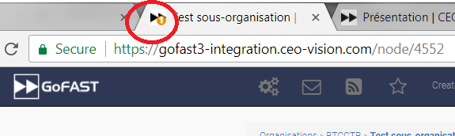

Lire ses messages et y répondre
-------------------------------

Lorsque vous apercevez un numéro rouge sur le logo GoFAST, dans le coin
en haut à gauche, à côté de l’adresse GoFAST, cela veut aussi dire que
vous avez un ou plusieurs **nouveaux messages (**\ par email). Cliquez
sur ce numéro ou sur le message en vert (« You have 1 unread message »)
pour voir la liste des messages reçus.

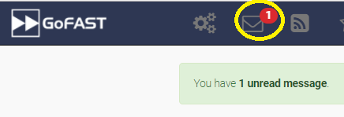

a) **Voici ce que vous verrez si vous appuyez sur le message vert**

    Vous voyez le titre du message reçu, l’expéditeur, la date et heure
    de l’envoi et si c’est un nouveau message (« NOUVEAU » en bleu à
    côté du titre)

    Pour supprimer des messages, sélectionnez les en cochant les cases
    devant chacun et appuyez sur « Supprimer » (en rouge)

    .. figure:: media-guide/image326.png
       :alt: 

    Vous pouvez aussi choisir une action comme « Marquer comme lu ou
    non-lu », en cliquant sur la flèche à droite au niveau de la ligne
    « Actions »

    .. figure:: media-guide/image327.png
       :alt: 

    Vous pouvez également trier par ordre chronologique croissant ou
    décroissant en cliquant sur la flèche au-dessus des dates et heures
    d’envoi

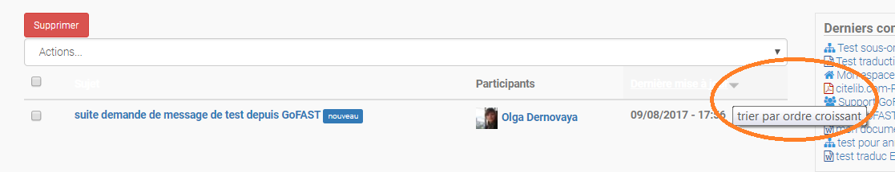

b) **Et voici ce que vous verrez si vous appuyez sur l’enveloppe**

    Vous voyez la liste des messages, les participants (expéditeurs et
    destinataires), la date et l’heure d’envoi et la poubelle pour le
    supprimer.

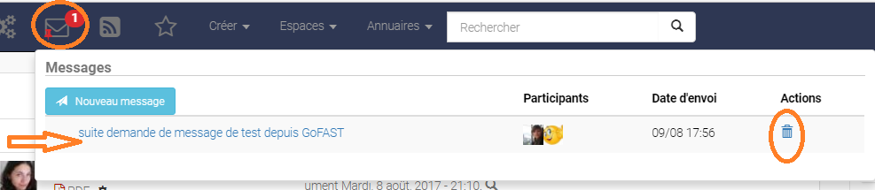

.. NOTE::
    Si vous cliquez sur l’enveloppe , une punaise rouge
    apparaît, ce qui fixe la fenêtre avec les messages. Pour la
    débloquer, cliquez ailleurs sur la bande noire du menu, ainsi la
    fenêtre avec la liste des messages se refermera.

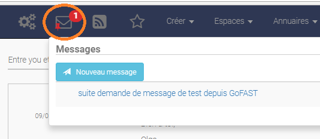

**Cliquez sur le titre du message pour l’ouvrir.**

Lorsque vous ouvrez le mail, vous retrouvez les informations telles que
l’expéditeur (avec sa photo), la date et l’heure de l’envoi, le message
envoyé et la possibilité d’y répondre avec les mêmes options que dans
Word. Terminez avec « Envoyer le message »

.. figure:: media-guide/image331.png
   :alt: 

.. NOTE::
   Vous ne pouvez ni ajouter, ni supprimer un participant en
   cours de conversation, ce qui veut dire que si l’échange de mail
   commence entre 2-3 personnes, vous ne pourrez pas y ajouter/supprimer un
   participant lors de vos échanges/réponses. Il n’est donc pas possible
   non plus de transférer un message.

Le service de mails sur GoFAST ne doit pas remplacer votre boîte mail
traditionnelle (Lotus, Outlook, …) . Il est surtout utile pour converser
directement sur GoFAST entre utilisateurs sans devoir passer d’une boîte
de messagerie à une autre et de pouvoir, via la prévisualisation,
envoyer directement un document (son lien GoFAST) par mail.

(Cfr : voir « Actions contextuelles de prévisualisation d’un
document » / « Envoyer par mail » p.88)

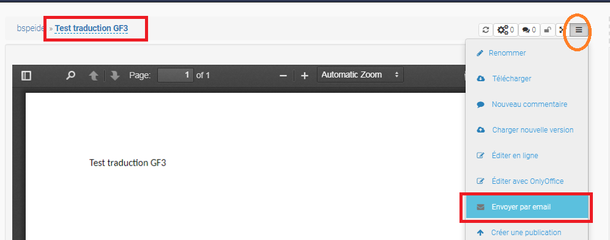

.. figure:: media-guide/image333.png
   :alt: 

Créer un nouveau message
------------------------

Pour **créer un nouveau message/Email**, allez sur l’icône de
l’enveloppe sur la barre noire supérieure. Cliquez ensuite sur « Nouveau
message » en bleu.

.. figure:: media-guide/image334.png
   :alt: 

Ecrivez les 3 premières lettres du nom de l’utilisateur à qui vous
voulez envoyer le mail (celui-ci doit être un utilisateur de la GoFAST),
et le système vous proposera une liste de noms à sélectionner.

Donnez un titre au mail et écrivez le contenu puis envoyez

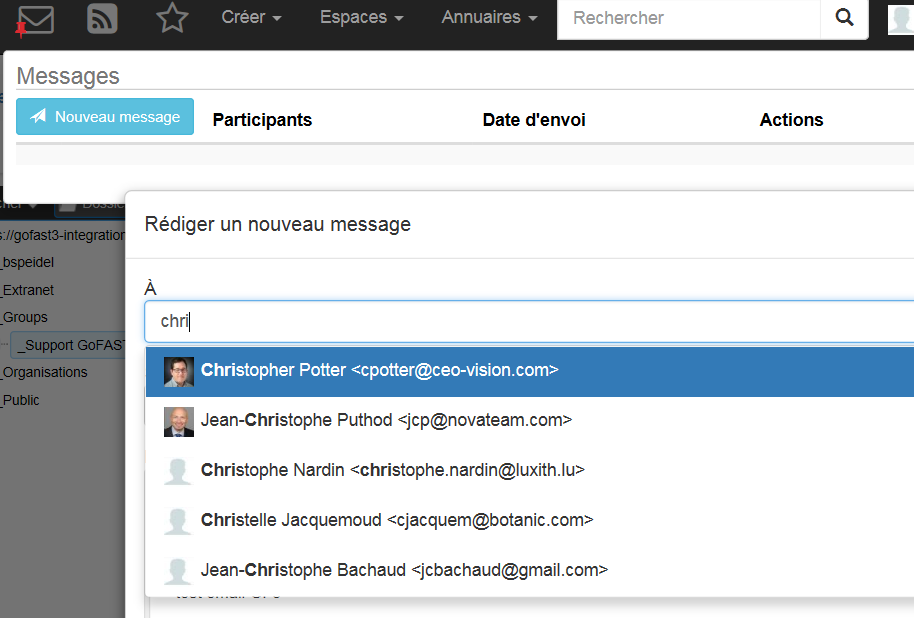

.. image:: media-guide/Tag-Enterprise.png
   :align: right
   :scale: 7%
   
   
Favoris et Derniers contenus vus
================================

Derniers contenus vus
-----------------------

Cette petite fenêtre visible presque sur toutes les pages, sur la droite de
l’écran, vous permet de voir les **10 derniers documents** que vous avez
consultés/ouverts, cela sert de raccourcis puisqu’il suffit de cliquer
sur le titre pour ouvrir la prévisualisation.

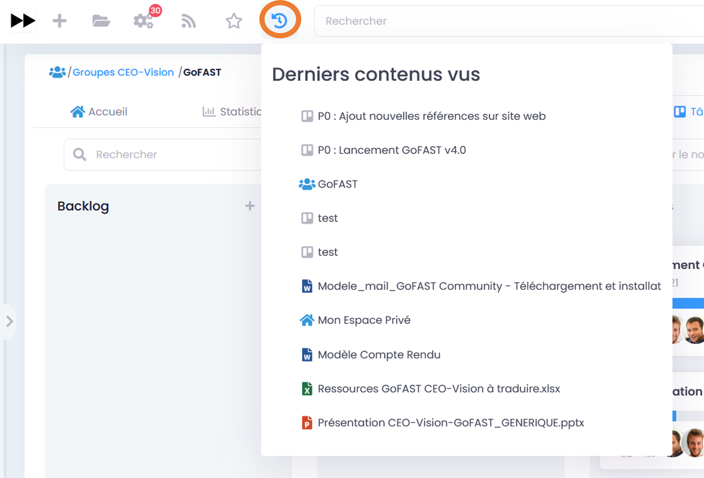
   
Il est aussi possible de voir cette vue depuis la barre de navigation de la GoFAST:

.. figure:: media-guide/Ecran-GoFAST-Dernier_Contenus_vues.png
   :alt: 
   
Accès aux Favoris
-------------------

Vous pouvez voir **la liste** de vos documents/espaces/dossiers **favoris** en
cliquant sur l’\ **étoile** sur la bande noire du menu général. Une
punaise rouge y apparaîtra, ce qui fixe la fenêtre avec la liste. Pour
débloquer la liste, appuyez ailleurs sur la bande noire.

Lorsque vous ajouterez un favori à votre liste, il y aura le message en
vert sur la droite de l’écran qui vous signalera l’ajout du favori.

(Cfr : voir « Comment ajouter un favori » dans les actions contextuelles
de prévisualisation p. 95)

.. figure:: media-guide/image365.png
   :alt: 

Tableau de Bord dynamique
=========================
À partir de la version 3.6.1, GoFAST bénéficie d’un Tableau de Bord dynamique pratique. Ce dernier permet d’avoir un accès rapide aux éléments les plus sollicités.

On pourra y accéder de deux façons :

- À partir du menu principal, cliquer sur le Burger puis «Tableau de Bord » dans le menu déroulant.

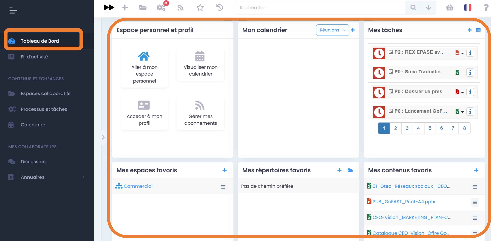

- À partir de la page « Fil d’activité », en cliquant sur « Tableau de Bord ».

Ce dernier dispose de 6 blocs :

Espace privé et profil
----------------------

Ce bloc est statique, il permet d’accéder à votre espace privé, visualiser votre calendrier, gérer votre profil ainsi que vos abonnements. 

Votre espace principal (CEO-Vision)
----------------------------------

Dans ce bloc, vous avez la possibilité d’afficher l’espace principal de votre choix. Vous aurez à disposition l’accès au aux documents de ce dernier ainsi que son calendrier associé.

Pour ce fait, aller dans votre profil puis cliquer sur « Paramètres du compte », défiler jusqu’à la section « Informations sur l’utilisateur » ensuite sélectionner dans le champs «Organisation principale » l’espace souhaité. N’oublier pas de sauvegarder en appuyant sur le bouton « Enregistrer» en bas de la fenêtre.

.. NOTE::
   Un seul espace principal pourra être mis en avant dans ce bloc du Tableau de bord.

Memos
-----

Ce bloc récupère toutes les nouvelles partagées créées à partir de la page « Fil d’activité ».

Pour créer un mémo, aller dans la page « Fil d’activité », cliquer sur « Partager une nouvelle», saisir votre texte puis appuyer sur « Envoyer » pour partager ou Annuler pour arrêter la création.

Pour supprimer un mémo de votre Tableau de bord, rendez-vous dans la page « Fil d’activité ». Vous pouvez également épingler son contenu.

.. NOTE::
    les mémos sont partagés en publique. Toutes les personnes inscrites sur la plate-forme auront accès à ces informations.

Mes espaces favoris
-------------------

Ce bloc permet de lister les espaces favoris pour un accès rapide. Il est possible également d’épingler d’autres espaces ou de les supprimer des favoris à partir du bloc.

Pour ajouter un ou plusieurs espaces favoris, cliquer sur le bouton +  « Épingler un nouvel espace ».

Taper les trois premières lettres de l’espace pour lequel vous voulez mettre en favoris. Une liste de propositions s’affiche, sélectionner le nom recherché. 
Une fois que vous avez terminé, appuyer sur « Épingler sur le tableau de bord ».

Pour supprimer un espace des favoris, cliquer sur le bouton placé à droite du titre puis appuyer sur « Supprimer des favoris ».

Un message de confirmation de suppression s’affiche en haut à droite de la fenêtre.

Vous remarquerez que l’espace est toujours épinglé  sur le bloc, cela ne signifie pas que l’action n’a pas eu lieu mais simplement par précaution en cas d’erreur, vous pouvez restaurer cet espace en cliquant sur le même bouton puis sur « Ajouter aux favoris ».

En revanche, si vous actualisez ou vous quittez la page du tableau de bord, la suppression se fait de manière définitive et l’espace ne sera plus visible dans le bloc.

Mes contenus favoris
--------------------
Dans le bloc « Mes contenus favoris », vous pouvez épingler les documents favoris. Pour ajouter un ou plusieurs contenus, cliquer sur l’icône Plus à droite du titre du bloc « Épingler un nouveau contenu ».

Renseigner le nom du contenu souhaité dans la barre de recherche puis faites votre sélection et enfin appuyer sur le bouton « Épingler sur le tableau de bord ».

Les documents épinglés peuvent être prévisualisés, édités, partagés, archivés et commentés directement à partir du tableau de bord.
 

Annuaires
=========

Chercher un Espace Collaboratif
-------------------------------

Pour **rechercher des Espaces Collaboratifs via l’annuaire,** allez sur *Annuaire* dans le menu principal, puis sur Organisations, Groupes, Public ou Extranets. Vous trouverez l'arborescence des espaces existants, que vous pouvez rejoindre en cliquant dans les cases (une demande est alors envoyée aux administrateurs métier de l'Espace). 

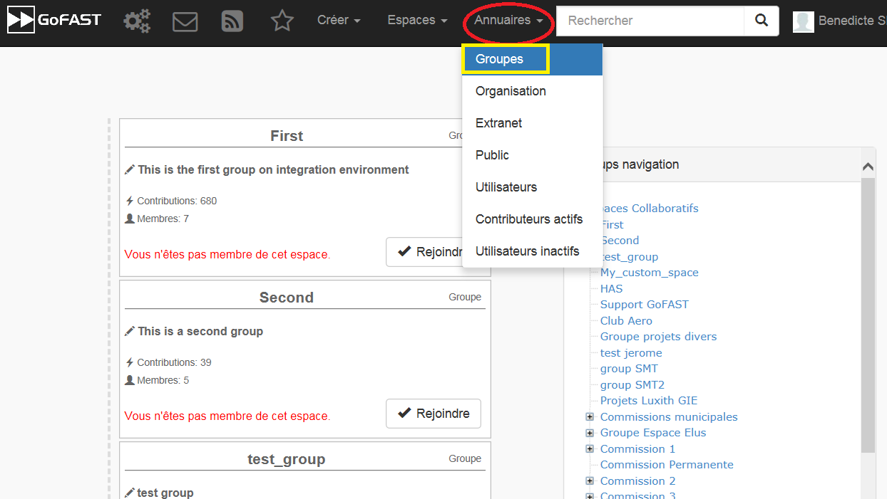
   
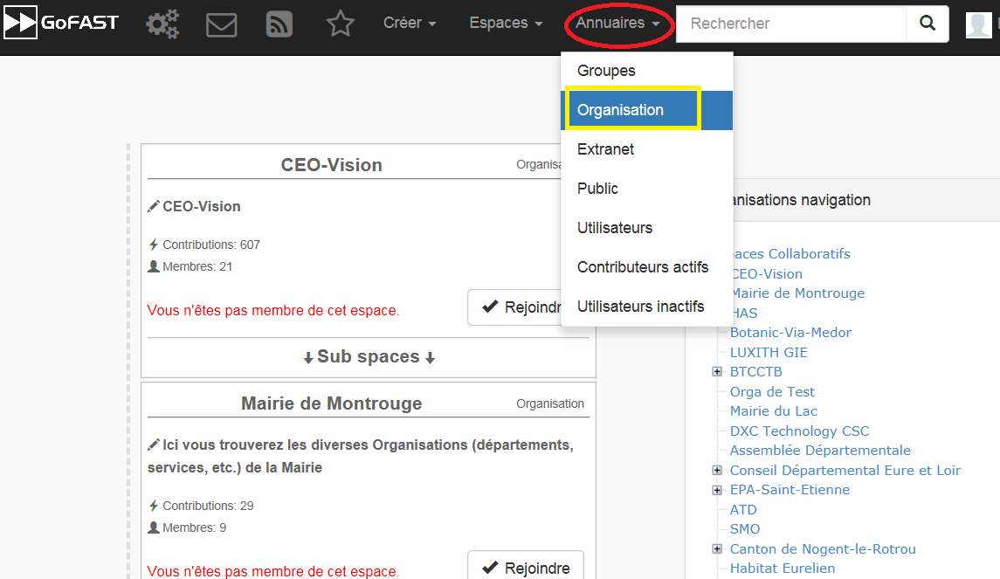

Chercher une Liste d'utilisateurs
----------------------------------

Pour **rechercher des Listes d'utilisateurs via l’annuaire,** allez sur *Annuaire* dans le menu principal, puis sur *Listes d'utilisateurs*.

.. figure:: media-guide/Ecran-GoFAST_Liste-Utilisateurs_annuaire-liste.png
   :alt: 

Chercher un utilisateur
-----------------------

Pour rechercher un utilisateur vous avez le choix entre tapez son nom dans la
recherche, ou passer par l’ "Annuaire" / "Utilisateurs". Vous
verrez toute la liste des utilisateurs GoFAST avec leur « carte de
visite ».

.. figure:: media-guide/image321.png
   :alt: 

Vous pouvez **filtrer** votre recherche selon les noms et l’alphabet ou
les organisations/groupes/espaces

.. figure:: media-guide/image322.png
   :alt: 

Vous pouvez directement envoyer un mail ou appeler l’utilisateur via son
profil. De même que lui envoyer une demande de « relation », ce qui
permet de contacter/voir le raccourci de cette personne même si elle ne
fait pas partie de vos espaces collaboratifs.

.. figure:: media-guide/image323.png
   :alt: 

Flux d'information
==================

Vous pouvez voir les **news** (pareil que sur l’Intranet) via ce logo
(Flux) sur la bande noire du menu.

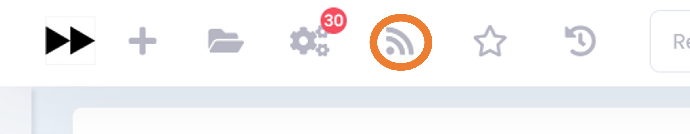

Rapports & statistiques 
=======================

Onglet « Statistiques » dans un Espace
---------------------------------------------------
Dans l'onglet **Statistiques**, vous pouvez choisir les informations que vous souhaitez retrouver graphiquement et sur une période sélectionnée. 

Deux sous-onglets sont disponibles :

a) Sous-onglet « **Statistique des membres** » permet de visualiser les informations relatives aux membres actifs et inactifs, les nouveaux membres et membres connectés.

b) Sous-onglet « **Statistique documentaires** », permet de visualiser toutes les informations relatives aux documents par sa catégorie, son état et son importance.

Version mobile
======================

La plateforme GoFAST peut fonctionner également en mobilité, et est accessible depuis n'importe quel support sur smartphone ou tablette.

Nous vous proposons une version simplifiée de la plateforme pour plus de facilité d'utilisation, voici quelques exemples des écrans que vous pouvez alors retrouver dans votre poche : 

1. Le menu contextuel 
----------------------

.. figure:: media-guide/Mobile-Fil-actualite.png
   :alt:
   
   
2. Le fil d'actualité et son menu 
----------------------------------

.. figure:: media-guide/Mobile-Fil-Actualite-Menu.png
   :alt:
   
3. L'explorateur de fichiers / GoFAST File Browser
--------------------------------------------------

.. figure:: media-guide/Mobile-Explorateur-GFBrowser.png
   :alt:
   

4. La prévisualisation et son menu de métadonnées
--------------------------------------------------

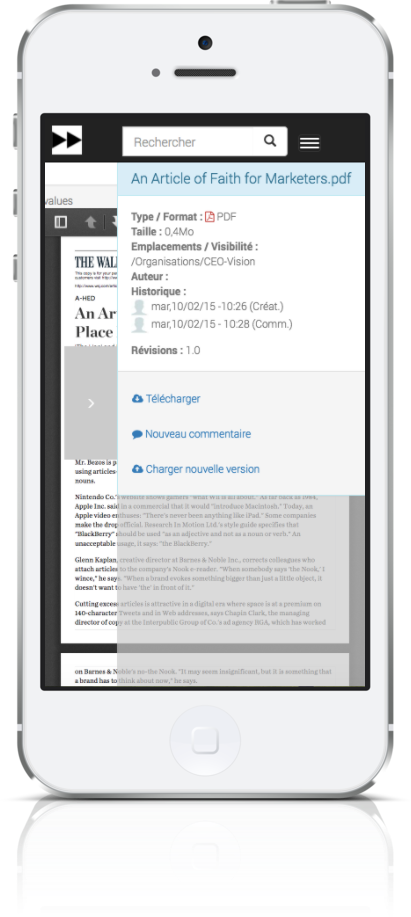

Vous pouvez alors mettre à jour une version d'un document, ou encore ajouter un commentaire 

5. Moteur de Recherche 
-------------------------

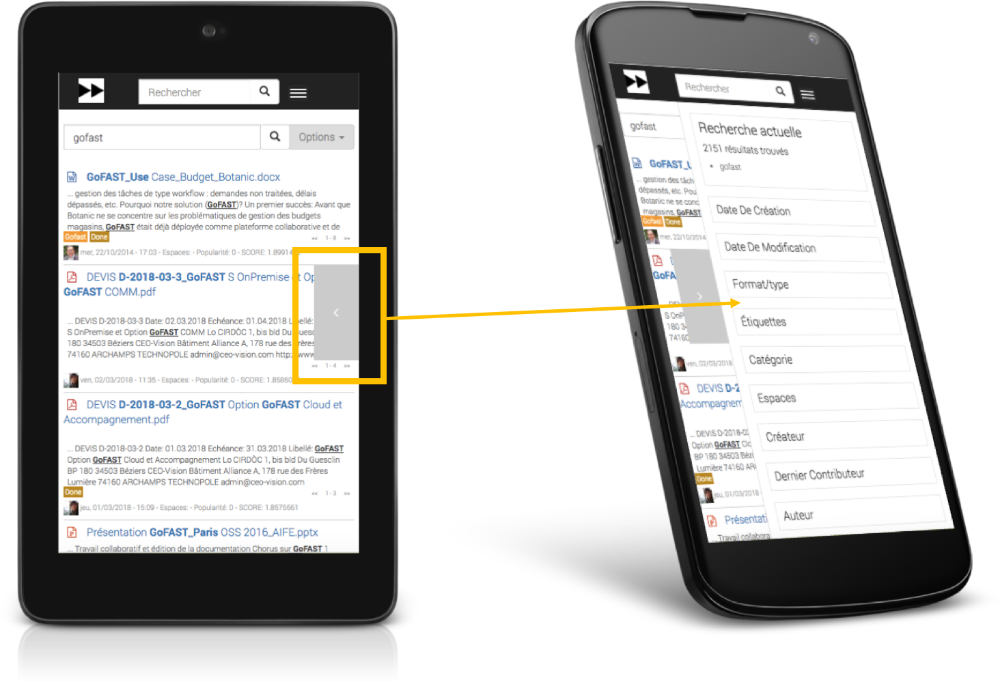

6. Le calendrier 
------------------

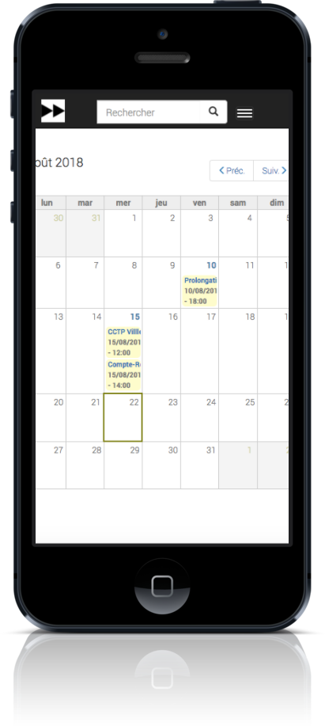
   

Utilisation avancée (signature, mobilité, ...)
==============================================

Un guide séparé a pour but de donner les instructions de configuration
de logiciels tiers fonctionnant avec la plate-forme GoFAST démultipliant
les usages et la puissance de la plateforme

Ces outils complémentaires permettent :

-  Des outils complémentaires en mobilité
-  Une synchronisation de GoFAST avec un PC pour travailler en mode «
   déconnecté » (type DropBox)
-  L’accès à GoFAST sur les terminaux mobiles (tablettes,…) par
   explorateur de fichiers
-  La visualisation et/ou l’édition en ligne de documents Office sur
   tablette
-  La messagerie instantanée (« chat ») sur mobile
-  La vidéoconférence sur mobile (dans navigateur)

-  Des outils de dématérialisation (smartphone, copieur, ...)
-  Des outils de signature électronique

Vous trouverez ce Guide ici :
http://gofast-docs.readthedocs.io/fr/latest/docs-gofast-users/doc-gofast-utilisation-avancee.html

Annexes : Quelques bonnes pratiques
===================================

.. IMPORTANT:: 
   Même si GoFAST nécessite de changer un peu ses habitudes,
   il est important que le plus grand nombre fasse l'effort de changer. Les
   gains en temps sont ensuite très importants, tout le monde est alors
   gagnant!

**Objectif 1: Diminuer le nombre de mails entre collègues et partenaires**

-  Je n'envoie plus de mails avec pièce jointe, mais je mets un
   commentaire sur le document sur GoFAST, toutes les personnes
   recevront une notification.

   -  dans de nombreux cas la pièce jointe n'est déjà plus à jour quand
      votre destinataire la recoit de plus les pièces jointes encombres
      les messageries.

-  Je n'envoie plus de mails avec pièce jointe à mes contacts n'ayant
   pas de compte GoFAST mais j'utilise la fonction "Partager par email"
-  Je n'élabore plus un document 'chacun son tour' mais utilise la co-édition OnlyOffice

   - Ceci permet de gagner du temps et limite les erreurs, évite d'avoir à fusionner les sections rédigées par chacun

-  Je n’envoie plus de demandes de tâche ou validation par mail, mais
   j’utilise les ‘’workflows’’ (processus de tâches) pour relecture,
   validation, signature, etc. => tout le monde est notifié, chacun
   connaît sa tâche et les délais sont respectés.
-  J’utilise les forums pour mes questions/réponses au lieu des mails =>
   tout le monde partage ses connaissances.

**Objectif 2: Gagner du temps dans la recherche d’information, fichiers et autres contenus**

-  La totalité des contenus (même cellules d'un tableur, ....) est
   indexé (indexation "plein-texte") et le moteur de recherche est
   considéré comme un des plus puissants
-  je gagne jusqu'à 30% de mon temps *(source IDC : 30% des cadres
   passent leur temps à rechercher des contenus dispersés et dupliquer)*

**Objectif 3 : Mettre fin aux doublons de fichiers et autres contenus**

-  Je ne garde plus de fichiers sur mon PC ou boîte mail, les documents
   sont centralisés et accessibles selon les droits d’utilisateurs.
-  Je ne copie plus jamais un document à plusieurs endroits, j'utilise
   la fonction Emplacement/Visibilité qui permet à un même document
   d'être vu dans plusieurs espaces.

   -  Quelque soit l'espace, tout le monde aura la bonne version

-  Je ne créé plus un fichier par version

   -  GoFAST versionne automatiquement et toutes les versions sont
      accessibles à tout moment.

-  J’accède à mes documents de travail en mobilité et je n’ai pas besoin
   de copie locale ou de version papier (accès Online sur Tablettes et
   Online/Offline sur PC).
-  Je partager les informations avec mes clients et fournisseurs dans
   l’Extranet GoFAST et ainsi, ils ont accès aux mêmes documents et non
   plus des doublons, qui sont rapidement obsolètes.
-  Je ne stocke plus mes documents dans la messagerie car un simple
   glisser-déposer suffit pour les transférer sur GoFAST.

**Objectif 4: Maîtriser les processus de traitement, validation et signature des documents**

-  Les processus informels ou les procédures papier souvent inefficaces,
   sont modélisés dans GoFAST => grâce à des circuits de tâches
   prédéterminés, vous retrouvez la maîtrise des divers processus
   métier.

-  Je n’ai plus à chercher les dates d’échéances dans mes mails,
   celles-ci sont clairement indiquées sur les processus et me sont
   rappelées par notification.

**Objectif 5: Diminuer le volume papier**

-  Je numérise les documents papiers (contrats, factures, courriers,
   etc.) et les envoie directement vers la plateforme GoFAST où ils
   seront indexés plein texte à la volée.
-  Je transforme les formulaires papier en documents électroniques et
   les diffuse avec efficacité (cibler un groupe, rappels automatiques
   et relance, suivi des actions, etc.) et j’exporte les données dans un
   tableur.
-  Je signe électroniquement les PDF avec certificat sécurisé plutôt que
   de les imprimer pour les signer et les re-scanner.
