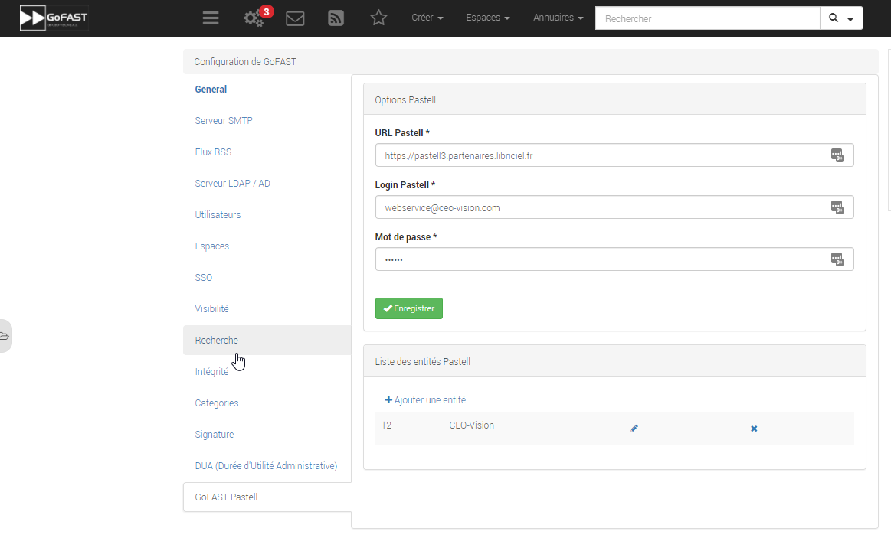
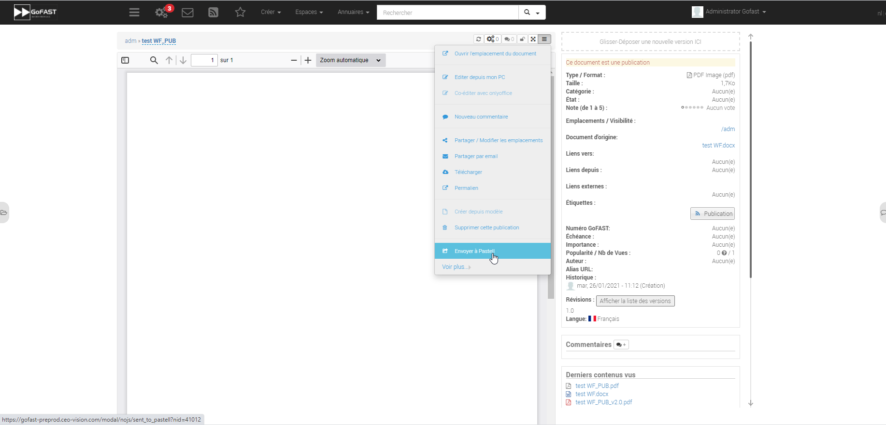
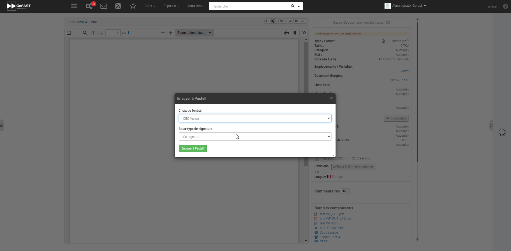
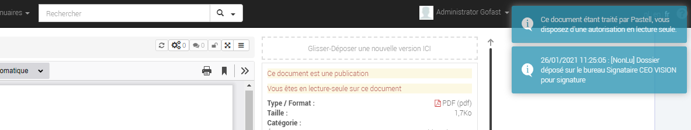
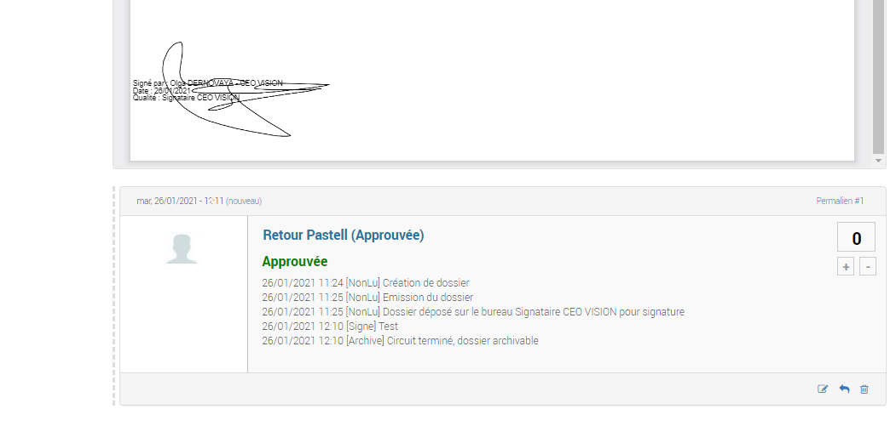

GoFAST : Modules complémentaires
============================

Introduction
------------
Ce document a pour but de vous fournir une documentation sur l'utilisation des modules complémentaires que propose CEO-Vision.

Couplage GoFAST-Pastell (signature)
-----------------------------------

À la demande générale, nous avons créer un couplage Pastell GoFAST pour la gestion de la signature électronique.
Voici comment l'utiliser :

**Configuration**

Dans l'image ci-dessous, vous pouvez voir la configuration de votre Pastell dans GoFAST (il nécessite un identifiant, un mot de passe, et enfin l'URL de votre Pastell)

**Utilisation**

Lorsque vous arrivez sur un document PDF, il est possible d'envoyer le document à Pastell pour signature via le menu contextuel du document :

Vous arrivez alors sur cette modale là :

Vous devez alors choisir l'entité à laquelle vous appartenez :

Puis le processus que vous décidez d'utiliser (cela dépend de la configuration de votre Pastell):

vous pouvez maintenant envoyer à Pastell le document pour signature en cliquant sur le bouton envoyer.

Le document est alors "verrouillé" (métadonnées non-modifiable).

L'état du document coté Pastell est écrit sous forme de "Message" quand nous allons sur le document :

Une fois le processus de signature terminé (approuvé ou refusé), un commentaire est créé avec les différentes étapes et leurs informations :

