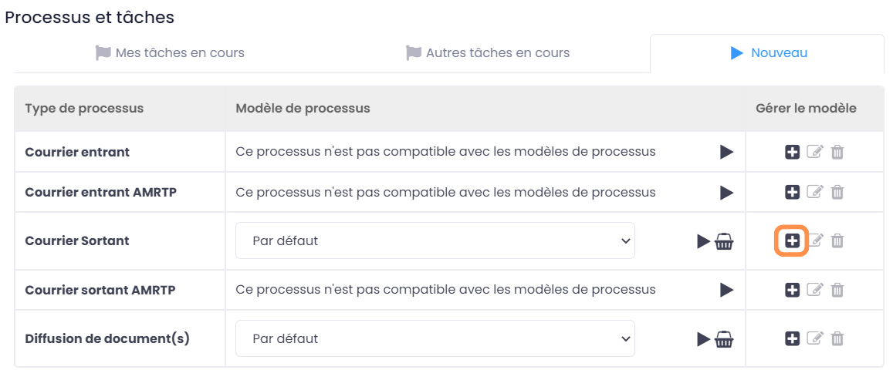

GoFAST : Modules complémentaires
============================

Introduction
------------
Ce document a pour but de vous fournir une documentation sur l'utilisation des modules complémentaires que propose CEO-Vision.

Couplage Module Gestion des Courriers
-----------------------------------

**Introduction**

Ce document a pour but de vous fournir une documentation sur l'utilisation des modules complémentaires que propose CEO-Vision.

Le module Courrier est une nouvelle fonctionnalité de la GED Collaborative GoFAST conçue pour simplifier la gestion des courriers en centralisant les documents (PDF, documents scannés, e-mails/pièces jointes...) dans des espaces collaboratifs dédiés. Ce module permet d'améliorer la visibilité et la traçabilité des courriers et facilite le traitement en équipe grâce à des fonctionnalités avancées.

Le module Courrier offre une gestion complète de la vie du courrier, de l'enregistrement à la distribution, en passant par la réception et l'envoi. Les utilisateurs peuvent gérer les courriers de manière efficace grâce à des fonctionnalités de collaboration telles que la gestion de modèles de documents, la gestion des versions et l'historique, ainsi que les commentaires au document. Ils peuvent également éditer et coéditer en temps réel des fichiers Office directement sur la plateforme GoFAST.

Le module Courrier offre également des fonctionnalités avancées pour améliorer la communication et la visibilité des tâches en cours. Les utilisateurs peuvent suivre l'état des courriers, les délais de traitement et les actions en cours grâce à des notifications de synthèse d'activité et des vues liées aux workflows, tels que l'accès rapide aux tâches, le tableau de bord des processus et les notifications.

En somme, le module Courrier de GoFAST simplifie la gestion des courriers et améliore la collaboration en équipe en offrant un accès centralisé aux documents et des fonctionnalités de suivi et de notifications avancées. Pour en savoir plus sur les fonctionnalités disponibles dans le module Courrier de GoFAST.

**Module « Gestion des courriers »**

Le module courrier a pour objectif de centraliser les courriers (PDF, documents scannés, emails/pièces-jointes...) dans des espaces collaboratifs dédiés aux courriers et améliorer sa gestion de traitement.

Grâce au multi-emplacement, les courriers sont partagés à la fois dans l’Espace Collaboratif transversal et les Espaces des Directions avec zéro doublon. La visibilité peut également être partagée dans des espaces privés si nécessaire.

**Parmi les objectives du Module de Gestion des courriers :**

- Centraliser et automatiser la gestion des courriers et les réponses associées, dans le respect des droits d’accès 
-	Assurer la bonne conformité des étapes de tri et diffusion, lecture, rédaction des réponses et leur validation à un workflow
- Disposer des alertes nécessaires afin de veiller à la bonne prise en compte et au respect des délais
- Retrouver n’importe quel courrier avec un ou deux mots clefs (ex. sujet, expéditeur/destinataire, date, etc.)

**Espaces Collaboratifs dédiés à la gestion des courriers**

Même principe sur la gestion des contenus dans GoFAST, la gestion du courrier est dédiée aux Espaces collaboratifs : 

- Un espace de type groupe transversal "Traitement des Courriers", avec deux sous-groupes : un pour classer les "courriers entrants" et un pour les "courriers sortants". Les accès à ces espaces transversaux sont gérés par les responsables métiers en charge de la gestion des courriers.
- Pour chaque Espace Collaboratif réservé à une Direction/un Service, un sous-espace sera dédié à la gestion des courriers (entrants et sortants).

Selon le destinataire ou l’émetteur d’un courrier (Directions/Service), les documents pourront être partagés entre l’espace transversal dédié au traitement des courriers et les espaces réservés aux Directions/Services : le même document courrier sera donc visible aux bons Espaces Collaboratifs, sans doublon et avec toutes les informations, les commentaires échangés et l’historique des versions.

**Métadonnées du courrier**

Une fois le document traité en courrier celui-ci acquiert des métadonnées supplémentaires en allant dans l’onglet « Informations du courrier » 

Ces métadonnées recensent les différentes informations importantes liées au courrier comme l’affiche l’image ci-dessous : 

**Comment créer un espace dédié à la gestion des courriers ?**

Pas besoin de créer un nouvel espace dans GoFAST pour le traitement des courriers.

Selon l’arborescence de votre organisation, vous pouvez marquer les espaces qui seront amenées à traiter les courriers comme Espace « Traitement des Courriers ».

**Comment faire ?**

1. Ouvrez l’espace auquel vous souhaitez marquer comme espace traitant du courrier
2.	Ouvrez l’espace auquel vous souhaitez marquer comme espace traitant du courrier
3.	Validez l’action 

.. image:: media-guide/créer_espace_module_courrier.png

A la validation, un sous-espace « Traitement des courriers » est créé avec deux dossiers « Courrier entrant » et « Courrier sortant » pour classer les courriers respectivement. 

Une liste Utilisateurs « Traitement courrier ‘nom de l’espace’ » est créée dans l’onglet « Membres » en prenant comme membres les membres de l’espace.  

**Qui peut traiter un courrier ?**

Les personnes habilitées à traiter des courriers sont les membres de la liste « Traitement courrier » créée automatiquement dans chaque espace traitant du courrier.  

**Comment traiter un courrier entrant ?**

1. Stocker les courriers entrant dans GoFAST

A la réception du courrier qui peut être soit en papier ou numérique, le responsable du service courrier doit stocker celui-ci dans GoFAST afin de lancer le processus de traitement.  

- Si GoFAST est couplée avec un outil de numérisation, les courriers scannés peuvent être directement classés dans le sous-répertoire « A traiter » du répertoire « Courrier entrant ».
- Déposer dans le répertoire dédié depuis la messagerie (email) via le glisser-déposer.
- Fichiers ajoutés via le glisser-déposer depuis le PC (lecteur réseau) 

**GoFAST propose 4 façons de lancer un processus comme le workflow standard :**

- Depuis la barre principale du haut, via l’accès rapide aux « Processus et Tâches »
- Depuis la page d’un document, via le bouton « Processus et Tâches »
- Depuis le panier documentaire.
- Depuis l’espace courrier entrant qui déclenche le workflow automatiquement

**Démarrer un processus via la barre des accès rapides**

Pour sélectionner un processus de traitement des courriers et démarrer depuis la barre d’accès rapide (menu du haut) : 

- Cliquez sur l’icône « Processus et Tâches » qui se trouve tout en haut de la page, 
- Dans la fenêtre « Processus et Tâches » cliquez sur l’onglet « Nouveau »

.. image:: media-guide/processus_accès_rapide_1.png

**Démarrer un processus depuis la page d’un document**

Pour sélectionner un processus de traitement des courriers et démarrer depuis la page d’un document : 

- Allez dans l’onglet « Tâches » Cliquez sur l’icône « Processus et Tâches » qui se trouve tout en haut de la page. Puis cliquez sur "Nouveau"

Un nouvel onglet s’affiche, sélectionnez « Courrier entrant » comme ci-dessous :

**Démarrer un processus depuis le panier**

Dans le cas où vous avez plusieurs courriers pour un service, vous pouvez lancer votre processus via le panier. 

.. NOTE:: Mettez vos courriers dans le panier

- Cliquez sur l’icône « panier » dans la barre des accès rapides (menu principal du haut)
- Sous la liste des documents de votre panier, cliquez sur « Nouveau processus ».
- La liste des processus disponible s’affiche : sélectionner le processus « courrier entrant »

**Renseigner le formulaire de transmission d’un courrier entrant**

Une fois le processus « courrier entrant » sélectionné, le formulaire de transmission s’ouvre et vous permet de renseigner les divers champs et assignez à vos collaborateurs les différentes étapes du processus. 

.. NOTE:: Si le courrier entrant nécessite une réponse, il vous suffit de cocher le champ OUI du champ « Nécessite une réponse ».

Dans ce cas là, le processus de traitement de courrier entrant fini, le traitement de courrier sortant se déclenche automatiquement. 

.. NOTE:: Le numéro d’enregistrement s’incrémente à chaque enregistrement. 

.. NOTE:: Dès que la fiche de transmission est lancée, la catégorie du document passe en « courrier entrant » et l’état « en cours de transmission ».

.. NOTE:: Tout au long du traitement du courrier, l’état, l’emplacement du document change selon les étapes.   

**Démarrer un processus depuis l’espace courrier entrant**

Vous pouvez également faire simplement un glissé-déposé dans le sous-espace « A traiter ». Cela lancera automatiquement le processus de traitement de courrier.

Vous retrouverez ensuite le traitement de ce courrier dans « Processus et tâches » et dans « Mes tâches en cours » :

.. image:: media-guide/processus_et_tâches_courrier.png

**Comment démarrer un courrier sortant ?**

Le processus courrier sortant peut-être attaché à un courrier entrant, dans ce cas inutile de lancer le processus. Il est déjà dans la bannette de processus, vous pouvez consulter et traiter votre processus via l’icône « Processus et Tâches »

.. NOTE:: Les deux courriers sont liés.

.. NOTE:: Le courrier entrant est rattaché au formulaire pour le traitement du courrier sortant.

Dans le cas où le processus courrier sortant n’est pas attaché au courrier sortant, vous pouvez lancer le processus via une des 4 façons vue au-dessus. Cependant, vous devez sélectionner « courrier sortant ».  

*Exemple d’une des 4 façons*

**Renseigner le formulaire de transmission d’un courrier sortant**

Une fois le processus lancé, le formulaire du courrier sortant s’ouvre et vous pouvez renseigner les divers champs. 

.. NOTE:: Vous pouvez choisir la manière de charger votre courrier sortant soit à partir de GoFAST soit via votre PC.

Si le courrier est déjà rédigé, vous pouvez cocher le champs « Le courrier est déjà rédigé » et l’étape de rédaction est masquée.

**Traiter un courrier sortant via un template**

Vous pouvez également créer un template pour le processus de traitement de courrier. Cela permet d’accélérer le processus et de compléter automatiquement la chaîne de traitement courrier. Pour cela, allez dans « Processus et tâches » et « Nouveau ».

Une fois celle-ci remplie, il suffit de sélectionner le template crée dans « Courrier Sortant ».

Une fois sélectionner, vous remarquerez que les champs nécessaires sont automatiquement complétés.

**Liste des tâches à traiter et assignées aux autres**

Si vous souhaitez en savoir plus sur les tâches, suivez ce `lien <https://gofast-docs.readthedocs.io/fr/4.0/docs-gofast-users/doc-gofast-guide-utilisateurs.html#liste-des-taches-a-traiter-et-assignees-aux-autres>`_

**Traiter ses tâches**

**Vous pouvez traiter vos tâches :**

- Soit depuis la page d’un document : dans le bloc d’informations, onglet « Tâches », vous retrouverez le formulaire pour effectuer votre tâche (en arrivant sur le document, vous serez automatiquement positionné sur cet onglet si vous avez une tâche à traiter)

.. image:: media-guide/tâches_courrier.png

- Soit depuis la bannette des tâches de processus : cliquez sur l’icône « > » pour ouvrir le formulaire et traiter la tâche. 

.. NOTE:: Le processus de traitement du module courrier « entrant » et « sortant » comporte plusieurs étapes. 

Couplage GoFAST-Pastell (signature)
-----------------------------------

À la demande générale, nous avons créer un couplage Pastell GoFAST pour la gestion de la signature électronique.
Voici comment l'utiliser :

**Configuration**

Dans l'image ci-dessous, vous pouvez voir la configuration de votre Pastell dans GoFAST (il nécessite un identifiant, un mot de passe, et enfin l'URL de votre Pastell)

.. image:: media-guide/Pastell_configuration.png

**Utilisation**

Lorsque vous arrivez sur un document PDF, il est possible d'envoyer le document à Pastell pour signature via le menu contextuel du document :

Vous arrivez alors sur cette modale là :

.. image:: media-guide/Pastell_Modal2.png

Vous devez alors choisir l'entité à laquelle vous appartenez :

Puis le processus que vous décidez d'utiliser (cela dépend de la configuration de votre Pastell):

vous pouvez maintenant envoyer à Pastell le document pour signature en cliquant sur le bouton envoyer.

Le document est alors "verrouillé" (métadonnées non-modifiable).

L'état du document coté Pastell est écrit sous forme de "Message" quand nous allons sur le document :

.. image:: media-guide/Pastell_toastr.png

Une fois le processus de signature terminé (approuvé ou refusé), un commentaire est créé avec les différentes étapes et leurs informations :

.. image:: media-guide/Pastell_commentaires.png
