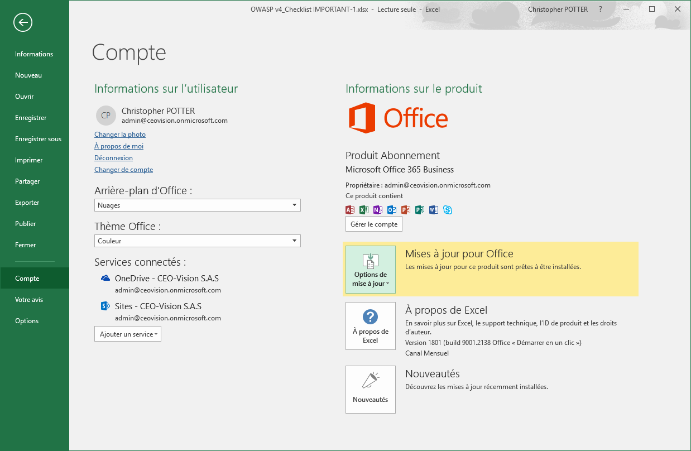
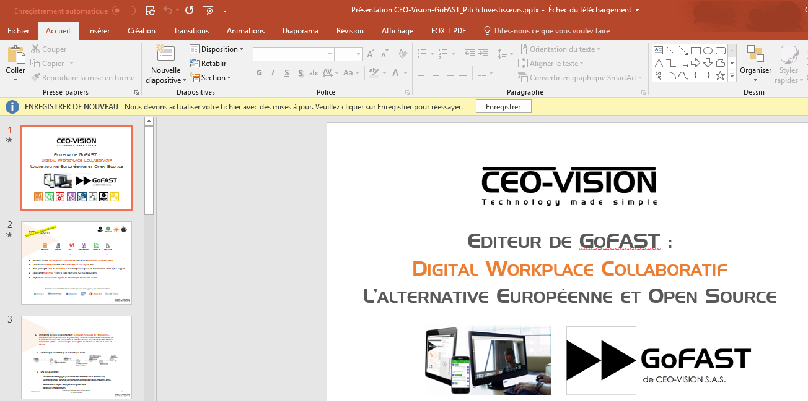
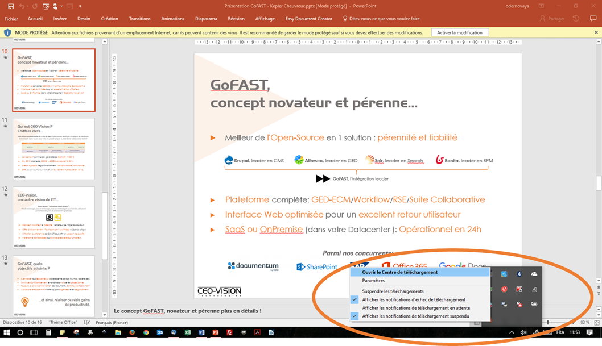
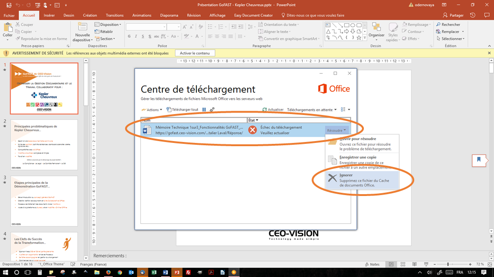
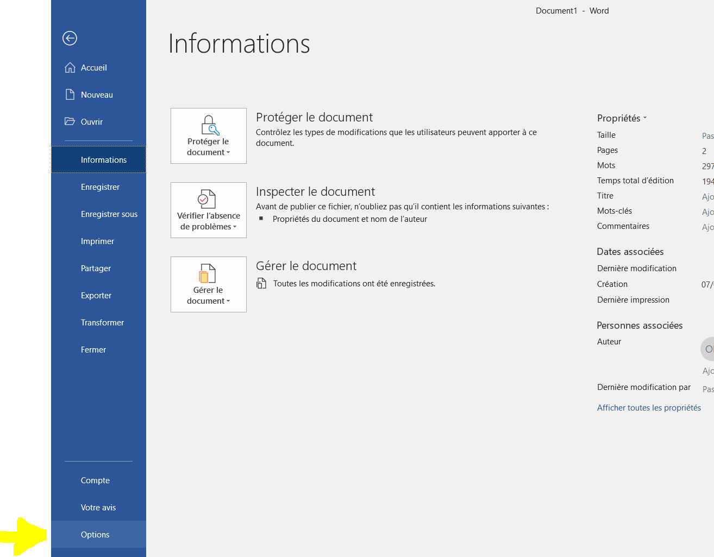
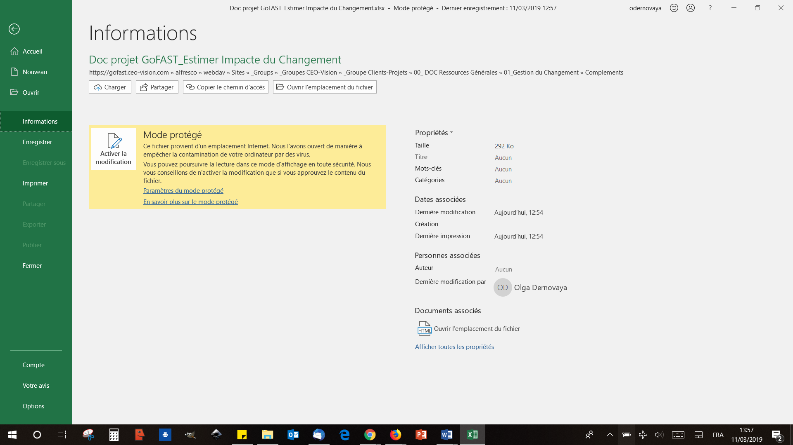
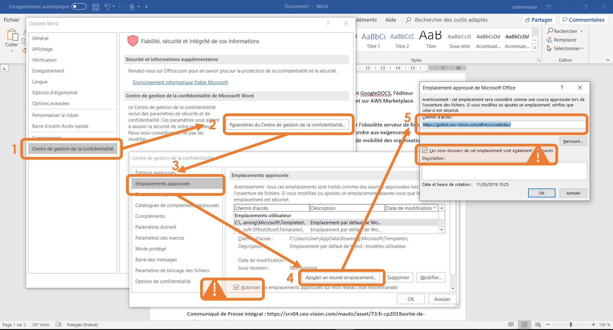
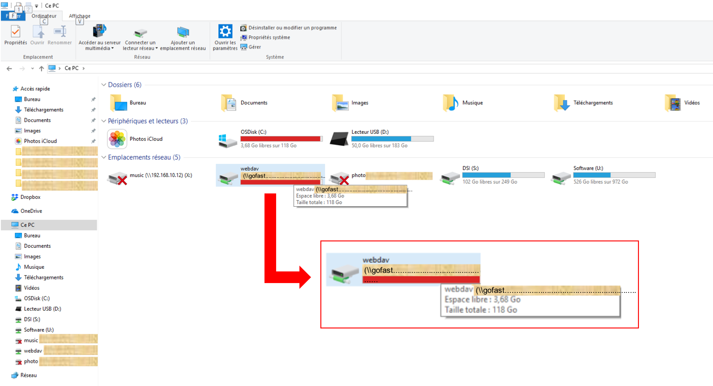

===========================
GoFAST : Problèmes connus 
===========================

 
.. CAUTION:: Si vous ne trouvez pas de réponse à vos questions ci-dessous et que vous disposez d'un abonnement GoFAST Entreprise il est important (après avoir vérifier que vous suivez les pré-requis) que vous fournissiez au support CEO-Vision le type (Windows, Mac, Linux) et la version de système d'exploitation, type et version de navigateur, le cas échéant version de la suite bureautique (MS-Office, LibreOffice,...). Vous pouvez aussi consulter les forums: https://community.ceo-vision.com

Problèmes Microsoft Office
================
Trouver sa version d'Office
------------------------
Dans le cas où le problème concerne une application de la suite MS-Office il est important de connaitre sa version et si les mises à jour sont automatiquement installées. La version peut être trouvé à "A propos de Excel", ici version 1801

Message "Impossible de se connecter à : ....  Merci de vérifier que l'adresse web que vous utilisez est correcte" 
------------------------
MS- Office ne gère pas les chemins de plus de 240 caractères. Veuillez par exemple 

- réduire le nom du fichier
- ou utiliser LibreOffice ou OnlyOffice

Message "Échec du téléchargement" : Impossible d'enregistrer sous Microsoft Office le fichier suite à une édition en ligne 
------------------------

Lors d'une édition en ligne d'un fichier Office, il peut arriver qu'au moment de l'enregistrement, un message indique que le fichier est en lecture seule et ne peut pas être enregistré. 

Ce problème est souvent la conséquence d'un dysfonctionnement du "Centre de Téléchargement Office". Ce centre est fait pour éviter de perdre son travail dans le cas d'une déconnexion avec le serveur distant (ici : GoFAST). Toutefois, il arrive que celui-ci bloque l'envoi des fichiers. Ces fichiers bloqués sont listés dans le centre de téléchargement.

Deux solutions solutions sont ici proposées pour corriger le probléme:

1/ Plutôt que "Enregistrer", allez dans "Enregistrer sous", puis cliquez sur "Récents" et enfin sélectionnez le dossier où se trouve votre fichier. Enregistrez votre version en écrasant le fichier qui est sur le serveur. 

.. figure:: media-guide/MS_1.png
   :alt:

Si Office vous indique que l'enregistrement n'a pas pu être fait, suivez la procédure ci-dessous. 

2/ Le Centre de Téléchargement Microsoft Office bloque parfois le téléchargement d'un fichier et cela bloque tous les fichiers suivants. Il faut dans ce cas, ouvrir le Centre de Téléchargement Office (icône orange dans la barre des tâches) et vider la liste (voir les copies écran) : 

1/ Si vous envoyez (téléchargez) les versions bloquées dans la liste, vous écrasez la version qui est sur GoFAST avec une version qui est peut être obsolète. Attention donc aux dates de mise-à-jour sur GoFAST (historique/versions des documents). 

.. NOTE:: Écraser un fichier avec une nouvelle version est réversible car tout est versionné automatiquement avec GoFAST et on peut récupérer en un clic les anciennes versions.

2/ Si vous supprimez/videz la liste des documents dans ce centre de téléchargement Office, il est conseillé de vérifier que vous avez bien la version finale du fichier sur votre PC. Si vous n'avez jamais enregistré votre fichier sur votre PC, il faut cliquer sur "Enregistrer une copie" sur la version la plus récente dans le centre de téléchargement Office. 

Une fois que les fichiers bloqués ont été supprimés :

1/ Votre fichier est ouvert en édition à partir de GoFAST et vous pouvez retourner sur le document dans Office (Word, Excel...) et re-cliquer sur "Enregistrer". Le fichier est alors téléchargé vers GoFAST. 

2/ Le fichier est sur votre PC (ex: Bureau) et vous pouvez le glisser-déposer du PC vers GoFAST, sur la page du document (angle en haut à droite, zone en pointillés).

"Mode protégé" de MS Office avec le message "Attention aux fichiers provenant d’un emplacement Internet"
========================================================================================================
Lorsqu’un fichier est ouvert avec l’application MS Office depuis un emplacement sur GoFAST, une configuration d’Office fait que celui-ci est parfois ouvert en "lecture seule" pour des questions de sécurité. 

Si la configuration d'Office est dans ce "Mode protégé", à l'ouverture d'un document le message suivant s'affichera : "Attention aux fichiers provenant d’un emplacement Internet, car ils peuvent contenir des virus". 

Ce comportement standard de MS Office est vu non pas comme un élément de sécurité, mais une contrainte dans l’utilisation de GoFAST. 

Pour éviter ce message et ouvrir directement en mode "édition" : 
----------------------------------------------------------------
1/ Aller dasn la configuration concernée : 

- Passer par les "Options" : Fichier / Option / Centre de gestion de la confidentialité / Paramétre du Centre de gestion de la confidentialité / Emplacements approuvés 

- OU alors, cliquer sur "Paramétres du mode protégé" dans : Fichier / Informations

2/ Une fois dans les paramétres du "Centre de gestion de la confidentialité", onglet "Emplacements approuvés" :

- Attention à bien cocher "Autoriser les emplacements approuvés sur mon réseau"

- Cliquer sur "Ajouter un nouvel emplacement" et coller l'URL de votre GoFAST avec à la fin de l'URL "/alfresco/webdav" (ex: https://gofast.ceo-vision.com/alfresco/webdav/)

- Attention à bien cocher "Les sous-dossiers de cet emplacement sont également approuvés" pour que MS Office autorise tous les emplacements accessibles à l'utilisateur sur GoFAST.

Problème Explorateur de fichiers Microsoft
===================
.. NOTE:: L'explorateur de fichiers Microsoft fonctionne plus ou moins bien suivant les versions de Windows. Si vous rencontrez des problèmes persistants nous vous conseillons d'installer un logiciel tier comme Cyberduck https://cyberduck.io . Néanmoins il n'est pas possible dans ce cas à partir des applications Windows de faire 'Ouvrir à partir' ou 'Sauvegarder sous' en spécifiant un emplacement GoFAST.

Message "Impossible d'enregistrer le fichier car sa taille dépasse la taille autorisée"
-----------------------
Le message Windows provient d'une limitation imposée par le système Windows, qui empêche le transfert de gros fichiers par Webdav.

Message "Erreur réseau" avec Explorateur Windows (0x80070035)
------------------------

.. figure:: media-guide/erreur-réseau-webdav.png
   :alt:

Dans le cas de ``"Windows ne peut accéder à ..."``, vérifier que le service ``webclient`` est démarré.

Le détail de l'erreur 0x80070035 : ``"Le chemin réseau n'a pas été trouvé"``

Message "La taille du fichier dépasse la limite autorisée ..." (0x800700DF)
-----------------------

Si le fichier copié dépasse les 50MB, Microsoft affiche un message d'erreur de type "Erreur 0x800700DF : La taille du fichier dépasse la limite autorisée et ne peut pas être enregistrée.".

Afin d'éviter ce message:

- demander une modification de la base de registre tel que proposé par Microsoft : https://support.microsoft.com/fr-fr/help/900900/folder-copy-error-message-when-downloading-a-file-that-is-larger-than
- utiliser GoFAST File Browser
- utiliser un explorateur de fichier autre que celui de Microsoft (ex. CyberDuck)

Espace disque insuffisant vers un lecteur Webdav sous Windows
-----------------------

Lorsque Windows affiche que vous manquez d'espace disque, il n'y a en réalité, aucune inquiétude à avoir.

C'est un bug Windows. En effet, comme Windows n'est pas capable de récupérer l'espace disponible par Webdav, il se base sur l'espace disque de l'ordinateur.

Donc si vous n'avez pas assez d'espace disque sur votre ordinateur, Windows va indiquer qu'il n'y a pas assez d'espace disque sur le serveur, alors que si.

Ainsi, si vous avez besoin d'ajouter des documents sur votre serveur, vous devez faire de la place sur votre disque local, il n'y a pas d'autre choix pour contourner ce bug Windows (ou utiliser un autre moyen que le lecteur Webdav Windows : par exemple, l'explorateur de fichiers intégré à la plateforme)

Concrètement, si vous souhaitez déposer un fichier de 2 Go sur GoFAST en Webdav, il faut vous assurer d'avoir au moins 2 Go de libre sur votre PC pour contourner ce bug Windows.

Impossible d'éditer en ligne des contenus PDF avec Acrobat Reader (v18)
===========================
Il faut vérifier que l'application Acrobat Reader soit déjà fermée avant le lancer l'édition en ligne. Ce problème n'existe pas avec FoxitReader

Problèmes Webconference
=============

.. CAUTION:: La webconference nécessite du matériel (PC et infrastructure réseau local et internet) récent et fonctionnel. Des configurations réseaux spécifiques sont nécessaires. Vérifier ceci avec votre administrateur.

.. NOTE:: L'utilisation de 4G permet d'avoir des débits meilleurs et moins de filtrage de ports que l'utilisation d'un simple ADSL. Nous avons constaté que l'utilisation d'une même navigateur pour tous les participants pouvait augmenter notablement la qualité, notamment avec FIREFOX v60+

"Pas audio/video pour les autres participants"
-----------------------------
Vérifier avec votre administrateur réseau que les règles de filtrage ont été correctement appliquées. Il est possible de contourner temporairement ce type de problème en utilisant une connexion 4G.

"Unfortunately, something went wrong" / "Un problème est survenu"
-------------------------------------
Vérifier que les ressources de votre PC ne sont pas saturées (Processeur, Réseau), en faisant un CTRL+ALT+SUP puis "Gestionnaire des taches" et que votre PC est suffisament puissant.

Si cela arrive au tout début de la webconference, rafraichir la page ou clic sur F5

Pas de Webconférence sous Safari
-------------------------------

Le support de Safari du protocole WebRTC utilisé par le composant de webconference Jitsi-Meet est assez récent et ne fonctionne pas totalement. Nous vous recommandons d'utiliser Chrome pour Mac éventuellement le plugin Temasys  (non supporté)

IE11: "Vous utilisez une version non compatible d’IE"
-----------------------------------------------------

Ce cas indique que IE11 est en mode de compatibilité (et fonctionne donc comme IE7/8/9/10 suivant ce qui a été choisi, voir copie d'écran).

Nb: Souvent il s'agit de décision pour garder la compatibilité avec des anciennes applications qui ne fonctionne pas avec une version récente d'IE (pourtant les seules recevant des correctifs sécurité puisque Microsoft a abandonné IE au profit de Edge)

Pour changer ce mode, cliquer sur la roue crantée, "Outils de développement" et changer "Chaîne de l'agent utilisateur" par IE11 au lieu de IE10 (ici sur la copie d'écran)

Problème de prévisualisation
================
Pas de streaming Video
----------------------

L'avantage du streaming video est de regarder directement une séquence video dans le navigateur (GoFAST) sans avoir à la télécharger. Sans plugin, ceci est dépendant du navigateur et du format video.

+------------+------------+-----------+-----------+-----------+-----------+
| Format     | MP4        | WMV       |    FLV    |    AVI    |   OGV     |
+============+============+===========+===========+===========+===========+
| Firefox    |  OUI       |  NON      |  NON      |    NON    |   NON     |
+------------+------------+-----------+-----------+-----------+-----------+
| Chrome     |   OUI      |  NON      |  NON      |    NON    |   NON     |
+------------+------------+-----------+-----------+-----------+-----------+
| IE11       |    NON     |   NON     |    NON    |    NON    |   NON     |
+------------+------------+-----------+-----------+-----------+-----------+
| Safari     |    OUI     |   NON     |    NON    |    NON    |   NON     |
+------------+------------+-----------+-----------+-----------+-----------+
| Edge     |    OUI     |   NON     |    NON    |    NON    |   NON     |
+------------+------------+-----------+-----------+-----------+-----------+

