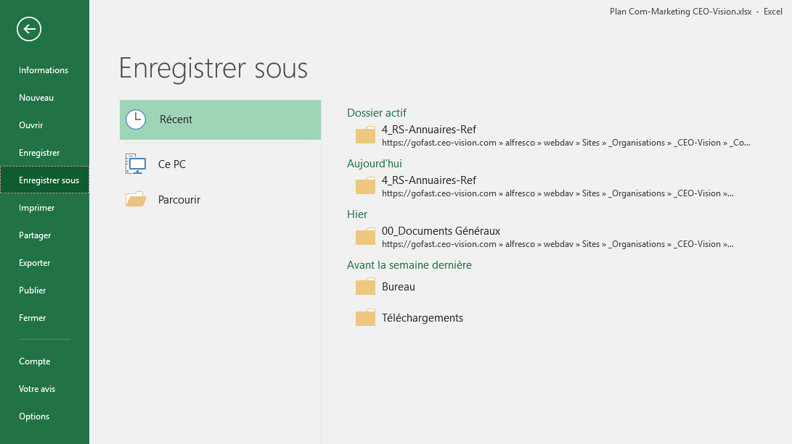

===========================
GoFAST : Problèmes connus 
===========================

 
.. CAUTION:: Si vous ne trouvez pas de réponse à vos questions ci-dessous et que vous disposez d'un abonnement GoFAST Entreprise il est important (après avoir vérifier que vous suivez les pré-requis) que vous fournissiez au support CEO-Vision le type (Windows, Mac, Linux) et la version de système d'exploitation, type et version de navigateur, le cas échéant version de la suite bureautique (MS-Office, LibreOffice,...). 

Trouver sa version d'Office
===========================
Dans le cas où le problème concerne une application de la suite MS-Office il est important de connaitre sa version et si les mises à jour sont automatiquement installées. La version peut être trouvé à "A propos de Excel", ici version 1801

.. figure:: media-guide/trouver-version-excel.png

Impossible d'éditer en ligne des contenus non Office sous Windows 10 'Fall Creators Update'
===========================
Une regression dans le composant Webdav de Microsoft de cette version de Windows 10 empeche d'éditer en ligne des contenus non Office (exemple: PDF, ...). Il faut télécharger la version la plus récente de ITHitDocumentOpener (v5)

Message "Echec du téléchargement" sous Office
===========================

Lors d'une édition en ligne d'un fichier Office, il peut arriver qu'au moment de l'enregistrement, un message indique que le fichier est en lecture seule et ne peut pas être enregistré. Deux solutions solutions sont ici proposées pour corriger le probléme:

1/ Plutôt que "Enregistrer", allez dans "Enregistrer sous", puis cliquez sur "Récents" et enfin sélectionnez le dossier où se trouve votre fichier. Enregistrez votre version en écrasant le fichier qui est sur le serveur. 

Si Office vous indique que l'enregistrement n'a pas pu être fait, suivez la procédure ci-dessous. 

2/ Le Centre de Téléchargement Microsoft Office bloque parfois le téléchargement d'un fichier et cela bloque tous les fichiers suivants. Il faut dans ce cas, ouvrir le Centre de Téléchargement Office (icône orange dans la barre des tâches) et vider la liste (voir les copies écran) : 

.. figure:: media-guide/MS_2.png
   :alt:

.. figure:: media-guide/MS_3.png
   :alt:

1/ Si vous envoyez (téléchargez) les versions bloquées dans la liste, vous écrasez la version qui est sur GoFAST avec une version qui est peut être obsolète. Attention donc aux dates de mise-à-jour sur GoFAST (historique/versions des documents). 

.. NOTE:: Écraser un fichier avec une nouvelle version est réversible car tout est versionné automatiquement avec GoFAST et on peut récupérer en un clic les anciennes versions.

2/ Si vous supprimez/videz la liste des documents dans ce centre de téléchargement Office, il est conseillé de vérifier que vous avez bien la version finale du fichier sur votre PC. Si vous n'avez jamais enregistré votre fichier sur votre PC, il faut cliquer sur "Enregistrer une copie" sur la version la plus récente dans le centre de téléchargement Office. 

Une fois que les fichiers bloqués ont été supprimés :

1/ Votre fichier est ouvert en édition à partir de GoFAST et vous pouvez retourner sur le document dans Office (Word, Excel...) et re-cliquer sur "Enregistrer". Le fichier est alors téléchargé vers GoFAST. 

2/ Le fichier est sur votre PC (ex: Bureau) et vous pouvez le glisser-déposer du PC vers GoFAST, sur la page du document (angle en haut à droite, zone en pointillés).
