GoFAST : Utilisation Avancée
============================

Introduction
------------
Ce document a pour but de donner les instructions de configuration de
logiciels tiers fonctionnant avec la plate-forme GoFAST.

Ces outils complémentaires permettent :

* Travailler en mobilité

 * Travailler sans réseau (en mode « déconnecté » type DropBox)
 * L'accès à GoFAST sur les terminaux mobiles (tablettes,…) par explorateur de fichiers
 * La visualisation et/ou l'édition en ligne de documents Office sur tablette 
 * La messagerie instantanée (« chat ») sur mobile
 * La vidéoconférence sur mobile (dans navigateur)
 
* Des outils de dématérialisation (smartphone, copieur, ...)
* Des outils de signature

Synchronisation locale (GoFAST hors-ligne)
------------------------------------------

CMISSync est un outil puissant et fiable qui permet une synchronisation
sur un PC d'un ou plusieurs espaces collaboratifs de la GoFAST.

Si vous n'avez plus de réseau (par exemple dans l'avion), les
fichiers de la GoFAST sont accessibles sur le disque dur de votre
ordinateur et vous pouvez quand même travailler avec.

Si vous les modifiez ils seront directement synchronisés une fois le
réseau disponible.

Installation CMISSync
^^^^^^^^^^^^^^^^^^^^^
L'outil est disponible pour Windows, Mac (beta) et Linux et peut être
téléchargé ici : https://bitbucket.org/aegif/cmissync/downloads

La version actuelle Windows recommandée\* est la **2.9.4.0** ou 2.11.3.0 (en cours de tests)

Voici les étapes pour configurer l'outil (**myorg** est à remplacer par
le nom de votre organisation)

L'adresse à utiliser :
`https://gofast. <https://gofast.myorg.com/alfresco/api/-default-/public/cmis/versions/1.1/atom>`__\ `**myorg** <https://gofast.myorg.com/alfresco/api/-default-/public/cmis/versions/1.1/atom>`__\ `.com/alfresco/api/-default-/public/cmis/versions/1.1/atom <https://gofast.myorg.com/alfresco/api/-default-/public/cmis/versions/1.1/atom>`__

|image3|

A cette étape il est possible de choisir l'espace collaboratif que l'on
souhaite synchroniser. Bien sûr si cet espace collaboratif contient des
sous-espaces ceux-ci sont synchronisés et donc le volume de données à la
1ère synchronisation peut être très important. Compter par exemple 30
minutes de synchronisation pour 1700 fichiers / 1.2 Go.

Si vous voulez donc tout synchroniser, choisir l'espace 'racine', ici
'Main Repository'

|image4|

Une fois configuré il est possible de faire plusieurs actions comme
ouvrir le dossier local de synchronisation, mettre en pause la
synchronisation ou changer les paramètres.

|image5|

.. IMPORTANT:: Dans les paramètres il est possible de baisser la fréquence de synchronisation, 
               option utile si CMISSync est largement diffusé dans l'organisation ceci pouvant 
               charger la plateforme GoFAST. En effet CMISSync consomme de la bande passante coté 
               serveur et du CPU

|image6|

Utilisation
^^^^^^^^^^^
Lorsque l'ordinateur est connecté au réseau, CMISSync vérifie
périodiquement si des documents ont été changés sur la plateforme
GoFAST. Si les documents ont été modifiés, ils sont copiés localement (sur le PC).

.. NOTE:: si vous faites des modifications en mode
          déconnecté (offline), lors de la reconnexion sur le serveur GoFAST,
          votre version sera téléchargée et versionnée sauf si un utilisateur a
          fait des modifications entre-temps sur la GoFAST. Dans ce cas une «
          gestion des conflits » se déclenche (voir ci dessous)

Exemple de notification (version anglaise)

1) UserA et UserB ont le fichier **courrier.doc** synchronisé sur leur
poste

2) UserA et UserB se déconnectent (offline), et chacun édite
**courrier.doc** en local

3) UserA redevient connecté (online). CmisSync télécharge la version de
UserA de **courrier.doc** sur le serveur GoFAST (qui versionne
automatiquement)

4) UserB redevient connecté. CmisSync essaie de télécharger la version
de UserB de **courrier.doc** sur le serveur GoFAST, mais constate que le
fichier a déjà été modifié par UserA

5) Sur le PC de UserB, CmisSync renomme la version de UserB **courrier.doc** 
en courrier.doc\_UserB-version et télécharge **courrier.doc** de UserA sur le PC

6) UserB a maintenant 2 versions, et doit faire une des 3 actions:

a. Garder la version de UserA : Effacer **courrier.doc\_UserB-version**

b. Garder la version de UserB : Effacer **courrier.doc** (UserA) et
retirer le suffix de **courrier.doc\_UserB-version** è dans ce cas la
version de B va être écrasée sur le serveur GoFAST après versionnage

c. Fusionner les 2 versions dans **courrier.doc**, puis effacer
**courrier.doc\_UserB-version**

.. Danger:: si vous effacez un répertoire en local dans
            l'arborescence synchronisée, les répertoires distants seront supprimés.
            Par mesure de précaution, il est préférable d'éviter de supprimer un
            répertoire en local dans l'arborescence synchronisée.
            GoFAST ne supprime pas définitivement les documents mais une
            procédure de « republication » doit être faite

Accès aux fichiers GoFAST sur Tablette et Smartphone
----------------------------------------------------
Il est possible d'accéder à la plateforme GoFAST à partir de tablettes
Android (ex. GalaxyTab), iOS (iPAD) et smartphones (Android, iOS, Blackberry).

Pour cela vous devez installer le logiciel gratuit **« Webdav Navigator Lite
»** sur iTunes, GooglePlay ou Blackberry AppWorld. A noter qu'une version payante incluant la synchronisation locale est
disponible sous le nom **« Webdav Navigator »**

|image9|

Vous aurez ensuite la possibilité d'accéder à vos fichiers GoFAST sur votre smartphone :

|image10|

Le site de l'éditeur se trouve à l'adresse suivante :
http://seanashton.net/webdav/

Éditer des fichiers Office sur Tablette
---------------------------------------
Tablette Android
^^^^^^^^^^^^^^^^
Pour ce type de tablette nous recommandons d'utiliser la suite Office
« **WPS Office** » disponible sur GooglePlay.

Vous pourrez configurer un espace de stockage directement sur la GoFAST
par « Ouvrir/Ajouter un stockage en nuage » puis choisir « Webdav » et
entrer l'adresse « https://gofast.mycomp.com/alfresco/webdav » ou vous
devez remplacer mycomp.com par le domaine de votre organisation.

|image14|

L'application va vous demander ensuite votre
identifiant et mot de passe sur la GoFAST.

Il est ensuite possible d'ouvrir un document directement sur la GoFAST.
Certaines polices de caractère n'existent pas sous Android, la mise en
page peut être différente de celle sous PC.

La sauvegarde peut de même changer légèrement la mise en page.

.. Important:: Lorsqu'on sauvegarde le document, celui-ci est
              d'abord sauvegardé en local sur la tablette. Une fois que l'application
              est fermée (X), la synchronisation est effectuée avec GoFAST

Tablette iPad
^^^^^^^^^^^^^
Si vous souhaitez uniquement consulter les documents Office, nous vous
conseillons également « **WPS Office** ».

Néanmoins il existe actuellement une limitation sur la version iPad pour
sauvegarder un document qui a été ouvert sur la GoFAST il est nécessaire
de reparcourir tout l'espace de stockage ce qui n'est pas très pratique.
L'éditeur est notifié de ce bug et un correctif devrait être produit.

Dans l'attente de ce correctif, il est possible d'utiliser la suite «
**Citrix ShareFile QuickEdit** »
|image15|

|image16|

Messagerie instantanée (« chat ») sur mobiles 
---------------------------------------------
|image6|

Avec GoFAST vous avez une messagerie instantanée privée et sécurisée, équivalent de «
WhatsApp » pour votre Organisation, fonctionnant sur le standard ouvert
XMPP.

Vous pouvez donc utiliser une application pour votre téléphone suivant
ce standard. Par exemple :

-  Android : Xabber, Kandru (gratuit), Conversations (payant), Astrachat 

-  iOS : Chatsecure, AstraChat

Pour configurer ces clients il suffit d’entrer dans la gestion des comptes :

**Identifiant** : identifiant\_gofast@gofast-comm.xxxxx.yyy

Signature électronique des PDF
------------------------------

GoFAST permet d'ouvrir un PDF avec Foxit Reader (ou Acrobat), d'y apposer une signature et de sauvegarder le PDF signé
directement sur la plateforme GoFAST.

.. NOTE:: Vous devez avoir installé "ITHitEditDocumentOpener"

Vous pouvez alors choisir dans le menu 'Editer en ligne'. Ceci ouvrira l'application installée sur votre poste (Acrobat Reader, Foxit, ...). Vous pouvez alors signer avec une signature manuscrite ou un certificat électronique puis sauvegarder directement sur GoFAST avec versionning.

|image17|

.. CAUTION:: Si vous utilisez Acrobat Reader, l'application doit être déjà fermée avant de lancer l'édition en ligne

Dématérialiser vers GoFAST
--------------------------

Il est possible de créer un dossier permettant de déposer des PDF "Images" et que ceux-ci soient 
transformés en PDF "Interrogeables" grace à un logiciel commercial de reconnaissance de caractères (OCR) installé
sur le PC, "ABBYY Hot Folder" (ABBYY FineReader). Vous pouvez ainsi numériser des factures et qu'elles soient transformées en PDF Intérrogeable 
pour qu'elles soient facilement retrouvables sur GoFAST.

|image19|

|image20|

Dématérialiser à partir d’un smartphone
---------------------------------------

Il est possible de dématérialiser par exemple des notes de frais directement à
partir d’un smartphone et de les envoyer directement dans GoFAST.

|image18|

Pour cela vous devez avoir installé :

-  CamScanner et "Webdav Navigator" ou
-  Scanbot

Nous parlerons ici de la configuration de Scanbot dont l'utilisation est simplifiée.

|image11|

|image12|

|image13|

Dématérialiser à partir d'un copieur multi-fonction
----------------------------------------------------

Pour ceci votre copieur doit posséder un connecteur webdavs. Nous contacter pour plus de précisions

Reprise de contenus vers GoFAST
-------------------------------------

Reprise des contenus GoogleDocs/Drive
^^^^^^^^^^^^^
Dans le cas de migration d'un entrepot Google vers GoFAST, suivre la procédure suivante:

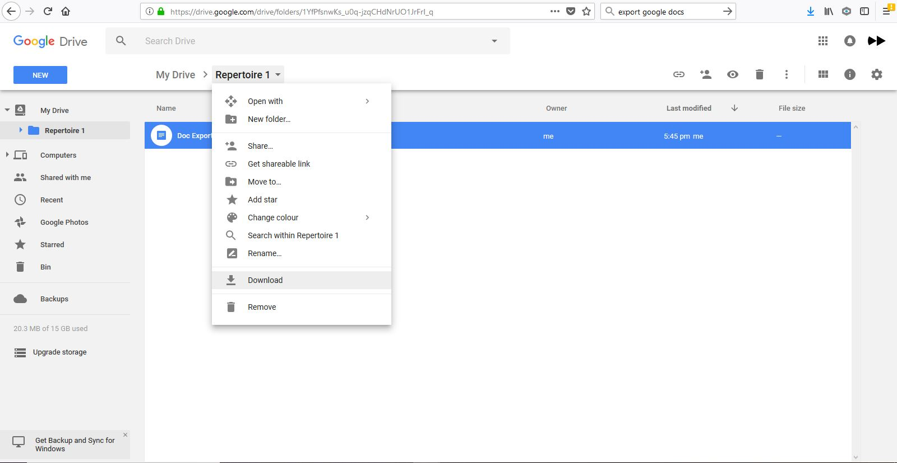

Google vous propose de télécharger une archive au format "zip" avec les contenus convertis au format MS-Office.

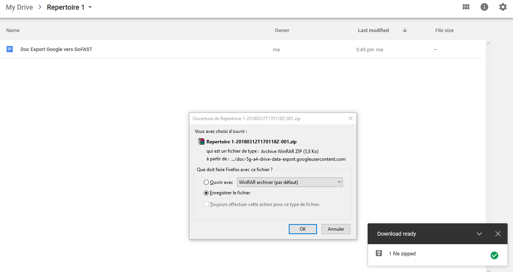

Vous pouvez à présent décompresser l'archive directement dans l'arborescence dans GoFAST

.. image:: media-guide/GoogleDrive_Download_Export_Step3.png

.. |image0| image:: img/mobilite/wps7DA7.tmp.jpg
.. |image1| image:: img/mobilite/wps7DB8.tmp.jpg
.. |image2| image:: img/mobilite/wps7DB9.tmp.jpg
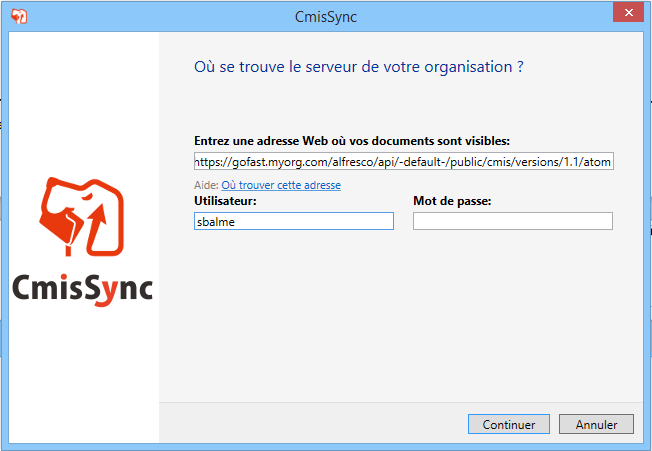
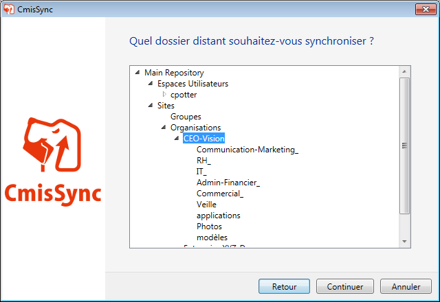
.. |image5| image:: img/clip_image011.png
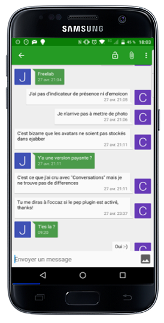
.. |image7| image:: img/mobilite/wps7DBE.tmp.jpg
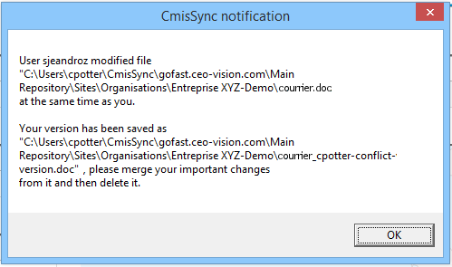
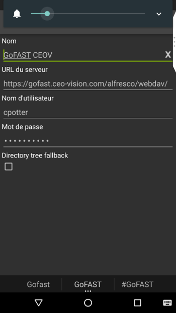
.. |image10| image:: img/webdavnav_browse-0.png
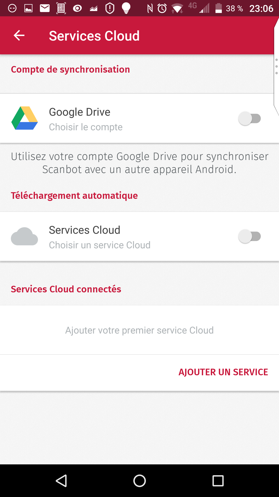
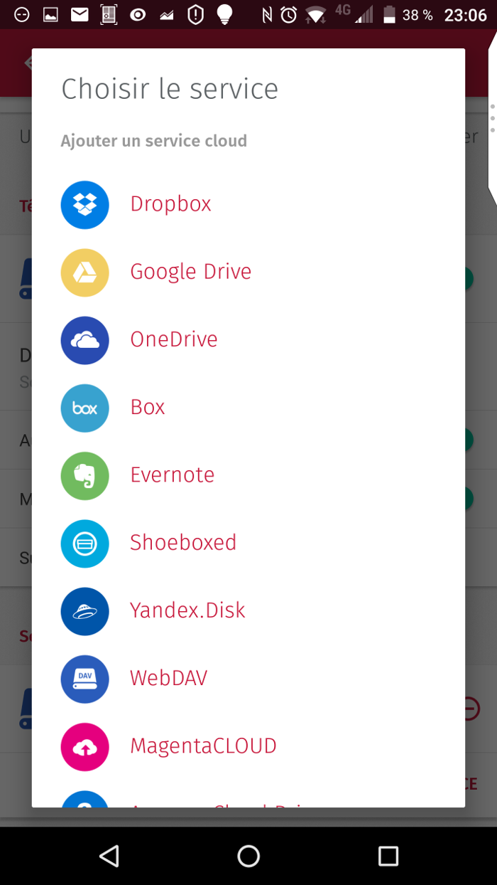
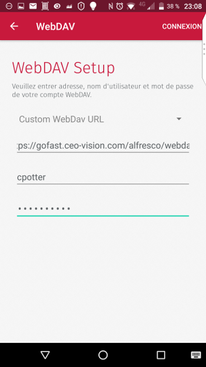
.. |image14| image:: img/clip_image028.png
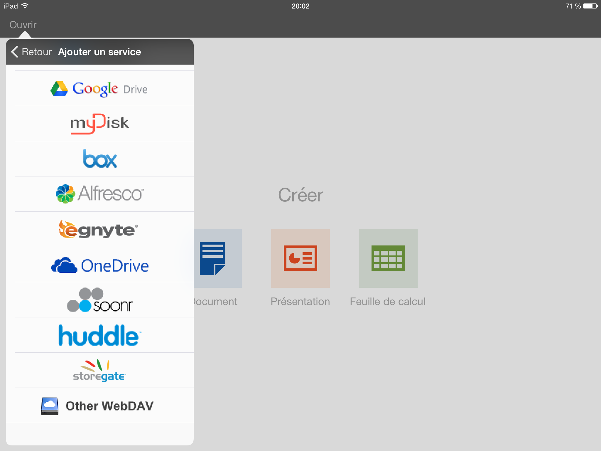
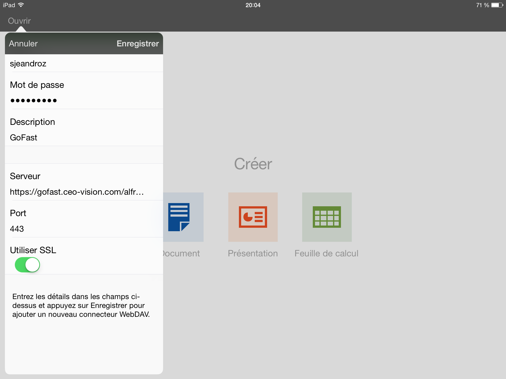
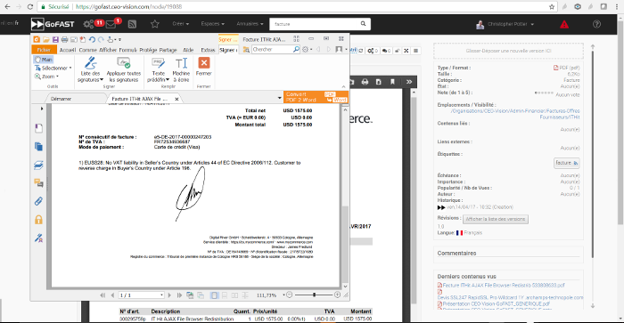
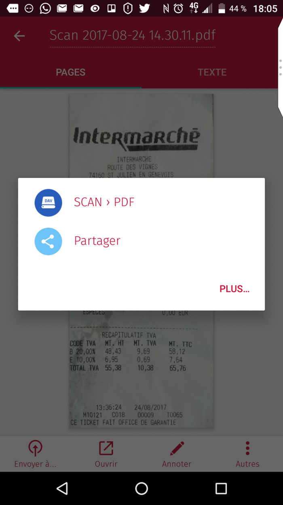
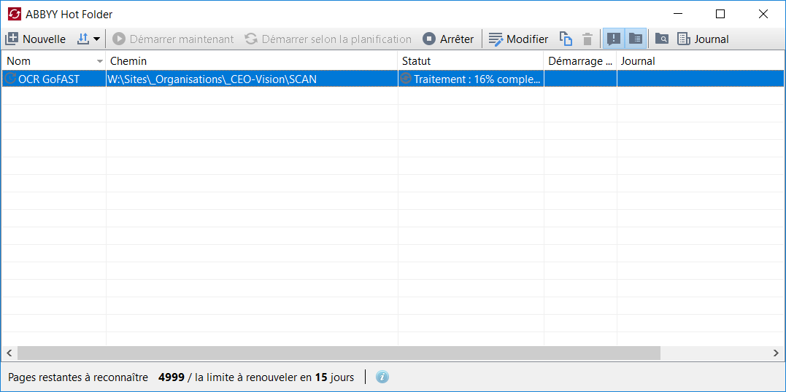
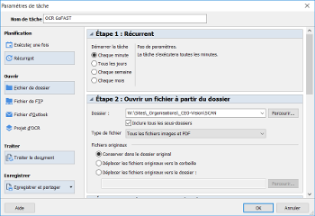
