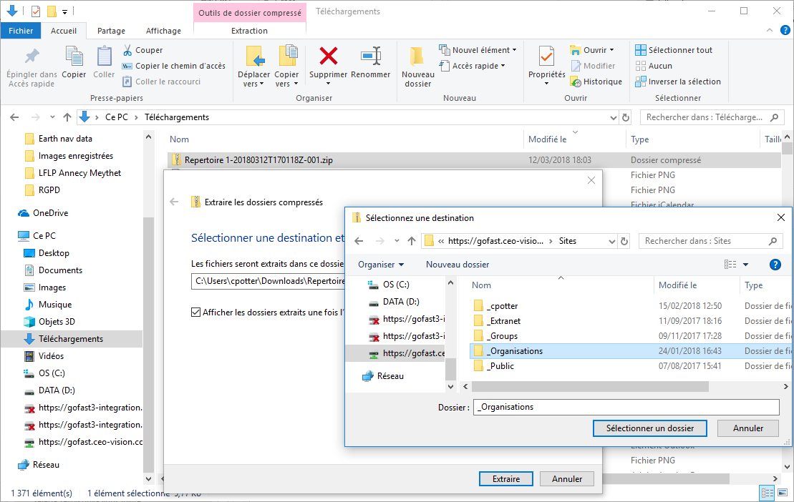
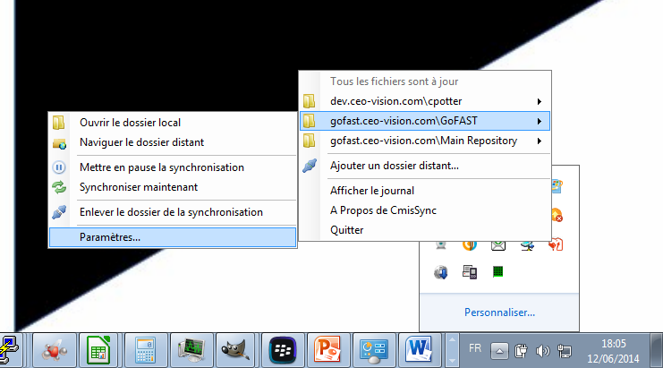
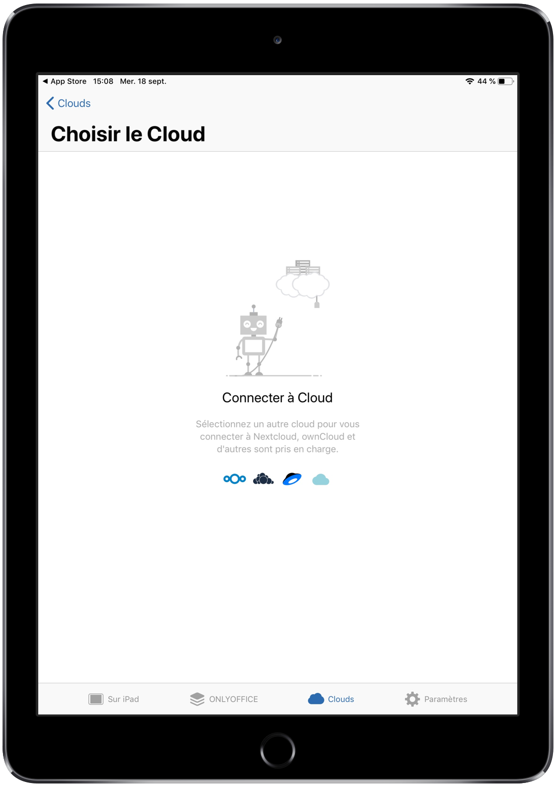
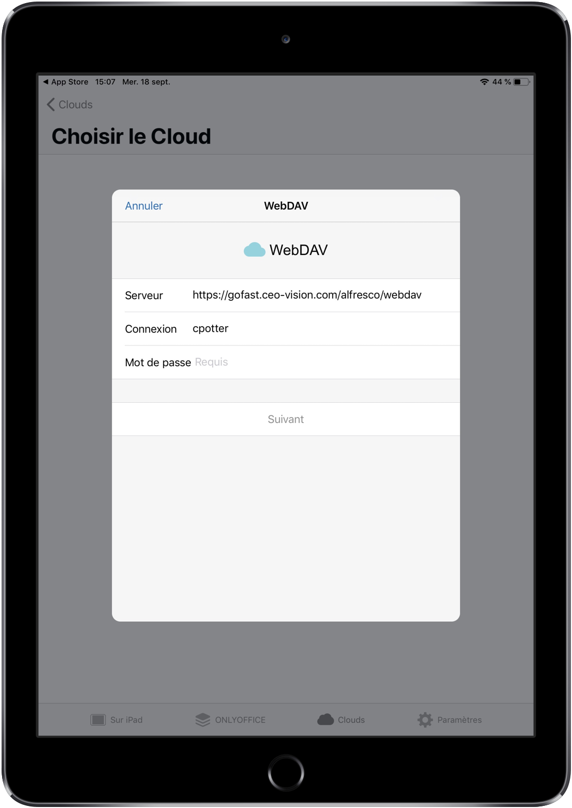

GoFAST : Utilisation Avancée
============================

Introduction
------------
Ce document a pour but de donner les instructions de configuration de
logiciels tiers fonctionnant avec la plate-forme GoFAST.

Ces outils complémentaires permettent :

* Travailler en mobilité

 * Travailler sans réseau (en mode « déconnecté » type DropBox)
 * L'accès à GoFAST sur les terminaux mobiles (tablettes,…) par explorateur de fichiers
 * La visualisation et/ou l'édition en ligne de documents Office sur tablette 
 * La messagerie instantanée (« chat ») sur mobile
 * La vidéoconférence sur mobile (dans navigateur)
 
* Des outils de dématérialisation (smartphone, copieur, ...)
* Des outils de signature

.. IMPORTANT:: CEO-Vision ne peut pas garantir le bon fonctionnement de ces logiciels tiers même si nous avons testé à un moment donné  (et pas forcément de façon exhaustive) leur fonctionnement

Synchronisation locale (GoFAST hors-ligne)
------------------------------------------

Il s'agit d'utilitaires qui font une copie locale des fichiers GoFAST (en totalité ou limité à des espaces) pour pouvoir les accéder lorsque l'on n'a plus de réseau (par exemple dans l'avion).

Certains utilitaires sont mono-directionel (si l'on modifie la copie locale, il faut penser à la sauvegarder sur GoFAST dès qu'on a du réseau, et dans certains cas fusionner ses modifications) ou bi-directionnel (si l'on modifie la copie locale elle sera directement synchronisé une fois le réseau disponible, avec éventuellement une gestion des conflits).

Historiquement nous utilisons CMISSync mais plus récemment nous sommes en phase de tests avancés de Mountainduck (payant). 

Installation CMISSync
^^^^^^^^^^^^^^^^^^^^^
L'outil est disponible pour Windows, Mac (beta) et Linux et peut être
téléchargé ici : https://bitbucket.org/aegif/cmissync/downloads

La version actuelle Windows recommandée\* est la **2.13.1.0** 

Voici les étapes pour configurer l'outil (**myorg** est à remplacer par
le nom de votre organisation)

L'adresse à utiliser :
`https://gofast. <https://gofast.myorg.com/alfresco/api/-default-/public/cmis/versions/1.1/atom>`__\ `**myorg** <https://gofast.myorg.com/alfresco/api/-default-/public/cmis/versions/1.1/atom>`__\ `.com/alfresco/api/-default-/public/cmis/versions/1.1/atom <https://gofast.myorg.com/alfresco/api/-default-/public/cmis/versions/1.1/atom>`__

|image3|

A cette étape il est possible de choisir l'espace collaboratif que l'on
souhaite synchroniser. Bien sûr si cet espace collaboratif contient des
sous-espaces ceux-ci sont synchronisés et donc le volume de données à la
1ère synchronisation peut être très important. Compter par exemple 30
minutes de synchronisation pour 1700 fichiers / 1.2 Go.

Si vous voulez donc tout synchroniser, choisir l'espace 'racine', ici
'Main Repository'

|image4|

Une fois configuré il est possible de faire plusieurs actions comme
ouvrir le dossier local de synchronisation, mettre en pause la
synchronisation ou changer les paramètres.

|image5|

.. IMPORTANT:: Dans les paramètres il est possible de baisser la fréquence de synchronisation, 
               option utile si CMISSync est largement diffusé dans l'organisation ceci pouvant 
               charger la plateforme GoFAST. En effet CMISSync consomme de la bande passante coté 
               serveur et du CPU

Utilisation
^^^^^^^^^^^
Lorsque l'ordinateur est connecté au réseau, CMISSync vérifie
périodiquement si des documents ont été changés sur la plateforme
GoFAST. Si les documents ont été modifiés, ils sont copiés localement (sur le PC).

.. NOTE:: si vous faites des modifications en mode
          déconnecté (offline), lors de la reconnexion sur le serveur GoFAST,
          votre version sera téléchargée et versionnée sauf si un utilisateur a
          fait des modifications entre-temps sur la GoFAST. Dans ce cas une «
          gestion des conflits » se déclenche (voir ci dessous)

.. Danger:: si vous effacez un répertoire en local dans
            l'arborescence synchronisée, les répertoires distants seront supprimés.
            Par mesure de précaution, il est préférable d'éviter de supprimer un
            répertoire en local dans l'arborescence synchronisée.
            GoFAST ne supprime pas définitivement les documents mais une
            procédure de « republication » doit être faite

Accès aux fichiers GoFAST sur Tablette et Smartphone
----------------------------------------------------
Il est possible d'accéder à la plateforme GoFAST à partir de tablettes
Android (ex. GalaxyTab), iOS (iPAD) et smartphones (Android, iOS, Blackberry).

Pour cela vous devez installer le logiciel gratuit **« Webdav Navigator Lite
»** sur iTunes, GooglePlay ou Blackberry AppWorld. A noter qu'une version payante incluant la synchronisation locale est
disponible sous le nom **« Webdav Navigator »**

|image9|

Vous aurez ensuite la possibilité d'accéder à vos fichiers GoFAST sur votre smartphone :

|image10|

Le site de l'éditeur se trouve à l'adresse suivante :
http://seanashton.net/webdav/

Éditer des fichiers MS-Office sur Tablette
--------------------------------------------
Nous recommandons l'application OnlyOffice sur Googleplay (au 02/10/2019 la version n'est pas totalement fonctionnelle) et Applestore.

Vous pourrez configurer un espace de stockage directement sur la GoFAST
par « Connecter les clouds » puis choisir « Autre cloud » puis « Webdav » et
entrer l'adresse « https://gofast.mycomp.com/alfresco/webdav » où vous
devez remplacer mycomp.com par le domaine de votre organisation.
|image14|
|image15|
Vous pouvez ensuite naviguer dans votre arborescence et choisir le document que vous voulez éditer :
|image16|
Puis l'éditer : 
|image21|

Messagerie instantanée (« chat / conversation ») sur mobiles 
---------------------------------------------

Avec GoFAST vous avez une messagerie instantanée privée et sécurisée, équivalent de «
WhatsApp » ou « MS-Teams » pour votre Organisation, fonctionnant avec Riot/Matrix (GoFAST > v3.8)

Vous pouvez donc utiliser l'application pour votre téléphone suivant :

-  Android : https://play.google.com/store/apps/details?id=im.vector.app&hl=fr_FR

-  iOS/iPAD : https://apps.apple.com/fr/app/riot-im/id1083446067

Pour configurer ces clients il suffit d’entrer l'adresse de votre serveur GoFAST (avec -comm) :

|image21|

Signature électronique unitaire des PDF
-----------------------------------------

GoFAST permet d'ouvrir un PDF avec Foxit Reader (ou Acrobat), d'y apposer une signature et de sauvegarder le PDF signé
directement sur la plateforme GoFAST.

.. NOTE:: Vous devez avoir installé "ITHitEditDocumentOpener"

Vous pouvez alors choisir dans le menu 'Editer en ligne'. Ceci ouvrira l'application installée sur votre poste (Acrobat Reader, Foxit, ...). Vous pouvez alors signer avec une signature manuscrite ou un certificat électronique puis sauvegarder directement sur GoFAST avec versionning.

|image17|

.. CAUTION:: Si vous utilisez Acrobat Reader, l'application doit être déjà fermée avant de lancer l'édition en ligne

Signature électronique en masse RGS 2* des PDF
------------------------------------------------

Nous testons actuellement Xolidosign (site en Anglais mais application traduite en Francais).

Dématérialiser vers GoFAST
--------------------------

Il est possible de créer un dossier permettant de déposer des PDF "Images" et que ceux-ci soient 
transformés en PDF "Interrogeables" grace à un logiciel commercial de reconnaissance de caractères (OCR) installé
sur le PC, "ABBYY Hot Folder" (ABBYY FineReader). Vous pouvez ainsi numériser des factures et qu'elles soient transformées en PDF Intérrogeable 
pour qu'elles soient facilement retrouvables sur GoFAST.

|image19|

|image20|

Dématérialiser à partir d’un smartphone
---------------------------------------

Il est possible de dématérialiser par exemple des notes de frais directement à
partir d’un smartphone et de les envoyer directement dans GoFAST.

|image18|

Pour cela vous devez avoir installé :

-  CamScanner et "Webdav Navigator" ou
-  Scanbot

Nous parlerons ici de la configuration de Scanbot dont l'utilisation est simplifiée.

|image11|

|image12|

|image13|

Dématérialiser à partir d'un copieur multi-fonction
----------------------------------------------------

Pour ceci votre copieur doit posséder un connecteur webdavs. Nous contacter pour plus de précisions

Reprise de contenus vers GoFAST
-------------------------------------

Reprise des contenus GoogleDocs/Drive
^^^^^^^^^^^^^^^^^^^^^^^^^^^^^^^^^^^^^^^
Dans le cas de migration d'un entrepot Google vers GoFAST, suivre la procédure suivante:

.. image:: media-guide/GoogleDrive_Download_Export.png

Google vous propose de télécharger une archive au format "zip" avec les contenus convertis au format MS-Office.

Vous pouvez à présent décompresser l'archive directement dans l'arborescence dans GoFAST

.. |image3| image:: img/clip_image007.png
.. |image4| image:: img/clip_image009.png

.. |image8| image:: img/clip_image017.png
.. |image9| image:: img/webdavnav_config-0.png
.. |image10| image:: img/webdavnav_browse-0.png
.. |image11| image:: img/scanbot_ajout_webdav.png
.. |image12| image:: img/scanbot_choix_webdav.png

.. |image18| image:: img/scanbot_envoi_GoFAST.png

.. |image20| image:: img/abbyy_hot_folder_config-0.png
.. |image21| image:: media-guide/riot-gofast-login-ipad-FR.png
