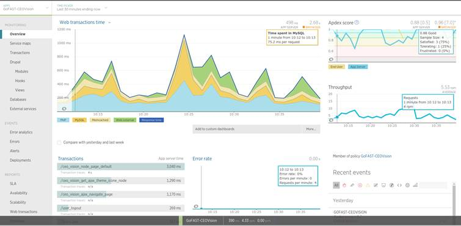

Exploitation GoFast
*******************

+--------+------------------------------------------------------+
| V1.0   | - Version initiale                                   |
+========+======================================================+
| V1.1   | - Ajout d'une partie détaillée sur les sauvegardes   |
+--------+------------------------------------------------------+
| V1.2   | - Ajout de la structure des répertoires (annexe 1)   |
+--------+------------------------------------------------------+

--------------

--------------

--------------

.. contents::

VM 1
====

Démarrage
---------

Les composants sont démarrés soit par service soit par un script ``/opt/ceo-vision/startup.sh``

Processus
---------

La plateforme GoFast est un ensemble technologique dont les principaux
composants sont les suivants.

A noter que l’ensemble de ces services sont configurés pour démarrer
automatiquement lors du boot du serveur. Pour cela la ligne ``/opt/ceo-vision/startup.sh``
a été ajoutée dans le fichier ``/etc/rc.local``::
   [root@gofast ~]# htop
    Mem[|||||||||||||||||||||||||||||||||||||||||||||||||||||||||||||||||||||||||||||11.0G/11.6G] Tasks: 94, 386 thr, 100 kthr; 1 running
    Swp[||||||||||||||||||||||||||||||||||||||                                       1.63G/3.87G] Load average: 1.29 0.94 0.55
                                                                                              Uptime: 123 days(!), 01:52:21
    PID USER      PRI  NI  VIRT   RES   SHR S CPU% MEM%   TIME+  Command
      1 root       20   0  189M  3016  1476 S  0.0  0.0  1h26:52 /usr/lib/systemd/systemd --switched-root --system --deserialize 21
  31997 root       20   0 6642M  947M    76 S  0.7  8.0  1h56:44 ├+ java -server -Xms1G -Xmx1G -XX:NewRatio=3 -XX:SurvivorRatio=4 -XX:TargetSurvivorRatio=90 -XX:MaxTenuringThreshold=8 -XX:+Us
  30805 root       20   0  183M     0     0 S  0.0  0.0  0:01.07 ├+ /usr/bin/newrelic-daemon --agent --pidfile /var/run/newrelic-daemon.pid --logfile /var/log/newrelic/newrelic-daemon.log --p
  30797 root       20   0  488M 13692  8040 S  0.0  0.1  1:45.00 ├+ php-fpm: master process (/etc/php-fpm.conf)
  29617 davfs2     20   0  184M  6700   460 S  0.0  0.1 11:08.05 ├─ mount.davfs -o rw uid=admin localhost:8080/alfresco/webdav /mnt/alfresco_webdav/
  27323 root       20   0  288M   216   204 S  0.0  0.0  0:03.93 ├+ /opt/libreoffice5.3/program/oosplash --accept=socket,host=127.0.0.1,port=8100;urp;StarOffice.ServiceManager -env:UserInstal
  20621 ldap       20   0 1648M  114M  9912 S 13.3  1.0  7h33:29 ├+ /usr/sbin/slapd -u ldap -h ldapi:/// ldaps:/// ldap:///
  16905 root       20   0  249M  2524   672 S  0.0  0.0  1:57.46 ├+ /usr/sbin/httpd -DFOREGROUND
  16859 mysql      20   0 3820M 1514M  1392 S 15.3 12.8 12h00:35 ├+ /usr/sbin/mysqld --daemonize --pid-file=/var/run/mysqld/mysqld.pid
  15833 tomcat     20   0 9694M 3693M  1708 S 16.0 31.2  3h16:35 ├+ /usr/lib/jvm/jre/bin/java -server -Xss1024K -Xms2G -Xmx4G -XX:MaxPermSize=512M -XX:NewSize=1G -XX:-DisableExplicitGC -XX:+U
  14933 tomcat     20   0 7889M 1082M  1868 S  0.7  9.1  1h06:36 ├+ /usr/lib/jvm/jre/bin/java -server -Xss1024K -Xms1G -Xmx3G -XX:MaxPermSize=512M -XX:NewSize=512m -XX:+UseConcMarkSweepGC -XX
  14567 root       20   0  123M   420   312 S  0.0  0.0  2:23.65 ├+ /usr/sbin/crond -n
  10356 chrony     20   0   98M   692   484 S  0.0  0.0  0:22.64 ├─ /usr/sbin/chronyd
   6389 newrelic   20   0 16896     4     0 S  0.0  0.0  0:00.00 ├+ /usr/sbin/nrsysmond -c /etc/newrelic/nrsysmond.cfg -p /var/run/newrelic/nrsysmond.pid
   2633 root       20   0 89892   168    84 S  0.0  0.0  9:33.71 ├+ /usr/libexec/postfix/master -w
   2521 memcached  20   0  626M  256M   108 S  0.0  2.2  9h21:36 ├+ /usr/bin/memcached -u memcached -p 11211 -m 512 -c 1024
   1027 root       20   0  540M   536   156 S  0.0  0.0 16:20.33 ├+ /usr/bin/python -Es /usr/sbin/tuned -l -P
   1025 root       20   0  103M   340   224 S  0.0  0.0 10:52.29 ├+ /usr/sbin/sshd -D
   1012 root       20   0  644M  7612  7016 S  0.0  0.1  3h18:30 ├+ /usr/sbin/rsyslogd -n
    741 root       20   0  427M  1380   636 S  0.0  0.0  8:06.11 ├+ /usr/sbin/NetworkManager --no-daemon
    726 root       20   0  323M  1732   612 S  0.0  0.0  7:58.52 ├+ /usr/bin/python -Es /usr/sbin/firewalld --nofork --nopid
    712 root       20   0  107M     8     4 S  0.0  0.0  0:00.01 ├─ /sbin/agetty --noclear tty1 linux
    703 root       20   0 24324   972   772 S  0.0  0.0 28:54.14 ├─ /usr/lib/systemd/systemd-logind
    696 dbus       20   0 98480   836   384 S  0.0  0.0 49:38.94 ├+ /bin/dbus-daemon --system --address=systemd: --nofork --nopidfile --systemd-activation
    695 root       20   0  396M  2520  1144 S  0.0  0.0  2h13:27 ├+ /usr/bin/vmtoolsd
    693 root       20   0 19320   396   260 S  0.0  0.0 29:34.11 ├─ /usr/sbin/irqbalance --foreground
    685 polkitd    20   0  515M  1224   536 S  0.0  0.0 12:32.97 ├+ /usr/lib/polkit-1/polkitd --no-debug
    668 root       16  -4 55416   268   160 S  0.0  0.0  9:22.34 ├+ /sbin/auditd -n
    539 root       20   0 47372   368   268 S  0.0  0.0  0:02.01 ├─ /usr/lib/systemd/systemd-udevd
    533 root       20   0  198M     0     0 S  0.0  0.0  0:00.03 ├─ /usr/sbin/lvmetad -f
    511 root       20   0 46612  9692  9288 S  1.3  0.1  6h20:14 └─ /usr/lib/systemd/systemd-journald
      2 root       20   0     0     0     0 S  0.0  0.0  0:12.51 kthreadd
  30429 root       20   0     0     0     0 D  0.7  0.0  0:01.43 ├─ kworker/u12:0
  29534 root        0 -20     0     0     0 S  0.0  0.0  0:00.00 ├─ kworker/0:1H
  29141 root       20   0     0     0     0 S  0.0  0.0  0:00.00 ├─ kworker/2:1
  29139 root       20   0     0     0     0 S  0.0  0.0  0:00.00 ├─ kworker/u12:2
  28808 root       20   0     0     0     0 S  0.0  0.0  0:00.00 ├─ kworker/1:2
  28806 root       20   0     0     0     0 S  0.0  0.0  0:00.00 ├─ kworker/0:2
  28263 root       20   0     0     0     0 S  0.0  0.0  0:00.00 ├─ kworker/3:0
  27999 root       20   0     0     0     0 S  0.0  0.0  0:00.16 ├─ kworker/4:0
  27003 root       20   0     0     0     0 S  0.0  0.0  0:00.00 ├─ kworker/3:1

Les processus sont lancés pour certains en service et d'autres dans le script ``/opt/ceo-vision/startup.sh``

Serveur Web Apache
^^^^^^^^^^^^^^^^^^

Afin que la partie «Portail » de GoFast, qui est basésur une technologie
PHP (``php-fpm``) et notamment le CMS Drupal, puisse fonctionner, il fautqu’elle soit
hébergée sur un serveur Apache

En production, de nombreux processus sont créés afin derépondre à
chacune des requêtes http effectuées par les clients. Ces processussont
nommés ``/usr/sbin/httpd``::

   [root@gofast3-integration ~]# ps aux | grep httpd
   apache    5682  0.1  0.2 581604 16624 ?        S    14:29   0:03 /usr/sbin/httpd -DFOREGROUND
   apache    6419  0.1  0.2 581656 16600 ?        S    14:31   0:03 /usr/sbin/httpd -DFOREGROUND
   root      6821  0.0  0.0 112648   972 pts/1    S+   15:15   0:00 grep --color=auto httpd
   apache    7245  0.1  0.2 581712 16728 ?        S    14:32   0:02 /usr/sbin/httpd -DFOREGROUND
   apache   21368  0.1  0.2 581712 16748 ?        S    14:52   0:01 /usr/sbin/httpd -DFOREGROUND
   apache   21409  0.0  0.2 581740 16808 ?        S    14:07   0:03 /usr/sbin/httpd -DFOREGROUND
   apache   23582  0.1  0.2 581720 16760 ?        S    14:55   0:01 /usr/sbin/httpd -DFOREGROUND
   apache   23646  0.1  0.2 581604 16632 ?        S    14:10   0:04 /usr/sbin/httpd -DFOREGROUND
   apache   25286  0.0  0.2 581776 16636 ?        S    14:12   0:03 /usr/sbin/httpd -DFOREGROUND
   apache   26580  0.0  0.2 581724 16672 ?        S    14:14   0:03 /usr/sbin/httpd -DFOREGROUND
   apache   29684  0.1  0.2 581756 16820 ?        S    14:18   0:03 /usr/sbin/httpd -DFOREGROUND
   root     32021  0.0  0.2 580656 23384 ?        Ss   Aug16   1:05 /usr/sbin/httpd -DFOREGROUND
   apache   32190  0.1  0.2 581756 16628 ?        S    14:21   0:03 /usr/sbin/httpd -DFOREGROUND

Serveurs Web Tomcat
^^^^^^^^^^^^^^^^^^

La partie «Entrepôt documentaire » est assurée par lelogiciel Alfresco,
qui est une application développée en Java, ce qui nécessiteun serveur
web Tomcat pour fonctionner.

De même la partie «Gestion de processus » est assuréepar le logiciel
Bonitasoft, qui est une application développée en Java, ce quinécessite
également un serveur web Tomcat pour fonctionner::

   [root@gofast3-integration ~]# ps aux | grep tomcat
   root      7464  0.0  0.0 112648   976 pts/1    S+   15:17   0:00 grep --color=auto tomcat
   tomcat   23103 14.5 30.2 7071740 2410928 ?     Ssl  Aug22 211:52 /usr/lib/jvm/jre/bin/java -javaagent:/usr/share/tomcat/newrelic/newrelic.jar -server -Xss1024K -Xms1G -Xmx3G -XX:MaxPermSize=512M -XX:NewSize=1G -XX:-DisableExplicitGC -XX:+UseConcMarkSweepGC -XX:+CMSIncrementalMode -XX:CMSInitiatingOccupancyFraction=80 -XX:ParallelGCThreads=4 -XX:+UseParNewGC -Djavax.net.ssl.keyStore=/etc/pki/keystore -Djavax.net.ssl.keyStorePassword=a4030ma -classpath /usr/share/tomcat/bin/bootstrap.jar:/usr/share/tomcat/bin/tomcat-juli.jar:/usr/share/java/commons-daemon.jar -Dcatalina.base=/var/lib/tomcats/alfresco -Dcatalina.home=/usr/share/tomcat -Djava.endorsed.dirs= -Djava.io.tmpdir=/var/cache/tomcat/temp -Djava.util.logging.config.file=/var/lib/tomcats/alfresco/conf/logging.properties -Djava.util.logging.manager=org.apache.juli.ClassLoaderLogManager org.apache.catalina.startup.Bootstrap start
   tomcat   23282  0.0  0.0 229540   864 ?        Sl   Aug22   0:00 /opt/libreoffice5.3/program/oosplash -accept=socket,host=127.0.0.1,port=8100;urp;StarOffice.ServiceManager -env:UserInstallation=file:///var/alfresco/alf_data/oouser -headless -nocrashreport -nofirststartwizard -nologo -norestore
   tomcat   23297 99.9  0.3 709592 26972 ?        Sl   Aug22 1458:13 /opt/libreoffice5.3/program/soffice.bin -env:UserInstallation=file:///var/alfresco/alf_data/oouser -accept=socket,host=127.0.0.1,port=8100;urp;StarOffice.ServiceManager -headless -nocrashreport -nofirststartwizard -nologo -norestore
   tomcat   23299  0.0  0.0      0     0 ?        Z    Aug22   0:00 [soffice.bin] <defunct>
   root     29294  0.4  6.2 4298500 495868 ?      Sl   Aug16  40:58 java -server -Xms512m -Xmx512m -XX:NewRatio=3 -XX:SurvivorRatio=4 -XX:TargetSurvivorRatio=90 -XX:MaxTenuringThreshold=8 -XX:+UseConcMarkSweepGC -XX:+UseParNewGC -XX:ConcGCThreads=4 -XX:ParallelGCThreads=4 -XX:+CMSScavengeBeforeRemark -XX:PretenureSizeThreshold=64m -XX:+UseCMSInitiatingOccupancyOnly -XX:CMSInitiatingOccupancyFraction=50 -XX:CMSMaxAbortablePrecleanTime=6000 -XX:+CMSParallelRemarkEnabled -XX:+ParallelRefProcEnabled -verbose:gc -XX:+PrintHeapAtGC -XX:+PrintGCDetails -XX:+PrintGCDateStamps -XX:+PrintGCTimeStamps -XX:+PrintTenuringDistribution -XX:+PrintGCApplicationStoppedTime -Xloggc:/opt/solr/server/logs/solr_gc.log -Djetty.port=8983 -DSTOP.PORT=7983 -DSTOP.KEY=solrrocks -Duser.timezone=UTC -Djetty.home=/opt/solr/server -Dsolr.solr.home=/opt/solr/server/solr -Dsolr.install.dir=/opt/solr -Xss256k -javaagent:/usr/share/tomcat/newrelic/newrelic.jar -jar start.jar -XX:OnOutOfMemoryError=/opt/solr/bin/oom_solr.sh 8983 /opt/solr/server/logs --module=http
   tomcat   31681  1.1 15.2 6935996 1216136 ?     Ssl  Aug16 114:10 /usr/lib/jvm/jre/bin/java -javaagent:/usr/share/tomcat/newrelic/newrelic.jar -server -Xss1024K -Xms1G -Xmx3G -XX:MaxPermSize=512M -XX:NewSize=512m -XX:+UseConcMarkSweepGC -XX:+CMSIncrementalMode -XX:CMSInitiatingOccupancyFraction=80 -Dbonita.home=/var/bonita -Dsysprop.bonita.db.vendor=mysql -Dbtm.root=/var/lib/tomcats/bonita/ -Dbitronix.tm.configuration=/var/lib/tomcats/bonita/conf/bitronix-config.properties -classpath /usr/share/tomcat/bin/bootstrap.jar:/usr/share/tomcat/bin/tomcat-juli.jar:/usr/share/java/commons-daemon.jar -Dcatalina.base=/var/lib/tomcats/bonita -Dcatalina.home=/usr/share/tomcat -Djava.endorsed.dirs= -Djava.io.tmpdir=/var/cache/tomcat/temp -Djava.util.logging.config.file=/var/lib/tomcats/bonita/conf/logging.properties -Djava.util.logging.manager=org.apache.juli.ClassLoaderLogManager org.apache.catalina.startup.Bootstrap start

Base de données MySQL
^^^^^^^^^^^^^^^^^^

Les deux composants précédents (Drupal et Alfresco) nécessitent chacun de
posséder une base de données permettant leur bon fonctionnement.

Ces bases de données sont hébergées par MySQL.

La base de données utilisée par Drupal possède le nom ``drupal``

La base de données utilisée par Alfresco se nomme ``alfresco``

En production, cela se traduit par deux processus:

1)

``/bin/sh/usr/bin/mysqld\_safe –datadir=/var/lib/mysql --socket=/var/lib/mysql/mysql.sock``
``--pid-file=/var/run/mysqld/mysqld.pid --basedir=/usr --user=mysql``

2)

``/usr/libexec/mysqld--basedir=/usr --datadir=/var/lib/mysql--plugin-``
``dir=/usr/lib64/mysql/plugin--user=mysql --log-error=/var/log/mysqld.log``
``pid-file=/var/run/mysqld/mysqld.pid --socket=/var/lib/mysql/mysql.sock``::

   [root@gofast3-integration ~]# ps aux | grep mysqld
   root     11845  0.0  0.0 112648   976 pts/1    S+   16:04   0:00 grep --color=auto mysqld
   mysql    31915  4.5 12.6 2831048 1012492 ?     Sl   Aug16 447:22 /usr/sbin/mysqld --daemonize --pid-file=/var/run/mysqld/mysqld.pid

Moteur de recherche Solr
^^^^^^^^^^^^^^^^^^^^^^^^

L’indexation et la recherche au sein de la plate-forme GoFAST sont
assurées par Apache Solr.

En production, cela se traduit par un processus qui senomme ``java –jar
start.jar``::

   [root@gofast3-integration ~]# ps aux | grep start.jar
   root     29294  0.4  6.1 4298500 493744 ?      Sl   Aug16  41:03 java -server -Xms512m -Xmx512m -XX:NewRatio=3 -XX:SurvivorRatio=4 -XX:TargetSurvivorRatio=90 -XX:MaxTenuringThreshold=8 -XX:+UseConcMarkSweepGC -XX:+UseParNewGC -XX:ConcGCThreads=4 -XX:ParallelGCThreads=4 -XX:+CMSScavengeBeforeRemark -XX:PretenureSizeThreshold=64m -XX:+UseCMSInitiatingOccupancyOnly -XX:CMSInitiatingOccupancyFraction=50 -XX:CMSMaxAbortablePrecleanTime=6000 -XX:+CMSParallelRemarkEnabled -XX:+ParallelRefProcEnabled -verbose:gc -XX:+PrintHeapAtGC -XX:+PrintGCDetails -XX:+PrintGCDateStamps -XX:+PrintGCTimeStamps -XX:+PrintTenuringDistribution -XX:+PrintGCApplicationStoppedTime -Xloggc:/opt/solr/server/logs/solr_gc.log -Djetty.port=8983 -DSTOP.PORT=7983 -DSTOP.KEY=solrrocks -Duser.timezone=UTC -Djetty.home=/opt/solr/server -Dsolr.solr.home=/opt/solr/server/solr -Dsolr.install.dir=/opt/solr -Xss256k -javaagent:/usr/share/tomcat/newrelic/newrelic.jar -jar start.jar -XX:OnOutOfMemoryError=/opt/solr/bin/oom_solr.sh 8983 /opt/solr/server/logs --module=http
   root     30623  0.0  0.0 112648   988 pts/1    S+   15:47   0:00 grep --color=auto start.jar

Serveur LDAP
^^^^^^^^^^^^^^^^^^

Les différents Utilisateurs et Espaces collaboratifs de la plate-forme
GoFAST sont stockés au sein d’un annuaire LDAP, utilisé par
les différents composants de la plate-forme.

En production, cela se traduit par un processus ``/usr/sbin/slapd``::

   [root@gofast3-integration ~]# ps aux | grep sldap
   root     32221  0.0  0.0 112648   976 pts/1    S+   15:49   0:00 grep --color=auto sldap

Composant de prévisualisation de documents
^^^^^^^^^^^^^^^^^^^^^^^^^^^^^^^^^^^^^^^^^^

Tous les documents (compatibles) stockés dans la plate-forme GoFAST
possèdent une prévisualisation au format PDF.

Cette transformation est assurée par le logiciel LibreOffice.

En production cela setraduit par un processus nommé
``/opt/libreoffice4.1/program/soffice.bin``::

   [root@gofast3-integration ~]# ps aux | grep libreoffice
   root     13752  0.0  0.0 112648   976 pts/1    S+   16:07   0:00 grep --color=auto libreoffice
   root     23081  0.0  0.0 295076   856 ?        Sl   Aug22   0:00 /opt/libreoffice5.3/program/oosplash --accept=socket,host=127.0.0.1,port=8100;urp;StarOffice.ServiceManager -env:UserInstallation=file:///var/alfresco/alf_data/oouser --headless --nocrashreport --nofirststartwizard --nologo --norestore
   root     23102  2.7  2.0 1598084 162032 ?      Sl   Aug22  42:07 /opt/libreoffice5.3/program/soffice.bin -env:UserInstallation=file:///var/alfresco/alf_data/oouser --accept=socket,host=127.0.0.1,port=8100;urp;StarOffice.ServiceManager --headless --nocrashreport --nofirststartwizard --nologo --norestore
   tomcat   23282  0.0  0.0 229540   864 ?        Sl   Aug22   0:00 /opt/libreoffice5.3/program/oosplash -accept=socket,host=127.0.0.1,port=8100;urp;StarOffice.ServiceManager -env:UserInstallation=file:///var/alfresco/alf_data/oouser -headless -nocrashreport -nofirststartwizard -nologo -norestore
   tomcat   23297 99.9  0.3 709592 26972 ?        Sl   Aug22 1508:19 /opt/libreoffice5.3/program/soffice.bin -env:UserInstallation=file:///var/alfresco/alf_data/oouser -accept=socket,host=127.0.0.1,port=8100;urp;StarOffice.ServiceManager -headless -nocrashreport -nofirststartwizard -nologo -norestore

VM 2
====

Processus
---------

Supervision
===========

Monitoring du serveur
--------------------

Chez tous nos clients, nous installons automatiquement un composant
chargé de monitorer les informations principales du serveur.

Ce composant est Newrelic (https://newrelic.com).

Les principales informations supervisées sont les suivantes :

-  Charge CPU

-  Disk IO

-  Utilisation RAM

-  Place disque disponible

-  Utilisation Réseau

En production, cela setraduit par deux processus ``/usr/sbin/nrsysmond`` 
qui effectuent des requêtes vers internet toutes les 3 minutes::

   [root@gofast3-integration ~]# ps aux | grep newrelic
   root      1296  0.0  0.0 190024  1916 ?        Ssl  Aug16   0:01 /usr/bin/newrelic-daemon --agent --pidfile /var/run/newrelic-daemon.pid --logfile /var/log/newrelic/newrelic-daemon.log --port /tmp/.newrelic.sock --tls --define utilization.detect_aws=true --define utilization.detect_docker=true
   root      1303  0.0  0.0 504360  2788 ?        Sl   Aug16   0:34 /usr/bin/newrelic-daemon --agent --pidfile /var/run/newrelic-daemon.pid --logfile /var/log/newrelic/newrelic-daemon.log --port /tmp/.newrelic.sock --tls --define utilization.detect_aws=true --define utilization.detect_docker=true -no-pidfile
   root     18457  0.0  0.0 112648   976 pts/1    R+   16:14   0:00 grep --color=auto newrelic
   tomcat   23103 15.0 30.2 7071740 2410948 ?     Ssl  Aug22 228:27 /usr/lib/jvm/jre/bin/java -javaagent:/usr/share/tomcat/newrelic/newrelic.jar -server -Xss1024K -Xms1G -Xmx3G -XX:MaxPermSize=512M -XX:NewSize=1G -XX:-DisableExplicitGC -XX:+UseConcMarkSweepGC -XX:+CMSIncrementalMode -XX:CMSInitiatingOccupancyFraction=80 -XX:ParallelGCThreads=4 -XX:+UseParNewGC -Djavax.net.ssl.keyStore=/etc/pki/keystore -Djavax.net.ssl.keyStorePassword=a4030ma -classpath /usr/share/tomcat/bin/bootstrap.jar:/usr/share/tomcat/bin/tomcat-juli.jar:/usr/share/java/commons-daemon.jar -Dcatalina.base=/var/lib/tomcats/alfresco -Dcatalina.home=/usr/share/tomcat -Djava.endorsed.dirs= -Djava.io.tmpdir=/var/cache/tomcat/temp -Djava.util.logging.config.file=/var/lib/tomcats/alfresco/conf/logging.properties -Djava.util.logging.manager=org.apache.juli.ClassLoaderLogManager org.apache.catalina.startup.Bootstrap start
   root     29294  0.4  6.1 4298500 493744 ?      Sl   Aug16  41:08 java -server -Xms512m -Xmx512m -XX:NewRatio=3 -XX:SurvivorRatio=4 -XX:TargetSurvivorRatio=90 -XX:MaxTenuringThreshold=8 -XX:+UseConcMarkSweepGC -XX:+UseParNewGC -XX:ConcGCThreads=4 -XX:ParallelGCThreads=4 -XX:+CMSScavengeBeforeRemark -XX:PretenureSizeThreshold=64m -XX:+UseCMSInitiatingOccupancyOnly -XX:CMSInitiatingOccupancyFraction=50 -XX:CMSMaxAbortablePrecleanTime=6000 -XX:+CMSParallelRemarkEnabled -XX:+ParallelRefProcEnabled -verbose:gc -XX:+PrintHeapAtGC -XX:+PrintGCDetails -XX:+PrintGCDateStamps -XX:+PrintGCTimeStamps -XX:+PrintTenuringDistribution -XX:+PrintGCApplicationStoppedTime -Xloggc:/opt/solr/server/logs/solr_gc.log -Djetty.port=8983 -DSTOP.PORT=7983 -DSTOP.KEY=solrrocks -Duser.timezone=UTC -Djetty.home=/opt/solr/server -Dsolr.solr.home=/opt/solr/server/solr -Dsolr.install.dir=/opt/solr -Xss256k -javaagent:/usr/share/tomcat/newrelic/newrelic.jar -jar start.jar -XX:OnOutOfMemoryError=/opt/solr/bin/oom_solr.sh 8983 /opt/solr/server/logs --module=http
   tomcat   31681  1.1 15.2 6935996 1217192 ?     Ssl  Aug16 114:46 /usr/lib/jvm/jre/bin/java -javaagent:/usr/share/tomcat/newrelic/newrelic.jar -server -Xss1024K -Xms1G -Xmx3G -XX:MaxPermSize=512M -XX:NewSize=512m -XX:+UseConcMarkSweepGC -XX:+CMSIncrementalMode -XX:CMSInitiatingOccupancyFraction=80 -Dbonita.home=/var/bonita -Dsysprop.bonita.db.vendor=mysql -Dbtm.root=/var/lib/tomcats/bonita/ -Dbitronix.tm.configuration=/var/lib/tomcats/bonita/conf/bitronix-config.properties -classpath /usr/share/tomcat/bin/bootstrap.jar:/usr/share/tomcat/bin/tomcat-juli.jar:/usr/share/java/commons-daemon.jar -Dcatalina.base=/var/lib/tomcats/bonita -Dcatalina.home=/usr/share/tomcat -Djava.endorsed.dirs= -Djava.io.tmpdir=/var/cache/tomcat/temp -Djava.util.logging.config.file=/var/lib/tomcats/bonita/conf/logging.properties -Djava.util.logging.manager=org.apache.juli.ClassLoaderLogManager org.apache.catalina.startup.Bootstrap start

Sécurisation des données (sauvegarde, DR,...)
=============================================

La plate-forme GoFAST regroupe le contenu stratégique de l'organisation.
La sécurité des données doit s'appuyer sur une couche 'architecture'
(RAID+SAN double ou clustering) doublée d'une stratégie
de sauvegarde.

**La sauvegarde est donc primordiale de même que les tests de
restauration.**

La question de la perte admissible doit être posée, tout comme le délai
de restauration. Ceci permet de déterminer une stratégie de sauvegarde.

**A) Sauvegarde distante de la plateforme dans sonintégralité :**

- Par snapshot de VM

**B) Sauvegarde distante des données uniquement :**

- Par sauvegarde des données applicatives

- Par réplication totale des données sur un serveur distant (Disaster
Recovery)

- Par sauvegarde des fichiers uniquement

Sauvegarde par snapshot de VM
-----------------------------

Dans ce cas, l’ensemble de la machine virtuelle est sauvegardée.

Il est recommandé de faire un snapshot quotidien de la VM est dehors des
heures d’activité car il y a un impact sur les
performances (entrées/sorties ou I/O). De plus afin d’assurer l’intégrité
du snapshot l'application peut devoir ‘geler’ la VM pendant un certain
temps, ceci étant dépendant des technologies utilisées.

**Lorsque CEO-Vision fournit l'hébergement auprès d'un de ses
partenaires, ce type de sauvegarde estautomatiquement incluse.**

Sauvegarde desdonnées applicatives
----------------------------------

Une fois par jour à 23h31, toutes les informations nécessaires au
fonctionnement de la plate-forme GoFAST sont sauvegardées dans
un répertoire local.

Pour cela, en utilisant le mécanisme de «cron» Linux, la commande ``/usr/bin/rsnapshotdaily``
est exécutée une fois par jour. Ce mécanisme
appel un script de backup crée par CEO-Vision
(``/opt/ceo-vision/backup.sh``)qui enregistre les données nécessaires dans
le dossier ``/var/backup``

Si une durée de rétention est mise en place, il est possible de retrouver
les données de 1 ou plusieurs jours auparavant dans ce dossier
``/var/backup``

Les données sauvegardées sont les suivantes:

-  la base MySQL drupal

-  la base MySQL alfresco

-  l’annuaire ldap

-  les fichiers de l’entrepôt documentaire

-  les sources Drupal

**Il est fortement recommandé àl’infogérant de monter ``/var/backup`` sur un
stockage distant**

**A l'heure actuelle, l'index (Apache Solr) n'est passauvegardé**

ANNEXE I : Arborescence GoFAST
=====================================

+----------------------------------------------------+--------------------------------------------------+
| /opt/ceo-vision/                                   | Application & Scripts CEO-Vision/GoFAST          |
+----------------------------------------------------+--------------------------------------------------+
| /opt/bonita                                        | Applications                                     |
+----------------------------------------------------+                                                  |
| /opt/libreoffice4.2                                |                                                  |
+----------------------------------------------------+                                                  |
| /opt/solr                                          |                                                  |
+----------------------------------------------------+                                                  |
| /opt/alfresco                                      |                                                  |
+----------------------------------------------------+--------------------------------------------------+
| /var/backup                                        | Espace de sauvegarde (mysql,openldap,alfresco)   |
+----------------------------------------------------+--------------------------------------------------+
| /var/lib/mysql                                     | Données des applications                         |
+----------------------------------------------------+                                                  |
| /var/lib/ldap                                      |                                                  |
+----------------------------------------------------+                                                  |
| /var/www/drupal                                    |                                                  |
+----------------------------------------------------+                                                  |
| /var/alfresco                                      |                                                  |
+----------------------------------------------------+--------------------------------------------------+
| /etc/openldap                                      | Fichiers de configuration                        |
+----------------------------------------------------+                                                  |
| /etc/httpd                                         |                                                  |
+----------------------------------------------------+                                                  |
| /etc/extra/browscap.ini                            |                                                  |
+----------------------------------------------------+                                                  |
| /etc/php.ini                                       |                                                  |
+----------------------------------------------------+                                                  |
| /etc/my.cnf                                        |                                                  |
+----------------------------------------------------+                                                  |
| /etc/crontab                                       |                                                  |
+----------------------------------------------------+                                                  |
| /etc/newrelic                                      |                                                  |
+----------------------------------------------------+--------------------------------------------------+
| /etc/pki                                           | Certificats                                      |
+----------------------------------------------------+--------------------------------------------------+

ANNEXE II: Sauvegarde par vacations desdonnées sur un serveur distant (Disaster Recovery « Minimal»)
====================================================================================================

*Nb : Ceci est une extension (option) de l'abonnement GoFAST, couvrant
la mise à jour d’un environnement supplémentaire.*

Dans ce cas de DR Minimal, le principe est de remonter les sauvegardes
crées par les scripts GoFAST (voir “Sauvegarde des
données applicatives”), dans un environnement distant dit de stand-by.

La machine de ‘standby’ est une installation GoFAST en tant que telle.
Lors des mises à jour de l’environnement de production, l’environnement
de DR est mis à jour par CEO-Vision.

**Nb :Afin de garantir l’intégrité d’Alfresco sur le DR, la date des
fichierssauvegardés doit correspondre à la date du snapshot de la base
de données. Ceciest garantie par le script livré avec la plateforme
GoFAST**

**Cas 1) La sauvegarde à distance d’Alfresco est faite dans
``/var/backup``**

- Importde la base de données

- Copiede /var/backup/...alfresco dans /var/alfresco

- Chargementde la partie LDAP

**Cas 2) Lasauvegarde à distance d’Alfresco est faite directement dans
le ``répertoire/var/alfresco``**

- Importde la base de données

- Chargementde la partie LDAP

ANNEXE III : Duplication distante des fichiers
==============================================

Il peut être souhaité de sauvegarder sur un autre serveur une simple
copie des fichiers de l'entrepôt. 

**Nb : Dans ce cas seul la dernière version des fichiers est sauvegardée.
Les méta-données ou commentaires ne sont pas sauvegardés.**

**1) Méthode 1 : Lecteur Réseau**

La 1ère méthode est d'utiliser un logiciel de sauvegardesur le serveur
destiné à stocker les sauvegardes. Ce logiciel de sauvegarde doit pouvoir
sauvegarder un «lecteur réseau» ou directement un serveur Webdav. Afin
de limiter la bande passante utilisée et les ressources machines il est
préférables de faire des sauvegardes incrémentales ou différentielles.

Le «lecteur réseau» possède l'adresse suivante:

https://url_de_la_gofast/alfresco/webdav

par exemple :
https://gofast.ceo-vision.com/alfresco/webdav 

Bien sûr l'identifiant doit être l'utilisateur **'adm'** qui est le seul
utilisateur ayant l'accès à tous les documents de la plate-forme.

